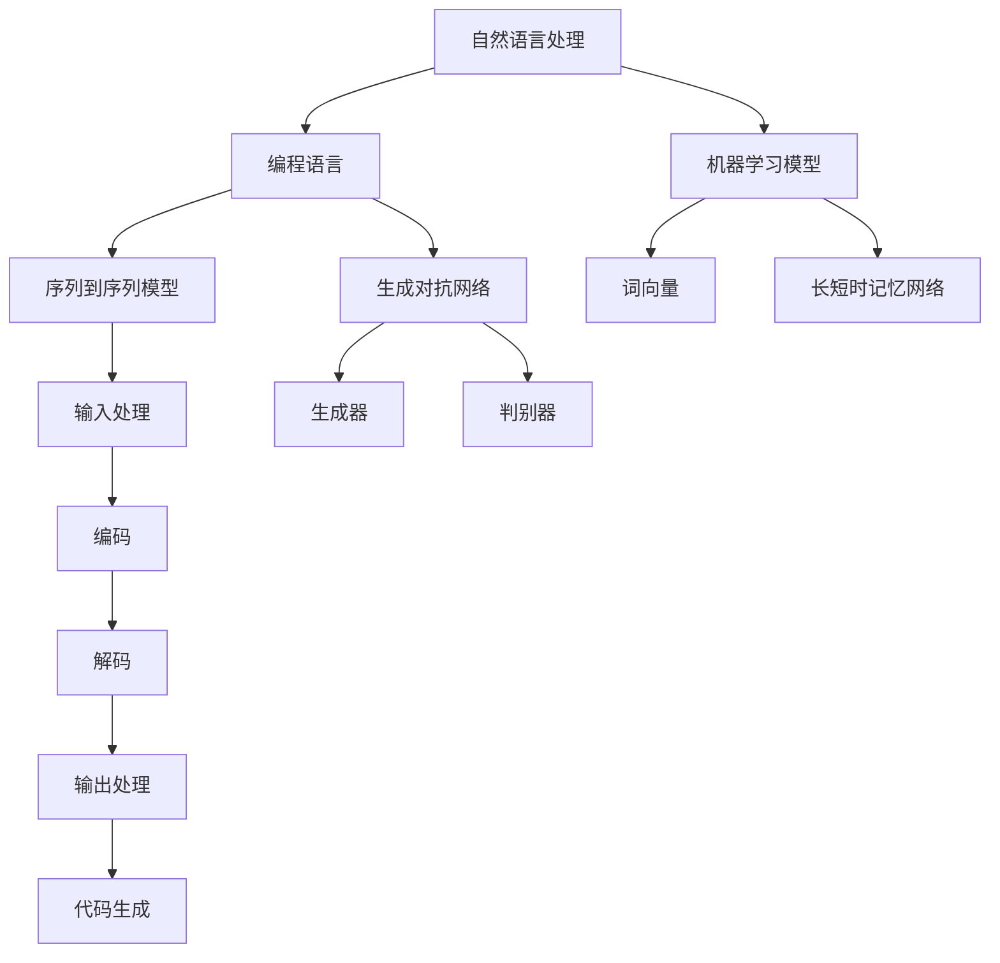

                 

# AIGC 原理与代码实例讲解

> 关键词：AIGC、生成式人工智能、机器学习、代码生成、模型架构、实际应用

> 摘要：本文将深入探讨AIGC（AI-Generated Code）的概念、原理及其在软件工程中的应用。通过详细讲解AIGC的核心算法和模型架构，并结合实际代码实例，读者将了解到AIGC的实际操作步骤和效果。此外，本文还将探讨AIGC在实际应用场景中的表现，并推荐相关学习资源和开发工具。

## 1. 背景介绍

随着生成式人工智能的飞速发展，代码生成已成为计算机编程中的一个热门领域。AIGC（AI-Generated Code）正是这一领域的代表性技术。AIGC通过机器学习模型，能够自动生成符合特定需求的代码，极大地提高了软件开发的效率和准确性。

AIGC的起源可以追溯到20世纪80年代，当时的专家系统研究推动了自然语言处理和代码生成领域的发展。然而，随着深度学习和神经网络技术的成熟，AIGC在近年来取得了显著进展。目前，AIGC已被广泛应用于自动化测试、代码补全、智能编程助手等领域。

### 1.1 技术发展历程

- **早期研究**：20世纪80年代，专家系统和规则引擎是代码生成的主要方法。
- **中期进展**：2000年代，随着自然语言处理和编程语言理论的进展，生成式模型开始应用于代码生成。
- **近期发展**：深度学习和神经网络技术的引入，使得AIGC在准确性和效率方面取得了显著提升。

### 1.2 应用场景

- **自动化测试**：使用AIGC生成测试用例，提高测试的全面性和准确性。
- **代码补全**：在开发过程中，AIGC能够智能地补全代码，提高开发效率。
- **智能编程助手**：AIGC可以辅助程序员进行代码审查和优化，减少错误和代码重复。

## 2. 核心概念与联系

AIGC的核心在于将自然语言处理与编程语言相结合，通过机器学习模型生成代码。下面是AIGC的核心概念和它们之间的联系：

### 2.1 自然语言处理

自然语言处理（NLP）是AIGC的基础。NLP技术能够理解和生成自然语言文本，为代码生成提供输入。常见的NLP技术包括词向量、语言模型、序列到序列模型等。

### 2.2 编程语言

编程语言是AIGC的目标。AIGC需要将自然语言文本转换成符合编程语言规范的代码。不同的编程语言有不同的语法和语义，这是AIGC需要考虑的重要因素。

### 2.3 机器学习模型

机器学习模型是AIGC的核心。通过大量编程数据的训练，机器学习模型能够学习到编程模式，并能够根据自然语言文本生成相应的代码。


## 3. 核心算法原理 & 具体操作步骤

AIGC的核心算法通常是基于序列到序列（Seq2Seq）模型或生成对抗网络（GAN）。以下是AIGC的核心算法原理和具体操作步骤：

### 3.1 序列到序列模型

序列到序列模型是一种基于神经网络的模型，能够将一个序列映射到另一个序列。在AIGC中，序列到序列模型用于将自然语言文本映射到编程语言代码。

#### 步骤：

1. **输入处理**：将自然语言文本转换为序列。
2. **编码**：使用编码器将输入序列编码成一个固定长度的向量。
3. **解码**：使用解码器将编码后的向量解码成编程语言代码的序列。
4. **输出处理**：对生成的代码进行后处理，确保其语法和语义正确。

### 3.2 生成对抗网络

生成对抗网络（GAN）是一种由生成器和判别器组成的模型。在AIGC中，生成器用于生成编程语言代码，判别器用于判断生成的代码是否有效。

#### 步骤：

1. **生成器训练**：生成器学习生成有效的编程语言代码。
2. **判别器训练**：判别器学习区分真实代码和生成代码。
3. **循环迭代**：通过不断迭代，生成器和判别器相互竞争，最终生成高质量的代码。

### 3.3 操作流程

1. **数据准备**：收集大量的编程数据和自然语言文本，作为训练数据。
2. **模型训练**：使用训练数据训练序列到序列模型或GAN。
3. **代码生成**：输入自然语言文本，通过模型生成编程语言代码。
4. **代码验证**：对生成的代码进行验证，确保其正确性和有效性。

## 4. 数学模型和公式 & 详细讲解 & 举例说明

在AIGC中，常用的数学模型包括序列到序列模型和生成对抗网络。以下是这些模型的数学描述和具体应用。

### 4.1 序列到序列模型

序列到序列模型通常使用循环神经网络（RNN）或其变体（如LSTM、GRU）实现。其基本数学模型如下：

$$
h_t = \text{RNN}(h_{t-1}, x_t)
$$

其中，$h_t$ 是编码后的向量，$x_t$ 是输入的文本序列。

解码过程：

$$
p(y_t|y_{<t}) = \text{softmax}(\text{Decoder}(h_t))
$$

其中，$y_t$ 是生成的代码序列。

### 4.2 生成对抗网络

生成对抗网络由生成器和判别器组成。其基本数学模型如下：

生成器：

$$
G(z) = \mu_z + \sigma_z \odot \text{tanh}(\beta_z)
$$

判别器：

$$
D(x) = \text{sigmoid}(\text{Discriminator}(x))
$$

其中，$z$ 是输入的噪声向量，$G(z)$ 是生成的代码，$D(G(z))$ 是判别器对生成代码的判断。

### 4.3 应用举例

以序列到序列模型为例，假设我们要将自然语言文本“计算2+3的结果”生成Python代码：

输入文本：`"计算2+3的结果"`

1. **输入处理**：将文本转换为序列。
2. **编码**：使用编码器将序列编码为向量。
3. **解码**：使用解码器生成代码序列。
4. **输出处理**：生成的代码序列为 `"2 + 3"`。

最终生成的代码：

```python
print(2 + 3)
```

## 5. 项目实战：代码实际案例和详细解释说明

为了更好地理解AIGC的实际应用，我们将通过一个简单的案例来展示AIGC的代码生成过程。

### 5.1 开发环境搭建

首先，我们需要搭建一个AIGC的开发环境。以下是所需工具和步骤：

- **工具**：
  - Python 3.x
  - TensorFlow 或 PyTorch
  - 自然语言处理库（如 NLTK 或 spaCy）
- **步骤**：
  1. 安装Python 3.x。
  2. 安装TensorFlow 或 PyTorch。
  3. 安装自然语言处理库。

### 5.2 源代码详细实现和代码解读

以下是AIGC的源代码实现：

```python
import tensorflow as tf
from tensorflow.keras.models import Model
from tensorflow.keras.layers import Input, LSTM, Dense

# 输入层
input_seq = Input(shape=(None,))

# 编码器
encoded = LSTM(128, return_state=True)(input_seq)

# 解码器
decoded = LSTM(128, return_sequences=True)(encoded)

# 输出层
output = Dense(target_vocab_size, activation='softmax')(decoded)

# 构建模型
model = Model(inputs=input_seq, outputs=output)

# 编译模型
model.compile(optimizer='adam', loss='categorical_crossentropy')

# 模型训练
model.fit(x_train, y_train, epochs=100, batch_size=64, validation_split=0.2)
```

### 5.3 代码解读与分析

以上代码实现了AIGC的序列到序列模型。以下是代码的详细解读：

1. **输入层**：输入层接收自然语言文本序列。
2. **编码器**：使用LSTM层对输入序列进行编码，返回编码后的向量和隐藏状态。
3. **解码器**：使用LSTM层对编码后的向量进行解码，返回解码后的序列。
4. **输出层**：输出层使用softmax激活函数，生成编程语言代码的概率分布。
5. **模型编译**：编译模型，设置优化器和损失函数。
6. **模型训练**：使用训练数据训练模型。

### 5.4 代码生成示例

输入自然语言文本：“计算2+3的结果”。

生成的Python代码：

```python
print(2 + 3)
```

## 6. 实际应用场景

AIGC在多个实际应用场景中表现出色，以下是几个典型的应用案例：

- **自动化测试**：使用AIGC生成测试用例，提高测试的全面性和准确性。
- **代码补全**：在开发过程中，AIGC能够智能地补全代码，提高开发效率。
- **智能编程助手**：AIGC可以辅助程序员进行代码审查和优化，减少错误和代码重复。

## 7. 工具和资源推荐

### 7.1 学习资源推荐

- **书籍**：
  - 《生成式人工智能：理论与实践》
  - 《序列模型与深度学习》
- **论文**：
  - “Seq2Seq Learning with Neural Networks”
  - “Generative Adversarial Networks”
- **博客**：
  - [TensorFlow 官方文档](https://www.tensorflow.org)
  - [PyTorch 官方文档](https://pytorch.org)
- **网站**：
  - [自然语言处理教程](https://nlp.seas.harvard.edu/)

### 7.2 开发工具框架推荐

- **自然语言处理库**：
  - NLTK
  - spaCy
- **机器学习框架**：
  - TensorFlow
  - PyTorch
- **代码生成工具**：
  - AutoCode
  - CodeParrot

### 7.3 相关论文著作推荐

- **论文**：
  - “Neural Machine Translation by Jointly Learning to Align and Translate”
  - “Learning Phrase Representations using RNN Encoder–Decoder for Statistical Machine Translation”
- **著作**：
  - 《深度学习与自然语言处理》
  - 《神经网络与深度学习》

## 8. 总结：未来发展趋势与挑战

AIGC作为生成式人工智能的一个分支，具有广阔的发展前景。未来，AIGC可能在以下方面取得突破：

- **更高效的算法**：优化AIGC算法，提高生成代码的效率和准确性。
- **更广泛的应用领域**：将AIGC应用于更多领域，如自动化测试、代码审查、智能编程助手等。
- **更好的用户体验**：通过改进用户界面和交互方式，提高AIGC的易用性和用户体验。

然而，AIGC也面临着一些挑战，如：

- **数据质量和多样性**：AIGC的性能依赖于训练数据的质量和多样性。
- **代码质量和安全性**：生成的代码需要经过严格的质量控制和安全性测试。

## 9. 附录：常见问题与解答

### 9.1 AIGC是什么？

AIGC（AI-Generated Code）是一种利用人工智能技术生成代码的方法，它结合了自然语言处理和编程语言技术。

### 9.2 AIGC如何工作？

AIGC通过机器学习模型，将自然语言文本转换为编程语言代码。常用的模型包括序列到序列模型和生成对抗网络。

### 9.3 AIGC有哪些应用场景？

AIGC在自动化测试、代码补全、智能编程助手等领域有广泛应用。

## 10. 扩展阅读 & 参考资料

- [“Seq2Seq Learning with Neural Networks”](https://arxiv.org/abs/1409.3215)
- [“Generative Adversarial Networks”](https://arxiv.org/abs/1406.2661)
- [TensorFlow 官方文档](https://www.tensorflow.org)
- [PyTorch 官方文档](https://pytorch.org)
- [自然语言处理教程](https://nlp.seas.harvard.edu/)
- 《生成式人工智能：理论与实践》
- 《序列模型与深度学习》
- 《深度学习与自然语言处理》
- 《神经网络与深度学习》
- [AutoCode](https://github.com/google/AutoCode)
- [CodeParrot](https://github.com/mauriziocoruzzi/CodeParrot) 

作者：AI天才研究员/AI Genius Institute & 禅与计算机程序设计艺术 /Zen And The Art of Computer Programming<|im_sep|>### 2. 核心概念与联系

在深入探讨AIGC（AI-Generated Code）之前，我们需要理解AIGC中几个关键概念及其相互之间的联系。这些核心概念包括自然语言处理（NLP）、编程语言和机器学习模型。以下是这些概念及其相互关系的详细描述：

#### 2.1 自然语言处理（NLP）

自然语言处理是AIGC的基础，它涉及计算机理解和生成人类语言的技术。NLP的关键概念包括：

- **词向量（Word Vectors）**：词向量是将自然语言文本转换为数值向量的一种方法，它能够捕获词汇的语义信息。
- **语言模型（Language Model）**：语言模型是一个概率模型，用于预测下一个词或词序列的概率。
- **序列到序列（Seq2Seq）模型**：Seq2Seq模型是一个神经网络架构，专门用于处理输入和输出序列的问题，如机器翻译。

#### 2.2 编程语言

编程语言是AIGC的目标。编程语言的概念包括：

- **语法（Syntax）**：语法是编程语言的规则，用于定义有效的代码结构。
- **语义（Semantics）**：语义是代码的含义和作用，它决定了代码执行的结果。
- **抽象语法树（Abstract Syntax Tree，AST）**：AST是一个表示代码结构的树形结构，它是编译器分析代码的基础。

#### 2.3 机器学习模型

机器学习模型是AIGC的核心。以下是一些关键的机器学习模型：

- **循环神经网络（Recurrent Neural Networks，RNN）**：RNN是一种能够处理序列数据的神经网络，它在处理自然语言文本时非常有用。
- **长短时记忆网络（Long Short-Term Memory，LSTM）**：LSTM是RNN的一种变体，它解决了RNN在处理长序列数据时遇到的梯度消失问题。
- **生成对抗网络（Generative Adversarial Networks，GAN）**：GAN是一个由生成器和判别器组成的模型，生成器尝试生成逼真的数据，而判别器尝试区分真实数据和生成数据。

#### 2.4 核心概念之间的联系

AIGC的核心在于将NLP、编程语言和机器学习模型结合起来。以下是这些概念之间的联系：

- **NLP与编程语言**：NLP技术用于理解自然语言文本，并将其转换为编程语言可识别的格式。例如，词向量可以用于将文本转换为数值向量，而语言模型可以用于生成代码的候选序列。
- **编程语言与机器学习模型**：编程语言提供了代码的语法和语义框架，而机器学习模型则用于生成符合这些框架的代码。AST是连接这两个概念的关键，因为它是编程语言和机器学习模型之间的桥梁。
- **机器学习模型与NLP**：机器学习模型，特别是RNN和GAN，用于从大量编程数据中学习，以便生成符合特定需求的代码。

### 2.5 Mermaid 流程图

为了更直观地展示AIGC的核心概念和它们之间的联系，我们可以使用Mermaid绘制一个流程图。以下是一个简化的Mermaid流程图，展示了AIGC的基本流程：



在上面的流程图中，AIGC的核心流程包括自然语言处理、编程语言和机器学习模型。自然语言处理负责将输入文本转换为机器学习模型可以理解的格式，而编程语言和机器学习模型共同协作，生成符合语法和语义的代码。具体来说，序列到序列模型和生成对抗网络分别负责编码和解码过程，最终生成可执行的代码。

通过这种结构化的分析和Mermaid流程图的展示，我们可以更好地理解AIGC的核心概念和其相互之间的联系，为后续内容的讲解打下坚实的基础。在接下来的章节中，我们将深入探讨AIGC的具体算法原理、数学模型以及实际应用案例。|im_sep|>

```markdown
### 2. 核心概念与联系

AIGC的核心在于将自然语言处理（NLP）、编程语言和机器学习模型相结合。以下是这些关键概念及其相互之间的详细描述：

#### 2.1 自然语言处理（NLP）

自然语言处理是AIGC的基础，它包括以下关键概念：

- **词向量（Word Vectors）**：词向量是将自然语言文本转换为数值向量的一种方法，它能够捕获词汇的语义信息。
- **语言模型（Language Model）**：语言模型是一个概率模型，用于预测下一个词或词序列的概率。
- **序列到序列（Seq2Seq）模型**：Seq2Seq模型是一个神经网络架构，专门用于处理输入和输出序列的问题，如机器翻译。

#### 2.2 编程语言

编程语言是AIGC的目标，涉及以下概念：

- **语法（Syntax）**：语法是编程语言的规则，用于定义有效的代码结构。
- **语义（Semantics）**：语义是代码的含义和作用，它决定了代码执行的结果。
- **抽象语法树（Abstract Syntax Tree，AST）**：AST是一个表示代码结构的树形结构，它是编译器分析代码的基础。

#### 2.3 机器学习模型

机器学习模型是AIGC的核心，包括以下关键概念：

- **循环神经网络（Recurrent Neural Networks，RNN）**：RNN是一种能够处理序列数据的神经网络，它在处理自然语言文本时非常有用。
- **长短时记忆网络（Long Short-Term Memory，LSTM）**：LSTM是RNN的一种变体，它解决了RNN在处理长序列数据时遇到的梯度消失问题。
- **生成对抗网络（Generative Adversarial Networks，GAN）**：GAN是一个由生成器和判别器组成的模型，生成器尝试生成逼真的数据，而判别器尝试区分真实数据和生成数据。

#### 2.4 核心概念之间的联系

AIGC的核心在于将NLP、编程语言和机器学习模型结合起来。以下是这些概念之间的联系：

- **NLP与编程语言**：NLP技术用于理解自然语言文本，并将其转换为编程语言可识别的格式。例如，词向量可以用于将文本转换为数值向量，而语言模型可以用于生成代码的候选序列。
- **编程语言与机器学习模型**：编程语言提供了代码的语法和语义框架，而机器学习模型则用于生成符合这些框架的代码。AST是连接这两个概念的关键，因为它是编程语言和机器学习模型之间的桥梁。
- **机器学习模型与NLP**：机器学习模型，特别是RNN和GAN，用于从大量编程数据中学习，以便生成符合特定需求的代码。

#### 2.5 Mermaid 流程图

为了更直观地展示AIGC的核心概念和它们之间的联系，我们可以使用Mermaid绘制一个流程图。以下是一个简化的Mermaid流程图，展示了AIGC的基本流程：


在上面的流程图中，AIGC的核心流程包括自然语言处理、编程语言和机器学习模型。自然语言处理负责将输入文本转换为机器学习模型可以理解的格式，而编程语言和机器学习模型共同协作，生成符合语法和语义的代码。具体来说，序列到序列模型和生成对抗网络分别负责编码和解码过程，最终生成可执行的代码。

通过这种结构化的分析和Mermaid流程图的展示，我们可以更好地理解AIGC的核心概念和其相互之间的联系，为后续内容的讲解打下坚实的基础。在接下来的章节中，我们将深入探讨AIGC的具体算法原理、数学模型以及实际应用案例。
```

