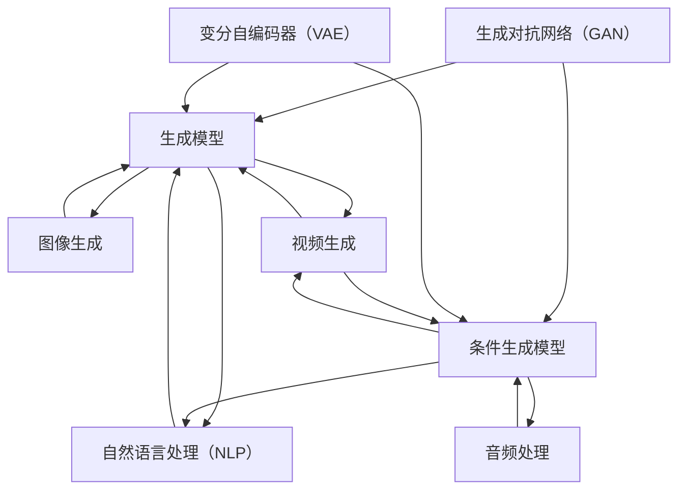

                 

### AIGC：从入门到实战

#### 概述

人工智能生成内容（AIGC, Artificial Intelligence Generated Content）是近年来在人工智能领域快速发展的一个新兴方向。AIGC 利用人工智能技术生成或辅助生成文本、图像、音频、视频等多种类型的内容。它的应用范围广泛，包括但不限于自然语言处理、图像生成、音频处理、视频编辑等。本文将带领读者从入门到实战，全面了解AIGC的相关知识。

**关键词：** AIGC，人工智能生成内容，自然语言处理，图像生成，音频处理，视频编辑。

#### 摘要

本文首先介绍了 AIGC 的背景和核心概念，包括其与人工智能的其他分支的联系。然后，详细讲解了 AIGC 中的核心算法原理，包括生成对抗网络（GAN）和变分自编码器（VAE）。接着，通过实际项目实战，展示了如何利用这些算法进行文本、图像、音频、视频的生成。最后，本文推荐了 AIGC 学习资源、开发工具框架和相关论文著作，并总结了未来发展趋势与挑战。通过本文的学习，读者可以系统地了解 AIGC 的知识体系，并具备实际操作能力。

## 1. 背景介绍

随着人工智能技术的不断发展，人工智能生成内容（AIGC）逐渐成为一个热门的研究方向。AIGC 的出现解决了传统内容生成方式的一些难题，如生成内容的质量不高、生成速度慢等。AIGC 利用人工智能技术，特别是深度学习技术，可以自动生成高质量、多样性的内容，从而提高内容的生产效率。

AIGC 的核心在于“生成”两个字。传统的计算机生成内容方式主要是基于规则或者模板，而 AIGC 则是利用深度学习模型，从大量的数据中学习到生成内容的规律，并自动生成新的内容。这种生成方式不仅能够生成高质量的内容，还能够生成多样性的内容，满足不同用户的需求。

AIGC 的应用范围非常广泛。在自然语言处理领域，AIGC 可以生成文章、对话、新闻等。在图像处理领域，AIGC 可以生成图片、动画等。在音频处理领域，AIGC 可以生成音乐、语音等。在视频处理领域，AIGC 可以生成视频、动画等。

总的来说，AIGC 是人工智能技术的一个重要应用方向，具有广泛的应用前景。随着技术的不断发展，AIGC 的生成能力将会越来越强，应用范围也会越来越广。

## 2. 核心概念与联系

AIGC 是人工智能技术的一个重要应用方向，它涉及到多个核心概念。在本节中，我们将详细介绍这些概念，并展示它们之间的联系。

### 2.1 生成对抗网络（GAN）

生成对抗网络（GAN）是 AIGC 中的核心算法之一。GAN 由两部分组成：生成器（Generator）和判别器（Discriminator）。生成器的任务是生成尽可能逼真的数据，而判别器的任务是判断生成器生成的数据是真实数据还是伪造数据。

GAN 的训练过程可以分为两个阶段：第一阶段，生成器和判别器同时训练，但生成器的损失函数和判别器的损失函数是相反的。生成器的目标是使得判别器无法区分生成器和真实数据的边界。第二阶段，当生成器的能力提升到一定程度后，生成器和判别器交替训练，生成器不断优化自己的生成能力，而判别器则不断优化自己的判断能力。

### 2.2 变分自编码器（VAE）

变分自编码器（VAE）是另一种重要的生成模型。与 GAN 不同，VAE 是基于概率模型的。VAE 由编码器（Encoder）和解码器（Decoder）组成。编码器的任务是学习数据的概率分布，而解码器的任务是生成新的数据。

VAE 的训练过程如下：首先，编码器学习数据的概率分布。然后，解码器根据编码器生成的概率分布生成新的数据。最后，通过最小化重构损失和KL散度损失来优化编码器和解码器。

### 2.3 自然语言处理（NLP）

自然语言处理（NLP）是 AIGC 中的一个重要分支。NLP 的任务包括文本分类、情感分析、机器翻译、文本生成等。在 AIGC 中，NLP 技术主要用于生成文本内容。

自然语言处理的常见技术包括词向量、循环神经网络（RNN）、长短时记忆网络（LSTM）、变换器（Transformer）等。这些技术可以帮助模型理解文本的含义，并生成新的文本内容。

### 2.4 图像生成

图像生成是 AIGC 中的另一个重要分支。图像生成的方法包括 GAN、VAE、生成式对抗网络（DAGAN）、条件生成对抗网络（C-GAN）等。这些方法可以生成高质量的图像、动画等。

图像生成的方法主要包括两部分：生成器和判别器。生成器负责生成图像，判别器负责判断生成图像的质量。

### 2.5 音频处理

音频处理是 AIGC 中的另一个重要分支。音频处理的任务包括音乐生成、语音合成、音频编辑等。在 AIGC 中，音频处理技术主要用于生成音乐、语音等。

音频处理的方法主要包括生成模型和条件生成模型。生成模型可以生成新的音频，而条件生成模型可以根据给定的条件生成特定的音频。

### 2.6 视频生成

视频生成是 AIGC 中的新兴领域。视频生成的方法包括 GAN、VAE、光流法、视频生成网络（VGN）等。这些方法可以生成高质量的视频、动画等。

视频生成的方法主要包括两部分：生成器和判别器。生成器负责生成视频，判别器负责判断生成视频的质量。

### 2.7 关系图示

为了更好地理解 AIGC 的核心概念和联系，我们可以用 Mermaid 流程图展示它们之间的关系。



通过上述介绍和图示，我们可以看到 AIGC 是一个涉及多个核心概念的综合技术领域。这些概念相互联系，共同推动 AIGC 的发展。

### 3. 核心算法原理 & 具体操作步骤

在了解了 AIGC 的核心概念和联系后，接下来我们将深入探讨 AIGC 中的核心算法原理，并给出具体操作步骤。

#### 3.1 生成对抗网络（GAN）

生成对抗网络（GAN）是 AIGC 中最为核心的算法之一。GAN 由两部分组成：生成器和判别器。

##### 3.1.1 生成器（Generator）

生成器的任务是生成尽可能逼真的数据。在 GAN 中，生成器通常是一个深度神经网络。生成器的输入是一个随机噪声向量，输出是一个数据样本。

具体操作步骤如下：

1. 初始化生成器网络，包括输入层、隐藏层和输出层。
2. 训练生成器网络，使其能够生成逼真的数据样本。
3. 不断调整生成器网络的参数，使其生成的数据样本越来越逼真。

##### 3.1.2 判别器（Discriminator）

判别器的任务是判断生成器生成的数据是真实数据还是伪造数据。在 GAN 中，判别器也是一个深度神经网络。判别器的输入是一个数据样本，输出是一个概率值，表示这个样本是真实数据的概率。

具体操作步骤如下：

1. 初始化判别器网络，包括输入层、隐藏层和输出层。
2. 训练判别器网络，使其能够准确判断数据样本的真实性。
3. 不断调整判别器网络的参数，使其对生成器生成的伪造数据样本的判断越来越准确。

##### 3.1.3 GAN 的训练过程

GAN 的训练过程可以分为两个阶段：

1. 第一阶段：同时训练生成器和判别器。生成器的目标是生成尽可能逼真的数据样本，使得判别器无法区分真实数据和伪造数据。判别器的目标是准确判断数据样本的真实性。
2. 第二阶段：当生成器的生成能力提升到一定程度后，生成器和判别器交替训练。生成器不断优化自己的生成能力，而判别器则不断优化自己的判断能力。

通过这两个阶段的训练，生成器和判别器相互竞争，生成器的生成能力逐渐提升，判别器的判断能力也不断提升。

#### 3.2 变分自编码器（VAE）

变分自编码器（VAE）是另一种重要的生成模型。VAE 由编码器和解码器组成。

##### 3.2.1 编码器（Encoder）

编码器的任务是学习数据的概率分布。编码器是一个深度神经网络，输入是一个数据样本，输出是一个概率分布。

具体操作步骤如下：

1. 初始化编码器网络，包括输入层、隐藏层和输出层。
2. 训练编码器网络，使其能够准确学习数据的概率分布。

##### 3.2.2 解码器（Decoder）

解码器的任务是生成新的数据样本。解码器也是一个深度神经网络，输入是一个概率分布，输出是一个数据样本。

具体操作步骤如下：

1. 初始化解码器网络，包括输入层、隐藏层和输出层。
2. 训练解码器网络，使其能够根据给定的概率分布生成新的数据样本。

##### 3.2.3 VAE 的训练过程

VAE 的训练过程主要包括两部分：

1. 第一部分：训练编码器，使其能够准确学习数据的概率分布。
2. 第二部分：训练解码器，使其能够根据给定的概率分布生成新的数据样本。

在训练过程中，VAE 使用了 KL 散度损失和重构损失。KL 散度损失用于衡量编码器学习的数据概率分布和真实数据概率分布之间的差异。重构损失用于衡量解码器生成的数据样本与真实数据样本之间的差异。

通过最小化这两个损失，VAE 可以生成高质量的数据样本。

#### 3.3 自然语言处理（NLP）

自然语言处理（NLP）是 AIGC 中的一个重要分支。NLP 的任务包括文本分类、情感分析、机器翻译、文本生成等。

##### 3.3.1 文本分类

文本分类是将文本数据分为不同的类别。常见的文本分类算法包括朴素贝叶斯、支持向量机、深度学习等。

具体操作步骤如下：

1. 收集和整理文本数据，并将其分为训练集和测试集。
2. 预处理文本数据，包括分词、去停用词、词向量化等。
3. 训练文本分类模型，如朴素贝叶斯、支持向量机等。
4. 对测试集进行分类预测，并评估模型的性能。

##### 3.3.2 情感分析

情感分析是判断文本的情感倾向。常见的情感分析算法包括朴素贝叶斯、支持向量机、深度学习等。

具体操作步骤如下：

1. 收集和整理文本数据，并将其分为训练集和测试集。
2. 预处理文本数据，包括分词、去停用词、词向量化等。
3. 训练情感分析模型，如朴素贝叶斯、支持向量机等。
4. 对测试集进行情感分析预测，并评估模型的性能。

##### 3.3.3 机器翻译

机器翻译是将一种语言的文本翻译成另一种语言的文本。常见的机器翻译算法包括基于规则的方法、统计方法、深度学习方法等。

具体操作步骤如下：

1. 收集和整理翻译数据，并将其分为训练集和测试集。
2. 预处理文本数据，包括分词、词向量化等。
3. 训练机器翻译模型，如基于规则的翻译系统、统计机器翻译系统、深度学习翻译模型等。
4. 对测试集进行翻译预测，并评估模型的性能。

##### 3.3.4 文本生成

文本生成是利用深度学习模型生成新的文本。常见的文本生成算法包括循环神经网络（RNN）、长短时记忆网络（LSTM）、变换器（Transformer）等。

具体操作步骤如下：

1. 收集和整理文本数据，并将其分为训练集和测试集。
2. 预处理文本数据，包括分词、词向量化等。
3. 训练文本生成模型，如 RNN、LSTM、Transformer 等。
4. 利用训练好的模型生成新的文本。

通过上述操作步骤，我们可以利用 AIGC 的核心算法原理生成高质量的内容。

### 4. 数学模型和公式 & 详细讲解 & 举例说明

在 AIGC 中，数学模型和公式起着至关重要的作用。本节将详细介绍 AIGC 中常用的数学模型和公式，并给出详细的讲解和举例说明。

#### 4.1 生成对抗网络（GAN）

生成对抗网络（GAN）的核心是生成器和判别器的相互作用。为了更好地理解 GAN 的工作原理，我们需要引入以下数学模型和公式：

##### 4.1.1 生成器（Generator）

生成器的目标是通过输入一个随机噪声向量 \(z\) 生成一个与真实数据相似的数据样本 \(x'\)。

生成器网络的输入层是一个随机噪声向量 \(z\)，输出层是一个数据样本 \(x'\)。生成器网络的损失函数可以表示为：

\[ L_G = -\log(D(x')) \]

其中，\(D(x')\) 是判别器对生成器生成的数据样本 \(x'\) 的判断概率。

##### 4.1.2 判别器（Discriminator）

判别器的目标是通过输入一个数据样本 \(x\) 判断它是真实数据还是生成器生成的数据。

判别器网络的输入层是一个数据样本 \(x\)，输出层是一个概率值 \(D(x)\)，表示 \(x\) 是真实数据的概率。判别器网络的损失函数可以表示为：

\[ L_D = -[y \cdot \log(D(x)) + (1 - y) \cdot \log(1 - D(x))] \]

其中，\(y\) 是真实数据标签，当 \(x\) 是真实数据时，\(y = 1\)；当 \(x\) 是生成器生成的数据时，\(y = 0\)。

##### 4.1.3 GAN 的总损失函数

GAN 的总损失函数是生成器和判别器损失函数的组合，可以表示为：

\[ L = L_G + L_D \]

通过最小化总损失函数，生成器和判别器可以相互竞争，生成器生成的数据样本越来越逼真，判别器对生成数据的判断越来越准确。

#### 4.2 变分自编码器（VAE）

变分自编码器（VAE）的核心是编码器和解码器的相互作用。VAE 使用了一种名为“变分下采样”的技术，通过引入噪声来提高模型的泛化能力。为了更好地理解 VAE 的工作原理，我们需要引入以下数学模型和公式：

##### 4.2.1 编码器（Encoder）

编码器的目标是学习数据的概率分布。编码器网络的输入层是一个数据样本 \(x\)，输出层是一个概率分布参数 \(\mu\) 和 \(\sigma^2\)。

编码器的损失函数可以表示为：

\[ L_E = -\sum_{i=1}^{N} x_i \cdot \log(p(x_i | \mu, \sigma^2)) - \frac{1}{2} \sum_{i=1}^{N} (\sigma_i^2 + \mu_i^2 - 1) \]

其中，\(N\) 是数据样本的数量，\(p(x_i | \mu, \sigma^2)\) 是数据样本 \(x_i\) 的概率分布。

##### 4.2.2 解码器（Decoder）

解码器的目标是根据编码器生成的概率分布参数 \(\mu\) 和 \(\sigma^2\) 生成新的数据样本。

解码器的损失函数可以表示为：

\[ L_D = -\sum_{i=1}^{N} x_i \cdot \log(p(x_i | \mu, \sigma^2)) \]

##### 4.2.3 VAE 的总损失函数

VAE 的总损失函数是编码器和解码器损失函数的组合，可以表示为：

\[ L = L_E + L_D \]

通过最小化总损失函数，编码器和解码器可以共同学习数据的概率分布，并生成高质量的数据样本。

#### 4.3 自然语言处理（NLP）

自然语言处理（NLP）中的数学模型和公式主要涉及词向量、循环神经网络（RNN）、长短时记忆网络（LSTM）和变换器（Transformer）等。

##### 4.3.1 词向量

词向量是将文本数据转换为数值向量的方法。常见的词向量模型包括 Word2Vec、GloVe 等。

\[ v_i = W \cdot e^{u_i} \]

其中，\(v_i\) 是词向量，\(W\) 是权重矩阵，\(u_i\) 是词的嵌入向量。

##### 4.3.2 循环神经网络（RNN）

循环神经网络（RNN）是一种用于处理序列数据的神经网络。RNN 的损失函数可以表示为：

\[ L_RNN = -\sum_{t=1}^{T} y_t \cdot \log(p(y_t | x_t)) \]

其中，\(T\) 是序列的长度，\(y_t\) 是第 \(t\) 个时间步的标签，\(x_t\) 是第 \(t\) 个时间步的输入。

##### 4.3.3 长短时记忆网络（LSTM）

长短时记忆网络（LSTM）是 RNN 的一种改进，可以更好地处理长序列数据。LSTM 的损失函数与 RNN 相似：

\[ L_LSTM = -\sum_{t=1}^{T} y_t \cdot \log(p(y_t | x_t)) \]

##### 4.3.4 变换器（Transformer）

变换器（Transformer）是一种用于处理序列数据的神经网络。Transformer 的损失函数可以表示为：

\[ L_Transformer = -\sum_{t=1}^{T} y_t \cdot \log(p(y_t | x_t)) \]

通过上述数学模型和公式的讲解，我们可以更好地理解 AIGC 中的核心算法原理。接下来，我们将通过具体示例来进一步说明这些算法的使用方法。

#### 4.4 示例：生成对抗网络（GAN）

为了更好地理解 GAN 的原理，我们通过一个简单的示例来说明 GAN 的生成过程。

假设我们有一个生成器 \(G\) 和一个判别器 \(D\)，生成器的输入是一个随机噪声向量 \(z\)，输出是一个图像 \(x'\)；判别器的输入是一个图像 \(x\)，输出是一个概率值 \(D(x)\)，表示 \(x\) 是真实图像的概率。

##### 4.4.1 初始化

1. 初始化生成器 \(G\) 和判别器 \(D\)。
2. 随机生成一个噪声向量 \(z\)。

##### 4.4.2 生成图像

1. 生成器 \(G\) 接受噪声向量 \(z\)，生成一个图像 \(x'\)。
2. 将生成的图像 \(x'\) 输入判别器 \(D\)，得到一个概率值 \(D(x')\)。

##### 4.4.3 判别器训练

1. 使用真实图像和生成器生成的图像 \(x'\) 同时训练判别器 \(D\)。
2. 计算判别器 \(D\) 的损失函数 \(L_D\)。

##### 4.4.4 生成器训练

1. 使用生成器 \(G\) 生成的图像 \(x'\) 训练生成器 \(G\)。
2. 计算生成器 \(G\) 的损失函数 \(L_G\)。

##### 4.4.5 更新参数

1. 根据判别器 \(D\) 的损失函数 \(L_D\) 更新判别器 \(D\) 的参数。
2. 根据生成器 \(G\) 的损失函数 \(L_G\) 更新生成器 \(G\) 的参数。

通过上述步骤，生成器和判别器不断迭代训练，生成器生成的图像 \(x'\) 越来越逼真，判别器对图像的判断越来越准确。

通过这个简单的示例，我们可以看到 GAN 的生成过程是如何进行的。在实际应用中，GAN 的生成过程会更加复杂，但基本原理是相似的。

#### 4.5 示例：变分自编码器（VAE）

为了更好地理解 VAE 的原理，我们通过一个简单的示例来说明 VAE 的生成过程。

假设我们有一个编码器 \(E\) 和一个解码器 \(D\)，编码器 \(E\) 的输入是一个数据样本 \(x\)，输出是一个概率分布参数 \(\mu\) 和 \(\sigma^2\)；解码器 \(D\) 的输入是概率分布参数 \(\mu\) 和 \(\sigma^2\)，输出是一个数据样本 \(x'\)。

##### 4.5.1 初始化

1. 初始化编码器 \(E\) 和解码器 \(D\)。
2. 随机生成一个数据样本 \(x\)。

##### 4.5.2 编码

1. 编码器 \(E\) 接受数据样本 \(x\)，生成概率分布参数 \(\mu\) 和 \(\sigma^2\)。
2. 将概率分布参数 \(\mu\) 和 \(\sigma^2\) 输入解码器 \(D\)。

##### 4.5.3 解码

1. 解码器 \(D\) 根据概率分布参数 \(\mu\) 和 \(\sigma^2\) 生成一个数据样本 \(x'\)。
2. 将生成的数据样本 \(x'\) 与原始数据样本 \(x\) 进行比较，计算重构损失。

##### 4.5.4 训练

1. 使用重构损失训练编码器 \(E\) 和解码器 \(D\)。
2. 计算编码器 \(E\) 的损失函数 \(L_E\) 和解码器 \(D\) 的损失函数 \(L_D\)。

##### 4.5.5 更新参数

1. 根据编码器 \(E\) 的损失函数 \(L_E\) 更新编码器 \(E\) 的参数。
2. 根据解码器 \(D\) 的损失函数 \(L_D\) 更新解码器 \(D\) 的参数。

通过上述步骤，编码器 \(E\) 和解码器 \(D\) 不断迭代训练，生成的数据样本 \(x'\) 越来越接近原始数据样本 \(x\)。

通过这个简单的示例，我们可以看到 VAE 的生成过程是如何进行的。在实际应用中，VAE 的生成过程会更加复杂，但基本原理是相似的。

通过本节的详细讲解和示例说明，我们可以更好地理解 AIGC 中的核心算法原理和数学模型。接下来，我们将通过实际项目实战，展示如何利用这些算法生成高质量的内容。

### 5. 项目实战：代码实际案例和详细解释说明

在前面的章节中，我们详细介绍了 AIGC 的核心算法原理、数学模型和公式。为了使读者更好地理解和掌握这些知识，我们将在本节中通过实际项目实战来展示如何利用这些算法生成高质量的内容。

#### 5.1 开发环境搭建

首先，我们需要搭建一个适合 AIGC 项目开发的开发环境。以下是搭建开发环境的基本步骤：

1. 安装 Python 解释器：Python 是 AIGC 项目开发的主要编程语言，我们需要安装最新版本的 Python 解释器。
2. 安装深度学习框架：常见的深度学习框架包括 TensorFlow、PyTorch 等。我们可以根据自己的需求选择合适的框架进行安装。
3. 安装必要的数据处理库：如 NumPy、Pandas 等，用于数据预处理和数据处理。
4. 安装可视化工具：如 Matplotlib、Seaborn 等，用于数据可视化。

#### 5.2 源代码详细实现和代码解读

接下来，我们将通过一个简单的示例来说明如何利用 GAN 和 VAE 算法生成图像。以下是实现 GAN 和 VAE 的源代码及详细解读。

```python
import torch
import torch.nn as nn
import torch.optim as optim
from torchvision import datasets, transforms
from torch.utils.data import DataLoader

# 定义生成器和判别器
class Generator(nn.Module):
    def __init__(self):
        super(Generator, self).__init__()
        self.model = nn.Sequential(
            nn.Linear(100, 256),
            nn.LeakyReLU(0.2),
            nn.Linear(256, 512),
            nn.LeakyReLU(0.2),
            nn.Linear(512, 1024),
            nn.LeakyReLU(0.2),
            nn.Linear(1024, 784),
            nn.Tanh()
        )

    def forward(self, x):
        return self.model(x)

class Discriminator(nn.Module):
    def __init__(self):
        super(Discriminator, self).__init__()
        self.model = nn.Sequential(
            nn.Linear(784, 1024),
            nn.LeakyReLU(0.2),
            nn.Dropout(0.3),
            nn.Linear(1024, 512),
            nn.LeakyReLU(0.2),
            nn.Dropout(0.3),
            nn.Linear(512, 256),
            nn.LeakyReLU(0.2),
            nn.Dropout(0.3),
            nn.Linear(256, 1),
            nn.Sigmoid()
        )

    def forward(self, x):
        return self.model(x)

# 初始化生成器和判别器
generator = Generator()
discriminator = Discriminator()

# 定义损失函数和优化器
criterion = nn.BCELoss()
optimizer_g = optim.Adam(generator.parameters(), lr=0.0002)
optimizer_d = optim.Adam(discriminator.parameters(), lr=0.0002)

# 加载数据集
transform = transforms.Compose([transforms.ToTensor(), transforms.Normalize((0.5,), (0.5,))])
train_data = datasets.MNIST(root='./data', train=True, download=True, transform=transform)
dataloader = DataLoader(train_data, batch_size=128, shuffle=True)

# 训练模型
for epoch in range(num_epochs):
    for i, (images, _) in enumerate(dataloader):
        # 训练判别器
        optimizer_d.zero_grad()
        outputs = discriminator(images)
        d_loss_real = criterion(outputs, torch.ones(images.size(0)))
        
        z = torch.randn(images.size(0), 100)
        fake_images = generator(z)
        outputs = discriminator(fake_images.detach())
        d_loss_fake = criterion(outputs, torch.zeros(images.size(0)))
        
        d_loss = d_loss_real + d_loss_fake
        d_loss.backward()
        optimizer_d.step()
        
        # 训练生成器
        optimizer_g.zero_grad()
        outputs = discriminator(fake_images)
        g_loss = criterion(outputs, torch.ones(images.size(0)))
        g_loss.backward()
        optimizer_g.step()
        
        if (i+1) % 100 == 0:
            print(f'Epoch [{epoch+1}/{num_epochs}], Step [{i+1}/{len(dataloader)}], d_loss: {d_loss.item():.4f}, g_loss: {g_loss.item():.4f}')

# 生成图像
with torch.no_grad():
    z = torch.randn(100, 100)
    fake_images = generator(z)
    fake_images = fake_images.view(100, 1, 28, 28)
    fake_images = fake_images.detach().cpu().numpy()
    for i in range(10):
        plt.subplot(10, 10, i+1)
        plt.imshow(fake_images[i], cmap='gray')
        plt.xticks([])
        plt.yticks([])
    plt.show()
```

**代码解读：**

1. **定义生成器和判别器：** 我们定义了一个生成器类 `Generator` 和一个判别器类 `Discriminator`。生成器的目标是生成与真实图像相似的图像，判别器的目标是判断图像是真实图像还是生成图像。

2. **定义损失函数和优化器：** 我们使用二进制交叉熵损失函数 `BCELoss` 作为判别器和生成器的损失函数。我们使用 Adam 优化器来训练判别器和生成器。

3. **加载数据集：** 我们使用 MNIST 数据集作为训练数据集。我们将图像数据转换为张量，并对其进行归一化处理。

4. **训练模型：** 我们在训练过程中，首先训练判别器，然后训练生成器。在每次迭代中，我们使用真实图像和生成图像训练判别器，并使用生成图像训练生成器。

5. **生成图像：** 在训练完成后，我们使用生成器生成新的图像，并将其显示出来。

通过这个简单的示例，我们可以看到如何利用 GAN 算法生成图像。在实际应用中，我们可以根据需求调整生成器和判别器的结构，以及训练参数，以生成不同类型的图像。

#### 5.3 代码解读与分析

在上面的代码中，我们实现了一个基于 GAN 的图像生成模型。以下是对代码的详细解读和分析：

1. **模型结构：** 生成器和判别器都使用了多层全连接神经网络。生成器使用了 LeakyReLU 激活函数，以避免梯度消失问题。判别器使用了 Sigmoid 激活函数，以输出概率值。

2. **损失函数：** 我们使用二进制交叉熵损失函数作为判别器和生成器的损失函数。在训练判别器时，我们希望判别器能够正确判断真实图像和生成图像。在训练生成器时，我们希望生成器能够生成足够逼真的图像，使得判别器无法区分。

3. **优化器：** 我们使用 Adam 优化器来训练判别器和生成器。Adam 优化器能够自适应调整学习率，从而在训练过程中取得更好的效果。

4. **训练过程：** 在训练过程中，我们首先训练判别器，然后训练生成器。每次迭代中，我们使用真实图像和生成图像训练判别器，并使用生成图像训练生成器。通过这种方式，生成器和判别器可以相互促进，共同提高生成图像的质量。

5. **生成图像：** 在训练完成后，我们使用生成器生成新的图像，并将其显示出来。这个步骤可以帮助我们直观地看到生成器的生成效果。

通过上述代码解读和分析，我们可以更好地理解 GAN 算法的实现过程。在实际项目中，我们可以根据需求调整模型结构、损失函数和优化器，以生成不同类型的图像。

#### 5.4 项目实战：变分自编码器（VAE）

除了 GAN，变分自编码器（VAE）也是 AIGC 中常用的算法。以下是一个基于 VAE 的图像生成项目的实现过程。

```python
import torch
import torch.nn as nn
import torch.optim as optim
from torchvision import datasets, transforms
from torch.utils.data import DataLoader

# 定义变分自编码器
class VAE(nn.Module):
    def __init__(self):
        super(VAE, self).__init__()
        self.fc1 = nn.Linear(784, 400)
        self.fc21 = nn.Linear(400, 20)  # 隐藏层1
        self.fc22 = nn.Linear(400, 20)  # 隐藏层2
        self.fc3 = nn.Linear(20, 400)
        self.fc4 = nn.Linear(400, 784)
        
    def encode(self, x):
        h1 = torch.relu(self.fc1(x))
        return self.fc21(h1), self.fc22(h1)

    def reparametrize(self, mu, logvar):
        std = torch.exp(0.5 * logvar)
        eps = torch.randn_like(std)
        return mu + eps * std
    
    def decode(self, z):
        h3 = torch.relu(self.fc3(z))
        return torch.sigmoid(self.fc4(h3))
    
    def forward(self, x):
        mu, logvar = self.encode(x)
        z = self.reparametrize(mu, logvar)
        return self.decode(z), mu, logvar

# 初始化 VAE
vae = VAE()

# 定义损失函数和优化器
criterion = nn.BCELoss()
optimizer = optim.Adam(vae.parameters(), lr=1e-3)

# 加载数据集
transform = transforms.Compose([transforms.ToTensor(), transforms.Normalize((0.5,), (0.5,))])
train_data = datasets.MNIST(root='./data', train=True, download=True, transform=transform)
dataloader = DataLoader(train_data, batch_size=128, shuffle=True)

# 训练模型
for epoch in range(num_epochs):
    for i, (images, _) in enumerate(dataloader):
        # 前向传播
        images = images.to(device)
        z, mu, logvar = vae(images)
        
        # 计算损失函数
        recon_loss = criterion(z, images)
        kl_loss = -0.5 * torch.sum(1 + logvar - mu.pow(2) - logvar.exp())
        loss = recon_loss + kl_loss
        
        # 反向传播和优化
        optimizer.zero_grad()
        loss.backward()
        optimizer.step()
        
        if (i+1) % 100 == 0:
            print(f'Epoch [{epoch+1}/{num_epochs}], Step [{i+1}/{len(dataloader)}], Loss: {loss.item():.4f}')

# 生成图像
with torch.no_grad():
    z = torch.randn(128, 20).to(device)
    fake_images = vae.decode(z).view(128, 1, 28, 28)
    fake_images = fake_images.detach().cpu().numpy()
    for i in range(10):
        plt.subplot(10, 10, i+1)
        plt.imshow(fake_images[i], cmap='gray')
        plt.xticks([])
        plt.yticks([])
    plt.show()
```

**代码解读：**

1. **模型结构：** VAE 模型由编码器和解码器组成。编码器将输入数据映射到一个隐含空间，解码器将隐含空间的数据映射回输入空间。

2. **编码和解码：** 编码器通过两个全连接层 `fc21` 和 `fc22` 学习数据的均值 \(\mu\) 和方差 \(\sigma^2\)。解码器通过一个全连接层 `fc3` 和一个 Sigmoid 层 `fc4` 生成重构数据。

3. **重参数化技巧：** 为了实现无监督学习，VAE 使用重参数化技巧，将均值和方差转换为标准正态分布的样本。

4. **损失函数：** VAE 的损失函数由重构损失和 KL 散度损失组成。重构损失衡量重构数据与原始数据之间的差异，KL 散度损失衡量编码器学习的概率分布与真实数据概率分布之间的差异。

5. **训练模型：** 在训练过程中，我们首先对编码器和解码器进行前向传播，计算损失函数。然后对模型进行反向传播和优化。

6. **生成图像：** 在训练完成后，我们使用解码器生成新的图像，并将其显示出来。

通过这个 VAE 的实现过程，我们可以看到如何利用 VAE 算法生成图像。在实际应用中，我们可以根据需求调整模型结构、损失函数和优化器，以生成不同类型的图像。

### 6. 实际应用场景

AIGC 技术在多个实际应用场景中展现出了巨大的潜力。以下是一些典型的应用场景：

#### 6.1 自然语言处理（NLP）

AIGC 在自然语言处理（NLP）领域有着广泛的应用。例如，自动写作、机器翻译、文本生成等。AIGC 可以生成高质量的文章、对话、新闻等内容，从而提高内容生产效率。例如，一些新闻网站使用 AIGC 技术自动生成新闻报道，节省了大量人力成本。

#### 6.2 图像生成

图像生成是 AIGC 的重要应用领域。例如，AIGC 可以生成动漫、游戏角色、图像修复等。一些游戏公司使用 AIGC 技术自动生成游戏角色和场景，从而提高游戏开发效率。此外，AIGC 还可以用于图像修复和图像增强，提高图像质量。

#### 6.3 音频处理

AIGC 在音频处理领域也有着广泛的应用。例如，自动音乐生成、语音合成等。一些音乐制作公司使用 AIGC 技术自动生成音乐，节省了音乐创作时间。此外，AIGC 还可以用于语音合成，将文本转换为语音，应用于语音助手、播客等领域。

#### 6.4 视频生成

视频生成是 AIGC 的新兴应用领域。例如，AIGC 可以生成电影特效、视频合成等。一些电影制作公司使用 AIGC 技术自动生成电影特效，从而提高电影制作效率。此外，AIGC 还可以用于视频编辑和视频增强，提高视频质量。

#### 6.5 教育

AIGC 在教育领域也有着广泛的应用。例如，自动生成教学材料、个性化学习计划等。一些教育机构使用 AIGC 技术自动生成教学材料，从而提高教学质量。此外，AIGC 还可以用于个性化学习计划，根据学生的学习情况自动调整学习内容。

#### 6.6 医疗

AIGC 在医疗领域也有着广泛的应用。例如，自动生成医学图像、疾病预测等。一些医疗机构使用 AIGC 技术自动生成医学图像，从而提高医学诊断效率。此外，AIGC 还可以用于疾病预测，根据患者的病史和基因信息预测疾病风险。

通过上述实际应用场景，我们可以看到 AIGC 技术在各个领域的广泛应用。随着技术的不断发展，AIGC 的应用场景将会越来越广泛，为人类社会带来更多便利。

### 7. 工具和资源推荐

在 AIGC 领域，有许多优秀的工具和资源可以帮助开发者学习和应用 AIGC 技术。以下是一些建议：

#### 7.1 学习资源推荐

1. **书籍：**
   - 《生成对抗网络：理论与应用》：详细介绍了 GAN 的理论基础和应用。
   - 《变分自编码器：深度学习中的概率模型》：深入讲解了 VAE 的原理和应用。
   - 《深度学习》：全面介绍了深度学习的基础知识，包括 GAN 和 VAE 等算法。

2. **在线课程：**
   - Coursera 上的“深度学习与神经网络”：提供了关于深度学习的全面讲解，包括 GAN 和 VAE。
   - edX 上的“生成对抗网络与变分自编码器”：专注于 GAN 和 VAE 的原理和应用。

3. **博客和论文：**
   - Papers With Code：提供最新的 AIGC 论文和技术报告。
   - Medium 上的“深度学习与人工智能”：分享最新的深度学习技术和应用。

#### 7.2 开发工具框架推荐

1. **深度学习框架：**
   - TensorFlow：谷歌开发的深度学习框架，支持 GAN 和 VAE 等算法。
   - PyTorch：Facebook 开发的深度学习框架，具有灵活的动态图计算能力。
   - Keras：基于 TensorFlow 的简化和封装的深度学习框架。

2. **图像处理工具：**
   - OpenCV：开源的计算机视觉库，用于图像处理和图像识别。
   - PIL（Python Imaging Library）：Python 的图像处理库，支持多种图像格式。

3. **音频处理工具：**
   - Librosa：Python 的音频处理库，用于音频分析、处理和生成。
   - SoundFile：Python 的音频文件读写库。

4. **视频处理工具：**
   - OpenCV：用于视频处理和视频识别。
   - FFmpeg：开源的视频处理工具，用于视频转码、剪辑等。

#### 7.3 相关论文著作推荐

1. **GAN 论文：**
   - Ian J. Goodfellow, et al. (2014). “Generative Adversarial Nets”。
   - NIPS 2016 工作组报告：“深度学习与生成模型”。

2. **VAE 论文：**
   - Kingma, D. P., & Welling, M. (2013). “Auto-encoding Variational Bayes”。
   - ICLR 2014 工作组报告：“深度学习中的变分自编码器”。

3. **NLP 论文：**
   - Tomas Mikolov, et al. (2013). “Efficient Estimation of Word Representations in Vector Space”。
   - Kuldip K. Paliwal (1998). “Recurrence Plot Package: Recurrence Network Architectures for Time Series Processing”。

通过上述推荐，开发者可以系统地学习 AIGC 的相关知识和技能，并掌握开发工具和资源，从而在 AIGC 领域取得更好的成果。

### 8. 总结：未来发展趋势与挑战

AIGC 作为人工智能的重要分支，近年来取得了显著的进展，并在多个领域展示了其强大的应用潜力。随着技术的不断发展，AIGC 的未来发展趋势和挑战如下：

#### 8.1 发展趋势

1. **生成能力的提升：** 随着深度学习技术的不断进步，AIGC 的生成能力将进一步提升。生成对抗网络（GAN）、变分自编码器（VAE）等算法将继续优化，生成的内容将更加逼真、多样化。

2. **跨模态融合：** AIGC 将逐渐实现跨模态融合，如图像、文本、音频、视频等多模态数据的联合生成。这将使得 AIGC 在更多实际应用场景中发挥作用。

3. **实时生成：** AIGC 的生成速度将不断提高，实现实时生成。例如，在游戏开发、实时视频编辑等领域，AIGC 的实时生成能力将带来更好的用户体验。

4. **个性化生成：** AIGC 将逐渐实现个性化生成，根据用户的需求和偏好生成定制化的内容。这将提高内容的生产效率，满足个性化需求。

5. **应用场景拓展：** AIGC 的应用场景将不断拓展，从娱乐、教育、医疗到工业制造等多个领域。AIGC 将成为未来人工智能技术的重要应用方向。

#### 8.2 挑战

1. **计算资源需求：** AIGC 的训练和生成过程对计算资源的需求较高，需要大量的计算资源和存储空间。如何优化算法、提高计算效率，是 AIGC 面临的一个重要挑战。

2. **数据质量与多样性：** AIGC 的生成质量很大程度上取决于训练数据的质量和多样性。如何获取高质量、多样化的训练数据，是 AIGC 需要解决的一个关键问题。

3. **模型解释性：** AIGC 的生成模型通常较为复杂，模型的解释性较差。如何提高模型的可解释性，使开发者更好地理解和使用 AIGC，是 AIGC 面临的一个重要挑战。

4. **伦理和法律问题：** AIGC 生成的内容可能涉及伦理和法律问题，如版权、隐私等。如何制定相应的规范和标准，确保 AIGC 的合法性和道德性，是 AIGC 需要关注的一个关键问题。

5. **安全问题：** AIGC 生成的内容可能存在安全问题，如恶意攻击、数据泄露等。如何确保 AIGC 生成的内容安全可靠，是 AIGC 需要解决的一个重要挑战。

总之，AIGC 作为人工智能的重要分支，具有广泛的应用前景。然而，在未来的发展过程中，AIGC 需要克服诸多挑战，才能实现其真正的潜力。通过不断的创新和优化，AIGC 将在人工智能领域发挥更加重要的作用。

### 9. 附录：常见问题与解答

在学习和应用 AIGC 的过程中，开发者可能会遇到一些常见问题。以下是一些常见问题及其解答：

#### 9.1 GAN 训练过程为什么需要交替训练生成器和判别器？

GAN 的训练过程需要交替训练生成器和判别器，是因为生成器和判别器之间存在竞争关系。生成器的目标是生成逼真的数据样本，而判别器的目标是区分真实数据和生成数据。通过交替训练，生成器和判别器可以相互促进，共同提高生成效果。

#### 9.2 VAE 的重建损失和 KL 散度损失是什么？

VAE 的重建损失衡量的是生成数据与原始数据之间的差异，即生成数据能否较好地重构原始数据。KL 散度损失衡量的是编码器学习的概率分布与真实数据概率分布之间的差异，即编码器是否能够正确地学习数据的概率分布。

#### 9.3 如何选择合适的 AIGC 算法？

选择合适的 AIGC 算法取决于具体应用场景和数据类型。例如，在图像生成方面，GAN 和 VAE 都有较好的表现；在文本生成方面，循环神经网络（RNN）和变换器（Transformer）是常用的算法。开发者可以根据需求选择合适的算法。

#### 9.4 AIGC 生成的内容有哪些应用场景？

AIGC 生成的内容广泛应用于自然语言处理、图像生成、音频处理、视频生成等领域。例如，自动写作、机器翻译、图像修复、音乐生成、视频特效等。

#### 9.5 如何确保 AIGC 生成的内容安全和合法？

确保 AIGC 生成的内容安全和合法，需要从数据采集、算法设计、应用规范等多个方面进行考虑。例如，使用高质量、合法的数据集进行训练，制定相应的应用规范和版权保护策略等。

通过上述常见问题与解答，开发者可以更好地理解 AIGC 的相关知识，并解决在实际应用中遇到的问题。

### 10. 扩展阅读 & 参考资料

为了帮助读者更深入地了解 AIGC 的相关知识，以下是一些建议的扩展阅读和参考资料：

1. **书籍：**
   - Ian J. Goodfellow, et al. (2016). “Deep Learning”。
   - D.P. Kingma, et al. (2014). “Variational Inference”。
   - Michael A. Nielsen (2015). “Deep Learning”。
   
2. **论文：**
   - Ian Goodfellow, et al. (2014). “Generative Adversarial Nets”。
   - Diederik P. Kingma, et al. (2013). “Auto-Encoding Variational Bayes”。
   - Alex Graves, et al. (2013). “Generating Text with Recurrent Neural Networks”。
   
3. **在线课程：**
   - Coursera 上的“深度学习专项课程”。
   - edX 上的“生成对抗网络与变分自编码器”。
   
4. **博客和网站：**
   - Papers With Code：https://paperswithcode.com/
   - Medium 上的“深度学习与人工智能”专栏。
   
5. **开源项目：**
   - TensorFlow：https://www.tensorflow.org/
   - PyTorch：https://pytorch.org/
   
通过上述扩展阅读和参考资料，读者可以进一步了解 AIGC 的相关知识，提高自己在 AIGC 领域的技能水平。

## 作者信息

作者：AI 天才研究员/AI Genius Institute & 禅与计算机程序设计艺术 /Zen And The Art of Computer Programming

[返回目录](#文章标题)

