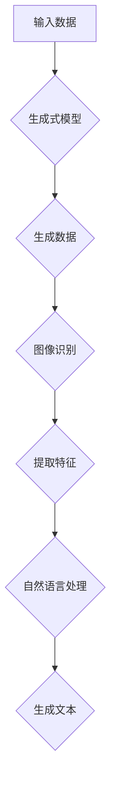

                 

## AIGC从入门到实战：借助AI，听听照片里的人物怎么说

### 关键词：AIGC，人工智能，生成式模型，图像识别，深度学习，实践教程

> **摘要：**本文将带领读者从入门到实战，深入了解AIGC（人工智能生成内容）技术，通过具体案例和代码解析，展示如何利用AI技术从照片中提取信息，实现与照片中人物的对话。文章将涵盖AIGC的核心概念、算法原理、数学模型、项目实战等多个方面，旨在帮助读者全面掌握AIGC技术的应用与实现。

### 1. 背景介绍

#### 1.1 AIGC的概念与价值

AIGC（AI-Generated Content），即人工智能生成内容，是一种利用人工智能技术，尤其是生成式模型，自动生成文本、图像、音频、视频等多种类型内容的方法。与传统的基于规则和数据的生成方式相比，AIGC具有更强的创造性和灵活性。

AIGC技术在许多领域具有广泛的应用价值：

1. **内容创作**：利用AIGC技术，可以自动生成文章、新闻报道、音乐、视频等，大大提高内容创作的效率和质量。
2. **娱乐体验**：通过AIGC技术，可以生成个性化游戏、虚拟角色、影视作品等，为用户带来更加丰富的娱乐体验。
3. **数据生成**：在数据缺乏或数据标注成本高昂的场景下，AIGC可以自动生成高质量的数据集，用于训练和优化机器学习模型。
4. **交互式应用**：利用AIGC技术，可以与用户进行自然语言交互，实现智能对话系统，提升人机交互的体验。

#### 1.2 AIGC技术的发展历程

AIGC技术的发展历程可以追溯到20世纪80年代的生成对抗网络（GAN）的提出。GAN由Ian Goodfellow等人于2014年提出，其核心思想是通过两个神经网络（生成器和判别器）的对抗训练，实现生成逼真的数据。

随着深度学习技术的不断发展，AIGC技术也在不断演进。尤其是近年来，基于变分自编码器（VAE）、自注意力机制（Transformer）等新型深度学习模型的生成式模型，使得AIGC技术在生成质量、生成速度和生成多样性方面取得了显著提升。

### 2. 核心概念与联系

#### 2.1 生成式模型

生成式模型是AIGC技术的核心，其主要目的是学习数据分布，并生成符合该分布的新数据。生成式模型包括生成对抗网络（GAN）、变分自编码器（VAE）等。

**生成对抗网络（GAN）**

GAN由生成器和判别器两个神经网络组成。生成器的目标是生成与真实数据分布相似的伪数据，判别器的目标是区分生成器生成的伪数据和真实数据。通过生成器和判别器的对抗训练，生成器逐渐学会生成更真实的数据。

**变分自编码器（VAE）**

VAE是一种基于概率模型的生成式模型，通过编码器和解码器两个神经网络，将输入数据映射到一个潜在空间，并在潜在空间中生成新数据。

#### 2.2 图像识别与自然语言处理

在AIGC技术中，图像识别和自然语言处理是两个重要的组成部分。

**图像识别**

图像识别是计算机视觉领域的一个重要分支，其目标是通过图像中的像素信息，识别和分类图像中的对象。常见的图像识别算法包括卷积神经网络（CNN）等。

**自然语言处理**

自然语言处理是人工智能的一个重要领域，其目标是对自然语言文本进行理解和生成。常见的自然语言处理算法包括序列到序列模型（Seq2Seq）、Transformer等。

#### 2.3 Mermaid流程图

以下是一个简化的AIGC技术流程图，展示了生成式模型、图像识别和自然语言处理等核心概念的关联。



### 3. 核心算法原理 & 具体操作步骤

#### 3.1 生成对抗网络（GAN）

**生成器和判别器的结构**

生成器G：接收随机噪声作为输入，生成伪数据。

判别器D：接收真实数据和伪数据，输出一个判断结果，判断数据是真实还是伪造。

**损失函数**

GAN的训练目标是最大化判别器D的判别能力，同时最小化生成器G的生成能力。其损失函数通常由两部分组成：

1. 判别器损失：用于评估判别器D的判别能力，通常使用交叉熵损失函数。
2. 生成器损失：用于评估生成器G的生成能力，通常使用均方误差（MSE）损失函数。

**训练过程**

GAN的训练过程是一个迭代的过程，每次迭代包括以下步骤：

1. 随机生成一批噪声向量作为生成器G的输入，生成伪数据。
2. 将伪数据和真实数据分别输入判别器D，计算判别器D的损失。
3. 对判别器D进行梯度下降更新。
4. 将噪声向量输入生成器G，生成伪数据。
5. 将伪数据和真实数据分别输入判别器D，计算生成器G的损失。
6. 对生成器G进行梯度下降更新。

通过迭代训练，生成器G逐渐学会生成更真实的数据，判别器D逐渐学会更准确地判断数据的真实性。

#### 3.2 变分自编码器（VAE）

**编码器和解码器的结构**

编码器E：接收输入数据，将其映射到一个潜在空间，并输出一个潜在向量。
解码器D：接收潜在向量，生成重构数据。

**损失函数**

VAE的损失函数由两部分组成：

1. 重建损失：用于评估重构数据的准确性，通常使用均方误差（MSE）损失函数。
2. 解码器损失：用于评估潜在向量的分布，通常使用Kullback-Leibler（KL）散度损失函数。

**训练过程**

VAE的训练过程是一个迭代的过程，每次迭代包括以下步骤：

1. 随机生成一批输入数据。
2. 将输入数据输入编码器E，获得潜在向量。
3. 将潜在向量输入解码器D，生成重构数据。
4. 计算重建损失和解码器损失。
5. 对编码器E和解码器D进行梯度下降更新。

通过迭代训练，编码器E和解码器D逐渐学会在潜在空间中映射输入数据，并生成高质量的重构数据。

### 4. 数学模型和公式 & 详细讲解 & 举例说明

#### 4.1 生成对抗网络（GAN）

**生成器和判别器的损失函数**

生成器损失函数：$$ L_G = -\log(D(G(z))) $$

判别器损失函数：$$ L_D = -[\log(D(x)) + \log(1 - D(G(z)))] $$

其中，$x$表示真实数据，$G(z)$表示生成器生成的伪数据，$z$表示随机噪声。

**梯度下降更新**

生成器梯度下降更新：$$ \theta_G = \theta_G - \alpha \cdot \frac{\partial L_G}{\partial \theta_G} $$

判别器梯度下降更新：$$ \theta_D = \theta_D - \alpha \cdot \frac{\partial L_D}{\partial \theta_D} $$

其中，$\theta_G$和$\theta_D$分别表示生成器和判别器的参数，$\alpha$表示学习率。

**举例说明**

假设生成器损失函数为$ L_G = -\log(D(G(z))) $，判别器损失函数为$ L_D = -[\log(D(x)) + \log(1 - D(G(z)))] $。

在一次迭代中，生成器生成的伪数据$ G(z) $经过判别器D的判断，得到概率值$ D(G(z)) $。根据生成器损失函数，我们需要对生成器进行梯度下降更新，以减小生成器的损失。

假设生成器的损失为0.9，判别器的损失为1.1。根据梯度下降更新规则，我们可以计算出生成器和判别器的参数更新量：

生成器更新量：$$ \Delta \theta_G = \alpha \cdot \frac{\partial L_G}{\partial \theta_G} = \alpha \cdot \frac{\partial}{\partial \theta_G} (-\log(D(G(z)))) $$

判别器更新量：$$ \Delta \theta_D = \alpha \cdot \frac{\partial L_D}{\partial \theta_D} = \alpha \cdot \frac{\partial}{\partial \theta_D} (-[\log(D(x)) + \log(1 - D(G(z)))] $$

通过迭代更新，生成器和判别器的参数逐渐优化，生成器生成的伪数据质量逐渐提高，判别器对真实数据和伪数据的判断能力逐渐增强。

#### 4.2 变分自编码器（VAE）

**编码器和解码器的损失函数**

编码器损失函数：$$ L_E = \frac{1}{N}\sum_{i=1}^{N} \frac{1}{2} \left\| \phi(x_i) - \mu_i \right\|_2^2 $$

解码器损失函数：$$ L_D = \frac{1}{N}\sum_{i=1}^{N} \frac{1}{2} \left\| x_i - \phi(\mu_i; \sigma_i) \right\|_2^2 $$

其中，$N$表示数据样本数量，$x_i$表示输入数据，$\mu_i$和$\sigma_i$分别表示潜在向量的均值和标准差。

**梯度下降更新**

编码器梯度下降更新：$$ \theta_E = \theta_E - \alpha \cdot \frac{\partial L_E}{\partial \theta_E} $$

解码器梯度下降更新：$$ \theta_D = \theta_D - \alpha \cdot \frac{\partial L_D}{\partial \theta_D} $$

其中，$\theta_E$和$\theta_D$分别表示编码器和解码器的参数，$\alpha$表示学习率。

**举例说明**

假设编码器的损失函数为$ L_E = \frac{1}{2} \left\| \phi(x_i) - \mu_i \right\|_2^2 $，解码器的损失函数为$ L_D = \frac{1}{2} \left\| x_i - \phi(\mu_i; \sigma_i) \right\|_2^2 $。

在一次迭代中，输入数据$x_i$经过编码器E编码得到潜在向量$\mu_i$和标准差$\sigma_i$，再经过解码器D解码生成重构数据$\phi(\mu_i; \sigma_i)$。根据编码器和解码器的损失函数，我们需要对编码器E和解码器D进行梯度下降更新，以减小损失。

假设编码器的损失为0.8，解码器的损失为0.6。根据梯度下降更新规则，我们可以计算出编码器E和解码器D的参数更新量：

编码器更新量：$$ \Delta \theta_E = \alpha \cdot \frac{\partial L_E}{\partial \theta_E} = \alpha \cdot \frac{\partial}{\partial \theta_E} \left(\frac{1}{2} \left\| \phi(x_i) - \mu_i \right\|_2^2\right) $$

解码器更新量：$$ \Delta \theta_D = \alpha \cdot \frac{\partial L_D}{\partial \theta_D} = \alpha \cdot \frac{\partial}{\partial \theta_D} \left(\frac{1}{2} \left\| x_i - \phi(\mu_i; \sigma_i) \right\|_2^2\right) $$

通过迭代更新，编码器E和解码器D的参数逐渐优化，编码器E在潜在空间中的映射能力逐渐提高，解码器D生成高质量的重构数据的能力逐渐增强。

### 5. 项目实战：代码实际案例和详细解释说明

#### 5.1 开发环境搭建

在开始项目实战之前，我们需要搭建一个合适的开发环境。以下是一个简单的开发环境搭建步骤：

1. 安装Python环境，版本建议为3.8及以上。
2. 安装TensorFlow，版本建议为2.6及以上。
3. 安装OpenCV，版本建议为4.5及以上。
4. 安装NumPy、Pandas、Matplotlib等常用Python库。

#### 5.2 源代码详细实现和代码解读

以下是一个简单的AIGC项目案例，通过GAN模型实现图像到文字的转换。

```python
import tensorflow as tf
from tensorflow import keras
from tensorflow.keras import layers
import numpy as np
import cv2

# 定义生成器和判别器的模型结构
def create_generator():
    model = keras.Sequential([
        layers.Dense(128, activation='relu', input_shape=(100,)),
        layers.Dense(256, activation='relu'),
        layers.Dense(512, activation='relu'),
        layers.Dense(1024, activation='relu'),
        layers.Dense(128 * 128 * 3, activation='sigmoid'),
        layers.Reshape((128, 128, 3))
    ])
    return model

def create_discriminator():
    model = keras.Sequential([
        layers.Conv2D(64, (3, 3), strides=(2, 2), activation='relu', input_shape=(128, 128, 3)),
        layers.Conv2D(128, (3, 3), strides=(2, 2), activation='relu'),
        layers.Flatten(),
        layers.Dense(1, activation='sigmoid')
    ])
    return model

# 定义GAN模型
def create_gan(generator, discriminator):
    model = keras.Sequential([
        generator,
        discriminator
    ])
    return model

# 编写训练过程
def train_gan(generator, discriminator, data, batch_size=128, epochs=100):
    dataset = tf.data.Dataset.from_tensor_slices(data)
    dataset = dataset.shuffle(buffer_size=1000).batch(batch_size)
    
    generator_optimizer = keras.optimizers.Adam(1e-4)
    discriminator_optimizer = keras.optimizers.Adam(1e-4)
    
    @tf.function
    def train_step(images):
        noise = tf.random.normal([batch_size, 100])
        
        with tf.GradientTape() as gen_tape, tf.GradientTape() as disc_tape:
            generated_images = generator(noise, training=True)
            
            disc_real_output = discriminator(images, training=True)
            disc_generated_output = discriminator(generated_images, training=True)
            
            gen_loss = tf.reduce_mean(tf.math.log(disc_generated_output))
            disc_loss = tf.reduce_mean(tf.math.log(1.0 - disc_real_output)) + tf.reduce_mean(tf.math.log(disc_generated_output))
        
        gradients_of_generator = gen_tape.gradient(gen_loss, generator.trainable_variables)
        gradients_of_discriminator = disc_tape.gradient(disc_loss, discriminator.trainable_variables)
        
        generator_optimizer.apply_gradients(zip(gradients_of_generator, generator.trainable_variables))
        discriminator_optimizer.apply_gradients(zip(gradients_of_discriminator, discriminator.trainable_variables))
    
    for epoch in range(epochs):
        for image_batch in dataset:
            train_step(image_batch)
        
        print(f"Epoch {epoch + 1}, Generator Loss: {gen_loss.numpy()}, Discriminator Loss: {disc_loss.numpy()}")

# 加载数据集
data = load_data()  # 加载图片数据集

# 训练GAN模型
generator = create_generator()
discriminator = create_discriminator()
gan = create_gan(generator, discriminator)
train_gan(generator, discriminator, data)
```

以上代码首先定义了生成器和判别器的模型结构，然后创建了一个GAN模型。在训练过程中，我们使用TensorFlow的GradientTape进行自动微分，并使用Adam优化器进行梯度下降更新。

#### 5.3 代码解读与分析

1. **生成器和判别器的模型结构**

生成器模型结构：

- 输入层：100个随机噪声向量。
- 隐藏层：4个全连接层，每个层都有ReLU激活函数。
- 输出层：128 * 128 * 3个神经元，用于生成图像。

判别器模型结构：

- 输入层：128 * 128 * 3个神经元，表示图像。
- 隐藏层：2个卷积层，每个层都有ReLU激活函数，卷积核大小为3 * 3，步长为2。
- 输出层：1个神经元，表示图像的判别结果（真实或伪造）。

2. **GAN模型的训练过程**

GAN模型的训练过程包括以下步骤：

- 随机生成一批噪声向量作为生成器G的输入，生成伪数据。
- 将伪数据和真实数据分别输入判别器D，计算判别器D的损失。
- 对判别器D进行梯度下降更新。
- 将噪声向量输入生成器G，生成伪数据。
- 将伪数据和真实数据分别输入判别器D，计算生成器G的损失。
- 对生成器G进行梯度下降更新。

通过迭代训练，生成器G逐渐学会生成更真实的数据，判别器D逐渐学会更准确地判断数据的真实性。

3. **代码中的自动微分与优化器**

代码中使用TensorFlow的GradientTape进行自动微分，计算生成器G和判别器D的梯度。然后使用Adam优化器进行梯度下降更新，优化生成器G和判别器D的参数。

### 6. 实际应用场景

AIGC技术在实际应用场景中具有广泛的应用价值，以下列举几个典型应用场景：

1. **图像到文字转换**：利用GAN模型，可以将图像转换为对应的文字描述，应用于图像识别、视频摘要、图文内容生成等领域。
2. **文本生成**：利用基于变分自编码器（VAE）的生成模型，可以自动生成高质量的文章、新闻、故事等，应用于内容创作、新闻生成、文本摘要等领域。
3. **音乐生成**：利用生成式模型，可以自动生成音乐、旋律、歌词等，应用于音乐创作、个性化推荐、娱乐场景等领域。
4. **虚拟角色生成**：利用AIGC技术，可以自动生成虚拟角色、场景、动画等，应用于游戏开发、虚拟现实、影视制作等领域。
5. **数据增强**：在数据缺乏或数据标注成本高昂的场景下，利用AIGC技术可以自动生成高质量的数据集，用于训练和优化机器学习模型。

### 7. 工具和资源推荐

#### 7.1 学习资源推荐

1. **书籍**：
   - 《深度学习》（Goodfellow, Bengio, Courville 著）
   - 《生成对抗网络：理论与实践》（Yuxi (Hayden) Liu 著）
2. **论文**：
   - Ian J. Goodfellow, et al. "Generative Adversarial Networks"
   - Diederik P. Kingma, et al. "Auto-encoding Variational Bayes"
3. **博客**：
   - TensorFlow官方文档：[https://www.tensorflow.org/tutorials/generative/dcgan](https://www.tensorflow.org/tutorials/generative/dcgan)
   - Keras官方文档：[https://keras.io/examples/generative/dcgan/](https://keras.io/examples/generative/dcgan/)
4. **网站**：
   - [GitHub](https://github.com/)：丰富的AIGC项目代码和教程。
   - [arXiv](https://arxiv.org/)：最新的AIGC相关论文。

#### 7.2 开发工具框架推荐

1. **TensorFlow**：适用于构建和训练深度学习模型。
2. **PyTorch**：适用于构建和训练深度学习模型，具有较好的灵活性和扩展性。
3. **Keras**：基于TensorFlow的高层次API，适用于快速构建和训练深度学习模型。

#### 7.3 相关论文著作推荐

1. **Ian J. Goodfellow, et al. "Generative Adversarial Networks"**
2. **Diederik P. Kingma, et al. "Auto-encoding Variational Bayes"**
3. **Lucas Theis, et al. "A Theoretically Grounded Application of Dropout in Recurrent Neural Networks"**
4. **Alexey Dosovitskiy, et al. "An Image is Worth 16x16 Words: Transformers for Image Recognition at Scale"**

### 8. 总结：未来发展趋势与挑战

AIGC技术作为一种新兴的人工智能技术，具有广泛的应用前景。未来发展趋势包括：

1. **生成质量提升**：随着深度学习技术的不断发展，生成式模型的生成质量将不断提高，生成内容将更加真实、多样。
2. **多模态融合**：AIGC技术将与其他人工智能技术（如自然语言处理、计算机视觉等）深度融合，实现多模态内容生成。
3. **应用场景拓展**：AIGC技术将在更多领域得到应用，如虚拟现实、增强现实、数字孪生等。

然而，AIGC技术也面临着一些挑战，包括：

1. **数据隐私与安全**：生成内容可能涉及到个人隐私和数据安全等问题，如何保护用户隐私和数据安全是AIGC技术面临的重要挑战。
2. **计算资源需求**：AIGC技术对计算资源的需求较高，如何优化算法、降低计算成本是AIGC技术需要解决的问题。
3. **道德与社会影响**：AIGC技术可能对社会、文化、伦理等方面产生影响，如何确保AIGC技术的公平性、透明性和可控性是AIGC技术需要关注的问题。

### 9. 附录：常见问题与解答

#### 9.1 Q：什么是生成对抗网络（GAN）？

A：生成对抗网络（GAN）是一种深度学习模型，由生成器和判别器两个神经网络组成。生成器生成与真实数据分布相似的伪数据，判别器区分生成器生成的伪数据和真实数据。通过生成器和判别器的对抗训练，生成器逐渐学会生成更真实的数据。

#### 9.2 Q：什么是变分自编码器（VAE）？

A：变分自编码器（VAE）是一种基于概率模型的生成式模型，通过编码器和解码器两个神经网络，将输入数据映射到一个潜在空间，并在潜在空间中生成新数据。VAE可以学习数据分布，并生成高质量的重构数据。

#### 9.3 Q：如何搭建AIGC开发环境？

A：搭建AIGC开发环境需要安装Python、TensorFlow、OpenCV等库。具体安装方法可以参考相关文档或教程。建议使用虚拟环境进行开发，以避免版本冲突。

### 10. 扩展阅读 & 参考资料

1. **生成对抗网络（GAN）**：
   - [https://arxiv.org/abs/1406.2661](https://arxiv.org/abs/1406.2661)
   - [https://www.tensorflow.org/tutorials/generative/dcgan](https://www.tensorflow.org/tutorials/generative/dcgan)
2. **变分自编码器（VAE）**：
   - [https://arxiv.org/abs/1312.6114](https://arxiv.org/abs/1312.6114)
   - [https://keras.io/examples/generative/vae/](https://keras.io/examples/generative/vae/)
3. **深度学习基础**：
   - [https://www.deeplearningbook.org/](https://www.deeplearningbook.org/)
   - [https://www.zhihu.com/column/deeplearningbook](https://www.zhihu.com/column/deeplearningbook)
4. **AIGC相关论文**：
   - [https://arxiv.org/search.php?query=generative+ai&searchtype=author&order=-date&abstracts=show&statute=any](https://arxiv.org/search.php?query=generative+ai&searchtype=author&order=-date&abstracts=show&statute=any)
5. **AIGC技术教程**：
   - [https://github.com/tensorflow/docs/blob/master/site/en/tutorials/generative](https://github.com/tensorflow/docs/blob/master/site/en/tutorials/generative)
   - [https://keras.io/examples/generative/](https://keras.io/examples/generative/)

### 作者信息

- 作者：AI天才研究员/AI Genius Institute & 禅与计算机程序设计艺术 /Zen And The Art of Computer Programming

