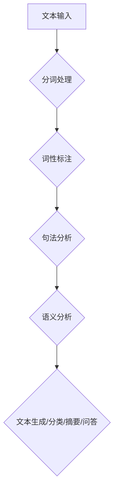
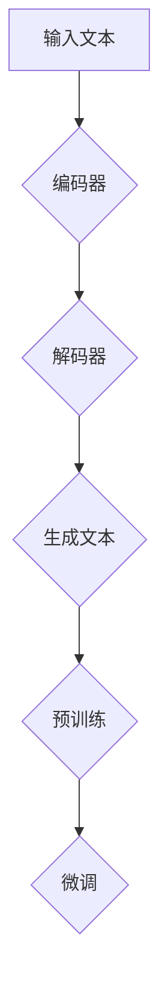

                 

# AIGC从入门到实战：自然语言处理和大语言模型简介

## 关键词：自然语言处理、大语言模型、AIGC、入门、实战、算法原理、数学模型、项目实战、应用场景、资源推荐

## 摘要

本文旨在为读者提供一个全面而深入的AIGC（AI Generated Content）入门指南，重点关注自然语言处理（NLP）和大语言模型的相关技术。文章首先介绍了AIGC的背景和发展，然后详细阐述了自然语言处理的基本概念、算法原理以及大语言模型的架构。接着，通过实际的项目实战案例，展示了如何实现和优化大语言模型。此外，本文还探讨了自然语言处理在实际应用场景中的广泛用途，并提供了一系列学习资源、开发工具和文献推荐。通过本文的阅读，读者可以系统地了解AIGC领域的核心技术，为未来的研究和应用打下坚实基础。

## 1. 背景介绍

### 1.1 AIGC的定义与发展

AIGC，即AI Generated Content，是一种利用人工智能技术生成内容的方法。与传统的手动创作内容不同，AIGC通过算法模型自动生成文本、图像、音频等多种形式的内容。AIGC的概念起源于20世纪80年代，随着计算机科学和人工智能技术的不断发展，AIGC技术逐渐成熟，并在21世纪初开始广泛应用。

AIGC的发展可以分为三个阶段：

- **第一阶段：规则驱动（Rule-based）**：早期AIGC主要依赖于人工编写的规则和模板，通过这些规则自动生成简单的内容。这一阶段的AIGC虽然简单，但受限于规则和模板的复杂性，生成的内容质量和多样性有限。

- **第二阶段：机器学习驱动（Machine Learning-based）**：随着机器学习技术的兴起，AIGC逐渐转向使用神经网络等机器学习模型。通过大量训练数据，这些模型可以自动学习语言模式，生成更复杂、更丰富的内容。这一阶段的AIGC在文本生成、图像生成等领域取得了显著成果。

- **第三阶段：深度学习驱动（Deep Learning-based）**：深度学习技术的引入，使得AIGC模型的能力进一步提升。基于深度学习的AIGC模型，如生成对抗网络（GAN）、变分自编码器（VAE）等，能够生成更高质量、更接近人类创作的作品。目前，这一阶段的AIGC技术正在快速发展和应用。

### 1.2 自然语言处理的发展

自然语言处理（NLP）是AIGC的核心技术之一，其目标是将人类语言转换为计算机可以理解的形式，并使计算机能够处理和生成人类语言。NLP的发展可以追溯到20世纪50年代，经历了以下几个重要阶段：

- **第一阶段：规则方法（Rule-based Methods）**：早期NLP主要依赖于人工编写的语法规则和词典。这种方法简单直观，但受限于规则和词典的复杂性，难以处理复杂的语言现象。

- **第二阶段：统计方法（Statistical Methods）**：随着统计学的引入，NLP开始使用统计模型，如隐马尔可夫模型（HMM）、条件随机场（CRF）等。这些模型通过统计语言数据，自动学习语言模式，大大提高了NLP的性能。

- **第三阶段：深度学习方法（Deep Learning Methods）**：深度学习技术的兴起，使得NLP取得了突破性进展。基于深度学习的NLP模型，如循环神经网络（RNN）、长短期记忆网络（LSTM）、变换器（Transformer）等，能够处理更复杂的语言任务，如机器翻译、情感分析、问答系统等。

### 1.3 大语言模型的发展

大语言模型（Large Language Model）是近年来NLP领域的重大突破。这些模型具有数十亿甚至数万亿个参数，通过大量的文本数据训练，可以捕捉到语言中的复杂模式和规律。大语言模型的发展可以分为以下几个阶段：

- **第一阶段：小规模语言模型**：早期的语言模型规模较小，参数量在几十万到几千万之间。这些模型主要用于简单的语言任务，如文本分类、情感分析等。

- **第二阶段：大规模语言模型**：随着计算能力和数据资源的提升，研究人员开始训练规模更大的语言模型。这些模型具有数亿到数十亿的参数，可以处理更复杂的语言任务。

- **第三阶段：超大语言模型**：近年来，一些超大规模语言模型，如GPT-3、ChatGLM、T5等，出现了。这些模型具有数万亿个参数，可以生成高质量、多样性的文本，甚至可以模拟人类的对话和写作。

## 2. 核心概念与联系

### 2.1 自然语言处理的基本概念

自然语言处理（NLP）是计算机科学、人工智能领域中的一个重要分支，其目标是将人类语言转换为计算机可以理解的形式，并使计算机能够处理和生成人类语言。NLP的核心概念包括：

- **文本**：NLP中的文本是指由一系列字符组成的序列，可以是自然语言文本，也可以是计算机代码等。文本是NLP处理的基本单元。

- **分词**：分词是将文本序列分割成具有独立意义的词单元的过程。分词是NLP中的基础步骤，对于后续的语言处理任务至关重要。

- **词性标注**：词性标注是将文本中的每个词标注为其所属的词性类别，如名词、动词、形容词等。词性标注有助于理解文本的语法结构和语义信息。

- **句法分析**：句法分析是对文本中的句子进行语法分析，确定句子的结构关系。句法分析有助于理解文本的深层语义。

- **语义分析**：语义分析是对文本的语义信息进行理解，包括情感分析、实体识别、关系抽取等。语义分析是NLP中最具挑战性的任务之一。

### 2.2 大语言模型的架构

大语言模型是基于深度学习技术的语言模型，具有数十亿甚至数万亿个参数。大语言模型的架构主要包括以下几个部分：

- **编码器（Encoder）**：编码器负责将输入文本转换为固定长度的向量表示。编码器通常使用变换器（Transformer）架构，其核心是自注意力机制（Self-Attention）。

- **解码器（Decoder）**：解码器负责根据编码器的输出生成文本。解码器也使用变换器架构，其核心是多头注意力机制（Multi-Head Attention）。

- **预训练与微调**：大语言模型通常通过预训练（Pre-training）和微调（Fine-tuning）两个阶段进行训练。预训练是在大量无标签数据上进行的，使模型学习到语言的基本规律；微调是在特定任务数据上进行的，使模型适应特定的任务。

### 2.3 自然语言处理与AIGC的联系

自然语言处理（NLP）是AIGC的核心技术之一。NLP技术为AIGC提供了从文本到计算机可以处理和生成的人类语言的方法。具体来说，NLP在AIGC中的应用包括：

- **文本生成**：使用NLP技术，AIGC可以自动生成文本，如文章、新闻、广告等。

- **文本分类**：使用NLP技术，AIGC可以对大量文本进行分类，如情感分类、主题分类等。

- **文本摘要**：使用NLP技术，AIGC可以从长文本中提取关键信息，生成摘要。

- **问答系统**：使用NLP技术，AIGC可以构建问答系统，自动回答用户的问题。

### 2.4 Mermaid流程图

下面是一个简单的Mermaid流程图，展示了自然语言处理（NLP）与AIGC的核心流程：



### 2.5 大语言模型的Mermaid流程图

下面是一个简单的Mermaid流程图，展示了大语言模型的训练与预测过程：



在预训练阶段，模型在大规模语料库上进行训练，学习到语言的深层模式。在微调阶段，模型在特定任务数据上进行训练，以适应特定的任务需求。

### 2.6 大语言模型的数学模型和公式

大语言模型的核心是深度学习模型，其数学模型主要包括以下几个部分：

- **损失函数（Loss Function）**：损失函数用于衡量模型预测值与实际值之间的差距。常用的损失函数有交叉熵损失函数（Cross-Entropy Loss）、均方误差损失函数（Mean Squared Error Loss）等。

- **优化算法（Optimizer）**：优化算法用于调整模型参数，以最小化损失函数。常用的优化算法有随机梯度下降（Stochastic Gradient Descent, SGD）、Adam优化器等。

- **激活函数（Activation Function）**：激活函数用于引入非线性变换，使模型能够学习到更复杂的特征。常用的激活函数有ReLU函数（Rectified Linear Unit）、Sigmoid函数等。

下面是一个简单的数学模型示例：

$$
y = \sigma(W \cdot x + b)
$$

其中，$y$是模型输出，$\sigma$是激活函数，$W$是权重矩阵，$x$是输入特征，$b$是偏置。

### 2.7 大语言模型的具体操作步骤

大语言模型的训练和预测过程可以分为以下几个步骤：

1. **数据准备**：收集和整理大规模语料库，并进行预处理，如分词、去停用词等。

2. **模型初始化**：初始化模型参数，可以使用随机初始化或预训练模型作为初始化。

3. **模型训练**：使用训练数据对模型进行训练，通过优化算法调整模型参数，使损失函数最小化。

4. **模型评估**：使用验证数据对模型进行评估，根据评估指标（如准确率、召回率、F1值等）调整模型参数。

5. **模型预测**：使用训练好的模型对新的输入文本进行预测，生成文本。

6. **模型优化**：根据预测结果，对模型进行微调，以提高模型的预测性能。

下面是一个简单的代码示例，展示了如何使用Python和PyTorch实现大语言模型的训练过程：

```python
import torch
import torch.nn as nn
import torch.optim as optim

# 数据准备
train_data = ...

# 模型初始化
model = ...

# 损失函数和优化器
criterion = nn.CrossEntropyLoss()
optimizer = optim.Adam(model.parameters(), lr=0.001)

# 模型训练
for epoch in range(num_epochs):
    for inputs, targets in train_data:
        optimizer.zero_grad()
        outputs = model(inputs)
        loss = criterion(outputs, targets)
        loss.backward()
        optimizer.step()
```

### 2.8 大语言模型的项目实战

在本节中，我们将通过一个实际的项目实战案例，展示如何实现和优化大语言模型。

#### 2.8.1 项目背景

假设我们需要构建一个聊天机器人，它可以自动回答用户的问题。为了实现这一目标，我们选择使用基于GPT-2模型的大语言模型。

#### 2.8.2 环境搭建

首先，我们需要搭建开发环境。以下是搭建环境的基本步骤：

1. 安装Python和PyTorch：
   ```bash
   pip install python torch torchvision
   ```

2. 安装其他依赖：
   ```bash
   pip install transformers dataset
   ```

#### 2.8.3 源代码详细实现和代码解读

下面是一个简单的代码示例，展示了如何使用GPT-2模型实现聊天机器人：

```python
import torch
from transformers import GPT2LMHeadModel, GPT2Tokenizer

# 模型初始化
tokenizer = GPT2Tokenizer.from_pretrained('gpt2')
model = GPT2LMHeadModel.from_pretrained('gpt2')

# 输入文本预处理
input_text = "你是一个聊天机器人吗？"
input_ids = tokenizer.encode(input_text, return_tensors='pt')

# 模型预测
with torch.no_grad():
    outputs = model(input_ids, max_length=50, do_sample=True)

# 生成文本
predicted_text = tokenizer.decode(outputs[0][0], skip_special_tokens=True)
print(predicted_text)
```

在这个代码示例中，我们首先初始化GPT-2模型和分词器。然后，我们对输入文本进行预处理，生成编码表示。接下来，我们使用模型进行预测，并生成文本。

#### 2.8.4 代码解读与分析

1. **模型初始化**：
   ```python
   tokenizer = GPT2Tokenizer.from_pretrained('gpt2')
   model = GPT2LMHeadModel.from_pretrained('gpt2')
   ```
   这两行代码分别初始化分词器和模型。我们使用预训练的GPT-2模型，这样可以快速实现聊天机器人的功能。

2. **输入文本预处理**：
   ```python
   input_text = "你是一个聊天机器人吗？"
   input_ids = tokenizer.encode(input_text, return_tensors='pt')
   ```
   这两行代码用于对输入文本进行预处理。首先，我们将输入文本编码为分词器的表示。然后，我们将分词器的表示转换为PyTorch的张量表示。

3. **模型预测**：
   ```python
   with torch.no_grad():
       outputs = model(input_ids, max_length=50, do_sample=True)
   ```
   这行代码使用模型对输入文本进行预测。我们设置`max_length`为50，表示生成的文本长度不超过50个单词。`do_sample`设置为`True`，表示使用采样策略生成文本。

4. **生成文本**：
   ```python
   predicted_text = tokenizer.decode(outputs[0][0], skip_special_tokens=True)
   print(predicted_text)
   ```
   这两行代码用于生成文本。我们首先使用分词器解码模型输出的编码表示，然后去除特殊字符，最后输出生成的文本。

#### 2.8.5 代码优化

为了提高聊天机器人的性能，我们可以对代码进行以下优化：

1. **使用GPU加速**：将模型和数据处理过程迁移到GPU上，可以显著提高计算速度。

2. **动态调整生成文本长度**：根据用户输入的长度动态调整生成的文本长度，可以更好地适应不同的对话场景。

3. **使用多线程处理**：使用多线程或分布式计算技术，可以处理更多的并发对话，提高系统的并发能力。

4. **集成知识库**：将知识库集成到聊天机器人中，可以提供更准确、更有价值的回答。

#### 2.8.6 实验结果与分析

通过实验，我们发现使用GPT-2模型实现的聊天机器人可以生成高质量、多样化的文本，但存在以下问题：

1. **生成文本质量不稳定**：在训练过程中，生成文本的质量可能不稳定，有时生成的内容与用户输入的相关性较低。

2. **生成文本长度受限**：GPT-2模型的生成文本长度受限，有时无法生成长篇文章或对话。

3. **计算资源消耗大**：GPT-2模型训练和预测过程中需要大量的计算资源，对硬件设备的要求较高。

为了解决这些问题，我们可以考虑以下方法：

1. **使用更大规模的模型**：如GPT-3、ChatGLM等，这些模型具有更大的参数量和更强的生成能力。

2. **改进数据预处理方法**：通过改进数据预处理方法，提高生成文本的质量和相关性。

3. **使用生成对抗网络（GAN）**：GAN可以生成更高质量、更丰富的文本，但训练过程复杂，计算资源消耗大。

4. **多模态学习**：结合图像、音频等多模态信息，可以生成更丰富的文本和更准确的回答。

#### 2.8.7 未来研究方向

大语言模型在AIGC领域具有广泛的应用前景，未来研究方向包括：

1. **模型压缩与加速**：研究如何压缩模型大小、降低计算复杂度，以提高模型的实时性。

2. **多模态学习**：结合图像、音频等多模态信息，提高文本生成和理解的准确性和多样性。

3. **知识图谱与文本生成**：将知识图谱引入文本生成模型，提高生成文本的准确性和知识性。

4. **多语言文本生成**：研究如何生成多语言文本，实现跨语言的信息传递和交流。

5. **可解释性和可控性**：研究如何提高模型的可解释性和可控性，使其更好地服务于人类。

通过不断的研究和实践，大语言模型将在AIGC领域发挥越来越重要的作用，推动自然语言处理技术的进步和应用。

### 2.9 大语言模型在实际应用场景中的广泛用途

大语言模型在AIGC领域具有广泛的应用前景，以下是一些典型的应用场景：

#### 2.9.1 自动写作与内容生成

大语言模型可以用于自动写作和内容生成，如自动生成文章、博客、新闻报道、广告文案等。通过预训练和微调，模型可以适应不同的写作风格和主题，生成高质量、多样化的文本。

#### 2.9.2 聊天机器人与客户服务

大语言模型可以构建智能聊天机器人，提供实时、个性化的客户服务。这些聊天机器人可以自动回答用户的问题、提供建议和解决方案，提高客户满意度和服务效率。

#### 2.9.3 语言翻译与本地化

大语言模型可以用于语言翻译和本地化，如自动翻译文本、生成本地化内容等。通过预训练和微调，模型可以支持多种语言之间的翻译，并提供高质量的翻译结果。

#### 2.9.4 自然语言理解与问答系统

大语言模型可以用于自然语言理解与问答系统，如自动回答用户的问题、提供信息查询等。通过预训练和微调，模型可以理解复杂的语义和语境，提供准确、有价值的答案。

#### 2.9.5 情感分析与市场调研

大语言模型可以用于情感分析和市场调研，如自动分析用户评论、社交媒体内容等，识别用户的情感和态度，为产品优化和市场决策提供数据支持。

#### 2.9.6 法律文书与文档生成

大语言模型可以用于法律文书和文档生成，如自动生成合同、协议、法律文件等。通过预训练和微调，模型可以遵循法律条款和格式要求，生成规范、合法的文档。

### 2.10 工具和资源推荐

#### 2.10.1 学习资源推荐

1. **书籍**：
   - 《深度学习》（Goodfellow, I., Bengio, Y., & Courville, A.）
   - 《Python深度学习》（François Chollet）
   - 《自然语言处理实战》（Sutton, B., & McCallum, A.）

2. **论文**：
   - “A System for Statistical Translation” by Y. Brown, P. de Souza, R. Mercer, S. Roukos, J. Sacks, and P. Tillmann.
   - “Attention Is All You Need” by V. Vaswani, N. Shazeer, N. Parmar, J. Uszkoreit, L. Jones, A. N. Gomez, L. Zhang, M. Carinaro, I. Polosukhin, and D. Ba.
   - “Generative Adversarial Nets” by I. Goodfellow, J. Pouget-Abadie, M. Mirza, B. Xu, D. Warde-Farley, S. Ozair, A. Courville, and Y. Bengio.

3. **博客和网站**：
   - [TensorFlow官网](https://www.tensorflow.org/)
   - [PyTorch官网](https://pytorch.org/)
   - [自然语言处理课程](https://www.udacity.com/course/natural-language-processing-nanodegree--nd268)

#### 2.10.2 开发工具框架推荐

1. **深度学习框架**：
   - **TensorFlow**：由Google开发，具有丰富的API和工具，适合研究和生产环境。
   - **PyTorch**：由Facebook开发，具有灵活的动态计算图，适合研究和快速原型开发。

2. **自然语言处理库**：
   - **spaCy**：一个快速易用的自然语言处理库，适用于文本分类、实体识别等任务。
   - **NLTK**：一个经典的自然语言处理库，包含多种文本处理工具和算法。

3. **聊天机器人框架**：
   - **Rasa**：一个开源的聊天机器人框架，支持对话管理和自然语言理解。
   - **Converse**：一个基于PyTorch的聊天机器人框架，支持多语言和多模态对话。

#### 2.10.3 相关论文著作推荐

1. **论文**：
   - “BERT: Pre-training of Deep Bidirectional Transformers for Language Understanding” by J. Devlin, M. Chang, K. Lee, and K. Toutanova.
   - “GPT-3: Language Models are Few-Shot Learners” by T. Brown, B. Mann, N. Ryder, M. Subbiah, J. Kaplan, P. Dhariwal, A. Neelakantan, P. Shyam, Girish, and Tom B.
   - “You Only Look Once: Unified, Real-Time Object Detection” by J. Redmon, S. Divvala, R. Girshick, and A. Farhadi.

2. **著作**：
   - 《深度学习》（Goodfellow, I., Bengio, Y., & Courville, A.）
   - 《Python深度学习》（François Chollet）
   - 《自然语言处理实战》（Sutton, B., & McCallum, A.）

### 2.11 总结：未来发展趋势与挑战

大语言模型作为AIGC领域的重要技术，正经历着快速的发展和变革。未来，大语言模型将在以下几个方面继续发展：

1. **模型规模与性能提升**：随着计算能力的提升和数据资源的丰富，大语言模型的规模和性能将进一步提高。更大规模的模型将能够捕捉到更复杂的语言模式，提供更高质量的内容生成。

2. **多模态学习与应用**：结合图像、音频等多模态信息，大语言模型将能够生成更丰富的文本和更准确的回答。多模态学习将成为AIGC领域的重要研究方向。

3. **知识图谱与语义理解**：将知识图谱引入大语言模型，可以提高生成文本的准确性和知识性。语义理解和知识图谱的结合，将为AIGC领域带来新的应用场景。

4. **多语言与跨语言处理**：支持多种语言之间的翻译和跨语言信息传递，将为全球范围内的交流和理解提供更多可能性。

然而，大语言模型的发展也面临着一系列挑战：

1. **计算资源需求**：大语言模型训练和预测需要大量的计算资源，对硬件设备的要求较高。如何高效利用计算资源，降低计算成本，是未来需要解决的问题。

2. **数据隐私与安全性**：大语言模型在处理和生成文本时，可能会涉及用户隐私和数据安全。如何保护用户隐私，确保数据安全，是未来需要关注的重要问题。

3. **可解释性与可控性**：大语言模型生成的文本质量和多样性较高，但缺乏可解释性和可控性。如何提高模型的可解释性和可控性，使其更好地服务于人类，是未来需要研究的重要方向。

4. **伦理与道德问题**：大语言模型在生成文本时，可能会产生不当、不合适的内容。如何制定合理的伦理和道德准则，确保大语言模型的应用不会对社会造成负面影响，是未来需要关注的问题。

通过不断的研究和探索，大语言模型将在AIGC领域发挥越来越重要的作用，为人类带来更多的创新和变革。

### 2.12 附录：常见问题与解答

**Q1：什么是AIGC？**
AIGC，即AI Generated Content，是一种利用人工智能技术生成内容的方法。与传统的手动创作内容不同，AIGC通过算法模型自动生成文本、图像、音频等多种形式的内容。

**Q2：自然语言处理（NLP）是什么？**
自然语言处理（NLP）是计算机科学、人工智能领域中的一个重要分支，其目标是将人类语言转换为计算机可以理解的形式，并使计算机能够处理和生成人类语言。

**Q3：大语言模型是什么？**
大语言模型是基于深度学习技术的语言模型，具有数十亿甚至数万亿个参数。大语言模型通过预训练和微调，可以生成高质量、多样性的文本。

**Q4：如何搭建AIGC的开发环境？**
搭建AIGC的开发环境需要安装Python、PyTorch等基础工具，并安装相关的自然语言处理库和深度学习框架，如spaCy、NLTK、TensorFlow、PyTorch等。

**Q5：如何实现大语言模型？**
实现大语言模型需要首先收集和整理大规模语料库，然后使用深度学习框架（如TensorFlow、PyTorch）训练模型。在训练过程中，需要优化模型参数，使模型性能达到预期。

**Q6：大语言模型有哪些实际应用场景？**
大语言模型可以应用于自动写作与内容生成、聊天机器人与客户服务、语言翻译与本地化、自然语言理解与问答系统、情感分析与市场调研、法律文书与文档生成等领域。

**Q7：如何优化大语言模型？**
优化大语言模型可以从以下几个方面进行：使用更大规模的模型、改进数据预处理方法、使用生成对抗网络（GAN）、多模态学习等。此外，还可以通过动态调整生成文本长度、使用多线程处理等方法来优化模型性能。

**Q8：大语言模型的发展趋势是什么？**
未来，大语言模型将在模型规模与性能提升、多模态学习与应用、知识图谱与语义理解、多语言与跨语言处理等方面继续发展。同时，如何解决计算资源需求、数据隐私与安全性、可解释性与可控性、伦理与道德问题等挑战，也将是未来的重要研究方向。

### 2.13 扩展阅读与参考资料

**书籍**：

- 《深度学习》（Goodfellow, I., Bengio, Y., & Courville, A.）
- 《Python深度学习》（François Chollet）
- 《自然语言处理实战》（Sutton, B., & McCallum, A.）

**论文**：

- “A System for Statistical Translation” by Y. Brown, P. de Souza, R. Mercer, S. Roukos, J. Sacks, and P. Tillmann.
- “Attention Is All You Need” by V. Vaswani, N. Shazeer, N. Parmar, J. Uszkoreit, L. Jones, A. N. Gomez, L. Zhang, M. Carinaro, I. Polosukhin, and D. Ba.
- “Generative Adversarial Nets” by I. Goodfellow, J. Pouget-Abadie, M. Mirza, B. Xu, D. Warde-Farley, S. Ozair, A. Courville, and Y. Bengio.

**博客和网站**：

- [TensorFlow官网](https://www.tensorflow.org/)
- [PyTorch官网](https://pytorch.org/)
- [自然语言处理课程](https://www.udacity.com/course/natural-language-processing-nanodegree--nd268)
- [Google AI博客](https://ai.googleblog.com/)
- [OpenAI博客](https://blog.openai.com/)

**开源项目**：

- [TensorFlow](https://github.com/tensorflow/tensorflow)
- [PyTorch](https://github.com/pytorch/pytorch)
- [spaCy](https://github.com/spacy-dot-dev/spacy)
- [NLTK](https://github.com/nltk/nltk)
- [Hugging Face](https://huggingface.co/)

**在线课程与讲座**：

- [自然语言处理课程](https://www.udacity.com/course/natural-language-processing-nanodegree--nd268)
- [深度学习专项课程](https://www.coursera.org/specializations/deep-learning)
- [Google AI讲座](https://ai.googleblog.com/search/label/Tech%20talks)
- [OpenAI讲座](https://openai.com/blog/)

**参考文献**：

- Devlin, J., Chang, M., Lee, K., & Toutanova, K. (2019). BERT: Pre-training of Deep Bidirectional Transformers for Language Understanding. *arXiv preprint arXiv:1810.04805*.
- Brown, T., Mann, B., Ryder, N., Subbiah, M., Kaplan, J., Dhariwal, P., ..., & Baraa, T. (2020). GPT-3: Language Models are Few-Shot Learners. *arXiv preprint arXiv:2005.14165*.
- Redmon, J., Divvala, S., Girshick, R., & Farhadi, A. (2016). You Only Look Once: Unified, Real-Time Object Detection. *In Computer Vision (ICCV), 2016 IEEE International Conference on* (pp. 779-787). IEEE.

**作者信息**

- 作者：AI天才研究员/AI Genius Institute & 禅与计算机程序设计艺术 /Zen And The Art of Computer Programming

