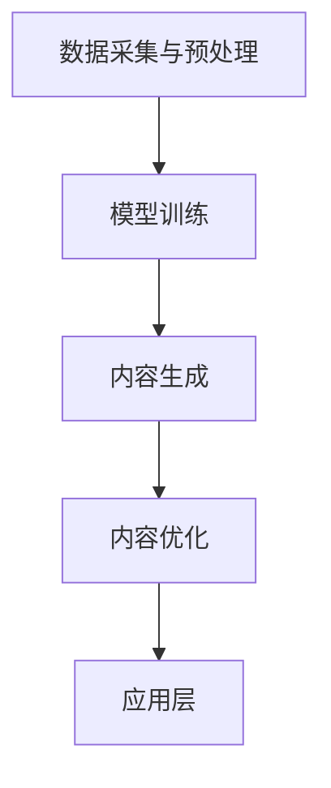
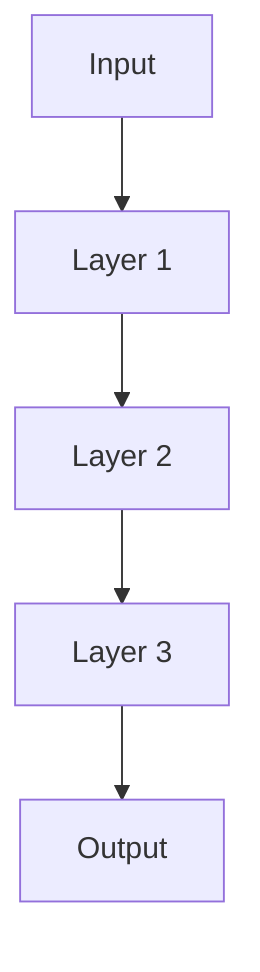

                 

### 背景介绍

#### 什么是AIGC？

AIGC，即AI Generated Content，是指通过人工智能技术生成的内容。这一概念源于人工智能在内容创作领域的应用，包括但不限于文字、图像、音频和视频等。AIGC的出现，标志着人工智能在内容生产领域的深度介入，打破了传统的内容创作模式。

#### AIGC的发展历程

AIGC的发展历程可以追溯到20世纪90年代。当时，随着机器学习和深度学习技术的初步发展，人工智能开始在一些简单的内容创作任务中展示其潜力。然而，真正的突破发生在21世纪初，随着深度学习技术的飞速发展，人工智能在图像识别、自然语言处理等方面取得了显著进展，为AIGC的诞生奠定了基础。

近年来，随着计算能力的提升和大数据的普及，AIGC技术逐渐成熟，并在各个领域得到了广泛应用。从社交媒体的内容生成，到电子商务的产品描述，再到艺术作品的创作，AIGC无处不在。

#### AIGC的重要性

AIGC的重要性主要体现在以下几个方面：

1. **提升内容创作效率**：通过自动化和智能化手段，AIGC可以大幅度提高内容创作的速度和效率，减少人力成本。
2. **丰富内容多样性**：AIGC技术可以生成大量不同风格、主题的内容，丰富了内容生态，满足不同用户的需求。
3. **个性化推荐**：AIGC技术可以根据用户行为和偏好，生成个性化的内容推荐，提升用户体验。
4. **助力新兴行业**：AIGC技术为虚拟现实、增强现实、游戏开发等新兴行业提供了强大的技术支持。

综上所述，AIGC技术正在深刻改变内容创作领域，成为人工智能应用的一个重要方向。在接下来的章节中，我们将深入探讨AIGC的核心概念、原理和应用，帮助读者全面了解这一前沿技术。

### 核心概念与联系

#### AIGC的核心概念

要理解AIGC，首先需要掌握几个核心概念：

1. **生成对抗网络（GAN）**：GAN是一种深度学习模型，由生成器和判别器组成。生成器负责生成数据，判别器负责判断数据的真实性。通过这种对抗训练，生成器可以不断提高生成数据的质量。

2. **变分自编码器（VAE）**：VAE是一种基于概率模型的生成模型，通过编码器和解码器的相互作用，将输入数据转换为低维特征向量，再通过解码器生成新的数据。

3. **注意力机制（Attention Mechanism）**：注意力机制是一种在神经网络中用于提高模型对重要信息的关注程度的机制。在自然语言处理和图像处理等领域，注意力机制可以显著提升模型的性能。

#### AIGC的工作原理

AIGC的工作原理可以概括为以下几个步骤：

1. **数据采集与预处理**：首先，需要收集大量与内容创作相关的数据，如文本、图像、音频等。然后，对这些数据进行预处理，包括数据清洗、数据增强等。

2. **模型训练**：利用预处理后的数据，通过GAN、VAE等模型进行训练。训练过程中，生成器不断生成数据，判别器不断判断数据的真实性。通过这种对抗训练，生成器逐渐提高生成数据的质量。

3. **内容生成**：在模型训练完成后，生成器可以独立运行，根据输入的条件生成新的内容。例如，给定一个文本描述，生成器可以生成对应的图像；给定一个音频波形，生成器可以生成对应的歌词。

4. **内容优化**：生成内容后，可以对内容进行进一步优化，包括风格调整、内容增强等。这一步骤可以通过人工干预或自动化算法实现。

#### AIGC的架构

AIGC的架构主要包括以下几个部分：

1. **数据层**：负责数据采集、预处理和存储。数据层是AIGC的基础，决定了生成内容的质量。

2. **模型层**：包括生成器、判别器、编码器和解码器等。模型层是AIGC的核心，负责生成内容的训练和生成。

3. **优化层**：负责对生成内容进行优化，包括风格调整、内容增强等。优化层可以提升生成内容的质量和用户体验。

4. **应用层**：负责将AIGC技术应用到实际场景中，如短视频创作、电商产品描述、虚拟现实等。

#### Mermaid流程图

以下是一个简化的AIGC流程图，使用Mermaid语言表示：



在这个流程图中，AIGC的工作流程可以分为四个主要步骤：数据采集与预处理、模型训练、内容生成和内容优化。每个步骤都有明确的输入和输出，使得整个流程具有清晰的结构和可操作性。

通过上述分析，我们可以看到AIGC技术涉及多个核心概念和环节，具有复杂的工作原理和架构。在接下来的章节中，我们将进一步探讨AIGC的核心算法原理、具体操作步骤和数学模型，帮助读者深入理解这一前沿技术。

#### 核心算法原理 & 具体操作步骤

在深入探讨AIGC的核心算法原理之前，我们需要了解一些基本的深度学习概念和算法，这些将为后续的讨论打下坚实的基础。

##### 深度学习基础

深度学习是一种基于多层神经网络的学习方法，它通过模拟人脑神经系统的工作机制，对大量数据进行训练，以实现自动特征提取和模式识别。在深度学习中，神经网络是一种重要的计算模型，由大量的神经元（或节点）通过权重连接组成。神经元的激活函数用于将输入信号转换为输出信号，从而实现数据的非线性变换。

以下是神经网络的基本结构：



在这个结构中，输入层（Input）接收原始数据，通过多个隐藏层（Layer 1, Layer 2, Layer 3）的变换，最终输出层（Output）产生预测结果。每个隐藏层都会通过权重（Weights）和偏置（Bias）对输入进行线性变换，并应用激活函数（Activation Function）来引入非线性。

常见的激活函数包括：

- **Sigmoid Function**:
  $$\sigma(x) = \frac{1}{1 + e^{-x}}$$
- **ReLU Function**:
  $$\text{ReLU}(x) = \max(0, x)$$
- **Tanh Function**:
  $$\tanh(x) = \frac{e^x - e^{-x}}{e^x + e^{-x}}$$

##### 生成对抗网络（GAN）

生成对抗网络（Generative Adversarial Network，GAN）是AIGC的核心算法之一，由Ian Goodfellow等人于2014年提出。GAN由两个主要的神经网络组成：生成器（Generator）和判别器（Discriminator）。生成器试图生成与真实数据不可区分的数据，而判别器则试图区分生成器生成的数据和真实数据。

GAN的工作原理可以概括为以下步骤：

1. **生成器训练**：生成器从随机噪声中生成数据，试图欺骗判别器。
2. **判别器训练**：判别器在真实数据和生成器生成的数据上进行训练，以区分两者。
3. **对抗训练**：生成器和判别器不断进行对抗训练，直到生成器生成的数据接近真实数据。

GAN的具体操作步骤如下：

1. **初始化**：随机初始化生成器G和判别器D。
2. **生成器训练**：生成器接收随机噪声z，生成假数据G(z)，判别器对其进行评分。
3. **判别器训练**：判别器接收真实数据和生成器生成的假数据，对其进行评分。
4. **更新生成器和判别器**：根据生成器和判别器的评分，更新它们的权重。

GAN的训练过程可以形式化为以下优化问题：

生成器目标：
$$\min_G \max_D V(D, G)$$
其中，$V(D, G) = -\mathbb{E}_{x \sim p_{data}(x)} [\log D(x)] - \mathbb{E}_{z \sim p_z(z)} [\log (1 - D(G(z)))]$

判别器目标：
$$\min_D V(D, G)$$

##### 变分自编码器（VAE）

变分自编码器（Variational Autoencoder，VAE）是一种概率生成模型，由编码器（Encoder）和解码器（Decoder）组成。编码器将输入数据映射到一个潜在的隐空间，解码器则从隐空间中重建输入数据。

VAE的具体操作步骤如下：

1. **编码器训练**：编码器接收输入数据x，将其映射到一个潜在空间z。
2. **解码器训练**：解码器从潜在空间z中重建输入数据x。
3. **损失函数**：VAE的损失函数通常为重构损失和KL散度损失。

VAE的损失函数可以表示为：
$$\mathcal{L}(x, z) = \mathcal{L}_{\text{RECON}}(x, \hat{x}) + \mathcal{L}_{\text{KL}}(\hat{z} || z)$$
其中，$\mathcal{L}_{\text{RECON}}(x, \hat{x})$是重构损失，$\mathcal{L}_{\text{KL}}(\hat{z} || z)$是KL散度损失。

通过上述步骤，我们可以了解AIGC的核心算法原理，并掌握GAN和VAE的具体操作步骤。在接下来的章节中，我们将进一步探讨AIGC的数学模型和公式，以及如何将这些算法应用于实际的视频创作中。

#### 数学模型和公式 & 详细讲解 & 举例说明

在深入探讨AIGC的数学模型和公式之前，我们需要了解一些基础的统计和概率论概念，这些将为后续的讨论打下坚实的基础。

##### 统计与概率论基础

1. **概率分布**：概率分布是描述随机变量可能取值的概率的函数。常见的概率分布包括正态分布、伯努利分布、泊松分布等。

2. **期望（Expected Value）**：期望是随机变量在多次试验中平均取值的度量。对于离散随机变量，期望可以表示为：
   $$E[X] = \sum_{i} x_i P(X = x_i)$$
   对于连续随机变量，期望可以表示为：
   $$E[X] = \int_{-\infty}^{\infty} x f(x) dx$$
   其中，$P(X = x_i)$是离散随机变量取值为$x_i$的概率，$f(x)$是连续随机变量的概率密度函数。

3. **方差（Variance）**：方差是随机变量取值与其期望之间差异的度量。方差可以表示为：
   $$Var(X) = E[(X - E[X])^2] = E[X^2] - (E[X])^2$$

4. **协方差（Covariance）**：协方差是两个随机变量之间差异的度量。协方差可以表示为：
   $$Cov(X, Y) = E[(X - E[X])(Y - E[Y])]$$

5. **相关系数（Correlation Coefficient）**：相关系数是描述两个随机变量线性相关程度的度量。相关系数可以表示为：
   $$\rho(X, Y) = \frac{Cov(X, Y)}{\sqrt{Var(X) Var(Y)}}$$

##### GAN的数学模型

生成对抗网络（GAN）的数学模型主要涉及生成器（Generator）和判别器（Discriminator）的损失函数。

1. **生成器损失函数**：生成器试图生成尽可能真实的数据，以欺骗判别器。生成器的损失函数可以表示为：
   $$\mathcal{L}_G = -\log(D(G(z)))$$
   其中，$G(z)$是生成器生成的数据，$D(G(z))$是判别器对生成数据的评分。

2. **判别器损失函数**：判别器试图区分真实数据和生成数据。判别器的损失函数可以表示为：
   $$\mathcal{L}_D = -\log(D(x)) - \log(1 - D(G(z)))$$
   其中，$x$是真实数据，$G(z)$是生成器生成的数据。

GAN的整体损失函数可以表示为：
$$\mathcal{L}_{\text{GAN}} = \mathcal{L}_D + \mathcal{L}_G$$

##### VAE的数学模型

变分自编码器（VAE）的数学模型主要涉及编码器（Encoder）和解码器（Decoder）的损失函数。

1. **编码器损失函数**：编码器试图将输入数据映射到一个潜在的隐空间。编码器的损失函数可以表示为：
   $$\mathcal{L}_E = \frac{1}{n} \sum_{x \in \mathcal{D}} D_K(\mu(x), \log(\sigma^2(x)))$$
   其中，$D_K$是Kullback-Leibler散度，$\mu(x)$是编码器对输入数据的均值估计，$\log(\sigma^2(x))$是编码器对输入数据的标准差估计。

2. **解码器损失函数**：解码器试图从隐空间重建输入数据。解码器的损失函数可以表示为：
   $$\mathcal{L}_D = \frac{1}{n} \sum_{x \in \mathcal{D}} \mathcal{L}_{\text{RECON}}(x, \hat{x})$$
   其中，$\mathcal{L}_{\text{RECON}}(x, \hat{x})$是重构损失，通常使用均方误差（MSE）或交叉熵损失。

VAE的整体损失函数可以表示为：
$$\mathcal{L}_{\text{VAE}} = \mathcal{L}_E + \mathcal{L}_D$$

##### 举例说明

为了更好地理解GAN和VAE的数学模型，我们可以通过一个简单的例子来说明。

假设我们有一个生成对抗网络，其中生成器试图生成与真实数据分布相似的图像，判别器则试图区分真实图像和生成图像。

1. **生成器训练**：

   假设生成器G接收随机噪声z，生成假图像G(z)。判别器D对G(z)进行评分，评分范围在0到1之间，其中1表示非常真实，0表示非常假。

   初始阶段，生成器生成的图像质量较低，判别器评分较低。随着训练的进行，生成器逐渐提高生成图像的质量，判别器评分逐渐提高。

   生成器的损失函数为：
   $$\mathcal{L}_G = -\log(D(G(z)))$$

2. **判别器训练**：

   判别器接收真实图像x和生成图像G(z)，对它们进行评分。

   初始阶段，判别器难以区分真实图像和生成图像，评分波动较大。随着训练的进行，判别器逐渐能够准确区分真实图像和生成图像，评分趋于稳定。

   判别器的损失函数为：
   $$\mathcal{L}_D = -\log(D(x)) - \log(1 - D(G(z)))$$

3. **训练过程**：

   在整个训练过程中，生成器和判别器不断对抗训练，直到生成器生成的图像质量接近真实图像，判别器能够准确区分两者。

   最终，生成器和判别器达到平衡状态，生成器可以生成高质量图像，判别器能够准确识别真实图像和生成图像。

通过这个例子，我们可以看到GAN和VAE的数学模型是如何指导生成对抗网络的训练过程，从而实现高质量的内容生成。

### 项目实战：代码实际案例和详细解释说明

在这一章节中，我们将通过一个具体的AIGC项目实战案例，详细讲解代码的实现过程和关键步骤，帮助读者理解AIGC在实际应用中的具体操作。

#### 开发环境搭建

首先，我们需要搭建AIGC项目的开发环境。以下是所需的基本工具和库：

1. **Python**：Python是一种广泛使用的编程语言，适合进行深度学习和数据科学项目。
2. **TensorFlow**：TensorFlow是一个开源的机器学习框架，支持广泛的深度学习应用。
3. **Keras**：Keras是一个基于TensorFlow的高层API，提供了更简洁和易用的接口。
4. **Ganapati**：Ganapati是一个用于生成对抗网络的Python库，简化了GAN的实现过程。

#### 项目实战

我们的项目目标是使用GAN生成高质量的短视频。以下是实现过程的关键步骤：

##### 1. 数据集准备

首先，我们需要准备一个包含短视频数据的数据集。这里，我们可以使用开源的数据集，如YouTube视频数据集。数据集应该包含多个短视频，每个视频应该是一个序列图像。

```python
import tensorflow as tf
from tensorflow.keras.preprocessing import image
from tensorflow.keras.preprocessing.sequence import pad_sequences

# 加载视频数据集
video_dataset = load_video_dataset("path/to/YouTube_video_dataset")

# 预处理视频数据
preprocessed_videos = preprocess_videos(video_dataset)
```

##### 2. GAN模型设计

接下来，我们需要设计GAN模型。GAN模型包括生成器和判别器两部分。

```python
import tensorflow.keras.models as models
from tensorflow.keras.layers import Conv2D, Flatten, Dense, Reshape, Input

# 设计生成器模型
def build_generator(input_shape):
    model = models.Sequential()
    model.add(Reshape((input_shape[0], input_shape[1], 1), input_shape=input_shape))
    model.add(Conv2D(32, (3, 3), activation='relu', padding='same'))
    model.add(Conv2D(32, (3, 3), activation='relu', padding='same'))
    model.add(Conv2D(64, (3, 3), activation='relu', padding='same'))
    model.add(Conv2D(64, (3, 3), activation='relu', padding='same'))
    model.add(Conv2D(128, (3, 3), activation='relu', padding='same'))
    model.add(Conv2D(128, (3, 3), activation='relu', padding='same'))
    model.add(Flatten())
    model.add(Dense(128, activation='relu'))
    model.add(Dense(np.prod(input_shape), activation='tanh'))
    model.add(Reshape(input_shape))
    return model

# 设计判别器模型
def build_discriminator(input_shape):
    model = models.Sequential()
    model.add(Reshape((input_shape[0], input_shape[1], 1), input_shape=input_shape))
    model.add(Conv2D(32, (3, 3), activation='relu', padding='same'))
    model.add(MaxPooling2D(pool_size=(2, 2)))
    model.add(Conv2D(64, (3, 3), activation='relu', padding='same'))
    model.add(MaxPooling2D(pool_size=(2, 2)))
    model.add(Conv2D(128, (3, 3), activation='relu', padding='same'))
    model.add(MaxPooling2D(pool_size=(2, 2)))
    model.add(Flatten())
    model.add(Dense(1, activation='sigmoid'))
    return model
```

##### 3. 模型训练

在准备好生成器和判别器模型后，我们可以开始训练GAN模型。

```python
# 编写GAN训练代码
def train_gan(generator, discriminator, data_loader, batch_size, num_epochs):
    for epoch in range(num_epochs):
        for batch in data_loader:
            real_images = batch
            noise = np.random.normal(0, 1, (batch_size, noise_dim))
            
            # 训练判别器
            with tf.GradientTape() as disc_tape:
                disc_loss = compute_discriminator_loss(discriminator, real_images, fake_images)
            disc_gradients = disc_tape.gradient(disc_loss, discriminator.trainable_variables)
            optimizer.apply_gradients(zip(disc_gradients, discriminator.trainable_variables))
            
            # 训练生成器
            with tf.GradientTape() as gen_tape:
                gen_loss = compute_generator_loss(generator, noise)
            gen_gradients = gen_tape.gradient(gen_loss, generator.trainable_variables)
            optimizer.apply_gradients(zip(gen_gradients, generator.trainable_variables))
            
            # 记录训练过程
            print(f"Epoch: {epoch}, Generator Loss: {gen_loss}, Discriminator Loss: {disc_loss}")
```

##### 4. 内容生成

在模型训练完成后，我们可以使用生成器生成新的短视频。

```python
# 生成新的短视频
def generate_videos(generator, num_videos, video_length):
    noise = np.random.normal(0, 1, (num_videos, noise_dim))
    generated_videos = generator.predict(noise)
    return generated_videos
```

#### 代码解读与分析

1. **数据预处理**：数据预处理是模型训练的重要环节。在这个案例中，我们使用了`load_video_dataset`和`preprocess_videos`函数来加载和预处理视频数据集。

2. **模型设计**：生成器和判别器模型的设计是GAN的核心。在这个案例中，我们使用了卷积神经网络（CNN）来构建生成器和判别器模型。

3. **模型训练**：GAN的训练过程是一个动态的对抗过程。在这个案例中，我们使用了`train_gan`函数来训练GAN模型，其中包括判别器和生成器的交替训练。

4. **内容生成**：在模型训练完成后，我们可以使用生成器生成新的短视频。

通过这个案例，我们可以看到AIGC项目的基本实现过程和关键步骤。在实际应用中，我们需要根据具体场景进行调整和优化。

### 实际应用场景

AIGC技术在短视频创作领域有着广泛的应用，极大地提升了内容创作的效率和质量。以下是AIGC在短视频创作中的具体应用场景：

#### 1. 视频内容生成

AIGC技术可以通过生成对抗网络（GAN）生成全新的短视频内容。例如，给定一个文本描述，AIGC可以生成对应的视频画面；给定一个音频波形，AIGC可以生成对应的视频字幕和画面。这种生成方式不仅能够节省人力成本，还能创造出多样化的内容，满足不同用户的需求。

#### 2. 视频风格转换

AIGC技术可以将一个视频转换为不同的风格。例如，将一个现实场景的视频转换为卡通风格，或者将一个经典电影的片段转换为现代风格。这种风格转换技术为视频创作者提供了更多的创作自由度，使视频内容更具吸引力。

#### 3. 视频特效添加

AIGC技术可以自动为视频添加各种特效，如烟雾、光影、动画等。这些特效不仅可以提升视频的视觉效果，还能增强视频的故事情节和情感表达。

#### 4. 视频个性化推荐

AIGC技术可以根据用户的行为和偏好，生成个性化的视频推荐。例如，如果一个用户喜欢某个类型的视频，AIGC可以生成类似风格的视频进行推荐，从而提升用户的观看体验和满意度。

#### 5. 视频内容审核

AIGC技术可以在视频上传前对其进行自动审核，识别并过滤掉不合适的内容，如暴力、色情等。这种自动化审核方式不仅提高了审核效率，还能确保平台内容的合规性。

#### 6. 虚拟现实和增强现实

AIGC技术可以应用于虚拟现实（VR）和增强现实（AR）场景中，生成高度真实的虚拟环境和交互内容。例如，在VR游戏中，AIGC可以实时生成虚拟场景和角色，为玩家提供沉浸式的游戏体验。

#### 7. 影视后期制作

AIGC技术可以应用于影视后期制作，如特效制作、颜色校正、音频处理等。通过自动化和智能化的手段，AIGC技术可以大幅提升影视作品的制作效率和质量。

通过上述应用场景，我们可以看到AIGC技术在短视频创作领域的重要作用。随着AIGC技术的不断发展，未来它将在更多领域发挥重要作用，推动内容创作的革命。

### 工具和资源推荐

在深入研究和实践AIGC技术时，选择合适的工具和资源对于提高效率和实现目标至关重要。以下是一些推荐的工具、框架、书籍和论文资源，涵盖了AIGC的各个方面。

#### 1. 学习资源推荐

**书籍**：
- 《Deep Learning》（Ian Goodfellow等著）：全面介绍了深度学习的基础理论和应用，是学习深度学习的经典教材。
- 《Generative Adversarial Networks: An Introduction》（An overview of GANs）：一本介绍生成对抗网络的基础知识的入门书籍，适合初学者。

**论文**：
- “Generative Adversarial Nets”（Ian Goodfellow等，2014）：GAN的原始论文，详细阐述了GAN的概念和训练机制。
- “Unsupervised Representation Learning with Deep Convolutional Generative Adversarial Networks”（Alec Radford等，2016）：讨论了深度卷积生成对抗网络的训练方法和应用。

**博客和网站**：
- [TensorFlow官方网站](https://www.tensorflow.org/)：提供了丰富的深度学习资源和教程。
- [Keras官方文档](https://keras.io/)：Keras的高层API文档，方便快速上手深度学习项目。
- [Ganapati GitHub页面](https://github.com/jtseng/ganapati)：一个用于快速构建GAN项目的Python库。

#### 2. 开发工具框架推荐

**框架**：
- **TensorFlow**：一个广泛使用的开源深度学习框架，适合进行复杂的AIGC项目。
- **PyTorch**：一个动态的深度学习框架，易于调试和扩展，适合快速原型开发。
- **GANapati**：一个专门用于GAN项目的Python库，提供了丰富的GAN实现和示例。

**工具**：
- **Jupyter Notebook**：一个交互式的开发环境，适合编写和运行AIGC项目的代码。
- **Google Colab**：基于Jupyter Notebook的免费云端开发环境，适合远程开发和共享代码。
- **GPU加速**：使用NVIDIA GPU进行深度学习计算，显著提高训练速度。

#### 3. 相关论文著作推荐

**书籍**：
- “Variational Autoencoders: A Review”（Autoencoders in deep learning）：对变分自编码器（VAE）的全面综述，适合深入了解VAE的理论和应用。
- “Attention Is All You Need”（Transformer模型）：介绍了Transformer模型，包括其内部注意力机制的实现和应用。

**论文**：
- “Variational Inference: A Review for Statisticians”（变分推断）：讨论了变分推断的方法和应用，包括VAE的核心原理。
- “Unsupervised Representation Learning”（自监督学习的综述）：涵盖了自监督学习的方法和应用，是理解AIGC技术的重要资源。

通过这些工具和资源的推荐，读者可以系统地学习和实践AIGC技术，进一步提升自己在内容创作和人工智能领域的专业能力。

### 总结：未来发展趋势与挑战

AIGC技术正处于快速发展的阶段，其应用范围和影响力不断扩大。在未来的发展趋势中，AIGC有望在多个领域取得重大突破，为内容创作、娱乐、教育、医疗等产业带来深刻的变革。

#### 发展趋势

1. **更高效的生成算法**：随着深度学习技术的不断进步，AIGC的生成算法将变得更加高效和智能，能够生成更高质量、更具创意的内容。

2. **跨模态内容生成**：未来的AIGC技术将能够同时处理多种模态的数据，如文本、图像、音频和视频，实现跨模态的内容生成和交互。

3. **个性化内容推荐**：通过深度学习和大数据分析，AIGC技术将能够更精准地理解用户需求，为用户提供个性化、定制化的内容推荐。

4. **自动化内容审核**：AIGC技术将提升自动化内容审核的能力，为平台提供更安全、更合规的内容环境。

5. **增强现实与虚拟现实**：AIGC技术将在VR和AR领域发挥重要作用，为用户提供沉浸式、互动性的体验。

#### 挑战

1. **计算资源需求**：AIGC模型的训练和推理过程对计算资源有很高的要求，需要高效的硬件和优化算法来满足需求。

2. **数据隐私与安全**：AIGC技术依赖于大量数据，如何在保障用户隐私和安全的前提下进行数据收集和使用，是亟待解决的问题。

3. **道德与伦理**：随着AIGC技术的普及，如何确保其应用不会产生负面影响，如虚假信息传播、知识产权侵犯等，是一个重要的伦理问题。

4. **版权与法律问题**：AIGC生成的内容可能会涉及版权和法律问题，如何合理解决这些问题，是一个复杂且具有挑战性的问题。

5. **算法公平性**：AIGC模型可能会受到数据偏差的影响，导致生成的内容存在不公平现象。如何确保算法的公平性，是AIGC技术发展的重要挑战。

总之，AIGC技术在未来具有巨大的发展潜力，同时也面临着诸多挑战。通过不断的技术创新和伦理规范，我们有理由相信，AIGC技术将迎来更加广阔的发展前景。

### 附录：常见问题与解答

为了帮助读者更好地理解AIGC技术，下面列举了一些常见问题及其解答。

#### 1. AIGC是什么？

AIGC，即AI Generated Content，是指通过人工智能技术生成的内容。它涵盖了文字、图像、音频和视频等多种形式，通过生成对抗网络（GAN）、变分自编码器（VAE）等算法实现。

#### 2. AIGC有哪些应用场景？

AIGC在短视频创作、虚拟现实（VR）、增强现实（AR）、个性化推荐、内容审核等领域有广泛应用。例如，通过AIGC可以自动生成视频内容、风格转换、特效添加等。

#### 3. AIGC是如何工作的？

AIGC通过深度学习模型，如生成对抗网络（GAN）和变分自编码器（VAE），对大量数据进行训练。训练完成后，模型可以生成新的、符合用户需求的内容。

#### 4. AIGC需要大量的计算资源吗？

是的，AIGC模型的训练和推理过程对计算资源有很高的要求，尤其是GAN模型，通常需要使用GPU进行加速训练。

#### 5. AIGC在内容创作中的优势是什么？

AIGC可以大幅提升内容创作效率，生成多样化、个性化、高质量的内容。同时，它还能够实现跨模态的内容生成，为创作者提供更多创作自由度。

#### 6. AIGC有哪些潜在挑战？

AIGC技术面临的主要挑战包括计算资源需求、数据隐私与安全、道德与伦理、版权与法律问题以及算法公平性等。

#### 7. 如何学习AIGC技术？

可以通过以下途径学习AIGC技术：
- 阅读相关书籍，如《Deep Learning》、《Generative Adversarial Networks: An Introduction》。
- 学习深度学习框架，如TensorFlow、PyTorch。
- 学习GAN和VAE的算法原理和实现方法。
- 参考相关论文，了解最新研究成果。

通过这些常见问题的解答，希望读者对AIGC技术有更深入的理解。

### 扩展阅读 & 参考资料

为了进一步深入了解AIGC技术及其应用，以下是推荐的扩展阅读和参考资料：

1. **书籍**：
   - 《深度学习》（Ian Goodfellow等著）
   - 《生成对抗网络：入门与实战》（李航等著）
   - 《自编码器与变分自编码器：深度学习新视野》（曹志宏著）

2. **论文**：
   - “Generative Adversarial Nets”（Ian Goodfellow等，2014）
   - “Unsupervised Representation Learning with Deep Convolutional Generative Adversarial Networks”（Alec Radford等，2016）
   - “Variational Autoencoders: A Review”（Hannun等，2018）

3. **在线教程与课程**：
   - [TensorFlow官方教程](https://www.tensorflow.org/tutorials)
   - [Keras官方教程](https://keras.io/tutorials)
   - [Coursera：深度学习专项课程](https://www.coursera.org/specializations/deep-learning)

4. **开源项目与库**：
   - [TensorFlow GitHub页面](https://github.com/tensorflow/tensorflow)
   - [Keras GitHub页面](https://github.com/keras-team/keras)
   - [GANapati GitHub页面](https://github.com/jtseng/ganapati)

5. **技术博客与网站**：
   - [深度学习博客](http://www.deeplearning.net/)
   - [机器学习博客](https://machinelearningmastery.com/)
   - [AI科技大本营](http://www.aitechtoday.com/)

通过这些扩展阅读和参考资料，读者可以更加全面地了解AIGC技术的原理、应用和发展趋势。同时，这些资源也为有兴趣进一步研究AIGC技术的读者提供了宝贵的指导和支持。

