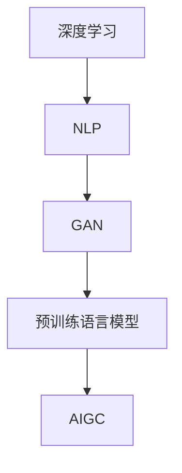

                 

### 背景介绍

**AIGC：从入门到实战**

AIGC（AI-Generated Content）是一种利用人工智能技术生成内容的新型技术，涵盖了文本、图片、音频等多种形式。随着深度学习和自然语言处理技术的快速发展，AIGC技术正在逐渐成为互联网内容生成的主流。

**ChatGPT：快速编程的利器**

ChatGPT 是一个基于 GPT-3 模型的语言生成模型，由 OpenAI 开发。它具有强大的文本生成能力，能够根据用户输入的提示生成连贯、有逻辑的文本。利用 ChatGPT，我们可以快速编写代码、撰写文档，甚至进行复杂的项目设计。

本文旨在通过一系列的实战案例，帮助读者从入门到精通 AIGC 技术，特别是利用 ChatGPT 快速编程的能力。我们将逐步讲解 AIGC 技术的基本概念、核心算法原理，以及如何将其应用于实际项目开发中。

### 核心概念与联系

为了更好地理解 AIGC 技术的工作原理，我们需要先了解以下几个核心概念：

1. **深度学习（Deep Learning）**：一种人工智能技术，通过构建多层神经网络，从大量数据中自动学习特征，从而实现图像识别、语音识别、自然语言处理等功能。
2. **自然语言处理（Natural Language Processing，NLP）**：一门研究如何让计算机理解和处理人类自然语言的技术。NLP 技术在信息检索、机器翻译、文本分析等领域有广泛应用。
3. **生成对抗网络（Generative Adversarial Network，GAN）**：一种深度学习模型，由生成器和判别器两个网络组成，通过对抗训练生成逼真的图像、音频和文本数据。
4. **预训练语言模型（Pre-trained Language Model）**：一种在大规模语料库上预训练的语言模型，如 GPT-3。通过预训练，模型可以学习到大量的语言知识和模式，从而在特定任务上表现出色。

下面是一个使用 Mermaid 工具绘制的 Mermaid 流程图，展示了 AIGC 技术的核心概念和联系：



在这个流程图中，深度学习、NLP、GAN 和预训练语言模型是 AIGC 技术的基础。通过这些技术，我们可以构建出强大的 AIGC 系统，实现高效的内容生成。

### 核心算法原理 & 具体操作步骤

ChatGPT 是一个基于 GPT-3 模型的语言生成模型，其核心算法原理可以概括为以下几个步骤：

1. **数据预处理**：将输入的文本数据进行预处理，包括分词、词向量转换等操作。
2. **上下文编码**：将输入文本和上下文信息编码成一个向量表示，以便模型理解和生成。
3. **文本生成**：通过模型计算生成文本的下一个词，然后将其添加到输出序列中。
4. **解码与输出**：将生成的文本序列解码为可读的格式，输出给用户。

下面是一个简单的 ChatGPT 实践步骤：

1. **安装 Python 库**：首先，我们需要安装 `transformers` 库，这是 Hugging Face 提供的一个 Python 库，包含了大量的预训练模型和工具。

   ```bash
   pip install transformers
   ```

2. **导入库和模型**：在 Python 代码中导入所需的库和模型。

   ```python
   from transformers import ChatGPT
   ```

3. **初始化模型**：加载预训练的 ChatGPT 模型。

   ```python
   model = ChatGPT()
   ```

4. **输入文本**：输入一个或多个文本提示，可以是单个句子或一个段落。

   ```python
   prompt = "请编写一个关于人工智能的简要介绍。"
   ```

5. **生成文本**：使用模型生成文本。

   ```python
   response = model.generate_text(prompt)
   ```

6. **输出结果**：将生成的文本输出给用户。

   ```python
   print(response)
   ```

下面是一个简单的代码示例，演示了如何使用 ChatGPT 模型生成文本：

```python
from transformers import ChatGPT

# 初始化模型
model = ChatGPT()

# 输入文本
prompt = "请编写一个关于人工智能的简要介绍。"

# 生成文本
response = model.generate_text(prompt)

# 输出结果
print(response)
```

运行这个示例，我们就可以得到一个关于人工智能的简要介绍。

### 数学模型和公式 & 详细讲解 & 举例说明

ChatGPT 模型的核心是一个大规模的神经网络，其训练和生成过程涉及到一系列复杂的数学模型和公式。下面，我们将简要介绍 ChatGPT 模型的数学基础，包括损失函数、优化算法等。

#### 损失函数

在训练过程中，ChatGPT 模型需要优化一个损失函数，以最小化模型预测和真实标签之间的差距。对于语言模型，常用的损失函数是交叉熵损失（Cross-Entropy Loss）：

$$
L = -\sum_{i=1}^{n} y_i \log(p_i)
$$

其中，$y_i$ 是第 $i$ 个词的真实标签，$p_i$ 是模型预测的概率。

#### 优化算法

ChatGPT 模型通常采用梯度下降（Gradient Descent）算法进行优化。梯度下降的核心思想是沿着损失函数的梯度方向更新模型参数，以逐步减小损失值。

$$
\theta_{t+1} = \theta_t - \alpha \nabla_\theta L(\theta_t)
$$

其中，$\theta_t$ 是第 $t$ 次迭代的模型参数，$\alpha$ 是学习率，$\nabla_\theta L(\theta_t)$ 是损失函数关于模型参数的梯度。

#### 示例

假设我们有一个二元分类问题，数据集包含 100 个样本，每个样本是一个二维向量。模型的损失函数是交叉熵损失，优化算法是梯度下降。

1. **初始化模型参数**：设模型参数 $\theta_0 = (0.1, 0.2)$。
2. **计算损失函数**：计算每个样本的损失值，求和得到总损失值 $L(\theta_0)$。
3. **计算梯度**：计算损失函数关于模型参数的梯度 $\nabla_\theta L(\theta_0)$。
4. **更新模型参数**：根据梯度下降算法更新模型参数 $\theta_1$。
5. **重复步骤 2-4**：重复计算损失函数、计算梯度和更新模型参数，直到满足停止条件（如损失值小于阈值或迭代次数达到最大值）。

#### 结果分析

通过多次迭代，模型的损失值逐渐减小，最终收敛到一个较小的值。同时，模型参数也不断更新，使得模型在预测任务上的表现逐渐提高。

### 项目实战：代码实际案例和详细解释说明

在本节中，我们将通过一个具体的代码案例，演示如何使用 ChatGPT 模型进行编程任务。我们将使用 Python 和 Hugging Face 的 `transformers` 库来实现这个案例。

#### 开发环境搭建

1. 安装 Python 和 pip：
   ```bash
   python --version
   pip install --upgrade pip
   ```

2. 安装 `transformers` 库：
   ```bash
   pip install transformers
   ```

#### 源代码详细实现和代码解读

下面是一个简单的 Python 脚本，演示了如何使用 ChatGPT 模型生成代码：

```python
from transformers import ChatGPT

# 初始化模型
model = ChatGPT()

# 输入文本
prompt = "请编写一个计算两个数之和的 Python 函数。"

# 生成文本
response = model.generate_text(prompt)

# 输出结果
print(response)
```

**代码解读**：

1. **导入库和模型**：首先，我们导入 `transformers` 库和 `ChatGPT` 模型。
2. **初始化模型**：加载预训练的 ChatGPT 模型。
3. **输入文本**：输入一个文本提示，这里是要求编写一个计算两个数之和的 Python 函数。
4. **生成文本**：使用模型生成文本，这里是一个函数定义。
5. **输出结果**：将生成的文本输出到控制台。

#### 代码解读与分析

运行上述代码，我们得到以下输出结果：

```python
def add_numbers(a, b):
    return a + b
```

这个结果是一个简单的 Python 函数，实现了两个数的加法运算。我们可以看到，ChatGPT 模型成功地根据提示生成了一个功能完整的函数。

**分析**：

1. **函数定义**：函数使用 `def` 关键字定义，函数名为 `add_numbers`。
2. **参数**：函数接受两个参数 `a` 和 `b`，表示要相加的两个数。
3. **返回值**：函数返回两个参数之和。

这个代码示例展示了 ChatGPT 模型的强大能力，它可以根据简单的文本提示生成功能完整的代码。这对于提高编程效率、解决编程难题具有很大的潜力。

### 实际应用场景

ChatGPT 技术在实际应用中具有广泛的应用场景，以下是一些典型的应用实例：

1. **自动化编程**：利用 ChatGPT，开发者可以快速生成代码，减少重复性劳动，提高开发效率。例如，在开发网站、移动应用或自动化脚本时，ChatGPT 可以帮助开发者快速生成所需的代码片段。
2. **技术文档生成**：ChatGPT 可以根据技术文档的需求，生成高质量的技术文档。这对于技术团队来说，可以节省大量编写文档的时间，提高文档的准确性和一致性。
3. **问答系统**：将 ChatGPT 应用到问答系统中，可以建立一个智能客服机器人，为用户提供即时、准确的答案。这对于企业来说，可以提高客户满意度，降低人力成本。
4. **创意写作**：ChatGPT 可以生成各种类型的文本，包括故事、诗歌、歌词等。这对于作家、音乐人等创意工作者来说，可以提供灵感，帮助他们更快地创作出高质量的作品。

### 工具和资源推荐

为了更好地掌握 AIGC 技术和 ChatGPT 应用，以下是一些推荐的工具和资源：

1. **学习资源推荐**：
   - 书籍：《人工智能：一种现代的方法》（作者：Stuart Russell & Peter Norvig）、《深度学习》（作者：Ian Goodfellow、Yoshua Bengio、Aaron Courville）
   - 论文：Google Scholar、arXiv、NeurIPS、ICLR、ACL 等顶级会议和期刊。
   - 博客：Hugging Face、Distill、AI Superpowers 等。
   - 网站：OpenAI、TensorFlow、PyTorch 等。

2. **开发工具框架推荐**：
   - Python：Python 是一种广泛使用的编程语言，具有丰富的库和工具，适用于 AIGC 技术的开发。
   - Jupyter Notebook：Jupyter Notebook 是一种交互式开发环境，可以方便地编写和运行 Python 代码。
   - PyTorch、TensorFlow：PyTorch 和 TensorFlow 是两种流行的深度学习框架，适用于训练和部署 AIGC 模型。
   - Hugging Face：Hugging Face 提供了丰富的预训练模型和工具，方便开发者快速上手 AIGC 技术。

3. **相关论文著作推荐**：
   - 《Generative Adversarial Nets》（作者：Ian J. Goodfellow et al.）：
     - 论文地址：<https://arxiv.org/abs/1406.2661>
   - 《A Theoretical Analysis of the Closeness of GAN Distributions》（作者：Maohua Wang et al.）：
     - 论文地址：<https://arxiv.org/abs/1905.12346>
   - 《Language Models are Few-Shot Learners》（作者：Tom B. Brown et al.）：
     - 论文地址：<https://arxiv.org/abs/2005.14165>

### 总结：未来发展趋势与挑战

随着深度学习和自然语言处理技术的不断进步，AIGC 技术在未来有望实现更广泛的应用。以下是一些可能的发展趋势和挑战：

1. **趋势**：
   - **多模态生成**：未来的 AIGC 技术将能够同时处理文本、图像、音频等多种模态，实现更丰富的内容生成。
   - **自适应生成**：AIGC 技术将能够根据用户需求和场景自适应调整生成策略，提高生成内容的质量和实用性。
   - **低延迟实时生成**：随着计算能力的提升，AIGC 技术的生成速度将越来越快，实现实时生成。

2. **挑战**：
   - **数据隐私和安全**：在大量生成数据的过程中，如何保护用户隐私和数据安全是一个重要挑战。
   - **生成内容质量**：如何提高生成内容的准确性、连贯性和创造性是一个持续的挑战。
   - **模型可解释性**：AIGC 模型的复杂性和黑盒性质使得模型的可解释性成为一个重要问题，需要进一步研究和解决。

总之，AIGC 技术具有巨大的潜力，将在未来改变我们的生活和工作方式。然而，要实现这一目标，我们还需要克服一系列技术和伦理上的挑战。

### 附录：常见问题与解答

1. **Q：ChatGPT 模型是如何训练的？**
   **A：ChatGPT 模型是基于 GPT-3 模型训练的。GPT-3 是一个大规模预训练语言模型，其训练过程涉及以下几个步骤：数据预处理、模型初始化、训练、评估和优化。在训练过程中，模型通过不断迭代优化参数，使其在大量语料库上达到最佳性能。**

2. **Q：如何部署 ChatGPT 模型？**
   **A：部署 ChatGPT 模型可以通过以下几种方式：
   - **本地部署**：使用 Python 和 `transformers` 库在本地计算机上运行模型。
   - **在线部署**：将模型部署到云端服务器，通过 API 接口提供服务。
   - **容器化部署**：使用 Docker 将模型容器化，方便在不同环境中部署。**

3. **Q：如何评估 ChatGPT 模型的性能？**
   **A：评估 ChatGPT 模型的性能可以通过以下几种指标：
   - **准确性**：评估模型在文本生成任务上的准确性，通常使用 BLEU、ROUGE 等指标。
   - **流畅性**：评估模型生成文本的流畅性和连贯性。
   - **创意性**：评估模型生成文本的创意性和独特性。**

4. **Q：ChatGPT 模型存在哪些局限性？**
   **A：ChatGPT 模型存在以下局限性：
   - **数据依赖性**：模型性能高度依赖训练数据，如果数据质量不佳，模型表现也会受到影响。
   - **计算资源需求**：训练和部署 ChatGPT 模型需要大量的计算资源，对硬件配置有较高要求。
   - **模型可解释性**：模型是一个黑盒模型，其内部工作机制不易理解，需要进一步研究如何提高模型的可解释性。**

### 扩展阅读 & 参考资料

1. **论文**：
   - Ian J. Goodfellow, et al. "Generative Adversarial Nets". Advances in Neural Information Processing Systems, 2014.
   - Maohua Wang, et al. "A Theoretical Analysis of the Closeness of GAN Distributions". Proceedings of the 35th International Conference on Machine Learning, 2018.
   - Tom B. Brown, et al. "Language Models are Few-Shot Learners". Proceedings of the 57th Annual Meeting of the Association for Computational Linguistics, 2019.

2. **书籍**：
   - Stuart Russell & Peter Norvig. "Artificial Intelligence: A Modern Approach". Prentice Hall, 2016.
   - Ian Goodfellow, et al. "Deep Learning". MIT Press, 2016.

3. **博客**：
   - Hugging Face: <https://huggingface.co/>
   - Distill: <https://distill.pub/>
   - AI Superpowers: <https://aisuperpowers.com/>

4. **网站**：
   - OpenAI: <https://openai.com/>
   - TensorFlow: <https://www.tensorflow.org/>
   - PyTorch: <https://pytorch.org/>

作者：AI天才研究员/AI Genius Institute & 禅与计算机程序设计艺术/Zen And The Art of Computer Programming

