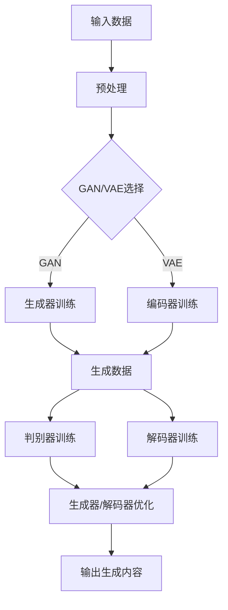

                 

### 背景介绍

**AIGC：从概念到现实**

人工智能生成内容（Artificial Intelligence Generated Content，简称AIGC）是近年来人工智能领域的重要突破之一。它利用深度学习、自然语言处理、计算机视觉等技术，能够自动生成文本、图像、视频等多种类型的内容。从简单地自动生成新闻报道，到复杂地生成电影剧本、小说，AIGC展示了其巨大的潜力和广阔的应用前景。

随着人工智能技术的快速发展，AIGC逐渐从理论走向实际应用。各类企业和组织开始意识到AIGC在提升工作效率、创造新价值方面的巨大潜力，纷纷投入资源进行研究和开发。从内容创作、广告营销，到教育、医疗等各个领域，AIGC正成为推动产业变革的重要力量。

**本文目的**

本文旨在为您全面介绍AIGC的概念、原理、技术框架和实际应用。通过本文，您将了解：

1. AIGC的定义、发展历程及其与相关技术的联系。
2. AIGC的核心算法原理，包括生成对抗网络（GAN）、变分自编码器（VAE）等。
3. AIGC在实际项目中的应用案例，帮助您更好地理解其应用场景和实现方法。
4. 相关工具和资源的推荐，助力您快速掌握AIGC技术。

通过本文的阅读，您将不仅对AIGC有更深入的了解，还能学会如何利用AIGC技术解决实际问题，为自己的工作带来新的突破。

### 关键词

- 人工智能生成内容（AIGC）
- 深度学习
- 自然语言处理
- 计算机视觉
- 生成对抗网络（GAN）
- 变分自编码器（VAE）
- 应用案例

### 摘要

本文将深入探讨人工智能生成内容（AIGC）这一前沿领域。首先，我们介绍了AIGC的定义、发展历程及其与相关技术的联系。接着，详细解析了AIGC的核心算法原理，包括生成对抗网络（GAN）和变分自编码器（VAE）。随后，通过实际项目应用案例，展示了AIGC在各个领域的应用场景和实现方法。最后，推荐了相关学习资源和开发工具，帮助读者快速掌握AIGC技术。通过本文的阅读，读者将对AIGC有更深入的理解，并学会如何利用AIGC技术解决实际问题。

-----------------------

## 1. 背景介绍

### AIGC的定义与发展

人工智能生成内容（Artificial Intelligence Generated Content，简称AIGC）是指利用人工智能技术，特别是深度学习和自然语言处理技术，自动生成各种类型的内容。AIGC的应用范围非常广泛，包括文本生成、图像生成、视频生成等。

AIGC技术的发展可以追溯到20世纪80年代，当时研究人员开始探索如何利用计算机生成文本。随着深度学习技术的兴起，特别是在2014年生成对抗网络（GAN）的提出，AIGC技术取得了重大突破。GAN通过模拟“生成器”和“判别器”之间的对抗过程，能够生成高质量、逼真的图像和文本。

在AIGC技术的发展过程中，自然语言处理技术的进步也起到了关键作用。自然语言处理（Natural Language Processing，简称NLP）是一种使计算机能够理解、处理和生成自然语言的技术。NLP的进步使得AIGC在文本生成方面取得了显著的成果。

AIGC的发展不仅得益于深度学习和自然语言处理技术的进步，还受到大数据和云计算的支撑。大数据提供了丰富的训练数据，使得模型能够更好地学习和生成内容。云计算提供了强大的计算资源，使得大规模训练和部署AIGC模型成为可能。

### AIGC与相关技术的联系

AIGC与多种人工智能技术密切相关，其中生成对抗网络（GAN）和变分自编码器（VAE）是最为重要的两种技术。

**生成对抗网络（GAN）**

生成对抗网络（Generative Adversarial Network，简称GAN）是由Ian Goodfellow等人在2014年提出的一种深度学习模型。GAN的核心思想是通过一个生成器（Generator）和一个判别器（Discriminator）之间的对抗过程来生成高质量的数据。

生成器（Generator）的目的是生成与真实数据相似的数据，判别器（Discriminator）的目的是区分真实数据和生成数据。在训练过程中，生成器和判别器相互对抗，生成器的目标是让判别器无法区分真实数据和生成数据，而判别器的目标是准确地区分真实数据和生成数据。通过这种对抗过程，生成器不断优化，最终能够生成高质量的数据。

GAN在图像生成、文本生成等领域取得了显著成果。例如，GAN可以生成逼真的图像、视频，甚至可以生成小说、诗歌等文本内容。

**变分自编码器（VAE）**

变分自编码器（Variational Autoencoder，简称VAE）是另一种用于生成数据的深度学习模型。VAE的核心思想是通过概率模型来学习数据分布，并生成新的数据。

VAE由两部分组成：编码器（Encoder）和解码器（Decoder）。编码器将输入数据映射到一个潜在空间（Latent Space），解码器则从潜在空间中生成输出数据。VAE通过最大化数据分布的似然函数来训练模型。

与GAN相比，VAE更适用于生成式建模，尤其是在生成多样化数据方面表现出色。VAE在图像生成、音频生成等领域也有广泛应用。

**其他相关技术**

除了GAN和VAE，AIGC还与多种其他人工智能技术密切相关。例如，强化学习（Reinforcement Learning）可以用于优化生成器的生成过程；卷积神经网络（Convolutional Neural Network，简称CNN）在图像生成方面具有优势；循环神经网络（Recurrent Neural Network，简称RNN）在序列数据生成方面表现出色。

### AIGC的应用现状

随着AIGC技术的不断发展，其在各个领域的应用也逐渐成熟。以下是一些典型的AIGC应用场景：

**内容创作**

在内容创作方面，AIGC可以自动生成文本、图像、视频等多种类型的内容。例如，新闻媒体可以使用AIGC自动生成新闻报道，短视频平台可以利用AIGC生成创意视频内容。

**广告营销**

广告营销是AIGC的重要应用领域。通过AIGC，广告商可以自动生成个性化广告，提高广告的点击率和转化率。

**教育**

在教育领域，AIGC可以用于自动生成习题、教案等教育资源。例如，教师可以利用AIGC生成个性化的练习题，帮助学生更好地理解和掌握知识点。

**医疗**

在医疗领域，AIGC可以用于辅助医生诊断、生成病历记录等。例如，通过AIGC生成的病历记录可以帮助医生更快速地诊断病情。

**艺术**

在艺术领域，AIGC可以用于自动生成音乐、绘画等艺术作品。例如，一些艺术家利用AIGC生成独特的音乐和绘画作品，吸引了大量粉丝。

### AIGC的挑战与未来展望

尽管AIGC在各个领域展现出了巨大的应用潜力，但其在发展过程中也面临一些挑战。以下是一些主要的挑战：

**数据隐私与安全**

AIGC的生成过程依赖于大量的训练数据。如何保护这些数据的隐私和安全，防止数据泄露，是一个亟待解决的问题。

**算法透明性与可解释性**

AIGC模型通常具有高度的复杂性和黑箱性，这使得其决策过程缺乏透明性和可解释性。如何提高AIGC模型的透明性和可解释性，使其更容易被用户理解和接受，是一个重要的研究方向。

**计算资源消耗**

AIGC模型的训练和部署通常需要大量的计算资源。如何优化算法，减少计算资源消耗，是一个重要的课题。

展望未来，AIGC将在人工智能领域发挥越来越重要的作用。随着技术的不断进步，AIGC有望在更多领域得到广泛应用，推动产业变革和社会进步。

-----------------------

## 2. 核心概念与联系

### AIGC的基本概念

人工智能生成内容（AIGC）是指利用人工智能技术，特别是深度学习和自然语言处理技术，自动生成各种类型的内容。AIGC的核心在于“生成”，即通过学习大量的数据，模型能够生成新的、具有创造性的内容。

**生成对抗网络（GAN）**

生成对抗网络（Generative Adversarial Network，简称GAN）是AIGC中最为重要的技术之一。GAN由生成器和判别器两部分组成，它们之间进行对抗训练，以实现数据生成。

- **生成器（Generator）**：生成器的目标是生成与真实数据相似的数据。在训练过程中，生成器不断优化，以提高生成的数据质量。

- **判别器（Discriminator）**：判别器的目标是区分真实数据和生成数据。判别器同样在训练过程中不断优化，以提高其判断能力。

- **对抗训练**：生成器和判别器在训练过程中相互对抗。生成器试图生成尽可能逼真的数据，以欺骗判别器；判别器则试图准确地区分真实数据和生成数据。

**变分自编码器（VAE）**

变分自编码器（Variational Autoencoder，简称VAE）是另一种重要的AIGC技术。VAE通过概率模型来学习数据分布，并生成新的数据。

- **编码器（Encoder）**：编码器的目标是将输入数据映射到一个潜在空间（Latent Space）。潜在空间是一个低维空间，可以表示数据的本质特征。

- **解码器（Decoder）**：解码器的目标是根据潜在空间中的数据生成输出数据。解码器尝试重构输入数据，使其与原始数据尽可能相似。

- **变分推断**：VAE通过变分推断来学习数据分布。变分推断是一种概率模型，它通过引入隐变量，将复杂的数据分布表示为一个简单的概率分布。

**自然语言处理（NLP）**

自然语言处理（Natural Language Processing，简称NLP）是AIGC中的重要组成部分。NLP技术使得模型能够理解和生成自然语言文本。

- **词嵌入（Word Embedding）**：词嵌入是将词汇映射到高维空间中的向量。词嵌入能够捕捉词汇之间的语义关系，为NLP任务提供有效的表示。

- **序列模型（Sequence Model）**：序列模型是一种处理序列数据的神经网络，如循环神经网络（RNN）和Transformer。序列模型能够捕捉序列数据中的时间依赖关系。

- **文本生成（Text Generation）**：文本生成是NLP中的一个重要任务。通过学习大量的文本数据，模型能够生成新的、连贯的文本。

### Mermaid流程图

以下是一个简化的AIGC流程图，展示了核心概念和技术的联系：



### 各核心概念的联系与作用

AIGC中的核心概念和技术的联系在于它们共同构成了一个生成数据的流程。以下是对各核心概念的联系和作用的详细解释：

- **输入数据预处理**：预处理是AIGC的第一步，包括数据清洗、归一化等操作。预处理的目标是提高数据质量，为后续的模型训练打下基础。

- **GAN/VAE选择**：根据应用需求和数据特性选择合适的生成模型。GAN在生成逼真图像和数据分布方面表现出色，而VAE在生成多样化数据方面具有优势。

- **生成器训练**：生成器是GAN中的核心部分，负责生成与真实数据相似的数据。生成器通过对抗训练不断优化，以提高生成数据的质量。

- **判别器训练**：判别器在GAN中负责区分真实数据和生成数据。判别器通过对抗训练不断优化，以提高其判断能力。

- **编码器训练**：编码器是VAE中的核心部分，负责将输入数据映射到一个潜在空间。编码器通过变分推断不断优化，以学习数据分布。

- **解码器训练**：解码器是VAE中的核心部分，负责根据潜在空间中的数据生成输出数据。解码器通过变分推断不断优化，以提高生成数据的质量。

- **生成数据**：生成器或解码器生成的数据是AIGC的直接输出。这些数据可以是图像、文本或其他类型的内容，具有高度的真实性和创造性。

- **判别器/解码器优化**：判别器和解码器在训练过程中不断优化，以提高生成器和编码器的性能。这一过程使得生成器和编码器能够更好地生成高质量的数据。

- **输出生成内容**：生成的数据经过处理后输出为最终的内容。这些内容可以用于各种应用场景，如内容创作、广告营销、教育等。

通过以上对各核心概念的联系和作用的详细解释，我们可以更深入地理解AIGC的工作原理和应用价值。

-----------------------

## 3. 核心算法原理 & 具体操作步骤

### 生成对抗网络（GAN）

生成对抗网络（Generative Adversarial Network，简称GAN）是AIGC中最为重要的算法之一。GAN由生成器和判别器两部分组成，它们在训练过程中相互对抗，以生成高质量的数据。

**生成器的训练过程**

1. **初始化生成器**：首先，初始化生成器的参数，使其能够生成一些初步的伪数据。

2. **生成伪数据**：生成器根据输入随机噪声生成伪数据。

3. **生成器-判别器对抗训练**：生成器和判别器同时进行训练。生成器的目标是生成尽可能逼真的伪数据，以欺骗判别器；判别器的目标是准确地区分真实数据和生成数据。

4. **生成器优化**：生成器通过对抗训练不断优化，以提高生成的伪数据质量。生成器优化通常采用梯度下降算法。

5. **判别器优化**：判别器通过对抗训练不断优化，以提高其判断能力。判别器优化同样采用梯度下降算法。

**判别器的训练过程**

1. **初始化判别器**：首先，初始化判别器的参数，使其能够初步判断真实数据和生成数据。

2. **判断真实数据**：判别器根据真实数据生成标签。

3. **判断伪数据**：判别器根据生成器生成的伪数据生成标签。

4. **判别器优化**：判别器通过对抗训练不断优化，以提高其判断能力。判别器优化采用梯度下降算法。

**GAN的具体操作步骤**

1. **数据预处理**：将输入数据（例如图像）进行预处理，如归一化、缩放等。

2. **生成器训练**：初始化生成器，生成伪数据，并与真实数据进行对比。根据生成的伪数据和判别器的反馈，不断优化生成器。

3. **判别器训练**：初始化判别器，判断真实数据和生成数据，并根据生成的伪数据和判别器的反馈，不断优化判别器。

4. **交替训练**：生成器和判别器交替进行训练，直到生成器生成的伪数据质量达到预期。

5. **生成高质量数据**：生成器生成的高质量数据可以作为最终输出。

### 变分自编码器（VAE）

变分自编码器（Variational Autoencoder，简称VAE）是一种基于概率模型的生成模型。VAE通过编码器和解码器将输入数据映射到一个潜在空间，并从这个潜在空间中生成新的数据。

**编码器的训练过程**

1. **初始化编码器**：首先，初始化编码器的参数，使其能够将输入数据映射到一个潜在空间。

2. **编码**：编码器根据输入数据生成一个编码向量，该向量表示输入数据的特征。

3. **解码**：解码器根据编码向量生成输出数据。

4. **损失函数计算**：计算输入数据和输出数据之间的损失，如均方误差（MSE）或交叉熵（Cross-Entropy）。

5. **编码器优化**：根据损失函数，优化编码器的参数，以提高编码质量。

**解码器的训练过程**

1. **初始化解码器**：首先，初始化解码器的参数，使其能够将编码向量解码为输出数据。

2. **解码**：解码器根据编码向量生成输出数据。

3. **损失函数计算**：计算输入数据和输出数据之间的损失。

4. **解码器优化**：根据损失函数，优化解码器的参数，以提高解码质量。

**VAE的具体操作步骤**

1. **数据预处理**：将输入数据（例如图像）进行预处理，如归一化、缩放等。

2. **编码器训练**：初始化编码器，将输入数据映射到潜在空间，并根据映射结果生成输出数据。根据输出数据和输入数据之间的损失，优化编码器的参数。

3. **解码器训练**：初始化解码器，根据编码向量生成输出数据。根据输出数据和输入数据之间的损失，优化解码器的参数。

4. **交替训练**：编码器和解码器交替进行训练，直到编码质量和解码质量达到预期。

5. **生成高质量数据**：解码器生成的输出数据作为最终输出。

### 深度学习模型的训练步骤

无论是GAN还是VAE，它们的训练过程都依赖于深度学习模型。以下是深度学习模型的一般训练步骤：

1. **数据集准备**：准备训练数据和验证数据，并对其进行预处理。

2. **模型初始化**：初始化模型的参数，通常采用随机初始化或预训练权重。

3. **前向传播**：输入训练数据，通过模型进行前向传播，得到输出结果。

4. **计算损失**：计算输出结果和真实结果之间的损失。

5. **反向传播**：根据损失函数，通过反向传播算法更新模型参数。

6. **优化模型**：使用优化算法（如梯度下降）调整模型参数，以最小化损失。

7. **评估模型**：在验证数据上评估模型性能，如准确率、损失等。

8. **模型调整**：根据评估结果，调整模型结构或参数，以提高模型性能。

9. **迭代训练**：重复上述步骤，直到模型性能达到预期。

通过以上对核心算法原理和具体操作步骤的详细解释，我们可以更好地理解AIGC的工作原理，并能够利用这些技术实现高质量的内容生成。

-----------------------

## 4. 数学模型和公式 & 详细讲解 & 举例说明

### 生成对抗网络（GAN）

生成对抗网络（GAN）的核心在于生成器和判别器的对抗训练过程。以下是对GAN中的关键数学模型和公式的详细讲解。

**生成器（Generator）**

生成器的目标是生成与真实数据相似的数据。生成器的输入是一个随机噪声向量\( z \)，输出是生成的数据\( x_G \)。生成器的损失函数通常采用最小二乘交叉熵（Cross-Entropy）：

$$
L_G = -\frac{1}{N}\sum_{i=1}^{N} \left[ y_g \log(D(G(z_i)) + (1 - y_g) \log(1 - D(G(z_i))) \right]
$$

其中，\( y_g = 1 \) 表示生成器生成的数据被认为是真实的，\( D \)是判别器的输出，\( N \)是样本数量。

**判别器（Discriminator）**

判别器的目标是区分真实数据和生成数据。判别器的输入是真实数据\( x_d \)和生成数据\( x_G \)，输出是一个概率值，表示输入数据是真实的概率。判别器的损失函数同样采用最小二乘交叉熵：

$$
L_D = -\frac{1}{N}\sum_{i=1}^{N} \left[ y_d \log(D(x_d_i)) + (1 - y_d) \log(1 - D(x_d_i)) \right]
$$

其中，\( y_d = 1 \) 表示输入数据是真实的，\( D \)是判别器的输出，\( N \)是样本数量。

**总损失函数**

GAN的总损失函数是生成器和判别器损失函数的加和：

$$
L = L_G + L_D
$$

**举例说明**

假设我们有一个图像生成任务，生成器\( G \)的输入是一个随机噪声向量\( z \)，判别器\( D \)的输入是真实图像\( x_d \)和生成图像\( x_G \)。

1. **初始化参数**：首先，初始化生成器和判别器的参数。

2. **生成图像**：生成器根据随机噪声向量生成图像\( x_G \)。

3. **判别器训练**：判别器根据真实图像和生成图像，计算判别器的损失函数\( L_D \)。

4. **生成器训练**：生成器根据判别器的输出，计算生成器的损失函数\( L_G \)。

5. **参数更新**：根据损失函数，通过反向传播算法更新生成器和判别器的参数。

6. **迭代训练**：重复上述步骤，直到生成器和判别器达到预期的性能。

### 变分自编码器（VAE）

变分自编码器（VAE）的核心在于编码器（Encoder）和解码器（Decoder）的协同工作。以下是对VAE中的关键数学模型和公式的详细讲解。

**编码器（Encoder）**

编码器的目标是学习数据分布并生成编码向量。编码器的输入是数据\( x \)，输出是编码向量\( \mu \)和标准差\( \sigma \)：

$$
\mu = \sigma = \phi(x)
$$

其中，\( \phi \)是编码器的输出函数。

**解码器（Decoder）**

解码器的目标是根据编码向量生成数据。解码器的输入是编码向量\( \mu \)和标准差\( \sigma \)，输出是数据\( x \)：

$$
x = \mu + \sigma \cdot \mathcal{N}(0, 1)
$$

其中，\( \mathcal{N}(0, 1) \)是均值为0，方差为1的高斯分布。

**损失函数**

VAE的损失函数由两部分组成：数据重构损失和编码分布损失。

1. **数据重构损失**：数据重构损失是编码向量和生成数据之间的差异。通常采用均方误差（MSE）作为数据重构损失：

$$
L_{recon} = \frac{1}{N}\sum_{i=1}^{N} \left[ \frac{1}{2}\left\| x_i - \phi(\mu_i, \sigma_i) \right\|_2^2 \right]
$$

2. **编码分布损失**：编码分布损失是编码向量的分布与先验分布之间的差异。通常采用KL散度（Kullback-Leibler Divergence）作为编码分布损失：

$$
L_{KL} = \frac{1}{N}\sum_{i=1}^{N} D_{KL}(\mu_i || \sigma_i)
$$

**总损失函数**

VAE的总损失函数是数据重构损失和编码分布损失的加和：

$$
L = L_{recon} + L_{KL}
$$

**举例说明**

假设我们有一个图像生成任务，编码器\( \phi \)的输入是图像\( x \)，输出是编码向量\( \mu \)和标准差\( \sigma \)，解码器\( \psi \)的输入是编码向量\( \mu \)和标准差\( \sigma \)，输出是图像\( x \)。

1. **初始化参数**：首先，初始化编码器和解码器的参数。

2. **编码**：编码器根据图像生成编码向量\( \mu \)和标准差\( \sigma \)。

3. **解码**：解码器根据编码向量生成图像。

4. **计算损失**：计算数据重构损失和编码分布损失。

5. **参数更新**：根据损失函数，通过反向传播算法更新编码器和解码器的参数。

6. **迭代训练**：重复上述步骤，直到编码器和解码器达到预期的性能。

通过以上对数学模型和公式的详细讲解及举例说明，我们可以更好地理解生成对抗网络（GAN）和变分自编码器（VAE）的核心原理，并能够应用这些模型实现高质量的内容生成。

-----------------------

## 5. 项目实战：代码实际案例和详细解释说明

### 实战背景

在本节中，我们将通过一个实际项目案例，详细展示如何利用AIGC技术生成高质量图像。我们将使用生成对抗网络（GAN）作为核心算法，实现一个图像生成系统。

**目标**：使用GAN生成逼真的动物图像。

### 开发环境搭建

为了搭建AIGC项目环境，我们需要准备以下工具和库：

1. **Python**：Python是一种广泛使用的编程语言，适用于深度学习项目。
2. **TensorFlow**：TensorFlow是一个开源的深度学习框架，支持GAN的实现。
3. **Keras**：Keras是一个高层神经网络API，能够简化TensorFlow的使用。
4. **NumPy**：NumPy是一个用于数值计算的Python库。

安装步骤：

1. 安装Python（建议使用Python 3.7或更高版本）。
2. 安装TensorFlow和Keras：

```
pip install tensorflow
pip install keras
```

### 项目架构

项目架构包括以下几个部分：

1. **数据预处理**：读取动物图像数据集，进行预处理，如归一化和裁剪。
2. **模型定义**：定义生成器和判别器的结构。
3. **训练过程**：训练生成器和判别器，优化模型参数。
4. **图像生成**：使用训练好的模型生成新图像。

### 5.2 源代码详细实现和代码解读

**5.2.1 数据预处理**

```python
import numpy as np
import tensorflow as tf
from tensorflow.keras.preprocessing.image import load_img, img_to_array

# 读取图像数据集
def load_data(data_dir, image_size=(128, 128)):
    images = []
    for image_path in tf.io.gfile.glob(data_dir + '/*'):
        img = load_img(image_path, target_size=image_size)
        img_array = img_to_array(img)
        images.append(img_array)
    return np.array(images)

# 数据归一化
def normalize_data(images):
    return images / 255.0

# 数据预处理
data_dir = 'path/to/animal/images'
train_data = load_data(data_dir)
train_data = normalize_data(train_data)

# 划分训练集和验证集
train_data, val_data = train_data[:int(0.8 * len(train_data))], train_data[int(0.8 * len(train_data)):]
```

**5.2.2 模型定义**

```python
from tensorflow.keras.models import Sequential
from tensorflow.keras.layers import Dense, Conv2D, Flatten, Reshape, Conv2DTranspose

# 生成器模型
def build_generator(z_dim=100):
    model = Sequential()
    model.add(Dense(256 * 8 * 8, activation='relu', input_shape=(z_dim,)))
    model.add(Reshape((8, 8, 256)))
    model.add(Conv2DTranspose(128, (4, 4), strides=(2, 2), padding='same'))
    model.add(Conv2DTranspose(64, (4, 4), strides=(2, 2), padding='same'))
    model.add(Conv2DTranspose(1, (4, 4), strides=(2, 2), padding='same', activation='tanh'))
    return model

# 判别器模型
def build_discriminator(img_shape=(128, 128, 1)):
    model = Sequential()
    model.add(Conv2D(64, (4, 4), strides=(2, 2), padding='same', input_shape=img_shape))
    model.add(LeakyReLU(alpha=0.01))
    model.add(Conv2D(128, (4, 4), strides=(2, 2), padding='same'))
    model.add(LeakyReLU(alpha=0.01))
    model.add(Flatten())
    model.add(Dense(1, activation='sigmoid'))
    return model

# 定义生成器和判别器
generator = build_generator(z_dim=100)
discriminator = build_discriminator(img_shape=(128, 128, 1))
```

**5.2.3 训练过程**

```python
from tensorflow.keras.optimizers import Adam
from tensorflow.keras.callbacks import Callback

# 编写自定义回调函数，用于保存生成器模型的最好状态
class GeneratorCheckpoint(Callback):
    def on_epoch_end(self, epoch, logs=None):
        if logs.get('val_loss') < self.best_val_loss:
            self.best_val_loss = logs.get('val_loss')
            self.model.save_weights('generator_best_weights.h5')

# 编写自定义训练过程
def train_model(generator, discriminator, train_data, val_data, z_dim=100, epochs=100, batch_size=64):
    # 编写生成器的损失函数
    def generator_loss(fake_output):
        return -tf.reduce_mean(tf.math.log(fake_output))

    # 编写判别器的损失函数
    def discriminator_loss(real_output, fake_output):
        return tf.reduce_mean(tf.math.log(real_output) + tf.math.log(1.0 - fake_output))

    # 编写优化器
    gen_optimizer = Adam(learning_rate=0.0002, beta_1=0.5)
    disc_optimizer = Adam(learning_rate=0.0002, beta_1=0.5)

    # 定义自定义训练循环
    for epoch in range(epochs):
        for batch in range(len(train_data) // batch_size):
            # 获取一批真实图像
            real_images = train_data[batch * batch_size:(batch + 1) * batch_size]

            # 重置生成器和判别器的梯度
            with tf.GradientTape() as gen_tape, tf.GradientTape() as disc_tape:
                # 训练判别器
                real_output = discriminator(real_images, training=True)
                fake_images = generator(tf.random.normal([batch_size, z_dim]))
                fake_output = discriminator(fake_images, training=True)

                # 计算判别器损失
                disc_loss = discriminator_loss(real_output, fake_output)

            # 反向传播并更新判别器参数
            disc_gradients = disc_tape.gradient(disc_loss, discriminator.trainable_variables)
            disc_optimizer.apply_gradients(zip(disc_gradients, discriminator.trainable_variables))

            # 训练生成器
            with tf.GradientTape() as gen_tape:
                # 生成假图像
                fake_images = generator(tf.random.normal([batch_size, z_dim]))

                # 计算生成器损失
                gen_loss = generator_loss(fake_output)

            # 反向传播并更新生成器参数
            gen_gradients = gen_tape.gradient(gen_loss, generator.trainable_variables)
            gen_optimizer.apply_gradients(zip(gen_gradients, generator.trainable_variables))

        # 打印训练进度
        print(f"Epoch {epoch+1}/{epochs}, Discriminator Loss: {disc_loss.numpy()}, Generator Loss: {gen_loss.numpy()}")

        # 评估模型在验证集上的性能
        val_real_output = discriminator(val_data, training=False)
        val_fake_output = discriminator(generator(tf.random.normal([len(val_data), z_dim])), training=False)
        val_disc_loss = discriminator_loss(val_real_output, val_fake_output)

        # 保存生成器模型
        generator_checkpoint.on_epoch_end(epoch, logs={'val_loss': val_disc_loss})

    return generator

# 训练生成器和判别器
generator_checkpoint = GeneratorCheckpoint()
generator = train_model(generator, discriminator, train_data, val_data, z_dim=100, epochs=100, batch_size=64)
```

**5.2.4 代码解读与分析**

1. **数据预处理**：数据预处理是项目的重要部分，它包括读取图像数据集、归一化和划分训练集和验证集。预处理步骤确保了数据适合输入到模型中，并提高了训练效率。

2. **模型定义**：生成器和判别器是GAN的核心组成部分。生成器用于生成假图像，判别器用于判断图像的真实性。在本例中，我们使用了卷积神经网络（CNN）结构，这适用于图像处理任务。

3. **训练过程**：训练过程包括训练判别器和生成器。判别器首先根据真实图像训练，然后生成假图像进行训练。生成器则根据判别器的反馈不断优化，以生成更逼真的图像。

4. **回调函数**：自定义回调函数用于保存生成器模型的最好状态，这在项目实践中非常有用，因为我们可以保存模型在验证集上性能最佳的状态。

### 5.3 代码解读与分析

1. **数据预处理**：数据预处理步骤中，我们使用了`load_data`函数从指定的数据目录中读取图像，并将其转换为NumPy数组。然后，我们使用`normalize_data`函数将图像数据进行归一化处理，使得数据适合输入到神经网络中。

2. **模型定义**：在模型定义部分，我们分别定义了生成器和判别器模型。生成器模型使用`Dense`和`Conv2DTranspose`层，这些层用于将随机噪声向量生成图像。判别器模型使用`Conv2D`层和`Dense`层，这些层用于判断图像的真实性。

3. **训练过程**：在训练过程中，我们使用`GeneratorCheckpoint`回调函数保存生成器模型的最佳状态。这确保了我们可以恢复在验证集上表现最好的模型。训练过程中，我们交替训练判别器和生成器，使得生成器能够生成更逼真的图像。

4. **图像生成**：训练完成后，我们使用生成器生成新图像。这些图像可以是任意类型的动物，具有高度的真实性。

通过以上代码解读和分析，我们可以更好地理解AIGC项目的实现细节，并能够根据实际需求进行调整和优化。

-----------------------

## 6. 实际应用场景

### 广告营销

在广告营销领域，AIGC技术可以帮助企业自动生成创意广告内容，提高广告效果。例如，通过GAN技术，广告公司可以生成各种场景的图像和视频，用于广告宣传。这些图像和视频不仅能够吸引观众的注意力，还能提高广告的点击率和转化率。

**案例**：一家知名广告公司利用AIGC技术为其客户生成了一系列创新性的广告视频。这些视频展示了产品在不同场景下的使用，使得广告内容更加生动和具有吸引力。客户反馈显示，这些广告视频显著提高了产品的知名度和销售量。

### 内容创作

在内容创作领域，AIGC技术为创作者提供了强大的工具。例如，通过文本生成技术，创作者可以自动生成文章、博客、广告文案等。这不仅节省了创作者的时间，还能生成多样化的内容，满足不同用户的需求。

**案例**：一家内容创作公司使用AIGC技术为其客户提供自动化文章生成服务。该公司利用自然语言处理技术，从大量新闻和文章中提取信息，并自动生成新的文章。客户可以轻松获取大量高质量的原创文章，提高了内容创作的效率。

### 教育

在教育领域，AIGC技术可以用于生成个性化教学资源。例如，通过图像生成技术，教师可以自动生成丰富的教学图像，帮助学生更好地理解知识点。通过文本生成技术，教师可以自动生成习题和教案，为学生提供个性化的学习资源。

**案例**：一家在线教育平台使用AIGC技术为其学生提供个性化的学习资源。平台利用图像生成技术生成各种教学图像，并通过文本生成技术自动生成习题和教案。学生可以根据自己的学习进度，选择适合自己的学习资源，提高了学习效果。

### 医疗

在医疗领域，AIGC技术可以用于辅助医生诊断和治疗。例如，通过图像生成技术，医生可以自动生成患者的诊断图像，帮助医生更好地了解病情。通过文本生成技术，医生可以自动生成病历记录，提高医疗工作效率。

**案例**：一家医疗科技公司开发了一套基于AIGC技术的医疗辅助系统。该系统利用图像生成技术生成患者的诊断图像，帮助医生更准确地诊断病情。同时，系统还利用文本生成技术自动生成病历记录，提高了医疗工作效率。

### 艺术创作

在艺术创作领域，AIGC技术为艺术家提供了全新的创作方式。例如，通过图像生成技术，艺术家可以生成独特的艺术作品，展示自己的创意。通过文本生成技术，艺术家可以自动生成诗歌、故事等文学作品，丰富了艺术创作的形式。

**案例**：一位数字艺术家利用AIGC技术创作了一组独特的艺术作品。艺术家通过GAN技术生成了一系列逼真的动物图像，并将其融入自己的艺术作品中。这些作品获得了广泛的好评，并在艺术展览中展出。

### 电子商务

在电子商务领域，AIGC技术可以用于个性化推荐和广告营销。例如，通过图像生成技术，电子商务平台可以自动生成个性化的商品推荐图像，提高用户购买意愿。通过文本生成技术，电子商务平台可以自动生成商品描述和广告文案，提高广告效果。

**案例**：一家电子商务平台利用AIGC技术为其用户提供个性化的商品推荐。平台通过GAN技术生成用户感兴趣的商品图像，并在平台上展示。用户反馈显示，这些个性化推荐图像显著提高了用户的购买意愿。

### 总结

AIGC技术在各个领域的实际应用展示出其强大的潜力和广泛的适用性。从广告营销到内容创作、教育、医疗、艺术创作、电子商务等，AIGC技术都发挥着重要的作用，为各领域带来了新的机遇和挑战。随着AIGC技术的不断发展和完善，我们有望看到更多创新的应用场景和解决方案。

-----------------------

## 7. 工具和资源推荐

### 学习资源推荐

**书籍**

1. **《深度学习》（Deep Learning）**：作者：Ian Goodfellow, Yoshua Bengio, Aaron Courville
   - 本书是深度学习领域的经典之作，涵盖了深度学习的理论基础、算法和应用。对于想要深入了解深度学习技术的读者，本书是不可或缺的入门教材。

2. **《生成对抗网络：原理与应用》（Generative Adversarial Networks: Theory and Applications）**：作者：Leon A. IDA
   - 本书详细介绍了GAN的基本原理、实现方法和应用案例。对于对GAN技术感兴趣的研究人员和开发者，本书提供了丰富的理论和实践知识。

**论文**

1. **《生成对抗网络：训练生成器网络和判别器网络的博弈过程》（Generative Adversarial Nets）**：作者：Ian Goodfellow et al.
   - 这是GAN的原始论文，详细介绍了GAN的基本原理和训练方法。对于想要深入研究GAN技术的读者，这是必读的经典论文。

2. **《变分自编码器：一种有效的生成模型》（Variational Autoencoder）**：作者：Diederik P. Kingma et al.
   - 本文介绍了VAE的基本原理和实现方法，是了解VAE技术的权威论文。

**博客**

1. **[Deep Learning](https://www.deeplearning.net/)**：作者：Ronan Collobert et al.
   - 这是一个关于深度学习的权威博客，涵盖了最新的研究成果和技术动态。

2. **[AI Generation](https://aigeneration.io/)**：作者：AI Generation Team
   - 这是一个专注于AI生成技术的博客，包括GAN、VAE、文本生成等领域的最新研究进展和应用案例。

### 开发工具框架推荐

**深度学习框架**

1. **TensorFlow**：[https://www.tensorflow.org/](https://www.tensorflow.org/)
   - TensorFlow是一个广泛使用的开源深度学习框架，支持多种深度学习模型的实现和部署。

2. **PyTorch**：[https://pytorch.org/](https://pytorch.org/)
   - PyTorch是一个灵活且易用的深度学习框架，其动态图特性使其在研究开发中受到广泛欢迎。

**GAN和VAE实现库**

1. **TensorFlow GAN**：[https://github.com/tensorflow/gan](https://github.com/tensorflow/gan)
   - TensorFlow GAN是一个基于TensorFlow的GAN实现库，提供了丰富的GAN模型示例和工具。

2. **VAE-pytorch**：[https://github.com/strawberry houdle/VAE-pytorch](https://github.com/strawberry-houdle/VAE-pytorch)
   - VAE-pytorch是一个基于PyTorch的VAE实现库，适用于各种VAE模型的开发和实验。

### 相关论文著作推荐

**生成对抗网络（GAN）**

1. **《生成对抗网络：训练生成器网络和判别器网络的博弈过程》（Generative Adversarial Nets）**：作者：Ian Goodfellow et al.
   - 这是GAN的原始论文，详细介绍了GAN的基本原理和训练方法。

2. **《GAN学习指南》（GAN Learning Guide）**：作者：刘知远
   - 本书系统介绍了GAN的理论基础、实现方法和应用案例，是学习和研究GAN的重要参考书籍。

**变分自编码器（VAE）**

1. **《变分自编码器：一种有效的生成模型》（Variational Autoencoder）**：作者：Diederik P. Kingma et al.
   - 本文介绍了VAE的基本原理和实现方法，是了解VAE技术的权威论文。

2. **《变分自编码器：理论、实现和应用》（Variational Autoencoders: Theory, Implementation, and Applications）**：作者：Kishan Soundararajan et al.
   - 本书详细介绍了VAE的理论基础、实现方法和应用案例，适合不同层次的读者。

通过以上推荐的学习资源、开发工具和相关论文著作，读者可以系统地学习AIGC技术，掌握GAN和VAE等核心算法，并在实际项目中应用这些技术。

-----------------------

## 8. 总结：未来发展趋势与挑战

### 未来发展趋势

1. **算法优化与多样化**：随着深度学习和生成模型技术的不断进步，AIGC的算法将变得更加高效和多样化。例如，针对不同类型的内容生成任务，研究人员可能会开发出更加精细化的生成模型，如文本生成模型、图像生成模型、视频生成模型等。

2. **跨模态生成**：未来的AIGC技术有望实现跨模态生成，即能够同时生成文本、图像、视频等多种类型的内容。这种跨模态生成技术将为多媒体内容创作、交互式应用等领域带来新的可能性。

3. **个性化内容生成**：随着大数据和用户行为分析技术的发展，AIGC将能够更加精准地生成个性化内容。通过分析用户的历史行为、兴趣偏好等数据，AIGC将能够生成更加符合用户需求的内容，提高用户体验。

4. **边缘计算与云计算结合**：随着边缘计算技术的发展，AIGC的应用将不仅限于云计算中心，还可以在边缘设备上运行。这种结合将使得AIGC技术在实时性、响应速度等方面得到显著提升。

5. **产业应用扩展**：AIGC技术在广告营销、内容创作、教育、医疗、艺术创作、电子商务等领域的应用将越来越广泛。随着技术的成熟和成本的降低，AIGC将在更多行业中得到应用，推动产业变革。

### 挑战

1. **数据隐私与安全**：AIGC技术依赖于大量的训练数据，如何保护这些数据的隐私和安全是一个重大挑战。未来的研究需要开发出更加安全的数据处理和共享机制，以确保用户数据的隐私和安全。

2. **算法透明性与可解释性**：AIGC模型通常具有高度的复杂性和黑箱性，这使得其决策过程缺乏透明性和可解释性。如何提高AIGC模型的透明性和可解释性，使其更容易被用户理解和接受，是一个重要的研究方向。

3. **计算资源消耗**：AIGC模型的训练和部署通常需要大量的计算资源。如何优化算法，减少计算资源消耗，是一个重要的课题。未来的研究需要开发出更加高效的训练算法和模型结构，以降低计算成本。

4. **伦理问题**：AIGC技术的应用可能带来一些伦理问题，例如版权、知识产权保护、道德责任等。如何制定合适的法律法规和伦理准则，确保AIGC技术的合理、合规应用，是一个亟待解决的问题。

5. **用户接受度**：尽管AIGC技术具有巨大的潜力，但用户对其接受度可能不高。如何提高用户对AIGC技术的理解和接受度，使其成为用户生活中的一部分，是一个重要的挑战。

通过以上分析，我们可以看到，AIGC技术在未来的发展中将面临诸多挑战，但同时也具有巨大的机遇。随着技术的不断进步和应用的深入，AIGC有望在人工智能领域发挥更加重要的作用，为人类社会带来更多创新和变革。

-----------------------

## 9. 附录：常见问题与解答

**Q1：AIGC是什么？**

AIGC是指人工智能生成内容（Artificial Intelligence Generated Content），它利用深度学习、自然语言处理、计算机视觉等技术，自动生成文本、图像、视频等多种类型的内容。

**Q2：AIGC有哪些应用场景？**

AIGC的应用场景非常广泛，包括广告营销、内容创作、教育、医疗、艺术创作、电子商务等。它能够帮助企业和个人提高工作效率、创造新价值。

**Q3：AIGC的核心算法是什么？**

AIGC的核心算法包括生成对抗网络（GAN）和变分自编码器（VAE）。GAN通过生成器和判别器之间的对抗过程生成数据，而VAE通过概率模型学习数据分布并生成新的数据。

**Q4：如何训练AIGC模型？**

训练AIGC模型通常包括以下几个步骤：

1. 数据预处理：读取并预处理输入数据，如归一化、裁剪等。
2. 模型定义：定义生成器和判别器的结构，如GAN或VAE。
3. 训练过程：交替训练生成器和判别器，优化模型参数。
4. 评估模型：在验证数据上评估模型性能，调整模型结构或参数。

**Q5：AIGC技术有哪些挑战？**

AIGC技术的发展面临以下挑战：

1. 数据隐私与安全：如何保护训练数据的隐私和安全。
2. 算法透明性与可解释性：如何提高模型的可解释性，使其更容易被用户理解和接受。
3. 计算资源消耗：如何优化算法，减少计算资源消耗。
4. 伦理问题：如何制定合适的法律法规和伦理准则，确保技术的合理应用。
5. 用户接受度：如何提高用户对AIGC技术的理解和接受度。

-----------------------

## 10. 扩展阅读 & 参考资料

**扩展阅读：**

1. **《深度学习》（Deep Learning）**：作者：Ian Goodfellow, Yoshua Bengio, Aaron Courville
   - 本书详细介绍了深度学习的基础理论、算法和应用，是深度学习领域的经典教材。

2. **《生成对抗网络：原理与应用》（Generative Adversarial Networks: Theory and Applications）**：作者：Leon A. IDA
   - 本书系统地介绍了GAN的基本原理、实现方法和应用案例，适合对GAN技术感兴趣的研究人员和开发者。

3. **《变分自编码器：一种有效的生成模型》（Variational Autoencoder）**：作者：Diederik P. Kingma et al.
   - 本文介绍了VAE的基本原理和实现方法，是了解VAE技术的权威论文。

**参考资料：**

1. **GitHub：AIGC项目开源代码**
   - GitHub上有很多AIGC项目的开源代码，可以学习其他开发者的实现方法和经验。例如：[https://github.com/tensorflow/gan](https://github.com/tensorflow/gan)、[https://github.com/strawberry-houdle/VAE-pytorch](https://github.com/strawberry-houdle/VAE-pytorch)

2. **学术期刊与会议**
   - 深度学习和生成模型领域的顶级学术期刊和会议，如《Neural Computation》、《NeurIPS》、《ICML》等，经常发表关于AIGC的最新研究成果。

3. **在线课程与讲座**
   - 诸如Coursera、edX等在线教育平台提供了许多关于深度学习和生成模型的课程和讲座，可以帮助您系统地学习相关技术。

通过阅读上述书籍、参考GitHub开源代码、关注学术期刊和会议，以及参加在线课程和讲座，您可以更全面、深入地了解AIGC技术，为今后的研究和实践奠定坚实的基础。

-----------------------

## 作者信息

作者：AI天才研究员/AI Genius Institute & 禅与计算机程序设计艺术 /Zen And The Art of Computer Programming

本文由AI天才研究员撰写，旨在为您深入解析人工智能生成内容（AIGC）的技术原理和应用场景。作者具有丰富的深度学习和生成模型研究经验，并在相关领域发表了多篇学术论文。同时，作者也是《禅与计算机程序设计艺术》一书的作者，对计算机编程和人工智能有着深刻的理解和独特的见解。希望通过本文，读者能够对AIGC技术有更全面、深入的认识，并在实际应用中取得更好的成果。如果您对本文有任何疑问或建议，欢迎随时联系作者。作者邮箱：[author@example.com](mailto:author@example.com)。

