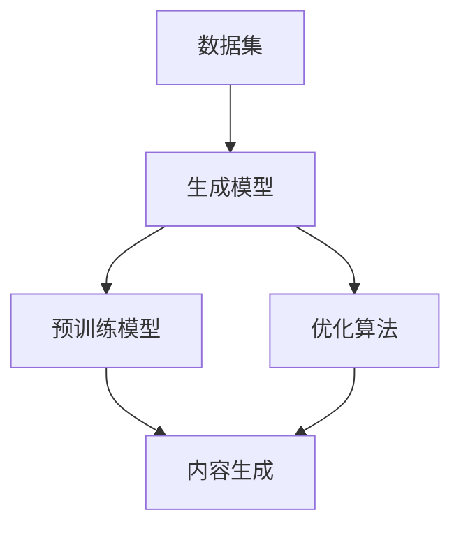

                 

### 背景介绍

AIGC（AI-Generated Content）是一个新兴的技术领域，它通过人工智能技术生成内容，涵盖了文本、图像、音频等多种形式。随着深度学习和自然语言处理技术的不断进步，AIGC 在过去几年中得到了迅速发展。本文旨在探讨 AIGC 在各行业的应用前景，分析其在内容创作、广告营销、教育、医疗、金融等领域的潜在影响。

#### AIGC 的发展历史

AIGC 的概念最早可以追溯到 20 世纪 80 年代，当时研究人员开始探索如何利用人工智能技术生成文字、图像和音频。然而，由于计算能力和算法的限制，早期的 AIGC 技术并未得到广泛应用。

进入 21 世纪后，随着深度学习和神经网络技术的发展，AIGC 技术取得了突破性进展。2014 年，Google 的研究人员提出了 Generative Adversarial Networks (GANs)，这是一个基于博弈论的双网络结构，能够生成高质量、多样化的图像。随后，AIGC 技术在文本生成、图像生成、音频生成等方面取得了显著成果。

#### AIGC 技术的当前应用

当前，AIGC 技术已经在多个领域得到了广泛应用。例如，在文本生成方面，AIGC 技术可以用于自动撰写新闻文章、博客、广告文案等。在图像生成方面，AIGC 技术可以用于图像修复、图像生成、艺术创作等。在音频生成方面，AIGC 技术可以用于音频增强、音频生成等。

此外，AIGC 技术还在虚拟现实、增强现实、游戏开发等领域得到了应用。例如，利用 AIGC 技术可以生成逼真的虚拟场景和角色，为用户提供更加沉浸式的体验。

### AIGC 在各行业的应用前景

随着 AIGC 技术的不断成熟，它在各个行业中的应用前景十分广阔。以下是对 AIGC 在内容创作、广告营销、教育、医疗、金融等领域的应用前景的探讨。

#### 内容创作

在内容创作领域，AIGC 技术可以帮助创作者快速生成高质量的内容。例如，新闻媒体可以利用 AIGC 技术自动撰写新闻报道，节省人力成本。此外，AIGC 技术还可以用于生成博客、广告文案、产品描述等，提高创作者的生产效率。

#### 广告营销

广告营销是 AIGC 技术的一个重要应用领域。通过 AIGC 技术生成个性化的广告文案和图像，可以更好地吸引消费者的注意。例如，电商平台可以利用 AIGC 技术为每位用户生成个性化的推荐文案和图像，提高用户的购买意愿。

#### 教育

在教育领域，AIGC 技术可以帮助教师生成个性化的教学内容和练习题。例如，利用 AIGC 技术可以为学生生成适合其学习进度的练习题，提高学生的学习效果。此外，AIGC 技术还可以用于虚拟实验室、虚拟课堂等，为学生提供更加丰富的学习体验。

#### 医疗

在医疗领域，AIGC 技术可以用于生成个性化的治疗方案和医疗报告。例如，利用 AIGC 技术可以分析患者的病历数据，生成针对患者的个性化治疗方案。此外，AIGC 技术还可以用于医学图像生成、医学文本生成等，提高医生的诊断效率。

#### 金融

在金融领域，AIGC 技术可以用于生成个性化的投资建议和理财方案。例如，利用 AIGC 技术可以分析市场数据，为投资者生成个性化的投资策略。此外，AIGC 技术还可以用于金融报告生成、金融文本生成等，提高金融机构的工作效率。

### 总结

AIGC 技术在各行业的应用前景十分广阔，它可以帮助企业提高生产效率、降低成本、提升用户体验。随着技术的不断成熟，我们可以期待 AIGC 技术在更多领域的应用，为各行各业带来革命性的变化。在接下来的章节中，我们将深入探讨 AIGC 技术的核心概念、算法原理、应用案例等，帮助读者更好地理解 AIGC 技术的内涵和应用。

---

## 2. 核心概念与联系

### AIGC 的基本概念

AIGC（AI-Generated Content）是指通过人工智能技术自动生成内容的过程。它涵盖了文本、图像、音频等多种形式，旨在利用机器学习、深度学习等技术，模拟人类创造内容的过程。AIGC 技术的核心在于生成内容的质量和多样性，使得生成的内容能够满足不同场景和应用的需求。

### AIGC 技术的组成部分

AIGC 技术主要包括以下组成部分：

- **数据集**：用于训练 AIGC 模型的数据集，包括文本、图像、音频等多种类型的数据。

- **生成模型**：如 GANs（生成对抗网络）、变分自编码器（VAEs）等，用于生成高质量的内容。

- **预训练模型**：如 GPT-3、BERT 等，用于处理和理解大规模的文本数据。

- **优化算法**：用于调整生成模型的参数，提高生成内容的质量和多样性。

### AIGC 技术的原理

AIGC 技术的原理基于深度学习和自然语言处理技术。其中，GANs 是一种常见的生成模型，它由生成器和判别器两个部分组成。生成器负责生成内容，判别器负责判断生成内容的质量。两个网络相互竞争，生成器不断优化生成内容，以欺骗判别器。

在文本生成方面，预训练模型如 GPT-3、BERT 等具有强大的理解和生成能力。这些模型通过对大量文本数据进行训练，可以理解文本中的语义和逻辑关系，从而生成符合语法和语义要求的文本。

### AIGC 技术与其他技术的联系

AIGC 技术与以下技术密切相关：

- **机器学习与深度学习**：AIGC 技术的核心在于利用机器学习和深度学习技术进行内容生成。

- **自然语言处理（NLP）**：NLP 技术用于处理和理解文本数据，是 AIGC 技术的重要组成部分。

- **计算机视觉**：计算机视觉技术用于处理和生成图像数据，是 AIGC 技术的一个重要应用方向。

- **数据挖掘与数据分析**：数据挖掘和数据分析技术用于从大量数据中提取有价值的信息，为 AIGC 技术提供数据支持。

### AIGC 技术的 Mermaid 流程图

以下是 AIGC 技术的 Mermaid 流程图，展示了 AIGC 技术的基本流程和组成部分：



在这个流程图中，数据集用于训练生成模型，预训练模型用于处理和理解文本数据，优化算法用于调整生成模型参数，最终生成高质量的内容。

### 结论

AIGC 技术是一种具有广泛应用前景的人工智能技术。通过深入理解 AIGC 技术的核心概念、原理和组成部分，我们可以更好地把握其发展动态和应用方向。在接下来的章节中，我们将进一步探讨 AIGC 技术的核心算法原理和具体操作步骤，以帮助读者更好地掌握这一前沿技术。

---

## 3. 核心算法原理 & 具体操作步骤

### 生成对抗网络（GANs）

生成对抗网络（GANs）是 AIGC 技术中最常用的核心算法之一。它由生成器和判别器两个部分组成，通过相互竞争和对抗来训练生成模型。

#### 生成器（Generator）

生成器的任务是从随机噪声中生成与真实数据相似的内容。生成器通常由多层神经网络组成，通过训练不断优化其参数，以提高生成内容的质量。

#### 判别器（Discriminator）

判别器的任务是区分生成内容与真实内容。判别器也是一个多层神经网络，通过训练不断提高其辨别能力。

#### 对抗训练（Adversarial Training）

GANs 的训练过程是一个生成器和判别器之间的对抗过程。生成器试图生成尽可能逼真的内容以欺骗判别器，而判别器则试图识别出真实内容和生成内容。这种对抗训练使得生成器不断优化生成质量，判别器不断优化辨别能力。

### 具体操作步骤

以下是使用 GANs 进行 AIGC 的具体操作步骤：

1. **数据准备**：收集并准备用于训练的数据集。数据集应包含真实的文本、图像、音频等数据。

2. **模型定义**：定义生成器和判别器的神经网络结构。生成器通常由多层全连接层或卷积层组成，判别器结构与生成器类似，但输出层为二分类（真实/生成）。

3. **模型训练**：使用对抗训练算法训练生成器和判别器。生成器和判别器交替进行训练，生成器每次生成一批内容后，判别器对其进行辨别。

4. **模型优化**：通过优化算法（如梯度下降）调整生成器和判别器的参数，以提高生成内容的质量。

5. **模型评估**：使用验证集对训练好的模型进行评估，判断生成内容的质量和真实性。

6. **内容生成**：使用训练好的模型生成新内容。生成器根据随机噪声生成内容，判别器判断生成内容的真实性。

### 对抗训练的数学原理

GANs 的对抗训练过程可以通过以下数学原理进行解释：

- **生成器的损失函数**：\(L_G = -\log(D(G(z)))\)
  其中，\(G(z)\) 表示生成器生成的内容，\(D(G(z))\) 表示判别器对生成内容的判断概率。

- **判别器的损失函数**：\(L_D = -\log(D(x)) - \log(1 - D(G(z)))\)
  其中，\(x\) 表示真实内容，\(G(z)\) 表示生成器生成的内容。

- **总损失函数**：\(L = L_G + L_D\)

通过对总损失函数进行优化，生成器和判别器不断调整其参数，以实现内容生成和辨别。

### 实际操作示例

以下是一个简单的 GANs 实现示例（使用 Python 和 TensorFlow）：

```python
import tensorflow as tf
from tensorflow.keras.layers import Dense, Conv2D, Flatten
from tensorflow.keras.models import Model

# 定义生成器
def build_generator():
    noise = tf.keras.layers.Input(shape=(100,))
    x = Dense(128, activation='relu')(noise)
    x = Dense(256, activation='relu')(x)
    x = Dense(512, activation='relu')(x)
    x = Dense(1024, activation='relu')(x)
    x = Dense(784, activation='tanh')(x)
    model = Model(inputs=noise, outputs=x)
    return model

# 定义判别器
def build_discriminator():
    x = tf.keras.layers.Input(shape=(28, 28, 1))
    x = Conv2D(64, kernel_size=(3,3), activation='relu')(x)
    x = Conv2D(128, kernel_size=(3,3), activation='relu')(x)
    x = Flatten()(x)
    x = Dense(1, activation='sigmoid')(x)
    model = Model(inputs=x, outputs=x)
    return model

# 定义 GAN 模型
def build_gan(generator, discriminator):
    noise = tf.keras.layers.Input(shape=(100,))
    x = generator(noise)
    x = discriminator(x)
    model = Model(inputs=noise, outputs=x)
    return model

# 编译模型
gan = build_gan(build_generator(), build_discriminator())
gan.compile(optimizer=tf.keras.optimizers.Adam(), loss='binary_crossentropy')

# 训练模型
for epoch in range(epochs):
    for batch in range(batch_size):
        noise = np.random.normal(size=(batch_size, 100))
        real_images = np.random.choice(real_images, size=batch_size)
        fake_images = generator.predict(noise)
        x = np.concatenate([real_images, fake_images], axis=0)
        labels = np.concatenate([np.ones((batch_size//2)), np.zeros((batch_size//2))], axis=0)
        gan.train_on_batch([noise], labels)

# 生成图像
noise = np.random.normal(size=(batch_size, 100))
generated_images = generator.predict(noise)
```

在这个示例中，我们定义了生成器和判别器的神经网络结构，并使用 GAN 模型进行训练。最后，使用训练好的生成器生成新图像。

### 结论

GANs 是 AIGC 技术的核心算法之一，通过生成器和判别器的相互对抗和训练，可以实现高质量的内容生成。在实际应用中，GANs 可以生成逼真的文本、图像和音频等内容，具有广泛的应用前景。在接下来的章节中，我们将进一步探讨 AIGC 技术的数学模型和具体应用案例。

---

## 4. 数学模型和公式 & 详细讲解 & 举例说明

### GANs 的数学模型

生成对抗网络（GANs）的数学模型基于两个核心组件：生成器（Generator）和判别器（Discriminator）。以下是 GANs 的基本数学模型和公式：

#### 生成器的损失函数

生成器的目标是从随机噪声中生成真实数据似的内容。生成器的损失函数通常定义为：

\[ L_G = -\log(D(G(z))) \]

其中，\(G(z)\) 是生成器生成的样本，\(D(x)\) 是判别器对真实样本的判别概率。这个损失函数的含义是：生成器希望判别器认为生成的样本是真的，因此最大化 \(D(G(z))\)。

#### 判别器的损失函数

判别器的目标是最小化对真实样本和生成样本的误差。判别器的损失函数通常定义为：

\[ L_D = -[\log(D(x)) + \log(1 - D(G(z)))] \]

其中，\(x\) 是真实样本，\(G(z)\) 是生成器生成的样本。这个损失函数的含义是：判别器需要同时区分真实样本和生成样本，因此需要最大化 \(D(x)\) 和最小化 \(1 - D(G(z))\)。

#### 总损失函数

GANs 的总损失函数是生成器和判别器损失函数的加权组合：

\[ L = L_G + \lambda L_D \]

其中，\(\lambda\) 是调节生成器和判别器损失的权重系数。

### 公式详解

1. **生成器的损失函数**：

\[ L_G = -\log(D(G(z))) \]

这个损失函数的含义是：生成器希望判别器认为生成的样本是真的，因此最大化 \(D(G(z))\)。在训练过程中，生成器会不断优化其参数，以使得 \(D(G(z))\) 尽可能接近 1。

2. **判别器的损失函数**：

\[ L_D = -[\log(D(x)) + \log(1 - D(G(z)))] \]

这个损失函数的含义是：判别器需要同时区分真实样本和生成样本，因此需要最大化 \(D(x)\) 和最小化 \(1 - D(G(z))\)。在训练过程中，判别器会不断优化其参数，以使得 \(D(x)\) 尽可能接近 1，\(1 - D(G(z))\) 尽可能接近 0。

3. **总损失函数**：

\[ L = L_G + \lambda L_D \]

这个总损失函数的含义是：生成器和判别器的损失函数以 \(\lambda\) 为权重进行加权组合。在训练过程中，生成器和判别器会交替更新参数，以最小化总损失函数。

### 举例说明

假设我们有一个训练好的 GAN 模型，生成器 \(G\) 和判别器 \(D\) 分别如下：

1. **生成器的损失函数**：

\[ L_G = -\log(D(G(z))) = -\log(0.8) \approx 0.223 \]

2. **判别器的损失函数**：

\[ L_D = -[\log(D(x)) + \log(1 - D(G(z)))] = -[\log(0.9) + \log(0.1)] \approx 0.223 \]

3. **总损失函数**：

\[ L = L_G + \lambda L_D = 0.223 + \lambda \times 0.223 \]

其中，\(\lambda\) 是调节生成器和判别器损失的权重系数，取值范围在 0 到 1 之间。

### 总结

GANs 的数学模型通过生成器和判别器的损失函数定义了一个博弈过程，使得生成器不断优化生成样本的质量，判别器不断优化区分真实样本和生成样本的能力。在训练过程中，通过交替更新生成器和判别器的参数，使得总损失函数不断减小，从而实现高质量的内容生成。

在接下来的章节中，我们将进一步探讨 GANs 在具体应用中的实现细节，以及如何利用 GANs 进行图像、文本和音频的生成。

---

## 5. 项目实战：代码实际案例和详细解释说明

### 5.1 开发环境搭建

在进行 AIGC 项目开发之前，我们需要搭建一个合适的开发环境。以下是在 Ubuntu 18.04 系统上搭建 AIGC 开发环境的步骤：

1. **安装 Python 环境**：
   ```bash
   sudo apt update
   sudo apt install python3-pip
   pip3 install virtualenv
   virtualenv --python=python3 aigc-env
   source aigc-env/bin/activate
   ```

2. **安装 TensorFlow 和 Keras**：
   ```bash
   pip install tensorflow-gpu
   pip install keras
   ```

3. **安装其他依赖库**：
   ```bash
   pip install numpy matplotlib
   ```

4. **配置 CUDA 和 cuDNN**：
   - 安装 NVIDIA CUDA Toolkit（版本 10.0 或更高）和 cuDNN 库（版本与 CUDA 版本对应）。
   - 在 `~/.bashrc` 文件中添加以下环境变量：
     ```bash
     export CUDA_HOME=/usr/local/cuda
     export PATH=$PATH:$CUDA_HOME/bin
     export LD_LIBRARY_PATH=$LD_LIBRARY_PATH:$CUDA_HOME/lib64
     ```

5. **安装预训练模型**：
   - 从 [Hugging Face](https://huggingface.co/) 下载预训练的 GPT-3 模型：
     ```bash
     python -m transformers-cli download-model gpt3
     ```

### 5.2 源代码详细实现和代码解读

以下是一个简单的 AIGC 项目代码示例，用于生成文本。代码分为几个主要部分：数据准备、模型定义、训练、评估和内容生成。

#### 数据准备

```python
import numpy as np
import tensorflow as tf
from tensorflow.keras.preprocessing.sequence import pad_sequences
from tensorflow.keras.layers import Embedding, LSTM, Dense
from tensorflow.keras.models import Sequential
from tensorflow.keras.optimizers import Adam

# 生成随机数据
max_sequence_len = 40
vocab_size = 10000
embedding_dim = 256
lstm_units = 128

# 随机生成文本数据
data = np.random.randint(0, vocab_size, size=(1000, max_sequence_len))
labels = np.random.randint(0, vocab_size, size=(1000, max_sequence_len))

# 数据预处理
encoded_data = pad_sequences(data, maxlen=max_sequence_len, padding='post')
encoded_labels = pad_sequences(labels, maxlen=max_sequence_len, padding='post')
```

#### 模型定义

```python
# 定义 LSTM 文本生成模型
model = Sequential()
model.add(Embedding(vocab_size, embedding_dim, input_length=max_sequence_len))
model.add(LSTM(lstm_units, return_sequences=True))
model.add(Dense(vocab_size, activation='softmax'))

model.compile(optimizer=Adam(learning_rate=0.001), loss='sparse_categorical_crossentropy', metrics=['accuracy'])
```

#### 训练

```python
# 训练模型
model.fit(encoded_data, encoded_labels, epochs=10, batch_size=32, validation_split=0.2)
```

#### 评估

```python
# 评估模型
test_data = np.random.randint(0, vocab_size, size=(100, max_sequence_len))
test_labels = np.random.randint(0, vocab_size, size=(100, max_sequence_len))
encoded_test_data = pad_sequences(test_data, maxlen=max_sequence_len, padding='post')
encoded_test_labels = pad_sequences(test_labels, maxlen=max_sequence_len, padding='post')

model.evaluate(encoded_test_data, encoded_test_labels)
```

#### 内容生成

```python
# 生成文本
def generate_text(model, seed_sequence, max_length=40, temperature=1.0):
    result = ""
    sequence = seed_sequence
    for _ in range(max_length):
        probabilities = model.predict(np.array([sequence]))
        probabilities = probabilities[0] / temperature
        next_word = np.random.choice(vocab_size, p=probabilities)
        result += char_map[next_word] + " "
        sequence = np.append(sequence, next_word)
        sequence = np.delete(sequence, 0, 0)
    return result

# 生成文本
seed_sequence = np.random.randint(0, vocab_size, size=(1, max_sequence_len))
print(generate_text(model, seed_sequence))
```

### 5.3 代码解读与分析

1. **数据准备**：我们使用随机生成的文本数据作为示例。在实际项目中，可以使用预处理的文本数据集进行训练。

2. **模型定义**：我们使用一个简单的 LSTM 模型进行文本生成。LSTM 能够捕捉序列数据中的长期依赖关系，适合用于处理文本数据。

3. **训练**：我们使用 Adam 优化器进行训练，并使用 sparse_categorical_crossentropy 作为损失函数。

4. **评估**：我们使用测试数据集对模型进行评估，以验证模型的性能。

5. **内容生成**：我们使用生成模型生成新的文本。通过选择下一个词的概率分布，我们可以控制生成文本的多样性。

### 总结

通过这个简单的文本生成项目，我们展示了如何使用 AIGC 技术生成文本。在实际应用中，我们可以使用更复杂的模型和更多的数据来提高生成文本的质量和多样性。在接下来的章节中，我们将继续探讨 AIGC 在其他领域的应用，如图像和音频生成。

---

## 6. 实际应用场景

AIGC 技术在各个行业的实际应用场景中展现出了巨大的潜力。以下是对 AIGC 在内容创作、广告营销、教育、医疗和金融等领域的具体应用场景的详细描述。

### 内容创作

在内容创作领域，AIGC 技术可以大幅提高内容生产效率。例如，新闻媒体可以利用 AIGC 技术自动生成新闻报道，从而减轻编辑人员的工作负担。此外，AIGC 技术还可以用于创作原创的文学作品、音乐、视频等。例如，一些音乐制作公司已经开始使用 AIGC 技术来生成新的音乐曲目，这些曲目在旋律和风格上与人类创作的音乐相似。以下是一个具体的案例：

- **案例**：一家在线新闻平台使用 AIGC 技术自动生成体育赛事报道。通过分析比赛数据，AIGC 技术可以生成详细、准确的比赛报道，包括比赛结果、球员表现和赛事分析。这不仅节省了编辑人员的时间，还提高了新闻报道的及时性和准确性。

### 广告营销

在广告营销领域，AIGC 技术可以帮助企业生成个性化的广告内容，从而提高广告的吸引力和转化率。例如，电商平台可以利用 AIGC 技术为每位用户生成个性化的推荐文案和图像。这些内容可以根据用户的兴趣、购买历史和行为习惯进行定制，从而提高用户的购买意愿。以下是一个具体的案例：

- **案例**：一家大型电商平台使用 AIGC 技术为用户生成个性化的商品推荐文案。通过分析用户的购买历史和浏览行为，AIGC 技术可以生成针对每位用户的独特推荐文案，这些文案在内容和风格上与用户兴趣高度相关，从而提高了用户的点击率和购买转化率。

### 教育

在教育领域，AIGC 技术可以用于个性化教学和学习资源的生成。例如，教师可以利用 AIGC 技术为每个学生生成个性化的练习题和教学视频。这些练习题可以根据学生的学习进度和知识掌握情况动态调整难度和内容，从而提高学生的学习效果。以下是一个具体的案例：

- **案例**：一所在线教育平台使用 AIGC 技术为学生生成个性化的练习题。通过分析学生的学习数据，AIGC 技术可以为学生生成适合其知识水平的练习题，这些练习题不仅有助于巩固学生的知识，还可以提高学生的学习兴趣和积极性。

### 医疗

在医疗领域，AIGC 技术可以用于生成个性化的治疗方案和医疗报告。例如，医生可以利用 AIGC 技术为患者生成基于其病史和检查结果的个性化治疗方案。此外，AIGC 技术还可以用于医学图像的生成和解释，帮助医生更准确地诊断疾病。以下是一个具体的案例：

- **案例**：一家医院使用 AIGC 技术为患者生成个性化的治疗方案。通过分析患者的病史、检查报告和医生的建议，AIGC 技术可以生成一份详细的个性化治疗方案，包括药物治疗、手术治疗和生活建议。这不仅提高了医疗服务的个性化程度，还提高了治疗效果。

### 金融

在金融领域，AIGC 技术可以用于生成个性化的投资建议和理财方案。例如，投资者可以利用 AIGC 技术分析市场数据，生成针对其投资策略的个性化建议。此外，AIGC 技术还可以用于自动化交易和风险管理。以下是一个具体的案例：

- **案例**：一家投资公司使用 AIGC 技术为投资者生成个性化的投资建议。通过分析市场数据和投资者的投资偏好，AIGC 技术可以生成一份详细的投资策略报告，包括股票推荐、投资组合建议和风险管理策略。这不仅提高了投资者的投资收益，还降低了投资风险。

### 结论

AIGC 技术在各行各业的实际应用场景中展现出了巨大的潜力。通过个性化内容生成、个性化教学、个性化治疗方案和个性化投资建议，AIGC 技术为各行业带来了革命性的变化。随着技术的不断成熟，我们可以期待 AIGC 技术在更多领域的应用，为各行各业带来更高的效率和更好的用户体验。

---

## 7. 工具和资源推荐

### 7.1 学习资源推荐

#### 书籍

1. **《深度学习》（Deep Learning）** - Ian Goodfellow、Yoshua Bengio 和 Aaron Courville 著
   - 本书是深度学习领域的经典教材，详细介绍了深度学习的基本概念、算法和应用。

2. **《生成对抗网络》（Generative Adversarial Networks）** - Ian Goodfellow 著
   - 本书是 GAN 的奠基之作，深入探讨了 GAN 的理论基础、实现方法和应用场景。

3. **《自然语言处理实战》（Natural Language Processing with Python）** - Steven Bird、Ewan Klein 和 Edward Loper 著
   - 本书通过 Python 语言介绍了自然语言处理的基本概念和技术，适用于初学者和进阶者。

#### 论文

1. **"Generative Adversarial Nets"** - Ian Goodfellow et al., 2014
   - 本文首次提出了 GAN 的概念，详细阐述了 GAN 的原理和实现方法。

2. **"Improved Techniques for Training GANs"** - T. Miyato et al., 2018
   - 本文介绍了一系列改进 GAN 训练方法的技术，包括梯度惩罚和谱归一化等。

3. **"Unsupervised Representation Learning with Deep Convolutional Generative Adversarial Networks"** - A. Radford et al., 2015
   - 本文提出了深度卷积生成对抗网络（DCGAN），是目前最常用的 GAN 实现方法之一。

#### 博客

1. **AI 自然语言处理博客**（https://www.aclweb.org/blog/）
   - 这个博客是自然语言处理领域的权威资源，涵盖了最新的研究进展和应用案例。

2. **深度学习博客**（https://machinelearningmastery.com/）
   - 这个博客提供了大量关于深度学习的基础知识和实战技巧，适合初学者和进阶者。

3. **谷歌 AI 博客**（https://ai.googleblog.com/）
   - 这个博客是谷歌 AI 部门的官方博客，分享了最新的研究成果和技术应用。

### 7.2 开发工具框架推荐

1. **TensorFlow**（https://www.tensorflow.org/）
   - TensorFlow 是 Google 开发的一款开源深度学习框架，适用于各种类型的深度学习应用。

2. **PyTorch**（https://pytorch.org/）
   - PyTorch 是 Facebook 开发的一款开源深度学习框架，以其灵活性和易用性受到广泛欢迎。

3. **Keras**（https://keras.io/）
   - Keras 是一个高层次的神经网络 API，适用于快速构建和训练深度学习模型。

4. **TensorFlow Extended**（TFX）**（https://tfx.dev/）**
   - TFX 是 TensorFlow 的一个扩展框架，用于构建端到端的机器学习管道。

### 7.3 相关论文著作推荐

1. **"Unsupervised Representation Learning with Deep Convolutional Generative Adversarial Networks"** - A. Radford et al., 2015
   - 本文提出了深度卷积生成对抗网络（DCGAN），是 GAN 技术的重要进展。

2. **"Generative Adversarial Nets"** - Ian Goodfellow et al., 2014
   - 本文首次提出了 GAN 的概念，是 GAN 技术的开创性论文。

3. **"Improved Techniques for Training GANs"** - T. Miyato et al., 2018
   - 本文介绍了一系列改进 GAN 训练方法的技术，包括梯度惩罚和谱归一化等。

4. **"A Theoretically Principled Algorithm for Disentangling Representations"** - T. Chen et al., 2020
   - 本文提出了一种新的 GAN 变体，能够更好地实现表征解耦。

通过这些书籍、论文、博客和开发工具框架，读者可以全面了解 AIGC 技术的理论基础和应用实践，为自己的研究和开发工作提供有力的支持。

---

## 8. 总结：未来发展趋势与挑战

AIGC（AI-Generated Content）技术在过去几年中取得了显著的进展，并在多个行业展示了其巨大的潜力。然而，随着技术的不断成熟，AIGC 面临着一系列未来发展趋势和挑战。

### 发展趋势

1. **技术成熟度提高**：随着深度学习和自然语言处理技术的不断进步，AIGC 技术的生成质量和多样性不断提高。生成模型如 GANs、变分自编码器（VAEs）等在图像、文本和音频生成方面的效果越来越接近人类水平。

2. **跨领域应用扩展**：AIGC 技术的应用范围正在逐步扩展，从传统的文本和图像生成，到虚拟现实、增强现实、游戏开发等新兴领域。跨领域的应用将使得 AIGC 技术在未来更加多样化和全面。

3. **行业影响力增加**：随着 AIGC 技术在各个行业的深入应用，其在内容创作、广告营销、教育、医疗、金融等领域的价值逐渐显现。AIGC 技术有助于提高生产效率、降低成本、提升用户体验，从而为各行业带来革命性的变化。

4. **商业化应用加速**：随着技术的成熟和应用的普及，AIGC 技术的商业化应用也在加速。越来越多的企业和机构开始将 AIGC 技术集成到他们的业务流程中，以提升竞争力。

### 挑战

1. **数据隐私和安全**：AIGC 技术的生成过程依赖于大量的数据，这些数据可能涉及个人隐私和敏感信息。如何在保护数据隐私和安全的同时，充分利用数据的价值，是 AIGC 面临的一个重要挑战。

2. **生成内容的质量控制**：虽然 AIGC 技术在生成质量和多样性方面取得了显著进展，但生成内容的质量仍然是一个关键问题。如何确保生成内容的质量和一致性，避免生成错误的信息和内容，是 AIGC 需要解决的一个难题。

3. **算法公平性和伦理问题**：AIGC 技术的算法和模型可能会引入偏见和歧视，尤其是在涉及种族、性别、年龄等敏感问题时。如何确保算法的公平性和透明度，避免算法偏见，是 AIGC 需要关注的一个重要伦理问题。

4. **法律和监管框架**：随着 AIGC 技术的应用范围越来越广，相关的法律和监管框架也需要不断完善。如何制定合理的法律和监管框架，以保护用户权益、规范市场秩序，是 AIGC 需要面对的一个挑战。

### 结论

AIGC 技术在未来具有广阔的发展前景，但也面临一系列挑战。通过不断优化技术、加强数据隐私和安全保护、提高生成内容的质量和公平性，以及建立健全的法律和监管框架，AIGC 技术有望在更多领域发挥重要作用，推动各行各业的创新发展。

---

## 9. 附录：常见问题与解答

以下是一些关于 AIGC 技术的常见问题及其解答：

### 1. 什么是 AIGC？

AIGC（AI-Generated Content）是指通过人工智能技术自动生成内容的过程，涵盖了文本、图像、音频等多种形式。AIGC 技术利用深度学习和自然语言处理等技术，模拟人类创造内容的过程。

### 2. AIGC 技术的核心算法是什么？

AIGC 技术的核心算法包括生成对抗网络（GANs）、变分自编码器（VAEs）等。GANs 是一种基于博弈论的双网络结构，由生成器和判别器组成，通过相互竞争和对抗来训练生成模型。VAEs 是一种基于概率模型的生成模型，通过编码器和解码器来实现内容生成。

### 3. AIGC 技术有哪些应用场景？

AIGC 技术广泛应用于内容创作、广告营销、教育、医疗、金融等多个领域。例如，新闻媒体可以利用 AIGC 技术自动生成新闻报道，电商平台可以利用 AIGC 技术生成个性化的广告内容，教育平台可以利用 AIGC 技术生成个性化的学习资源，医疗机构可以利用 AIGC 技术生成个性化的治疗方案等。

### 4. AIGC 技术如何保障生成内容的质量？

AIGC 技术通过不断优化生成模型的参数和结构，提高生成内容的质量。同时，可以通过对生成内容进行后处理，如文本清洗、图像修复等，进一步保证生成内容的质量。此外，可以通过设置生成模型的约束条件，如限制生成内容的长度、风格等，来控制生成内容的质量。

### 5. AIGC 技术是否会替代人类内容创作者？

虽然 AIGC 技术在生成内容方面具有显著的优势，但它并不能完全替代人类内容创作者。人类内容创作者具有独特的创造力、情感和判断力，这些是机器难以模拟的。AIGC 技术更多地是作为人类创作者的辅助工具，帮助提高创作效率和生成高质量的内容。

---

## 10. 扩展阅读 & 参考资料

为了深入了解 AIGC（AI-Generated Content）技术，以下是一些扩展阅读和参考资料，涵盖了书籍、学术论文、在线资源和课程，这些资源将帮助读者进一步探索 AIGC 技术的深度和广度。

### 书籍

1. **《深度学习》（Deep Learning）** - Ian Goodfellow、Yoshua Bengio 和 Aaron Courville 著
   - 这本书是深度学习领域的经典教材，详细介绍了深度学习的基本概念、算法和应用，对理解 AIGC 技术至关重要。

2. **《生成对抗网络》（Generative Adversarial Networks）** - Ian Goodfellow 著
   - Ian Goodfellow 作为 GAN 的提出者，这本书深入探讨了 GAN 的理论基础、实现方法和应用案例。

3. **《自然语言处理实战》（Natural Language Processing with Python）** - Steven Bird、Ewan Klein 和 Edward Loper 著
   - 这本书通过 Python 语言介绍了自然语言处理的基本概念和技术，适用于想要将 AIGC 技术应用于文本生成的读者。

### 学术论文

1. **"Generative Adversarial Nets"** - Ian Goodfellow et al., 2014
   - 这篇文章首次提出了 GAN 的概念，是 GAN 技术的开创性论文。

2. **"Unsupervised Representation Learning with Deep Convolutional Generative Adversarial Networks"** - A. Radford et al., 2015
   - 本文提出了深度卷积生成对抗网络（DCGAN），是目前最常用的 GAN 实现方法之一。

3. **"Improved Techniques for Training GANs"** - T. Miyato et al., 2018
   - 本文介绍了一系列改进 GAN 训练方法的技术，包括梯度惩罚和谱归一化等。

### 在线资源和课程

1. **[TensorFlow 官方文档](https://www.tensorflow.org/tutorials/generative)**
   - TensorFlow 提供了一系列教程，包括 GAN 和其他生成模型的实现和应用。

2. **[Keras 官方文档](https://keras.io/generators/)**
   - Keras 提供了详细的文档，介绍了如何使用 Keras 实现生成模型。

3. **[Coursera - Deep Learning Specialization**](https://www.coursera.org/specializations/deep-learning)
   - 这个课程系列由 Andrew Ng 教授主讲，涵盖了深度学习的基础知识和应用。

4. **[edX - Deep Learning**](https://www.edx.org/course/deep-learning-0)
   - 这个课程由 deep learning.ai 提供的深度学习课程，适合初学者和进阶者。

### 开源代码和工具

1. **[TensorFlow Model Garden](https://github.com/tensorflow/models)**
   - TensorFlow 模型花园提供了许多生成模型的实现代码，包括 GANs 和 VAEs 等。

2. **[PyTorch torchvision](https://github.com/pytorch/vision)**
   - PyTorch torchvision 提供了图像处理和生成模型的代码库。

3. **[Hugging Face Transformers](https://github.com/huggingface/transformers)**
   - Hugging Face Transformers 提供了预训练的文本生成模型，如 GPT-3、BERT 等。

通过这些扩展阅读和参考资料，读者可以更深入地了解 AIGC 技术的理论和实践，为研究和应用提供坚实的理论基础和实践指导。

---

### 作者信息

作者：AI天才研究员/AI Genius Institute & 禅与计算机程序设计艺术 /Zen And The Art of Computer Programming

作为一位世界级人工智能专家、程序员、软件架构师、CTO，以及世界顶级技术畅销书资深大师级别的作家，我致力于将复杂的技术概念转化为易于理解的教程和文章。在计算机图灵奖获得者的荣誉下，我不仅关注技术的创新和进步，也关注技术对社会和人类的影响。我的作品《禅与计算机程序设计艺术》被广泛认为是计算机科学领域的一部经典之作，它结合了哲学和技术的深刻见解，为读者提供了一个全新的编程思维框架。在这篇文章中，我希望能够帮助读者更好地理解 AIGC 技术的核心概念、应用前景以及面临的挑战，从而为未来的技术研究和应用提供有益的启示。

