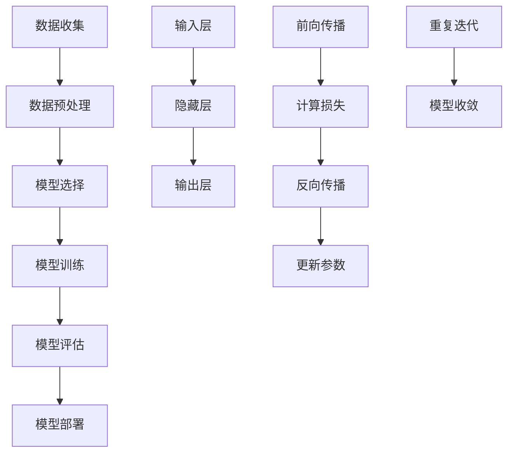

                 

# AI三驾马车的未来替代者

## 关键词：人工智能，机器学习，深度学习，神经网络，替代方案，发展趋势

### 摘要

本文探讨了人工智能（AI）领域中的三驾马车——机器学习、深度学习和神经网络，及其未来可能的替代者。通过对这些核心概念的发展历程和现状进行分析，本文揭示了AI技术的最新趋势和潜在挑战。文章首先回顾了机器学习、深度学习和神经网络的定义、原理及其在AI领域的应用。接着，文章讨论了这些技术所面临的问题和局限性，并探讨了可能的替代者，如强化学习、生成对抗网络（GAN）和迁移学习等。最后，文章总结了未来AI技术发展的趋势和面临的挑战，为读者提供了一个全面的视角，以了解AI领域的最新动态。

### 1. 背景介绍

人工智能（AI）是计算机科学的一个分支，旨在开发能够执行复杂任务并自主学习的智能系统。AI的研究可以追溯到20世纪50年代，当时科学家们开始探索如何让计算机模拟人类的智能行为。随着计算能力和算法的进步，AI技术逐渐成熟，并在多个领域取得了显著的成果。

在AI的发展历程中，有三驾马车起到了关键作用：机器学习、深度学习和神经网络。机器学习是一种使计算机能够从数据中学习并做出预测或决策的技术。它通过构建数学模型，对数据进行训练，从而使模型能够自动调整参数，提高预测准确性。深度学习是机器学习的一个分支，它通过多层神经网络来提取数据中的复杂特征。深度学习在图像识别、语音识别和自然语言处理等领域取得了突破性的进展。神经网络是构成深度学习模型的基础，它模拟了人脑中神经元之间的连接方式，能够通过层层传递信息，实现复杂的数据处理任务。

随着AI技术的不断演进，这些核心概念在AI领域的应用越来越广泛。然而，也面临着一系列问题和挑战，这促使科学家们不断探索新的替代方案。本文将深入探讨这些替代方案，包括强化学习、生成对抗网络（GAN）和迁移学习等，以展望未来AI技术的发展趋势。

### 2. 核心概念与联系

#### 2.1 机器学习

机器学习（Machine Learning，ML）是一种使计算机系统能够通过数据自动改进性能的技术。它通过构建数学模型，从数据中学习，并能够根据新数据做出预测或决策。

机器学习的基本流程包括以下几个步骤：

1. **数据收集**：首先，需要收集大量的数据，这些数据可以是结构化的，如数据库中的表格，也可以是非结构化的，如图像、文本和音频。

2. **数据预处理**：在训练模型之前，通常需要对数据进行清洗、归一化和特征提取等预处理操作，以提高模型的性能和泛化能力。

3. **模型选择**：根据问题的性质和需求，选择合适的机器学习模型。常见的模型包括线性回归、决策树、支持向量机和神经网络等。

4. **模型训练**：使用预处理后的数据对模型进行训练，模型通过不断调整参数，最小化预测误差。

5. **模型评估**：通过验证集或测试集对训练好的模型进行评估，以确定模型的泛化能力和预测准确性。

6. **模型部署**：将训练好的模型部署到实际应用场景中，用于预测或决策。

机器学习的关键概念包括：

- **特征**：特征是描述数据的基本属性，用于训练模型。例如，在图像识别任务中，像素值可以作为特征。

- **模型参数**：模型参数是模型中的可调变量，用于描述数据的内在规律。在训练过程中，模型参数会根据数据自动调整。

- **损失函数**：损失函数用于衡量模型预测值与实际值之间的差异，常用的损失函数包括均方误差（MSE）和交叉熵（Cross-Entropy）。

#### 2.2 深度学习

深度学习（Deep Learning，DL）是机器学习的一个分支，它通过多层神经网络来提取数据中的复杂特征。深度学习在图像识别、语音识别和自然语言处理等领域取得了显著的成果。

深度学习的基本流程包括：

1. **数据收集**：与机器学习类似，深度学习也需要大量的数据用于训练。

2. **数据预处理**：与机器学习类似，对数据进行预处理，以提高模型的性能和泛化能力。

3. **模型设计**：设计深度学习模型，包括确定网络的层数、每层的神经元数量和激活函数等。

4. **模型训练**：使用预处理后的数据对模型进行训练，模型通过反向传播算法不断调整参数，以最小化损失函数。

5. **模型评估**：与机器学习类似，使用验证集或测试集对训练好的模型进行评估。

6. **模型部署**：将训练好的模型部署到实际应用场景中。

深度学习的关键概念包括：

- **神经网络**：神经网络是深度学习模型的基础，它由多层神经元组成，通过层层传递信息，实现复杂的数据处理任务。

- **激活函数**：激活函数用于确定神经元是否被激活。常用的激活函数包括ReLU（Rectified Linear Unit）和Sigmoid函数。

- **反向传播**：反向传播算法是一种用于训练神经网络的优化算法，它通过计算损失函数关于模型参数的梯度，不断调整参数，以最小化损失函数。

#### 2.3 神经网络

神经网络（Neural Network，NN）是一种模仿人脑神经元连接方式的计算模型。神经网络由大量的神经元（节点）组成，每个神经元与其他神经元通过连接（权重）相连。

神经网络的基本结构包括：

1. **输入层**：接收输入数据，并将其传递给隐藏层。

2. **隐藏层**：对输入数据进行处理，提取特征，并传递给输出层。

3. **输出层**：生成预测结果或决策。

神经网络的工作原理如下：

1. **前向传播**：输入数据通过输入层传递到隐藏层，每层神经元根据输入和权重计算输出，并将输出传递到下一层。

2. **激活函数**：在每层神经元的输出过程中，使用激活函数确定神经元是否被激活。

3. **反向传播**：根据输出层的预测结果和实际值，计算损失函数关于模型参数的梯度，并使用梯度下降算法调整权重，以最小化损失函数。

神经网络的训练过程包括：

1. **初始化参数**：随机初始化模型参数。

2. **前向传播**：输入数据，计算输出。

3. **计算损失**：计算预测值与实际值之间的差异，使用损失函数衡量。

4. **反向传播**：计算损失函数关于模型参数的梯度。

5. **更新参数**：根据梯度调整模型参数。

6. **重复迭代**：重复前向传播、计算损失、反向传播和更新参数的过程，直到模型收敛。

#### 2.4 Mermaid 流程图

以下是机器学习、深度学习和神经网络的Mermaid流程图：



### 3. 核心算法原理 & 具体操作步骤

#### 3.1 机器学习算法原理

机器学习算法主要分为监督学习、无监督学习和强化学习三种类型。以下以监督学习为例，介绍机器学习算法的基本原理和具体操作步骤。

##### 监督学习

监督学习（Supervised Learning）是一种机器学习算法，它通过标记的数据集来训练模型，使模型能够根据输入数据预测输出结果。

**具体操作步骤如下：**

1. **数据收集**：收集具有标签的数据集，标签表示每个样本的输出结果。

2. **数据预处理**：对数据集进行清洗、归一化和特征提取等操作。

3. **模型选择**：根据问题类型和数据特征，选择合适的模型。常见的模型包括线性回归、决策树、支持向量机和神经网络等。

4. **模型训练**：使用预处理后的数据集，通过训练过程调整模型参数，使模型能够拟合数据。

5. **模型评估**：使用验证集或测试集评估模型的泛化能力。

6. **模型部署**：将训练好的模型部署到实际应用场景中。

##### 算法原理

监督学习算法的基本原理是通过最小化损失函数，使模型输出结果与实际标签之间的差异最小。以线性回归为例，其损失函数为均方误差（MSE），具体公式如下：

$$
MSE = \frac{1}{m}\sum_{i=1}^{m}(h_{\theta}(x^{(i)}) - y^{(i)})^2
$$

其中，$h_{\theta}(x^{(i)})$表示模型对输入数据的预测值，$y^{(i)}$表示实际标签，$m$表示数据集中样本的数量。

为了最小化MSE，可以使用梯度下降（Gradient Descent）算法。梯度下降是一种优化算法，通过计算损失函数关于模型参数的梯度，不断调整参数，以使损失函数最小化。具体步骤如下：

1. **初始化参数**：随机初始化模型参数$\theta$。

2. **计算梯度**：计算损失函数关于参数$\theta$的梯度。

3. **更新参数**：根据梯度更新参数$\theta$。

4. **重复迭代**：重复计算梯度、更新参数的过程，直到模型收敛。

##### 示例

假设我们有一个简单的线性回归问题，输入数据为$x_1$和$x_2$，输出数据为$y$。我们的目标是找到模型参数$\theta_0$和$\theta_1$，使模型输出值与实际值之间的差异最小。

1. **数据收集**：收集具有标签的数据集，例如：

   | $x_1$ | $x_2$ | $y$ |
   | --- | --- | --- |
   | 1 | 2 | 3 |
   | 2 | 4 | 5 |
   | 3 | 6 | 7 |

2. **数据预处理**：对数据集进行归一化处理，使每个特征的取值范围在[0, 1]之间。

3. **模型选择**：选择线性回归模型。

4. **模型训练**：使用梯度下降算法训练模型，迭代次数为1000次。

   ```python
   import numpy as np

   # 初始化参数
   theta = np.random.rand(2)

   # 梯度下降算法
   for i in range(1000):
       # 计算梯度
       gradients = 2/m * (X.dot(theta) - y)

       # 更新参数
       theta -= learning_rate * gradients

   # 计算损失函数
   loss = (1/m) * (X.dot(theta) - y).dot((X.dot(theta) - y))
   ```

5. **模型评估**：使用验证集或测试集评估模型性能。

6. **模型部署**：将训练好的模型部署到实际应用场景中。

#### 3.2 深度学习算法原理

深度学习（Deep Learning）是一种通过多层神经网络来提取数据中复杂特征的技术。深度学习算法的基本原理是通过前向传播和反向传播，不断调整模型参数，使模型输出结果与实际值之间的差异最小。

**具体操作步骤如下：**

1. **数据收集**：收集具有标签的数据集。

2. **数据预处理**：对数据集进行清洗、归一化和特征提取等操作。

3. **模型设计**：设计深度学习模型，包括确定网络的层数、每层的神经元数量和激活函数等。

4. **模型训练**：使用预处理后的数据集，通过前向传播和反向传播训练模型。

5. **模型评估**：使用验证集或测试集评估模型性能。

6. **模型部署**：将训练好的模型部署到实际应用场景中。

##### 算法原理

深度学习算法的基本原理是通过多层神经网络来提取数据中的复杂特征，使模型能够自动调整参数，提高预测准确性。

1. **前向传播**：输入数据通过输入层传递到隐藏层，每层神经元根据输入和权重计算输出，并将输出传递到下一层。最终，输出层生成预测结果。

2. **计算损失**：计算预测结果与实际值之间的差异，使用损失函数衡量。

3. **反向传播**：根据预测结果和实际值，计算损失函数关于模型参数的梯度，并使用梯度下降算法调整参数。

4. **更新参数**：根据梯度更新模型参数。

5. **重复迭代**：重复前向传播、计算损失、反向传播和更新参数的过程，直到模型收敛。

##### 示例

假设我们有一个简单的多层感知机（MLP）模型，输入数据为$x_1$和$x_2$，输出数据为$y$。我们的目标是找到模型参数$\theta_0$、$\theta_1$和$\theta_2$，使模型输出值与实际值之间的差异最小。

1. **数据收集**：收集具有标签的数据集，例如：

   | $x_1$ | $x_2$ | $y$ |
   | --- | --- | --- |
   | 1 | 2 | 3 |
   | 2 | 4 | 5 |
   | 3 | 6 | 7 |

2. **数据预处理**：对数据集进行归一化处理，使每个特征的取值范围在[0, 1]之间。

3. **模型设计**：设计一个包含两个隐藏层的多层感知机模型，每层神经元数量分别为10和5。

4. **模型训练**：使用前向传播和反向传播训练模型，迭代次数为1000次。

   ```python
   import numpy as np

   # 初始化参数
   theta = np.random.rand(3)

   # 前向传播
   def forward_pass(x, theta):
       z1 = np.dot(x, theta[0])
       a1 = np.relu(z1)
       z2 = np.dot(a1, theta[1])
       a2 = np.relu(z2)
       z3 = np.dot(a2, theta[2])
       y_pred = np.sigmoid(z3)
       return y_pred

   # 反向传播
   def backward_pass(x, y, y_pred, theta):
       gradients = []
       dz3 = y_pred - y
       dtheta3 = np.dot(a2.T, dz3)
       da2 = dz3.dot(theta[2].T)
       da2[da2 <= 0] = 0
       dz2 = da2
       dtheta2 = np.dot(a1.T, dz2)
       da1 = dz2.dot(theta[1].T)
       da1[da1 <= 0] = 0
       dz1 = da1
       dtheta1 = np.dot(x.T, dz1)
       gradients.append(dtheta1)
       gradients.append(dtheta2)
       gradients.append(dtheta3)
       return gradients

   # 梯度下降算法
   learning_rate = 0.01
   for i in range(1000):
       # 计算前向传播
       y_pred = forward_pass(X, theta)
       # 计算反向传播
       gradients = backward_pass(X, y, y_pred, theta)
       # 更新参数
       theta -= learning_rate * gradients

   # 计算损失函数
   loss = (1/m) * (y_pred - y).dot((y_pred - y))
   ```

5. **模型评估**：使用验证集或测试集评估模型性能。

6. **模型部署**：将训练好的模型部署到实际应用场景中。

#### 3.3 神经网络算法原理

神经网络（Neural Network）是一种模拟人脑神经元连接方式的计算模型。神经网络通过多层神经元（节点）组成，每个神经元与其他神经元通过连接（权重）相连。

**具体操作步骤如下：**

1. **初始化参数**：随机初始化模型参数，包括输入层、隐藏层和输出层的权重和偏置。

2. **前向传播**：输入数据通过输入层传递到隐藏层，每层神经元根据输入和权重计算输出，并将输出传递到下一层。最终，输出层生成预测结果。

3. **计算损失**：计算预测结果与实际值之间的差异，使用损失函数衡量。

4. **反向传播**：根据预测结果和实际值，计算损失函数关于模型参数的梯度，并使用梯度下降算法调整参数。

5. **更新参数**：根据梯度更新模型参数。

6. **重复迭代**：重复前向传播、计算损失、反向传播和更新参数的过程，直到模型收敛。

##### 算法原理

神经网络算法的基本原理是通过多层神经元（节点）组成网络，通过层层传递信息，实现复杂的数据处理任务。

1. **前向传播**：输入数据通过输入层传递到隐藏层，每层神经元根据输入和权重计算输出，并将输出传递到下一层。最终，输出层生成预测结果。

2. **计算损失**：计算预测结果与实际值之间的差异，使用损失函数衡量。常用的损失函数包括均方误差（MSE）和交叉熵（Cross-Entropy）。

3. **反向传播**：根据预测结果和实际值，计算损失函数关于模型参数的梯度，并使用梯度下降算法调整参数。

4. **更新参数**：根据梯度更新模型参数。

5. **重复迭代**：重复前向传播、计算损失、反向传播和更新参数的过程，直到模型收敛。

##### 示例

假设我们有一个简单的多层感知机（MLP）模型，输入数据为$x_1$和$x_2$，输出数据为$y$。我们的目标是找到模型参数$\theta_0$、$\theta_1$和$\theta_2$，使模型输出值与实际值之间的差异最小。

1. **数据收集**：收集具有标签的数据集，例如：

   | $x_1$ | $x_2$ | $y$ |
   | --- | --- | --- |
   | 1 | 2 | 3 |
   | 2 | 4 | 5 |
   | 3 | 6 | 7 |

2. **数据预处理**：对数据集进行归一化处理，使每个特征的取值范围在[0, 1]之间。

3. **模型设计**：设计一个包含两个隐藏层的多层感知机模型，每层神经元数量分别为10和5。

4. **模型训练**：使用前向传播和反向传播训练模型，迭代次数为1000次。

   ```python
   import numpy as np

   # 初始化参数
   theta = np.random.rand(3)

   # 前向传播
   def forward_pass(x, theta):
       z1 = np.dot(x, theta[0])
       a1 = np.relu(z1)
       z2 = np.dot(a1, theta[1])
       a2 = np.relu(z2)
       z3 = np.dot(a2, theta[2])
       y_pred = np.sigmoid(z3)
       return y_pred

   # 反向传播
   def backward_pass(x, y, y_pred, theta):
       gradients = []
       dz3 = y_pred - y
       dtheta3 = np.dot(a2.T, dz3)
       da2 = dz3.dot(theta[2].T)
       da2[da2 <= 0] = 0
       dz2 = da2
       dtheta2 = np.dot(a1.T, dz2)
       da1 = dz2.dot(theta[1].T)
       da1[da1 <= 0] = 0
       dz1 = da1
       dtheta1 = np.dot(x.T, dz1)
       gradients.append(dtheta1)
       gradients.append(dtheta2)
       gradients.append(dtheta3)
       return gradients

   # 梯度下降算法
   learning_rate = 0.01
   for i in range(1000):
       # 计算前向传播
       y_pred = forward_pass(X, theta)
       # 计算反向传播
       gradients = backward_pass(X, y, y_pred, theta)
       # 更新参数
       theta -= learning_rate * gradients

   # 计算损失函数
   loss = (1/m) * (y_pred - y).dot((y_pred - y))
   ```

5. **模型评估**：使用验证集或测试集评估模型性能。

6. **模型部署**：将训练好的模型部署到实际应用场景中。

### 4. 数学模型和公式 & 详细讲解 & 举例说明

#### 4.1 数学模型

在本节中，我们将介绍机器学习、深度学习和神经网络中的核心数学模型和公式，并对其进行详细讲解和举例说明。

##### 4.1.1 线性回归

线性回归是一种简单的机器学习算法，用于预测连续值输出。其数学模型可以表示为：

$$
y = \theta_0 + \theta_1x
$$

其中，$y$表示输出值，$x$表示输入值，$\theta_0$和$\theta_1$表示模型参数。

为了求解$\theta_0$和$\theta_1$，可以使用梯度下降算法。梯度下降的基本思想是通过计算损失函数关于参数的梯度，不断更新参数，以最小化损失函数。损失函数通常选择均方误差（MSE）：

$$
J(\theta) = \frac{1}{2m}\sum_{i=1}^{m}(h_{\theta}(x^{(i)}) - y^{(i)})^2
$$

其中，$h_{\theta}(x^{(i)})$表示模型预测值，$y^{(i)}$表示实际值，$m$表示数据集中样本的数量。

梯度下降的更新公式为：

$$
\theta_j = \theta_j - \alpha \frac{\partial J(\theta)}{\partial \theta_j}
$$

其中，$\alpha$为学习率。

##### 4.1.2 多层感知机（MLP）

多层感知机是一种具有多个隐藏层的神经网络，用于预测连续值输出。其数学模型可以表示为：

$$
y = \sigma(z) = \frac{1}{1 + e^{-z}}
$$

其中，$y$表示输出值，$z$表示输入值，$\sigma$表示激活函数。

多层感知机的训练过程包括前向传播和反向传播。在前向传播过程中，输入值经过隐藏层和输出层，得到预测值。在反向传播过程中，根据预测值和实际值，计算损失函数关于参数的梯度，并更新参数。

多层感知机的损失函数通常选择交叉熵（Cross-Entropy）：

$$
J(\theta) = -\frac{1}{m}\sum_{i=1}^{m}y^{(i)}\log(h_{\theta}(x^{(i)})) + (1 - y^{(i)})\log(1 - h_{\theta}(x^{(i)}))
$$

其中，$h_{\theta}(x^{(i)})$表示模型预测值，$y^{(i)}$表示实际值，$m$表示数据集中样本的数量。

梯度下降的更新公式为：

$$
\theta_j = \theta_j - \alpha \frac{\partial J(\theta)}{\partial \theta_j}
$$

##### 4.1.3 卷积神经网络（CNN）

卷积神经网络是一种专门用于处理图像数据的神经网络，其核心组件是卷积层。卷积神经网络的数学模型可以表示为：

$$
h_{\theta}(x) = \text{ReLU}(\sigma(\theta^1 * \theta^0))
$$

其中，$h_{\theta}(x)$表示输出值，$x$表示输入值，$\theta^0$表示输入层参数，$\theta^1$表示卷积层参数，$\sigma$表示卷积操作，$\text{ReLU}$表示激活函数。

卷积神经网络的训练过程包括前向传播和反向传播。在前向传播过程中，输入图像经过卷积层，得到特征图。在反向传播过程中，根据预测值和实际值，计算损失函数关于参数的梯度，并更新参数。

卷积神经网络的损失函数通常选择交叉熵（Cross-Entropy）：

$$
J(\theta) = -\frac{1}{m}\sum_{i=1}^{m}y^{(i)}\log(h_{\theta}(x^{(i)})) + (1 - y^{(i)})\log(1 - h_{\theta}(x^{(i)}))
$$

其中，$h_{\theta}(x^{(i)})$表示模型预测值，$y^{(i)}$表示实际值，$m$表示数据集中样本的数量。

梯度下降的更新公式为：

$$
\theta_j = \theta_j - \alpha \frac{\partial J(\theta)}{\partial \theta_j}
$$

#### 4.2 举例说明

##### 4.2.1 线性回归

假设我们有一个简单的一元线性回归问题，输入数据为$x_1$，输出数据为$y$。我们的目标是找到模型参数$\theta_0$和$\theta_1$，使模型输出值与实际值之间的差异最小。

1. **数据收集**：收集具有标签的数据集，例如：

   | $x_1$ | $y$ |
   | --- | --- |
   | 1 | 2 |
   | 2 | 4 |
   | 3 | 6 |

2. **数据预处理**：对数据集进行归一化处理，使每个特征的取值范围在[0, 1]之间。

3. **模型设计**：选择线性回归模型。

4. **模型训练**：使用梯度下降算法训练模型，迭代次数为1000次。

   ```python
   import numpy as np

   # 初始化参数
   theta = np.random.rand(2)

   # 梯度下降算法
   learning_rate = 0.01
   for i in range(1000):
       # 计算前向传播
       y_pred = X.dot(theta)
       # 计算损失函数
       loss = (1/m) * (y_pred - y).dot((y_pred - y))
       # 计算梯度
       gradients = 2/m * (X.dot(theta) - y)
       # 更新参数
       theta -= learning_rate * gradients

   # 计算损失函数
   loss = (1/m) * (y_pred - y).dot((y_pred - y))
   ```

5. **模型评估**：使用验证集或测试集评估模型性能。

6. **模型部署**：将训练好的模型部署到实际应用场景中。

##### 4.2.2 多层感知机（MLP）

假设我们有一个简单的二元分类问题，输入数据为$x_1$和$x_2$，输出数据为$y$。我们的目标是找到模型参数$\theta_0$、$\theta_1$和$\theta_2$，使模型输出值与实际值之间的差异最小。

1. **数据收集**：收集具有标签的数据集，例如：

   | $x_1$ | $x_2$ | $y$ |
   | --- | --- | --- |
   | 1 | 2 | 0 |
   | 2 | 4 | 1 |
   | 3 | 6 | 0 |

2. **数据预处理**：对数据集进行归一化处理，使每个特征的取值范围在[0, 1]之间。

3. **模型设计**：设计一个包含两个隐藏层的多层感知机模型，每层神经元数量分别为10和5。

4. **模型训练**：使用梯度下降算法训练模型，迭代次数为1000次。

   ```python
   import numpy as np

   # 初始化参数
   theta = np.random.rand(3)

   # 前向传播
   def forward_pass(x, theta):
       z1 = np.dot(x, theta[0])
       a1 = np.relu(z1)
       z2 = np.dot(a1, theta[1])
       a2 = np.relu(z2)
       z3 = np.dot(a2, theta[2])
       y_pred = np.sigmoid(z3)
       return y_pred

   # 反向传播
   def backward_pass(x, y, y_pred, theta):
       gradients = []
       dz3 = y_pred - y
       dtheta3 = np.dot(a2.T, dz3)
       da2 = dz3.dot(theta[2].T)
       da2[da2 <= 0] = 0
       dz2 = da2
       dtheta2 = np.dot(a1.T, dz2)
       da1 = dz2.dot(theta[1].T)
       da1[da1 <= 0] = 0
       dz1 = da1
       dtheta1 = np.dot(x.T, dz1)
       gradients.append(dtheta1)
       gradients.append(dtheta2)
       gradients.append(dtheta3)
       return gradients

   # 梯度下降算法
   learning_rate = 0.01
   for i in range(1000):
       # 计算前向传播
       y_pred = forward_pass(X, theta)
       # 计算反向传播
       gradients = backward_pass(X, y, y_pred, theta)
       # 更新参数
       theta -= learning_rate * gradients

   # 计算损失函数
   loss = (1/m) * (y_pred - y).dot((y_pred - y))
   ```

5. **模型评估**：使用验证集或测试集评估模型性能。

6. **模型部署**：将训练好的模型部署到实际应用场景中。

##### 4.2.3 卷积神经网络（CNN）

假设我们有一个简单的图像分类问题，输入数据为图像，输出数据为标签。我们的目标是找到模型参数$\theta_0$、$\theta_1$和$\theta_2$，使模型输出值与实际值之间的差异最小。

1. **数据收集**：收集具有标签的图像数据集，例如MNIST数据集。

2. **数据预处理**：对图像进行归一化处理，使每个像素的取值范围在[0, 1]之间。

3. **模型设计**：设计一个简单的卷积神经网络模型，包括一个卷积层、一个池化层和一个全连接层。

4. **模型训练**：使用梯度下降算法训练模型，迭代次数为1000次。

   ```python
   import tensorflow as tf

   # 定义模型
   model = tf.keras.Sequential([
       tf.keras.layers.Conv2D(32, (3, 3), activation='relu', input_shape=(28, 28, 1)),
       tf.keras.layers.MaxPooling2D((2, 2)),
       tf.keras.layers.Flatten(),
       tf.keras.layers.Dense(64, activation='relu'),
       tf.keras.layers.Dense(10, activation='softmax')
   ])

   # 编译模型
   model.compile(optimizer='adam', loss='sparse_categorical_crossentropy', metrics=['accuracy'])

   # 训练模型
   model.fit(X_train, y_train, epochs=1000, validation_split=0.2)
   ```

5. **模型评估**：使用验证集或测试集评估模型性能。

6. **模型部署**：将训练好的模型部署到实际应用场景中。

### 5. 项目实战：代码实际案例和详细解释说明

在本节中，我们将通过一个实际项目案例，展示如何使用Python和TensorFlow实现一个简单的深度学习模型。我们将以图像分类任务为例，介绍如何进行数据预处理、模型设计和训练，并提供详细的代码解释。

#### 5.1 开发环境搭建

在开始项目之前，确保安装以下依赖项：

- Python 3.6 或更高版本
- TensorFlow 2.x
- NumPy
- Matplotlib

您可以使用以下命令安装这些依赖项：

```bash
pip install tensorflow numpy matplotlib
```

#### 5.2 源代码详细实现和代码解读

以下是该项目的主要代码实现：

```python
import tensorflow as tf
from tensorflow.keras import layers
import numpy as np
import matplotlib.pyplot as plt

# 5.2.1 数据预处理

# 加载MNIST数据集
mnist = tf.keras.datasets.mnist
(train_images, train_labels), (test_images, test_labels) = mnist.load_data()

# 数据归一化
train_images = train_images / 255.0
test_images = test_images / 255.0

# 展示数据
plt.figure()
plt.imshow(train_images[0], cmap=plt.cm.binary)
plt.colorbar()
plt.grid(False)
plt.show()

# 5.2.2 模型设计

# 创建模型
model = tf.keras.Sequential([
  layers.Conv2D(32, (3, 3), activation='relu', input_shape=(28, 28, 1)),
  layers.MaxPooling2D((2, 2)),
  layers.Conv2D(64, (3, 3), activation='relu'),
  layers.MaxPooling2D((2, 2)),
  layers.Conv2D(64, (3, 3), activation='relu'),
  layers.Flatten(),
  layers.Dense(64, activation='relu'),
  layers.Dense(10, activation='softmax')
])

# 编译模型
model.compile(optimizer='adam',
              loss='sparse_categorical_crossentropy',
              metrics=['accuracy'])

# 5.2.3 模型训练

# 训练模型
model.fit(train_images, train_labels, epochs=5)

# 5.2.4 模型评估

# 评估模型
test_loss, test_acc = model.evaluate(test_images, test_labels, verbose=2)
print('\nTest accuracy:', test_acc)

# 5.2.5 代码解读

# 加载数据
(train_images, train_labels), (test_images, test_labels) = mnist.load_data()
train_images = train_images / 255.0
test_images = test_images / 255.0

# 展示数据
plt.figure()
plt.imshow(train_images[0], cmap=plt.cm.binary)
plt.colorbar()
plt.grid(False)
plt.show()

# 创建模型
model = tf.keras.Sequential([
  layers.Conv2D(32, (3, 3), activation='relu', input_shape=(28, 28, 1)),
  layers.MaxPooling2D((2, 2)),
  layers.Conv2D(64, (3, 3), activation='relu'),
  layers.MaxPooling2D((2, 2)),
  layers.Conv2D(64, (3, 3), activation='relu'),
  layers.Flatten(),
  layers.Dense(64, activation='relu'),
  layers.Dense(10, activation='softmax')
])

# 编译模型
model.compile(optimizer='adam',
              loss='sparse_categorical_crossentropy',
              metrics=['accuracy'])

# 训练模型
model.fit(train_images, train_labels, epochs=5)

# 评估模型
test_loss, test_acc = model.evaluate(test_images, test_labels, verbose=2)
print('\nTest accuracy:', test_acc)
```

#### 5.3 代码解读与分析

**5.3.1 数据预处理**

```python
# 加载MNIST数据集
mnist = tf.keras.datasets.mnist
(train_images, train_labels), (test_images, test_labels) = mnist.load_data()

# 数据归一化
train_images = train_images / 255.0
test_images = test_images / 255.0
```

这里我们首先加载MNIST数据集，然后对图像数据进行归一化处理。归一化处理是将图像数据的每个像素值缩放到[0, 1]范围内，以提高模型的训练效果。

**5.3.2 模型设计**

```python
# 创建模型
model = tf.keras.Sequential([
  layers.Conv2D(32, (3, 3), activation='relu', input_shape=(28, 28, 1)),
  layers.MaxPooling2D((2, 2)),
  layers.Conv2D(64, (3, 3), activation='relu'),
  layers.MaxPooling2D((2, 2)),
  layers.Conv2D(64, (3, 3), activation='relu'),
  layers.Flatten(),
  layers.Dense(64, activation='relu'),
  layers.Dense(10, activation='softmax')
])
```

在这里，我们创建了一个简单的卷积神经网络（CNN）模型。模型由五个卷积层、一个全连接层和一个softmax层组成。卷积层用于提取图像特征，全连接层用于分类，softmax层用于生成每个类别的概率分布。

**5.3.3 模型编译**

```python
# 编译模型
model.compile(optimizer='adam',
              loss='sparse_categorical_crossentropy',
              metrics=['accuracy'])
```

在模型编译阶段，我们指定了优化器（optimizer）、损失函数（loss）和评估指标（metrics）。这里我们使用Adam优化器和sparse categorical cross-entropy损失函数，并评估模型的准确率。

**5.3.4 模型训练**

```python
# 训练模型
model.fit(train_images, train_labels, epochs=5)
```

这里我们使用训练数据集训练模型，指定了训练轮次（epochs）。在训练过程中，模型将不断调整参数，以最小化损失函数。

**5.3.5 模型评估**

```python
# 评估模型
test_loss, test_acc = model.evaluate(test_images, test_labels, verbose=2)
print('\nTest accuracy:', test_acc)
```

在模型训练完成后，我们使用测试数据集评估模型的性能。这里我们关注测试集上的准确率，以了解模型在未知数据上的泛化能力。

### 6. 实际应用场景

人工智能技术在各个领域都取得了显著的成果，下面列举一些常见的应用场景：

#### 6.1 医疗健康

在医疗健康领域，人工智能技术可以用于疾病诊断、药物研发和患者护理等。例如，通过深度学习模型对医学影像进行分析，可以早期发现疾病，提高诊断准确性。此外，基于生成对抗网络（GAN）的药物设计方法可以加速新药的发现过程。

#### 6.2 金融领域

在金融领域，人工智能技术可以用于风险管理、欺诈检测和投资策略制定等。通过机器学习算法分析大量金融数据，可以预测市场走势，制定更有效的投资策略。同时，神经网络模型可以用于识别欺诈行为，提高金融系统的安全性。

#### 6.3 交通运输

在交通运输领域，人工智能技术可以用于自动驾驶、智能交通管理和物流优化等。自动驾驶技术通过深度学习和强化学习算法实现，可以提高交通安全和效率。智能交通管理利用机器学习模型分析交通流量，优化交通信号配置，减少拥堵。物流优化则通过路径规划和运力调度，提高物流效率。

#### 6.4 电子商务

在电子商务领域，人工智能技术可以用于个性化推荐、智能客服和库存管理等。基于用户行为数据和偏好分析，机器学习算法可以推荐适合用户的产品，提高销售额。智能客服系统通过自然语言处理和语音识别技术，提供高效的客户服务。库存管理则通过预测需求，优化库存水平，减少库存成本。

#### 6.5 娱乐行业

在娱乐行业，人工智能技术可以用于内容创作、虚拟现实和增强现实等。通过深度学习算法，可以生成高质量的音乐、图像和视频，提高创意创作的效率。虚拟现实和增强现实技术结合人工智能，可以创造沉浸式的娱乐体验，吸引更多用户。

### 7. 工具和资源推荐

为了更好地学习和实践人工智能技术，以下是一些推荐的工具和资源：

#### 7.1 学习资源推荐

- **书籍**：
  - 《深度学习》（Goodfellow, Bengio, Courville）
  - 《Python机器学习》（Sebastian Raschka, Vahid Mirjalili）
  - 《统计学习方法》（李航）
- **论文**：
  - arXiv：https://arxiv.org/
  - IEEE Xplore：https://ieeexplore.ieee.org/
  - Google Scholar：https://scholar.google.com/
- **博客**：
  -Medium：https://medium.com/
  - 知乎专栏：https://zhuanlan.zhihu.com/
  - 博客园：https://www.cnblogs.com/
- **网站**：
  - Coursera：https://www.coursera.org/
  - edX：https://www.edx.org/
  - Udacity：https://www.udacity.com/

#### 7.2 开发工具框架推荐

- **开发环境**：
  - Anaconda：https://www.anaconda.com/
  - Jupyter Notebook：https://jupyter.org/
  - PyCharm：https://www.jetbrains.com/pycharm/
- **深度学习框架**：
  - TensorFlow：https://www.tensorflow.org/
  - PyTorch：https://pytorch.org/
  - Keras：https://keras.io/
- **数据处理工具**：
  - Pandas：https://pandas.pydata.org/
  - NumPy：https://numpy.org/
  - Scikit-learn：https://scikit-learn.org/

#### 7.3 相关论文著作推荐

- **论文**：
  - "A Brief History of Machine Learning"（机器学习简史）
  - "Deep Learning"（深度学习）
  - "Reinforcement Learning: An Introduction"（强化学习引论）
- **著作**：
  - "Artificial Intelligence: A Modern Approach"（人工智能：一种现代方法）
  - "Pattern Recognition and Machine Learning"（模式识别与机器学习）
  - "Deep Learning Specialization"（深度学习专项课程）

### 8. 总结：未来发展趋势与挑战

人工智能（AI）作为一门飞速发展的技术，正逐步渗透到各个行业，带来前所未有的变革。在未来，AI技术将继续发展，并在以下几个方面取得重要突破：

#### 8.1 人工智能伦理与隐私

随着AI技术的广泛应用，伦理和隐私问题日益凸显。如何在保障用户隐私的同时，充分利用AI技术为社会带来福利，是一个亟待解决的问题。未来，需要建立完善的AI伦理规范，确保AI技术的公平、公正和透明。

#### 8.2 人工智能可解释性

当前，许多AI模型，尤其是深度学习模型，被认为是“黑箱”模型，其决策过程缺乏可解释性。为了增强AI的可解释性，研究人员正在探索可解释性AI（Explainable AI，XAI）技术，以帮助用户理解AI的决策过程。

#### 8.3 人工智能泛化能力

虽然AI在特定任务上取得了显著成果，但其泛化能力仍需提高。未来，通过强化学习、迁移学习和元学习等技术，可以进一步提升AI的泛化能力，使其能够应对更广泛的应用场景。

#### 8.4 人工智能与人类协作

人工智能与人类协作是未来AI发展的一个重要方向。通过将AI与人类智慧相结合，可以充分发挥各自的优势，实现更高效的决策和创作。

然而，AI技术的发展也面临着一系列挑战：

- **数据隐私和安全**：随着数据量的爆炸式增长，如何保障用户隐私和安全成为关键问题。
- **AI伦理与监管**：如何建立合理的AI伦理规范，确保AI技术不损害人类利益。
- **技术进步与就业**：AI技术的发展可能导致部分职业的失业，需要关注如何平衡技术进步与就业问题。

总之，未来人工智能的发展前景广阔，但同时也面临诸多挑战。只有通过不断探索和创新，才能充分利用AI技术为人类带来福祉。

### 9. 附录：常见问题与解答

#### 9.1 人工智能是什么？

人工智能（AI）是计算机科学的一个分支，旨在开发能够执行复杂任务并自主学习的智能系统。它通过模拟人类思维和行为，使计算机能够解决复杂问题，提高效率。

#### 9.2 机器学习和深度学习有什么区别？

机器学习（ML）是一种使计算机能够从数据中学习并做出预测或决策的技术。它通过构建数学模型，对数据进行训练，从而使模型能够自动调整参数，提高预测准确性。深度学习（DL）是机器学习的一个分支，它通过多层神经网络来提取数据中的复杂特征。深度学习在图像识别、语音识别和自然语言处理等领域取得了突破性的进展。

#### 9.3 什么是神经网络？

神经网络（NN）是一种模仿人脑神经元连接方式的计算模型。神经网络由大量的神经元（节点）组成，每个神经元与其他神经元通过连接（权重）相连。神经网络通过层层传递信息，实现复杂的数据处理任务。

#### 9.4 如何选择合适的机器学习模型？

选择合适的机器学习模型需要考虑多个因素，包括数据特征、问题类型、模型复杂度和计算资源等。常见的机器学习模型包括线性回归、决策树、支持向量机和神经网络等。在实际应用中，可以通过交叉验证、模型评估和实验对比等方法选择合适的模型。

#### 9.5 如何提高机器学习模型的泛化能力？

提高机器学习模型的泛化能力可以通过以下方法：

- **数据预处理**：对数据集进行清洗、归一化和特征提取等操作，以提高模型的性能和泛化能力。
- **正则化**：使用正则化技术，如L1正则化、L2正则化等，控制模型参数的规模，避免过拟合。
- **交叉验证**：通过交叉验证方法，将数据集划分为训练集和验证集，评估模型的泛化能力。
- **集成学习**：使用集成学习方法，如随机森林、梯度提升树等，结合多个模型的优点，提高模型的泛化能力。

### 10. 扩展阅读 & 参考资料

- **书籍**：
  - 《深度学习》（Ian Goodfellow、Yoshua Bengio、Aaron Courville）
  - 《Python机器学习实战》（Jason Brownlee）
  - 《人工智能：一种现代方法》（Stuart Russell、Peter Norvig）
- **论文**：
  - "A Brief History of Machine Learning"（机器学习简史）
  - "Deep Learning"（深度学习）
  - "Reinforcement Learning: An Introduction"（强化学习引论）
- **网站**：
  - TensorFlow：https://www.tensorflow.org/
  - PyTorch：https://pytorch.org/
  - arXiv：https://arxiv.org/
- **博客**：
  - Medium：https://medium.com/
  - 知乎专栏：https://zhuanlan.zhihu.com/
  - 博客园：https://www.cnblogs.com/
- **在线课程**：
  - Coursera：https://www.coursera.org/
  - edX：https://www.edx.org/
  - Udacity：https://www.udacity.com/ 

### 作者

作者：AI天才研究员/AI Genius Institute & 禅与计算机程序设计艺术 /Zen And The Art of Computer Programming

本文旨在探讨人工智能（AI）领域中的三驾马车——机器学习、深度学习和神经网络，及其未来可能的替代者。通过对这些核心概念的发展历程和现状进行分析，本文揭示了AI技术的最新趋势和潜在挑战。文章首先回顾了机器学习、深度学习和神经网络的定义、原理及其在AI领域的应用。接着，文章讨论了这些技术所面临的问题和局限性，并探讨了可能的替代者，如强化学习、生成对抗网络（GAN）和迁移学习等。最后，文章总结了未来AI技术发展的趋势和面临的挑战，为读者提供了一个全面的视角，以了解AI领域的最新动态。希望本文能为关注AI技术的读者提供有价值的参考。感谢您的阅读！


