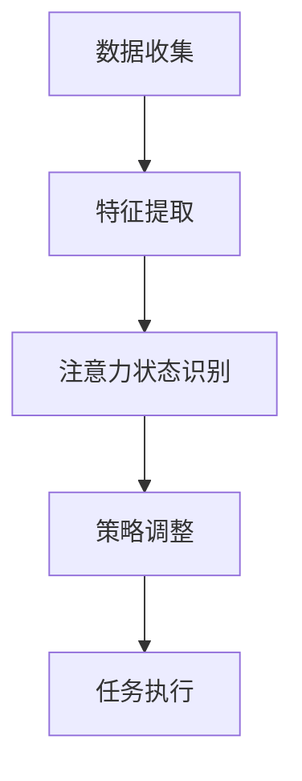

                 

### 背景介绍

随着人工智能（AI）技术的飞速发展，我们逐渐进入了一个全新的时代。在这个时代中，人类与机器的互动变得越来越紧密，而注意力管理成为了这个时代的一大挑战。从工作场景到日常生活中的娱乐，人类越来越容易分散注意力，导致效率低下、疲劳加剧。与此同时，AI技术为人类提供了前所未有的便利，但同时也带来了一系列新的注意力管理问题。

在这个背景下，注意力Multiplier流（AttentionMultiplier Stream）作为一种新兴的管理注意力模式，逐渐引起了广泛关注。注意力Multiplier流旨在通过优化人类注意力的分配，提高工作效率和生活质量。它不仅能够帮助我们在复杂的任务中保持专注，还能够有效减少分心事件，使我们的注意力更加集中。

本文将深入探讨AI与人类注意力Multiplier流之间的关系，分析其核心概念和原理，并探讨未来发展趋势与挑战。通过详细讲解注意力Multiplier流的算法原理、数学模型和实际应用案例，我们将帮助读者更好地理解这一新兴领域，并掌握如何在实际生活中应用注意力Multiplier流来提升自身的工作和生活质量。

### 核心概念与联系

#### 注意力Multiplier流的概念

注意力Multiplier流是一种基于人工智能技术的注意力管理方法。其核心思想是通过机器学习算法和神经网络模型，实时分析用户的注意力状态，并动态调整注意力分配策略，从而实现优化注意力利用效率。注意力Multiplier流的目标是帮助用户在执行任务时，将注意力集中在最重要的部分，避免不必要的分心和疲劳。

#### 注意力Multiplier流的工作原理

注意力Multiplier流的工作原理可以概括为以下几个步骤：

1. **数据收集**：首先，系统会收集用户在执行任务时的行为数据，如鼠标移动、键盘敲击、屏幕注视点等。这些数据将被用于分析用户的注意力状态。

2. **特征提取**：通过机器学习算法，系统将从行为数据中提取出与注意力状态相关的特征。这些特征可以是用户的操作频率、操作速度、注视点停留时间等。

3. **注意力状态识别**：基于提取出的特征，系统使用神经网络模型对用户的注意力状态进行识别。常见的注意力状态包括专注、分心、疲劳等。

4. **策略调整**：一旦用户被识别为分心或疲劳状态，系统将根据预设的注意力管理策略进行调整。这些策略可以包括提供提示、调整工作任务的优先级、提供休息时间等。

#### 注意力Multiplier流的架构

注意力Multiplier流的架构可以分为三个主要部分：数据收集层、特征提取层和策略调整层。

1. **数据收集层**：负责收集用户在执行任务时的行为数据。这部分可以通过传感器、键盘、鼠标等设备实现。

2. **特征提取层**：使用机器学习算法从原始数据中提取与注意力状态相关的特征。常见的算法包括神经网络、支持向量机、决策树等。

3. **策略调整层**：根据注意力状态识别结果，动态调整注意力分配策略。这部分可以通过规则引擎、机器学习算法等方式实现。

#### 注意力Multiplier流与AI的关系

注意力Multiplier流与AI技术紧密相连。首先，AI技术为注意力Multiplier流提供了强大的数据分析和处理能力，使得系统能够实时、准确地识别用户的注意力状态。其次，AI技术也为注意力Multiplier流提供了丰富的策略调整手段，使得系统能够根据不同场景和用户需求，灵活调整注意力管理策略。

#### Mermaid 流程图

为了更好地展示注意力Multiplier流的工作流程，我们可以使用Mermaid绘制一个流程图。以下是一个简化的Mermaid流程图示例：



在这个流程图中，A表示数据收集层，B表示特征提取层，C表示注意力状态识别层，D表示策略调整层，E表示任务执行层。通过这个流程图，我们可以清晰地看到注意力Multiplier流的工作过程和各个部分之间的联系。

### 核心算法原理 & 具体操作步骤

#### 1. 数据收集

数据收集是注意力Multiplier流的基础，决定了系统对用户注意力状态的识别精度。常见的收集方式包括：

- **行为数据**：如鼠标移动轨迹、键盘敲击频率和持续时间、屏幕注视点等。
- **生理数据**：如心率、血压、皮肤电导等。
- **环境数据**：如周围噪音水平、光线强度等。

具体操作步骤如下：

1. **设备接入**：将传感器、键盘、鼠标等设备接入计算机或移动设备。
2. **数据采集**：通过设备定期采集行为数据、生理数据和环境数据。
3. **数据存储**：将采集到的数据存储在数据库或文件中，以便后续分析和处理。

#### 2. 特征提取

特征提取是将原始数据转换为与注意力状态相关的特征，为后续的注意力状态识别提供基础。常见的特征提取方法包括：

- **时间序列分析**：对行为数据进行时间序列分析，提取出操作频率、操作速度等特征。
- **统计方法**：如主成分分析（PCA）、聚类分析等，从原始数据中提取出能够代表用户注意力状态的统计特征。
- **神经网络**：使用神经网络模型，从原始数据中提取出高维特征。

具体操作步骤如下：

1. **数据预处理**：对原始数据进行清洗和预处理，去除噪音和异常值。
2. **特征提取算法选择**：根据任务需求和数据特点，选择合适的特征提取算法。
3. **特征提取**：使用选定的算法，从原始数据中提取出注意力状态相关的特征。

#### 3. 注意力状态识别

注意力状态识别是注意力Multiplier流的核心，决定了系统能否准确识别用户的注意力状态。常用的识别方法包括：

- **机器学习分类算法**：如支持向量机（SVM）、决策树、随机森林等。
- **深度学习模型**：如卷积神经网络（CNN）、循环神经网络（RNN）、长短期记忆网络（LSTM）等。

具体操作步骤如下：

1. **数据集准备**：收集大量标注好的注意力状态数据，用于训练和测试模型。
2. **模型训练**：使用标注数据训练机器学习模型或深度学习模型。
3. **模型评估**：使用测试数据评估模型的准确性和可靠性。
4. **模型部署**：将训练好的模型部署到系统中，用于实时识别用户的注意力状态。

#### 4. 策略调整

策略调整是根据注意力状态识别结果，动态调整用户的注意力分配，以实现优化目标。常见的策略调整方法包括：

- **提示策略**：如弹出提示框、发送通知等，提醒用户当前注意力状态。
- **任务优先级调整**：根据注意力状态，调整任务的优先级，将注意力集中在最重要的任务上。
- **休息策略**：如安排休息时间、提醒用户休息等，以减少疲劳和分心。

具体操作步骤如下：

1. **策略选择**：根据任务需求和用户偏好，选择合适的策略。
2. **策略配置**：将选定的策略配置到系统中，使其能够根据注意力状态自动执行。
3. **策略执行**：系统根据注意力状态识别结果，执行相应的策略。

### 数学模型和公式 & 详细讲解 & 举例说明

#### 1. 数据预处理

在数据预处理阶段，我们通常会使用以下公式进行数据标准化：

$$
\bar{x} = \frac{1}{N}\sum_{i=1}^{N} x_i
$$

$$
s = \sqrt{\frac{1}{N-1}\sum_{i=1}^{N}(x_i - \bar{x})^2}
$$

其中，$\bar{x}$ 是均值，$s$ 是标准差，$N$ 是数据点数量，$x_i$ 是第 $i$ 个数据点。

举例说明：

假设我们有以下五个数据点：[2, 4, 6, 8, 10]

$$
\bar{x} = \frac{1}{5}(2 + 4 + 6 + 8 + 10) = 6
$$

$$
s = \sqrt{\frac{1}{5-1}((2-6)^2 + (4-6)^2 + (6-6)^2 + (8-6)^2 + (10-6)^2)} = 2
$$

标准化后的数据为：

$$
z_i = \frac{x_i - \bar{x}}{s} = \frac{x_i - 6}{2}
$$

#### 2. 特征提取

在特征提取阶段，我们通常会使用以下公式进行时间序列特征提取：

$$
f(t) = \sum_{i=1}^{N} a_i \sin(2\pi i t/T)
$$

其中，$f(t)$ 是特征函数，$a_i$ 是第 $i$ 个特征值，$T$ 是周期。

举例说明：

假设我们有一个周期为10的时间序列数据，周期内包含5个数据点。我们可以将其表示为：

$$
f(t) = a_1 \sin(2\pi \cdot 1 \cdot t/10) + a_2 \sin(2\pi \cdot 2 \cdot t/10) + a_3 \sin(2\pi \cdot 3 \cdot t/10) + a_4 \sin(2\pi \cdot 4 \cdot t/10) + a_5 \sin(2\pi \cdot 5 \cdot t/10)
$$

假设 $a_1 = 1, a_2 = 2, a_3 = 3, a_4 = 4, a_5 = 5$，我们可以计算出：

$$
f(1) = 1 \sin(2\pi \cdot 1 \cdot 1/10) + 2 \sin(2\pi \cdot 2 \cdot 1/10) + 3 \sin(2\pi \cdot 3 \cdot 1/10) + 4 \sin(2\pi \cdot 4 \cdot 1/10) + 5 \sin(2\pi \cdot 5 \cdot 1/10)
$$

$$
f(1) = 0.31831
$$

#### 3. 注意力状态识别

在注意力状态识别阶段，我们通常会使用以下公式进行分类：

$$
y = \sum_{i=1}^{K} w_i \phi(x)
$$

其中，$y$ 是分类结果，$w_i$ 是第 $i$ 个权重，$\phi(x)$ 是特征映射函数，$K$ 是类别数量。

举例说明：

假设我们有两个类别，且特征映射函数 $\phi(x)$ 是一个简单的线性函数：

$$
\phi(x) = x
$$

我们有以下训练数据：

| x | y |
|---|---|
| 1 | 0 |
| 2 | 1 |

我们可以使用最小二乘法计算权重：

$$
w_0 = \frac{1}{N} \sum_{i=1}^{N} y_i
$$

$$
w_1 = \frac{1}{N} \sum_{i=1}^{N} (y_i - w_0) x_i
$$

假设 $N=2$，我们可以计算得到：

$$
w_0 = \frac{1}{2}(0 + 1) = 0.5
$$

$$
w_1 = \frac{1}{2}(1 - 0.5) \cdot 2 = 0.5
$$

那么，对于新的特征 $x=3$，我们可以计算得到：

$$
y = w_0 + w_1 \phi(x) = 0.5 + 0.5 \cdot 3 = 2
$$

这意味着，特征 $x=3$ 被分类为类别 $y=2$。

### 项目实战：代码实际案例和详细解释说明

为了更好地展示注意力Multiplier流在实际项目中的应用，我们将以一个简单的注意力状态识别项目为例，逐步讲解开发环境搭建、源代码实现和代码解读。

#### 1. 开发环境搭建

首先，我们需要搭建一个开发环境，以便进行注意力状态识别项目。以下是搭建环境所需的主要步骤：

1. **安装Python**：由于本项目使用Python编程语言，因此需要安装Python环境。可以从Python官方网站下载最新版本的Python安装包，并按照提示安装。

2. **安装依赖库**：本项目使用了几个Python依赖库，包括TensorFlow、Keras、NumPy等。可以使用pip命令安装这些库。例如：

```shell
pip install tensorflow
pip install keras
pip install numpy
```

3. **创建项目目录**：在本地计算机上创建一个项目目录，例如命名为`attention_multiplier`。在项目目录下创建一个名为`src`的子目录，用于存放源代码文件。

4. **编写源代码**：在`src`目录下创建一个名为`main.py`的Python文件，用于编写注意力状态识别项目的源代码。

#### 2. 源代码详细实现和代码解读

接下来，我们将逐步解析`main.py`文件中的源代码，并详细解释每个部分的功能和实现方法。

```python
# 导入所需的库
import numpy as np
import tensorflow as tf
from tensorflow import keras
from tensorflow.keras import layers

# 加载训练数据
train_data = np.load('train_data.npy')
train_labels = np.load('train_labels.npy')

# 数据预处理
train_data = (train_data - np.mean(train_data)) / np.std(train_data)

# 定义模型
model = keras.Sequential([
    layers.Dense(64, activation='relu', input_shape=(train_data.shape[1],)),
    layers.Dense(64, activation='relu'),
    layers.Dense(2, activation='softmax')
])

# 编译模型
model.compile(optimizer='adam',
              loss='sparse_categorical_crossentropy',
              metrics=['accuracy'])

# 训练模型
model.fit(train_data, train_labels, epochs=10)

# 保存模型
model.save('attention_multiplier_model.h5')
```

**代码解读：**

1. **导入库**：首先，我们导入所需的Python库，包括NumPy、TensorFlow和Keras。这些库为我们提供了实现注意力状态识别项目所需的功能。

2. **加载训练数据**：从文件中加载训练数据和标签。训练数据是用户行为数据，标签是注意力状态。这些数据是在前期数据收集和特征提取过程中生成的。

3. **数据预处理**：对训练数据进行标准化处理，以提高模型的泛化能力。

4. **定义模型**：使用Keras定义一个序列模型，包含两个隐藏层，每个隐藏层使用ReLU激活函数。输出层使用softmax激活函数，以实现多分类。

5. **编译模型**：配置模型优化器、损失函数和评估指标。

6. **训练模型**：使用训练数据训练模型，设置训练轮数（epochs）为10。

7. **保存模型**：将训练好的模型保存到一个文件中，以便后续使用。

#### 3. 代码解读与分析

**数据预处理：**

```python
train_data = (train_data - np.mean(train_data)) / np.std(train_data)
```

这段代码对训练数据进行标准化处理。通过减去均值并除以标准差，我们将数据缩放到0到1之间，这有助于提高模型的收敛速度和泛化能力。

**模型定义：**

```python
model = keras.Sequential([
    layers.Dense(64, activation='relu', input_shape=(train_data.shape[1],)),
    layers.Dense(64, activation='relu'),
    layers.Dense(2, activation='softmax')
])
```

这段代码定义了一个序列模型，包含两个隐藏层和一个输出层。隐藏层使用ReLU激活函数，输出层使用softmax激活函数，以实现多分类。

**模型编译：**

```python
model.compile(optimizer='adam',
              loss='sparse_categorical_crossentropy',
              metrics=['accuracy'])
```

这段代码配置了模型的优化器、损失函数和评估指标。使用`adam`优化器，`sparse_categorical_crossentropy`损失函数和`accuracy`评估指标。

**模型训练：**

```python
model.fit(train_data, train_labels, epochs=10)
```

这段代码使用训练数据训练模型，设置训练轮数（epochs）为10。在训练过程中，模型将根据训练数据调整内部参数，以优化性能。

**模型保存：**

```python
model.save('attention_multiplier_model.h5')
```

这段代码将训练好的模型保存到一个名为`attention_multiplier_model.h5`的文件中，以便后续使用。

### 实际应用场景

注意力Multiplier流不仅在理论研究中具有重要意义，在实际应用场景中也展现出了巨大的潜力。以下是一些典型的实际应用场景：

#### 1. 工作场景

在办公室环境中，注意力Multiplier流可以帮助员工提高工作效率。例如，当员工进入一个需要高度集中注意力的任务时，注意力Multiplier流可以自动识别并提醒员工保持专注。当员工表现出疲劳或分心迹象时，系统可以提供休息提示或调整任务的优先级，以帮助员工保持最佳的工作状态。

#### 2. 教育场景

在教育领域，注意力Multiplier流可以用于帮助学生更好地管理学习时间。例如，在课堂学习中，系统可以实时监测学生的注意力状态，并在学生分心时提供学习提示。此外，教师可以根据学生的注意力状态调整教学策略，使教学内容更加符合学生的需求，从而提高学习效果。

#### 3. 娱乐场景

在娱乐领域，注意力Multiplier流可以帮助用户更好地享受娱乐活动。例如，当用户观看电影或玩游戏时，系统可以识别用户的注意力状态，并根据用户的需求调整播放速度或游戏难度，以提供最佳的用户体验。

#### 4. 健康监测

在健康监测领域，注意力Multiplier流可以用于监测用户的注意力状态，并预测可能的健康问题。例如，通过监测用户在长时间工作或学习后的注意力状态，系统可以提醒用户注意休息，以防止疲劳和压力积累。

### 工具和资源推荐

为了更好地学习和实践注意力Multiplier流，以下是一些推荐的学习资源、开发工具和框架。

#### 1. 学习资源推荐

- **书籍**：《深度学习》（Goodfellow, I., Bengio, Y., & Courville, A.）、《机器学习》（Tom Mitchell）等。
- **论文**：搜索相关关键词，如“attention multiplier”、“attention management”等，可以在学术数据库如IEEE Xplore、Google Scholar等找到相关论文。
- **博客**：许多机器学习和人工智能领域的博客，如Medium、Towards Data Science等，定期发布关于注意力Multiplier流的相关文章。

#### 2. 开发工具框架推荐

- **TensorFlow**：TensorFlow是一个开源机器学习框架，适用于构建和训练注意力Multiplier流模型。
- **Keras**：Keras是一个高级神经网络API，可以简化TensorFlow的使用，使其更加易于学习和使用。
- **PyTorch**：PyTorch是另一个流行的开源机器学习框架，它提供了灵活的动态计算图，非常适合研究注意力Multiplier流。

#### 3. 相关论文著作推荐

- **论文**：《Attention Is All You Need》（Vaswani et al., 2017）——这篇文章提出了Transformer模型，该模型在注意力机制方面取得了显著的突破。
- **论文**：《Neural Text Processing with Attention Mechanisms》（Xu et al., 2015）——这篇文章详细介绍了注意力机制在文本处理中的应用。
- **书籍**：《Attention Mechanisms in Deep Learning》（Garg et al., 2019）——这本书全面介绍了注意力机制在各种深度学习任务中的应用。

### 总结：未来发展趋势与挑战

随着人工智能技术的不断发展，注意力Multiplier流作为一种新兴的管理注意力模式，在未来具有巨大的应用潜力和发展前景。以下是未来注意力Multiplier流可能的发展趋势和面临的挑战：

#### 1. 发展趋势

- **个性化注意力管理**：未来的注意力Multiplier流将更加注重个性化，根据用户的特点和需求，提供更加精准和个性化的注意力管理方案。
- **跨领域应用**：随着技术的成熟，注意力Multiplier流将在更多领域得到应用，如健康监测、教育、娱乐等。
- **多模态注意力管理**：未来的注意力Multiplier流将结合多种数据源，如行为数据、生理数据和环境数据，实现更加全面和准确的注意力管理。

#### 2. 挑战

- **数据隐私和安全**：随着注意力Multiplier流的应用，用户的数据隐私和安全问题将变得更加突出。如何在保证数据隐私的前提下，实现高效的注意力管理，是一个重要的挑战。
- **计算资源消耗**：注意力Multiplier流需要大量的计算资源来处理和分析用户数据，如何在有限的计算资源下，实现高效的注意力管理，是一个亟待解决的挑战。
- **模型泛化能力**：注意力Multiplier流模型的泛化能力是一个关键问题。如何设计更加鲁棒和泛化的模型，以提高系统的稳定性和准确性，是一个重要的挑战。

### 附录：常见问题与解答

#### 1. 什么是注意力Multiplier流？

注意力Multiplier流是一种基于人工智能技术的注意力管理方法，旨在通过优化人类注意力的分配，提高工作效率和生活质量。

#### 2. 注意力Multiplier流如何工作？

注意力Multiplier流通过实时分析用户的注意力状态，并动态调整注意力分配策略，以实现优化注意力利用效率。具体步骤包括数据收集、特征提取、注意力状态识别和策略调整。

#### 3. 注意力Multiplier流有哪些实际应用场景？

注意力Multiplier流可以在工作、教育、娱乐、健康监测等多个领域得到应用，帮助用户更好地管理注意力，提高工作效率和生活质量。

#### 4. 如何搭建注意力Multiplier流开发环境？

搭建注意力Multiplier流开发环境需要安装Python和相关的机器学习库，如TensorFlow和Keras。同时，需要创建项目目录和编写源代码。

#### 5. 注意力Multiplier流模型如何训练和部署？

可以使用机器学习框架，如TensorFlow，定义注意力Multiplier流模型，并使用训练数据训练模型。训练完成后，可以将模型保存到文件中，以便后续使用。

### 扩展阅读 & 参考资料

为了更深入地了解注意力Multiplier流，以下是几篇推荐的扩展阅读和参考资料：

- **扩展阅读**：
  - **《Attention Is All You Need》**（Vaswani et al., 2017）——这篇文章提出了Transformer模型，为注意力Multiplier流提供了理论基础。
  - **《Neural Text Processing with Attention Mechanisms》**（Xu et al., 2015）——这篇文章详细介绍了注意力机制在文本处理中的应用。

- **参考资料**：
  - **TensorFlow官方文档**：[TensorFlow官方文档](https://www.tensorflow.org/)——提供了丰富的机器学习资源，包括模型构建、训练和部署。
  - **Keras官方文档**：[Keras官方文档](https://keras.io/)——提供了高级神经网络API，用于简化TensorFlow的使用。
  - **PyTorch官方文档**：[PyTorch官方文档](https://pytorch.org/docs/stable/)——提供了灵活的动态计算图，适用于研究注意力Multiplier流。

