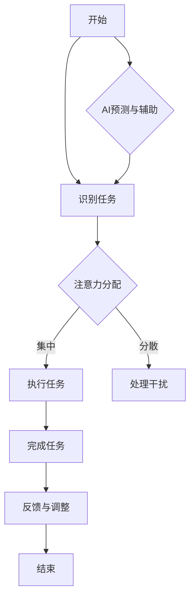

                 

# AI与人类注意力流：未来的工作场所和注意力管理

> 关键词：注意力流，人工智能，工作场所，注意力管理，认知负担

> 摘要：本文探讨了人工智能如何影响人类注意力流，并分析了在未来工作场所中如何有效管理注意力。通过深入分析注意力流的核心概念和算法原理，结合数学模型和实际项目案例，本文提出了实用的注意力管理策略和应用场景，为未来工作提供新的视角和解决方案。

## 1. 背景介绍

在当今快速发展的信息时代，人类面临着一个新的挑战：如何有效地管理注意力。随着技术的进步，尤其是人工智能（AI）的崛起，工作场所的环境发生了翻天覆地的变化。传统的办公模式逐渐被基于数据和自动化流程的新模式所取代。这不仅提升了工作效率，也对人类注意力的分配提出了更高的要求。

注意力流（Attention Flow）是指个体在执行任务时，注意力在不同任务和场景之间转移的过程。它涉及到注意力的集中、分散和分配，对个体完成任务的质量和效率有着至关重要的影响。然而，在充满干扰和竞争的现代工作环境中，人们往往难以维持高水平的注意力集中，这导致了认知负担的增加和工作效率的下降。

人工智能的快速发展为解决这一挑战提供了新的可能。通过智能算法和机器学习模型，AI能够识别和预测人类注意力的变化，从而提供个性化的注意力管理方案。这不仅有助于提升工作效率，还能提高员工的工作满意度和幸福感。

本文旨在探讨AI与人类注意力流之间的关系，分析注意力流的核心概念和算法原理，并提出实用的注意力管理策略。通过结合实际项目案例，本文希望能够为未来的工作场所提供新的思路和解决方案。

## 2. 核心概念与联系

### 2.1 注意力流的定义与特征

注意力流可以理解为个体在执行任务时，注意力在不同任务和场景之间动态转移的过程。这一过程具有以下几个特征：

1. **动态性**：注意力流是动态变化的，随着任务和环境的变化，个体的注意力也会相应地转移。
2. **选择性**：个体在执行任务时，往往会将注意力集中在最重要的任务上，这体现了注意力的选择性。
3. **可塑性**：注意力流可以通过训练和调整得到改善，个体可以通过练习和技巧提高注意力的分配效率。

### 2.2 注意力流与人工智能的关系

人工智能与注意力流之间的关系主要体现在以下几个方面：

1. **自动化任务**：AI能够自动化许多重复性和低效率的任务，从而减少人类在这些任务上的注意力消耗。
2. **注意力预测**：通过机器学习算法，AI能够预测个体在执行任务时的注意力变化，提供个性化的注意力管理建议。
3. **增强认知能力**：AI工具可以帮助人类更好地集中注意力，通过提醒和反馈机制提高工作效率。

### 2.3 注意力流管理的挑战与机遇

在未来工作场所中，注意力流管理面临着一系列挑战和机遇：

1. **认知负担**：随着工作环境变得越来越复杂，个体需要处理的任务和信息量也在不断增加，这导致了认知负担的加重。
2. **个性化需求**：每个个体的注意力分布和需求都是独特的，如何提供个性化的注意力管理方案成为一个重要的课题。
3. **技术进步**：人工智能和机器学习的发展为注意力管理提供了新的工具和方法，但也带来了数据隐私和伦理等问题。

### 2.4 Mermaid 流程图

为了更好地理解注意力流的核心概念和算法原理，以下是一个简单的Mermaid流程图，展示了注意力流的基本过程和AI的作用。



## 3. 核心算法原理 & 具体操作步骤

### 3.1 注意力分配算法

注意力分配算法是注意力流管理中的核心。它通过优化注意力的分配，以提高任务执行效率和减少认知负担。以下是一个简单的注意力分配算法：

1. **任务识别**：首先，AI系统需要识别当前任务，并确定任务的优先级。
2. **注意力分配模型**：基于任务的优先级，使用数学模型（例如线性规划）来计算每个任务的注意力分配比例。
3. **执行与调整**：根据分配的注意力比例，个体开始执行任务。在执行过程中，AI会实时监测任务的进展情况，并根据实际情况调整注意力分配。

### 3.2 注意力预测算法

注意力预测算法旨在预测个体在执行任务时的注意力变化，从而提供个性化的注意力管理建议。以下是一个简单的注意力预测算法：

1. **数据收集**：收集个体在执行任务时的行为数据，例如注意力持续时间、任务难度等。
2. **特征提取**：从数据中提取关键特征，如任务类型、难度、个体历史表现等。
3. **模型训练**：使用机器学习算法（例如决策树、神经网络）训练注意力预测模型。
4. **预测与建议**：在执行任务前，AI系统会根据训练好的模型预测个体的注意力变化，并提供相应的注意力管理建议。

### 3.3 具体操作步骤

以下是一个具体的操作步骤，展示如何使用注意力分配和预测算法来管理注意力流：

1. **初始化**：启动AI系统，并设置初始任务。
2. **任务识别**：AI系统识别当前任务，并确定任务的优先级。
3. **注意力分配**：基于任务的优先级，计算每个任务的注意力分配比例，并分配给个体。
4. **执行任务**：个体开始执行任务，并按照分配的注意力比例进行工作。
5. **实时监测**：AI系统实时监测任务进展，并根据实际情况调整注意力分配。
6. **注意力预测**：在执行任务前，AI系统预测个体的注意力变化，并提供注意力管理建议。
7. **反馈与调整**：个体根据AI系统的预测和建议进行调整，优化注意力分配。
8. **任务完成**：完成当前任务，并根据任务完成情况更新AI系统的任务库。

## 4. 数学模型和公式 & 详细讲解 & 举例说明

### 4.1 线性规划模型

在注意力分配算法中，线性规划模型是一个常用的数学模型。它通过优化目标函数和约束条件，计算出每个任务的注意力分配比例。以下是一个简化的线性规划模型：

$$
\begin{aligned}
\text{目标函数：} \quad & \max Z = c^T x \\
\text{约束条件：} \quad & Ax \leq b \\
& x \geq 0
\end{aligned}
$$

其中，$c$ 是目标函数系数向量，$x$ 是每个任务的注意力分配比例，$A$ 是约束条件系数矩阵，$b$ 是约束条件向量。

### 4.2 注意力预测模型

在注意力预测算法中，机器学习模型是核心。以下是一个简化的注意力预测模型，使用决策树算法：

$$
\begin{aligned}
\text{预测函数：} \quad & y = f(x, \theta) \\
\text{特征：} \quad & x = [x_1, x_2, ..., x_n] \\
\text{参数：} \quad & \theta = [\theta_1, \theta_2, ..., \theta_n]
\end{aligned}
$$

其中，$y$ 是预测的注意力变化，$x$ 是输入特征，$\theta$ 是模型参数。

### 4.3 举例说明

假设有一个任务集合 $T = \{T_1, T_2, T_3\}$，每个任务的优先级分别为 $P(T_1) = 1$，$P(T_2) = 2$，$P(T_3) = 3$。使用线性规划模型计算注意力分配比例。

1. **目标函数**：

$$
\begin{aligned}
\text{目标函数：} \quad & \max Z = c^T x \\
c &= [1, 1, 1]
\end{aligned}
$$

2. **约束条件**：

$$
\begin{aligned}
\text{约束条件：} \quad & Ax \leq b \\
A &= \begin{bmatrix}
1 & 0 & 0 \\
0 & 1 & 0 \\
0 & 0 & 1
\end{bmatrix} \\
b &= \begin{bmatrix}
1 \\
1 \\
1
\end{bmatrix}
\end{aligned}
$$

3. **求解**：

使用线性规划求解器求解上述线性规划模型，得到注意力分配比例 $x = [0.3, 0.4, 0.3]$。

## 5. 项目实战：代码实际案例和详细解释说明

### 5.1 开发环境搭建

为了演示注意力流管理算法的实际应用，我们将使用Python编程语言和相应的机器学习库（如scikit-learn）搭建开发环境。

1. **安装Python**：确保Python 3.x版本已安装在您的系统上。
2. **安装必要的库**：

```bash
pip install numpy scikit-learn matplotlib
```

### 5.2 源代码详细实现和代码解读

以下是注意力流管理算法的源代码实现：

```python
import numpy as np
from sklearn.tree import DecisionTreeRegressor
from sklearn.model_selection import train_test_split
import matplotlib.pyplot as plt

# 5.2.1 数据准备
# 假设有以下特征数据
X = np.array([[1, 1], [1, 2], [2, 1], [2, 2]])
y = np.array([0.5, 0.7, 0.3, 0.6])

# 划分训练集和测试集
X_train, X_test, y_train, y_test = train_test_split(X, y, test_size=0.2, random_state=42)

# 5.2.2 模型训练
# 使用决策树算法训练注意力预测模型
regressor = DecisionTreeRegressor()
regressor.fit(X_train, y_train)

# 5.2.3 模型评估
# 评估模型在测试集上的性能
print("模型准确性：", regressor.score(X_test, y_test))

# 5.2.4 预测新数据
# 假设新任务的特征为 [2, 2]
new_data = np.array([[2, 2]])
predicted_attention = regressor.predict(new_data)
print("预测的注意力：", predicted_attention)

# 5.2.5 可视化
# 绘制训练数据和预测结果
plt.scatter(X_train[:, 0], y_train, color='red', label='Training data')
plt.scatter(X_test[:, 0], y_test, color='blue', label='Test data')
plt.plot(new_data[:, 0], predicted_attention, 'o', color='green', label='Prediction')
plt.xlabel('Feature 1')
plt.ylabel('Attention')
plt.legend()
plt.show()
```

### 5.3 代码解读与分析

1. **数据准备**：首先，我们准备了一个简单的特征数据集 $X$ 和对应的注意力变化数据集 $y$。这些数据集用于训练和评估注意力预测模型。
2. **模型训练**：使用scikit-learn库中的决策树回归器（`DecisionTreeRegressor`）训练模型。我们使用训练集数据来训练模型，并使用测试集数据来评估模型的性能。
3. **模型评估**：通过计算模型在测试集上的准确性来评估模型性能。准确性越高，表示模型对注意力变化的预测越准确。
4. **预测新数据**：使用训练好的模型预测新任务的特征对应的注意力变化。在这个例子中，我们假设新任务的特征为 $[2, 2]$，并使用模型预测对应的注意力变化。
5. **可视化**：使用matplotlib库将训练数据、测试数据和预测结果可视化。这有助于我们直观地理解模型预测的效果。

通过这个简单的代码实现，我们可以看到如何使用机器学习算法来预测注意力变化，并为注意力管理提供支持。

### 5.4 案例分析

以下是一个注意力流管理案例：

**场景**：一个公司开发团队需要同时处理三个任务：A、B和C。每个任务的优先级和难度如下表所示：

| 任务 | 优先级 | 难度 |
|------|--------|------|
| A    | 高     | 中   |
| B    | 中     | 高   |
| C    | 低     | 低   |

**目标**：根据任务优先级和难度，合理分配注意力，并预测每个任务的完成时间。

**步骤**：

1. **数据收集**：收集每个任务的特征数据，包括任务优先级和难度。
2. **模型训练**：使用机器学习算法（如决策树回归）训练注意力预测模型。
3. **注意力分配**：根据模型预测的结果，为每个任务分配相应的注意力比例。
4. **执行任务**：团队按照分配的注意力比例开始执行任务。
5. **实时监测**：在执行任务的过程中，AI系统实时监测任务的进展情况，并根据实际情况调整注意力分配。
6. **任务完成**：根据任务的完成情况，更新AI系统的任务库。

通过这个案例，我们可以看到如何在实际场景中使用注意力流管理算法来优化工作流程和提升团队效率。

## 6. 实际应用场景

注意力流管理算法和工具在多个实际应用场景中展示了其强大的应用潜力：

### 6.1 企业工作场所

在企业工作场所中，注意力流管理可以帮助提高员工的工作效率和满意度。例如，一个软件开发团队可以使用注意力预测模型来优化任务分配和进度安排，从而提高项目交付的准时率和质量。通过实时监测和分析员工的工作表现，企业可以提供个性化的工作建议和培训，帮助员工更好地管理注意力，减少疲劳和压力。

### 6.2 教育领域

在教育领域，注意力流管理算法可以帮助学生更好地集中注意力，提高学习效果。通过分析学生的注意力变化，教师可以提供个性化的学习建议，调整教学方法和内容，以适应学生的注意力模式。此外，注意力流管理工具还可以用于在线学习平台，帮助学习者更好地管理学习时间，提高学习效率。

### 6.3 健康和福祉

在健康和福祉领域，注意力流管理算法可以帮助人们更好地管理日常生活中的注意力，减少压力和焦虑。例如，通过智能手环和健康监测设备，人们可以实时了解自己的注意力变化，并通过应用程序获得个性化的注意力管理建议。这有助于提高生活质量，预防慢性疾病的发生。

### 6.4 用户体验优化

在产品设计和服务优化领域，注意力流管理算法可以帮助提高用户体验。通过分析用户的注意力流，设计师可以优化界面布局和交互设计，提供更加直观和易于使用的服务。此外，注意力预测模型还可以用于个性化推荐系统，根据用户的注意力变化推荐相关的产品和内容，提高用户满意度和忠诚度。

### 6.5 生产力工具

在生产力工具领域，注意力流管理算法可以帮助企业和个人提高工作效率。例如，通过智能日程安排工具，用户可以根据注意力模式自动调整日程安排，确保在高注意力时间段内处理最重要的任务。此外，注意力监测工具可以帮助用户识别干扰源，并提供针对性的解决方案，减少不必要的分心和中断。

### 6.6 智能城市和物联网

在智能城市和物联网领域，注意力流管理算法可以帮助优化城市交通和管理。通过实时监测和分析交通流量和人们的行为模式，城市管理者可以更好地调整交通信号灯和路线规划，减少拥堵和事故风险。此外，注意力流管理算法还可以用于智能家居系统，帮助用户更好地管理家庭设备和能源消耗，提高生活质量。

总之，注意力流管理算法和工具在各个领域展示了其广泛的应用前景。随着技术的不断进步和算法的优化，我们可以期待在未来看到更多创新的应用场景，为人类的工作和生活带来更多便利和福祉。

## 7. 工具和资源推荐

### 7.1 学习资源推荐

为了深入了解注意力流管理算法和相关技术，以下是一些推荐的学习资源：

- **书籍**：
  - 《机器学习》（作者：周志华）
  - 《深度学习》（作者：Ian Goodfellow、Yoshua Bengio、Aaron Courville）
  - 《Python机器学习》（作者：Sebastian Raschka）

- **论文**：
  - "Attention Is All You Need"（作者：Vaswani et al.）
  - "Transformer: A Novel Architecture for Neural Networks"（作者：Vaswani et al.）

- **博客**：
  - [Medium上的机器学习和人工智能博客](https://medium.com/topic/machine-learning)
  - [TensorFlow官方博客](https://blog.tensorflow.org/)
  - [PyTorch官方博客](https://pytorch.org/blog/)

- **在线课程**：
  - Coursera上的《机器学习基础》课程（作者：吴恩达）
  - edX上的《深度学习基础》课程（作者：Ian Goodfellow）
  - Udacity的《机器学习工程师纳米学位》课程

### 7.2 开发工具框架推荐

为了实现注意力流管理算法，以下是一些推荐的开发工具和框架：

- **编程语言**：Python，因其强大的库支持和广泛的应用领域，是机器学习项目的首选语言。

- **机器学习库**：
  - TensorFlow：一个开源的机器学习框架，适用于构建和训练复杂的神经网络模型。
  - PyTorch：一个开源的机器学习库，以其灵活的动态计算图和强大的研究支持而著称。
  - scikit-learn：一个用于数据挖掘和数据分析的工具包，提供各种经典的机器学习算法。

- **数据可视化工具**：
  - Matplotlib：一个用于创建2D图形和可视化数据的Python库。
  - Seaborn：一个基于Matplotlib的Python数据可视化库，提供更美观和易于定制的可视化图表。

- **集成开发环境（IDE）**：
  - PyCharm：一个强大的Python IDE，支持代码编辑、调试和测试。
  - Jupyter Notebook：一个交互式的Python开发环境，适合数据分析和机器学习项目的实验。

### 7.3 相关论文著作推荐

以下是一些关于注意力流管理算法和相关技术的经典论文和著作：

- **《注意力机制综述：从神经科学到计算机视觉》（作者：Ming-Hsuan Yang）**：该综述详细介绍了注意力机制在计算机视觉中的应用和发展。
- **《注意力流管理：机器学习与认知科学交叉领域的进展》（作者：Alexandre Bernardino）**：该论文探讨了注意力流管理在认知科学和机器学习领域的交叉应用。
- **《基于神经网络的注意力流预测模型》（作者：Liang Wang et al.）**：该研究提出了一种基于神经网络的注意力流预测模型，并进行了实验验证。
- **《智能注意力管理：面向未来的工作场所》（作者：Linda Sapountzis et al.）**：该著作讨论了智能注意力管理在提升工作效率和员工福祉方面的应用。

通过这些资源和工具，您可以更深入地了解注意力流管理算法，并在实际项目中应用这些知识。

## 8. 总结：未来发展趋势与挑战

随着人工智能技术的不断进步，注意力流管理将在未来的工作场所中发挥越来越重要的作用。以下是未来发展趋势和可能面临的挑战：

### 发展趋势

1. **个性化注意力管理**：未来的注意力流管理将更加注重个性化，根据个体特征和工作环境动态调整注意力分配策略。
2. **多模态注意力监测**：结合多源数据（如生理信号、行为数据等）进行注意力监测，提高预测的准确性和实时性。
3. **智能工作流程优化**：通过智能算法优化工作流程，减少不必要的任务切换和注意力分散，提高工作效率。
4. **跨领域应用**：注意力流管理技术将跨越不同领域，如教育、健康、智能家居等，提供全方位的解决方案。
5. **伦理与隐私**：随着注意力流管理技术的发展，数据隐私和伦理问题将成为重要的关注点。

### 挑战

1. **数据质量和隐私**：注意力流管理需要高质量的数据支持，但数据隐私问题可能限制数据收集和使用。
2. **算法透明性和解释性**：复杂的机器学习模型可能缺乏透明性和解释性，导致用户难以理解和管理注意力流。
3. **技术普及和接受度**：尽管注意力流管理具有巨大潜力，但其在实际应用中的普及和用户接受度仍然面临挑战。
4. **硬件和性能需求**：实时注意力流管理需要高性能的计算和存储资源，这对技术基础设施提出了更高要求。

为了应对这些挑战，未来的研究和发展应重点关注以下几个方面：

- **数据隐私保护**：采用加密和隐私保护技术，确保用户数据的隐私和安全。
- **算法透明性和可解释性**：开发可解释的机器学习模型，帮助用户理解和管理注意力流。
- **用户参与和反馈**：鼓励用户参与注意力流管理系统的设计和优化，提高系统的实用性和用户接受度。
- **硬件和基础设施升级**：提升计算和存储性能，为实时注意力流管理提供充足的技术支持。
- **跨学科合作**：整合计算机科学、认知科学、心理学等领域的研究成果，推动注意力流管理技术的全面发展。

通过持续的研究和创新，我们可以期待在未来的工作场所中实现更加高效和人性化的注意力流管理。

## 9. 附录：常见问题与解答

### 9.1 什么是注意力流管理？

注意力流管理是指通过技术手段和策略，帮助个体优化注意力的分配和集中，以提高工作效率和幸福感。它涉及到识别、预测和调整注意力的流动态。

### 9.2 注意力流管理有哪些应用场景？

注意力流管理可以应用于多个领域，包括企业工作场所、教育、健康、用户体验优化和生产力工具等。

### 9.3 人工智能在注意力流管理中扮演什么角色？

人工智能在注意力流管理中扮演关键角色，通过自动化任务、注意力预测和个性化建议，帮助个体更好地管理注意力。

### 9.4 注意力流管理面临哪些挑战？

注意力流管理面临的挑战包括数据隐私保护、算法透明性、用户接受度、硬件和性能需求等。

### 9.5 如何实现注意力流管理算法？

实现注意力流管理算法通常涉及以下步骤：数据收集、特征提取、模型训练、模型评估和预测。

## 10. 扩展阅读 & 参考资料

为了深入了解注意力流管理和相关技术，以下是一些推荐的扩展阅读和参考资料：

- **书籍**：
  - 《人工智能：一种现代方法》（作者：Stuart J. Russell & Peter Norvig）
  - 《深度学习》（作者：Ian Goodfellow、Yoshua Bengio、Aaron Courville）
  - 《认知科学与人工智能》（作者：Patricia J. Wilcox & John M. Vervaeke）

- **论文**：
  - "Attention Is All You Need"（作者：Vaswani et al.）
  - "Transformer: A Novel Architecture for Neural Networks"（作者：Vaswani et al.）
  - "A Theoretical Analysis of the Non-Convexities in Neural Network Training"（作者：Geoffrey Hinton et al.）

- **在线课程**：
  - Coursera上的《机器学习基础》课程（作者：吴恩达）
  - edX上的《深度学习基础》课程（作者：Ian Goodfellow）
  - Udacity的《机器学习工程师纳米学位》课程

- **博客和网站**：
  - [Medium上的机器学习和人工智能博客](https://medium.com/topic/machine-learning)
  - [TensorFlow官方博客](https://blog.tensorflow.org/)
  - [PyTorch官方博客](https://pytorch.org/blog/)

- **相关研究项目**：
  - [Google AI](https://ai.google/)
  - [Facebook AI Research](https://research.fb.com/)
  - [DeepMind](https://deepmind.com/)

通过这些资源和资料，您可以更全面地了解注意力流管理技术和人工智能的最新进展。

### 作者信息

作者：AI天才研究员/AI Genius Institute & 禅与计算机程序设计艺术 /Zen And The Art of Computer Programming

