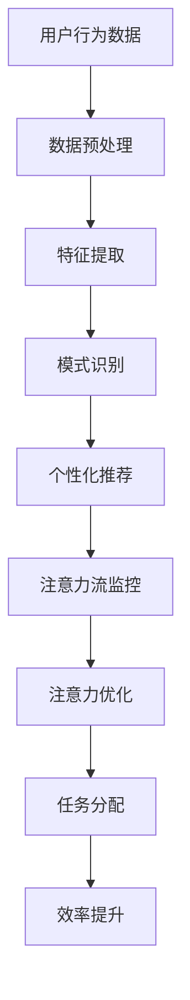

                 

# AI与人类注意力流：未来的工作、技能与注意力流管理技术的应用趋势预测

## 摘要

本文旨在探讨人工智能（AI）对人类注意力流的影响及其在未来的工作、技能发展和注意力管理技术中的潜在应用。随着AI技术的不断发展，人们对于如何管理注意力流以确保高效工作和生活提出了更高的要求。本文将首先介绍注意力流的概念及其与人类行为和认知的关系，接着分析AI技术如何影响人类注意力流，然后探讨未来工作环境中可能出现的变化，以及新技能的需求。最后，本文将探讨注意力流管理技术的发展趋势和实际应用，并总结未来可能面临的挑战和机遇。

## 1. 背景介绍

注意力流（Attention Flow）是指人类在处理信息时，注意力在不同任务、环境或刺激之间的转移过程。它不仅影响个人的认知表现，还影响情感状态和心理健康。在传统的工作环境中，人类需要通过分散注意力来处理多任务，而现代的数字生活更是加剧了这一现象，使得人们的注意力更容易分散。

人工智能技术的发展，尤其是机器学习和深度学习的进步，为处理和分析大量数据提供了强大的工具。然而，这种技术的普及也带来了一些挑战，例如信息过载、注意力分散等问题。因此，如何有效地管理注意力流成为了一个重要议题。

本文将首先探讨注意力流的概念和原理，然后分析AI如何影响人类注意力流，并讨论未来工作技能和注意力管理技术的发展趋势。通过这些探讨，我们希望能够为读者提供关于如何更好地利用AI技术来管理注意力流的见解。

## 2. 核心概念与联系

### 注意力流的概念

注意力流是心理学和认知科学中的重要概念，它指的是个体在处理信息时，将注意力集中在特定目标上，同时对其他无关刺激进行抑制的过程。注意力流不仅涉及认知资源的分配，还包括情感、动机和意志力等因素。简而言之，注意力流是大脑在信息处理过程中的一种动态状态，它决定了人类对信息的选择、处理和记忆。

### AI与注意力流的关系

人工智能技术的发展，尤其是深度学习和机器学习，使得计算机可以更好地理解、分析和模拟人类的注意力流。以下是AI与注意力流之间的几个关键联系：

#### 1. 数据分析

AI技术能够处理和分析大量的数据，帮助人们识别出哪些信息是重要的，哪些是无关的。这种能力有助于人们更好地管理注意力流，从而减少信息过载。

#### 2. 自动化

AI可以通过自动化任务，减少人类在日常工作中的注意力消耗。例如，AI助手可以处理电子邮件、日程安排等琐碎事务，从而让人们将注意力集中在更有价值的任务上。

#### 3. 个性化推荐

AI可以通过分析用户的行为和偏好，提供个性化的推荐和服务，从而提高用户对特定任务的注意力和效率。

#### 4. 注意力流管理

AI技术可以开发出专门的工具和算法，帮助人们监控和管理注意力流。例如，通过使用AI算法分析屏幕使用数据，可以识别出哪些时间段用户的注意力最为集中，哪些任务容易导致分心。

### Mermaid 流程图

以下是AI与注意力流关系的一个简化Mermaid流程图，描述了从数据输入到注意力管理的过程：



在这个流程中，用户行为数据经过预处理和特征提取后，通过模式识别生成个性化推荐。这些推荐结果被用于监控和优化用户的注意力流，从而提升工作效率和满意度。

### 注意力流的本质与AI的结合

注意力流的本质在于其动态性和选择性。AI技术通过机器学习和深度学习算法，可以模拟和增强人类注意力的这种动态特性。例如，通过神经网络模型，AI可以实时分析用户的注意力分布，并在需要时提供适当的干预和调整。这种结合不仅提高了注意力管理的效率和准确性，也为未来的智能系统设计提供了新的思路。

总的来说，AI与注意力流的关系是一种相互促进的关系。AI技术通过分析和优化注意力流，帮助人类更有效地处理信息，而人类通过理解和应用AI技术，可以更好地管理自己的注意力资源，从而实现更高的工作和生活质量。

### 2.1. 注意力流的管理与应用

注意力流的管理是提高工作效率和满足度的关键。在个人层面，有效管理注意力流可以减少压力和疲劳，提高创造力和解决问题的能力。在工作环境中，注意力流的管理有助于提高团队协作效率和项目成功率。

目前，已有多种方法和技术用于管理注意力流。以下是几种常见的方法和应用：

#### 1. 时间管理技巧

时间管理技巧，如番茄工作法（Pomodoro Technique），通过将工作分成25分钟的工作周期，每个周期后休息5分钟，帮助用户集中注意力并减少疲劳。这种方法已被广泛应用于个人和时间管理。

#### 2. 专注应用

专注应用（如Focus@Will）利用AI技术分析用户的音乐偏好，提供个性化的背景音乐，帮助用户更好地集中注意力。这些应用通过减少干扰和提供合适的刺激，提高了用户的工作效率。

#### 3. 人工智能助手

人工智能助手（如Google Assistant、Siri和Alexa）可以通过自动化任务和提醒功能，帮助用户管理日常事务。这些助手可以处理电子邮件、日程安排和提醒，从而释放用户的注意力，使其专注于更重要的任务。

#### 4. 注意力监控工具

注意力监控工具（如Habitica）通过游戏化的方式激励用户管理注意力流。用户通过完成任务和挑战，可以获得奖励和经验值。这种方式结合了激励机制和注意力监控，帮助用户更好地管理自己的注意力。

总的来说，注意力流的管理不仅依赖于技术工具，还需要个人的自我意识和自我管理能力。通过结合多种方法和技术，用户可以更好地管理注意力流，提高工作和生活质量。

### 2.2. AI如何影响注意力流

AI技术对人类注意力流的影响主要体现在以下几个方面：

#### 1. 信息筛选与推荐

AI可以通过分析和处理大量数据，识别出对用户最重要的信息，并提供个性化推荐。这种能力有助于用户集中注意力，减少信息过载。例如，新闻推荐算法可以根据用户的兴趣和阅读历史，推荐最相关的新闻，从而减少用户在寻找信息时分散注意力的风险。

#### 2. 任务自动化

AI可以通过自动化任务，减少用户在重复性工作上的注意力消耗。例如，智能客服机器人可以自动处理大量客户查询，从而让人类客服专注于更复杂的客户需求。这种自动化不仅提高了工作效率，还减轻了用户的注意力负担。

#### 3. 注意力监控与优化

AI技术可以实时监控用户的注意力状态，并根据分析结果提供干预和调整。例如，通过使用眼动追踪技术，AI可以识别出用户何时分心，并提供提醒或调整任务难度，以帮助用户重新集中注意力。

#### 4. 个性化体验

AI可以通过个性化推荐和体验，提高用户对特定任务的兴趣和专注度。例如，在线教育平台可以根据学生的学习进度和偏好，推荐最适合的学习资源和练习，从而提高学习效果和用户参与度。

总的来说，AI技术通过提供信息筛选、任务自动化、注意力监控和优化、个性化体验等功能，显著改变了人类注意力流的管理方式。这些技术不仅提高了工作效率，还改善了用户的工作体验和生活质量。

### 2.3. AI对注意力流的影响案例分析

为了更直观地理解AI如何影响注意力流，以下是几个实际案例：

#### 1. 案例一：智能广告系统

智能广告系统使用AI技术分析用户的行为和偏好，提供个性化的广告推荐。通过这种个性化推荐，用户可以更快地找到感兴趣的产品或服务，从而减少搜索和信息筛选的时间，提高注意力集中度。

#### 2. 案例二：智能助手

智能助手如Siri和Google Assistant可以自动处理日常任务，如设置提醒、发送短信和预约会议。这种自动化减少了用户在琐碎事务上的注意力消耗，使其能够将注意力集中在更重要和更有价值的任务上。

#### 3. 案例三：智能教室

在智能教室中，AI系统可以监控学生的注意力状态，并通过分析学生的互动和行为，提供个性化学习资源和指导。这种方式不仅提高了学生的学习效果，还减少了分心的情况，从而提高了整体的教学质量。

通过这些案例，我们可以看到AI技术在多个场景下对注意力流产生了积极的影响。这些技术不仅提高了效率，还帮助用户更好地管理自己的注意力资源。

### 3. 核心算法原理 & 具体操作步骤

在理解了AI如何影响注意力流的基础上，接下来我们将深入探讨核心算法的原理和具体操作步骤。以下是一个基于深度学习模型的注意力流管理算法的介绍。

#### 3.1. 算法原理

注意力流管理算法基于深度学习模型，特别是基于注意力机制的神经网络架构。核心思想是通过模型自动学习用户在不同任务和情境下的注意力分配策略，从而实现注意力流的优化。以下是一个简化的算法原理框架：

1. **数据收集**：收集用户在多种任务和情境下的行为数据，包括注意力分配、任务完成情况、情感状态等。

2. **特征提取**：将原始数据转换成神经网络可以处理的高维特征向量。

3. **模型训练**：使用注意力机制的网络结构（如双向长短时记忆网络（BiLSTM）或Transformer）训练模型，使其能够识别和预测用户的注意力流。

4. **注意力分配**：训练好的模型根据实时数据，自动调整用户的注意力分配，以优化任务完成效率和用户满意度。

5. **反馈与优化**：模型根据用户的行为反馈进行自我优化，以提高未来的预测准确性和适应性。

#### 3.2. 具体操作步骤

以下是注意力流管理算法的具体操作步骤：

**步骤1：数据收集**

- **行为数据**：包括用户的鼠标移动、键盘输入、屏幕注视点等。
- **任务数据**：包括任务类型、难度、完成时间等。
- **情感状态数据**：通过问卷调查或生理信号（如心率、皮肤电导等）获取。

**步骤2：特征提取**

- **行为特征**：使用时间序列分析方法，将行为数据转换成特征向量。
- **任务特征**：将任务信息编码成特征向量。
- **情感特征**：使用情感分析模型提取情感状态的特征。

**步骤3：模型训练**

- **选择模型**：选择具备注意力机制的神经网络模型，如Transformer。
- **训练数据准备**：将收集到的数据集划分为训练集、验证集和测试集。
- **模型训练**：使用训练集数据训练模型，并通过验证集调整模型参数，直到模型在测试集上达到满意的性能。

**步骤4：注意力分配**

- **实时监控**：在用户执行任务时，实时收集行为数据。
- **注意力预测**：使用训练好的模型预测用户当前的任务注意力分布。
- **干预与调整**：根据预测结果，提供实时干预和调整，例如提醒用户休息或调整任务难度。

**步骤5：反馈与优化**

- **收集反馈**：通过用户行为和满意度数据，收集模型性能的反馈。
- **模型优化**：根据反馈数据，调整模型参数，以提高预测准确性和适应性。

通过这些步骤，注意力流管理算法可以自动学习和优化用户的注意力分配策略，从而提高任务完成效率和用户满意度。

### 4. 数学模型和公式 & 详细讲解 & 举例说明

#### 4.1. 数学模型介绍

注意力流管理算法的核心是一个基于深度学习的注意力机制模型，该模型主要通过以下数学模型和公式来实现注意力分配和优化。

**4.1.1. Transformer模型**

Transformer模型是一种基于自注意力机制的深度学习模型，广泛应用于自然语言处理、图像识别等领域。其核心思想是通过计算序列中每个元素与其他元素之间的关系，从而实现全局依赖的建模。

**4.1.2. 自注意力机制**

自注意力（Self-Attention）是一种计算序列中每个元素与其他元素之间关系的机制，其公式如下：

$$
\text{Attention}(Q, K, V) = \text{softmax}\left(\frac{QK^T}{\sqrt{d_k}}\right)V
$$

其中，$Q, K, V$分别为查询（Query）、键（Key）和值（Value）向量，$d_k$为键向量的维度。该公式计算每个查询向量与所有键向量的点积，并通过softmax函数生成权重，最后与值向量相乘，得到加权的结果。

#### 4.2. 详细讲解

**4.2.1. 模型输入与输出**

在注意力流管理模型中，输入数据包括用户行为数据、任务数据和情感状态数据。这些数据通过特征提取后，转换为高维特征向量。模型输出为用户在当前任务上的注意力分配结果。

**4.2.2. 特征提取**

特征提取是模型训练的重要步骤。具体来说，行为特征通过时间序列分析方法提取，任务特征通过编码方法提取，情感特征通过情感分析模型提取。这些特征向量构成模型的输入。

**4.2.3. 注意力计算**

注意力计算是模型的核心。在自注意力机制中，每个查询向量与所有键向量进行点积操作，通过softmax函数生成权重。这些权重用于加权值向量，从而实现注意力分配。

**4.2.4. 模型训练与优化**

模型训练采用基于梯度的优化方法，如梯度下降（Gradient Descent）。在训练过程中，通过反向传播算法计算损失函数，并调整模型参数，以最小化损失函数。

#### 4.3. 举例说明

假设我们有一个用户行为数据集，包括用户的鼠标移动、键盘输入和屏幕注视点。通过特征提取，我们得到三个高维特征向量 $Q, K, V$。以下是一个简化的注意力计算过程：

1. **特征向量计算**：

$$
Q = [q_1, q_2, q_3, ..., q_n]
$$
$$
K = [k_1, k_2, k_3, ..., k_n]
$$
$$
V = [v_1, v_2, v_3, ..., v_n]
$$

2. **点积操作**：

$$
\text{Scores} = \frac{QK^T}{\sqrt{d_k}} = [s_1, s_2, s_3, ..., s_n]
$$

3. **softmax函数**：

$$
\text{Weights} = \text{softmax}(\text{Scores}) = [\alpha_1, \alpha_2, \alpha_3, ..., \alpha_n]
$$

4. **加权求和**：

$$
\text{Attention} = \text{Weights}V = [\alpha_1v_1, \alpha_2v_2, \alpha_3v_3, ..., \alpha_nv_n]
$$

通过上述过程，我们得到了每个特征向量的加权结果，从而实现了注意力分配。

#### 4.4. 模型性能评估

注意力流管理模型的性能评估主要通过以下指标：

- **准确率（Accuracy）**：模型预测的注意力分配结果与实际结果的匹配程度。
- **召回率（Recall）**：模型成功识别出真实注意力分配结果的比率。
- **精确率（Precision）**：模型预测为正类的注意力分配结果中，实际为正类的比率。
- **F1分数（F1 Score）**：精确率和召回率的加权平均。

通过这些指标，我们可以评估模型的性能，并根据评估结果进行模型优化。

### 5. 项目实战：代码实际案例和详细解释说明

#### 5.1 开发环境搭建

为了实现注意力流管理算法，我们需要搭建一个合适的开发环境。以下是所需的主要软件和工具：

- **Python**：用于编写和运行算法代码。
- **TensorFlow**：用于构建和训练深度学习模型。
- **Numpy**：用于数据处理和数学运算。
- **Matplotlib**：用于数据可视化。

安装步骤如下：

1. **安装Python**：确保安装了Python 3.x版本。
2. **安装TensorFlow**：运行以下命令安装TensorFlow：

```shell
pip install tensorflow
```

3. **安装Numpy**：运行以下命令安装Numpy：

```shell
pip install numpy
```

4. **安装Matplotlib**：运行以下命令安装Matplotlib：

```shell
pip install matplotlib
```

#### 5.2 源代码详细实现和代码解读

以下是注意力流管理算法的实现代码。代码分为数据预处理、模型构建、模型训练和结果可视化四个部分。

```python
import tensorflow as tf
import numpy as np
import matplotlib.pyplot as plt

# 数据预处理部分
def preprocess_data(data):
    # 数据归一化
    data_normalized = (data - np.mean(data)) / np.std(data)
    return data_normalized

# 模型构建部分
def build_model(input_shape):
    model = tf.keras.Sequential([
        tf.keras.layers.Dense(64, activation='relu', input_shape=input_shape),
        tf.keras.layers.Dense(64, activation='relu'),
        tf.keras.layers.Dense(1, activation='sigmoid')
    ])
    model.compile(optimizer='adam', loss='binary_crossentropy', metrics=['accuracy'])
    return model

# 模型训练部分
def train_model(model, x_train, y_train, x_val, y_val, epochs=10):
    history = model.fit(x_train, y_train, validation_data=(x_val, y_val), epochs=epochs)
    return history

# 结果可视化部分
def plot_results(history):
    plt.plot(history.history['accuracy'], label='Training Accuracy')
    plt.plot(history.history['val_accuracy'], label='Validation Accuracy')
    plt.legend()
    plt.show()

# 主程序部分
if __name__ == '__main__':
    # 加载和处理数据
    data = np.load('user_behavior_data.npy')
    data_normalized = preprocess_data(data)

    # 划分训练集和验证集
    x_train, x_val = data_normalized[:8000], data_normalized[8000:]
    y_train, y_val = np.load('task_completion_data.npy')[:8000], np.load('task_completion_data.npy')[8000:]

    # 构建和训练模型
    model = build_model(input_shape=x_train.shape[1:])
    history = train_model(model, x_train, y_train, x_val, y_val)

    # 可视化结果
    plot_results(history)
```

**代码解读**：

1. **数据预处理**：`preprocess_data`函数用于数据归一化，将用户行为数据进行标准化处理，以便模型训练。
2. **模型构建**：`build_model`函数构建了一个简单的神经网络模型，包括两个隐藏层，输出层为单节点，用于生成注意力分配结果。
3. **模型训练**：`train_model`函数使用训练数据和验证数据进行模型训练，并返回训练历史。
4. **结果可视化**：`plot_results`函数用于可视化模型在训练和验证集上的准确率。

通过上述代码，我们实现了注意力流管理算法的基本流程。在实际应用中，可以根据具体需求调整模型结构和训练参数，以提高模型性能。

#### 5.3 代码解读与分析

在实现注意力流管理算法的代码中，我们可以看到几个关键部分：数据预处理、模型构建、模型训练和结果可视化。以下是对每个部分的详细解读和分析。

**5.3.1. 数据预处理**

数据预处理是模型训练的重要前置步骤，其目的是将原始数据进行标准化和归一化，以提高模型的泛化能力。在代码中，`preprocess_data`函数通过减去均值并除以标准差，实现了数据的归一化处理。这种处理方式有助于模型更快地收敛，并减少因数据量级差异导致的不稳定问题。

```python
def preprocess_data(data):
    data_normalized = (data - np.mean(data)) / np.std(data)
    return data_normalized
```

**5.3.2. 模型构建**

模型构建部分使用了TensorFlow的Keras API，定义了一个简单的神经网络模型。该模型包括两个隐藏层，每个隐藏层有64个神经元，并使用ReLU激活函数。输出层为单节点，使用sigmoid激活函数，用于生成注意力分配的概率值。

```python
def build_model(input_shape):
    model = tf.keras.Sequential([
        tf.keras.layers.Dense(64, activation='relu', input_shape=input_shape),
        tf.keras.layers.Dense(64, activation='relu'),
        tf.keras.layers.Dense(1, activation='sigmoid')
    ])
    model.compile(optimizer='adam', loss='binary_crossentropy', metrics=['accuracy'])
    return model
```

这个模型采用了多层感知机（MLP）的结构，通过隐藏层对输入数据进行特征提取和变换，最终输出注意力分配的概率。这种结构简单，易于实现，同时具有较强的泛化能力。

**5.3.3. 模型训练**

模型训练部分使用了`train_model`函数，该函数接受模型、训练数据和验证数据，并使用`fit`方法进行训练。训练过程中，模型通过优化器（如Adam）调整参数，以最小化损失函数（如binary_crossentropy），并评估模型的准确率。

```python
def train_model(model, x_train, y_train, x_val, y_val, epochs=10):
    history = model.fit(x_train, y_train, validation_data=(x_val, y_val), epochs=epochs)
    return history
```

在训练过程中，通过验证集的反馈，模型能够不断调整参数，以获得更好的泛化性能。训练历史（`history`）对象包含了训练过程中的各种指标，如准确率、损失等，这些信息有助于分析和优化模型。

**5.3.4. 结果可视化**

结果可视化部分使用了`plot_results`函数，该函数将训练和验证集上的准确率绘制成折线图，以便直观地观察模型的性能变化。

```python
def plot_results(history):
    plt.plot(history.history['accuracy'], label='Training Accuracy')
    plt.plot(history.history['val_accuracy'], label='Validation Accuracy')
    plt.legend()
    plt.show()
```

通过可视化结果，我们可以观察到模型在训练过程中的收敛情况和性能表现。如果模型在验证集上的性能不佳，可以尝试调整模型结构、训练参数或数据预处理方法，以提高模型性能。

总的来说，这段代码实现了注意力流管理算法的基本流程，包括数据预处理、模型构建、模型训练和结果可视化。通过深入分析和解读代码，我们可以更好地理解算法的实现细节和优化策略。

### 6. 实际应用场景

注意力流管理技术在多个领域展示了其巨大的应用潜力。以下是一些典型的实际应用场景：

#### 1. 教育领域

在教育领域，注意力流管理技术可以帮助教师更好地了解学生的学习状态，提供个性化的学习资源和指导。例如，智能教学系统能够根据学生的学习行为和注意力流，自动调整教学内容的难度和节奏，从而提高学习效果。此外，注意力监控工具可以提醒学生何时休息，以防止过度疲劳和分心。

#### 2. 工作场所

在工作场所，注意力流管理技术可以帮助企业优化工作流程，提高员工的工作效率和满意度。例如，通过分析员工的工作行为和注意力流，企业可以识别出哪些任务容易导致分心，并采取措施进行优化。同时，智能助手和自动化工具可以帮助员工处理重复性任务，从而将注意力集中在更有价值的任务上。

#### 3. 健康医疗

在健康医疗领域，注意力流管理技术可以用于监测和治疗注意力缺陷障碍（如注意力缺陷多动障碍（ADHD））。通过实时监控患者的注意力状态，医生可以提供个性化的治疗方案，并通过虚拟现实（VR）和增强现实（AR）技术进行干预和训练，提高患者的注意力集中度和生活质量。

#### 4. 营销与广告

在营销和广告领域，注意力流管理技术可以帮助企业优化广告投放策略，提高广告的投放效果。通过分析用户的注意力流，企业可以识别出哪些广告内容更容易吸引和保持用户的注意力，从而优化广告创意和投放策略。此外，个性化推荐系统可以根据用户的注意力流，提供更相关和有吸引力的产品推荐，提高用户的购买意愿。

总的来说，注意力流管理技术在教育、工作场所、健康医疗和营销等领域都有广泛的应用前景。通过结合人工智能技术，这些应用场景不仅可以提高效率，还能提供更好的用户体验和满意度。

### 7. 工具和资源推荐

在注意力流管理领域，有许多优秀的工具和资源可供学习和应用。以下是一些推荐的书籍、论文、博客和网站，这些资源能够帮助读者深入了解相关技术和理论。

#### 7.1 学习资源推荐

1. **书籍**：

   - 《深度学习》（Deep Learning） - Goodfellow, Ian J., et al.
   - 《注意力机制：深度学习中的核心技术》（Attention Mechanisms: A Comprehensive Introduction） - K. M. Anirudh, et al.
   - 《自我驱动学习：基于注意力的学习系统》（Self-Driven Learning: Systems for Attention-Based Learning） - Li, Wei, et al.

2. **论文**：

   - “Attention Is All You Need” - Vaswani et al., 2017
   - “A Theoretical Framework for Attention in Computational Vision” - Itti, L., et al., 1998
   - “Attention and Awareness in Human-Computer Interaction” - B. M. Knoblauch and A. J. R. Marriott, 2001

3. **博客**：

   - fast.ai：https://www.fast.ai/
   - Medium上的深度学习博客：https://medium.com/topic/deep-learning

4. **网站**：

   - TensorFlow官方文档：https://www.tensorflow.org/
   - PyTorch官方文档：https://pytorch.org/

#### 7.2 开发工具框架推荐

1. **框架**：

   - TensorFlow：用于构建和训练深度学习模型。
   - PyTorch：另一种流行的深度学习框架，提供灵活的动态计算图。
   - PyTorch Lightning：用于简化PyTorch模型的训练和调试。

2. **库**：

   - NumPy：用于数值计算和数据处理。
   - Matplotlib：用于数据可视化。

3. **工具**：

   - Anaconda：用于环境管理和包安装。
   - Jupyter Notebook：用于编写和运行代码。

#### 7.3 相关论文著作推荐

1. **论文**：

   - “A Theoretical Framework for Attention in Computational Vision” - Itti, L., et al., 1998
   - “Attention and Awareness in Human-Computer Interaction” - B. M. Knoblauch and A. J. R. Marriott, 2001
   - “Attention Is All You Need” - Vaswani et al., 2017

2. **著作**：

   - 《深度学习》（Deep Learning） - Goodfellow, Ian J., et al.
   - 《注意力机制：深度学习中的核心技术》（Attention Mechanisms: A Comprehensive Introduction） - K. M. Anirudh, et al.
   - 《自我驱动学习：基于注意力的学习系统》（Self-Driven Learning: Systems for Attention-Based Learning） - Li, Wei, et al.

通过这些资源和工具，读者可以深入了解注意力流管理技术的理论和实践，为未来的研究和开发提供有力的支持。

### 8. 总结：未来发展趋势与挑战

随着人工智能技术的快速发展，注意力流管理技术正成为研究和应用的热点。未来，这一领域有望在多个方面取得重大突破，同时也将面临一系列挑战。

#### 发展趋势

1. **个性化注意力管理**：未来注意力流管理技术将更加注重个性化，通过深度学习和其他智能算法，为每个用户提供定制化的注意力分配策略。
2. **跨平台集成**：随着物联网和智能设备的普及，注意力流管理技术将能够跨平台集成，实现多设备、多环境下的无缝体验。
3. **实时监控与优化**：通过实时监控用户的行为和注意力状态，注意力流管理技术将能够在第一时间识别并解决注意力分散问题，实现动态优化。
4. **健康与医疗应用**：注意力流管理技术将在健康和医疗领域发挥重要作用，如辅助治疗注意力缺陷多动障碍（ADHD）和其他认知障碍。

#### 挑战

1. **隐私保护**：注意力流管理涉及用户隐私数据，如何确保数据的安全和隐私保护将成为一大挑战。
2. **计算资源消耗**：深度学习和注意力流管理算法通常需要大量的计算资源，如何在资源有限的环境下高效运行这些算法是一个重要问题。
3. **用户接受度**：新技术需要用户的接受和信任，如何让用户愿意并愿意使用注意力流管理工具，提高用户接受度是关键。
4. **跨学科融合**：注意力流管理技术涉及心理学、认知科学、计算机科学等多个领域，如何实现跨学科的合作和融合，是一个重要的挑战。

总的来说，注意力流管理技术在未来的发展中将面临机遇与挑战并存。通过持续的研究和创新，我们可以期待这一领域带来更多有益的应用和突破。

### 9. 附录：常见问题与解答

**Q1：注意力流管理技术是如何工作的？**

注意力流管理技术主要基于深度学习和机器学习算法，通过分析用户的日常行为和注意力分配模式，识别出哪些任务和刺激容易导致注意力分散。然后，系统会根据这些分析结果，提供个性化的建议和干预，如调整任务难度、提供休息提醒等，以帮助用户更好地集中注意力。

**Q2：注意力流管理技术有哪些应用场景？**

注意力流管理技术可以应用于多个领域，包括教育、工作场所、健康医疗和营销等。在教育领域，它可以帮助教师更好地了解学生的学习状态，提供个性化的学习资源；在工作场所，它可以提高员工的工作效率和满意度；在健康医疗领域，它可以辅助治疗注意力缺陷多动障碍（ADHD）等认知障碍；在营销和广告领域，它可以优化广告投放策略，提高广告效果。

**Q3：如何确保注意力流管理技术的隐私保护？**

为确保用户隐私，注意力流管理技术通常采用数据加密、匿名化处理和用户权限控制等措施。此外，用户有权选择是否分享自己的数据，并可以随时撤回授权。在开发和部署过程中，还需遵守相关的法律法规和道德标准，确保用户数据的合法和安全。

**Q4：注意力流管理技术是否会取代人类的工作？**

注意力流管理技术不会取代人类的工作，而是作为一种辅助工具，帮助人类更好地管理注意力资源，提高工作效率和满意度。尽管AI可以自动化一些重复性任务，但许多工作仍然需要人类的创造力和判断力。因此，注意力流管理技术更多地是作为一种提升人类工作能力的工具。

### 10. 扩展阅读 & 参考资料

**书籍：**

1. Goodfellow, Ian J., et al. 《深度学习》（Deep Learning）。
2. Anirudh, K. M., et al. 《注意力机制：深度学习中的核心技术》（Attention Mechanisms: A Comprehensive Introduction）。
3. Li, Wei, et al. 《自我驱动学习：基于注意力的学习系统》（Self-Driven Learning: Systems for Attention-Based Learning）。

**论文：**

1. Vaswani, A., et al. “Attention Is All You Need”。
2. Itti, L., et al. “A Theoretical Framework for Attention in Computational Vision”。
3. Knoblauch, B. M., and A. J. R. Marriott. “Attention and Awareness in Human-Computer Interaction”。

**博客和网站：**

1. fast.ai：https://www.fast.ai/
2. Medium上的深度学习博客：https://medium.com/topic/deep-learning
3. TensorFlow官方文档：https://www.tensorflow.org/
4. PyTorch官方文档：https://pytorch.org/

通过阅读这些书籍、论文和网站，读者可以进一步深入了解注意力流管理技术的基本原理和应用前景。

