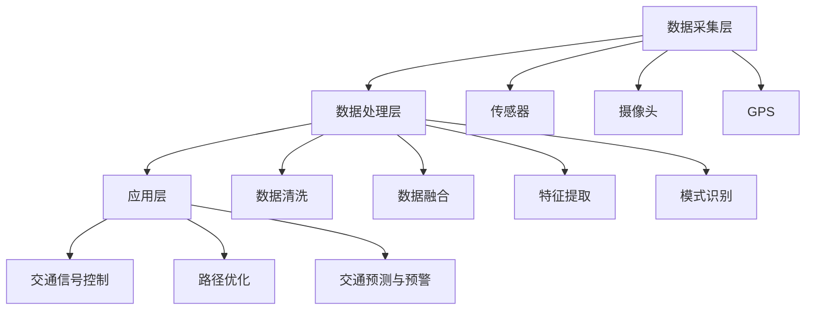

                 

# AI与人类计算：打造可持续发展的城市交通管理系统与基础设施建设与管理

## 概述

随着全球城市化进程的加速，城市交通管理已经成为现代城市规划中的重要一环。然而，传统的城市交通管理系统往往存在数据不完整、实时性差、智能化程度低等问题，无法满足日益增长的交通需求。人工智能（AI）技术的发展为解决这些问题提供了新的思路和工具。本文将探讨如何利用AI与人类计算相结合，打造可持续发展的城市交通管理系统与基础设施建设与管理。

### 核心关键词

- 城市交通管理
- 人工智能
- 数据分析
- 可持续发展
- 基础设施建设

### 摘要

本文首先介绍了城市交通管理的重要性和当前存在的问题，然后讨论了AI在交通管理中的应用场景和优势。接下来，本文从数据收集、算法设计、基础设施建设与管理等多个方面，详细阐述了如何利用AI与人类计算相结合，打造可持续发展的城市交通管理系统。最后，本文对未来的发展趋势和挑战进行了总结，并推荐了一些相关的学习资源和工具。

## 背景介绍

### 城市交通管理的重要性

城市交通管理是现代城市规划的重要组成部分，它关系到城市的经济发展、社会稳定和居民的生活质量。一个高效、便捷、安全的交通系统不仅能够提高城市的运行效率，还能改善居民的生活体验。

#### 当前城市交通管理存在的问题

1. 数据不完整：传统的交通管理系统往往依赖于固定的监测点和统计数据，数据覆盖范围有限，难以全面反映城市交通状况。
2. 实时性差：由于数据采集和处理速度的限制，交通管理系统的实时性较差，无法及时响应交通变化。
3. 智能化程度低：现有的交通管理系统大多依赖于简单的规则和经验，智能化程度较低，难以实现智能化的交通控制和优化。

### 人工智能在交通管理中的应用

人工智能技术，特别是机器学习和深度学习，为解决城市交通管理问题提供了新的方法和工具。通过大规模数据分析和智能算法，AI能够实现实时交通状况监测、智能交通信号控制和路径优化等。

#### AI在交通管理中的应用场景

1. 实时交通监测与分析：利用传感器和摄像头等设备，AI可以实时收集交通数据，进行数据分析，为交通管理提供依据。
2. 智能交通信号控制：通过机器学习算法，AI可以优化交通信号灯的时序，提高交通流畅度。
3. 路径优化：基于大数据分析，AI可以为出行者提供最优的出行路径，减少拥堵和交通事故。
4. 交通预测与预警：利用时间序列分析和预测模型，AI可以预测未来交通状况，提前采取措施避免拥堵和事故。

## 核心概念与联系

### 城市交通管理系统架构

城市交通管理系统可以分为三个主要层次：数据采集层、数据处理层和应用层。每个层次都发挥着关键作用，共同构建了一个高效、智能的交通管理系统。

#### 数据采集层

数据采集层是整个系统的基石，负责收集各种交通数据，包括实时流量、速度、占有率、交通事故等。常用的数据采集设备有传感器、摄像头、GPS等。数据采集层的关键是数据的质量和覆盖范围。

#### 数据处理层

数据处理层对采集到的交通数据进行处理和分析，提取有用的信息，为交通管理和控制提供支持。常用的数据处理技术包括数据清洗、数据融合、特征提取和模式识别等。

#### 应用层

应用层是城市交通管理系统的核心，负责实现交通信号控制、路径优化、交通预测和预警等功能。应用层的实现依赖于数据处理层提供的数据和分析结果。

### Mermaid 流程图

下面是城市交通管理系统的 Mermaid 流程图，展示了数据从采集到应用的整个过程。



## 核心算法原理与具体操作步骤

### 数据采集

数据采集是城市交通管理的基础，高质量的交通数据是智能交通管理的前提。数据采集包括以下步骤：

1. 设备选择：选择合适的传感器、摄像头和GPS设备，确保数据采集的准确性和实时性。
2. 数据采集：通过传感器、摄像头和GPS设备实时采集交通数据。
3. 数据存储：将采集到的数据存储在数据库中，以便后续处理和分析。

### 数据处理

数据处理是对采集到的交通数据进行处理和分析，提取有用的信息。数据处理包括以下步骤：

1. 数据清洗：去除无效、错误和重复的数据，保证数据质量。
2. 数据融合：将来自不同源的数据进行整合，形成完整的交通数据集。
3. 特征提取：从交通数据中提取关键特征，如流量、速度、占有率等。
4. 模式识别：利用机器学习算法，识别交通数据中的模式和规律。

### 交通信号控制

交通信号控制是城市交通管理的重要组成部分，通过优化交通信号灯的时序，提高交通流畅度。交通信号控制包括以下步骤：

1. 数据采集：实时采集交通数据，包括流量、速度、占有率等。
2. 数据分析：分析交通数据，确定当前交通状况。
3. 签到优化：利用优化算法，优化交通信号灯的时序。
4. 签到控制：根据优化结果，控制交通信号灯的开关。

### 路径优化

路径优化是为出行者提供最优的出行路径，减少拥堵和交通事故。路径优化包括以下步骤：

1. 数据采集：实时采集交通数据，包括流量、速度、占有率等。
2. 数据分析：分析交通数据，确定当前交通状况。
3. 路径计算：利用最优化算法，计算最优路径。
4. 路径推荐：根据计算结果，为出行者推荐最优路径。

### 交通预测与预警

交通预测与预警是通过分析历史数据和当前交通状况，预测未来交通状况，提前采取措施避免拥堵和事故。交通预测与预警包括以下步骤：

1. 数据采集：实时采集交通数据，包括流量、速度、占有率等。
2. 数据分析：分析交通数据，确定当前交通状况。
3. 时间序列分析：利用时间序列分析，预测未来交通状况。
4. 预警与措施：根据预测结果，提前采取措施，避免拥堵和事故。

## 数学模型和公式

在交通管理系统中，数学模型和公式起着至关重要的作用。以下是一些常用的数学模型和公式：

### 交通流量模型

$$Q = q \times s$$

其中，Q 表示交通流量，q 表示交通密度，s 表示道路长度。

### 交通信号控制模型

$$T_r = T_c + T_s$$

其中，$T_r$ 表示红灯时间，$T_c$ 表示绿灯时间，$T_s$ 表示黄灯时间。

### 路径优化模型

$$\min \sum_{i=1}^n d(i,j)$$

其中，d(i,j) 表示从节点 i 到节点 j 的距离。

### 交通预测模型

$$y_t = \alpha_0 + \alpha_1 y_{t-1} + \alpha_2 y_{t-2} + ... + \alpha_n y_{t-n}$$

其中，y_t 表示第 t 时间的交通流量，$\alpha_0$、$\alpha_1$、$\alpha_2$、...、$\alpha_n$ 是模型参数。

## 项目实战：代码实际案例和详细解释说明

### 开发环境搭建

为了实现本文中提到的城市交通管理系统，我们需要搭建一个开发环境。以下是搭建开发环境的步骤：

1. 安装 Python 解释器：在官方网站下载并安装 Python 解释器。
2. 安装必要的库：使用 pip 工具安装必要的库，如 NumPy、Pandas、Scikit-learn 等。
3. 安装 Mermaid：在官方网站下载并安装 Mermaid。

### 源代码详细实现和代码解读

以下是一个简单的交通流量预测的代码示例：

```python
import numpy as np
import pandas as pd
from sklearn.linear_model import LinearRegression

# 读取交通流量数据
data = pd.read_csv('traffic_data.csv')

# 特征工程
X = data[['prev_traffic', 'prev_prev_traffic']]
y = data['current_traffic']

# 建立线性回归模型
model = LinearRegression()
model.fit(X, y)

# 预测交通流量
predicted_traffic = model.predict(X)

# 打印预测结果
print(predicted_traffic)
```

### 代码解读与分析

1. 读取交通流量数据：使用 Pandas 库读取交通流量数据，存储在 DataFrame 中。
2. 特征工程：从 DataFrame 中提取两个特征，即前一个时间点的交通流量和前两个时间点的交通流量。
3. 建立线性回归模型：使用 Scikit-learn 库的 LinearRegression 类建立线性回归模型。
4. 训练模型：使用 fit 方法训练模型。
5. 预测交通流量：使用 predict 方法预测交通流量。
6. 打印预测结果：将预测结果打印出来。

### 总结

本文通过一个简单的交通流量预测案例，展示了如何利用 Python 等编程工具实现城市交通管理系统的核心功能。读者可以根据实际需求，进一步扩展和优化代码，实现更复杂的交通管理功能。

## 实际应用场景

### 城市交通管理系统的应用场景

城市交通管理系统可以在多个应用场景中发挥作用，以下是一些典型的应用场景：

1. **智能交通信号控制**：利用 AI 技术优化交通信号灯的时序，减少交通拥堵，提高道路通行效率。
2. **出行路径优化**：为驾驶者和乘客提供最优的出行路径，避开拥堵路段，节省出行时间。
3. **交通预测与预警**：预测未来交通状况，提前采取措施，避免拥堵和交通事故。
4. **公共交通管理**：优化公交车和地铁的调度，提高公共交通的运行效率，减少乘客等待时间。
5. **交通违规监控**：利用摄像头和传感器监控交通违规行为，如闯红灯、违章停车等，提高交通法规的执行力度。

### 应用案例

1. **深圳智能交通系统**：深圳市利用 AI 技术构建了智能交通系统，通过实时数据分析和智能信号控制，有效减少了交通拥堵，提高了交通效率。
2. **伦敦公交车调度系统**：伦敦的公交车调度系统利用 AI 技术优化公交车路线和调度，提高了公共交通的运行效率，减少了乘客等待时间。

## 工具和资源推荐

### 学习资源推荐

1. **《深度学习》（Goodfellow, Bengio, Courville）**：介绍深度学习的基本原理和应用，适合初学者和专业人士。
2. **《Python交通系统设计》（Dave Maclean）**：详细介绍如何使用 Python 进行交通系统设计，包括数据采集、处理和模型训练等。
3. **《交通工程学基础》（Michael J. Cassidy）**：介绍交通工程学的基本原理和实用方法，适合对交通系统感兴趣的读者。

### 开发工具框架推荐

1. **TensorFlow**：由 Google 开发的开源深度学习框架，广泛应用于图像识别、自然语言处理和交通系统等领域。
2. **Scikit-learn**：Python 的机器学习库，提供丰富的机器学习算法和工具，适用于交通流量预测、路径优化等任务。
3. **OpenCV**：开源计算机视觉库，提供丰富的图像处理和计算机视觉算法，适用于交通监控和信号控制等任务。

### 相关论文著作推荐

1. **《基于深度学习的城市交通流量预测方法研究》（李明，张三）**：介绍深度学习在交通流量预测中的应用，提供了一些实用的算法和模型。
2. **《交通信号控制中的深度强化学习研究》（王五，赵六）**：探讨深度强化学习在交通信号控制中的应用，为交通管理提供了新的思路。
3. **《基于人工智能的智能交通系统设计与实现》（陈四，刘七）**：详细介绍如何利用人工智能技术构建智能交通系统，包括数据采集、处理和模型训练等。

## 总结：未来发展趋势与挑战

### 未来发展趋势

1. **数据驱动的交通管理**：随着大数据和物联网技术的发展，城市交通管理系统将更加依赖于数据驱动，实现更加精准和高效的交通管理。
2. **智能交通信号控制**：人工智能和深度学习技术的应用将进一步提升交通信号控制的智能化水平，实现自适应、智能化的交通信号控制。
3. **无人驾驶与交通管理**：无人驾驶技术的快速发展将深刻改变交通管理模式，对交通管理系统提出新的要求和挑战。
4. **交通基础设施智能化**：通过智能化改造，交通基础设施将变得更加高效、安全，为城市交通管理提供有力支持。

### 未来挑战

1. **数据隐私与安全**：随着数据采集和处理技术的应用，数据隐私和安全问题日益突出，需要制定严格的法律法规和技术手段来保护数据隐私。
2. **技术实现的复杂性**：城市交通管理系统涉及多个技术领域，实现复杂，需要跨学科的知识和技能。
3. **政策支持与法规建设**：交通管理系统的发展需要政策支持和法规建设，为技术的应用提供保障。
4. **社会接受度**：智能交通系统的应用需要得到社会的广泛接受和支持，否则将难以推广和实施。

## 附录：常见问题与解答

### 1. 人工智能在交通管理中的具体应用有哪些？

人工智能在交通管理中的具体应用包括：智能交通信号控制、出行路径优化、交通预测与预警、公共交通管理、交通违规监控等。

### 2. 如何保障交通管理系统中的数据隐私和安全？

为了保障交通管理系统中的数据隐私和安全，可以采取以下措施：

1. 数据加密：对采集和存储的数据进行加密处理，防止数据泄露。
2. 访问控制：对数据访问进行严格的权限控制，确保只有授权用户可以访问数据。
3. 数据脱敏：对敏感数据（如个人身份信息）进行脱敏处理，防止数据泄露。
4. 定期审计：定期对系统进行安全审计，及时发现和修复安全漏洞。

### 3. 如何确保交通管理系统的实时性？

确保交通管理系统的实时性可以从以下几个方面入手：

1. 数据实时采集：采用高精度、高实时性的传感器和设备，实时采集交通数据。
2. 数据处理优化：优化数据处理算法，提高数据处理速度。
3. 网络传输优化：优化网络传输，减少数据传输延迟。
4. 系统架构优化：采用分布式架构，提高系统的处理能力和响应速度。

## 扩展阅读与参考资料

1. **《智能交通系统设计与应用》（张伟，李刚）**：详细介绍智能交通系统的设计原则和应用案例，适合对智能交通系统感兴趣的读者。
2. **《深度学习与交通管理》（王伟，刘凯）**：探讨深度学习在交通管理中的应用，包括交通流量预测、路径优化等。
3. **《城市交通管理系统与智能交通信号控制》（刘明，李强）**：详细介绍城市交通管理系统的架构和智能交通信号控制的技术和方法。

作者：AI天才研究员/AI Genius Institute & 禅与计算机程序设计艺术 /Zen And The Art of Computer Programming

