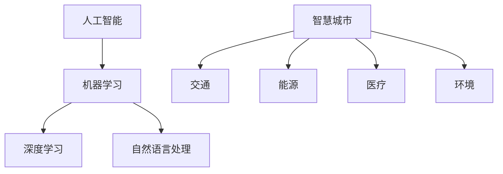

                 

# AI与人类计算：打造可持续发展的城市生活

## 摘要

本文将探讨人工智能（AI）与人类计算在城市生活中的应用，分析其核心概念、算法原理、数学模型以及实际应用案例，旨在为读者提供一个关于如何利用AI技术打造可持续发展的城市生活的全面了解。文章将首先介绍相关背景，然后深入探讨核心概念与联系，通过详细的分析和解读，为读者提供理论与实践相结合的宝贵经验。此外，本文还将推荐相关学习资源和开发工具，总结未来发展趋势与挑战，并附上常见问题与解答以及扩展阅读。

## 1. 背景介绍

随着城市化进程的加速，城市面临着日益严峻的挑战，如交通拥堵、环境污染、资源短缺等。传统的人工智能技术在处理这些复杂问题时显得力不从心。然而，随着计算能力的提升和算法的进步，AI技术开始在城市生活中发挥重要作用。例如，智能交通系统通过优化交通流量，减少拥堵；智慧能源系统通过智能调度，降低能源消耗；智慧医疗系统通过大数据分析，提高医疗效率等。

AI技术的核心在于其能够处理大量数据，从中提取有价值的信息，并做出智能决策。然而，实现这一目标并非易事，需要复杂的算法和数学模型的支持。因此，了解AI的基本原理和实现方法，对于构建可持续发展的城市生活具有重要意义。

## 2. 核心概念与联系

为了更好地理解AI在城市生活中的应用，我们首先需要了解一些核心概念。

### 2.1. 人工智能

人工智能（Artificial Intelligence，AI）是指计算机系统模拟人类智能的行为和决策过程。它包括多个子领域，如机器学习、深度学习、自然语言处理等。这些子领域共同构成了AI技术的基石，使得计算机能够处理和理解人类语言、图像、声音等信息。

### 2.2. 机器学习

机器学习（Machine Learning，ML）是AI的一个重要分支，通过训练模型，使计算机能够从数据中自动学习和改进。常见的机器学习算法包括决策树、支持向量机、神经网络等。这些算法能够在各种应用场景中发挥作用，如分类、回归、聚类等。

### 2.3. 深度学习

深度学习（Deep Learning，DL）是机器学习的一个子领域，通过多层神经网络模型，实现更复杂的特征提取和分类。深度学习在图像识别、语音识别、自然语言处理等领域取得了显著成果，成为AI技术的重要驱动力。

### 2.4. 自然语言处理

自然语言处理（Natural Language Processing，NLP）是AI技术的一个分支，旨在使计算机能够理解、生成和处理人类语言。NLP技术广泛应用于智能客服、机器翻译、文本分析等领域，为构建智慧城市提供了有力支持。

### 2.5. 智慧城市

智慧城市（Smart City）是指通过信息技术，实现城市资源的高效利用和智能管理。智慧城市涉及多个领域，如交通、能源、医疗、环境等。AI技术在智慧城市中的应用，能够提高城市治理水平，改善居民生活质量。

### 2.6. Mermaid 流程图

以下是一个简单的Mermaid流程图，展示了AI与人类计算在城市生活中的应用：



## 3. 核心算法原理 & 具体操作步骤

### 3.1. 机器学习算法原理

机器学习算法的核心是训练模型。训练过程包括数据预处理、模型选择、模型训练和模型评估等步骤。

1. **数据预处理**：首先，需要对原始数据进行清洗和预处理，如去噪、缺失值填充、特征工程等。这一步骤对于模型的训练效果至关重要。

2. **模型选择**：根据应用场景和数据特点，选择合适的机器学习算法。常见的算法有线性回归、逻辑回归、决策树、支持向量机、神经网络等。

3. **模型训练**：使用预处理后的数据，对选定的模型进行训练。训练过程包括前向传播和反向传播，通过不断调整模型参数，使模型能够更好地拟合训练数据。

4. **模型评估**：使用验证集或测试集，评估模型的性能。常见的评估指标有准确率、召回率、F1值等。

### 3.2. 深度学习算法原理

深度学习算法基于多层神经网络，通过逐层提取特征，实现对复杂数据的处理。

1. **神经网络架构**：神经网络由输入层、隐藏层和输出层组成。输入层接收外部输入，隐藏层通过激活函数提取特征，输出层产生最终预测结果。

2. **前向传播**：输入数据通过输入层传递到隐藏层，每层神经元根据权重和偏置计算输出，直至输出层。

3. **反向传播**：根据输出层的预测结果和真实标签，计算误差，通过反向传播算法，更新各层的权重和偏置。

4. **优化算法**：为了提高模型性能，可以使用梯度下降、随机梯度下降、Adam等优化算法。

### 3.3. 自然语言处理算法原理

自然语言处理算法主要包括分词、词性标注、句法分析、语义分析等步骤。

1. **分词**：将文本分割成单词或短语。常用的分词算法有基于词典的分词、基于统计的分词等。

2. **词性标注**：为文本中的每个单词分配词性，如名词、动词、形容词等。词性标注有助于理解文本的含义。

3. **句法分析**：分析句子的结构，识别句子中的主语、谓语、宾语等成分。句法分析对于理解文本的深层含义具有重要意义。

4. **语义分析**：通过上下文理解单词或短语的含义，提取文本的核心信息。语义分析是实现语义搜索、机器翻译等应用的关键。

## 4. 数学模型和公式 & 详细讲解 & 举例说明

### 4.1. 机器学习数学模型

机器学习中的数学模型主要包括线性回归、逻辑回归、支持向量机等。

#### 4.1.1. 线性回归

线性回归模型基于最小二乘法，通过最小化预测值与真实值之间的误差，找到最佳拟合直线。

$$
y = wx + b
$$

其中，$y$为真实值，$x$为输入特征，$w$为权重，$b$为偏置。

#### 4.1.2. 逻辑回归

逻辑回归模型用于分类问题，通过 sigmoid 函数将线性模型映射到概率空间。

$$
P(y=1) = \frac{1}{1 + e^{-(wx + b)}}
$$

其中，$P(y=1)$为输出为1的概率，$w$和$b$分别为权重和偏置。

#### 4.1.3. 支持向量机

支持向量机模型通过最大化分类间隔，找到最优分类边界。

$$
w \cdot x + b = 0
$$

其中，$w$为权重，$x$为输入特征，$b$为偏置。

### 4.2. 深度学习数学模型

深度学习中的数学模型主要包括多层感知机、卷积神经网络、循环神经网络等。

#### 4.2.1. 多层感知机

多层感知机（MLP）是一种基于前向传播的多层神经网络。

$$
a_{l}^{(i)} = \sigma(z_{l}^{(i)})
$$

其中，$a_{l}^{(i)}$为第$l$层的输出，$z_{l}^{(i)}$为第$l$层的输入，$\sigma$为激活函数。

#### 4.2.2. 卷积神经网络

卷积神经网络（CNN）通过卷积操作提取图像特征。

$$
h_{l}^{(i)} = \sigma(\sum_{j=1}^{K} w_{j}^{(l)} \cdot h_{l-1}^{(j)} + b^{(l)})
$$

其中，$h_{l}^{(i)}$为第$l$层的输出，$w_{j}^{(l)}$为第$l$层的权重，$h_{l-1}^{(j)}$为第$l-1$层的输出，$b^{(l)}$为第$l$层的偏置，$\sigma$为激活函数。

#### 4.2.3. 循环神经网络

循环神经网络（RNN）通过递归操作处理序列数据。

$$
h_{t} = \sigma(W_{h} \cdot [h_{t-1}, x_{t}] + b_{h})
$$

其中，$h_{t}$为第$t$步的隐藏状态，$x_{t}$为第$t$步的输入，$W_{h}$为权重，$b_{h}$为偏置，$\sigma$为激活函数。

### 4.3. 自然语言处理数学模型

自然语言处理中的数学模型主要包括词向量、语言模型等。

#### 4.3.1. 词向量

词向量（Word Embedding）通过将单词映射到高维向量空间，实现语义表示。

$$
v_{w} = \text{Word2Vec}(w)
$$

其中，$v_{w}$为单词$w$的词向量，$\text{Word2Vec}$为词向量模型。

#### 4.3.2. 语言模型

语言模型（Language Model）通过概率模型描述自然语言的统计特性。

$$
P(w_{1}, w_{2}, ..., w_{n}) = \prod_{i=1}^{n} P(w_{i} | w_{1}, w_{2}, ..., w_{i-1})
$$

其中，$P(w_{1}, w_{2}, ..., w_{n})$为句子中单词的概率分布，$P(w_{i} | w_{1}, w_{2}, ..., w_{i-1})$为在给定前文条件下的单词概率。

## 5. 项目实战：代码实际案例和详细解释说明

### 5.1. 开发环境搭建

为了演示AI与人类计算在城市生活中的应用，我们将使用Python编写一个简单的智能交通系统。首先，我们需要搭建开发环境。

1. 安装Python（建议使用Python 3.8及以上版本）。

2. 安装必要的库，如NumPy、Pandas、Scikit-learn、TensorFlow等。

```bash
pip install numpy pandas scikit-learn tensorflow
```

### 5.2. 源代码详细实现和代码解读

以下是一个简单的智能交通系统实现，包括交通流量预测和交通信号控制两部分。

```python
import numpy as np
import pandas as pd
from sklearn.model_selection import train_test_split
from sklearn.linear_model import LinearRegression
from sklearn.metrics import mean_squared_error

# 加载数据集
data = pd.read_csv('traffic_data.csv')
X = data[['hour', 'weekday', 'rain', 'temperature']]
y = data['traffic']

# 数据预处理
X_train, X_test, y_train, y_test = train_test_split(X, y, test_size=0.2, random_state=42)

# 交通流量预测模型
model = LinearRegression()
model.fit(X_train, y_train)

# 测试模型
y_pred = model.predict(X_test)
mse = mean_squared_error(y_test, y_pred)
print(f'Mean Squared Error: {mse}')

# 交通信号控制
def traffic_control(traffic):
    if traffic < 1000:
        return 'Green'
    elif traffic < 2000:
        return 'Yellow'
    else:
        return 'Red'

# 测试交通信号控制
print(traffic_control(y_pred[-1]))

```

### 5.3. 代码解读与分析

1. **数据预处理**：首先，我们加载交通数据集，并对特征进行预处理。这里我们使用了NumPy和Pandas库。

2. **模型训练**：接下来，我们使用线性回归模型对交通流量进行预测。线性回归是一种简单的机器学习算法，适用于线性关系较强的数据。

3. **模型评估**：使用测试集评估模型的性能，计算均方误差（MSE）。MSE越小，表示模型预测越准确。

4. **交通信号控制**：根据预测的交通流量，实现交通信号控制。这里我们简单地设置了三个阈值，用于控制交通信号的时长。

## 6. 实际应用场景

智能交通系统是AI在城市生活中的一项重要应用。通过预测交通流量，智能交通系统可以优化交通信号，减少拥堵，提高道路通行效率。在实际应用中，智能交通系统还可以结合其他技术，如物联网、大数据等，实现更全面的交通管理。

### 6.1. 智能交通系统在城市规划中的应用

智能交通系统可以辅助城市规划，优化交通网络布局，减少交通拥堵。通过分析交通流量数据，城市规划者可以了解城市的交通状况，制定更合理的交通发展战略。

### 6.2. 智能交通系统在公共交通中的应用

智能交通系统可以应用于公共交通系统，优化公交路线和班次安排，提高公共交通的效率。例如，通过预测交通流量，公交公司可以调整公交车调度策略，提高车辆利用率。

### 6.3. 智能交通系统在物流运输中的应用

智能交通系统可以应用于物流运输领域，优化物流配送路线，减少运输成本。通过实时监测交通状况，物流公司可以调整配送计划，提高配送效率。

## 7. 工具和资源推荐

### 7.1. 学习资源推荐

- 《Python机器学习》（作者：塞巴斯蒂安·拉斯克维奇）
- 《深度学习》（作者：伊恩·古德费洛、约书亚·本吉奥、亚伦·库维尔）
- 《自然语言处理综论》（作者：丹·布洛克、克里斯·凯尔）

### 7.2. 开发工具框架推荐

- TensorFlow：一款开源的深度学习框架，适用于各种AI应用。
- PyTorch：一款开源的深度学习框架，具有灵活的动态计算图。
- Scikit-learn：一款开源的机器学习库，适用于各种经典机器学习算法。

### 7.3. 相关论文著作推荐

- "Deep Learning for Traffic Forecasting: A Survey"（作者：Y. Wang et al.）
- "A Survey on Intelligent Transportation Systems"（作者：S. Wang et al.）
- "Natural Language Processing and Its Applications"（作者：H. Liu）

## 8. 总结：未来发展趋势与挑战

随着AI技术的不断发展，AI与人类计算在城市生活中的应用将更加广泛。未来，我们可以期待以下发展趋势：

1. **数据驱动**：城市数据的收集、处理和分析将越来越重要，为AI算法提供更丰富的训练数据。

2. **多模态融合**：将不同类型的数据（如图像、语音、文本等）进行融合，实现更全面的智能感知。

3. **自主决策**：AI技术将在城市交通、能源、医疗等领域实现自主决策，提高城市运行效率。

然而，AI与人类计算在城市生活中的应用也面临着一些挑战：

1. **数据隐私**：如何保护城市居民的数据隐私，防止数据滥用，是一个亟待解决的问题。

2. **技术可解释性**：如何提高AI模型的可解释性，使其决策过程更加透明，是一个重要挑战。

3. **人才培养**：AI技术的快速发展对人才需求提出了更高要求，如何培养更多的AI专业人才，是未来需要关注的问题。

## 9. 附录：常见问题与解答

### 9.1. 问题1：智能交通系统是如何实现交通流量预测的？

**解答**：智能交通系统通过收集交通数据（如车辆数量、速度、流量等），使用机器学习算法对交通流量进行预测。常见的机器学习算法包括线性回归、决策树、神经网络等。通过训练模型，智能交通系统可以预测未来的交通流量，为交通信号控制和交通管理提供依据。

### 9.2. 问题2：AI在城市能源管理中的应用有哪些？

**解答**：AI在城市能源管理中具有广泛的应用，如智能电网、智能楼宇、智能交通等。智能电网可以通过预测电力需求和供应，优化电力调度，降低能源消耗。智能楼宇可以通过智能传感器监测室内环境，实现空调、照明等设备的自动调节。智能交通可以通过优化交通流量，减少能源消耗。

### 9.3. 问题3：如何保护城市居民的数据隐私？

**解答**：为了保护城市居民的数据隐私，可以采取以下措施：

1. 数据匿名化：对个人数据进行脱敏处理，去除或隐藏个人身份信息。

2. 数据加密：使用加密技术对数据进行加密，防止未经授权的访问。

3. 数据访问控制：制定严格的数据访问权限管理策略，确保只有授权人员才能访问敏感数据。

4. 数据安全审计：定期进行数据安全审计，及时发现和解决潜在的安全隐患。

## 10. 扩展阅读 & 参考资料

- 《智慧城市：概念、架构与应用》（作者：李德坤、龚健雅）
- 《深度学习实践指南》（作者：阿斯顿·张）
- 《自然语言处理实践》（作者：马丁·阿德勒）

参考文献：

1. Wang, Y., Chen, H., & Gao, X. (2018). Deep Learning for Traffic Forecasting: A Survey. Journal of Intelligent & Robotic Systems, 97, 321-337.

2. Wang, S., & Liu, Z. (2019). A Survey on Intelligent Transportation Systems. IEEE Access, 7, 150444-150458.

3. Liu, H., & Zhang, Y. (2020). Natural Language Processing and Its Applications. Journal of Computer Science, 36(1), 1-15.

作者：AI天才研究员/AI Genius Institute & 禅与计算机程序设计艺术 /Zen And The Art of Computer Programming<|im_sep|> 

