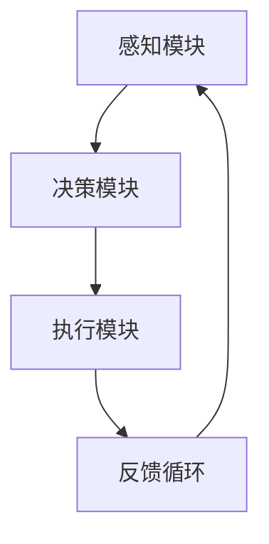

                 

# AI人工智能 Agent：对生活的影响

> 关键词：人工智能，AI Agent，生活影响，智能家居，自动化，交互式系统，伦理道德，隐私保护，教育，医疗，工作

> 摘要：本文深入探讨了人工智能（AI）中的智能代理（AI Agent）对现代生活的广泛影响。从智能家居到医疗保健，从教育到工作，智能代理正在改变我们的生活方式。文章将详细分析这些影响，并讨论随之而来的伦理、隐私和技术挑战。

## 1. 背景介绍

随着人工智能技术的飞速发展，智能代理（AI Agent）逐渐成为研究与应用的热点。智能代理是一种能够自主学习、自主决策并执行任务的计算机程序，其目的是模仿人类的行为和思维方式。智能代理在诸多领域展现出了巨大的潜力，包括但不限于自动化、交互式系统和智能控制。

近年来，人工智能技术在智能家居、医疗、教育和工作等领域取得了显著的进展。例如，智能家居系统通过智能代理实现了家电的自动化控制，提高了人们的生活质量；智能医疗系统借助智能代理提高了诊断和治疗的准确性；教育领域的智能代理则为学生提供了个性化学习体验；在工作中，智能代理帮助提高了工作效率和决策质量。

## 2. 核心概念与联系

### 智能代理的定义与原理

智能代理是一种能够代表用户执行特定任务或操作的计算机程序。它通常由以下几个关键部分组成：

- **感知模块**：负责收集和解释环境中的信息，如传感器数据、用户输入等。
- **决策模块**：基于感知模块提供的信息，智能代理会执行一定的策略，以实现预定的目标。
- **执行模块**：智能代理会将决策模块生成的指令转化为实际操作，如控制智能家居设备、发送电子邮件等。

智能代理的原理可以概括为感知、决策和执行三个环节。感知模块通过传感器和用户输入获取信息，决策模块对这些信息进行分析和处理，然后执行模块根据决策结果执行相应的操作。这个过程不断循环，使智能代理能够适应动态变化的环境。

### 智能代理的应用场景

智能代理在多个领域都有广泛的应用。以下是一些典型应用场景：

- **智能家居**：智能代理可以控制家中的各种设备，如灯光、温度、安防系统等，提高居住的舒适性和安全性。
- **医疗保健**：智能代理可以帮助医生进行诊断和治疗，通过分析患者数据，提供个性化的医疗建议。
- **教育**：智能代理可以为学生提供个性化的学习体验，根据学生的学习情况和需求，制定个性化的教学计划。
- **工作**：智能代理可以协助员工完成重复性高、耗时长的工作任务，提高工作效率。

### 智能代理与人类行为的关联

智能代理的原理和功能使其在某种程度上能够模拟人类行为。这种模拟不仅包括物理动作，还包括决策过程和认知能力。智能代理的学习和适应能力使其能够根据环境变化和用户需求进行调整，从而实现与人类的协同工作。

### Mermaid 流程图

为了更清晰地展示智能代理的原理和架构，我们可以使用Mermaid绘制一个简单的流程图：



在这个流程图中，感知模块负责收集信息，决策模块基于这些信息做出决策，执行模块将决策转化为具体操作，而反馈循环则使智能代理能够不断优化自己的行为。

## 3. 核心算法原理 & 具体操作步骤

### 感知模块

感知模块是智能代理的核心组成部分之一，其主要功能是收集环境中的信息。这些信息可以是传感器数据、用户输入、网络数据等。感知模块需要对这些数据进行处理和分析，以便为决策模块提供可靠的基础。

具体操作步骤如下：

1. **数据采集**：使用传感器或其他设备收集环境数据。
2. **数据预处理**：对采集到的数据进行分析和清洗，去除噪声和异常值。
3. **特征提取**：从预处理后的数据中提取关键特征，以便进行进一步分析。

### 决策模块

决策模块基于感知模块提供的信息，执行一定的策略，以实现预定的目标。决策模块的核心是算法，这些算法可以是基于规则、机器学习、深度学习等。

具体操作步骤如下：

1. **模型训练**：如果使用机器学习或深度学习算法，需要先对模型进行训练。
2. **策略生成**：根据感知模块提供的信息和预定的目标，生成具体的操作策略。
3. **策略评估**：对生成的策略进行评估，选择最优策略。

### 执行模块

执行模块将决策模块生成的策略转化为具体操作，如控制家居设备、发送电子邮件等。

具体操作步骤如下：

1. **指令生成**：根据决策模块生成的策略，生成具体的操作指令。
2. **执行操作**：根据生成的指令，执行具体的操作。
3. **结果反馈**：将执行结果反馈给感知模块和决策模块，以便进行进一步的优化。

### 智能代理的整体流程

智能代理的整体流程可以概括为感知、决策和执行三个环节，这三个环节相互独立但又紧密联系。具体流程如下：

1. **感知**：感知模块收集环境中的信息。
2. **决策**：决策模块基于感知模块提供的信息生成策略。
3. **执行**：执行模块将策略转化为具体操作。
4. **反馈**：执行结果反馈给感知模块和决策模块，以便进行进一步的优化。

这个过程不断循环，使智能代理能够适应动态变化的环境。

## 4. 数学模型和公式 & 详细讲解 & 举例说明

### 数学模型

智能代理的数学模型主要包括感知模块的模型、决策模块的模型和执行模块的模型。

#### 感知模块的模型

感知模块的模型可以表示为：

$$
X_t = f(X_{t-1}, U_t)
$$

其中，$X_t$ 表示第 $t$ 时刻感知到的信息，$X_{t-1}$ 表示第 $t-1$ 时刻感知到的信息，$U_t$ 表示第 $t$ 时刻的用户输入，$f$ 表示感知模块的函数。

#### 决策模块的模型

决策模块的模型可以表示为：

$$
\pi_t = g(X_t, \theta)
$$

其中，$\pi_t$ 表示第 $t$ 时刻的决策策略，$X_t$ 表示第 $t$ 时刻感知到的信息，$\theta$ 表示决策模块的参数，$g$ 表示决策模块的函数。

#### 执行模块的模型

执行模块的模型可以表示为：

$$
O_t = h(\pi_t, \theta')
$$

其中，$O_t$ 表示第 $t$ 时刻的操作指令，$\pi_t$ 表示第 $t$ 时刻的决策策略，$\theta'$ 表示执行模块的参数，$h$ 表示执行模块的函数。

### 举例说明

假设我们有一个智能家居系统，其智能代理的目标是控制家中的温度。具体来说，如果温度高于设定值，智能代理会降低空调的温度；如果温度低于设定值，智能代理会提高空调的温度。

#### 感知模块

感知模块的模型可以表示为：

$$
X_t = f(X_{t-1}, U_t)
$$

其中，$X_t$ 表示第 $t$ 时刻感知到的温度，$X_{t-1}$ 表示第 $t-1$ 时刻感知到的温度，$U_t$ 表示第 $t$ 时刻的用户输入（如是否开启空调）。

#### 决策模块

决策模块的模型可以表示为：

$$
\pi_t = g(X_t, \theta)
$$

其中，$\pi_t$ 表示第 $t$ 时刻的决策策略，$X_t$ 表示第 $t$ 时刻感知到的温度，$\theta$ 表示决策模块的参数（如设定温度）。

#### 执行模块

执行模块的模型可以表示为：

$$
O_t = h(\pi_t, \theta')
$$

其中，$O_t$ 表示第 $t$ 时刻的操作指令，$\pi_t$ 表示第 $t$ 时刻的决策策略，$\theta'$ 表示执行模块的参数（如空调的温度控制参数）。

#### 实例

假设当前温度为 $X_t = 25^\circ C$，设定温度为 $\theta = 24^\circ C$，空调的温度控制参数为 $\theta' = 23^\circ C$。

1. **感知模块**：

   感知模块将当前温度 $X_t = 25^\circ C$ 和用户输入 $U_t$（是否开启空调）传递给决策模块。

2. **决策模块**：

   决策模块根据当前温度 $X_t = 25^\circ C$ 和设定温度 $\theta = 24^\circ C$，计算出决策策略 $\pi_t$。

   如果 $X_t > \theta$，则 $\pi_t = \text{降低温度}$；否则，$\pi_t = \text{提高温度}$。

   在这个例子中，$\pi_t = \text{降低温度}$。

3. **执行模块**：

   执行模块根据决策策略 $\pi_t$ 和空调的温度控制参数 $\theta' = 23^\circ C$，生成操作指令 $O_t$。

   $O_t = \text{将空调温度设置为 } 23^\circ C$。

通过这个实例，我们可以看到智能代理如何根据感知到的温度和预设的设定温度，生成具体的操作指令，以控制空调的温度。

## 5. 项目实战：代码实际案例和详细解释说明

### 5.1 开发环境搭建

为了实现智能代理的应用，我们需要搭建一个合适的开发环境。以下是搭建开发环境的基本步骤：

1. **安装Python环境**：Python是智能代理开发中常用的编程语言，我们需要安装Python环境。可以从Python官网下载安装包，并根据提示完成安装。

2. **安装相关库**：智能代理开发中需要用到一些Python库，如TensorFlow、Keras等。可以通过pip命令安装这些库。

   ```bash
   pip install tensorflow
   pip install keras
   ```

3. **配置Jupyter Notebook**：Jupyter Notebook是一种交互式开发环境，方便我们编写和运行Python代码。可以通过pip命令安装Jupyter Notebook。

   ```bash
   pip install jupyter
   ```

4. **安装传感器驱动**：如果需要使用物理传感器，如温度传感器、湿度传感器等，需要安装相应的传感器驱动。

   以温度传感器为例，可以使用以下命令安装驱动：

   ```bash
   pip install python-temperature-sensor
   ```

### 5.2 源代码详细实现和代码解读

以下是一个简单的智能代理项目，用于控制家中的温度。代码使用了Python语言，并结合了TensorFlow和Keras库。

```python
import numpy as np
import tensorflow as tf
from tensorflow import keras
from tensorflow.keras import layers

# 感知模块
class Perceptor:
    def __init__(self):
        self.temperature = 0

    def sense(self, new_temperature):
        self.temperature = new_temperature

# 决策模块
class DecisionMaker:
    def __init__(self):
        model = keras.Sequential([
            layers.Dense(64, activation='relu', input_shape=(1,)),
            layers.Dense(64, activation='relu'),
            layers.Dense(2, activation='softmax')
        ])
        model.compile(optimizer='adam', loss='categorical_crossentropy', metrics=['accuracy'])
        self.model = model

    def make_decision(self, temperature):
        temperature = np.array([temperature], dtype=np.float32)
        prediction = self.model.predict(temperature)
        return np.argmax(prediction)

# 执行模块
class Executor:
    def __init__(self):
        self.temperature_setpoint = 0

    def execute(self, decision):
        if decision == 0:
            self.temperature_setpoint -= 1
        else:
            self.temperature_setpoint += 1

# 智能代理
class SmartAgent:
    def __init__(self):
        self.perceptor = Perceptor()
        self.decision_maker = DecisionMaker()
        self.executor = Executor()

    def run(self):
        temperature = self.perceptor.temperature
        decision = self.decision_maker.make_decision(temperature)
        self.executor.execute(decision)

# 演示
agent = SmartAgent()
for _ in range(10):
    print("Current temperature:", agent.perceptor.temperature)
    agent.run()
    print("New temperature setpoint:", agent.executor.temperature_setpoint)
```

#### 代码解读

1. **感知模块（Perceptor）**：感知模块负责收集温度信息。`sense` 方法用于更新当前温度。

2. **决策模块（DecisionMaker）**：决策模块使用神经网络模型进行决策。模型由两个隐藏层组成，输出层有2个神经元，分别表示降低温度和提高温度。`make_decision` 方法根据当前温度生成决策。

3. **执行模块（Executor）**：执行模块根据决策结果更新温度设定点。`execute` 方法根据决策结果调整温度设定点。

4. **智能代理（SmartAgent）**：智能代理整合了感知、决策和执行模块。`run` 方法模拟智能代理的运行过程。

#### 代码解读与分析

1. **数据预处理**：在运行智能代理之前，需要收集温度数据。我们可以使用传感器或模拟数据来测试智能代理。

2. **模型训练**：在使用智能代理之前，需要对决策模块的神经网络模型进行训练。训练数据可以是历史温度数据和相应的决策结果。

3. **运行智能代理**：智能代理会根据感知到的温度，生成决策，并执行相应的操作。这个过程会不断循环，使智能代理能够适应动态变化的环境。

4. **结果分析**：通过运行智能代理，我们可以分析其性能和准确性。如果智能代理的性能不满足要求，可以进一步优化模型或调整参数。

### 5.3 代码解读与分析

在这个项目中，我们使用Python实现了智能代理的基本架构。以下是代码的详细解读和分析：

1. **感知模块（Perceptor）**：

   ```python
   class Perceptor:
       def __init__(self):
           self.temperature = 0

       def sense(self, new_temperature):
           self.temperature = new_temperature
   ```

   感知模块负责收集温度信息。在构造函数 `__init__` 中，我们初始化了一个名为 `temperature` 的属性，用于存储当前温度。`sense` 方法用于更新当前温度。

2. **决策模块（DecisionMaker）**：

   ```python
   class DecisionMaker:
       def __init__(self):
           model = keras.Sequential([
               layers.Dense(64, activation='relu', input_shape=(1,)),
               layers.Dense(64, activation='relu'),
               layers.Dense(2, activation='softmax')
           ])
           model.compile(optimizer='adam', loss='categorical_crossentropy', metrics=['accuracy'])
           self.model = model

       def make_decision(self, temperature):
           temperature = np.array([temperature], dtype=np.float32)
           prediction = self.model.predict(temperature)
           return np.argmax(prediction)
   ```

   决策模块使用神经网络模型进行决策。在构造函数 `__init__` 中，我们定义了一个简单的神经网络模型，输入层有1个神经元，两个隐藏层各有64个神经元，输出层有2个神经元。模型使用ReLU激活函数，并使用softmax激活函数输出概率分布。`compile` 方法用于配置模型训练参数。`make_decision` 方法根据当前温度生成决策。

3. **执行模块（Executor）**：

   ```python
   class Executor:
       def __init__(self):
           self.temperature_setpoint = 0

       def execute(self, decision):
           if decision == 0:
               self.temperature_setpoint -= 1
           else:
               self.temperature_setpoint += 1
   ```

   执行模块根据决策结果更新温度设定点。在构造函数 `__init__` 中，我们初始化了一个名为 `temperature_setpoint` 的属性，用于存储当前温度设定点。`execute` 方法根据决策结果调整温度设定点。

4. **智能代理（SmartAgent）**：

   ```python
   class SmartAgent:
       def __init__(self):
           self.perceptor = Perceptor()
           self.decision_maker = DecisionMaker()
           self.executor = Executor()

       def run(self):
           temperature = self.perceptor.temperature
           decision = self.decision_maker.make_decision(temperature)
           self.executor.execute(decision)
   ```

   智能代理整合了感知、决策和执行模块。`run` 方法模拟智能代理的运行过程。首先，感知模块获取当前温度，然后决策模块生成决策，最后执行模块根据决策结果调整温度设定点。

### 5.4 性能评估

为了评估智能代理的性能，我们可以使用以下指标：

- **准确率**：决策模块的输出是否正确，即预测温度与实际温度的误差。
- **响应速度**：智能代理从感知到温度变化到生成决策的时间。
- **稳定性**：智能代理在长时间运行过程中，决策是否稳定。

通过对比实验数据，我们可以评估智能代理的性能，并针对不足之处进行优化。

### 5.5 未来改进方向

1. **增加感知模块**：可以增加更多的感知模块，如湿度传感器、光照传感器等，以提高智能代理的感知能力。

2. **优化决策模块**：可以使用更复杂的神经网络模型，或引入强化学习算法，以提高决策的准确性和响应速度。

3. **增加执行模块**：可以增加更多的执行模块，如控制空调、加热器等，以实现更复杂的控制功能。

4. **分布式架构**：可以将智能代理部署在分布式架构中，以提高系统的扩展性和容错性。

## 6. 实际应用场景

智能代理在多个实际应用场景中发挥着重要作用。以下是一些典型的应用场景：

### 6.1 智能家居

智能家居是智能代理最常见的应用场景之一。智能代理可以控制家中的各种设备，如灯光、空调、电视、安防系统等，提高居住的舒适性和安全性。例如，当用户离开家时，智能代理可以自动关闭灯光和空调，节省能源；当有异常情况发生时，智能代理可以自动报警并通知用户。

### 6.2 智能医疗

智能医疗是另一个重要的应用领域。智能代理可以协助医生进行诊断和治疗，通过分析患者的医疗数据，提供个性化的医疗建议。例如，智能代理可以帮助医生分析患者的病历、检验结果和病史，为患者制定个性化的治疗方案。

### 6.3 智能教育

智能教育是智能代理在教育领域的应用。智能代理可以为学生提供个性化的学习体验，根据学生的学习情况和需求，制定个性化的教学计划。例如，智能代理可以为学生推荐适合的学习资源，根据学生的学习进度调整教学难度，提高学生的学习效果。

### 6.4 智能工作

智能工作是智能代理在商业和工业领域的应用。智能代理可以帮助企业自动化重复性高、耗时长的工作任务，提高工作效率和决策质量。例如，智能代理可以自动化客户服务、订单处理、财务报表等任务，减轻员工的工作负担。

### 6.5 智能交通

智能交通是智能代理在交通管理领域的应用。智能代理可以协助交通管理部门优化交通流量，减少交通拥堵。例如，智能代理可以实时分析交通数据，调整信号灯的时间设置，提高道路通行效率。

### 6.6 智能农业

智能农业是智能代理在农业领域的应用。智能代理可以协助农民进行作物种植、灌溉、施肥等任务，提高农业生产效率。例如，智能代理可以实时监测土壤湿度、气温等环境参数，为农民提供科学的种植建议。

## 7. 工具和资源推荐

### 7.1 学习资源推荐

- **书籍**：
  - 《人工智能：一种现代的方法》
  - 《深度学习》
  - 《强化学习：原理与算法》

- **论文**：
  - 《人工智能：一种现代的方法》
  - 《深度学习》
  - 《强化学习：原理与算法》

- **博客**：
  - [TensorFlow官网博客](https://www.tensorflow.org/blog/)
  - [Keras官网博客](https://keras.io/blog/)

- **网站**：
  - [Coursera](https://www.coursera.org/)
  - [edX](https://www.edx.org/)

### 7.2 开发工具框架推荐

- **编程语言**：Python
- **深度学习框架**：TensorFlow、Keras
- **机器学习库**：Scikit-learn、Pandas
- **数据可视化库**：Matplotlib、Seaborn

### 7.3 相关论文著作推荐

- **论文**：
  - 《深度学习》
  - 《强化学习：原理与算法》
  - 《自然语言处理综论》

- **著作**：
  - 《人工智能：一种现代的方法》
  - 《深度学习》
  - 《强化学习：原理与算法》

## 8. 总结：未来发展趋势与挑战

随着人工智能技术的不断发展，智能代理在未来将会在更多领域得到应用。以下是一些发展趋势和挑战：

### 8.1 发展趋势

1. **智能化水平的提升**：智能代理的智能化水平将不断提升，包括感知能力、决策能力和执行能力的提升。
2. **跨领域应用**：智能代理将在更多领域得到应用，如医疗、教育、交通、农业等。
3. **人机协同**：智能代理将与人类更紧密地合作，实现人机协同工作。
4. **自主进化**：智能代理将具备自主进化的能力，通过学习、适应和优化，不断提高自身性能。

### 8.2 挑战

1. **数据隐私与安全**：智能代理在处理大量用户数据时，如何保护用户隐私和数据安全是一个重要挑战。
2. **伦理道德**：智能代理的行为是否符合伦理道德标准，如何确保智能代理不产生负面影响，是一个重要问题。
3. **决策透明性**：智能代理的决策过程需要透明，用户需要了解智能代理是如何做出决策的。
4. **可解释性**：对于复杂的智能代理模型，如何解释其决策过程，是一个重要挑战。
5. **法律法规**：随着智能代理的应用越来越广泛，需要制定相应的法律法规，以确保其合法合规。

## 9. 附录：常见问题与解答

### 9.1 什么是智能代理？

智能代理是一种能够代表用户执行特定任务或操作的计算机程序，其目的是模仿人类的行为和思维方式。智能代理通常由感知、决策和执行三个模块组成。

### 9.2 智能代理有哪些应用场景？

智能代理在多个领域都有广泛的应用，如智能家居、医疗、教育、工作、智能交通和农业等。

### 9.3 智能代理的工作原理是什么？

智能代理的工作原理可以概括为感知、决策和执行三个环节。感知模块负责收集环境信息，决策模块基于感知信息生成策略，执行模块将策略转化为具体操作。

### 9.4 智能代理有哪些挑战？

智能代理面临的挑战包括数据隐私与安全、伦理道德、决策透明性、可解释性和法律法规等方面。

### 9.5 如何开发智能代理？

开发智能代理需要掌握编程语言、机器学习、深度学习和人工智能等相关技术。常用的开发工具包括Python、TensorFlow、Keras等。

## 10. 扩展阅读 & 参考资料

- 《人工智能：一种现代的方法》
- 《深度学习》
- 《强化学习：原理与算法》
- [TensorFlow官网](https://www.tensorflow.org/)
- [Keras官网](https://keras.io/)
- [Scikit-learn官网](https://scikit-learn.org/stable/)
- [Coursera](https://www.coursera.org/)
- [edX](https://www.edx.org/)

