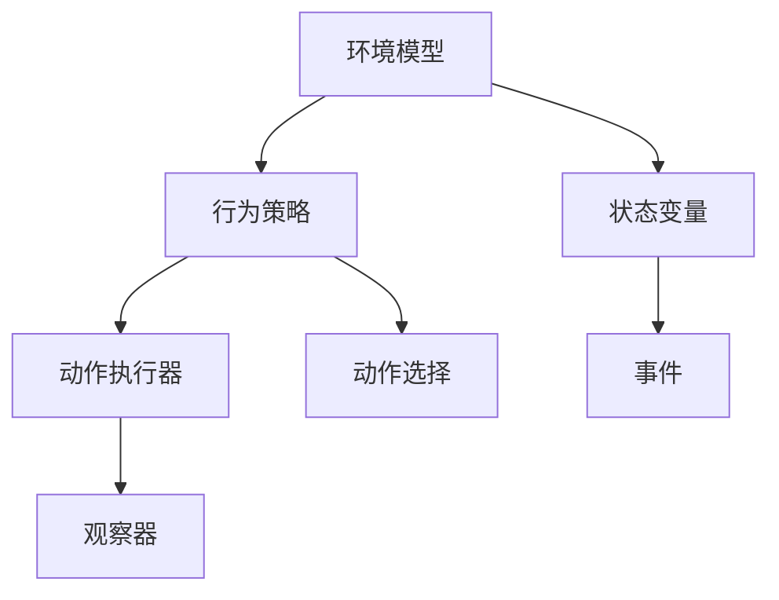
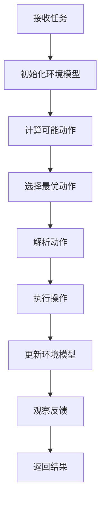

                 

# AI人工智能代理工作流 AI Agent WorkFlow：动作的选择与执行

> 关键词：AI代理，工作流，动作选择，执行，逻辑推理

> 摘要：本文将深入探讨AI代理的工作流，包括动作的选择与执行。通过分析AI代理的核心概念与架构，我们将逐步解析核心算法原理与操作步骤，并借助数学模型与实际案例进行详细解释。此外，还将探讨AI代理的实际应用场景，推荐相关学习资源和开发工具，最后总结未来发展趋势与挑战。

## 1. 背景介绍

人工智能（AI）正以前所未有的速度发展，越来越多的应用场景需要智能代理来完成复杂的任务。AI代理，或称为智能代理，是一种能够模拟人类智能行为的计算机程序，它能够在没有人类干预的情况下自主执行任务。

随着AI技术的发展，AI代理的应用场景日益广泛，如智能家居、自动驾驶、智能客服等。然而，AI代理的工作流设计至关重要，它直接关系到代理的效率和效果。本文将重点讨论AI代理工作流中的动作选择与执行，以期为开发者提供有价值的参考。

## 2. 核心概念与联系

### 2.1 AI代理的定义

AI代理是一种基于人工智能技术的计算机程序，它能够模拟人类智能行为，以解决复杂问题或执行特定任务。AI代理通常具备以下特点：

- 自主性：AI代理可以在没有人类干预的情况下自主执行任务。
- 反应性：AI代理能够实时响应环境变化，并根据环境反馈调整自身行为。
- 社交性：AI代理能够与人类或其他AI代理进行有效沟通和协作。
- 学习性：AI代理能够通过学习不断改进自身性能。

### 2.2 AI代理的架构

AI代理的架构通常包括以下几个关键组成部分：

- 环境模型：环境模型描述了AI代理所处的环境，包括各种状态变量和事件。
- 行为策略：行为策略定义了AI代理如何根据环境模型选择合适的动作。
- 动作执行器：动作执行器负责执行AI代理选定的动作。
- 观察器：观察器用于收集环境中的各种信息，以更新环境模型。

### 2.3 Mermaid流程图

以下是一个简单的Mermaid流程图，展示了AI代理的核心概念与联系：



## 3. 核心算法原理 & 具体操作步骤

### 3.1 动作选择算法

动作选择是AI代理工作流中的关键环节，其核心在于如何根据环境模型选择最优动作。常见的动作选择算法包括：

- 最优动作选择：根据环境模型计算出所有可能动作的效用值，选择效用值最大的动作。
- 随机动作选择：从所有可能动作中随机选择一个动作。
- 强化学习动作选择：通过强化学习算法不断调整动作选择策略，以最大化长期效用。

### 3.2 动作执行步骤

动作执行是指AI代理根据选定的动作对环境进行操作的过程。具体操作步骤如下：

1. 解析动作：将选定的动作转换为具体操作指令。
2. 执行操作：执行操作指令，对环境进行相应操作。
3. 更新环境模型：根据执行结果更新环境模型，以反映环境变化。
4. 观察反馈：收集环境反馈信息，用于后续动作选择。

### 3.3 动作选择与执行的流程图

以下是一个简单的Mermaid流程图，展示了动作选择与执行的流程：



## 4. 数学模型和公式 & 详细讲解 & 举例说明

### 4.1 动作选择公式

假设环境模型中有n个状态，每个状态有m个可能动作，动作选择公式如下：

$$
a^* = \arg\max_{a} U(s, a)
$$

其中，$a^*$表示最优动作，$U(s, a)$表示在状态s下动作a的效用值。

### 4.2 强化学习模型

强化学习动作选择模型如下：

$$
Q(s, a) = r + \gamma \max_{a'} Q(s', a')
$$

其中，$Q(s, a)$表示在状态s下执行动作a的期望回报，$r$表示即时回报，$\gamma$表示折扣因子，$s'$表示下一个状态，$a'$表示下一个动作。

### 4.3 举例说明

假设一个简单的环境模型，状态s有3个可能动作a1、a2、a3，每个动作的效用值如下：

| 动作 | 效用值 |
| ---- | ---- |
| a1   | 2    |
| a2   | 3    |
| a3   | 1    |

根据动作选择公式，最优动作是a2。

## 5. 项目实战：代码实际案例和详细解释说明

### 5.1 开发环境搭建

在本文中，我们将使用Python作为开发语言，利用Python的强化学习库TensorFlow来实现一个简单的AI代理。

#### 环境安装

```bash
pip install tensorflow
```

### 5.2 源代码详细实现和代码解读

#### 代码实现

```python
import tensorflow as tf
import numpy as np

# 初始化环境模型
n_actions = 3
n_states = 3
action_space = np.array([['a1', 'a2', 'a3'] for _ in range(n_states)])

# 初始化神经网络
model = tf.keras.Sequential([
    tf.keras.layers.Dense(64, activation='relu', input_shape=(n_states,)),
    tf.keras.layers.Dense(n_actions, activation='softmax')
])

# 编译模型
model.compile(optimizer='adam', loss='categorical_crossentropy', metrics=['accuracy'])

# 训练模型
model.fit(np.eye(n_states), np.eye(n_actions), epochs=1000)

# 动作选择
state = np.random.randint(0, n_states)
action_probs = model.predict(state.reshape(1, -1))
action = np.random.choice(n_actions, p=action_probs.ravel())

# 执行动作
print(f"执行动作：{action_space[state][action]}")

# 更新环境模型
# ...（此处省略环境模型更新代码）

# 观察反馈
# ...（此处省略观察反馈代码）
```

#### 代码解读

1. 初始化环境模型：定义状态和动作的数量，以及动作空间。
2. 初始化神经网络：构建一个简单的全连接神经网络，用于预测动作概率。
3. 编译模型：设置优化器、损失函数和评估指标。
4. 训练模型：使用环境数据训练神经网络。
5. 动作选择：根据环境状态选择动作。
6. 执行动作：根据选定的动作执行具体操作。
7. 更新环境模型：根据执行结果更新环境模型。
8. 观察反馈：根据环境反馈调整神经网络参数。

### 5.3 代码解读与分析

这段代码实现了一个简单的AI代理，它使用神经网络来选择动作。通过训练，神经网络可以学会在不同状态下选择最优动作。代码的核心在于动作选择和执行部分，它们决定了AI代理的行为。

## 6. 实际应用场景

AI代理在实际应用中具有广泛的应用场景，以下是一些典型的应用实例：

- **智能家居**：AI代理可以监控家居设备，自动调节温度、灯光和安防系统，提高居住舒适度。
- **自动驾驶**：AI代理可以控制自动驾驶汽车，实现自主导航和避障。
- **智能客服**：AI代理可以处理大量客户咨询，提供实时解答和建议。
- **工业自动化**：AI代理可以监控生产设备，自动进行故障诊断和维护。

## 7. 工具和资源推荐

### 7.1 学习资源推荐

- **书籍**：《强化学习》（Reinforcement Learning: An Introduction） - Richard S. Sutton and Andrew G. Barto
- **论文**：《深度强化学习》（Deep Reinforcement Learning） - DeepMind团队
- **博客**：[TensorFlow官方文档](https://www.tensorflow.org/tutorials/reinforcement_learning/rlBasics)
- **网站**：[OpenAI](https://openai.com/)、[Google AI](https://ai.google/research/)

### 7.2 开发工具框架推荐

- **Python**：Python是一种广泛使用的编程语言，适用于AI代理的开发。
- **TensorFlow**：TensorFlow是一个开源机器学习框架，适用于构建和训练神经网络。
- **PyTorch**：PyTorch是一个强大的深度学习库，适用于快速原型设计和模型训练。

### 7.3 相关论文著作推荐

- **论文**：《Human-level control through deep reinforcement learning》（DeepMind团队）
- **书籍**：《Artificial Intelligence: A Modern Approach》（Stuart Russell and Peter Norvig）
- **博客**：[Medium上的AI博客](https://towardsdatascience.com/)、[HackerRank上的AI教程](https://www.hackerrank.com/domains/tutorials/10-days-of-javascript)

## 8. 总结：未来发展趋势与挑战

随着AI技术的不断发展，AI代理的工作流设计将变得更加复杂和智能。未来发展趋势包括：

- **多模态感知**：AI代理将具备处理多种类型数据（如图像、声音、文本）的能力。
- **强化学习**：强化学习算法将不断优化，使AI代理在复杂环境中表现出更高的智能。
- **知识增强**：AI代理将结合知识图谱和大数据分析，提高任务执行效率和准确性。

然而，AI代理工作流设计也面临一些挑战，如：

- **数据隐私**：如何保护用户隐私，避免数据泄露。
- **安全性与可控性**：如何确保AI代理的行为安全和可控。
- **伦理问题**：如何处理AI代理的决策责任和伦理问题。

## 9. 附录：常见问题与解答

### 9.1 什么是AI代理？

AI代理是一种基于人工智能技术的计算机程序，它能够在没有人类干预的情况下自主执行任务。

### 9.2 AI代理的工作流包括哪些环节？

AI代理的工作流包括环境模型、行为策略、动作执行器、观察器等环节。

### 9.3 如何选择AI代理的动作？

AI代理的动作选择可以根据环境模型计算效用值，选择效用值最大的动作。

### 9.4 AI代理在哪些场景中有应用？

AI代理在智能家居、自动驾驶、智能客服、工业自动化等领域有广泛应用。

## 10. 扩展阅读 & 参考资料

- **书籍**：《强化学习》（Reinforcement Learning: An Introduction） - Richard S. Sutton and Andrew G. Barto
- **论文**：《深度强化学习》（Deep Reinforcement Learning） - DeepMind团队
- **博客**：[TensorFlow官方文档](https://www.tensorflow.org/tutorials/reinforcement_learning/rlBasics)
- **网站**：[OpenAI](https://openai.com/)、[Google AI](https://ai.google/research/)、[HackerRank](https://www.hackerrank.com/domains/tutorials/10-days-of-javascript)

### 作者

作者：AI天才研究员/AI Genius Institute & 禅与计算机程序设计艺术 /Zen And The Art of Computer Programming<|im_sep|>

