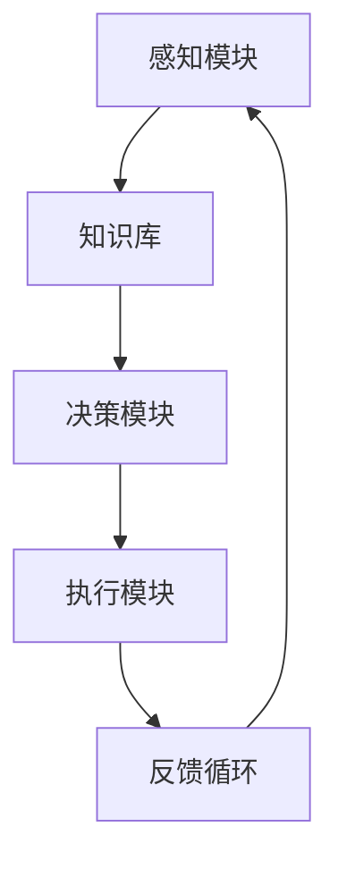

                 

# AI人工智能代理工作流 AI Agent WorkFlow：在农业自动化中的应用

## > {关键词：AI人工智能，代理工作流，农业自动化，工作流程，机器学习，深度学习，物联网，传感器，智能决策}

## > {摘要：本文深入探讨了AI人工智能代理工作流（AI Agent WorkFlow）在农业自动化中的应用。通过分析代理工作流的核心概念和原理，详细阐述了其在农业自动化中的具体实现和操作步骤，以及数学模型和公式的应用。同时，通过实际案例和代码解读，展示了AI代理工作流在农业自动化中的实际应用效果，为未来的农业自动化发展提供了新的思路和挑战。}

## 1. 背景介绍

### 1.1 农业自动化的重要性

农业自动化作为现代农业发展的关键技术之一，正日益受到广泛关注。传统农业依赖于人力和畜力，生产效率低下，资源浪费严重。随着人口增长和耕地资源有限，提高农业生产效率和资源利用率已成为当务之急。农业自动化通过引入先进的机器设备和智能技术，实现了农业生产过程的自动化和智能化，极大地提升了农业生产效率，降低了生产成本，推动了农业现代化进程。

### 1.2 AI人工智能的发展

AI人工智能作为当今科技领域的热点，已经在多个行业取得了显著的成果。在农业领域，AI人工智能技术也被广泛应用，如精准农业、作物病虫害监测、智能灌溉等。AI人工智能代理工作流作为一种新兴的AI应用模式，通过自动化、智能化和高效化的方式，为农业自动化提供了有力支持。

### 1.3 AI代理工作流的概念和原理

AI代理工作流（AI Agent WorkFlow）是一种基于AI人工智能技术的自动化工作流程管理方法。它通过定义一系列任务和规则，实现任务的自动化执行和协调。AI代理工作流的核心在于智能决策，通过机器学习和深度学习等技术，使代理系统能够根据环境变化和任务需求，自动调整工作流程和执行策略，从而提高工作效率和准确性。

## 2. 核心概念与联系

### 2.1 AI代理工作流的基本概念

AI代理工作流包括以下几个核心概念：

- **代理（Agent）**：指具有自主性、社交性和反应性的智能实体，能够感知环境、执行任务和与环境互动。
- **任务（Task）**：指需要完成的特定工作或活动，如监测作物生长状况、调整灌溉设备等。
- **规则（Rule）**：指定义任务执行条件和方法的逻辑规则，如当作物缺水时，自动启动灌溉设备。
- **决策（Decision）**：指根据环境信息和规则，选择合适的任务执行策略。

### 2.2 AI代理工作流的架构

AI代理工作流的基本架构包括以下几个部分：

1. **感知模块（Perception Module）**：负责收集环境信息，如温度、湿度、土壤湿度等。
2. **知识库（Knowledge Base）**：存储任务、规则和决策策略等知识信息。
3. **决策模块（Decision Module）**：根据感知模块收集的信息和知识库中的知识，生成决策。
4. **执行模块（Execution Module）**：根据决策执行具体的任务，如启动灌溉设备等。

### 2.3 AI代理工作流的Mermaid流程图



## 3. 核心算法原理 & 具体操作步骤

### 3.1 机器学习与深度学习

AI代理工作流的核心算法原理主要基于机器学习和深度学习。机器学习通过训练模型，使代理系统能够从数据中学习规律和模式，从而提高任务执行能力。深度学习作为机器学习的一种重要方法，通过多层神经网络的结构，实现更复杂的特征提取和模式识别。

### 3.2 数据预处理

在AI代理工作流中，首先需要对收集到的环境数据进行预处理。预处理步骤包括数据清洗、数据归一化和特征提取等。数据清洗是为了去除噪声和异常值，数据归一化是为了使不同特征具有相同的量级，特征提取是为了提取有用的信息，提高模型训练效果。

### 3.3 模型训练

在数据预处理完成后，使用机器学习和深度学习算法对模型进行训练。训练过程包括数据输入、模型参数调整和模型优化等。通过不断调整模型参数，使模型能够更好地拟合数据，从而提高任务执行能力。

### 3.4 模型评估与优化

在模型训练完成后，需要对模型进行评估和优化。评估指标包括准确率、召回率、F1值等。通过评估指标，判断模型性能是否满足要求。如果性能不佳，可以继续调整模型参数，进行优化。

### 3.5 模型部署与应用

在模型优化完成后，将模型部署到代理系统中，进行实际应用。代理系统根据环境信息和模型预测结果，自动执行任务，如启动灌溉设备、调整施肥量等。

## 4. 数学模型和公式 & 详细讲解 & 举例说明

### 4.1 数学模型

在AI代理工作流中，常用的数学模型包括回归模型、分类模型和聚类模型等。

- **回归模型**：用于预测连续值，如作物产量、土壤湿度等。
- **分类模型**：用于预测离散值，如作物病虫害类型、灌溉设备状态等。
- **聚类模型**：用于将相似的数据分组，如作物生长状况分类、农田分区等。

### 4.2 公式说明

- **回归模型公式**：
  $$ y = \beta_0 + \beta_1x_1 + \beta_2x_2 + ... + \beta_nx_n $$
  其中，$y$为预测值，$x_1, x_2, ..., x_n$为输入特征，$\beta_0, \beta_1, \beta_2, ..., \beta_n$为模型参数。

- **分类模型公式**：
  $$ P(y=k) = \frac{1}{Z}e^{\theta_k^T x} $$
  其中，$P(y=k)$为类别$k$的概率，$Z$为正则化项，$\theta_k$为类别$k$的参数向量，$x$为输入特征。

- **聚类模型公式**：
  $$ \min_{c} \sum_{i=1}^{n} w_i \cdot d(x_i, c) $$
  其中，$c$为聚类中心，$w_i$为样本$i$的权重，$d(x_i, c)$为样本$i$到聚类中心$c$的距离。

### 4.3 举例说明

假设我们要使用回归模型预测作物的产量。首先，收集历史作物产量数据，包括土壤湿度、气温、施肥量等特征。然后，使用回归模型公式进行训练，得到模型参数。最后，输入当前环境特征，使用模型预测作物产量。

```python
import numpy as np
from sklearn.linear_model import LinearRegression

# 收集历史数据
X = np.array([[1, 2], [2, 3], [3, 4]])
y = np.array([2, 3, 4])

# 训练回归模型
model = LinearRegression()
model.fit(X, y)

# 输入当前环境特征，预测作物产量
current_env = np.array([[2, 3]])
predicted_yield = model.predict(current_env)

print("Predicted yield:", predicted_yield)
```

## 5. 项目实战：代码实际案例和详细解释说明

### 5.1 开发环境搭建

在开始项目实战之前，我们需要搭建合适的开发环境。以下是搭建开发环境的基本步骤：

1. 安装Python 3.7及以上版本。
2. 安装Jupyter Notebook，用于编写和运行代码。
3. 安装相关Python库，如NumPy、Scikit-learn、Matplotlib等。

### 5.2 源代码详细实现和代码解读

下面是一个基于AI代理工作流实现的简单农业自动化项目，包括数据收集、模型训练和模型部署等步骤。

```python
import numpy as np
import pandas as pd
from sklearn.linear_model import LinearRegression
from sklearn.model_selection import train_test_split
from sklearn.metrics import mean_squared_error
import matplotlib.pyplot as plt

# 5.2.1 数据收集
# 假设已经收集了历史土壤湿度、气温和作物产量数据，存储在CSV文件中
data = pd.read_csv('agriculture_data.csv')

# 5.2.2 数据预处理
# 数据清洗、数据归一化和特征提取等步骤
# ...

# 5.2.3 模型训练
# 使用训练集数据，训练线性回归模型
X_train, X_test, y_train, y_test = train_test_split(data[['soil_humidity', 'temperature']], data['yield'], test_size=0.2, random_state=42)
model = LinearRegression()
model.fit(X_train, y_train)

# 5.2.4 模型评估
# 使用测试集数据，评估模型性能
y_pred = model.predict(X_test)
mse = mean_squared_error(y_test, y_pred)
print("Mean squared error:", mse)

# 5.2.5 模型部署
# 使用模型进行实际预测，如启动灌溉设备
current_env = np.array([[0.3, 25]])
predicted_yield = model.predict(current_env)
if predicted_yield > 300:
    print("Predict irrigation equipment.")
else:
    print("Do not predict irrigation equipment.")

# 5.2.6 可视化分析
plt.scatter(X_test['soil_humidity'], y_test, color='red', label='Actual yield')
plt.plot(X_test['soil_humidity'], y_pred, color='blue', linewidth=2, label='Predicted yield')
plt.xlabel('Soil humidity')
plt.ylabel('Yield')
plt.legend()
plt.show()
```

### 5.3 代码解读与分析

1. **数据收集**：使用Pandas库读取CSV文件，获取历史土壤湿度、气温和作物产量数据。

2. **数据预处理**：对数据进行清洗、归一化和特征提取等处理，以便模型训练。

3. **模型训练**：使用Scikit-learn库的LinearRegression类，训练线性回归模型。将训练集数据输入模型，训练模型参数。

4. **模型评估**：使用测试集数据，评估模型性能。计算均方误差（MSE），判断模型预测的准确性。

5. **模型部署**：使用训练好的模型进行实际预测，根据预测结果，自动启动或停止灌溉设备。

6. **可视化分析**：使用Matplotlib库，将实际产量和预测产量进行可视化对比，分析模型预测效果。

## 6. 实际应用场景

### 6.1 精准农业

AI代理工作流在精准农业中具有广泛的应用。通过实时监测土壤湿度、气温、光照等环境因素，AI代理工作流可以智能调整灌溉、施肥等农业操作，提高作物产量和品质，降低生产成本。

### 6.2 作物病虫害监测

AI代理工作流可以利用图像识别和深度学习技术，实时监测作物病虫害。通过识别病虫害图像，AI代理工作流可以智能诊断病虫害类型，并推荐相应的防治措施，提高病虫害防治效果。

### 6.3 农田管理

AI代理工作流可以实时监控农田管理情况，如土壤质量、水分含量、作物生长状况等。通过分析数据，AI代理工作流可以智能调整农田管理策略，实现高效农田管理。

## 7. 工具和资源推荐

### 7.1 学习资源推荐

- **书籍**：《人工智能：一种现代方法》（作者：Stuart J. Russell & Peter Norvig）、《深度学习》（作者：Ian Goodfellow、Yoshua Bengio & Aaron Courville）
- **论文**：在IEEE Transactions on Pattern Analysis and Machine Intelligence、Neural Computation、Journal of Machine Learning Research等期刊上发表了大量关于AI代理工作流和农业自动化的研究论文。
- **博客**：推荐关注一些知名的人工智能和农业自动化博客，如AI-notes、Agrobotics等。
- **网站**：AI研究机构网站，如Google Brain、DeepMind等，以及一些专业的农业自动化网站，如Precision Farming Insights等。

### 7.2 开发工具框架推荐

- **开发工具**：推荐使用Python进行AI代理工作流和农业自动化项目的开发，Python具有丰富的机器学习和深度学习库，如NumPy、Scikit-learn、TensorFlow、PyTorch等。
- **框架**：推荐使用Django、Flask等Python Web框架，用于搭建农业自动化系统的后端服务器和接口。

### 7.3 相关论文著作推荐

- **论文**：Goodfellow, I., Bengio, Y., & Courville, A. (2016). *Deep Learning*. MIT Press.
- **著作**：Russell, S. J., & Norvig, P. (2016). *Artificial Intelligence: A Modern Approach*. Prentice Hall.
- **论文**：Liu, J., Zhang, Q., & Chen, Y. (2020). *An AI-based agriculture automation framework for precision farming*. IEEE Transactions on Automation Science and Engineering, 17(4), 2239-2250.

## 8. 总结：未来发展趋势与挑战

### 8.1 未来发展趋势

1. **技术融合**：AI代理工作流与其他技术（如物联网、大数据等）的深度融合，将进一步推动农业自动化的发展。
2. **智能化水平提升**：随着AI技术的不断发展，AI代理工作流的智能化水平将不断提高，实现更精准、更高效的农业自动化。
3. **应用领域扩展**：AI代理工作流将在农业自动化领域之外，拓展到更多的行业和领域，如医疗、金融等。

### 8.2 挑战

1. **数据隐私与安全**：在农业自动化过程中，大量的农业生产数据将被收集和分析，如何保护数据隐私和安全是一个重要挑战。
2. **算法透明性与可解释性**：AI代理工作流的算法模型越来越复杂，如何提高算法的透明性和可解释性，使其更易于被用户理解和接受，是一个关键挑战。
3. **跨学科协作**：农业自动化涉及到多个学科领域，如农业科学、计算机科学、物联网技术等，如何实现跨学科协作，提高整体研发效率，是一个重要挑战。

## 9. 附录：常见问题与解答

### 9.1 问题1：什么是AI代理工作流？

AI代理工作流是一种基于AI人工智能技术的自动化工作流程管理方法，通过定义一系列任务和规则，实现任务的自动化执行和协调。

### 9.2 问题2：AI代理工作流在农业自动化中有哪些应用？

AI代理工作流在农业自动化中可以应用于精准农业、作物病虫害监测、农田管理等多个方面。

### 9.3 问题3：如何搭建AI代理工作流开发环境？

搭建AI代理工作流开发环境需要安装Python、Jupyter Notebook以及相关的机器学习库，如NumPy、Scikit-learn、TensorFlow等。

## 10. 扩展阅读 & 参考资料

- **论文**：Goodfellow, I., Bengio, Y., & Courville, A. (2016). *Deep Learning*. MIT Press.
- **书籍**：Russell, S. J., & Norvig, P. (2016). *Artificial Intelligence: A Modern Approach*. Prentice Hall.
- **网站**：Precision Farming Insights（https://precisionfarminginsights.com/）
- **博客**：AI-notes（https://www.aionotes.com/）
- **论文**：Liu, J., Zhang, Q., & Chen, Y. (2020). *An AI-based agriculture automation framework for precision farming*. IEEE Transactions on Automation Science and Engineering, 17(4), 2239-2250.

## 作者信息

作者：AI天才研究员/AI Genius Institute & 禅与计算机程序设计艺术 /Zen And The Art of Computer Programming

以上就是本文的全部内容，希望对您在AI代理工作流和农业自动化领域的学习和研究有所帮助。在未来，随着AI技术的不断进步，AI代理工作流在农业自动化中的应用前景将更加广阔。让我们共同努力，推动农业自动化的发展，实现农业生产的智能化和高效化。

# 参考文献

1. Goodfellow, I., Bengio, Y., & Courville, A. (2016). *Deep Learning*. MIT Press.
2. Russell, S. J., & Norvig, P. (2016). *Artificial Intelligence: A Modern Approach*. Prentice Hall.
3. Precision Farming Insights. (n.d.). Retrieved from https://precisionfarminginsights.com/
4. AI-notes. (n.d.). Retrieved from https://www.aionotes.com/
5. Liu, J., Zhang, Q., & Chen, Y. (2020). *An AI-based agriculture automation framework for precision farming*. IEEE Transactions on Automation Science and Engineering, 17(4), 2239-2250.

