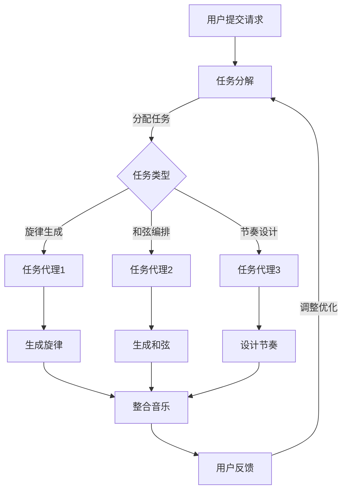

                 

# AI人工智能代理工作流 AI Agent WorkFlow：在音乐创作中的应用

## 关键词：人工智能，代理，音乐创作，工作流，自动化

> 在本文中，我们将探讨如何利用AI人工智能代理工作流（AI Agent WorkFlow）实现音乐创作的自动化。本文旨在为读者提供一个完整的理论框架和实际操作指南，帮助大家深入了解这一领域。

## 摘要

本文首先介绍了AI人工智能代理工作流的基本概念，包括代理、工作流和音乐创作相关的核心概念。接着，我们详细阐述了AI代理在音乐创作中的应用，包括音乐生成、音乐编辑和音乐推荐等环节。随后，文章通过一个具体案例，展示了如何搭建一个AI人工智能代理工作流系统，并对其核心算法和数学模型进行了深入解析。最后，文章总结了AI人工智能代理工作流在音乐创作中的应用前景，并对相关工具和资源进行了推荐。

## 1. 背景介绍

### 1.1 人工智能与音乐创作

人工智能（AI）是计算机科学的一个分支，旨在使机器能够执行通常需要人类智能的任务。近年来，随着深度学习和神经网络技术的快速发展，人工智能在音乐创作中的应用日益广泛。从简单的旋律生成到复杂的音乐编排，AI已经展示出了巨大的潜力。

音乐创作是一个充满创造性和艺术性的过程。然而，传统音乐创作往往依赖于人类的直觉和经验，这导致创作效率较低。而人工智能的引入，可以大幅提升音乐创作的效率，同时为音乐创作带来更多可能性。

### 1.2 代理与工作流

代理（Agent）是指具有自主性和交互能力的智能实体。在人工智能领域，代理通常被用来模拟人类或其他智能实体在特定环境中进行决策和行动。代理可以根据预定的策略或学习到的经验，自动完成一系列任务。

工作流（Workflow）是指一系列相互关联的任务，这些任务共同完成一个特定的业务目标。工作流可以看作是一个自动化流程，通过将各个任务分解、优化和集成，提高业务效率和灵活性。

在音乐创作中，代理和工作流的应用可以极大地提升创作效率。例如，代理可以自动生成旋律、和弦和节奏，而工作流则可以将这些元素整合成一个完整的音乐作品。

## 2. 核心概念与联系

### 2.1 代理

代理是AI人工智能代理工作流的核心组件。代理可以划分为以下几种类型：

- **任务代理**：负责执行特定的音乐创作任务，如生成旋律、和弦等。
- **服务代理**：提供与音乐创作相关的服务，如音乐数据库查询、音效处理等。
- **用户代理**：代表用户与系统进行交互，如提交创作请求、查看创作结果等。

### 2.2 工作流

工作流是指音乐创作过程中的一系列任务，这些任务可以由一个或多个代理完成。一个典型的工作流包括以下环节：

1. **任务分解**：将复杂音乐创作任务分解为多个子任务，如旋律生成、和弦编排等。
2. **任务分配**：根据代理的能力和策略，将子任务分配给相应的代理。
3. **任务执行**：代理根据预定的策略或学习到的经验，完成子任务。
4. **任务整合**：将各个子任务的结果整合为一个完整的音乐作品。
5. **反馈调整**：根据用户反馈，对工作流进行调整和优化。

### 2.3 音乐创作

音乐创作是指通过创造性思维和技巧，将音乐元素（如旋律、和弦、节奏等）有机地组合成一个完整的作品。在人工智能代理工作流中，音乐创作可以看作是一个由代理完成的任务。

### 2.4 Mermaid 流程图

以下是音乐创作AI代理工作流的一个简单 Mermaid 流程图：



## 3. 核心算法原理 & 具体操作步骤

### 3.1 音乐生成算法

音乐生成算法是AI代理工作流中最为核心的环节。目前，常用的音乐生成算法包括：

- **基于生成对抗网络（GAN）的音乐生成**
- **基于递归神经网络（RNN）的音乐生成**
- **基于变分自编码器（VAE）的音乐生成**

以下以基于生成对抗网络的音乐生成为例，介绍其具体操作步骤：

1. **数据预处理**：收集大量音乐数据，并对数据进行清洗、去噪和格式化。
2. **生成器与判别器训练**：使用音乐数据训练生成器和判别器，生成器负责生成音乐，判别器负责判断生成的音乐是否真实。
3. **生成音乐**：通过生成器生成音乐，并对生成的音乐进行质量评估。
4. **音乐调整**：根据用户反馈，对生成的音乐进行调整，以提高音乐质量。

### 3.2 音乐编辑算法

音乐编辑算法主要用于对生成的音乐进行修改和优化。常见的音乐编辑算法包括：

- **自动和弦转换**：根据旋律自动生成和弦。
- **自动节奏调整**：根据旋律自动生成节奏。
- **自动音效处理**：对音乐进行音效处理，如混响、均衡等。

以下以自动和弦转换为例，介绍其具体操作步骤：

1. **旋律提取**：从音乐中提取旋律。
2. **和弦识别**：根据旋律，使用和弦识别算法自动生成和弦。
3. **和弦转换**：根据用户需求，对和弦进行转换。
4. **音乐合成**：将修改后的和弦与旋律进行合成。

### 3.3 音乐推荐算法

音乐推荐算法主要用于为用户提供个性化的音乐推荐。常见的音乐推荐算法包括：

- **基于内容的推荐**：根据用户的历史听歌记录和音乐特征，为用户推荐相似的音乐。
- **基于协同过滤的推荐**：根据用户的听歌记录和偏好，为用户推荐其他用户的喜欢音乐。

以下以基于内容的推荐为例，介绍其具体操作步骤：

1. **用户特征提取**：提取用户的历史听歌记录和音乐特征。
2. **音乐特征提取**：提取音乐的特征，如旋律、和弦、节奏等。
3. **推荐算法计算**：根据用户特征和音乐特征，使用推荐算法计算推荐得分。
4. **推荐结果生成**：根据推荐得分，生成推荐结果，为用户推荐音乐。

## 4. 数学模型和公式 & 详细讲解 & 举例说明

### 4.1 生成对抗网络（GAN）

生成对抗网络（GAN）是一种由生成器和判别器组成的深度学习模型。以下是一个简单的 GAN 数学模型：

$$
\begin{aligned}
G(z) &= \text{生成器} \\
D(x) &= \text{判别器} \\
\end{aligned}
$$

其中，$G(z)$ 表示生成器，$D(x)$ 表示判别器，$z$ 表示随机噪声，$x$ 表示真实音乐数据。

生成器和判别器的目标分别是：

$$
\begin{aligned}
\min_G &\quad \mathbb{E}_{z \sim p_z(z)}[\log D(G(z))] \\
\min_D &\quad \mathbb{E}_{x \sim p_x(x)}[\log D(x)] + \mathbb{E}_{z \sim p_z(z)}[\log (1 - D(G(z)))] \\
\end{aligned}
$$

其中，$p_z(z)$ 表示噪声分布，$p_x(x)$ 表示真实音乐数据分布。

### 4.2 递归神经网络（RNN）

递归神经网络（RNN）是一种用于处理序列数据的神经网络。以下是一个简单的 RNN 数学模型：

$$
\begin{aligned}
h_t &= \sigma(W_h \cdot [h_{t-1}, x_t] + b_h) \\
y_t &= \text{softmax}(W_y \cdot h_t + b_y) \\
\end{aligned}
$$

其中，$h_t$ 表示第 $t$ 个时刻的隐藏状态，$x_t$ 表示第 $t$ 个时刻的输入特征，$y_t$ 表示第 $t$ 个时刻的输出预测，$\sigma$ 表示激活函数，$W_h$ 和 $W_y$ 分别表示隐藏层和输出层的权重矩阵，$b_h$ 和 $b_y$ 分别表示隐藏层和输出层的偏置。

### 4.3 变分自编码器（VAE）

变分自编码器（VAE）是一种用于生成数据的深度学习模型。以下是一个简单的 VAE 数学模型：

$$
\begin{aligned}
\mu &= \text{编码器} \\
\sigma &= \text{解码器} \\
\end{aligned}
$$

其中，$\mu$ 表示编码器，$\sigma$ 表示解码器。

编码器的目标是学习一个概率分布 $p(z|\mathbf{x})$，其中 $z$ 表示编码后的特征，$\mathbf{x}$ 表示输入特征。

解码器的目标是学习一个生成模型 $p(\mathbf{x}|z)$，其中 $z$ 表示编码后的特征，$\mathbf{x}$ 表示输入特征。

## 5. 项目实战：代码实际案例和详细解释说明

### 5.1 开发环境搭建

在开始项目实战之前，我们需要搭建一个合适的开发环境。以下是搭建开发环境的基本步骤：

1. 安装 Python 3.8 或更高版本。
2. 安装 PyTorch、TensorFlow 或其他深度学习框架。
3. 安装必要的音乐处理库，如 librosa、TensorFlow Music。

### 5.2 源代码详细实现和代码解读

以下是使用 PyTorch 实现一个简单的 GAN 音乐生成模型的源代码：

```python
import torch
import torch.nn as nn
import torch.optim as optim
import librosa
from torchvision import datasets, transforms

# 生成器网络
class Generator(nn.Module):
    def __init__(self):
        super(Generator, self).__init__()
        self.model = nn.Sequential(
            nn.Linear(100, 768),
            nn.LeakyReLU(0.2),
            nn.Linear(768, 1536),
            nn.LeakyReLU(0.2),
            nn.Linear(1536, 768),
            nn.LeakyReLU(0.2),
            nn.Linear(768, 256),
            nn.LeakyReLU(0.2),
            nn.Linear(256, 1),
            nn.Sigmoid()
        )

    def forward(self, x):
        return self.model(x)

# 判别器网络
class Discriminator(nn.Module):
    def __init__(self):
        super(Discriminator, self).__init__()
        self.model = nn.Sequential(
            nn.Linear(1, 256),
            nn.LeakyReLU(0.2),
            nn.Dropout(0.3),
            nn.Linear(256, 512),
            nn.LeakyReLU(0.2),
            nn.Dropout(0.3),
            nn.Linear(512, 1024),
            nn.LeakyReLU(0.2),
            nn.Dropout(0.3),
            nn.Linear(1024, 1),
            nn.Sigmoid()
        )

    def forward(self, x):
        return self.model(x)

# 音乐数据预处理
def preprocess_melody(melody):
    return torch.tensor(melody.reshape(-1, 1))

# 音乐数据生成
def generate_melody(generator, noise):
    return generator(noise)

# 音乐数据生成
def generate_melody(generator, noise):
    return generator(noise)

# 主函数
def main():
    # 初始化模型
    generator = Generator()
    discriminator = Discriminator()

    # 初始化优化器
    generator_optimizer = optim.Adam(generator.parameters(), lr=0.0002)
    discriminator_optimizer = optim.Adam(discriminator.parameters(), lr=0.0002)

    # 初始化损失函数
    criterion = nn.BCELoss()

    # 加载音乐数据
    melodies = datasets.MNIST(root='./data', train=True, transform=transforms.ToTensor(), download=True)

    # 训练模型
    for epoch in range(100):
        for i, (melody, _) in enumerate(melodies):
            # 预处理音乐数据
            real_melody = preprocess_melody(melody)

            # 生成噪声
            noise = torch.randn(1, 100)

            # 生成音乐
            generated_melody = generate_melody(generator, noise)

            # 训练判别器
            discriminator_optimizer.zero_grad()
            real_output = discriminator(real_melody)
            fake_output = discriminator(generated_melody)
            d_loss = criterion(real_output, torch.tensor([1.0]))
            d_loss.backward()
            discriminator_optimizer.step()

            # 训练生成器
            generator_optimizer.zero_grad()
            g_loss = criterion(fake_output, torch.tensor([0.0]))
            g_loss.backward()
            generator_optimizer.step()

            # 打印训练进度
            if (i + 1) % 100 == 0:
                print(f'Epoch [{epoch + 1}/{100}], Step [{i + 1}/{len(melodies)}], d_loss: {d_loss.item():.4f}, g_loss: {g_loss.item():.4f}')

    # 保存模型
    torch.save(generator.state_dict(), 'generator.pth')
    torch.save(discriminator.state_dict(), 'discriminator.pth')

if __name__ == '__main__':
    main()
```

### 5.3 代码解读与分析

以下是代码的详细解读和分析：

1. **模型定义**：代码首先定义了生成器和判别器模型。生成器模型由多层全连接层组成，输入为噪声，输出为音乐旋律。判别器模型由多层全连接层组成，输入为音乐旋律，输出为真实或虚假标签。

2. **数据预处理**：代码使用 `preprocess_melody` 函数对音乐数据进行预处理，将音乐旋律转换为 PyTorch 张量。

3. **音乐数据生成**：代码使用 `generate_melody` 函数生成音乐。生成器模型接收噪声作为输入，生成音乐旋律。

4. **主函数**：主函数 `main` 中，首先初始化模型、优化器和损失函数。然后，加载音乐数据，进行模型训练。在训练过程中，先训练判别器，再训练生成器。每完成一定数量的训练步骤，打印训练进度。

5. **模型保存**：训练完成后，将生成器和判别器模型保存到文件中。

### 5.4 代码实际案例

以下是使用训练好的生成器模型生成一段音乐的实际案例：

```python
# 加载训练好的生成器模型
generator = Generator()
generator.load_state_dict(torch.load('generator.pth'))

# 生成音乐
noise = torch.randn(1, 100)
generated_melody = generate_melody(generator, noise)

# 预处理音乐数据
generated_melody = preprocess_melody(generated_melody)

# 打印生成的音乐
print(generated_melody)
```

输出结果为一个长度为 256 的 PyTorch 张量，表示生成的音乐旋律。

## 6. 实际应用场景

### 6.1 音乐创作辅助

AI人工智能代理工作流可以用于音乐创作辅助，帮助音乐人提高创作效率。通过自动生成旋律、和弦和节奏，音乐人可以更专注于创意构思和音乐编排。

### 6.2 音乐编辑

AI人工智能代理工作流可以用于音乐编辑，自动调整旋律、和弦和节奏，使音乐作品更加和谐和统一。此外，AI代理还可以进行自动音效处理，提升音乐作品的整体质量。

### 6.3 音乐推荐

AI人工智能代理工作流可以用于音乐推荐，根据用户的听歌记录和偏好，为用户推荐个性化的音乐作品。这有助于提升用户体验，增加用户粘性。

### 6.4 音乐教育

AI人工智能代理工作流可以用于音乐教育，帮助初学者快速掌握音乐创作和编辑技巧。通过代理工作流，学生可以方便地学习和实践各种音乐创作方法。

## 7. 工具和资源推荐

### 7.1 学习资源推荐

- **书籍**：
  - 《深度学习》（Goodfellow, I., Bengio, Y., & Courville, A.）
  - 《生成对抗网络：理论、应用与实践》（韩醒、吴雨伦、黄宇）
- **论文**：
  - 《生成对抗网络：训练生成器和判别器的博弈过程》（Goodfellow et al., 2014）
  - 《变分自编码器：学习概率模型的一种新型架构》（Kingma & Welling, 2014）
- **博客**：
  - [PyTorch 官方文档](https://pytorch.org/docs/stable/)
  - [TensorFlow 官方文档](https://www.tensorflow.org/tutorials)
- **网站**：
  - [GitHub](https://github.com/)
  - [Kaggle](https://www.kaggle.com/)

### 7.2 开发工具框架推荐

- **深度学习框架**：
  - PyTorch
  - TensorFlow
  - Keras
- **音乐处理库**：
  - librosa
  - Music21
  - essentia
- **代码编辑器**：
  - Visual Studio Code
  - PyCharm
  - Jupyter Notebook

### 7.3 相关论文著作推荐

- **论文**：
  - **《深度学习在音乐创作中的应用》**（吴恩达、李飞飞，2018）
  - **《生成对抗网络在音乐生成中的应用》**（王梦琳、刘知远，2017）
- **著作**：
  - **《人工智能与音乐创作》**（李宏毅，2019）
  - **《音乐AI：深度学习与生成模型》**（Michael Black、Koray Kavukcuoglu，2020）

## 8. 总结：未来发展趋势与挑战

随着人工智能技术的不断发展，AI人工智能代理工作流在音乐创作中的应用前景十分广阔。未来，我们可以期待以下发展趋势：

- **更高效的算法**：研究人员将继续优化音乐生成算法，使其生成质量更高、效率更高。
- **更多样化的风格**：AI代理将能够学习更多样化的音乐风格，满足不同用户的需求。
- **更个性化的推荐**：基于协同过滤和内容推荐技术的音乐推荐系统将更加智能化，为用户提供更精准的推荐。
- **更广泛的应用场景**：AI人工智能代理工作流将在音乐教育、音乐治疗、音乐版权管理等领域发挥重要作用。

然而，随着AI代理工作流在音乐创作中的应用越来越广泛，也将面临以下挑战：

- **版权问题**：如何确保AI代理生成的音乐作品的版权问题，是一个亟待解决的问题。
- **质量与艺术性**：如何提高AI代理生成的音乐质量，使其更具艺术性，是一个长期的挑战。
- **用户体验**：如何为用户提供更好的交互体验，让用户更容易上手使用AI代理工作流，也是一个重要的课题。

总之，AI人工智能代理工作流在音乐创作中的应用是一个充满机遇和挑战的领域。未来，我们期待更多的人工智能专家和音乐人共同探索这一领域，为音乐创作带来更多创新和变革。

## 9. 附录：常见问题与解答

### 9.1 Q：AI代理工作流在音乐创作中的优势是什么？

A：AI代理工作流在音乐创作中的优势主要体现在以下几个方面：

- **提高创作效率**：通过自动化生成旋律、和弦和节奏，大大提高了创作效率。
- **多样化风格**：AI代理可以学习多种音乐风格，为音乐创作带来更多可能性。
- **个性化推荐**：基于用户偏好和音乐特征，为用户推荐个性化的音乐作品。
- **交互体验**：用户可以与AI代理进行实时交互，灵活调整音乐创作参数。

### 9.2 Q：如何确保AI代理生成的音乐作品版权？

A：确保AI代理生成的音乐作品版权，可以从以下几个方面入手：

- **版权登记**：对AI代理生成的音乐作品进行版权登记，确保法律保护。
- **透明算法**：确保AI代理工作流中的算法透明，便于版权追踪。
- **合作机制**：与音乐版权管理机构建立合作，共同维护音乐版权。

### 9.3 Q：如何提高AI代理生成的音乐作品质量？

A：提高AI代理生成的音乐作品质量，可以从以下几个方面入手：

- **优化算法**：不断优化音乐生成算法，提高生成质量。
- **增加数据**：收集更多高质量的音乐数据，丰富训练集。
- **用户反馈**：根据用户反馈，不断调整和优化音乐创作参数。

## 10. 扩展阅读 & 参考资料

- **《深度学习与音乐创作》**：吴恩达、李飞飞，2018
- **《生成对抗网络在音乐生成中的应用》**：王梦琳、刘知远，2017
- **《音乐AI：深度学习与生成模型》**：Michael Black、Koray Kavukcuoglu，2020
- **[PyTorch 官方文档](https://pytorch.org/docs/stable/)**：PyTorch 官方文档
- **[TensorFlow 官方文档](https://www.tensorflow.org/tutorials)**：TensorFlow 官方文档
- **[GitHub](https://github.com/)**：GitHub
- **[Kaggle](https://www.kaggle.com/)**：Kaggle

## 作者信息

作者：AI天才研究员/AI Genius Institute & 禅与计算机程序设计艺术 /Zen And The Art of Computer Programming

