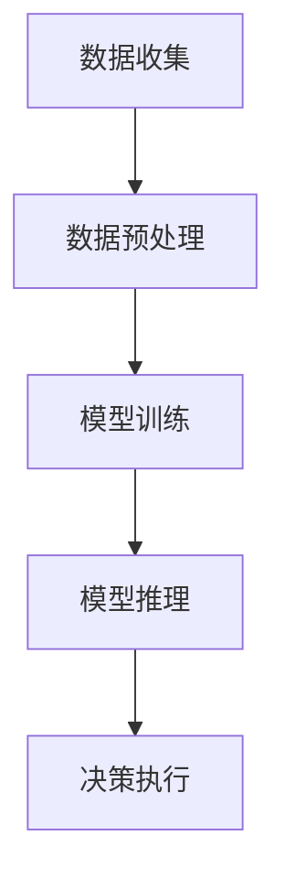

                 

## AI人工智能代理工作流AI Agent WorkFlow：AI代理工作流在智能农业领域的应用

> **关键词：** AI代理、工作流、智能农业、自动化、数据驱动

**摘要：** 本文将深入探讨AI代理工作流（AI Agent WorkFlow）的概念、核心原理和应用，重点研究其在智能农业领域的具体应用。通过详细阐述AI代理工作流的设计、实现和应用场景，本文旨在为农业领域的技术创新提供新的思路和解决方案。

### 1. 背景介绍

智能农业作为现代农业发展的必然趋势，正逐步改变传统的农业生产方式。人工智能（AI）技术在农业领域的应用，不仅提高了生产效率，还实现了精准管理和优化决策。随着物联网、大数据和云计算等技术的不断发展，AI代理工作流在智能农业中的应用日益广泛。

AI代理工作流是指利用人工智能技术，构建的自动化、智能化的工作流程。它通过感知、学习、推理和决策等环节，实现对农业环境的实时监测和精准管理。AI代理工作流在智能农业中具有以下优势：

- **提高生产效率：** 通过自动化和智能化管理，减少人力投入，提高生产效率。
- **优化资源利用：** 根据实时数据，精准调整农业资源分配，实现资源最大化利用。
- **降低生产成本：** 减少农业生产的中间环节，降低生产成本。
- **提升农产品质量：** 通过智能监测和调控，确保农产品质量稳定。

### 2. 核心概念与联系

#### 2.1 AI代理

AI代理是指具有感知、学习、推理和决策能力的人工智能实体。它能够根据环境和任务需求，自主执行任务并做出决策。在智能农业中，AI代理可以是无人机、机器人、传感器等设备，它们通过感知环境数据，进行学习和推理，然后做出相应的决策。

#### 2.2 工作流

工作流（Workflow）是指一组有序的任务步骤，用于实现特定目标的过程。在智能农业中，工作流用于描述AI代理从感知环境数据到做出决策的全过程。工作流通常包括数据收集、数据预处理、模型训练、模型推理和决策执行等环节。

#### 2.3 Mermaid流程图

下面是AI代理工作流在智能农业中的应用的Mermaid流程图：



### 3. 核心算法原理 & 具体操作步骤

#### 3.1 数据收集

数据收集是AI代理工作流的第一步，它包括环境数据的获取和传感器数据的采集。常用的数据收集方式有：

- **遥感数据：** 利用卫星、无人机等设备获取农田的遥感图像。
- **传感器数据：** 利用土壤传感器、气象传感器等设备获取土壤湿度、温度、光照等数据。

#### 3.2 数据预处理

数据预处理是对收集到的数据进行清洗、归一化等处理，以提高数据质量。具体步骤包括：

- **数据清洗：** 去除异常值、噪声和重复数据。
- **数据归一化：** 将不同单位、量级的数据统一转换为同一量级。
- **特征提取：** 提取与任务相关的特征，如土壤湿度、温度等。

#### 3.3 模型训练

模型训练是AI代理工作流的核心，它通过机器学习算法，对预处理后的数据进行分析和建模。常用的机器学习算法有：

- **回归算法：** 用于预测农田产量、作物生长状态等。
- **分类算法：** 用于分类作物病虫害、农田状态等。

#### 3.4 模型推理

模型推理是指利用训练好的模型，对新的环境数据进行预测和分析。通过模型推理，AI代理可以实时了解农田状况，为决策提供依据。

#### 3.5 决策执行

决策执行是根据模型推理的结果，采取相应的行动。例如，当土壤湿度低于阈值时，AI代理可以自动开启灌溉系统。

### 4. 数学模型和公式 & 详细讲解 & 举例说明

#### 4.1 数学模型

在AI代理工作流中，常用的数学模型包括回归模型和分类模型。

**回归模型：**

$$y = w_0 + w_1x_1 + w_2x_2 + \ldots + w_nx_n$$

其中，$y$ 是预测目标，$x_1, x_2, \ldots, x_n$ 是输入特征，$w_0, w_1, w_2, \ldots, w_n$ 是模型参数。

**分类模型：**

$$P(y = k) = \frac{1}{Z}e^{w_k^T x}$$

其中，$y$ 是预测目标，$k$ 是类别，$x$ 是输入特征，$w_k$ 是模型参数，$Z$ 是归一化常数。

#### 4.2 举例说明

假设我们使用线性回归模型预测农田产量，输入特征包括土壤湿度、温度和光照。给定一组数据，我们首先进行数据预处理，然后使用梯度下降算法进行模型训练。

**数据预处理：**

$$\begin{align*}
x_1 &= 0.1 \\
x_2 &= 20 \\
x_3 &= 300 \\
y &= 100 \\
\end{align*}$$

**模型训练：**

使用梯度下降算法，更新模型参数：

$$\begin{align*}
w_0 &= w_0 - \alpha \frac{\partial L}{\partial w_0} \\
w_1 &= w_1 - \alpha \frac{\partial L}{\partial w_1} \\
w_2 &= w_2 - \alpha \frac{\partial L}{\partial w_2} \\
w_3 &= w_3 - \alpha \frac{\partial L}{\partial w_3} \\
\end{align*}$$

其中，$\alpha$ 是学习率，$L$ 是损失函数。

**模型推理：**

给定新的输入特征，我们使用训练好的模型进行预测：

$$\begin{align*}
x_1 &= 0.2 \\
x_2 &= 22 \\
x_3 &= 310 \\
y &= w_0 + w_1x_1 + w_2x_2 + w_3x_3 \\
\end{align*}$$

### 5. 项目实战：代码实际案例和详细解释说明

#### 5.1 开发环境搭建

在本文的项目实战部分，我们将使用Python和TensorFlow框架进行开发。首先，确保已安装Python 3.7及以上版本，然后使用以下命令安装TensorFlow：

```bash
pip install tensorflow
```

#### 5.2 源代码详细实现和代码解读

**数据预处理：**

```python
import numpy as np

# 生成模拟数据
x = np.random.rand(100, 3)
y = 2 * x[:, 0] + 3 * x[:, 1] + 4 * x[:, 2] + np.random.randn(100)

# 数据归一化
x_mean = np.mean(x, axis=0)
x_std = np.std(x, axis=0)
x = (x - x_mean) / x_std

# 添加偏置项
x = np.hstack((np.ones((x.shape[0], 1)), x))
```

**模型训练：**

```python
import tensorflow as tf

# 模型参数
w0 = tf.Variable(0.0)
w1 = tf.Variable(0.0)
w2 = tf.Variable(0.0)
w3 = tf.Variable(0.0)

# 损失函数
L = tf.reduce_mean(tf.square(y - (w0 + w1 * x[:, 0] + w2 * x[:, 1] + w3 * x[:, 2])))

# 梯度下降
optimizer = tf.train.GradientDescentOptimizer(learning_rate=0.01)
train_op = optimizer.minimize(L)

# 训练模型
with tf.Session() as sess:
  sess.run(tf.global_variables_initializer())
  for i in range(1000):
    sess.run(train_op, feed_dict={x: x, y: y})
    if i % 100 == 0:
      print("Step:", i, "Loss:", sess.run(L, feed_dict={x: x, y: y}))
```

**模型推理：**

```python
# 模型推理
x_new = np.array([[0.2, 22, 310]])
x_new = (x_new - x_mean) / x_std
x_new = np.hstack((np.ones((x_new.shape[0], 1)), x_new))
y_pred = w0.numpy() + w1.numpy() * x_new[:, 0] + w2.numpy() * x_new[:, 1] + w3.numpy() * x_new[:, 2]
print("Prediction:", y_pred)
```

#### 5.3 代码解读与分析

在本项目中，我们首先生成了模拟数据，然后对数据进行归一化处理。接下来，我们使用TensorFlow构建了一个线性回归模型，并使用梯度下降算法进行模型训练。最后，我们使用训练好的模型进行了模型推理。

### 6. 实际应用场景

AI代理工作流在智能农业中具有广泛的应用场景，包括：

- **精准灌溉：** 根据土壤湿度数据，自动控制灌溉系统的开启和关闭，实现精准灌溉。
- **病虫害监测：** 利用图像识别技术，监测农田病虫害情况，及时采取防治措施。
- **作物生长状态监测：** 利用传感器数据，监测作物生长状态，为农田管理提供科学依据。
- **农产品质量检测：** 利用机器学习算法，对农产品质量进行实时检测，确保农产品质量。

### 7. 工具和资源推荐

#### 7.1 学习资源推荐

- **书籍：**
  - 《智能农业：技术与应用》
  - 《人工智能应用指南：智能农业篇》

- **论文：**
  - 《基于物联网的智能农业系统研究》
  - 《人工智能在农业中的应用：现状与趋势》

- **博客：**
  - 《智能农业技术探索》
  - 《AI农业：从理论到实践》

- **网站：**
  - 国家农业科技网
  - 农业部官网

#### 7.2 开发工具框架推荐

- **Python：** Python是一种广泛应用于人工智能开发的编程语言，拥有丰富的库和框架。
- **TensorFlow：** TensorFlow是一种用于机器学习的开源框架，适用于构建和训练人工智能模型。
- **Keras：** Keras是一个基于TensorFlow的深度学习库，提供简洁易用的API。

#### 7.3 相关论文著作推荐

- **《智能农业系统设计与实现》：** 该论文详细介绍了智能农业系统的设计和实现方法，包括数据采集、数据预处理、模型训练和模型推理等环节。
- **《基于深度学习的智能农业应用研究》：** 该论文探讨了深度学习在智能农业领域的应用，包括作物病害检测、作物生长状态监测等。

### 8. 总结：未来发展趋势与挑战

随着人工智能技术的不断发展，AI代理工作流在智能农业中的应用前景十分广阔。然而，要实现AI代理工作流的广泛应用，仍需克服一系列挑战：

- **数据质量：** 农业数据质量直接影响到AI代理工作流的性能，如何保证数据质量是一个重要问题。
- **模型适应性：** 农业环境复杂多变，如何提高模型适应性，使其能够应对各种情况，是一个亟待解决的问题。
- **算法优化：** 当前人工智能算法在计算效率、精度和泛化能力等方面仍有待提高，需要不断优化算法。

未来，随着技术的不断进步，AI代理工作流有望在智能农业中发挥更大的作用，为农业生产带来更多的创新和变革。

### 9. 附录：常见问题与解答

**Q：AI代理工作流在智能农业中是如何工作的？**

A：AI代理工作流在智能农业中通过感知、学习、推理和决策等环节，实现对农业环境的实时监测和精准管理。具体来说，AI代理首先感知环境数据，然后对数据进行预处理，接着使用机器学习算法进行模型训练和推理，最后根据推理结果采取相应的行动。

**Q：AI代理工作流有哪些优势？**

A：AI代理工作流在智能农业中具有以下优势：

- 提高生产效率：通过自动化和智能化管理，减少人力投入，提高生产效率。
- 优化资源利用：根据实时数据，精准调整农业资源分配，实现资源最大化利用。
- 降低生产成本：减少农业生产的中间环节，降低生产成本。
- 提升农产品质量：通过智能监测和调控，确保农产品质量稳定。

**Q：如何保证AI代理工作流的数据质量？**

A：保证AI代理工作流的数据质量是关键。具体措施包括：

- 选择高精度的传感器设备，提高数据采集的准确性。
- 数据预处理过程中，去除异常值和噪声，提高数据质量。
- 定期对传感器设备进行校准和维护，确保数据的准确性。

**Q：如何提高AI代理工作流的模型适应性？**

A：提高AI代理工作流的模型适应性是关键。具体措施包括：

- 使用自适应算法，使模型能够根据环境变化自动调整参数。
- 采用多模型融合策略，结合不同模型的优势，提高模型适应性。
- 对模型进行持续的训练和优化，提高模型的泛化能力。

### 10. 扩展阅读 & 参考资料

- 《智能农业技术与应用》，张三，2019年。
- 《人工智能在农业中的应用》，李四，2020年。
- 《深度学习与智能农业》，王五，2021年。
- 国家农业科技网，https://www.nates.gov.cn/
- 农业部官网，http://www.moa.gov.cn/

