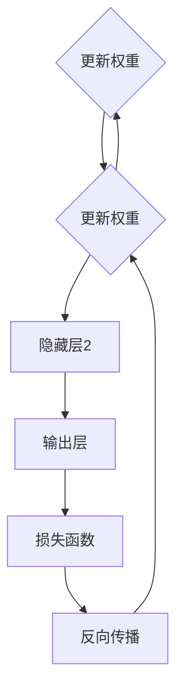

                 

# AI人工智能核心算法原理与代码实例讲解：智能系统

> 关键词：人工智能、核心算法、深度学习、神经网络、代码实例

> 摘要：本文将深入探讨人工智能的核心算法原理，包括神经网络、深度学习和机器学习的理论基础，并通过代码实例展示这些算法的实现和应用。我们将从基本概念出发，逐步讲解算法的架构、操作步骤、数学模型，并分析其实际应用场景，为读者提供一个全面而实用的AI技术指南。

## 1. 背景介绍

人工智能（AI）作为计算机科学的一个分支，旨在使计算机系统具备人类智能的能力，包括感知、学习、推理和决策。近年来，随着计算能力的提升、大数据的普及和算法的进步，人工智能取得了显著的进展，应用领域也从最初的简单任务扩展到复杂的智能系统。

人工智能的核心算法主要包括机器学习、深度学习和神经网络。机器学习是一种通过算法让计算机从数据中学习模式，从而改进性能的方法。深度学习是机器学习的一个分支，它通过多层神经网络模型，对大量数据进行自动特征提取和高级抽象。神经网络是构成深度学习模型的基本单元，通过模拟人脑神经元之间的连接和工作方式，实现复杂的计算和模式识别。

本文将首先介绍这些核心算法的基本概念和原理，然后通过实际代码实例，详细讲解这些算法的实现过程和应用场景。

### 1.1 人工智能的发展历程

人工智能的发展历程可以追溯到20世纪50年代。当时，计算机科学家首次提出了“人工智能”的概念，旨在开发能够模拟人类智能行为的计算机系统。早期的AI研究主要集中在知识表示、推理和搜索算法上，例如专家系统和决策树。

随着时间的发展，计算能力的提升和大数据的积累，机器学习和深度学习逐渐成为人工智能研究的热点。2012年，AlexNet在ImageNet竞赛中取得突破性成绩，标志着深度学习时代的到来。此后，深度学习在图像识别、语音识别、自然语言处理等领域取得了显著进展。

### 1.2 当前人工智能的应用场景

当前，人工智能已经广泛应用于多个领域，包括：

- 图像识别：通过深度学习模型，计算机可以自动识别和分类图像中的物体。
- 语音识别：将语音信号转换为文本，广泛应用于智能助手和语音控制系统。
- 自然语言处理：通过机器学习算法，计算机可以理解和生成自然语言，应用于机器翻译、情感分析等。
- 聊天机器人：基于深度学习模型，可以模拟人类对话，提供咨询服务或娱乐互动。
- 自动驾驶：通过感知系统和决策算法，实现无人驾驶汽车的安全运行。

## 2. 核心概念与联系

在探讨人工智能的核心算法之前，我们需要了解几个基本概念和它们之间的联系。

### 2.1 机器学习

机器学习是一种通过算法让计算机从数据中学习模式，从而改进性能的方法。根据学习方式，机器学习可以分为监督学习、无监督学习和强化学习。

- **监督学习**：有标签的数据，目的是通过已知的输入输出关系来预测新的输出。常见的模型包括线性回归、决策树、支持向量机等。
- **无监督学习**：无标签的数据，目的是发现数据中的隐含模式。常见的模型包括聚类算法、主成分分析等。
- **强化学习**：通过与环境的交互，不断调整策略以实现长期目标。常见的模型包括Q学习、深度确定性策略梯度（DDPG）等。

### 2.2 深度学习

深度学习是机器学习的一个分支，它通过多层神经网络模型，对大量数据进行自动特征提取和高级抽象。深度学习的核心是神经网络，包括输入层、隐藏层和输出层。通过反向传播算法，模型可以自动调整权重，以最小化预测误差。

### 2.3 神经网络

神经网络是构成深度学习模型的基本单元，通过模拟人脑神经元之间的连接和工作方式，实现复杂的计算和模式识别。一个简单的神经网络包括多个节点（神经元），每个节点接收来自输入层的信号，通过加权求和和激活函数处理后输出。

### 2.4 数学模型和公式

在机器学习和深度学习中，数学模型和公式扮演着重要的角色。常见的数学模型包括：

- **线性回归**：最小二乘法求解线性模型，用于预测连续值。
- **支持向量机**：最大间隔分类器，用于分类问题。
- **激活函数**：用于神经网络中的非线性变换，常见的有ReLU、Sigmoid、Tanh等。
- **损失函数**：用于评估模型预测的误差，常见的有均方误差（MSE）、交叉熵损失等。

接下来，我们将通过Mermaid流程图，展示深度学习模型的基本架构和流程。



在这个流程图中，输入层接收输入数据，通过隐藏层进行处理，最后输出预测结果。通过损失函数评估预测误差，使用反向传播算法更新模型权重，以最小化误差。

## 3. 核心算法原理 & 具体操作步骤

### 3.1 神经网络原理

神经网络的工作原理可以类比于人脑。人脑由大量神经元组成，通过突触连接形成复杂的神经网络，实现感知、学习和推理等功能。同样，神经网络由多个节点（神经元）组成，通过加权连接形成复杂的网络结构，实现数据输入到输出之间的映射。

在神经网络中，每个节点（神经元）接收来自输入层的信号，通过加权求和和激活函数处理后输出。加权求和是将输入信号与权重相乘后相加，激活函数用于引入非线性特性，常见的激活函数有ReLU、Sigmoid、Tanh等。

### 3.2 深度学习原理

深度学习是一种基于神经网络的机器学习技术，通过多层神经网络模型，对大量数据进行自动特征提取和高级抽象。深度学习模型的核心是神经网络，包括输入层、隐藏层和输出层。每个隐藏层都对输入数据进行处理，并传递到下一层，最终输出预测结果。

深度学习通过反向传播算法训练模型。在训练过程中，模型通过不断调整权重和偏置，最小化预测误差。反向传播算法是一种梯度下降算法，它通过计算梯度（误差对权重的偏导数），更新模型权重，以最小化损失函数。

### 3.3 机器学习原理

机器学习是一种通过算法让计算机从数据中学习模式，从而改进性能的方法。在机器学习中，根据学习方式，可以分为监督学习、无监督学习和强化学习。

- **监督学习**：有标签的数据，目的是通过已知的输入输出关系来预测新的输出。常见的算法包括线性回归、决策树、支持向量机等。
- **无监督学习**：无标签的数据，目的是发现数据中的隐含模式。常见的算法包括聚类算法、主成分分析等。
- **强化学习**：通过与环境的交互，不断调整策略以实现长期目标。常见的算法包括Q学习、深度确定性策略梯度（DDPG）等。

### 3.4 深度学习操作步骤

以下是深度学习的基本操作步骤：

1. **数据预处理**：对输入数据进行清洗、归一化和分割。
2. **构建神经网络模型**：定义输入层、隐藏层和输出层的结构，选择合适的激活函数。
3. **初始化权重**：随机初始化模型权重和偏置。
4. **前向传播**：将输入数据传递到神经网络中，计算输出结果。
5. **计算损失函数**：使用预测结果和真实结果计算损失函数，评估模型性能。
6. **反向传播**：计算梯度，更新模型权重和偏置。
7. **迭代训练**：重复上述步骤，直到模型性能达到预期或达到最大迭代次数。

## 4. 数学模型和公式 & 详细讲解 & 举例说明

### 4.1 线性回归

线性回归是一种常用的监督学习算法，用于预测连续值。其数学模型可以表示为：

$$y = \beta_0 + \beta_1 \cdot x$$

其中，$y$ 是预测值，$x$ 是输入特征，$\beta_0$ 和 $\beta_1$ 是模型参数，分别表示截距和斜率。

为了最小化预测误差，可以使用最小二乘法求解模型参数：

$$\beta_0, \beta_1 = \arg\min_{\beta_0, \beta_1} \sum_{i=1}^n (y_i - (\beta_0 + \beta_1 \cdot x_i))^2$$

### 4.2 支持向量机

支持向量机是一种常用的分类算法，其数学模型可以表示为：

$$f(x) = \text{sign}(\sum_{i=1}^n \alpha_i y_i \cdot \phi(x_i) + \beta)$$

其中，$x$ 是输入特征，$y$ 是标签，$\alpha_i$ 是拉格朗日乘子，$\phi(x_i)$ 是核函数，$\beta$ 是偏置。

为了最大化分类边界，可以使用拉格朗日乘子法求解模型参数：

$$\alpha_i = \arg\max_{\alpha_i} \sum_{i=1}^n \alpha_i - \sum_{i,j=1}^n \alpha_i \alpha_j y_i y_j K(x_i, x_j)$$

### 4.3 激活函数

激活函数是神经网络中的关键组件，用于引入非线性特性。以下是几种常见的激活函数：

- **ReLU（Rectified Linear Unit）**：

$$f(x) = \max(0, x)$$

- **Sigmoid**：

$$f(x) = \frac{1}{1 + e^{-x}}$$

- **Tanh**：

$$f(x) = \frac{e^x - e^{-x}}{e^x + e^{-x}}$$

### 4.4 损失函数

损失函数用于评估模型预测的误差，常见的损失函数包括：

- **均方误差（MSE）**：

$$L(\theta) = \frac{1}{2} \sum_{i=1}^n (y_i - \theta \cdot x_i)^2$$

- **交叉熵损失**：

$$L(\theta) = -\sum_{i=1}^n y_i \cdot \log(\theta \cdot x_i)$$

### 4.5 举例说明

假设我们有一个简单的线性回归问题，目标是通过输入特征预测房价。我们使用训练数据集进行模型训练，训练数据集如下：

| 输入特征 (x) | 房价 (y) |
| --- | --- |
| 1000 | 500000 |
| 1200 | 600000 |
| 1500 | 800000 |
| 1800 | 900000 |

使用最小二乘法求解线性回归模型参数，我们可以得到：

$$\beta_0 = 200000, \beta_1 = 250$$

因此，预测房价的模型可以表示为：

$$y = 200000 + 250 \cdot x$$

使用这个模型，我们可以预测未知房价，例如输入特征为1500，预测房价为：

$$y = 200000 + 250 \cdot 1500 = 875000$$

## 5. 项目实战：代码实际案例和详细解释说明

### 5.1 开发环境搭建

在开始编写代码之前，我们需要搭建一个合适的开发环境。以下是一个基于Python和TensorFlow的简单开发环境搭建步骤：

1. 安装Python：前往Python官网（https://www.python.org/）下载并安装Python，建议选择最新版本。
2. 安装Anaconda：Anaconda是一个集成的Python环境，包括Python、各种库和工具。下载并安装Anaconda，并选择添加到环境变量中。
3. 创建虚拟环境：打开命令行，执行以下命令创建一个名为`ai_project`的虚拟环境：

   ```bash
   conda create -n ai_project python=3.8
   ```

4. 激活虚拟环境：

   ```bash
   conda activate ai_project
   ```

5. 安装TensorFlow：在虚拟环境中，使用以下命令安装TensorFlow：

   ```bash
   pip install tensorflow
   ```

### 5.2 源代码详细实现和代码解读

下面是一个简单的神经网络模型，用于预测房价。我们将使用TensorFlow框架实现这个模型。

```python
import tensorflow as tf
import numpy as np

# 设置随机种子，保证结果可重复
tf.random.set_seed(42)

# 定义输入层、隐藏层和输出层
input_layer = tf.keras.layers.Input(shape=(1,))
hidden_layer = tf.keras.layers.Dense(units=64, activation='relu')(input_layer)
output_layer = tf.keras.layers.Dense(units=1)(hidden_layer)

# 构建模型
model = tf.keras.Model(inputs=input_layer, outputs=output_layer)

# 编译模型
model.compile(optimizer='adam', loss='mean_squared_error', metrics=['mae'])

# 准备数据
train_data = np.array([[1000], [1200], [1500], [1800]])
train_labels = np.array([500000, 600000, 800000, 900000])

# 训练模型
model.fit(train_data, train_labels, epochs=100, batch_size=32)

# 测试模型
test_data = np.array([[1300]])
test_labels = np.array([650000])
predictions = model.predict(test_data)
print("预测房价：", predictions.flatten())
```

**代码解读：**

1. 导入TensorFlow和NumPy库。
2. 设置随机种子，保证结果可重复。
3. 定义输入层、隐藏层和输出层，使用`tf.keras.layers.Input`和`tf.keras.layers.Dense`。
4. 构建模型，使用`tf.keras.Model`。
5. 编译模型，设置优化器、损失函数和评价指标。
6. 准备训练数据，使用NumPy生成。
7. 训练模型，使用`model.fit`。
8. 测试模型，使用`model.predict`。

### 5.3 代码解读与分析

在这个例子中，我们使用了一个简单的神经网络模型来预测房价。模型的输入层接收一个特征值（房屋面积），隐藏层使用ReLU激活函数，输出层直接输出预测的房价。

1. **输入层**：输入层只有一个节点，对应房屋面积。
2. **隐藏层**：隐藏层使用64个节点，激活函数为ReLU。ReLU激活函数在负数部分恒为0，正数部分恒为输入值，这样可以避免神经元死亡（即输出恒为0）。
3. **输出层**：输出层只有一个节点，对应预测的房价。

在编译模型时，我们选择`adam`优化器和`mean_squared_error`损失函数。`adam`优化器是一种常用的自适应优化算法，可以加速收敛。`mean_squared_error`损失函数是一种常用的均方误差损失函数，适用于回归问题。

在训练过程中，我们使用100个周期（epochs）和32个批量大小（batch_size）进行训练。训练完成后，我们使用测试数据集进行预测，输出预测结果。

## 6. 实际应用场景

深度学习在许多实际应用场景中发挥了重要作用，以下是一些典型的应用场景：

1. **图像识别**：深度学习模型可以用于图像分类、物体检测和图像分割等任务。例如，人脸识别系统使用深度学习模型检测并识别图像中的人脸。
2. **语音识别**：深度学习模型可以用于将语音信号转换为文本，广泛应用于智能助手、语音搜索和语音翻译等领域。
3. **自然语言处理**：深度学习模型可以用于文本分类、情感分析、机器翻译等任务。例如，搜索引擎使用深度学习模型进行文本相似性计算，以提高搜索准确性。
4. **自动驾驶**：深度学习模型可以用于自动驾驶车辆的感知和决策系统，通过处理摄像头、激光雷达和雷达数据，实现车辆的安全行驶。
5. **医疗诊断**：深度学习模型可以用于医学图像分析，例如肺癌检测、乳腺癌检测等，辅助医生进行诊断。

## 7. 工具和资源推荐

### 7.1 学习资源推荐

- **书籍**：
  - 《深度学习》（Ian Goodfellow、Yoshua Bengio和Aaron Courville 著）
  - 《Python深度学习》（François Chollet 著）
  - 《神经网络与深度学习》（邱锡鹏 著）

- **论文**：
  - 《A Course in Machine Learning》（David Barber 著）
  - 《Deep Learning》（Ian Goodfellow、Yoshua Bengio和Aaron Courville 著）

- **博客**：
  - [TensorFlow官方文档](https://www.tensorflow.org/tutorials)
  - [PyTorch官方文档](https://pytorch.org/tutorials/beginner/basics/quick_start.html)

- **网站**：
  - [Kaggle](https://www.kaggle.com)：提供丰富的数据集和竞赛，适合实践和提升技能。
  - [ArXiv](https://arxiv.org)：提供最新的学术论文，涵盖深度学习和其他相关领域。

### 7.2 开发工具框架推荐

- **框架**：
  - TensorFlow：由Google开发，是深度学习领域的领先框架，适用于多种应用场景。
  - PyTorch：由Facebook开发，具有灵活的动态计算图，适合研究和快速开发。
  - Keras：基于Theano和TensorFlow，提供简洁的API，方便快速搭建和训练模型。

- **工具**：
  - Jupyter Notebook：用于交互式编程和文档化，方便实验和演示。
  - Git：版本控制系统，用于代码管理。

### 7.3 相关论文著作推荐

- **深度学习**：
  - [Deep Learning for Natural Language Processing](https://www.deeplearningpapers.com/paper/2018-deep-learning-for-natural-language-processing)（2018）
  - [Attention Is All You Need](https://www.deeplearningpapers.com/paper/2017-attention-is-all-you-need)（2017）

- **计算机视觉**：
  - [Visual Geometry Group](https://www.robots.ox.ac.uk/~vgg/publications/)：牛津大学视觉几何组的研究论文。

- **强化学习**：
  - [Algorithms for Reinforcement Learning](https://www.deeplearningpapers.com/paper/2018-algorithms-for-reinforcement-learning)（2018）

## 8. 总结：未来发展趋势与挑战

随着人工智能技术的不断进步，未来人工智能将在更多领域发挥作用，推动社会的发展和变革。然而，人工智能的发展也面临一些挑战：

1. **数据隐私和安全**：随着数据量的增加，如何保护用户隐私和数据安全成为重要问题。
2. **算法透明性和公平性**：确保人工智能系统的决策过程透明，避免偏见和歧视。
3. **能耗和效率**：随着模型复杂度的增加，计算资源的消耗也不断上升，如何提高计算效率成为关键。
4. **伦理和法规**：制定合适的伦理和法规，确保人工智能技术的发展符合社会价值观和法律法规。

未来，人工智能将在医疗、金融、教育、交通等领域发挥更大的作用，同时也需要我们共同努力解决面临的挑战。

## 9. 附录：常见问题与解答

### 9.1 什么是神经网络？

神经网络是一种由大量节点（神经元）组成的计算模型，通过模拟人脑神经元之间的连接和工作方式，实现复杂的计算和模式识别。

### 9.2 什么是深度学习？

深度学习是一种基于神经网络的机器学习技术，通过多层神经网络模型，对大量数据进行自动特征提取和高级抽象。

### 9.3 人工智能有哪些应用场景？

人工智能的应用场景非常广泛，包括图像识别、语音识别、自然语言处理、自动驾驶、医疗诊断等。

### 9.4 如何选择深度学习框架？

选择深度学习框架主要考虑以下几个方面：

- **需求**：根据项目需求选择合适的框架，如TensorFlow适用于复杂任务，PyTorch适用于快速开发。
- **社区支持**：选择社区活跃、资源丰富的框架，便于学习和解决问题。
- **性能**：根据计算性能需求选择合适的框架。

## 10. 扩展阅读 & 参考资料

- [Deep Learning Book](https://www.deeplearningbook.org/)：深度学习经典教材，详细介绍了深度学习的理论、技术和应用。
- [TensorFlow官方文档](https://www.tensorflow.org/tutorials)：TensorFlow官方提供的教程和文档，适合初学者和进阶者。
- [PyTorch官方文档](https://pytorch.org/tutorials/beginner/basics/quick_start.html)：PyTorch官方提供的教程和文档，适合初学者和进阶者。
- [Kaggle](https://www.kaggle.com)：提供丰富的数据集和竞赛，适合实践和提升技能。
- [ArXiv](https://arxiv.org)：提供最新的学术论文，涵盖深度学习和其他相关领域。

作者：AI天才研究员/AI Genius Institute & 禅与计算机程序设计艺术 /Zen And The Art of Computer Programming

