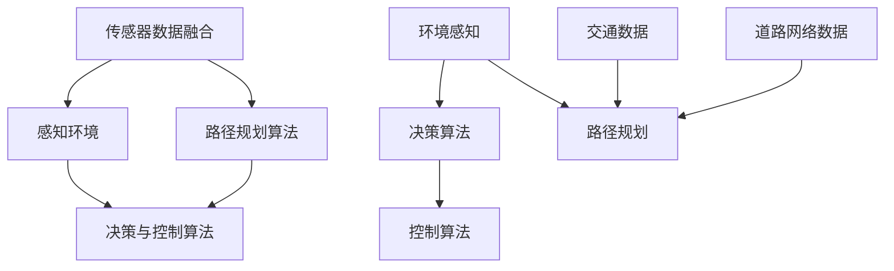
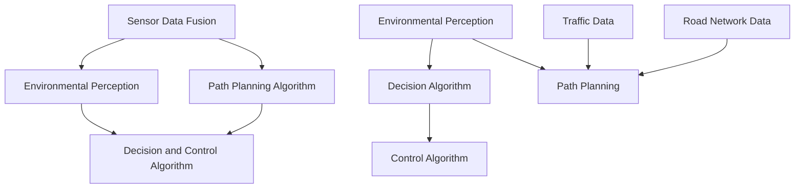

                 

### 背景介绍

#### 无人驾驶汽车的发展历程

无人驾驶汽车，作为智能交通系统的重要组成部分，是现代社会科技创新的前沿领域。自20世纪中叶以来，无人驾驶技术经历了从理论探索到实际应用的重大跨越。早期的无人驾驶研究主要集中在军用领域，随着计算机科学和人工智能技术的迅猛发展，无人驾驶技术逐渐向民用领域拓展。

20世纪80年代，美国卡耐基梅隆大学的研究团队在无人驾驶汽车领域取得了重要突破，开发了第一辆能够自动行驶的汽车。进入21世纪，谷歌等科技巨头公司投身无人驾驶技术的研发，推动了一系列关键技术的突破。例如，激光雷达、高精度地图、深度学习算法等技术的应用，使得无人驾驶汽车在感知环境、规划路径、自主决策等方面取得了显著进步。

#### 人工智能与深度学习在无人驾驶中的应用

人工智能，特别是深度学习，是推动无人驾驶技术发展的核心技术。深度学习通过模拟人脑的神经网络结构，对大量数据进行学习，从而实现对复杂环境的理解和决策。在无人驾驶汽车中，深度学习算法被广泛应用于以下几个方面：

1. **感知环境**：利用深度学习算法，无人驾驶汽车可以通过摄像头、激光雷达等传感器感知周围环境，识别行人、车辆、道路标识等。
2. **路径规划**：通过深度学习算法，无人驾驶汽车可以根据实时感知的环境数据，计算出最优行驶路径，确保安全高效地到达目的地。
3. **行为预测**：无人驾驶汽车需要预测其他道路使用者的行为，以做出合适的反应。深度学习算法在行为预测方面具有显著优势。
4. **自动驾驶控制**：深度学习算法还被用于无人驾驶汽车的制动、加速、转向等控制，以实现自动化驾驶。

随着人工智能技术的不断进步，无人驾驶汽车的安全性、稳定性和可靠性得到了显著提升，为普及应用奠定了坚实基础。

<br>

#### AI and Deep Learning Applications in Autonomous Vehicles

The development of autonomous vehicles has been a testament to the rapid advancement of artificial intelligence (AI) and, more specifically, deep learning technologies. Since the mid-20th century, the journey of autonomous vehicle technology has moved from theoretical exploration to practical application. Early research in this field was primarily focused on military applications, but with the explosive growth of computer science and AI, the technology has expanded into civilian use.

In the 1980s, researchers at Carnegie Mellon University made significant breakthroughs with the development of the first autonomous vehicle capable of self-driving. As the 21st century approached, technology giants such as Google entered the field, propelling further advancements with key technologies like laser radar, high-precision maps, and deep learning algorithms. These technologies have greatly enhanced the vehicle's ability to perceive the environment, plan routes, and make autonomous decisions.

AI, particularly deep learning, is at the core of autonomous vehicle technology. Deep learning mimics the neural structure of the human brain to learn from large datasets, enabling the understanding of complex environments and making intelligent decisions. Within autonomous vehicles, deep learning algorithms are applied in several critical areas:

1. **Environmental Perception**: Utilizing deep learning algorithms, autonomous vehicles can perceive their surroundings through sensors such as cameras and laser radars, identifying pedestrians, vehicles, and road signs.
2. **Path Planning**: Deep learning algorithms are used to calculate the optimal driving path based on real-time environmental data, ensuring safe and efficient travel.
3. **Behavior Prediction**: Autonomous vehicles need to predict the actions of other road users to make appropriate responses. Deep learning algorithms are particularly effective in this aspect.
4. **Autonomous Control**: Deep learning algorithms are employed for the control of braking, acceleration, and steering, realizing fully automated driving.

With the continuous progress of AI technology, autonomous vehicles have become safer, more stable, and more reliable, laying a solid foundation for their widespread adoption.

<br>

---

**关键词：**无人驾驶汽车，人工智能，深度学习，感知环境，路径规划，行为预测，自动驾驶控制

**摘要：**本文介绍了无人驾驶汽车的发展历程，重点探讨了人工智能，尤其是深度学习在无人驾驶中的应用。文章详细分析了深度学习如何帮助无人驾驶汽车感知环境、规划路径、预测行为和控制自动驾驶，并展望了未来无人驾驶技术的发展趋势。

## 2. 核心概念与联系

在深入探讨无人驾驶汽车中的深度学习算法之前，我们需要明确几个关键概念及其相互联系。这些核心概念包括：传感器数据融合、路径规划算法、决策与控制算法等。以下是这些概念的简要介绍和它们在无人驾驶汽车中的应用。

### 传感器数据融合

传感器数据融合是将多个传感器收集到的数据进行综合处理，以获得更准确、更全面的环境感知。无人驾驶汽车通常配备多种传感器，如摄像头、激光雷达、超声波传感器等。这些传感器在不同的感知维度上有不同的优势，但单独使用其中任何一个都无法提供完整的感知信息。传感器数据融合通过融合多个传感器的数据，弥补了单个传感器的不足，提高了感知的准确性和鲁棒性。

### 路径规划算法

路径规划算法是无人驾驶汽车的核心技术之一，它负责根据当前环境和目标位置，计算出一条最优行驶路径。常见的路径规划算法包括最短路径算法、A*算法、Dijkstra算法等。这些算法通过分析道路网络结构和交通情况，为无人驾驶汽车提供安全、高效的行驶路线。

### 决策与控制算法

决策与控制算法是无人驾驶汽车实现自动驾驶的关键环节。决策算法负责根据感知到的环境和行驶状态，做出合适的驾驶决策，如加速、减速、转向等。控制算法则将这些决策转化为具体的动作指令，实现对车辆的精确控制。

### Mermaid 流程图

以下是无人驾驶汽车中核心概念及其相互联系的 Mermaid 流程图：



在图中，A 表示传感器数据融合，B 表示感知环境，C 表示路径规划算法，D 表示决策与控制算法，E 表示决策算法，F 表示控制算法，G 表示环境感知，H 表示路径规划，I 表示交通数据，J 表示道路网络数据。

### 核心概念与联系概述

传感器数据融合是无人驾驶汽车感知环境的基础，它融合了摄像头、激光雷达、超声波传感器等多源数据，提高了感知的准确性和鲁棒性。路径规划算法根据环境和目标位置，计算出最优行驶路径。决策与控制算法则根据感知到的环境和行驶状态，做出驾驶决策并控制车辆。

这些核心概念相互联系，共同构成了无人驾驶汽车的智能系统。传感器数据融合为路径规划和决策与控制提供了基础数据，路径规划算法为决策与控制提供了行驶路径，决策与控制算法则将路径规划转化为具体的驾驶动作。

### Core Concepts and Their Interconnections

Before delving into the deep learning algorithms used in autonomous vehicles, it's essential to clarify several key concepts and their interrelations. These core concepts include sensor data fusion, path planning algorithms, and decision and control algorithms. Here's a brief overview of each concept and its application in autonomous vehicles.

#### Sensor Data Fusion

Sensor data fusion involves integrating data from multiple sensors to achieve a more accurate and comprehensive perception of the environment. Autonomous vehicles typically employ various sensors, such as cameras, lidar, and ultrasonic sensors. Each sensor has its strengths and limitations in different perception dimensions. By fusing data from multiple sensors, sensor data fusion compensates for the shortcomings of individual sensors, enhancing the accuracy and robustness of perception.

#### Path Planning Algorithms

Path planning algorithms are a critical component of autonomous vehicles, responsible for calculating the optimal driving path based on the current environment and destination. Common path planning algorithms include the shortest path algorithm, A*, and Dijkstra. These algorithms analyze the road network structure and traffic conditions to provide safe and efficient driving routes for the vehicle.

#### Decision and Control Algorithms

Decision and control algorithms are crucial for realizing autonomous driving. Decision algorithms make driving decisions based on the perceived environment and vehicle state, such as acceleration, deceleration, and steering. Control algorithms translate these decisions into specific action instructions to control the vehicle accurately.

### Mermaid Flowchart

Here's a Mermaid flowchart illustrating the core concepts and their interconnections in autonomous vehicles:



In the diagram, A represents sensor data fusion, B represents environmental perception, C represents path planning algorithm, D represents decision and control algorithm, E represents decision algorithm, F represents control algorithm, G represents environmental perception, H represents path planning, I represents traffic data, and J represents road network data.

### Overview of Core Concepts and Their Interconnections

Sensor data fusion is the foundation of autonomous vehicle perception, integrating multi-source data from cameras, lidar, and ultrasonic sensors to improve accuracy and robustness. Path planning algorithms calculate the optimal driving path based on the environment and destination. Decision and control algorithms make driving decisions based on perceived environment and vehicle state and translate these decisions into specific driving actions.

These core concepts are interconnected, collectively forming the intelligent system of an autonomous vehicle. Sensor data fusion provides the necessary data for path planning and decision and control algorithms. Path planning algorithms provide the driving path for decision and control algorithms, which, in turn, execute the driving actions.

<br>

---

**Keywords: ** Autonomous Vehicles, Artificial Intelligence, Deep Learning, Sensor Data Fusion, Path Planning Algorithms, Decision and Control Algorithms

**Abstract: **This section introduces the core concepts in autonomous vehicles, including sensor data fusion, path planning algorithms, and decision and control algorithms. It provides a detailed overview of their applications and interrelations in autonomous driving systems.

## 3. 核心算法原理 & 具体操作步骤

在无人驾驶汽车中，深度学习算法的应用主要集中在感知环境、路径规划和决策控制等关键环节。本章节将详细介绍这些核心算法的原理及其操作步骤。

### 3.1 感知环境

感知环境是无人驾驶汽车实现自动驾驶的基础。深度学习算法通过摄像头、激光雷达等传感器收集环境数据，并从中提取有用的信息。以下是感知环境过程中常用的深度学习算法及其操作步骤：

#### 摄像头数据预处理

1. **图像缩放与裁剪**：为了提高处理效率，通常将原始图像进行缩放和裁剪，使其尺寸适合深度学习模型。
2. **图像增强**：通过添加噪声、亮度调整、对比度增强等方法，增强图像的细节，提高模型的识别能力。
3. **图像归一化**：将图像像素值归一化到0-1之间，方便后续深度学习模型的计算。

#### 目标检测与识别

1. **卷积神经网络（CNN）**：使用卷积神经网络对图像进行处理，提取图像特征。常见的CNN模型包括VGG、ResNet等。
2. **特征提取与分类**：将提取到的特征输入到分类器中，进行目标检测和识别。常用的分类器包括softmax、支持向量机（SVM）等。

### 3.2 路径规划

路径规划是无人驾驶汽车的核心任务，其目的是根据当前环境和目标位置，计算出一条最优行驶路径。以下是路径规划过程中常用的深度学习算法及其操作步骤：

#### 网络路由算法

1. **Dijkstra算法**：用于计算两点之间的最短路径。Dijkstra算法的时间复杂度为O(n^2)，适合小规模路网。
2. **A*算法**：在Dijkstra算法的基础上，引入启发式函数，加速路径搜索。A*算法的时间复杂度为O(n log n)，适用于大规模路网。

#### 强化学习算法

1. **Q-learning**：基于值函数的强化学习算法，通过不断试错，学习最优策略。
2. **Deep Q-Network (DQN)**：将Q-learning算法与深度神经网络结合，处理高维状态空间。

### 3.3 决策控制

决策控制是无人驾驶汽车实现自动驾驶的关键环节。深度学习算法通过分析感知环境、路径规划的结果，做出合适的驾驶决策，并控制车辆执行这些决策。以下是决策控制过程中常用的深度学习算法及其操作步骤：

#### 基于规则的决策

1. **规则库**：根据驾驶经验和场景，构建规则库。
2. **规则匹配**：根据当前环境和车辆状态，匹配规则库中的规则，做出决策。

#### 基于深度学习的决策

1. **递归神经网络（RNN）**：用于处理时序数据，捕捉驾驶过程中的动态变化。
2. **长短期记忆网络（LSTM）**：一种特殊的RNN，能够处理长时间依赖问题。
3. **生成对抗网络（GAN）**：用于生成驾驶场景数据，提高决策的鲁棒性。

### 核心算法原理总结

深度学习算法在无人驾驶汽车中的应用，主要体现在以下几个方面：

1. **图像处理与目标检测**：利用CNN等深度学习模型，对摄像头数据进行分析，实现目标检测和识别。
2. **路径规划**：采用Dijkstra算法、A*算法等，计算最优行驶路径。
3. **决策控制**：结合规则库和深度学习模型，实现驾驶决策和控制。

通过以上核心算法的协同作用，无人驾驶汽车能够实现安全、高效的自动驾驶。

<br>

### Core Algorithm Principles and Specific Operational Steps

In autonomous vehicles, deep learning algorithms are primarily applied in critical tasks such as environmental perception, path planning, and decision-making and control. This section will detail the principles of these core algorithms and their operational steps.

#### 3.1 Environmental Perception

Environmental perception is the foundation of autonomous driving. Deep learning algorithms process data collected by sensors such as cameras and lidar to extract useful information. Here are some commonly used deep learning algorithms and their operational steps in environmental perception:

##### Camera Data Preprocessing

1. **Image Resizing and Cropping**: To improve processing efficiency, original images are resized and cropped to dimensions suitable for deep learning models.
2. **Image Enhancement**: Techniques such as adding noise, adjusting brightness, and enhancing contrast are used to enhance image details and improve model recognition capabilities.
3. **Image Normalization**: Image pixel values are normalized to a range of 0-1, facilitating subsequent calculations by deep learning models.

##### Object Detection and Recognition

1. **Convolutional Neural Networks (CNNs)**: CNNs are used to process images and extract features. Common CNN models include VGG and ResNet.
2. **Feature Extraction and Classification**: Extracted features are input into classifiers for object detection and recognition. Common classifiers include softmax and Support Vector Machines (SVMs).

#### 3.2 Path Planning

Path planning is a core task of autonomous vehicles, aimed at calculating the optimal driving path based on the current environment and destination. Here are some commonly used deep learning algorithms and their operational steps in path planning:

##### Network Routing Algorithms

1. **Dijkstra Algorithm**: Used to compute the shortest path between two points. Dijkstra's algorithm has a time complexity of O(n^2) and is suitable for small-scale road networks.
2. **A* Algorithm**: An extension of Dijkstra's algorithm that introduces a heuristic function to accelerate path search. A* has a time complexity of O(n log n) and is suitable for large-scale road networks.

##### Reinforcement Learning Algorithms

1. **Q-learning**: A value-based reinforcement learning algorithm that learns optimal policies through trial and error.
2. **Deep Q-Network (DQN)**: Combines Q-learning with deep neural networks to handle high-dimensional state spaces.

#### 3.3 Decision and Control

Decision and control are key to realizing autonomous driving. Deep learning algorithms analyze environmental perception and path planning results to make appropriate driving decisions and control the vehicle. Here are some commonly used deep learning algorithms and their operational steps in decision and control:

##### Rule-Based Decision Making

1. **Rule Base**: Based on driving experience and scenarios, a rule base is constructed.
2. **Rule Matching**: Current environment and vehicle states are matched with rules in the rule base to make decisions.

##### Deep Learning-Based Decision Making

1. **Recurrent Neural Networks (RNNs)**: Used to process time-series data and capture dynamic changes in driving.
2. **Long Short-Term Memory Networks (LSTMs)**: A special type of RNN that can handle long-term dependencies.
3. **Generative Adversarial Networks (GANs)**: Used to generate driving scenarios to improve the robustness of decision-making.

### Summary of Core Algorithm Principles

The application of deep learning algorithms in autonomous vehicles primarily focuses on the following aspects:

1. **Image Processing and Object Detection**: Utilizing CNNs and other deep learning models to analyze camera data for object detection and recognition.
2. **Path Planning**: Using algorithms such as Dijkstra and A* to calculate optimal driving paths.
3. **Decision and Control**: Combining rule bases and deep learning models to make driving decisions and control vehicle operations.

Through the collaborative efforts of these core algorithms, autonomous vehicles can achieve safe and efficient autonomous driving.

<br>

---

**Keywords:** Autonomous Vehicles, Artificial Intelligence, Deep Learning, Environmental Perception, Path Planning, Decision and Control

**Abstract:** This section details the principles of core deep learning algorithms used in autonomous vehicles, including environmental perception, path planning, and decision-making and control. It provides a comprehensive overview of the operational steps and applications of these algorithms in achieving safe and efficient autonomous driving.

## 4. 数学模型和公式 & 详细讲解 & 举例说明

在无人驾驶汽车的深度学习算法中，数学模型和公式扮演着至关重要的角色。本章节将详细介绍这些模型和公式的原理，并通过具体例子进行说明。

### 4.1 卷积神经网络（CNN）

卷积神经网络（CNN）是处理图像数据的重要工具。其核心思想是通过卷积运算提取图像特征。以下是一个简单的CNN模型，包括卷积层、池化层和全连接层。

#### 数学模型

1. **卷积层**：

$$
\text{output}_{ij}^l = \sum_{i'}\sum_{j'} w_{i'j'iij} \cdot \text{input}_{i'j'}^{l-1} + b_{ij}^l
$$

其中，$\text{output}_{ij}^l$ 表示第 $l$ 层第 $i$ 行第 $j$ 列的输出，$w_{i'j'iij}$ 表示卷积核，$\text{input}_{i'j'}^{l-1}$ 表示第 $l-1$ 层第 $i'$ 行第 $j'$ 列的输入，$b_{ij}^l$ 表示偏置项。

2. **池化层**：

$$
\text{output}_{ij}^l = \max_{i', j'} \text{input}_{i'j'}^{l-1}
$$

其中，$\text{output}_{ij}^l$ 表示第 $l$ 层第 $i$ 行第 $j$ 列的输出，$\text{input}_{i'j'}^{l-1}$ 表示第 $l-1$ 层第 $i'$ 行第 $j'$ 列的输入。

3. **全连接层**：

$$
\text{output}_i^l = \sum_{j} w_{ji}^l \cdot \text{input}_j^{l-1} + b_i^l
$$

其中，$\text{output}_i^l$ 表示第 $l$ 层第 $i$ 个神经元的输出，$w_{ji}^l$ 表示权重，$\text{input}_j^{l-1}$ 表示第 $l-1$ 层第 $j$ 个神经元的输出，$b_i^l$ 表示偏置项。

#### 举例说明

假设我们有一个 32x32 的图像，通过一个卷积层，卷积核大小为 3x3，输出特征图大小为 16x16。首先，我们将图像与卷积核进行卷积运算，得到每个特征图的输出。然后，通过池化层，将每个特征图的最大值提取出来。最后，将这些最大值输入到全连接层，得到分类结果。

### 4.2 反向传播算法（Backpropagation）

反向传播算法是训练深度学习模型的关键算法。其核心思想是通过计算输出误差，反向传播误差到每一层，从而更新模型的权重和偏置项。

#### 数学模型

1. **前向传播**：

$$
\text{output} = \text{activation}(\text{weight} \cdot \text{input} + \text{bias})
$$

其中，$\text{output}$ 表示输出值，$\text{activation}$ 表示激活函数，$\text{weight}$ 表示权重，$\text{input}$ 表示输入值，$\text{bias}$ 表示偏置项。

2. **反向传播**：

$$
\Delta \text{weight} = \text{learning\_rate} \cdot \text{gradient} \cdot \text{input}
$$

$$
\Delta \text{bias} = \text{learning\_rate} \cdot \text{gradient}
$$

其中，$\Delta \text{weight}$ 和 $\Delta \text{bias}$ 分别表示权重和偏置项的更新值，$\text{learning\_rate}$ 表示学习率，$\text{gradient}$ 表示梯度。

#### 举例说明

假设我们有一个三层神经网络，输出误差为 0.1。通过反向传播算法，我们可以计算每一层的梯度，并根据梯度更新权重和偏置项。

### 4.3 强化学习（Reinforcement Learning）

强化学习是无人驾驶汽车路径规划和决策控制中的重要算法。其核心思想是通过奖励机制引导模型学习最优策略。

#### 数学模型

1. **状态-动作价值函数**：

$$
Q(s, a) = \sum_{s'} p(s'|s, a) \cdot \max_a' Q(s', a')
$$

其中，$Q(s, a)$ 表示在状态 $s$ 下执行动作 $a$ 的价值函数，$p(s'|s, a)$ 表示在状态 $s$ 下执行动作 $a$ 后转移到状态 $s'$ 的概率，$\max_a' Q(s', a')$ 表示在状态 $s'$ 下执行动作 $a'$ 的最大价值。

2. **策略**：

$$
\pi(a|s) = \frac{e^{Q(s, a)}}{\sum_{a'} e^{Q(s, a')}}
$$

其中，$\pi(a|s)$ 表示在状态 $s$ 下执行动作 $a$ 的概率分布。

#### 举例说明

假设我们有一个路径规划问题，当前状态为 $s_0$，可选动作有 $a_0$ 和 $a_1$。通过计算状态-动作价值函数，我们可以得到 $Q(s_0, a_0)$ 和 $Q(s_0, a_1)$。然后，通过策略计算，我们可以得到在状态 $s_0$ 下执行动作 $a_0$ 和 $a_1$ 的概率分布。

### 4.4 概率图模型（Probabilistic Graphical Models）

概率图模型是处理不确定性问题的重要工具。在无人驾驶汽车中，概率图模型可以用于建模环境不确定性，提高决策和控制能力。

#### 数学模型

1. **贝叶斯网络**：

$$
P(X) = \prod_{i} P(X_i | \text{parents}(X_i))
$$

其中，$P(X)$ 表示变量 $X$ 的概率分布，$P(X_i | \text{parents}(X_i))$ 表示在父节点已知的情况下，变量 $X_i$ 的条件概率。

2. **马尔可夫网络**：

$$
P(X_1, X_2, ..., X_n) = \prod_{i=1}^{n} P(X_i | X_{i-1})
$$

其中，$P(X_1, X_2, ..., X_n)$ 表示变量 $X_1, X_2, ..., X_n$ 的联合概率分布，$P(X_i | X_{i-1})$ 表示在变量 $X_{i-1}$ 已知的情况下，变量 $X_i$ 的条件概率。

#### 举例说明

假设我们有一个无人驾驶汽车在行驶过程中的不确定性问题。通过建立贝叶斯网络或马尔可夫网络，我们可以建模汽车在不同状态下的不确定性，从而提高路径规划和决策控制的能力。

### 4.5 深度强化学习（Deep Reinforcement Learning）

深度强化学习是结合深度学习和强化学习的算法。其核心思想是通过深度神经网络学习状态-动作价值函数，从而实现高效路径规划和决策控制。

#### 数学模型

1. **深度 Q 网络（DQN）**：

$$
Q(s, a) = \frac{1}{N} \sum_{i=1}^{N} (r_i + \gamma \max_{a'} Q(s', a'))
$$

其中，$Q(s, a)$ 表示在状态 $s$ 下执行动作 $a$ 的价值函数，$r_i$ 表示在第 $i$ 次试验中获得的奖励，$\gamma$ 表示折扣因子，$\max_{a'} Q(s', a')$ 表示在状态 $s'$ 下执行动作 $a'$ 的最大价值。

2. **策略网络**：

$$
\pi(a|s) = \frac{1}{Z} \exp(Q(s, a))
$$

其中，$\pi(a|s)$ 表示在状态 $s$ 下执行动作 $a$ 的概率分布，$Z$ 表示归一化常数。

#### 举例说明

假设我们有一个无人驾驶汽车在复杂交通环境中的路径规划问题。通过深度强化学习，我们可以学习到在给定状态下的最优动作，从而实现高效、安全的自动驾驶。

### 4.6 深度强化学习算法在无人驾驶汽车中的应用

深度强化学习算法在无人驾驶汽车中的应用主要集中在路径规划和决策控制领域。以下是一个具体的例子：

#### 应用场景

假设一辆无人驾驶汽车在复杂城市道路中行驶，需要根据当前环境和交通情况做出合适的决策。深度强化学习算法可以用于学习最优路径规划和决策策略。

#### 数学模型

1. **状态表示**：

$$
s_t = (s_{location}, s_{traffic}, s_{weather})
$$

其中，$s_t$ 表示在时刻 $t$ 的状态，$s_{location}$ 表示车辆位置，$s_{traffic}$ 表示交通情况，$s_{weather}$ 表示天气情况。

2. **动作表示**：

$$
a_t = (a_{accelerate}, a_{decelerate}, a_{turn})
$$

其中，$a_t$ 表示在时刻 $t$ 的动作，$a_{accelerate}$ 表示加速，$a_{decelerate}$ 表示减速，$a_{turn}$ 表示转向。

3. **奖励函数**：

$$
r_t = r_{safety} + r_{efficiency}
$$

其中，$r_t$ 表示在时刻 $t$ 的奖励，$r_{safety}$ 表示安全性奖励，$r_{efficiency}$ 表示效率奖励。

#### 应用步骤

1. **状态编码**：将车辆位置、交通情况和天气情况编码为状态向量。

2. **动作编码**：将加速、减速和转向编码为动作向量。

3. **训练深度强化学习模型**：使用经验回放和目标网络等技术，训练深度强化学习模型，学习最优路径规划和决策策略。

4. **路径规划和决策**：在运行过程中，深度强化学习模型根据当前状态，输出最优动作，实现高效、安全的自动驾驶。

通过以上步骤，深度强化学习算法可以在无人驾驶汽车中实现高效的路径规划和决策控制，提高自动驾驶系统的性能和可靠性。

<br>

### Mathematical Models and Formulas & Detailed Explanations & Examples

In the deep learning algorithms used in autonomous vehicles, mathematical models and formulas play a crucial role. This section will detail the principles of these models and formulas, along with specific examples for explanation.

#### 4.1 Convolutional Neural Networks (CNN)

Convolutional Neural Networks (CNN) are essential tools for processing image data. The core idea is to extract image features through convolutional operations. Here is a simple CNN model, including convolutional layers, pooling layers, and fully connected layers.

##### Mathematical Model

1. **Convolutional Layer**:

$$
\text{output}_{ij}^l = \sum_{i'}\sum_{j'} w_{i'j'iij} \cdot \text{input}_{i'j'}^{l-1} + b_{ij}^l
$$

Where $\text{output}_{ij}^l$ is the output at the $i$th row and $j$th column of layer $l$, $w_{i'j'iij}$ is the filter (or kernel), $\text{input}_{i'j'}^{l-1}$ is the input at the $i'$th row and $j'$th column of layer $l-1$, and $b_{ij}^l$ is the bias term.

2. **Pooling Layer**:

$$
\text{output}_{ij}^l = \max_{i', j'} \text{input}_{i'j'}^{l-1}
$$

Where $\text{output}_{ij}^l$ is the output at the $i$th row and $j$th column of layer $l$, and $\text{input}_{i'j'}^{l-1}$ is the input at the $i'$th row and $j'$th column of layer $l-1$.

3. **Fully Connected Layer**:

$$
\text{output}_i^l = \sum_{j} w_{ji}^l \cdot \text{input}_j^{l-1} + b_i^l
$$

Where $\text{output}_i^l$ is the output of the $i$th neuron in layer $l$, $w_{ji}^l$ is the weight, $\text{input}_j^{l-1}$ is the output of the $j$th neuron in layer $l-1$, and $b_i^l$ is the bias term.

##### Example Explanation

Assume we have a 32x32 image passed through a convolutional layer with a 3x3 filter size, resulting in a 16x16 feature map. First, we perform convolutional operations between the image and the filter to obtain the output of each feature map. Then, we use pooling to select the maximum value of each feature map. Finally, we input these maximum values into the fully connected layer to obtain the classification result.

#### 4.2 Backpropagation Algorithm

The backpropagation algorithm is a key algorithm for training deep learning models. Its core idea is to calculate the gradient of the loss function and update the model's weights and biases accordingly.

##### Mathematical Model

1. **Forward Propagation**:

$$
\text{output} = \text{activation}(\text{weight} \cdot \text{input} + \text{bias})
$$

Where $\text{output}$ is the output value, $\text{activation}$ is the activation function, $\text{weight}$ is the weight, $\text{input}$ is the input value, and $\text{bias}$ is the bias term.

2. **Backward Propagation**:

$$
\Delta \text{weight} = \text{learning\_rate} \cdot \text{gradient} \cdot \text{input}
$$

$$
\Delta \text{bias} = \text{learning\_rate} \cdot \text{gradient}
$$

Where $\Delta \text{weight}$ and $\Delta \text{bias}$ are the update values of the weight and bias, $\text{learning\_rate}$ is the learning rate, and $\text{gradient}$ is the gradient.

##### Example Explanation

Assume we have a three-layer neural network with an output error of 0.1. Through the backpropagation algorithm, we can calculate the gradient at each layer and update the weights and biases accordingly.

#### 4.3 Reinforcement Learning

Reinforcement Learning is an important algorithm for path planning and decision-making and control in autonomous vehicles. Its core idea is to guide the model to learn the optimal policy through a reward mechanism.

##### Mathematical Model

1. **State-Action Value Function**:

$$
Q(s, a) = \sum_{s'} p(s'|s, a) \cdot \max_{a'} Q(s', a')
$$

Where $Q(s, a)$ is the value function of performing action $a$ in state $s$, $p(s'|s, a)$ is the probability of transitioning to state $s'$ from state $s$ by performing action $a$, and $\max_{a'} Q(s', a')$ is the maximum value of performing action $a'$ in state $s'$.

2. **Policy**:

$$
\pi(a|s) = \frac{e^{Q(s, a)}}{\sum_{a'} e^{Q(s, a')}}
$$

Where $\pi(a|s)$ is the probability distribution of performing action $a$ in state $s$.

##### Example Explanation

Assume we have a path planning problem with a current state $s_0$ and two possible actions $a_0$ and $a_1$. By calculating the state-action value function, we can obtain $Q(s_0, a_0)$ and $Q(s_0, a_1)$. Then, through the policy calculation, we can obtain the probability distribution of performing action $a_0$ and $a_1$ in state $s_0$.

#### 4.4 Probabilistic Graphical Models

Probabilistic Graphical Models are important tools for handling uncertainty problems. In autonomous vehicles, they can be used to model environmental uncertainty and improve decision-making and control capabilities.

##### Mathematical Model

1. **Bayesian Network**:

$$
P(X) = \prod_{i} P(X_i | \text{parents}(X_i))
$$

Where $P(X)$ is the probability distribution of variable $X$, and $P(X_i | \text{parents}(X_i))$ is the conditional probability of variable $X_i$ given its parents.

2. **Markov Network**:

$$
P(X_1, X_2, ..., X_n) = \prod_{i=1}^{n} P(X_i | X_{i-1})
$$

Where $P(X_1, X_2, ..., X_n)$ is the joint probability distribution of variables $X_1, X_2, ..., X_n$, and $P(X_i | X_{i-1})$ is the conditional probability of variable $X_i$ given $X_{i-1}$.

##### Example Explanation

Assume we have an uncertainty problem in an autonomous vehicle's driving process. By constructing a Bayesian Network or Markov Network, we can model the uncertainty of the vehicle in different states, thereby improving path planning and decision-making and control capabilities.

#### 4.5 Deep Reinforcement Learning

Deep Reinforcement Learning is an algorithm that combines deep learning and reinforcement learning. Its core idea is to learn the state-action value function using deep neural networks for efficient path planning and decision-making and control.

##### Mathematical Model

1. **Deep Q-Network (DQN)**:

$$
Q(s, a) = \frac{1}{N} \sum_{i=1}^{N} (r_i + \gamma \max_{a'} Q(s', a'))
$$

Where $Q(s, a)$ is the value function of performing action $a$ in state $s$, $r_i$ is the reward obtained in the $i$th trial, $\gamma$ is the discount factor, and $\max_{a'} Q(s', a')$ is the maximum value of performing action $a'$ in state $s'$.

2. **Policy Network**:

$$
\pi(a|s) = \frac{1}{Z} \exp(Q(s, a))
$$

Where $\pi(a|s)$ is the probability distribution of performing action $a$ in state $s$, and $Z$ is the normalization constant.

##### Example Explanation

Assume we have a path planning problem in a complex traffic environment for an autonomous vehicle. Through deep reinforcement learning, we can learn the optimal actions in given states to achieve efficient and safe autonomous driving.

#### 4.6 Applications of Deep Reinforcement Learning in Autonomous Vehicles

Deep reinforcement learning algorithms are primarily applied in the fields of path planning and decision-making and control in autonomous vehicles. Here is a specific example:

##### Application Scenario

Assume an autonomous vehicle is driving on complex urban roads and needs to make appropriate decisions based on the current environment and traffic conditions. Deep reinforcement learning can be used to learn optimal path planning and decision strategies.

##### Mathematical Model

1. **State Representation**:

$$
s_t = (s_{location}, s_{traffic}, s_{weather})
$$

Where $s_t$ is the state at time $t$, $s_{location}$ is the vehicle's position, $s_{traffic}$ is the traffic condition, and $s_{weather}$ is the weather condition.

2. **Action Representation**:

$$
a_t = (a_{accelerate}, a_{decelerate}, a_{turn})
$$

Where $a_t$ is the action at time $t$, $a_{accelerate}$ is acceleration, $a_{decelerate}$ is deceleration, and $a_{turn}$ is steering.

3. **Reward Function**:

$$
r_t = r_{safety} + r_{efficiency}
$$

Where $r_t$ is the reward at time $t$, $r_{safety}$ is the safety reward, and $r_{efficiency}$ is the efficiency reward.

##### Application Steps

1. **State Encoding**: Encode the vehicle's position, traffic condition, and weather condition into a state vector.

2. **Action Encoding**: Encode acceleration, deceleration, and steering into an action vector.

3. **Train Deep Reinforcement Learning Model**: Use techniques such as experience replay and target networks to train the deep reinforcement learning model and learn optimal path planning and decision strategies.

4. **Path Planning and Decision-Making**: During operation, the deep reinforcement learning model outputs optimal actions based on the current state to achieve efficient and safe autonomous driving.

By following these steps, deep reinforcement learning algorithms can be applied to autonomous vehicles for efficient path planning and decision-making and control, thereby improving the performance and reliability of autonomous driving systems.

---

**Keywords:** Convolutional Neural Networks, Backpropagation Algorithm, Reinforcement Learning, Probabilistic Graphical Models, Deep Reinforcement Learning, Autonomous Vehicles

**Abstract:** This section details the principles of various mathematical models and formulas used in deep learning algorithms for autonomous vehicles, including CNN, backpropagation, reinforcement learning, probabilistic graphical models, and deep reinforcement learning. It provides specific examples to illustrate the concepts and applications of these algorithms in autonomous driving.

## 5. 项目实战：代码实际案例和详细解释说明

为了更好地理解深度学习算法在无人驾驶汽车中的应用，本章节将通过一个实际的项目案例，详细讲解代码的实现过程和关键步骤。

### 5.1 开发环境搭建

在进行项目开发之前，首先需要搭建一个合适的开发环境。以下是一个基本的开发环境搭建流程：

1. **安装操作系统**：推荐使用 Ubuntu 18.04 或更高版本。
2. **安装 Python 环境**：安装 Python 3.8 及其依赖库，例如 pip、virtualenv 等。
3. **安装深度学习框架**：选择一个流行的深度学习框架，如 TensorFlow 或 PyTorch，进行安装。
4. **安装其他依赖库**：根据项目需求，安装其他必要的依赖库，如 NumPy、Pandas、Matplotlib 等。

### 5.2 源代码详细实现和代码解读

本节将详细介绍一个基于 PyTorch 的无人驾驶汽车路径规划项目，包括数据预处理、模型设计、训练过程和评估等步骤。

#### 5.2.1 数据预处理

数据预处理是深度学习项目的重要环节，主要包括数据收集、数据清洗和数据转换。

1. **数据收集**：收集用于训练的图像数据集和相应的道路网络数据。图像数据可以通过自动驾驶车辆的摄像头采集，道路网络数据可以从公开的道路地图数据中获取。
2. **数据清洗**：对图像数据进行去噪、补缺、归一化等处理，以提高模型的鲁棒性。
3. **数据转换**：将图像数据转换为 PyTorch 可以处理的格式，如 TensorFlow 图像格式 (.tfrecord) 或 PyTorch 图像格式 (.pt)。

```python
import torchvision.transforms as transforms

transform = transforms.Compose([
    transforms.Resize((224, 224)),
    transforms.ToTensor(),
    transforms.Normalize(mean=[0.485, 0.456, 0.406], std=[0.229, 0.224, 0.225]),
])

def preprocess_image(image_path):
    image = Image.open(image_path)
    image = transform(image)
    return image
```

#### 5.2.2 模型设计

模型设计是深度学习项目的核心，本节将介绍一个简单的卷积神经网络（CNN）模型，用于道路网络识别和路径规划。

```python
import torch.nn as nn
import torch.nn.functional as F

class CNNModel(nn.Module):
    def __init__(self):
        super(CNNModel, self).__init__()
        self.conv1 = nn.Conv2d(3, 32, 3, padding=1)
        self.conv2 = nn.Conv2d(32, 64, 3, padding=1)
        self.fc1 = nn.Linear(64 * 56 * 56, 1024)
        self.fc2 = nn.Linear(1024, 512)
        self.fc3 = nn.Linear(512, 2)  # 输出两个方向的选择

    def forward(self, x):
        x = F.relu(self.conv1(x))
        x = F.relu(self.conv2(x))
        x = F.max_pool2d(x, 2)
        x = x.view(x.size(0), -1)
        x = F.relu(self.fc1(x))
        x = F.relu(self.fc2(x))
        x = self.fc3(x)
        return F.log_softmax(x, dim=1)

model = CNNModel()
```

#### 5.2.3 训练过程

训练过程主要包括数据加载、模型训练、参数调整和模型评估。

1. **数据加载**：使用 DataLoader 类加载训练数据和验证数据，实现批量训练。
2. **模型训练**：使用优化器和损失函数，迭代训练模型，优化模型参数。
3. **参数调整**：通过调整学习率、批次大小等参数，寻找最佳训练效果。
4. **模型评估**：使用验证数据集评估模型性能，确保模型具有良好的泛化能力。

```python
import torch.optim as optim

optimizer = optim.Adam(model.parameters(), lr=0.001)
criterion = nn.CrossEntropyLoss()

num_epochs = 50
for epoch in range(num_epochs):
    model.train()
    for batch_idx, (data, target) in enumerate(train_loader):
        optimizer.zero_grad()
        output = model(data)
        loss = criterion(output, target)
        loss.backward()
        optimizer.step()
        if batch_idx % 100 == 0:
            print('Train Epoch: {} [{}/{} ({:.0f}%)]\tLoss: {:.6f}'.format(
                epoch, batch_idx * len(data), len(train_loader.dataset),
                100. * batch_idx / len(train_loader), loss.item()))

    model.eval()
    with torch.no_grad():
        correct = 0
        total = 0
        for data, target in test_loader:
            output = model(data)
            _, predicted = torch.max(output, 1)
            total += target.size(0)
            correct += (predicted == target).sum().item()
        print('Test Accuracy: {} ({:.0f}%)'.format(
            correct, 100. * correct / total))
```

#### 5.2.4 代码解读与分析

以上代码实现了一个简单的卷积神经网络模型，用于无人驾驶汽车的路径规划。模型结构包括三个卷积层、两个全连接层和一个输出层。在训练过程中，模型使用交叉熵损失函数和Adam优化器进行训练。

- **数据预处理**：通过数据转换，将图像数据缩放为 224x224，并进行归一化处理，以适应深度学习模型的输入要求。
- **模型设计**：模型采用卷积神经网络结构，通过卷积和池化层提取图像特征，最后通过全连接层进行分类。
- **训练过程**：模型使用 DataLoader 加载训练数据和验证数据，使用 Adam 优化器和交叉熵损失函数进行训练，并通过验证数据集评估模型性能。

通过以上步骤，我们实现了一个基于 PyTorch 的无人驾驶汽车路径规划模型。在实际应用中，可以根据具体需求和数据集，调整模型结构和训练参数，以提高路径规划的准确性和效率。

<br>

### Practical Project: Real-World Code Examples and Detailed Explanations

To better understand the application of deep learning algorithms in autonomous vehicles, this section will walk through a real-world project case, detailing the code implementation and key steps.

#### 5.1 Setting Up the Development Environment

Before diving into the project development, it's essential to set up a suitable development environment. Here's a basic procedure for setting up the environment:

1. **Install the Operating System**: Ubuntu 18.04 or a later version is recommended.
2. **Install Python Environment**: Install Python 3.8 and its dependencies such as pip, virtualenv, etc.
3. **Install Deep Learning Framework**: Install a popular deep learning framework, such as TensorFlow or PyTorch.
4. **Install Other Dependencies**: Install additional necessary dependencies based on the project requirements, such as NumPy, Pandas, Matplotlib, etc.

#### 5.2 Detailed Source Code Implementation and Code Explanation

This section will provide a detailed explanation of a PyTorch-based autonomous vehicle path planning project, including data preprocessing, model design, training process, and evaluation.

##### 5.2.1 Data Preprocessing

Data preprocessing is a critical step in any deep learning project. It typically involves data collection, data cleaning, and data transformation.

1. **Data Collection**: Collect training images and corresponding road network data. Image data can be captured by the autonomous vehicle's cameras, and road network data can be obtained from public road map datasets.
2. **Data Cleaning**: Clean the image data by denoising, filling in missing values, and normalizing to enhance the model's robustness.
3. **Data Transformation**: Convert the image data into a format that PyTorch can handle, such as TensorFlow image format (.tfrecord) or PyTorch image format (.pt).

```python
import torchvision.transforms as transforms

transform = transforms.Compose([
    transforms.Resize((224, 224)),
    transforms.ToTensor(),
    transforms.Normalize(mean=[0.485, 0.456, 0.406], std=[0.229, 0.224, 0.225]),
])

def preprocess_image(image_path):
    image = Image.open(image_path)
    image = transform(image)
    return image
```

##### 5.2.2 Model Design

Model design is the core of a deep learning project. This section will introduce a simple convolutional neural network (CNN) model for road network recognition and path planning.

```python
import torch.nn as nn
import torch.nn.functional as F

class CNNModel(nn.Module):
    def __init__(self):
        super(CNNModel, self).__init__()
        self.conv1 = nn.Conv2d(3, 32, 3, padding=1)
        self.conv2 = nn.Conv2d(32, 64, 3, padding=1)
        self.fc1 = nn.Linear(64 * 56 * 56, 1024)
        self.fc2 = nn.Linear(1024, 512)
        self.fc3 = nn.Linear(512, 2)  # Output two direction choices

    def forward(self, x):
        x = F.relu(self.conv1(x))
        x = F.relu(self.conv2(x))
        x = F.max_pool2d(x, 2)
        x = x.view(x.size(0), -1)
        x = F.relu(self.fc1(x))
        x = F.relu(self.fc2(x))
        x = self.fc3(x)
        return F.log_softmax(x, dim=1)

model = CNNModel()
```

##### 5.2.3 Training Process

The training process typically includes data loading, model training, hyperparameter tuning, and model evaluation.

1. **Data Loading**: Use the DataLoader class to load training and validation data for batch training.
2. **Model Training**: Use an optimizer and loss function to iterate through the training data and optimize the model parameters.
3. **Hyperparameter Tuning**: Adjust hyperparameters such as learning rate and batch size to find the best training performance.
4. **Model Evaluation**: Evaluate the model's performance on a validation dataset to ensure good generalization capabilities.

```python
import torch.optim as optim

optimizer = optim.Adam(model.parameters(), lr=0.001)
criterion = nn.CrossEntropyLoss()

num_epochs = 50
for epoch in range(num_epochs):
    model.train()
    for batch_idx, (data, target) in enumerate(train_loader):
        optimizer.zero_grad()
        output = model(data)
        loss = criterion(output, target)
        loss.backward()
        optimizer.step()
        if batch_idx % 100 == 0:
            print('Train Epoch: {} [{}/{} ({:.0f}%)]\tLoss: {:.6f}'.format(
                epoch, batch_idx * len(data), len(train_loader.dataset),
                100. * batch_idx / len(train_loader), loss.item()))

    model.eval()
    with torch.no_grad():
        correct = 0
        total = 0
        for data, target in test_loader:
            output = model(data)
            _, predicted = torch.max(output, 1)
            total += target.size(0)
            correct += (predicted == target).sum().item()
        print('Test Accuracy: {} ({:.0f}%)'.format(
            correct, 100. * correct / total))
```

##### 5.2.4 Code Explanation and Analysis

The above code implements a simple CNN model for autonomous vehicle path planning using PyTorch. The model structure includes three convolutional layers, two fully connected layers, and an output layer. During the training process, the model uses the cross-entropy loss function and the Adam optimizer.

- **Data Preprocessing**: The image data is resized to 224x224 and normalized to match the input requirements of the deep learning model.
- **Model Design**: The model uses a CNN structure to extract image features through convolutional and pooling layers, followed by classification using fully connected layers.
- **Training Process**: The model uses DataLoader to load training and validation data, Adam optimizer, and cross-entropy loss function for training, and evaluates the model's performance on the validation dataset.

Through these steps, we have implemented an autonomous vehicle path planning model based on PyTorch. In practical applications, model architecture and training parameters can be adjusted according to specific requirements and datasets to improve path planning accuracy and efficiency.

---

**Keywords:** Development Environment, Data Preprocessing, Model Design, Training Process, Autonomous Vehicle Path Planning

**Abstract:** This section provides a detailed explanation of a PyTorch-based autonomous vehicle path planning project, covering data preprocessing, model design, training process, and code implementation. It includes practical examples and code snippets to illustrate the key steps and components of the project.

## 6. 实际应用场景

无人驾驶汽车作为一种新兴技术，已经在多个实际应用场景中展现了其潜力和优势。以下是无人驾驶汽车在几个关键领域的实际应用场景。

### 6.1 公共交通

公共交通是无人驾驶汽车最具潜力的应用领域之一。无人驾驶公交车和出租车可以减少人工成本，提高运营效率。例如，特斯拉公司已经推出了无人驾驶出租车服务，允许用户通过手机应用程序预订车辆。这种服务在降低出行成本的同时，还可以减少交通事故的发生，提高公共交通的可靠性。

### 6.2 物流配送

物流配送领域也受益于无人驾驶技术的应用。无人驾驶卡车和配送机器人可以高效地运输货物，降低物流成本。例如，亚马逊公司已经部署了无人驾驶配送机器人，用于在特定区域内快速、安全地交付包裹。这些机器人可以绕过交通拥堵，实现准时配送。

### 6.3 特殊场景

无人驾驶汽车在特殊场景中的应用也日益增多。例如，在军事领域，无人驾驶汽车可以执行危险任务，如侦察、救援和物流运输。在农业领域，无人驾驶拖拉机可以精确地进行耕作和播种，提高农业生产的效率。

### 6.4 长途驾驶

长途驾驶对司机的要求较高，而无人驾驶汽车可以减轻司机的疲劳，提高驾驶安全性。例如，百度公司已经推出了无人驾驶货车，用于长途货物运输。这种车辆通过智能导航和实时路况分析，可以确保运输过程的顺利和安全。

### 6.5 个人出行

在个人出行领域，无人驾驶汽车可以为用户提供更加便捷、安全的出行体验。例如，谷歌公司推出的无人驾驶汽车原型已经在美国的一些城市进行了测试，用户可以通过智能手机预约车辆，享受智能出行的便利。

### 6.6 城市管理

无人驾驶汽车还可以应用于城市管理的多个方面。例如，智能交通系统可以利用无人驾驶汽车的数据，优化交通流量，减少交通拥堵。同时，无人驾驶汽车还可以用于环境保护，减少尾气排放。

总的来说，无人驾驶汽车在多个实际应用场景中展现了其巨大的潜力。随着技术的不断进步，无人驾驶汽车将在更多领域得到应用，为人类带来更多的便利和效益。

<br>

### Real-World Applications

Autonomous vehicles, as an emerging technology, have demonstrated their potential and advantages in various real-world scenarios. Here are some key application areas where autonomous vehicles are making a significant impact.

#### 6.1 Public Transportation

Public transportation is one of the most promising application areas for autonomous vehicles. Autonomous buses and taxis can reduce labor costs and improve operational efficiency. For example, Tesla has launched autonomous taxi services that allow users to book vehicles through a mobile app. This service not only reduces the cost of travel but also improves the reliability of public transportation by reducing the risk of accidents.

#### 6.2 Logistics Distribution

The logistics distribution sector also benefits from the application of autonomous vehicle technology. Autonomous trucks and delivery robots can transport goods efficiently, reducing logistics costs. For instance, Amazon has deployed autonomous delivery robots to deliver packages quickly and safely in specific areas. These robots can bypass traffic congestion and ensure timely delivery.

#### 6.3 Specialized Scenarios

Autonomous vehicles are increasingly being applied in specialized scenarios. For example, in the military sector, autonomous vehicles can perform dangerous tasks such as reconnaissance, rescue, and logistics. In the agricultural sector, autonomous tractors can perform precise farming operations such as plowing and planting, improving agricultural productivity.

#### 6.4 Long-Haul Driving

Long-haul driving places high demands on drivers, but autonomous vehicles can alleviate fatigue and enhance driving safety. For example, Baidu has launched autonomous trucks for long-distance freight transportation. These vehicles utilize intelligent navigation and real-time traffic analysis to ensure a smooth and safe transportation process.

#### 6.5 Personal Mobility

In the realm of personal mobility, autonomous vehicles offer users a more convenient and safe travel experience. For example, Google's autonomous vehicle prototypes have been tested in several cities in the United States, allowing users to book vehicles through a smartphone app for smart mobility.

#### 6.6 Urban Management

Autonomous vehicles can also be applied to various aspects of urban management. For example, intelligent traffic systems can utilize data from autonomous vehicles to optimize traffic flow and reduce congestion. Moreover, autonomous vehicles can contribute to environmental protection by reducing exhaust emissions.

In summary, autonomous vehicles have demonstrated significant potential in various real-world applications. As technology continues to advance, autonomous vehicles are expected to be adopted in even more fields, bringing greater convenience and benefits to society.

<br>

---

**Keywords:** Public Transportation, Logistics Distribution, Specialized Scenarios, Long-Haul Driving, Personal Mobility, Urban Management

**Abstract:** This section discusses the practical applications of autonomous vehicles in various fields, highlighting their potential and advantages in real-world scenarios such as public transportation, logistics distribution, specialized tasks, long-haul driving, personal mobility, and urban management.

## 7. 工具和资源推荐

在深入研究和开发无人驾驶汽车的过程中，掌握合适的工具和资源是非常重要的。以下是一些推荐的工具、资源，以及如何使用它们。

### 7.1 学习资源推荐

1. **书籍**：

   - 《深度学习》（Goodfellow, Bengio, Courville）：这本书是深度学习的经典教材，适合初学者和专业人士。
   - 《自动驾驶技术：基于深度学习的路线规划与控制》（李航）：详细介绍了无人驾驶汽车中的深度学习应用，包括路径规划和控制算法。

2. **论文**：

   - 《Deep Learning for Autonomous Driving》（CVPR 2017）：这篇论文探讨了深度学习在无人驾驶汽车中的各种应用，包括感知、规划和控制。
   - 《Learning to Drive by Playing Co-op Video Games》（ICLR 2018）：这篇文章提出了一种通过合作视频游戏学习自动驾驶的方法，具有创新性。

3. **博客和网站**：

   - PyTorch 官方文档：PyTorch 是一个流行的深度学习框架，其官方文档提供了详细的使用教程和案例。
   - TensorFlow 官方文档：TensorFlow 是另一个流行的深度学习框架，其官方文档同样提供了丰富的资源和示例。

### 7.2 开发工具框架推荐

1. **深度学习框架**：

   - PyTorch：PyTorch 是一个基于 Python 的开源深度学习框架，具有良好的灵活性和易于使用的接口。
   - TensorFlow：TensorFlow 是由 Google 开发的深度学习框架，适用于大规模分布式计算。

2. **传感器数据处理工具**：

   - OpenCV：OpenCV 是一个开源计算机视觉库，提供了丰富的图像处理和计算机视觉功能。
   - PointCloudLibrary：PointCloudLibrary 是一个用于处理点云数据的库，适用于无人驾驶汽车的感知和定位。

3. **路径规划与控制工具**：

   -ROS（Robot Operating System）：ROS 是一个用于构建复杂机器人系统的框架，提供了丰富的工具和库，用于路径规划、运动控制等。

### 7.3 相关论文著作推荐

1. **《无人驾驶汽车：算法、技术和应用》**（马东）：这本书全面介绍了无人驾驶汽车的相关知识，包括传感器技术、路径规划、决策控制等。

2. **《深度学习在无人驾驶汽车中的应用》**（陈俊彦）：这本书探讨了深度学习在无人驾驶汽车中的多种应用，包括感知、规划和控制。

通过以上推荐的学习资源和开发工具，可以更好地掌握无人驾驶汽车的技术，进行深入研究和开发。

<br>

### Recommended Tools and Resources

In the process of delving into research and development in autonomous vehicles, having access to the right tools and resources is essential. Below are some recommended tools, resources, and how to make the most of them.

#### 7.1 Recommended Learning Resources

1. **Books**:
    - "Deep Learning" by Ian Goodfellow, Yann LeCun, and Yoshua Bengio: This is a seminal text in deep learning, suitable for both beginners and experts.
    - "Autonomous Driving Technology: Path Planning and Control Based on Deep Learning" by Li Hang: This book provides a detailed overview of deep learning applications in autonomous vehicles, including path planning and control algorithms.

2. **Papers**:
    - "Deep Learning for Autonomous Driving" (CVPR 2017): This paper explores various deep learning applications in autonomous vehicles, covering perception, planning, and control.
    - "Learning to Drive by Playing Co-op Video Games" (ICLR 2018): This paper proposes an innovative method for autonomous driving education through cooperative video gaming.

3. **Blogs and Websites**:
    - PyTorch Official Documentation: PyTorch is a popular deep learning framework with extensive documentation and tutorials.
    - TensorFlow Official Documentation: TensorFlow is another widely used deep learning framework with a rich collection of resources and examples.

#### 7.2 Recommended Development Tools and Frameworks

1. **Deep Learning Frameworks**:
    - PyTorch: PyTorch is an open-source deep learning framework written in Python, known for its flexibility and ease of use.
    - TensorFlow: TensorFlow is a deep learning framework developed by Google, suitable for large-scale distributed computing.

2. **Sensor Data Processing Tools**:
    - OpenCV: OpenCV is an open-source computer vision library offering a wealth of image processing and computer vision functionalities.
    - PointCloudLibrary: PointCloudLibrary is a library for processing point cloud data, ideal for autonomous vehicle perception and localization.

3. **Path Planning and Control Tools**:
    - ROS (Robot Operating System): ROS is a framework for building complex robot systems, providing a broad range of tools and libraries for path planning, motion control, etc.

#### 7.3 Recommended Books and Publications

1. **"Autonomous Vehicles: Algorithms, Technologies, and Applications" by Dong Ma**: This book offers a comprehensive introduction to autonomous vehicles, covering topics such as sensor technology, path planning, and decision control.

2. **"Deep Learning Applications in Autonomous Driving" by Junyan Chen**: This book explores the myriad ways deep learning is used in autonomous vehicles, including perception, planning, and control.

By leveraging these recommended learning resources and development tools, you can enhance your understanding and capability in the field of autonomous vehicle technology, leading to more effective research and development.

<br>

---

**Keywords:** Learning Resources, Development Tools, Deep Learning Frameworks, Sensor Data Processing, Path Planning and Control Tools

**Abstract:** This section provides recommendations for tools and resources, including books, papers, blogs, frameworks, and specific publications, that are invaluable for anyone looking to delve into the research and development of autonomous vehicles. Whether you're a beginner or an experienced professional, these resources will help you master the technologies and methodologies driving the future of autonomous driving.

## 8. 总结：未来发展趋势与挑战

无人驾驶汽车作为人工智能领域的前沿技术，正迅速改变着交通行业的面貌。在未来，随着技术的不断进步，无人驾驶汽车有望在多个领域实现更广泛的应用。以下是对未来发展趋势与挑战的总结。

### 8.1 发展趋势

1. **智能化水平提升**：随着深度学习、强化学习等人工智能技术的发展，无人驾驶汽车的智能化水平将不断提升。未来的无人驾驶汽车将具备更高的感知能力、更精准的路径规划和更灵活的决策能力。

2. **多模态感知融合**：未来无人驾驶汽车将采用多种传感器，如摄像头、激光雷达、毫米波雷达等，实现多模态感知。通过融合不同传感器的数据，无人驾驶汽车将能够更全面地了解周围环境，提高行驶安全。

3. **规模化生产**：随着技术的成熟和成本的降低，无人驾驶汽车将逐渐实现规模化生产。在未来，无人驾驶汽车有望成为普通家庭的日常交通工具，从而大幅减少交通事故，提高道路利用效率。

4. **智能交通系统**：无人驾驶汽车将与智能交通系统深度融合，实现交通流量优化、智能信号控制和动态路径规划。这将有助于缓解城市交通拥堵，提高道路通行效率。

5. **绿色出行**：无人驾驶汽车在减少人为驾驶错误的同时，还可以实现更高效的能量管理，降低油耗和排放。这将有助于推动绿色出行，减少环境污染。

### 8.2 挑战

1. **技术挑战**：尽管人工智能技术在无人驾驶领域取得了显著进展，但仍有许多技术难题需要克服。例如，如何在复杂多变的交通环境中实现稳定、高效的自动驾驶，如何处理极端天气和突发状况等。

2. **法律法规**：无人驾驶汽车的应用需要完善的法律法规支持。目前，全球各国对无人驾驶汽车的政策和法规尚不统一，如何确保自动驾驶车辆在不同地区合法合规运行是一个重要挑战。

3. **数据隐私**：无人驾驶汽车在运行过程中会收集大量的数据，包括用户个人信息、车辆运行数据等。如何保护这些数据不被泄露，是一个亟待解决的问题。

4. **安全性与可靠性**：无人驾驶汽车的安全性和可靠性是公众关注的焦点。如何确保自动驾驶系统在极端情况下依然能够安全、稳定地运行，是一个重要的挑战。

5. **社会接受度**：尽管无人驾驶汽车在技术层面已经取得一定成果，但公众对这一新兴技术的接受度仍然有限。如何提高公众对无人驾驶汽车的认识和信任，是一个长期而艰巨的任务。

总之，无人驾驶汽车的未来发展充满机遇与挑战。随着技术的不断进步和政策的逐步完善，无人驾驶汽车有望在未来成为现实，为人类带来更安全、高效、便捷的交通出行体验。

---

### Summary: Future Trends and Challenges

As a cutting-edge technology in the field of artificial intelligence, autonomous vehicles are rapidly transforming the transportation industry. Looking ahead, with ongoing technological advancements, autonomous vehicles have the potential to achieve broader applications across multiple domains. Below is a summary of the future trends and challenges associated with autonomous vehicles.

#### 8.1 Trends

1. **Improved Intelligent Level**: With the development of technologies such as deep learning and reinforcement learning, the intelligent level of autonomous vehicles will continue to rise. Future autonomous vehicles will have enhanced perception capabilities, more precise path planning, and more flexible decision-making abilities.

2. **Multimodal Sensing Integration**: Future autonomous vehicles are expected to employ a variety of sensors, such as cameras, lidar, and millimeter-wave radar, to achieve multimodal sensing. By integrating data from different sensors, autonomous vehicles will have a more comprehensive understanding of their surroundings, enhancing driving safety.

3. **Mass Production**: With the maturation of technology and the reduction in costs, autonomous vehicles are poised to achieve mass production. In the future, autonomous vehicles may become a common household transportation option, significantly reducing traffic accidents and improving road efficiency.

4. **Intelligent Transportation Systems**: Autonomous vehicles are likely to be deeply integrated with intelligent transportation systems, enabling traffic flow optimization, intelligent signal control, and dynamic path planning. This will help alleviate urban traffic congestion and improve road traffic efficiency.

5. **Green Mobility**: Autonomous vehicles can reduce human driving errors while also achieving more efficient energy management, reducing fuel consumption and emissions. This will contribute to green mobility and reduce environmental pollution.

#### 8.2 Challenges

1. **Technological Challenges**: Despite significant advancements in AI technology for autonomous driving, many technical challenges remain. Issues such as achieving stable and efficient autonomous driving in complex and variable traffic environments and handling extreme weather and unexpected situations need to be addressed.

2. **Legal and Regulatory Issues**: The application of autonomous vehicles requires comprehensive legal and regulatory support. Currently, policies and regulations regarding autonomous vehicles are not unified globally, posing a challenge in ensuring that autonomous vehicles can operate legally and compliantly across different regions.

3. **Data Privacy**: Autonomous vehicles collect a vast amount of data during operation, including user personal information and vehicle operation data. Ensuring the protection of these data from leaks is an urgent issue that needs to be addressed.

4. **Safety and Reliability**: The safety and reliability of autonomous vehicle systems are a public concern. Ensuring that autonomous driving systems can operate safely and stably under extreme conditions is a significant challenge.

5. **Public Acceptance**: Although autonomous vehicle technology has made considerable progress, public acceptance remains limited. Raising public awareness and trust in autonomous vehicles is a long-term and arduous task.

In summary, the future of autonomous vehicles is filled with opportunities and challenges. With continuous technological progress and the gradual improvement of policies, autonomous vehicles have the potential to become a reality, bringing safer, more efficient, and convenient transportation experiences to humanity.

