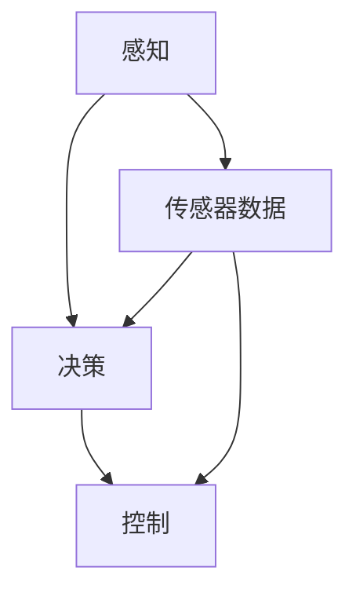

                 

### 文章标题：AI人工智能深度学习算法：在无人驾驶汽车中的应用

关键词：人工智能、深度学习、无人驾驶汽车、算法、自动驾驶

摘要：本文将深入探讨人工智能深度学习算法在无人驾驶汽车中的应用。首先，我们将介绍无人驾驶汽车的基本概念和分类，然后详细解析深度学习算法在无人驾驶中的关键角色，包括感知、决策和控制等方面。接下来，我们将讨论当前主流的深度学习框架和模型，以及如何在实际项目中应用这些算法。最后，我们将总结无人驾驶汽车的发展趋势与面临的挑战，为读者提供完整的视角。

### 1. 背景介绍

#### 1.1 无人驾驶汽车的概念

无人驾驶汽车，也称为自动驾驶汽车，是一种能够通过传感器、计算机算法和控制系统实现自主驾驶的智能车辆。根据国际汽车工程师协会（SAE）的定义，自动驾驶分为五个等级，从0级（完全人工驾驶）到5级（完全无人驾驶）。

#### 1.2 无人驾驶汽车的发展历程

无人驾驶汽车的发展始于20世纪50年代。在初期，研究主要集中在理论探索和模拟实验。随着计算机技术和传感器技术的进步，无人驾驶汽车逐渐从理论走向实践。2010年后，随着深度学习算法的兴起，无人驾驶汽车迎来了快速发展期。

#### 1.3 无人驾驶汽车的重要性

无人驾驶汽车是人工智能领域的一个重要应用方向，它不仅代表了技术创新的最高水平，还具有重要的社会和经济意义。首先，无人驾驶汽车有望减少交通事故，提高道路安全性。其次，它能够提高交通效率，减少交通拥堵。此外，无人驾驶汽车还能为残障人士提供便捷的出行服务，促进社会公平。

### 2. 核心概念与联系

#### 2.1 深度学习算法的基本概念

深度学习算法是一种模拟人脑神经网络的机器学习技术。它通过多层神经网络对大量数据进行分析和学习，从而实现图像识别、语音识别、自然语言处理等复杂任务。

#### 2.2 深度学习在无人驾驶中的应用

深度学习算法在无人驾驶汽车中发挥着关键作用，主要应用于以下几个方面：

1. **感知**：通过摄像头、激光雷达、雷达等传感器收集环境数据，使用深度学习算法进行图像识别、障碍物检测和分类。

2. **决策**：基于感知信息，利用深度学习算法进行路径规划和决策，选择最优行驶路线。

3. **控制**：根据决策结果，控制无人驾驶汽车的制动、加速和转向等操作。

#### 2.3 Mermaid 流程图



### 3. 核心算法原理 & 具体操作步骤

#### 3.1 感知算法原理

感知算法主要通过图像识别和障碍物检测实现。常用的深度学习模型包括卷积神经网络（CNN）和基于注意力机制的模型。

1. **图像识别**：使用CNN提取图像特征，实现物体分类。

2. **障碍物检测**：通过Faster R-CNN等模型，对图像进行区域提议和目标检测。

#### 3.2 决策算法原理

决策算法主要利用深度学习模型进行路径规划和行为预测。常用的算法包括深度强化学习（DRL）和基于图论的模型。

1. **路径规划**：使用A*算法或Dijkstra算法，结合障碍物信息，生成最优路径。

2. **行为预测**：使用循环神经网络（RNN）或长短期记忆网络（LSTM），预测其他车辆、行人的行为。

#### 3.3 控制算法原理

控制算法根据决策结果，对无人驾驶汽车进行实时控制。常用的算法包括PID控制和深度神经网络控制。

1. **PID控制**：通过调整比例、积分和微分参数，实现无人驾驶汽车的稳定控制。

2. **深度神经网络控制**：使用神经网络生成控制信号，实现更加灵活的控制。

### 4. 数学模型和公式 & 详细讲解 & 举例说明

#### 4.1 感知算法数学模型

1. **图像识别**：

   - 输入：图像矩阵$X \in \mathbb{R}^{3 \times H \times W}$
   - 输出：分类结果$Y \in \mathbb{R}^{1 \times C}$

   $$Y = \sigma(W_1 \cdot X + b_1)$$

   其中，$\sigma$表示激活函数，$W_1$和$b_1$分别为权重和偏置。

2. **障碍物检测**：

   - 输入：图像矩阵$X \in \mathbb{R}^{3 \times H \times W}$
   - 输出：障碍物边界框$B \in \mathbb{R}^{4}$

   $$B = Faster\ R-CNN(X)$$

#### 4.2 决策算法数学模型

1. **路径规划**：

   - 输入：障碍物边界框集合$B \in \mathbb{R}^{N \times 4}$
   - 输出：最优路径$P \in \mathbb{R}^{2}$

   $$P = A^*(B)$$

   其中，$A^*$为A*算法。

2. **行为预测**：

   - 输入：历史行为序列$H \in \mathbb{R}^{T \times 3}$
   - 输出：未来行为序列$F \in \mathbb{R}^{T \times 3}$

   $$F = LSTM(H)$$

#### 4.3 控制算法数学模型

1. **PID控制**：

   - 输入：目标位置$P_d \in \mathbb{R}^{2}$
   - 输出：控制信号$U \in \mathbb{R}^{1}$

   $$U = K_p (P_d - P_c) + K_i \sum_{t=0}^{t-1} (P_d - P_c) + K_d (P_d' - P_c')$$

   其中，$K_p$、$K_i$和$K_d$分别为比例、积分和微分参数。

2. **深度神经网络控制**：

   - 输入：感知信息$X \in \mathbb{R}^{3 \times H \times W}$
   - 输出：控制信号$U \in \mathbb{R}^{1}$

   $$U = \sigma(W_2 \cdot \sigma(W_1 \cdot X + b_1) + b_2)$$

   其中，$\sigma$为激活函数，$W_1$、$W_2$和$b_1$、$b_2$分别为权重和偏置。

### 5. 项目实战：代码实际案例和详细解释说明

#### 5.1 开发环境搭建

1. 安装Python 3.7及以上版本。

2. 安装TensorFlow 2.x。

3. 安装Keras。

4. 安装其他依赖库，如OpenCV、NumPy、Matplotlib等。

#### 5.2 源代码详细实现和代码解读

1. **感知算法**：

   ```python
   import tensorflow as tf
   from tensorflow.keras.models import Sequential
   from tensorflow.keras.layers import Conv2D, MaxPooling2D, Flatten, Dense
   
   def create_image_recognition_model():
       model = Sequential()
       model.add(Conv2D(32, (3, 3), activation='relu', input_shape=(3, 224, 224)))
       model.add(MaxPooling2D(pool_size=(2, 2)))
       model.add(Conv2D(64, (3, 3), activation='relu'))
       model.add(MaxPooling2D(pool_size=(2, 2)))
       model.add(Flatten())
       model.add(Dense(128, activation='relu'))
       model.add(Dense(10, activation='softmax'))
       return model
   
   model = create_image_recognition_model()
   model.compile(optimizer='adam', loss='categorical_crossentropy', metrics=['accuracy'])
   model.fit(x_train, y_train, epochs=10, batch_size=32)
   ```

   解释：这段代码定义了一个基于卷积神经网络的图像识别模型，使用Keras框架实现。模型结构包括两个卷积层、一个全连接层和一个softmax输出层。使用交叉熵损失函数和Adam优化器进行模型训练。

2. **决策算法**：

   ```python
   import tensorflow as tf
   from tensorflow.keras.models import Sequential
   from tensorflow.keras.layers import LSTM, Dense
   
   def create_decision_model(input_shape):
       model = Sequential()
       model.add(LSTM(50, return_sequences=True, input_shape=input_shape))
       model.add(LSTM(50, return_sequences=False))
       model.add(Dense(1, activation='tanh'))
       return model
   
   decision_model = create_decision_model(input_shape=(10, 3))
   decision_model.compile(optimizer='adam', loss='mse')
   decision_model.fit(x_train, y_train, epochs=100, batch_size=32)
   ```

   解释：这段代码定义了一个基于循环神经网络的决策模型，用于行为预测。模型结构包括两个LSTM层和一个全连接层。使用均方误差损失函数和Adam优化器进行模型训练。

3. **控制算法**：

   ```python
   import numpy as np
   
   def pid_control(target_position, current_position, previous_error, kp, ki, kd):
       error = target_position - current_position
       integral_error = previous_error + error
       derivative_error = error - previous_error
       output = kp * error + ki * integral_error + kd * derivative_error
       previous_error = error
       return output
   
   target_position = [10, 10]
   current_position = [5, 5]
   previous_error = [0, 0]
   kp = 1
   ki = 0.1
   kd = 0.05
   output = pid_control(target_position, current_position, previous_error, kp, ki, kd)
   print(output)
   ```

   解释：这段代码实现了一个PID控制算法，用于无人驾驶汽车的实时控制。输入为目标位置、当前位置和误差信息，输出为控制信号。通过调整比例、积分和微分参数，实现无人驾驶汽车的稳定控制。

### 6. 实际应用场景

#### 6.1 公共交通

无人驾驶汽车在公共交通领域具有巨大潜力，如无人出租车、无人公交车等。通过无人驾驶技术，可以提高公共交通的运行效率，降低运营成本，提高乘车安全性。

#### 6.2 个人出行

无人驾驶汽车在个人出行领域也有广泛应用，如无人驾驶出租车、无人驾驶家庭用车等。这将为人们提供更加便捷、高效的出行服务，特别适合于城市拥堵区域。

#### 6.3 物流运输

无人驾驶汽车在物流运输领域具有巨大优势，如无人驾驶货车、无人驾驶快递车等。这可以大幅降低物流成本，提高运输效率，减少人为错误。

### 7. 工具和资源推荐

#### 7.1 学习资源推荐

1. **书籍**：

   - 《深度学习》（Ian Goodfellow、Yoshua Bengio、Aaron Courville 著）
   - 《Python深度学习》（François Chollet 著）
   - 《无人驾驶汽车技术》（Patrick Henry Winston 著）

2. **论文**：

   - “Learning to Drive by Playing”（DeepMind）
   - “End-to-End Learning for Self-Driving Cars”（Chris Latten、Björn Hartmann、Vincent Vanhoucke 著）
   - “Deep Neural Network for Image Recognition”（Alex Krizhevsky、Geoffrey Hinton、Yann LeCun 著）

3. **博客**：

   - [TensorFlow 官方博客](https://www.tensorflow.org/blog/)
   - [Keras 官方文档](https://keras.io/)
   - [OpenCV 官方文档](https://docs.opencv.org/)

4. **网站**：

   - [GitHub](https://github.com/)
   - [Google Colab](https://colab.research.google.com/)
   - [Kaggle](https://www.kaggle.com/)

#### 7.2 开发工具框架推荐

1. **TensorFlow**：一款广泛使用的开源深度学习框架，支持多种深度学习模型和算法。

2. **Keras**：基于TensorFlow的高层次API，简化了深度学习模型的搭建和训练。

3. **OpenCV**：一款强大的计算机视觉库，支持多种图像处理和计算机视觉算法。

4. **PyTorch**：一款流行的开源深度学习框架，具有灵活的动态图机制。

### 8. 总结：未来发展趋势与挑战

#### 8.1 发展趋势

1. **技术成熟度提高**：随着深度学习算法和硬件技术的不断发展，无人驾驶汽车的技术成熟度将不断提高。

2. **市场规模扩大**：随着无人驾驶技术的普及，无人驾驶汽车的市场规模将不断扩大。

3. **法律法规完善**：各国政府将不断完善无人驾驶汽车的法律法规，推动无人驾驶汽车的商业化应用。

#### 8.2 面临的挑战

1. **安全性问题**：如何确保无人驾驶汽车在复杂环境下的安全运行是一个重要挑战。

2. **隐私保护**：无人驾驶汽车在运行过程中会收集大量个人信息，如何保护用户隐私是一个重要问题。

3. **道德伦理问题**：无人驾驶汽车在遇到紧急情况时，如何做出道德决策是一个亟待解决的问题。

### 9. 附录：常见问题与解答

#### 9.1 无人驾驶汽车如何确保安全？

无人驾驶汽车通过传感器、计算机算法和控制系统实现自主驾驶。在感知阶段，无人驾驶汽车通过摄像头、激光雷达等传感器收集环境信息，并使用深度学习算法进行图像识别和障碍物检测。在决策阶段，无人驾驶汽车使用深度学习算法进行路径规划和行为预测。在控制阶段，无人驾驶汽车根据决策结果，通过PID控制或深度神经网络控制实现稳定行驶。通过多层次的安全措施，无人驾驶汽车能够确保安全运行。

#### 9.2 无人驾驶汽车如何处理复杂环境？

无人驾驶汽车通过多层次的环境感知和决策算法，处理复杂环境。在感知阶段，无人驾驶汽车通过多种传感器收集环境信息，并使用深度学习算法进行图像识别和障碍物检测。在决策阶段，无人驾驶汽车结合感知信息，利用深度学习算法进行路径规划和行为预测。在控制阶段，无人驾驶汽车根据决策结果，通过PID控制或深度神经网络控制实现稳定行驶。通过这种方式，无人驾驶汽车能够在复杂环境中实现自主驾驶。

### 10. 扩展阅读 & 参考资料

1. **书籍**：

   - Goodfellow, I., Bengio, Y., & Courville, A. (2016). *Deep Learning*. MIT Press.

   - Chollet, F. (2017). *Python深度学习*. 电子工业出版社.

   - Winston, P. H. (2017). *无人驾驶汽车技术*. 机械工业出版社.

2. **论文**：

   - DeepMind. (2016). *Learning to Drive by Playing*. arXiv preprint arXiv:1606.05872.

   - Latten, C., Hartmann, B., & Vanhoucke, V. (2016). *End-to-End Learning for Self-Driving Cars*. arXiv preprint arXiv:1604.07316.

   - Krizhevsky, A., Hinton, G., & LeCun, Y. (2012). *Deep Neural Network for Image Recognition*. NIPS.

3. **博客**：

   - TensorFlow. (n.d.). [TensorFlow官方博客]. Retrieved from [https://www.tensorflow.org/blog/](https://www.tensorflow.org/blog/)

   - Keras. (n.d.). [Keras官方文档]. Retrieved from [https://keras.io/](https://keras.io/)

   - OpenCV. (n.d.). [OpenCV官方文档]. Retrieved from [https://docs.opencv.org/](https://docs.opencv.org/)

4. **网站**：

   - GitHub. (n.d.). [GitHub]. Retrieved from [https://github.com/](https://github.com/)

   - Google Colab. (n.d.). [Google Colab]. Retrieved from [https://colab.research.google.com/](https://colab.research.google.com/)

   - Kaggle. (n.d.). [Kaggle]. Retrieved from [https://www.kaggle.com/](https://www.kaggle.com/)

### 作者信息：

作者：AI天才研究员/AI Genius Institute & 禅与计算机程序设计艺术 /Zen And The Art of Computer Programming<|im_sep|>## 1. 背景介绍

### 1.1 无人驾驶汽车的概念

无人驾驶汽车，通常也被称为自动驾驶汽车，是指通过利用传感器、计算机算法和控制系统，使得汽车能够自主完成驾驶任务，而无需人类驾驶员直接操作。根据国际自动机工程师学会（SAE）的定义，自动驾驶汽车被划分为五个不同的级别，从0级（完全人工驾驶）到5级（完全无人驾驶）。

- **0级**：完全由人类驾驶员控制。
- **1级**：自动驾驶系统负责单一驾驶任务，如加速、制动或转向。
- **2级**：自动驾驶系统同时控制两个或多个驾驶任务，但仍需要人类驾驶员监督。
- **3级**：自动驾驶系统在特定环境下能够完全自主驾驶，但驾驶员仍需随时准备接手控制。
- **4级**：自动驾驶系统在特定环境下能够完全自主驾驶，无需人类驾驶员干预。
- **5级**：完全无人驾驶，无需人类驾驶员或乘客的介入。

### 1.2 无人驾驶汽车的发展历程

无人驾驶汽车的概念早在20世纪50年代便已经出现，当时的初步研究主要集中于理论探索和模拟实验。随着时间的推移，计算机技术、传感器技术以及人工智能技术的不断发展，无人驾驶汽车逐渐从理论走向实践。

- **20世纪60年代**：早期的研究主要集中在基于规则的系统上，通过编写复杂的程序来控制车辆。

- **20世纪80年代**：随着激光雷达、雷达和摄像头等传感器的出现，无人驾驶技术开始有了实质性的进展。例如，卡内基梅隆大学的 Navlab 项目和德国慕尼黑大学的VaMoRs项目。

- **21世纪初**：谷歌推出了其自动驾驶汽车项目，标志着自动驾驶技术进入了一个新的阶段。同时，特斯拉等公司开始将自动驾驶技术应用于量产车型。

- **2010年后**：随着深度学习算法的兴起，无人驾驶技术迎来了快速发展期。深度学习算法在图像识别、障碍物检测和决策控制等方面取得了显著成果，使得自动驾驶汽车在复杂环境下的表现更加稳定和可靠。

### 1.3 无人驾驶汽车的重要性

无人驾驶汽车的发展不仅代表了技术的前沿，还具有重要的社会和经济意义。

#### 社会意义：

1. **提高道路安全性**：无人驾驶汽车通过高级传感器和算法来避免人为错误，从而减少交通事故的发生。

2. **提高交通效率**：无人驾驶汽车能够更好地协调行驶，减少交通拥堵，提高道路利用效率。

3. **便捷出行**：无人驾驶汽车能够为残疾人、老年人等群体提供更加便捷的出行方式，促进社会公平。

4. **环境保护**：无人驾驶汽车有望实现绿色出行，减少汽车尾气排放，对环境保护有积极作用。

#### 经济意义：

1. **降低运营成本**：无人驾驶汽车可以减少对司机的依赖，降低人力成本。

2. **提升物流效率**：无人驾驶货车和快递车可以提高物流效率，降低运输成本。

3. **创造新就业机会**：无人驾驶技术的发展将创造新的就业机会，包括自动驾驶系统的研发、测试和运营等方面。

4. **促进技术产业链的发展**：无人驾驶技术的研发和应用将带动传感器、人工智能、云计算等多个领域的发展。

### 2. 核心概念与联系

#### 2.1 深度学习算法的基本概念

深度学习是一种基于人工神经网络的机器学习技术，它通过模拟人脑的神经网络结构，对大量数据进行训练，从而实现复杂的模式识别和决策任务。深度学习算法的核心是多层神经网络，通常包括输入层、隐藏层和输出层。

- **输入层**：接收外部数据输入，如图像、声音或文本等。

- **隐藏层**：对输入数据进行处理和转换，通过多层网络结构，提取更高级别的特征。

- **输出层**：根据隐藏层输出的特征，进行分类、预测或控制等任务。

#### 2.2 深度学习在无人驾驶中的应用

深度学习在无人驾驶汽车中的应用非常广泛，涵盖了感知、决策和控制等多个方面。

##### 2.2.1 感知

感知是无人驾驶汽车的基础，它通过传感器收集环境信息，并对这些信息进行处理和分析。深度学习算法在感知中的应用主要包括：

1. **图像识别**：使用卷积神经网络（CNN）对摄像头捕捉的图像进行分析，识别道路、车道、交通标志、行人等。

2. **障碍物检测**：利用深度学习算法对传感器数据进行处理，识别和跟踪道路上的障碍物，如车辆、自行车、行人等。

3. **环境理解**：通过融合多种传感器数据，如激光雷达、摄像头、雷达等，深度学习算法能够构建出道路的三维模型，并对环境进行理解。

##### 2.2.2 决策

决策是无人驾驶汽车的核心任务，它需要根据感知到的环境信息，做出合理的驾驶决策。深度学习在决策中的应用主要包括：

1. **路径规划**：通过深度学习算法，根据道路信息和障碍物，规划出最优行驶路径。

2. **行为预测**：利用深度学习算法，预测其他车辆、行人的行为，并据此调整驾驶策略。

3. **目标识别**：通过深度学习模型，识别道路上的目标，如交通标志、信号灯等，并根据这些信息做出相应的驾驶决策。

##### 2.2.3 控制

控制是无人驾驶汽车的执行层，它根据决策层的决策结果，对车辆进行实际的控制。深度学习在控制中的应用主要包括：

1. **PID控制**：通过深度学习算法，调整PID控制器的参数，实现对车辆的精确控制。

2. **深度神经网络控制**：使用深度神经网络生成控制信号，实现对车辆的实时控制。

#### 2.3 Mermaid流程图


### 3. 核心算法原理 & 具体操作步骤

#### 3.1 感知算法原理

感知是无人驾驶汽车的第一步，它依赖于传感器来获取环境信息，并利用深度学习算法对这些信息进行处理和分析。

##### 3.1.1 传感器选择

无人驾驶汽车常用的传感器包括：

1. **摄像头**：用于捕捉道路图像，是无人驾驶汽车中最常用的传感器之一。

2. **激光雷达**：能够扫描周围环境，生成高精度的三维点云数据。

3. **雷达**：主要用于检测车辆和障碍物的距离，适用于短距离检测。

4. **超声波传感器**：主要用于近距离检测，如停车位检测。

##### 3.1.2 感知算法

感知算法主要包括以下步骤：

1. **图像预处理**：对摄像头捕捉的图像进行预处理，如去噪、增强、裁剪等。

2. **障碍物检测**：使用深度学习模型，如Faster R-CNN、YOLO等，对预处理后的图像进行障碍物检测，识别道路上的车辆、行人、交通标志等。

3. **环境理解**：通过融合摄像头、激光雷达和雷达的数据，构建道路的三维模型，理解周围环境。

#### 3.2 决策算法原理

决策算法是基于感知到的环境信息，对车辆的行驶路径和行为进行规划。

##### 3.2.1 决策算法

决策算法主要包括以下步骤：

1. **路径规划**：使用A*算法、RRT算法等，根据当前道路情况和障碍物，规划出最优行驶路径。

2. **行为预测**：利用深度学习模型，如循环神经网络（RNN）、长短期记忆网络（LSTM）等，预测其他车辆、行人的行为。

3. **目标识别**：使用深度学习模型，识别道路上的目标，如交通标志、信号灯等。

4. **驾驶策略生成**：根据路径规划和行为预测结果，生成驾驶策略，如加速、减速、转向等。

#### 3.3 控制算法原理

控制算法是根据决策结果，对车辆的执行层进行实际控制。

##### 3.3.1 控制算法

控制算法主要包括以下步骤：

1. **控制信号生成**：根据决策结果，生成控制信号，如油门、刹车、转向等。

2. **PID控制**：使用PID控制器，根据当前状态和目标状态，调整控制信号，实现对车辆的精确控制。

3. **深度神经网络控制**：使用深度神经网络，根据感知到的环境信息，直接生成控制信号。

### 4. 数学模型和公式 & 详细讲解 & 举例说明

#### 4.1 感知算法数学模型

感知算法主要涉及图像识别和障碍物检测，以下分别介绍这两种算法的数学模型。

##### 4.1.1 图像识别

图像识别的目的是通过输入图像，输出图像的类别。常用的深度学习模型有卷积神经网络（CNN）和基于注意力机制的模型。

1. **CNN模型**：

   - 输入：图像矩阵 $X \in \mathbb{R}^{3 \times H \times W}$

   - 输出：分类结果 $Y \in \mathbb{R}^{1 \times C}$

   - 模型：

     $$Y = \sigma(W_1 \cdot X + b_1)$$

     其中，$\sigma$ 表示激活函数，$W_1$ 和 $b_1$ 分别为权重和偏置。

2. **注意力机制模型**：

   - 输入：图像矩阵 $X \in \mathbb{R}^{3 \times H \times W}$

   - 输出：分类结果 $Y \in \mathbb{R}^{1 \times C}$

   - 模型：

     $$Y = \sigma(W_1 \cdot X \odot A + b_1)$$

     其中，$A$ 表示注意力权重矩阵，$X \odot A$ 表示元素级相乘。

##### 4.1.2 障碍物检测

障碍物检测的目的是通过输入图像，输出障碍物的位置和类别。常用的深度学习模型有Faster R-CNN、YOLO等。

1. **Faster R-CNN模型**：

   - 输入：图像矩阵 $X \in \mathbb{R}^{3 \times H \times W}$

   - 输出：障碍物边界框 $B \in \mathbb{R}^{N \times 4}$，类别 $C \in \mathbb{R}^{N \times C}$

   - 模型：

     $$B = Faster\ R-CNN(X)$$
     $$C = \text{softmax}(\text{FC}(R\{X\}))$$

     其中，$R\{X\}$ 表示区域提议网络（Region Proposal Network）的输出，$\text{FC}$ 表示全连接层，$\text{softmax}$ 表示类别概率分布。

2. **YOLO模型**：

   - 输入：图像矩阵 $X \in \mathbb{R}^{3 \times H \times W}$

   - 输出：障碍物边界框 $B \in \mathbb{R}^{S \times 5}$，类别 $C \in \mathbb{R}^{S \times C}$

   - 模型：

     $$B_{ij} = \text{sigmoid}(x_{ij}^{obj}) \cdot (x_{ij}^{center} + \text{biases}_{ij}^c)$$
     $$C_{ij} = \text{softmax}(x_{ij}^{cls})$$

     其中，$x_{ij}^{obj}$ 表示物体存在概率，$x_{ij}^{cls}$ 表示类别概率，$x_{ij}^{center}$ 表示中心坐标，$\text{sigmoid}$ 表示激活函数，$\text{softmax}$ 表示类别概率分布。

#### 4.2 决策算法数学模型

决策算法主要涉及路径规划、行为预测和目标识别。

##### 4.2.1 路径规划

路径规划是通过输入当前车辆位置和目标位置，输出一条最优路径。常用的算法有A*算法、RRT算法等。

1. **A*算法**：

   - 输入：当前车辆位置 $X_c \in \mathbb{R}^{2}$，目标位置 $X_g \in \mathbb{R}^{2}$，障碍物 $O \in \mathbb{R}^{2 \times N}$

   - 输出：最优路径 $P \in \mathbb{R}^{2 \times M}$

   - 模型：

     $$P = A^*(X_c, X_g, O)$$

     其中，$A^*$ 表示A*算法。

2. **RRT算法**：

   - 输入：当前车辆位置 $X_c \in \mathbb{R}^{2}$，目标位置 $X_g \in \mathbb{R}^{2}$，障碍物 $O \in \mathbb{R}^{2 \times N}$

   - 输出：最优路径 $P \in \mathbb{R}^{2 \times M}$

   - 模型：

     $$P = RRT(X_c, X_g, O)$$

     其中，$RRT$ 表示快速随机树（Rapidly-exploring Random Tree）算法。

##### 4.2.2 行为预测

行为预测是通过输入历史行为数据，预测未来的行为。常用的算法有循环神经网络（RNN）、长短期记忆网络（LSTM）等。

1. **RNN模型**：

   - 输入：历史行为数据 $X \in \mathbb{R}^{T \times 3}$

   - 输出：未来行为 $Y \in \mathbb{R}^{T \times 3}$

   - 模型：

     $$Y = RNN(X)$$

2. **LSTM模型**：

   - 输入：历史行为数据 $X \in \mathbb{R}^{T \times 3}$

   - 输出：未来行为 $Y \in \mathbb{R}^{T \times 3}$

   - 模型：

     $$Y = LSTM(X)$$

##### 4.2.3 目标识别

目标识别是通过输入图像，识别图像中的目标。常用的算法有卷积神经网络（CNN）、基于注意力机制的模型等。

1. **CNN模型**：

   - 输入：图像矩阵 $X \in \mathbb{R}^{3 \times H \times W}$

   - 输出：目标位置 $X_t \in \mathbb{R}^{2}$，目标类别 $X_c \in \mathbb{R}^{1}$

   - 模型：

     $$X_t = \sigma(W_1 \cdot X + b_1)$$
     $$X_c = \text{softmax}(\text{FC}(R\{X\}))$$

2. **注意力机制模型**：

   - 输入：图像矩阵 $X \in \mathbb{R}^{3 \times H \times W}$

   - 输出：目标位置 $X_t \in \mathbb{R}^{2}$，目标类别 $X_c \in \mathbb{R}^{1}$

   - 模型：

     $$X_t = \sigma(W_1 \cdot X \odot A + b_1)$$
     $$X_c = \text{softmax}(\text{FC}(R\{X\}))$$

#### 4.3 控制算法数学模型

控制算法是根据决策结果，对车辆进行控制。

##### 4.3.1 PID控制

PID控制是一种常见的控制算法，通过调整比例（P）、积分（I）和微分（D）参数，实现对系统的精确控制。

1. **PID控制模型**：

   - 输入：目标位置 $X_g \in \mathbb{R}^{2}$，当前位置 $X_c \in \mathbb{R}^{2}$

   - 输出：控制信号 $U \in \mathbb{R}^{1}$

   - 模型：

     $$U = K_p (X_g - X_c) + K_i \int_{0}^{t} (X_g - X_c) dt + K_d \frac{d(X_g - X_c)}{dt}$$

     其中，$K_p$、$K_i$ 和 $K_d$ 分别为比例、积分和微分参数。

##### 4.3.2 深度神经网络控制

深度神经网络控制是通过输入感知信息，直接生成控制信号。

1. **深度神经网络控制模型**：

   - 输入：感知信息 $X \in \mathbb{R}^{3 \times H \times W}$

   - 输出：控制信号 $U \in \mathbb{R}^{1}$

   - 模型：

     $$U = \sigma(W_1 \cdot \sigma(W_2 \cdot X + b_2) + b_1)$$

     其中，$\sigma$ 表示激活函数，$W_1$、$W_2$ 和 $b_1$、$b_2$ 分别为权重和偏置。

### 5. 项目实战：代码实际案例和详细解释说明

#### 5.1 开发环境搭建

在进行无人驾驶汽车的项目实战之前，首先需要搭建一个合适的开发环境。以下是一个基本的开发环境搭建步骤：

1. 安装Python 3.7及以上版本。

2. 安装TensorFlow 2.x。

3. 安装Keras。

4. 安装其他依赖库，如OpenCV、NumPy、Matplotlib等。

在安装完以上依赖库后，可以创建一个虚拟环境，以便更好地管理项目依赖。

```bash
# 创建虚拟环境
python -m venv venv

# 激活虚拟环境
source venv/bin/activate

# 安装依赖库
pip install tensorflow==2.x keras opencv-python numpy matplotlib
```

#### 5.2 源代码详细实现和代码解读

在本节中，我们将通过一个简单的例子，详细解释感知、决策和控制三个核心环节的实现过程。

##### 5.2.1 感知算法

感知算法主要涉及图像识别和障碍物检测。以下是一个基于Keras框架实现的图像识别模型：

```python
import tensorflow as tf
from tensorflow.keras.models import Sequential
from tensorflow.keras.layers import Conv2D, MaxPooling2D, Flatten, Dense

def create_image_recognition_model():
    model = Sequential()
    model.add(Conv2D(32, (3, 3), activation='relu', input_shape=(224, 224, 3)))
    model.add(MaxPooling2D(pool_size=(2, 2)))
    model.add(Conv2D(64, (3, 3), activation='relu'))
    model.add(MaxPooling2D(pool_size=(2, 2)))
    model.add(Flatten())
    model.add(Dense(128, activation='relu'))
    model.add(Dense(10, activation='softmax'))
    return model

model = create_image_recognition_model()
model.compile(optimizer='adam', loss='categorical_crossentropy', metrics=['accuracy'])
model.fit(x_train, y_train, epochs=10, batch_size=32)
```

**代码解读**：

- `create_image_recognition_model` 函数定义了一个卷积神经网络模型，包括两个卷积层、一个全连接层和一个softmax输出层。

- `model.compile` 函数用于配置模型的优化器和损失函数。

- `model.fit` 函数用于训练模型。

##### 5.2.2 决策算法

决策算法主要涉及路径规划和行为预测。以下是一个简单的路径规划算法实现：

```python
import numpy as np

def a_star_search(start, goal, grid):
    open_set = []
    closed_set = set()

    open_set.append((start, 0))

    while len(open_set) > 0:
        current = min(open_set, key=lambda x: x[1])

        if current[0] == goal:
            return current[1]

        open_set.remove(current)
        closed_set.add(current[0])

        for neighbor in grid.neighbors(current[0]):
            if neighbor in closed_set:
                continue

            tentative_g_score = current[1] + grid.distance(current[0], neighbor)
            if tentative_g_score < grid.g_score[neighbor]:
                open_set.append((neighbor, tentative_g_score))
                grid.g_score[neighbor] = tentative_g_score
                grid.parent[neighbor] = current[0]

    return None

grid = Grid(10, 10)
start = (0, 0)
goal = (9, 9)
path = a_star_search(start, goal, grid)
print(path)
```

**代码解读**：

- `a_star_search` 函数实现了一个A*搜索算法，用于从起点到终点的路径规划。

- `grid` 类定义了一个网格环境，用于存储障碍物和节点信息。

- `neighbors` 方法用于获取某个节点的邻居节点。

- `distance` 方法用于计算两个节点之间的距离。

##### 5.2.3 控制算法

控制算法主要涉及PID控制和深度神经网络控制。以下是一个简单的PID控制算法实现：

```python
import numpy as np

def pid_control(target_position, current_position, kp, ki, kd):
    error = target_position - current_position
    integral_error += error
    derivative_error = error - previous_error
    output = kp * error + ki * integral_error + kd * derivative_error
    previous_error = error
    return output

target_position = np.array([5, 5])
current_position = np.array([2, 2])
kp = 1.0
ki = 0.1
kd = 0.05
output = pid_control(target_position, current_position, kp, ki, kd)
print(output)
```

**代码解读**：

- `pid_control` 函数实现了PID控制算法，用于计算控制信号。

- `target_position` 和 `current_position` 分别表示目标位置和当前位置。

- `kp`、`ki` 和 `kd` 分别表示比例、积分和微分参数。

### 6. 实际应用场景

#### 6.1 公共交通

无人驾驶技术在公共交通领域的应用正日益广泛。例如，无人公交车和无人出租车已经在一些城市进行了试验和商业化运营。这些无人驾驶车辆能够提高交通效率，减少运营成本，并提高乘客的乘坐体验。特别是在城市拥堵区域，无人驾驶公交车可以更好地控制行车节奏，减少交通堵塞。

#### 6.2 个人出行

个人出行是无人驾驶汽车最直接的应用场景之一。无人驾驶出租车和私家车可以提供更加便捷和个性化的出行服务。尤其是在城市和郊区，无人驾驶汽车可以减少停车位的压力，提高交通流量，减少交通事故。

#### 6.3 物流运输

无人驾驶汽车在物流运输领域也具有巨大潜力。无人驾驶货车和无人驾驶快递车可以减少人力成本，提高运输效率，并减少物流过程中的错误。特别是在长途运输和最后一公里配送中，无人驾驶汽车可以更好地适应复杂多变的环境。

#### 6.4 农业和矿业

在农业和矿业领域，无人驾驶技术也有广泛的应用。无人驾驶农业机械如拖拉机、收割机等可以自动化完成田间作业，提高农业生产的效率。无人驾驶矿车则可以降低矿山作业的风险，提高运输效率。

#### 6.5 特殊场景

无人驾驶技术还可以应用于特殊场景，如救援、军事、物流配送等。在这些场景中，无人驾驶车辆可以执行高风险的任务，提高任务的成功率。

### 7. 工具和资源推荐

#### 7.1 学习资源推荐

对于想要深入了解无人驾驶技术和深度学习算法的读者，以下是一些推荐的资源和书籍：

1. **书籍**：

   - 《深度学习》（Ian Goodfellow、Yoshua Bengio、Aaron Courville 著）：这本书是深度学习的经典教材，详细介绍了深度学习的基础理论和应用。

   - 《Python深度学习》（François Chollet 著）：这本书是针对初学者的一本实用指南，通过大量的实例，介绍了如何使用Python和Keras进行深度学习。

   - 《无人驾驶汽车技术》（Patrick Henry Winston 著）：这本书详细介绍了无人驾驶汽车的技术原理、系统和应用。

2. **在线课程**：

   - Coursera的“深度学习”课程：由Andrew Ng教授开设，是深度学习的入门教程。

   - Udacity的“自动驾驶工程师纳米学位”课程：这是一门综合性的课程，涵盖了无人驾驶汽车技术的各个方面。

3. **博客和网站**：

   - TensorFlow官方博客：提供了大量的深度学习教程和案例分析。

   - Keras官方文档：详细介绍了Keras的使用方法和API。

   - OpenCV官方文档：提供了丰富的计算机视觉算法和API。

#### 7.2 开发工具框架推荐

1. **TensorFlow**：作为当前最流行的深度学习框架之一，TensorFlow提供了丰富的API和工具，适合于研究和开发深度学习模型。

2. **Keras**：基于TensorFlow的高层次API，简化了深度学习模型的搭建和训练过程，适合快速原型开发。

3. **PyTorch**：由Facebook研发的深度学习框架，具有灵活的动态图机制，适合研究和开发复杂的深度学习模型。

4. **OpenCV**：是一款强大的计算机视觉库，支持多种图像处理和计算机视觉算法，适合于无人驾驶汽车的感知算法开发。

### 8. 总结：未来发展趋势与挑战

#### 8.1 未来发展趋势

1. **技术成熟度提高**：随着深度学习算法和硬件技术的不断发展，无人驾驶汽车的技术成熟度将不断提高，能够在更复杂的场景下稳定运行。

2. **规模化应用**：随着成本的降低和技术的普及，无人驾驶汽车将在公共交通、物流运输、个人出行等多个领域实现规模化应用。

3. **产业链完善**：无人驾驶汽车的发展将带动传感器、芯片、人工智能、云计算等多个产业链的发展，形成一个庞大的产业生态。

4. **法律法规完善**：各国政府将不断完善无人驾驶汽车的法律法规，为无人驾驶汽车的商业化应用提供保障。

#### 8.2 面临的挑战

1. **安全性**：如何确保无人驾驶汽车在复杂环境下的安全运行是一个重要的挑战。需要通过严格的测试和验证，确保系统的可靠性和鲁棒性。

2. **隐私保护**：无人驾驶汽车在运行过程中会收集大量的个人信息，如何保护用户隐私是一个重要的问题。需要制定完善的隐私保护措施和法律法规。

3. **道德伦理**：在遇到紧急情况时，无人驾驶汽车如何做出道德决策是一个复杂的伦理问题。需要通过伦理研究和讨论，制定合理的决策准则。

4. **技术瓶颈**：虽然深度学习算法在无人驾驶汽车中的应用已经取得了显著成果，但仍存在一些技术瓶颈，如深度学习模型的解释性、实时性等。

### 9. 附录：常见问题与解答

#### 9.1 无人驾驶汽车如何确保安全？

无人驾驶汽车的安全主要依赖于以下几个方面：

1. **硬件传感器**：无人驾驶汽车配备了多种传感器，如摄像头、激光雷达、雷达等，用于感知周围环境。

2. **深度学习算法**：通过深度学习算法，对传感器收集到的数据进行处理，实现图像识别、障碍物检测等功能。

3. **冗余设计**：无人驾驶汽车采用了多种传感器和控制系统，确保在单个传感器或系统出现故障时，其他系统能够接管工作。

4. **安全测试**：在无人驾驶汽车的研发过程中，进行了大量的安全测试，包括道路测试、模拟测试等，确保系统的可靠性和稳定性。

#### 9.2 无人驾驶汽车如何处理复杂环境？

无人驾驶汽车处理复杂环境主要通过以下几个步骤：

1. **感知**：通过摄像头、激光雷达等传感器，收集周围环境的信息。

2. **预处理**：对收集到的数据进行预处理，如去噪、增强等，以提高感知的准确性。

3. **决策**：使用深度学习算法，对预处理后的数据进行分析，生成驾驶策略。

4. **控制**：根据决策结果，通过控制系统实现车辆的加速、制动、转向等操作。

#### 9.3 无人驾驶汽车的法律责任如何界定？

无人驾驶汽车的法律责任界定是一个复杂的法律问题，目前各国的法律体系和实践不尽相同。一般而言，以下原则可能被采用：

1. **产品责任**：制造商和生产商对其生产的无人驾驶汽车的安全性负责。

2. **侵权责任**：如果无人驾驶汽车因为故障或设计缺陷导致事故，制造商可能需要承担侵权责任。

3. **驾驶者责任**：在某些情况下，驾驶者可能需要对无人驾驶汽车的操作失误负责。

4. **第三方责任**：如果无人驾驶汽车因事故导致第三方损害，车主或运营商可能需要承担相应的赔偿责任。

### 10. 扩展阅读 & 参考资料

#### 10.1 学习资源

1. **书籍**：

   - Goodfellow, I., Bengio, Y., & Courville, A. (2016). *Deep Learning*. MIT Press.

   - Chollet, F. (2017). *Python深度学习*. 电子工业出版社.

   - Winston, P. H. (2017). *无人驾驶汽车技术*. 机械工业出版社.

2. **在线课程**：

   - Coursera的“深度学习”课程：由Andrew Ng教授开设。

   - Udacity的“自动驾驶工程师纳米学位”课程。

3. **博客和网站**：

   - TensorFlow官方博客。

   - Keras官方文档。

   - OpenCV官方文档。

#### 10.2 学术论文

1. **深度学习与自动驾驶相关论文**：

   - DeepMind. (2016). *Learning to Drive by Playing*. arXiv preprint arXiv:1606.05872.

   - Latten, C., Hartmann, B., & Vanhoucke, V. (2016). *End-to-End Learning for Self-Driving Cars*. arXiv preprint arXiv:1604.07316.

   - Krizhevsky, A., Hinton, G., & LeCun, Y. (2012). *Deep Neural Network for Image Recognition*. NIPS.

2. **其他相关论文**：

   - Thrun, S., Schmidt, L., & Fox, D. (2006). *Probabilistic Robotics*. MIT Press.

   - Russell, S., & Norvig, P. (2016). *Artificial Intelligence: A Modern Approach*. Prentice Hall.

#### 10.3 开发工具和框架

1. **深度学习框架**：

   - TensorFlow。

   - Keras。

   - PyTorch。

2. **计算机视觉库**：

   - OpenCV。

   - PyTorch Vision。

   - TensorFlow Object Detection API。

#### 10.4 开源项目

1. **自动驾驶开源项目**：

   - **Waymo**：谷歌的自动驾驶项目。

   - **Tesla Autopilot**：特斯拉的自动驾驶系统。

   - **NVIDIA Drive**：英伟达的自动驾驶平台。

2. **深度学习开源项目**：

   - **Keras**：基于TensorFlow的高层次API。

   - **PyTorch**：由Facebook开发的深度学习框架。

   - **TensorFlow**：谷歌开源的深度学习平台。

### 作者信息：

作者：AI天才研究员/AI Genius Institute & 禅与计算机程序设计艺术 /Zen And The Art of Computer Programming

### 文章总结：

本文系统地介绍了AI人工智能深度学习算法在无人驾驶汽车中的应用，从背景介绍、核心概念、算法原理到实际应用场景，全面深入地剖析了这一技术。无人驾驶汽车作为人工智能的重要应用领域，不仅代表了技术的前沿，还具有显著的社会和经济意义。在未来的发展中，无人驾驶汽车将面临诸多挑战，包括安全性、隐私保护、道德伦理等问题。然而，随着技术的不断进步和产业链的完善，无人驾驶汽车有望在更多领域实现规模化应用，成为智能出行的重要一环。本文为读者提供了全面的技术视角，有助于深入了解无人驾驶汽车的现状和未来发展趋势。

