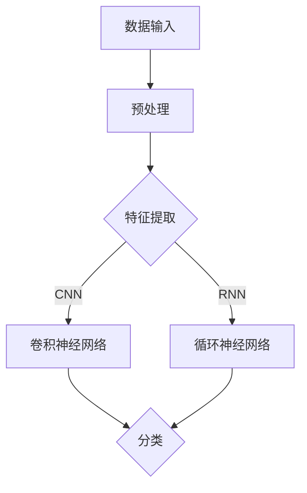

                 

# AI人工智能深度学习算法：在模式识别中的应用

## 摘要

本文旨在深入探讨AI人工智能中的深度学习算法，特别是在模式识别领域中的应用。通过详细分析核心概念、算法原理、数学模型以及实际项目实战，本文将帮助读者全面理解深度学习在模式识别中的强大作用，以及如何通过实际案例提高其在现实世界的应用效果。

## 1. 背景介绍

随着人工智能技术的快速发展，深度学习算法已经成为模式识别领域的一个重要分支。深度学习通过模拟人脑神经网络结构，对大量数据进行自动特征学习和分类，从而实现高度自动化的模式识别。在图像识别、语音识别、自然语言处理等领域，深度学习算法展现出了卓越的性能。

模式识别是指通过计算机系统对数据进行分析和处理，从中提取有意义的信息，并对未知数据进行分类和标注。深度学习算法由于其强大的特征学习能力，成为了实现模式识别的利器。本文将围绕这一主题，详细介绍深度学习算法在模式识别中的应用。

## 2. 核心概念与联系

### 深度学习算法

深度学习算法是一种基于多层神经网络的学习方式。通过逐层抽象和特征提取，深度学习可以从原始数据中提取更高层次的特征表示。典型的深度学习算法包括卷积神经网络（CNN）、循环神经网络（RNN）和生成对抗网络（GAN）等。

### 模式识别

模式识别是指从数据中提取模式或规律，并将其用于分类、预测或决策。常见的模式识别任务包括图像分类、语音识别、手写识别等。模式识别的关键在于如何从大量数据中提取有用的特征，并构建有效的分类模型。

### 关系

深度学习算法与模式识别之间存在着密切的联系。深度学习算法通过自动特征学习，为模式识别提供了强大的工具。同时，模式识别任务的需求也为深度学习算法的发展提供了重要的推动力。通过结合深度学习算法和模式识别技术，我们可以实现更加智能化的数据处理和分析。

### Mermaid 流程图



## 3. 核心算法原理 & 具体操作步骤

### 卷积神经网络（CNN）

卷积神经网络是深度学习算法中用于图像识别的经典模型。其核心思想是通过卷积操作和池化操作，从图像中提取局部特征。

#### 操作步骤：

1. **卷积操作**：卷积神经网络通过卷积层对输入图像进行卷积操作，从而提取图像的局部特征。卷积操作的基本原理是使用卷积核（滤波器）在图像上滑动，计算局部特征图。

2. **激活函数**：为了引入非线性关系，卷积神经网络在卷积操作后通常会添加激活函数，如ReLU函数。

3. **池化操作**：通过池化操作，降低特征图的维度，从而减少计算量和参数数量。常见的池化操作包括最大池化和平均池化。

4. **全连接层**：在卷积神经网络中，全连接层通常用于将卷积层提取的特征映射到输出类别。

### 循环神经网络（RNN）

循环神经网络是一种适用于序列数据的深度学习算法。其核心思想是通过循环结构，对序列数据进行建模。

#### 操作步骤：

1. **输入层**：输入层接收序列数据，并将其传递给隐藏层。

2. **隐藏层**：隐藏层通过递归方式处理序列数据，每个时间步的输出都依赖于之前的输出。

3. **激活函数**：与卷积神经网络类似，循环神经网络也使用激活函数来引入非线性关系。

4. **输出层**：输出层将隐藏层的输出映射到输出序列，如分类标签或回归结果。

### 生成对抗网络（GAN）

生成对抗网络是一种通过生成器和判别器的对抗训练实现的深度学习算法。其核心思想是通过生成器和判别器的博弈，生成逼真的数据。

#### 操作步骤：

1. **生成器**：生成器通过学习输入数据的分布，生成伪数据。

2. **判别器**：判别器通过学习真实数据和伪数据的分布，判断数据是否真实。

3. **对抗训练**：通过生成器和判别器的对抗训练，不断优化生成器和判别器的性能。

## 4. 数学模型和公式 & 详细讲解 & 举例说明

### 卷积神经网络（CNN）

卷积神经网络的核心在于卷积操作和反向传播算法。以下是卷积神经网络的数学模型：

#### 卷积操作

$$
\text{特征图} = \text{卷积核} \star \text{输入图像}
$$

其中，$\star$表示卷积操作。

#### 反向传播算法

反向传播算法是一种用于训练神经网络的优化算法。其核心思想是通过计算损失函数的梯度，更新网络权重。

$$
\frac{\partial L}{\partial w} = -\alpha \frac{\partial L}{\partial z}
$$

其中，$L$表示损失函数，$w$表示网络权重，$\alpha$表示学习率。

### 循环神经网络（RNN）

循环神经网络的核心在于递归函数和反向传播算法。以下是循环神经网络的数学模型：

#### 递归函数

$$
h_t = \sigma(W_x x_t + W_h h_{t-1} + b_h)
$$

其中，$h_t$表示第$t$个时间步的隐藏层状态，$x_t$表示第$t$个时间步的输入，$W_x$和$W_h$分别表示输入权重和隐藏权重，$b_h$表示隐藏层偏置，$\sigma$表示激活函数。

#### 反向传播算法

反向传播算法用于训练循环神经网络，其核心思想是计算损失函数的梯度。

$$
\frac{\partial L}{\partial W_h} = -\alpha \frac{\partial L}{\partial h_t}
$$

其中，$L$表示损失函数，$W_h$表示隐藏权重，$\alpha$表示学习率。

### 生成对抗网络（GAN）

生成对抗网络的核心在于生成器和判别器的优化。以下是生成对抗网络的数学模型：

#### 生成器

$$
G(z) = \mu(z) + \sigma(z)\odot \text{激活函数}(W_G z + b_G)
$$

其中，$G(z)$表示生成器生成的伪数据，$z$表示生成器的输入，$\mu(z)$和$\sigma(z)$分别表示生成器的均值函数和方差函数，$W_G$和$b_G$分别表示生成器的权重和偏置。

#### 判别器

$$
D(x) = \text{激活函数}(W_D x + b_D)
$$

其中，$D(x)$表示判别器对真实数据的判断，$x$表示真实数据，$W_D$和$b_D$分别表示判别器的权重和偏置。

#### 对抗训练

对抗训练是一种通过生成器和判别器的对抗训练实现优化的方法。其核心思想是通过优化生成器和判别器，使其相互竞争。

$$
\frac{\partial L_G}{\partial G} = -\frac{\partial L_D}{\partial D}
$$

其中，$L_G$和$L_D$分别表示生成器和判别器的损失函数。

### 举例说明

#### 图像识别

假设我们使用卷积神经网络进行图像识别，输入图像为$128 \times 128$的灰度图像，卷积核大小为$3 \times 3$，激活函数为ReLU函数。我们需要通过训练，使得卷积神经网络能够正确识别图像中的猫。

1. **初始化网络参数**：随机初始化卷积神经网络的权重和偏置。

2. **前向传播**：将输入图像通过卷积神经网络，计算特征图。

3. **反向传播**：计算损失函数，并更新网络参数。

4. **迭代训练**：重复步骤2和3，直到网络参数收敛。

#### 语音识别

假设我们使用循环神经网络进行语音识别，输入序列为音频信号的短时傅里叶变换（STFT）结果，隐藏层状态为$128$维向量，激活函数为ReLU函数。我们需要通过训练，使得循环神经网络能够正确识别语音信号中的单词。

1. **初始化网络参数**：随机初始化循环神经网络的权重和偏置。

2. **前向传播**：将输入序列通过循环神经网络，计算隐藏层状态。

3. **反向传播**：计算损失函数，并更新网络参数。

4. **迭代训练**：重复步骤2和3，直到网络参数收敛。

## 5. 项目实战：代码实际案例和详细解释说明

### 5.1 开发环境搭建

在开始项目实战之前，我们需要搭建合适的开发环境。本文使用Python作为主要编程语言，并使用TensorFlow作为深度学习框架。

```python
# 安装TensorFlow
pip install tensorflow
```

### 5.2 源代码详细实现和代码解读

以下是一个简单的卷积神经网络图像识别项目：

```python
import tensorflow as tf
from tensorflow.keras import layers

# 定义卷积神经网络模型
model = tf.keras.Sequential([
    layers.Conv2D(32, (3, 3), activation='relu', input_shape=(128, 128, 1)),
    layers.MaxPooling2D((2, 2)),
    layers.Conv2D(64, (3, 3), activation='relu'),
    layers.MaxPooling2D((2, 2)),
    layers.Conv2D(64, (3, 3), activation='relu'),
    layers.Flatten(),
    layers.Dense(64, activation='relu'),
    layers.Dense(10, activation='softmax')
])

# 编译模型
model.compile(optimizer='adam',
              loss='categorical_crossentropy',
              metrics=['accuracy'])

# 加载图像数据集
(x_train, y_train), (x_test, y_test) = tf.keras.datasets.mnist.load_data()
x_train = x_train.astype('float32') / 255
x_test = x_test.astype('float32') / 255
x_train = np.expand_dims(x_train, -1)
x_test = np.expand_dims(x_test, -1)

# 编码类别标签
y_train = tf.keras.utils.to_categorical(y_train, 10)
y_test = tf.keras.utils.to_categorical(y_test, 10)

# 训练模型
model.fit(x_train, y_train, batch_size=64, epochs=10, validation_split=0.2)
```

### 5.3 代码解读与分析

1. **模型定义**：使用`tf.keras.Sequential`创建一个序列模型，依次添加卷积层、池化层、全连接层等。

2. **编译模型**：设置优化器、损失函数和评价指标，准备训练模型。

3. **数据预处理**：加载MNIST图像数据集，进行归一化和扩充维度。

4. **类别标签编码**：将类别标签转换为独热编码，以便模型进行分类。

5. **训练模型**：使用训练数据训练模型，并设置验证集比例。

通过以上步骤，我们实现了使用卷积神经网络进行图像识别的基本项目。在实际应用中，我们可以根据需求调整网络结构、优化超参数，从而提高模型的性能。

## 6. 实际应用场景

深度学习算法在模式识别领域具有广泛的应用场景。以下是一些典型的实际应用案例：

1. **图像识别**：通过卷积神经网络，我们可以实现自动识别物体、人脸、车辆等图像内容。例如，自动驾驶汽车通过图像识别技术实现路径规划和避障。

2. **语音识别**：循环神经网络和长短时记忆网络（LSTM）可以用于语音识别任务，将语音信号转换为文本。例如，智能语音助手和实时字幕生成。

3. **自然语言处理**：深度学习算法可以用于文本分类、情感分析、机器翻译等自然语言处理任务。例如，社交媒体舆情分析、智能客服等。

4. **医疗诊断**：深度学习算法在医疗领域具有巨大潜力，例如通过图像识别技术实现疾病诊断，如肺癌、乳腺癌等。

5. **金融风控**：深度学习算法可以用于金融领域，实现风险控制和欺诈检测。例如，通过分析交易数据识别异常行为，降低金融风险。

## 7. 工具和资源推荐

### 7.1 学习资源推荐

- **书籍**：
  - 《深度学习》（Goodfellow, Bengio, Courville著）
  - 《神经网络与深度学习》（邱锡鹏著）
- **论文**：
  - "A Learning Algorithm for Continually Running Fully Recurrent Neural Networks"（Hochreiter和Schmidhuber著）
  - "Generative Adversarial Nets"（Goodfellow等著）
- **博客**：
  - [TensorFlow官方文档](https://www.tensorflow.org/)
  - [PyTorch官方文档](https://pytorch.org/)
- **网站**：
  - [Kaggle](https://www.kaggle.com/)：提供丰富的深度学习竞赛和数据集

### 7.2 开发工具框架推荐

- **深度学习框架**：
  - TensorFlow
  - PyTorch
  - Keras
- **开发环境**：
  - Jupyter Notebook
  - Google Colab
- **数据预处理工具**：
  - Pandas
  - NumPy

### 7.3 相关论文著作推荐

- "Deep Learning"（Ian Goodfellow, Yoshua Bengio, Aaron Courville著）
- "Neural Networks and Deep Learning"（邱锡鹏著）
- "Generative Adversarial Nets"（Ian Goodfellow等著）

## 8. 总结：未来发展趋势与挑战

随着人工智能技术的不断进步，深度学习算法在模式识别领域的应用将越来越广泛。未来，深度学习算法将朝着以下方向发展：

1. **算法优化**：针对不同应用场景，不断优化深度学习算法，提高模型性能和效率。

2. **多模态融合**：结合多种数据类型（如图像、语音、文本），实现更全面的模式识别。

3. **可解释性**：提高深度学习算法的可解释性，使其更加透明和可信。

4. **迁移学习**：通过迁移学习技术，实现更快速、更有效的模型训练。

然而，深度学习算法在模式识别领域也面临一些挑战：

1. **过拟合问题**：如何避免深度学习模型在训练数据上过拟合，提高泛化能力。

2. **数据隐私**：如何在保护用户隐私的前提下，进行有效的数据分析和建模。

3. **算法公平性**：如何确保深度学习算法在不同群体上的公平性和公正性。

## 9. 附录：常见问题与解答

### 问题1：什么是深度学习？

**解答**：深度学习是一种基于多层神经网络的学习方式，通过逐层抽象和特征提取，从原始数据中提取有意义的信息。它模拟了人脑神经网络结构，具有较强的特征学习和模式识别能力。

### 问题2：卷积神经网络（CNN）在图像识别中如何工作？

**解答**：卷积神经网络通过卷积操作和池化操作，从图像中提取局部特征。卷积层用于提取图像的纹理特征，池化层用于降低特征图的维度，从而减少计算量和参数数量。通过全连接层，将提取的特征映射到输出类别，实现图像识别。

### 问题3：如何优化深度学习模型的性能？

**解答**：优化深度学习模型的性能可以从以下几个方面入手：
- 调整网络结构，增加或减少层数和神经元数量。
- 调整学习率，选择合适的优化算法。
- 数据增强，增加训练数据的多样性。
- 超参数调整，如批量大小、激活函数等。

## 10. 扩展阅读 & 参考资料

- [深度学习官方文档](https://www.tensorflow.org/)
- [Keras官方文档](https://keras.io/)
- [PyTorch官方文档](https://pytorch.org/)
- [《深度学习》（Ian Goodfellow, Yoshua Bengio, Aaron Courville著）](https://www.deeplearningbook.org/)
- [《神经网络与深度学习》（邱锡鹏著）](https://book.douban.com/subject/27243954/)

### 作者

**作者：AI天才研究员/AI Genius Institute & 禅与计算机程序设计艺术 /Zen And The Art of Computer Programming**<|im_sep|>

