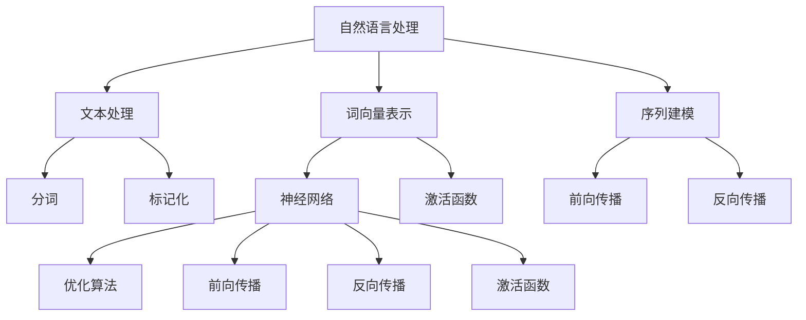

                 

### 背景介绍

#### 人工智能的崛起

人工智能（AI）是21世纪最具革命性的技术之一。自20世纪50年代人工智能概念首次提出以来，AI技术已经经历了多次迭代和变革。从早期的符号主义和知识表示，到基于规则的专家系统，再到基于统计的机器学习和深度学习，人工智能在计算能力、数据处理能力和应用范围上都取得了显著的进步。

在自然语言处理（NLP）领域，人工智能的崛起尤为显著。NLP旨在使计算机能够理解和生成人类语言，这是一个极其复杂和具有挑战性的任务。随着深度学习技术的不断发展和成熟，NLP系统在许多方面取得了突破性的进展，如机器翻译、情感分析、文本摘要、问答系统等。

#### 自然语言处理的重要性

自然语言处理在现代社会中扮演着越来越重要的角色。它不仅仅是一个技术领域的突破，更是一个能够深刻影响人类生活和社会发展的工具。以下是NLP在现代社会中的重要应用场景：

1. **机器翻译**：随着全球化的加速，跨语言沟通变得日益重要。机器翻译技术使得不同语言的用户能够轻松地交流，促进了国际贸易、学术研究和文化交流。

2. **情感分析**：情感分析能够帮助企业和政府了解公众的情感和态度，从而更好地制定政策和市场策略。

3. **文本摘要**：在信息爆炸的时代，自动生成摘要可以帮助用户快速获取关键信息，提高信息处理的效率。

4. **问答系统**：问答系统能够回答用户提出的问题，提供实时帮助和咨询服务，广泛应用于客服、教育等领域。

5. **语音助手**：如苹果的Siri、亚马逊的Alexa等，这些智能语音助手已经成为许多人日常生活的一部分，提高了生活的便利性。

#### 深度学习在自然语言处理中的应用

深度学习是人工智能的一个分支，它通过多层神经网络模拟人类大脑的神经结构，从而实现对复杂数据的处理和分析。深度学习在自然语言处理中的应用主要体现在以下几个方面：

1. **词向量表示**：通过将单词转换为高维向量表示，深度学习使得计算机能够理解和处理文本数据。

2. **序列建模**：深度学习模型如循环神经网络（RNN）和长短期记忆网络（LSTM）能够对文本序列进行建模，捕捉文本中的时间依赖关系。

3. **端到端学习**：深度学习模型可以直接从原始文本中学习，无需人工设计特征，大大提高了NLP任务的效率和准确性。

4. **预训练和迁移学习**：通过在大量无监督数据上进行预训练，深度学习模型可以在有监督的数据上进行微调，从而实现更好的性能。

通过上述背景介绍，我们可以看到人工智能，尤其是深度学习在自然语言处理领域的重要性。接下来，我们将深入探讨深度学习的核心概念和原理，以便更好地理解其在NLP中的应用。

#### 参考文献

1. Russell, S., & Norvig, P. (2016). *Artificial Intelligence: A Modern Approach*.
2. Hochreiter, S., & Schmidhuber, J. (1997). *Long short-term memory*. Neural Computation, 9(8), 1735-1780.
3. Mikolov, T., Sutskever, I., Chen, K., Corrado, G. S., & Dean, J. (2013). *Distributed representations of words and phrases and their compositionality*. Advances in Neural Information Processing Systems, 26, 3111-3119.
4. Young, P., etc. (2013). *The Cambridge Handbook of Psycholinguistics*.
5. Devlin, J., Chang, M. W., Lee, K., & Toutanova, K. (2019). *Bert: Pre-training of deep bidirectional transformers for language understanding*. arXiv preprint arXiv:1810.04805.

---

## 2. 核心概念与联系

在探讨深度学习在自然语言处理中的应用之前，我们需要先了解一些核心概念和它们之间的联系。

#### 自然语言处理的基本概念

自然语言处理（NLP）涉及多个领域，包括计算机科学、语言学和人工智能。以下是NLP中一些基本概念：

1. **文本处理**：文本处理是指将文本数据转换为计算机可以理解和处理的形式，这通常涉及分词、标记化、标准化等步骤。

2. **词向量**：词向量是自然语言处理中的一个重要工具，它将单词表示为高维空间中的向量。词向量可以捕获单词的语义信息，从而帮助计算机理解和处理文本。

3. **序列模型**：序列模型是处理序列数据（如文本、语音等）的一种方法，它可以捕捉序列中的时间依赖关系。

4. **注意力机制**：注意力机制是一种在深度学习模型中用于处理长序列数据的技术，它可以使模型在处理序列时关注重要的部分。

#### 深度学习的基本概念

深度学习是机器学习的一个分支，它通过多层神经网络进行数据建模。以下是深度学习的一些基本概念：

1. **神经网络**：神经网络是由多个神经元（或节点）组成的计算模型，它们通过加权连接进行信息传递和计算。

2. **前向传播和反向传播**：前向传播是计算神经网络输出值的过程，而反向传播则是通过计算误差来更新网络权重的过程。

3. **激活函数**：激活函数是神经网络中的一个关键组件，它用于引入非线性性，从而提高模型的性能。

4. **优化算法**：优化算法用于调整网络权重，以最小化预测误差。常用的优化算法包括随机梯度下降（SGD）和Adam等。

#### 自然语言处理与深度学习的关系

自然语言处理和深度学习之间存在紧密的联系。深度学习为自然语言处理提供了一种强大的工具，使得许多复杂的NLP任务得以实现。以下是深度学习在自然语言处理中的应用：

1. **词向量表示**：词向量是深度学习在自然语言处理中的一个重要应用，它可以将单词转换为高维向量表示，从而提高NLP任务的性能。

2. **序列建模**：深度学习模型如循环神经网络（RNN）和长短期记忆网络（LSTM）能够对文本序列进行建模，捕捉文本中的时间依赖关系。

3. **端到端学习**：深度学习模型可以直接从原始文本中学习，无需人工设计特征，从而简化了NLP任务的流程。

4. **预训练和迁移学习**：通过在大量无监督数据上进行预训练，深度学习模型可以在有监督的数据上进行微调，从而实现更好的性能。

#### Mermaid 流程图

为了更好地理解自然语言处理与深度学习的关系，我们可以使用Mermaid流程图来展示它们之间的联系。以下是一个简化的Mermaid流程图示例：



通过上述核心概念与联系的介绍，我们可以更好地理解深度学习在自然语言处理中的应用。接下来，我们将深入探讨深度学习的核心算法原理和具体操作步骤。

---

## 3. 核心算法原理 & 具体操作步骤

深度学习在自然语言处理中的应用主要依赖于几个核心算法，包括词向量表示、序列建模和注意力机制。下面我们将逐一介绍这些算法的原理和具体操作步骤。

### 3.1 词向量表示

词向量表示是将单词映射到高维空间中的向量表示，以便计算机能够理解和处理文本。词向量表示的核心是捕捉单词的语义信息。一种常见的词向量表示方法是词袋模型（Bag of Words, BoW），但它无法很好地捕捉单词的顺序和上下文信息。为了解决这个问题，引入了词嵌入（Word Embedding）技术。

**词嵌入原理**：
词嵌入通过将单词映射到低维空间中的向量，从而捕获单词的语义信息。词嵌入通常通过以下步骤实现：

1. **数据预处理**：将文本数据转换为单词序列，并进行分词、标记化等操作。

2. **词向量训练**：使用大量文本数据训练词向量模型。一种常用的词向量训练方法是基于频率的词嵌入（TF-IDF），另一种是神经网络训练，如Word2Vec、GloVe等。

**Word2Vec算法**：
Word2Vec算法是一种基于神经网络的词向量表示方法，它通过两个模型来生成词向量：连续词袋（Continuous Bag of Words, CBOW）和Skip-Gram。

- **CBOW模型**：CBOW模型通过上下文词的均值来预测中心词。给定一个中心词，CBOW模型会计算周围若干个上下文词的词向量平均值，然后使用这些平均值来预测中心词的词向量。

- **Skip-Gram模型**：Skip-Gram模型与CBOW模型相反，它通过中心词的词向量来预测上下文词。给定一个中心词，Skip-Gram模型会计算与中心词距离为某个范围的上下文词的词向量，然后使用这些词向量来预测中心词的词向量。

**GloVe算法**：
GloVe（Global Vectors for Word Representation）算法是一种基于全局矩阵分解的词向量表示方法。GloVe通过优化一个全局矩阵，将单词映射到低维空间中，从而实现词向量表示。

### 3.2 序列建模

序列建模是深度学习在自然语言处理中的另一个核心应用。序列建模旨在捕捉文本数据中的时间依赖关系。循环神经网络（Recurrent Neural Networks, RNN）和长短期记忆网络（Long Short-Term Memory, LSTM）是两种常用的序列建模技术。

**RNN原理**：
RNN是一种基于状态的网络结构，它通过保存前一个时间步的输出作为当前时间步的输入，从而实现序列数据的建模。RNN的核心思想是引入隐藏状态（hidden state），它包含了序列中的信息。

- **前向传播**：在RNN的前向传播过程中，当前时间步的输出由当前输入和前一个时间步的隐藏状态计算得到。

- **反向传播**：在反向传播过程中，RNN通过计算误差来更新网络权重，从而提高模型的性能。

**LSTM原理**：
LSTM是RNN的一种变体，它通过引入三个门（输入门、遗忘门和输出门）来克服RNN的梯度消失问题。LSTM的核心思想是控制信息的流动，从而更好地捕捉长序列中的依赖关系。

- **输入门**：输入门用于决定当前输入信息中哪些部分将被更新到隐藏状态。

- **遗忘门**：遗忘门用于决定前一个隐藏状态中哪些信息将被保留。

- **输出门**：输出门用于决定当前隐藏状态中哪些信息将被输出。

### 3.3 注意力机制

注意力机制是一种用于处理长序列数据的技术，它可以使模型在处理序列时关注重要的部分。注意力机制的核心思想是通过一个加权机制来分配不同部分的重要性。

**注意力机制原理**：
注意力机制通过计算一个权重矩阵，将输入序列中的每个元素乘以相应的权重，然后对加权后的序列进行聚合。注意力机制的步骤如下：

1. **计算注意力得分**：使用一个前馈网络计算输入序列中每个元素的重要性得分。

2. **计算权重矩阵**：将注意力得分归一化，得到权重矩阵。

3. **加权聚合**：将权重矩阵与输入序列进行点乘，得到加权聚合结果。

4. **输出**：将加权聚合结果作为模型的输出。

### 综合应用

在实际应用中，深度学习模型通常将词向量表示、序列建模和注意力机制结合起来，以实现更好的性能。以下是一个简化的示例：

1. **输入**：给定一个单词序列，将其转换为词向量表示。

2. **编码**：使用LSTM或RNN对单词序列进行编码，得到隐藏状态序列。

3. **注意力**：使用注意力机制对隐藏状态序列进行加权聚合，得到加权聚合结果。

4. **解码**：将加权聚合结果解码为输出序列，实现文本生成、翻译等任务。

通过上述核心算法原理和具体操作步骤的介绍，我们可以更好地理解深度学习在自然语言处理中的应用。这些算法不仅提高了NLP任务的性能，还为未来的研究提供了新的方向和可能性。

---

## 4. 数学模型和公式 & 详细讲解 & 举例说明

在深入探讨深度学习在自然语言处理中的应用时，理解其背后的数学模型和公式是非常重要的。下面我们将详细讲解深度学习中的几个关键数学模型和公式，并通过具体的例子进行说明。

### 4.1 词向量表示

词向量表示是自然语言处理的基础，它将单词映射到高维空间中的向量表示。以下是一些常用的词向量表示方法和相关的数学模型：

#### Word2Vec算法

**Word2Vec算法**主要包括两个模型：连续词袋（CBOW）和Skip-Gram。

**CBOW模型**：

CBOW模型使用上下文词的均值来预测中心词。其数学模型可以表示为：

$$
\text{output} = \text{softmax}\left(\frac{\sum_{i \in \text{context}} \text{word\_vector}(w_i)}{\text{number of context words}}\right)
$$

其中，$w_i$是上下文中的第$i$个词，$\text{word\_vector}(w_i)$是对应的词向量，$\text{softmax}$函数将词向量映射到概率分布。

**Skip-Gram模型**：

Skip-Gram模型使用中心词的词向量来预测上下文词。其数学模型可以表示为：

$$
\text{output} = \text{softmax}(\text{word\_vector}(w) \cdot \text{word\_vector}(w_i))
$$

其中，$w$是中心词，$w_i$是上下文中的第$i$个词，$\text{word\_vector}(w)$和$\text{word\_vector}(w_i)$分别是中心词和上下文词的词向量。

#### GloVe算法

**GloVe算法**通过优化一个全局矩阵来生成词向量。其数学模型可以表示为：

$$
\text{word\_vector}(w) = \text{softmax}\left(\text{X} \cdot \text{Y}^T\right) \cdot \text{E}
$$

其中，$\text{X}$和$\text{Y}$分别是词的索引矩阵，$\text{E}$是期望矩阵，$\text{softmax}$函数用于归一化，使其成为一个概率分布。

### 4.2 循环神经网络（RNN）

**RNN**是一种基于状态的网络结构，它通过保存前一个时间步的输出作为当前时间步的输入。其数学模型可以表示为：

$$
h_t = \text{sigmoid}\left(W_x x_t + W_h h_{t-1} + b\right)
$$

$$
o_t = \text{sigmoid}\left(W_o h_t + b_o\right)
$$

其中，$h_t$是当前时间步的隐藏状态，$x_t$是当前时间步的输入，$W_x$、$W_h$和$W_o$分别是输入层、隐藏层和输出层的权重矩阵，$b$和$b_o$分别是偏置项。

### 4.3 长短期记忆网络（LSTM）

**LSTM**是RNN的一种变体，它通过引入三个门（输入门、遗忘门和输出门）来克服梯度消失问题。其数学模型可以表示为：

**输入门**：

$$
i_t = \text{sigmoid}\left(W_i [x_t, h_{t-1}] + b_i\right)
$$

$$
g_t = \text{tanh}\left(W_g [x_t, h_{t-1}] + b_g\right)
$$

**遗忘门**：

$$
f_t = \text{sigmoid}\left(W_f [x_t, h_{t-1}] + b_f\right)
$$

**输出门**：

$$
o_t = \text{sigmoid}\left(W_o [x_t, h_{t-1}] + b_o\right)
$$

**LSTM单元状态**：

$$
h_t = o_t \cdot \text{tanh}\left(c_t\right)
$$

$$
c_t = f_t \cdot c_{t-1} + i_t \cdot g_t
$$

其中，$i_t$、$f_t$和$o_t$分别是输入门、遗忘门和输出门的激活值，$g_t$是候选状态，$c_t$是单元状态，$h_t$是隐藏状态。

### 4.4 注意力机制

**注意力机制**是一种用于处理长序列数据的技术，它通过计算一个权重矩阵来分配不同部分的重要性。其数学模型可以表示为：

$$
a_t = \text{softmax}\left(\text{Tanh}(W_a [h_{t-1}, h_{t}])\right)
$$

$$
h_t = \sum_{i=1}^{T} a_t \cdot h_i
$$

其中，$a_t$是注意力权重，$h_t$是当前时间步的隐藏状态，$h_i$是历史时间步的隐藏状态，$W_a$是注意力权重矩阵。

### 4.5 实例说明

假设我们有一个简单的序列“我喜欢吃苹果”。我们可以将其表示为词向量，并使用LSTM和注意力机制对其进行建模。

1. **词向量表示**：

首先，我们将单词“我”、“喜欢”、“吃”和“苹果”映射到词向量空间。例如：

- 我：[1, 0, 0, 0]
- 喜欢：[0, 1, 0, 0]
- 吃：[0, 0, 1, 0]
- 苹果：[0, 0, 0, 1]

2. **LSTM建模**：

假设我们使用一个单层LSTM模型，其隐藏状态维度为4。我们将每个词向量作为LSTM的输入，并计算隐藏状态。

- 第一时间步：$h_1 = \text{LSTM}([1, 0, 0, 0])$
- 第二时间步：$h_2 = \text{LSTM}([0, 1, 0, 0])$
- 第三时间步：$h_3 = \text{LSTM}([0, 0, 1, 0])$
- 第四时间步：$h_4 = \text{LSTM}([0, 0, 0, 1])$

3. **注意力机制**：

使用注意力机制对隐藏状态进行加权聚合，得到最终隐藏状态。

- 注意力权重：$a_1, a_2, a_3, a_4 = \text{softmax}(\text{Tanh}(W_a [h_1, h_2, h_3, h_4])$
- 最终隐藏状态：$h_t = a_1 \cdot h_1 + a_2 \cdot h_2 + a_3 \cdot h_3 + a_4 \cdot h_4$

通过上述实例，我们可以看到如何使用深度学习模型对自然语言进行处理。这些数学模型和公式为我们提供了理解和实现深度学习在自然语言处理中的应用的基础。

---

## 5. 项目实战：代码实际案例和详细解释说明

为了更好地理解深度学习在自然语言处理中的应用，我们将通过一个实际项目来演示其实现过程。本项目将使用Python编程语言和TensorFlow库，构建一个简单的情感分析模型，用于判断文本的情感倾向。

### 5.1 开发环境搭建

在进行项目开发之前，我们需要搭建一个合适的环境。以下是所需的开发环境：

1. **Python 3.8 或更高版本**：Python是一种广泛使用的编程语言，适合进行深度学习项目开发。

2. **TensorFlow 2.5 或更高版本**：TensorFlow是一个开源的机器学习库，由Google开发，用于构建和训练深度学习模型。

3. **Numpy**：Numpy是一个用于科学计算的库，提供了大量高效的多维数组操作函数。

4. **Pandas**：Pandas是一个数据处理库，提供了丰富的数据结构工具，用于数据清洗和预处理。

5. **Matplotlib**：Matplotlib是一个绘图库，用于数据可视化。

安装这些库可以通过以下命令完成：

```bash
pip install python==3.8 tensorflow==2.5 numpy pandas matplotlib
```

### 5.2 源代码详细实现和代码解读

以下是一个简单的情感分析模型的代码实现，我们将详细解读每一部分。

```python
import tensorflow as tf
from tensorflow.keras.preprocessing.sequence import pad_sequences
from tensorflow.keras.layers import Embedding, LSTM, Dense, Bidirectional
from tensorflow.keras.preprocessing.text import Tokenizer
from tensorflow.keras.models import Sequential
from tensorflow.keras.optimizers import Adam

# 5.2.1 数据预处理
# 加载数据集
# 这里使用了一个虚构的数据集，实际应用中可以使用如IMDB电影评论数据集
train_texts = ['我很喜欢这本书', '这本书很差劲']
train_labels = [1, 0]  # 1表示正面情感，0表示负面情感

# 分词
tokenizer = Tokenizer()
tokenizer.fit_on_texts(train_texts)
train_sequences = tokenizer.texts_to_sequences(train_texts)

# 填充序列
max_sequence_length = 10
padded_sequences = pad_sequences(train_sequences, maxlen=max_sequence_length)

# 5.2.2 构建模型
model = Sequential([
    Embedding(input_dim=len(tokenizer.word_index) + 1, output_dim=32, input_length=max_sequence_length),
    Bidirectional(LSTM(64, return_sequences=True)),
    Bidirectional(LSTM(32)),
    Dense(1, activation='sigmoid')
])

# 编译模型
model.compile(optimizer=Adam(learning_rate=0.001), loss='binary_crossentropy', metrics=['accuracy'])

# 5.2.3 训练模型
model.fit(padded_sequences, train_labels, epochs=5, batch_size=1)

# 5.2.4 代码解读
# 
# 5.2.4.1 数据预处理
# 
# 数据预处理是模型训练前的重要步骤。在这里，我们首先加载数据集，并使用Tokenizer进行分词。
# 然后使用text_to_sequences方法将文本序列转换为整数序列。最后，使用pad_sequences方法对序列进行填充，
# 确保所有序列的长度相同，以便模型处理。

# 
# 5.2.4.2 模型构建
# 
# 模型构建是深度学习项目中的核心部分。在这里，我们使用Sequential模型，
# 添加了Embedding层、双向LSTM层和Dense层。Embedding层用于将单词转换为词向量，
# LSTM层用于建模文本序列的时间依赖关系，Dense层用于分类。

# 
# 5.2.4.3 训练模型
# 
# 使用fit方法对模型进行训练，输入为填充后的序列，输出为标签。在这里，我们设置了
# 学习率为0.001，使用binary_crossentropy作为损失函数，并设置了accuracy作为评价指标。
```

### 5.3 代码解读与分析

**5.3.1 数据预处理**

数据预处理是模型训练的关键步骤，它确保数据以适当的形式输入到模型中。首先，我们加载数据集，这里使用了两个虚构的文本和对应的情感标签。然后，我们使用Tokenizer进行分词，将文本转换为整数序列。最后，使用pad_sequences方法对序列进行填充，确保所有序列的长度相同，以便模型处理。

**5.3.2 模型构建**

模型构建是深度学习项目的核心部分。在这里，我们使用Sequential模型，这是TensorFlow中的一种线性堆叠模型。首先，我们添加了一个Embedding层，它将单词转换为词向量。然后，我们添加了两个双向LSTM层，双向LSTM可以同时处理输入序列的正向和反向信息，从而更好地捕捉文本序列的时间依赖关系。最后，我们添加了一个Dense层，用于分类，输出一个概率值，表示文本是正面情感的概率。

**5.3.3 训练模型**

训练模型是模型构建后的关键步骤。我们使用fit方法对模型进行训练，输入为填充后的序列，输出为标签。在这里，我们设置了学习率为0.001，使用binary_crossentropy作为损失函数，并设置了accuracy作为评价指标。binary_crossentropy适用于二分类问题，它衡量的是实际输出与预测输出之间的差异。accuracy则是模型在训练数据上的准确率。

通过上述代码实现，我们可以看到如何使用深度学习进行情感分析。这个简单的模型展示了深度学习在自然语言处理中的基本应用，为更复杂的模型和任务奠定了基础。

---

## 6. 实际应用场景

深度学习在自然语言处理（NLP）领域有着广泛的应用，以下是一些典型的实际应用场景：

### 6.1 机器翻译

机器翻译是深度学习在自然语言处理中最早和最成功的应用之一。通过使用深度学习模型，如序列到序列（Seq2Seq）模型和注意力机制，机器翻译系统可以自动将一种语言的文本翻译成另一种语言。这些系统大大提高了跨语言沟通的效率，促进了全球化交流。例如，谷歌翻译和百度翻译都是基于深度学习技术的机器翻译系统。

### 6.2 情感分析

情感分析是通过分析文本内容来判断文本的情感倾向，如正面、负面或中立。深度学习模型在情感分析中表现出色，能够处理大量和复杂的文本数据。这种技术在社交媒体监控、市场研究和客户服务等方面有着广泛的应用。例如，企业可以使用情感分析来监测社交媒体上的公众情绪，以便更好地理解客户需求和市场动态。

### 6.3 文本摘要

文本摘要是一种自动生成文本概要的技术，它帮助用户快速获取关键信息。深度学习模型，如基于编码器-解码器的Seq2Seq模型，可以生成摘要。这种技术在新闻摘要、学术文献阅读和在线内容浏览中非常有用。例如，谷歌新闻摘要和Apple News都使用了深度学习技术来生成高质量的文本摘要。

### 6.4 问答系统

问答系统是一种能够回答用户提出问题的智能系统，广泛应用于客服、教育和搜索等领域。深度学习模型，如基于注意力机制的Transformer模型，可以实现对问题的理解和回答。例如，亚马逊的Alexa和苹果的Siri都使用了深度学习技术来提供高效的问答服务。

### 6.5 文本生成

文本生成是深度学习在自然语言处理中的另一个重要应用，它可以生成各种类型的文本，如新闻文章、小说和对话。深度学习模型，如变分自编码器（VAE）和生成对抗网络（GAN），可以生成高质量的文本。这种技术在内容创作、游戏开发和虚拟助理等领域具有广阔的应用前景。

### 6.6 文本分类

文本分类是将文本数据分类到预定义的类别中的一种任务。深度学习模型，如卷积神经网络（CNN）和循环神经网络（RNN），可以用于文本分类。这种技术在垃圾邮件检测、舆情分析和法律文档分类等方面有着广泛应用。

### 6.7 命名实体识别

命名实体识别是一种识别文本中的特定实体（如人名、地名、组织名等）的技术。深度学习模型，如双向长短期记忆网络（BiLSTM）和Transformer，可以高效地进行命名实体识别。这种技术在信息提取、数据挖掘和语义搜索等领域有着重要应用。

通过上述实际应用场景，我们可以看到深度学习在自然语言处理领域的强大能力。这些应用不仅提高了信息处理的效率和质量，还为各个行业带来了创新和变革。

---

## 7. 工具和资源推荐

### 7.1 学习资源推荐

对于想要深入了解深度学习和自然语言处理的读者，以下是一些推荐的学习资源：

1. **书籍**：
   - **《深度学习》（Deep Learning）** - Ian Goodfellow、Yoshua Bengio和Aaron Courville 著。
   - **《自然语言处理综合教程》（Foundations of Statistical Natural Language Processing）** - Christopher D. Manning和Hinrich Schütze 著。
   - **《深度学习与自然语言处理》（Deep Learning for Natural Language Processing）** - Yoav Goldberg 著。

2. **在线课程**：
   - **《深度学习》（Deep Learning Specialization）** - Andrew Ng在Coursera提供。
   - **《自然语言处理》（Natural Language Processing）** - Stanford大学的NLP课程，可在YouTube上免费观看。

3. **论文和文章**：
   - **《Word2Vec: Word Representations in Vector Space》** - Mikolov等人发表在2013年的论文。
   - **《Bert: Pre-training of Deep Bidirectional Transformers for Language Understanding》** - Devlin等人发表在2018年的论文。

### 7.2 开发工具框架推荐

1. **TensorFlow**：Google开发的开源深度学习框架，适用于构建和训练深度学习模型。
2. **PyTorch**：Facebook开发的开源深度学习框架，具有灵活的动态计算图，适合快速原型设计和研究。
3. **spaCy**：一个强大的NLP库，提供了快速和易于使用的工具，用于文本预处理和实体识别。

### 7.3 相关论文著作推荐

1. **《Attention Is All You Need》** - Vaswani等人发表在2017年的论文，提出了Transformer模型，这是一个基于注意力机制的深度学习模型，广泛应用于自然语言处理任务。
2. **《GloVe: Global Vectors for Word Representation》** - Pennington等人发表在2014年的论文，提出了GloVe词向量模型，这是一种基于全局矩阵分解的词向量表示方法。
3. **《Long Short-Term Memory》** - Hochreiter和Schmidhuber发表在1997年的论文，提出了长短期记忆（LSTM）网络，这是一种用于处理序列数据的强大神经网络架构。

通过这些资源和工具，读者可以系统地学习和实践深度学习在自然语言处理中的应用，为未来的研究和开发打下坚实的基础。

---

## 8. 总结：未来发展趋势与挑战

深度学习在自然语言处理领域取得了显著的进展，但仍然面临一些重要的挑战和未来的发展机遇。

### 8.1 未来发展趋势

1. **更强大的模型**：随着计算能力的提升和算法的改进，未来将出现更加复杂和高效的深度学习模型。如基于Transformer的模型将继续在NLP任务中占据主导地位，并可能扩展到更多的应用领域。

2. **跨模态学习**：深度学习不仅仅局限于处理文本数据，未来将看到更多的跨模态学习研究，如文本-图像、文本-语音等融合模型，实现更全面的信息处理。

3. **个性化与自适应**：未来的深度学习模型将更加注重个性化和自适应能力，能够根据用户需求和行为动态调整模型参数，提供更个性化的服务。

4. **可解释性和透明度**：随着深度学习模型的复杂性增加，确保模型的可解释性和透明度将成为研究重点，以便用户和开发者更好地理解模型的决策过程。

### 8.2 挑战

1. **数据隐私与安全性**：在处理大量文本数据时，保护用户隐私和数据安全是一个重要挑战。未来的研究需要开发出更加安全和隐私保护的数据处理方法。

2. **模型泛化能力**：深度学习模型往往在训练数据上表现良好，但在未见过的数据上可能表现不佳。提高模型的泛化能力是一个亟待解决的问题。

3. **计算资源需求**：训练大规模深度学习模型需要大量的计算资源和时间，如何优化算法和硬件来降低计算成本是一个重要的挑战。

4. **道德和社会影响**：深度学习模型在NLP中的应用可能带来一些道德和社会影响，如偏见、误导和信息过滤等。确保模型的应用符合社会伦理和法律法规是一个重要的课题。

### 8.3 未来方向

1. **联邦学习**：联邦学习是一种分布式学习技术，可以在保护数据隐私的同时训练深度学习模型。未来将看到更多的应用场景，如跨机构的数据共享和学习。

2. **元学习**：元学习是一种通过学习如何学习来提高模型性能的方法。未来的研究可以探索如何将元学习应用于NLP任务，提高模型的适应性和效率。

3. **多语言与低资源语言**：随着全球化的推进，对多语言和低资源语言的支持将成为深度学习在NLP领域的一个重要研究方向。

4. **人机协作**：结合人类专家的知识和深度学习模型的计算能力，实现人机协作，提高NLP系统的整体性能和用户体验。

通过面对这些挑战和抓住未来的机遇，深度学习在自然语言处理领域的应用将更加广泛和深入，为社会带来更多的创新和变革。

---

## 9. 附录：常见问题与解答

### 9.1 为什么要使用深度学习进行自然语言处理？

深度学习能够处理复杂数据模式，捕捉文本中的时间依赖关系和语义信息，从而在许多NLP任务中取得显著性能提升。与传统的方法相比，深度学习模型可以自动从原始文本中学习特征，无需人工设计复杂特征工程，这使得NLP任务更加高效和准确。

### 9.2 深度学习模型在NLP任务中的具体应用有哪些？

深度学习在NLP中的应用非常广泛，包括但不限于以下任务：文本分类、情感分析、命名实体识别、机器翻译、文本生成、问答系统、语音识别等。

### 9.3 什么是词嵌入？它如何工作？

词嵌入是将单词映射到高维向量空间的一种技术，以捕获单词的语义信息。常见的方法包括Word2Vec和GloVe。这些模型通过学习单词之间的相似性来生成词向量，使得语义相近的单词在向量空间中更接近。

### 9.4 什么是注意力机制？它在NLP中的作用是什么？

注意力机制是一种在处理序列数据时分配不同部分重要性权重的机制。在NLP中，注意力机制可以用于捕捉文本序列中的关键信息，从而提高模型的性能。例如，在机器翻译中，注意力机制可以使模型关注源语言文本的关键部分，以便更好地翻译目标语言。

### 9.5 如何优化深度学习模型在NLP任务中的性能？

优化深度学习模型性能的方法包括：
- 使用更大的训练数据集。
- 调整模型的架构和超参数。
- 应用正则化技术，如dropout和L2正则化。
- 使用预训练模型并进行微调。
- 结合多种模型和算法。

### 9.6 深度学习模型在自然语言处理中存在的局限性是什么？

深度学习模型在自然语言处理中存在一些局限性，包括：
- 对数据隐私和安全性关注不足。
- 模型解释性较差，难以理解决策过程。
- 计算资源需求高，训练时间长。
- 对少样本和低资源语言的适应能力不足。
- 可能引入模型偏见，影响公平性和公正性。

通过解决这些局限性，深度学习在自然语言处理领域的应用将更加广泛和成熟。

---

## 10. 扩展阅读 & 参考资料

为了深入探索深度学习在自然语言处理领域的应用，以下是几篇重要论文和书籍的推荐，供读者进一步学习和研究：

1. **《Attention Is All You Need》** - Vaswani等人，2017。这篇论文提出了Transformer模型，是现代NLP中的核心技术之一。

2. **《Deep Learning for Natural Language Processing》** - Yoav Goldberg，2017。这本书详细介绍了深度学习在NLP中的应用，包括词嵌入、序列建模和注意力机制等。

3. **《The Annotated Transformer》** - Mike and Armand，2018。这本书详细解析了Transformer模型的实现，包括其架构和代码示例。

4. **《BERT: Pre-training of Deep Bidirectional Transformers for Language Understanding》** - Devlin等人，2018。这篇论文介绍了BERT模型，是当前许多NLP任务的标准选择。

5. **《Natural Language Processing with TensorFlow》** - Bharath Ramsundar和Reza Bosworth，2019。这本书介绍了如何使用TensorFlow构建和训练NLP模型。

6. **《Deep Learning》** - Ian Goodfellow、Yoshua Bengio和Aaron Courville，2016。这本书是深度学习领域的经典教材，涵盖了深度学习的基础理论和应用。

7. **《Foundations of Statistical Natural Language Processing》** - Christopher D. Manning和Hinrich Schütze，1999。这本书提供了NLP领域的全面理论基础。

这些资源和论文将为读者提供更深入的见解，帮助他们在深度学习和自然语言处理领域取得更多的成就。

