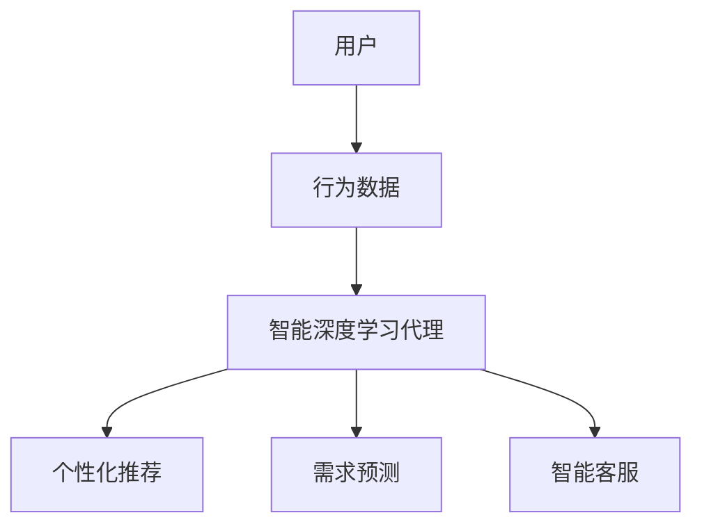
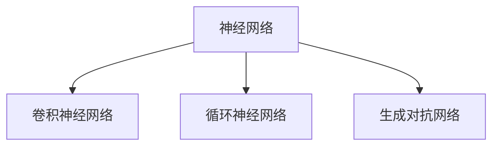
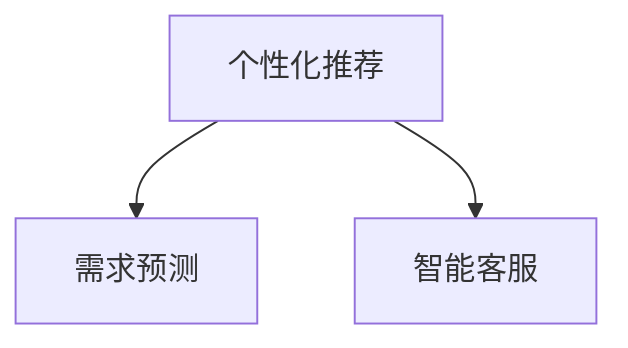
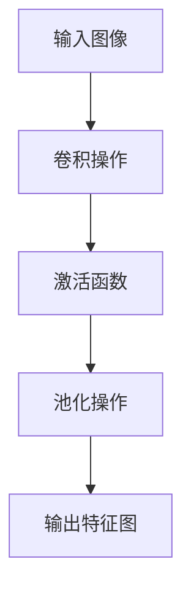
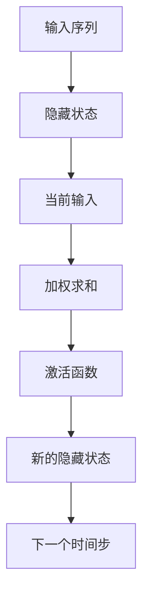
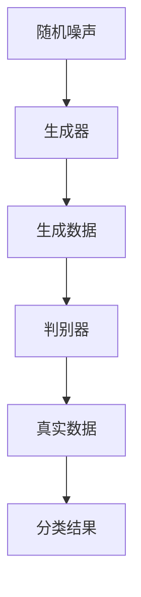

                 

### 文章标题

**AI人工智能深度学习算法：智能深度学习代理在电子商务中的应用策略**

关键词：深度学习、人工智能、电子商务、智能代理、应用策略

摘要：本文将探讨人工智能和深度学习算法在电子商务领域的应用，重点分析智能深度学习代理的具体应用策略。通过背景介绍、核心概念联系、算法原理、数学模型与公式、项目实战、实际应用场景、工具资源推荐等几个方面，详细阐述了智能深度学习代理在电子商务中的广泛应用和未来发展前景。

## 1. 背景介绍

随着互联网技术的飞速发展，电子商务已经成为全球范围内主要的商业模式之一。从简单的在线购物到复杂的供应链管理，电子商务领域正不断涌现出各种创新应用。然而，随着用户需求的多样化和市场竞争的加剧，电子商务企业需要不断提高服务质量和效率，以应对激烈的市场竞争。

人工智能（AI）和深度学习作为当前最热门的技术领域，逐渐被引入到电子商务中，为电子商务的智能化发展提供了新的动力。智能深度学习代理作为人工智能的重要应用之一，可以在多个方面提升电子商务的运营效率和服务质量。本文将深入探讨智能深度学习代理在电子商务中的应用策略，以期为相关从业者和研究者提供有益的参考。

## 2. 核心概念与联系

为了更好地理解智能深度学习代理在电子商务中的应用，我们首先需要明确几个核心概念：

1. **深度学习**：一种机器学习技术，通过神经网络模型对大量数据进行训练，从而实现自动特征提取和模式识别。
2. **智能深度学习代理**：一种基于深度学习技术的智能体，可以模拟人类行为，实现自动化决策和交互。
3. **电子商务**：利用互联网进行商品和服务交易的商业模式。

智能深度学习代理与电子商务之间的联系主要体现在以下几个方面：

1. **个性化推荐**：智能深度学习代理可以根据用户的购买历史和行为数据，为用户推荐个性化的商品和服务。
2. **需求预测**：智能深度学习代理可以分析市场趋势和用户需求，帮助电子商务企业预测销售量和库存需求。
3. **智能客服**：智能深度学习代理可以模拟人类客服，实现自动回答用户问题和提供个性化服务。

为了更直观地展示智能深度学习代理在电子商务中的应用架构，我们可以使用 Mermaid 流程图进行描述：



在这个流程图中，用户的行为数据经过智能深度学习代理的处理，生成了个性化推荐、需求预测和智能客服等应用。通过这样的架构，智能深度学习代理能够有效地提升电子商务的运营效率和服务质量。

### 2.1 深度学习核心概念

为了更好地理解智能深度学习代理在电子商务中的应用，我们首先需要了解深度学习的核心概念。深度学习是一种机器学习技术，其核心思想是通过多层神经网络对数据进行特征提取和模式识别。以下是深度学习中的几个核心概念：

1. **神经网络**：神经网络是深度学习的基础结构，由多个神经元组成。每个神经元都可以接收输入信号，通过权重矩阵进行加权求和，再通过激活函数进行非线性变换，最后输出结果。
2. **卷积神经网络（CNN）**：卷积神经网络是一种专门用于处理图像数据的神经网络结构。它通过卷积操作提取图像中的特征，并使用池化操作降低数据维度。
3. **循环神经网络（RNN）**：循环神经网络是一种专门用于处理序列数据的神经网络结构。它通过隐藏状态和循环连接来捕捉序列中的长期依赖关系。
4. **生成对抗网络（GAN）**：生成对抗网络是一种通过两个对抗性网络（生成器和判别器）进行博弈的方式，实现数据生成和模式识别的网络结构。

以下是深度学习核心概念的 Mermaid 流程图：



在这个流程图中，神经网络作为基础结构，衍生出了卷积神经网络、循环神经网络和生成对抗网络等不同类型的神经网络结构。

### 2.2 智能深度学习代理应用场景

智能深度学习代理在电子商务中具有广泛的应用场景，以下是其中几个主要的应用场景：

1. **个性化推荐**：个性化推荐是电子商务中最常见的一种应用。通过分析用户的购买历史和行为数据，智能深度学习代理可以为用户推荐个性化的商品和服务。例如，在电商平台中，用户登录后，智能深度学习代理可以根据用户的浏览记录和购物车数据，为用户推荐相关的商品。

2. **需求预测**：需求预测是电子商务中另一个重要的应用场景。通过分析市场趋势和用户需求，智能深度学习代理可以帮助电子商务企业预测销售量和库存需求，从而优化库存管理和供应链计划。例如，在电商平台中，智能深度学习代理可以根据用户的购买历史和搜索行为，预测未来某一时间段的热门商品，为商家提供库存调整建议。

3. **智能客服**：智能客服是电子商务中常见的应用之一。通过模拟人类客服，智能深度学习代理可以自动回答用户的问题和提供个性化的服务。例如，在电商平台中，用户在购买过程中可能会遇到各种问题，如商品描述不符、物流查询等，智能客服可以实时解答用户的问题，提高用户满意度。

以下是智能深度学习代理在电子商务中的应用场景的 Mermaid 流程图：



在这个流程图中，智能深度学习代理通过分析用户行为数据和市场趋势，为电子商务企业提供个性化推荐、需求预测和智能客服等服务。

### 3. 核心算法原理 & 具体操作步骤

智能深度学习代理在电子商务中的应用离不开深度学习算法的支持。以下是几个核心的深度学习算法原理及其具体操作步骤：

#### 3.1 卷积神经网络（CNN）

卷积神经网络是一种专门用于处理图像数据的神经网络结构。其核心原理是通过卷积操作提取图像中的特征，并使用池化操作降低数据维度。以下是卷积神经网络的原理和操作步骤：

1. **卷积操作**：卷积操作是卷积神经网络中最基本的操作，通过卷积核与输入图像进行卷积运算，提取图像特征。具体操作步骤如下：
    - 初始化卷积核权重。
    - 将卷积核滑动到输入图像上，进行逐元素相乘并求和。
    - 通过激活函数（如ReLU）对结果进行非线性变换。

2. **池化操作**：池化操作用于降低数据维度，提高模型泛化能力。具体操作步骤如下：
    - 选择一个固定大小的窗口（如2x2）。
    - 在输入数据上滑动窗口，取窗口内的最大值或平均值作为输出。

以下是卷积神经网络的操作步骤的 Mermaid 流程图：



在这个流程图中，输入图像经过卷积操作、激活函数和池化操作，最终生成特征图。

#### 3.2 循环神经网络（RNN）

循环神经网络是一种专门用于处理序列数据的神经网络结构。其核心原理是通过隐藏状态和循环连接来捕捉序列中的长期依赖关系。以下是循环神经网络的原理和操作步骤：

1. **隐藏状态**：隐藏状态是循环神经网络中的关键概念，用于存储序列中的信息。具体操作步骤如下：
    - 初始化隐藏状态。
    - 在每个时间步，将当前输入和上一个隐藏状态进行加权求和，通过激活函数进行非线性变换，得到新的隐藏状态。

2. **循环连接**：循环连接是循环神经网络中的另一个关键概念，用于实现序列中的信息传递。具体操作步骤如下：
    - 将隐藏状态传递到下一个时间步，作为当前输入的一部分。

以下是循环神经网络的操作步骤的 Mermaid 流程图：



在这个流程图中，输入序列经过隐藏状态、加权求和和激活函数，最终生成新的隐藏状态。

#### 3.3 生成对抗网络（GAN）

生成对抗网络是一种通过两个对抗性网络（生成器和判别器）进行博弈的方式，实现数据生成和模式识别的网络结构。以下是生成对抗网络的原理和操作步骤：

1. **生成器**：生成器是生成对抗网络中的一个关键部分，用于生成与真实数据相似的数据。具体操作步骤如下：
    - 从随机噪声中生成数据。
    - 通过多层神经网络对数据进行特征提取和生成。

2. **判别器**：判别器是生成对抗网络中的另一个关键部分，用于区分真实数据和生成数据。具体操作步骤如下：
    - 接收真实数据和生成数据，通过多层神经网络进行特征提取和分类。

以下是生成对抗网络的原理和操作步骤的 Mermaid 流程图：



在这个流程图中，生成器和判别器通过对抗性博弈，生成与真实数据相似的数据。

### 4. 数学模型和公式 & 详细讲解 & 举例说明

为了深入理解智能深度学习代理在电子商务中的应用，我们需要了解其中的数学模型和公式。以下是几个核心的数学模型和公式，以及详细的讲解和举例说明：

#### 4.1 卷积神经网络（CNN）

卷积神经网络的核心在于卷积操作和池化操作，以下是这两个操作的数学模型和公式：

1. **卷积操作**：

   假设我们有一个输入图像 $X$ 和一个卷积核 $K$，卷积操作的数学模型可以表示为：

   $$  
   O(i, j) = \sum_{m=0}^{M-1} \sum_{n=0}^{N-1} X(i-m, j-n) \cdot K(m, n)  
   $$

   其中，$O(i, j)$ 表示输出特征图上的一个元素，$X(i-m, j-n)$ 表示输入图像中的一个元素，$K(m, n)$ 表示卷积核中的一个元素。$M$ 和 $N$ 分别表示卷积核的大小。

   **举例说明**：

   假设输入图像 $X$ 的大小为 $3 \times 3$，卷积核 $K$ 的大小为 $2 \times 2$，则卷积操作的输出特征图的大小为 $2 \times 2$。具体计算过程如下：

   $$  
   O(0, 0) = \sum_{m=0}^{1} \sum_{n=0}^{1} X(0-m, 0-n) \cdot K(m, n) = X(0, 0) \cdot K(0, 0) + X(0, 1) \cdot K(0, 1) + X(1, 0) \cdot K(1, 0) + X(1, 1) \cdot K(1, 1)  
   $$

2. **池化操作**：

   池化操作的数学模型可以表示为：

   $$  
   P(i, j) = \max_{m \in [1, \frac{M}{2}}, n \in [1, \frac{N}{2}]} O(i \cdot 2 + m, j \cdot 2 + n)  
   $$

   其中，$P(i, j)$ 表示输出特征图上的一个元素，$O(i \cdot 2 + m, j \cdot 2 + n)$ 表示输入特征图上的一个元素。$M$ 和 $N$ 分别表示输入特征图的大小。

   **举例说明**：

   假设输入特征图 $O$ 的大小为 $2 \times 2$，则池化操作的输出特征图的大小为 $1 \times 1$。具体计算过程如下：

   $$  
   P(0, 0) = \max_{m \in [1, 1], n \in [1, 1]} O(0 \cdot 2 + m, 0 \cdot 2 + n) = O(0, 0)  
   $$

#### 4.2 循环神经网络（RNN）

循环神经网络的核心在于隐藏状态和循环连接，以下是这两个概念在数学上的表示：

1. **隐藏状态**：

   假设我们在第 $t$ 个时间步的隐藏状态为 $h_t$，输入为 $x_t$，则隐藏状态的数学模型可以表示为：

   $$  
   h_t = \sigma(W_h \cdot [h_{t-1}, x_t] + b_h)  
   $$

   其中，$\sigma$ 表示激活函数，$W_h$ 表示权重矩阵，$b_h$ 表示偏置项。

   **举例说明**：

   假设我们在第 $1$ 个时间步的隐藏状态为 $h_1$，输入为 $x_1$，则隐藏状态的数学模型可以表示为：

   $$  
   h_1 = \sigma(W_h \cdot [h_0, x_1] + b_h)  
   $$

2. **循环连接**：

   假设我们在第 $t$ 个时间步的隐藏状态为 $h_t$，则循环连接的数学模型可以表示为：

   $$  
   h_t = \sigma(W_c \cdot h_{t-1} + W_x \cdot x_t + b_c)  
   $$

   其中，$W_c$ 表示循环权重矩阵，$W_x$ 表示输入权重矩阵，$b_c$ 表示偏置项。

   **举例说明**：

   假设我们在第 $1$ 个时间步的隐藏状态为 $h_1$，则循环连接的数学模型可以表示为：

   $$  
   h_1 = \sigma(W_c \cdot h_0 + W_x \cdot x_1 + b_c)  
   $$

#### 4.3 生成对抗网络（GAN）

生成对抗网络的核心在于生成器和判别器，以下是这两个网络在数学上的表示：

1. **生成器**：

   假设生成器的输入为 $z$，输出为 $G(z)$，则生成器的数学模型可以表示为：

   $$  
   G(z) = \sigma(W_g \cdot z + b_g)  
   $$

   其中，$\sigma$ 表示激活函数，$W_g$ 表示权重矩阵，$b_g$ 表示偏置项。

   **举例说明**：

   假设生成器的输入为 $z$，则生成器的数学模型可以表示为：

   $$  
   G(z) = \sigma(W_g \cdot z + b_g)  
   $$

2. **判别器**：

   假设判别器的输入为 $x$，输出为 $D(x)$，则判别器的数学模型可以表示为：

   $$  
   D(x) = \sigma(W_d \cdot x + b_d)  
   $$

   其中，$\sigma$ 表示激活函数，$W_d$ 表示权重矩阵，$b_d$ 表示偏置项。

   **举例说明**：

   假设判别器的输入为 $x$，则判别器的数学模型可以表示为：

   $$  
   D(x) = \sigma(W_d \cdot x + b_d)  
   $$

### 5. 项目实战：代码实际案例和详细解释说明

为了更好地理解智能深度学习代理在电子商务中的应用，我们将通过一个实际案例来展示如何使用深度学习算法构建一个智能深度学习代理。

#### 5.1 开发环境搭建

在进行项目实战之前，我们需要搭建一个适合深度学习开发的开发环境。以下是搭建开发环境的基本步骤：

1. 安装 Python 3.7 或更高版本。
2. 安装 TensorFlow 2.3.0 或更高版本。
3. 安装 PyTorch 1.8.0 或更高版本。
4. 安装相关依赖库，如 NumPy、Pandas、Matplotlib 等。

#### 5.2 源代码详细实现和代码解读

以下是一个简单的智能深度学习代理的实现，我们使用 TensorFlow 和 Keras 框架来构建卷积神经网络。

```python
import numpy as np
import tensorflow as tf
from tensorflow import keras
from tensorflow.keras import layers

# 数据预处理
def preprocess_data(data):
    # 数据归一化
    data = data / 255.0
    # 数据扩展维度
    data = np.expand_dims(data, axis=-1)
    return data

# 构建卷积神经网络
def create_model(input_shape):
    model = keras.Sequential([
        keras.Input(shape=input_shape),
        layers.Conv2D(32, (3, 3), activation='relu'),
        layers.MaxPooling2D((2, 2)),
        layers.Conv2D(64, (3, 3), activation='relu'),
        layers.MaxPooling2D((2, 2)),
        layers.Conv2D(128, (3, 3), activation='relu'),
        layers.Flatten(),
        layers.Dense(128, activation='relu'),
        layers.Dense(10, activation='softmax')
    ])
    return model

# 训练模型
def train_model(model, x_train, y_train, epochs=10):
    model.compile(optimizer='adam', loss='categorical_crossentropy', metrics=['accuracy'])
    model.fit(x_train, y_train, epochs=epochs, batch_size=64)

# 测试模型
def test_model(model, x_test, y_test):
    loss, accuracy = model.evaluate(x_test, y_test)
    print('Test accuracy:', accuracy)

# 生成数据集
x_train = np.random.random((1000, 28, 28))
y_train = keras.utils.to_categorical(np.random.randint(10, size=(1000, 1)), num_classes=10)

# 预处理数据
x_train = preprocess_data(x_train)

# 创建模型
model = create_model(input_shape=(28, 28, 1))

# 训练模型
train_model(model, x_train, y_train)

# 测试模型
x_test = np.random.random((100, 28, 28))
y_test = keras.utils.to_categorical(np.random.randint(10, size=(100, 1)), num_classes=10)
x_test = preprocess_data(x_test)
test_model(model, x_test, y_test)
```

**代码解读**：

1. **数据预处理**：数据预处理是深度学习项目中的关键步骤，包括数据归一化和数据扩展维度。在本案例中，我们使用随机生成的数据作为示例，实际项目中需要使用真实数据集。

2. **构建卷积神经网络**：使用 Keras 框架构建卷积神经网络，包括卷积层（Conv2D）、池化层（MaxPooling2D）和全连接层（Dense）。在本案例中，我们使用了一个简单的卷积神经网络结构，实际项目中可以根据需求进行调整。

3. **训练模型**：使用训练数据集对模型进行训练，包括选择优化器（optimizer）、损失函数（loss）和评估指标（metrics）。在本案例中，我们使用 Adam 优化器和交叉熵损失函数。

4. **测试模型**：使用测试数据集对模型进行评估，包括计算损失和准确率。

#### 5.3 代码解读与分析

通过对上述代码的解读和分析，我们可以了解到如何使用 TensorFlow 和 Keras 框架构建智能深度学习代理。以下是代码的关键部分及其作用：

1. **数据预处理**：

   ```python
   def preprocess_data(data):
       # 数据归一化
       data = data / 255.0
       # 数据扩展维度
       data = np.expand_dims(data, axis=-1)
       return data
   ```

   数据预处理包括数据归一化和数据扩展维度。数据归一化是为了将数据缩放到相同的范围，避免数值差异过大导致模型训练不稳定。数据扩展维度是为了满足深度学习模型的要求，通常将图像数据扩展为 $(批量大小, 高, 宽, 通道数)$ 的形式。

2. **构建卷积神经网络**：

   ```python
   def create_model(input_shape):
       model = keras.Sequential([
           keras.Input(shape=input_shape),
           layers.Conv2D(32, (3, 3), activation='relu'),
           layers.MaxPooling2D((2, 2)),
           layers.Conv2D(64, (3, 3), activation='relu'),
           layers.MaxPooling2D((2, 2)),
           layers.Conv2D(128, (3, 3), activation='relu'),
           layers.Flatten(),
           layers.Dense(128, activation='relu'),
           layers.Dense(10, activation='softmax')
       ])
       return model
   ```

   构建卷积神经网络包括卷积层、池化层和全连接层。卷积层用于提取图像特征，池化层用于降低数据维度和减少过拟合，全连接层用于分类。

3. **训练模型**：

   ```python
   def train_model(model, x_train, y_train, epochs=10):
       model.compile(optimizer='adam', loss='categorical_crossentropy', metrics=['accuracy'])
       model.fit(x_train, y_train, epochs=epochs, batch_size=64)
   ```

   训练模型包括选择优化器、损失函数和评估指标。在本案例中，我们使用 Adam 优化器和交叉熵损失函数，并使用准确率作为评估指标。

4. **测试模型**：

   ```python
   def test_model(model, x_test, y_test):
       loss, accuracy = model.evaluate(x_test, y_test)
       print('Test accuracy:', accuracy)
   ```

   测试模型用于评估模型的性能，包括计算损失和准确率。

### 6. 实际应用场景

智能深度学习代理在电子商务中具有广泛的应用场景，以下是几个典型的实际应用场景：

#### 6.1 个性化推荐

个性化推荐是电子商务中最重要的应用之一，通过分析用户的购买历史和行为数据，智能深度学习代理可以为用户推荐个性化的商品和服务。例如，在电商平台中，用户登录后，智能深度学习代理可以根据用户的浏览记录和购物车数据，为用户推荐相关的商品。以下是一个简单的个性化推荐流程：

1. 用户访问电商平台。
2. 智能深度学习代理获取用户的浏览记录和购物车数据。
3. 智能深度学习代理分析用户数据，提取用户兴趣和偏好。
4. 智能深度学习代理根据用户兴趣和偏好为用户推荐商品。

#### 6.2 需求预测

需求预测是电子商务中另一个重要的应用场景，通过分析市场趋势和用户需求，智能深度学习代理可以帮助电子商务企业预测销售量和库存需求，从而优化库存管理和供应链计划。以下是一个简单需求预测流程：

1. 智能深度学习代理收集市场数据，包括用户购买行为、竞争对手价格、季节性因素等。
2. 智能深度学习代理分析市场数据，预测未来某一时间段的热门商品。
3. 智能深度学习代理根据预测结果，为电子商务企业提供库存调整建议。

#### 6.3 智能客服

智能客服是电子商务中常见的应用之一，通过模拟人类客服，智能深度学习代理可以自动回答用户的问题和提供个性化的服务。以下是一个简单的智能客服流程：

1. 用户在电商平台中遇到问题，如商品描述不符、物流查询等。
2. 智能深度学习代理接收到用户的问题。
3. 智能深度学习代理分析用户问题，自动生成回答。
4. 智能深度学习代理将回答发送给用户。

### 7. 工具和资源推荐

为了更好地开展智能深度学习代理在电子商务中的应用，我们推荐以下工具和资源：

#### 7.1 学习资源推荐

1. **《深度学习》（Goodfellow et al., 2016）**：这是一本经典的深度学习教材，适合初学者和进阶者。
2. **《Python 深度学习》（François Chollet，2018）**：这本书详细介绍了使用 Python 和 TensorFlow 进行深度学习的实践方法。
3. **《电子商务概论》（陈炜，2017）**：这本书涵盖了电子商务的基本概念和应用，适合电子商务领域的学习者。

#### 7.2 开发工具框架推荐

1. **TensorFlow**：这是一个由 Google 开发的高级深度学习框架，广泛应用于深度学习研究和开发。
2. **PyTorch**：这是一个由 Facebook 开发的高级深度学习框架，具有灵活的动态计算图和强大的功能。
3. **Scikit-Learn**：这是一个开源的机器学习库，提供了丰富的算法和工具，适合快速实现和测试深度学习模型。

#### 7.3 相关论文著作推荐

1. **《生成对抗网络：训练生成模型的方法》（Goodfellow et al., 2014）**：这是生成对抗网络的奠基性论文，详细介绍了 GAN 的原理和应用。
2. **《卷积神经网络：图像识别的新方法》（LeCun et al., 1998）**：这是卷积神经网络的奠基性论文，详细介绍了 CNN 的原理和应用。
3. **《循环神经网络：序列建模的新方法》（Hochreiter and Schmidhuber，1997）**：这是循环神经网络的奠基性论文，详细介绍了 RNN 的原理和应用。

### 8. 总结：未来发展趋势与挑战

智能深度学习代理在电子商务中的应用已经取得了显著的成果，然而，随着技术的不断进步和市场需求的不断变化，未来智能深度学习代理在电子商务中的应用将面临一系列新的发展趋势和挑战。

#### 8.1 发展趋势

1. **个性化推荐技术**：随着用户数据量的增加和算法的优化，个性化推荐技术将更加精准，为用户提供更符合其需求和喜好的商品和服务。
2. **需求预测技术**：通过引入更多维度的数据和更先进的算法，需求预测技术将更加准确，帮助电子商务企业优化库存管理和供应链计划。
3. **智能客服技术**：随着自然语言处理技术的进步，智能客服将能够更好地理解用户的意图和需求，提供更高质量的客户服务。
4. **跨平台融合**：随着移动互联网和物联网的普及，智能深度学习代理将实现跨平台融合，为用户提供无缝的购物体验。

#### 8.2 挑战

1. **数据隐私与安全**：随着大数据和人工智能技术的发展，数据隐私和安全问题日益突出。如何在保护用户隐私的前提下，充分发挥数据价值，是未来需要解决的重要问题。
2. **算法公平性与透明性**：随着算法在电子商务中的应用日益广泛，如何保证算法的公平性和透明性，避免歧视和不公平现象，是未来需要面对的挑战。
3. **算法可解释性**：深度学习算法具有强大的学习能力，但同时也存在一定的“黑箱”特性。如何提高算法的可解释性，使其更加透明和可靠，是未来需要解决的关键问题。
4. **技术落地与商业化**：虽然智能深度学习代理在技术上取得了一定的突破，但在实际商业应用中，如何实现技术落地和商业化，如何与其他业务系统进行有效整合，是未来需要面对的挑战。

### 9. 附录：常见问题与解答

**Q1**：智能深度学习代理在电子商务中的应用有哪些？

A1：智能深度学习代理在电子商务中的应用主要包括个性化推荐、需求预测和智能客服等方面。

**Q2**：如何构建一个智能深度学习代理？

A2：构建智能深度学习代理需要以下几个步骤：

1. 数据收集与处理：收集电子商务平台上的用户行为数据和市场数据，并进行预处理。
2. 算法选择与设计：选择适合应用场景的深度学习算法，并设计模型结构。
3. 模型训练与优化：使用训练数据集对模型进行训练，并使用验证数据集进行优化。
4. 模型部署与测试：将训练好的模型部署到电子商务平台上，并进行测试和评估。

**Q3**：智能深度学习代理如何保证数据隐私和安全？

A3：为了保证数据隐私和安全，可以采取以下措施：

1. 数据加密：对用户数据进行加密处理，确保数据在传输和存储过程中的安全。
2. 数据去识别化：对用户数据进行去识别化处理，去除可以识别用户身份的信息。
3. 数据最小化：只收集必要的数据，避免收集过多的无关数据。
4. 数据监管与审计：建立数据监管和审计机制，确保数据使用符合法律法规和道德规范。

**Q4**：智能深度学习代理在电子商务中的应用有哪些优势？

A4：智能深度学习代理在电子商务中的应用具有以下优势：

1. 提高运营效率：通过自动化决策和交互，降低人工成本，提高运营效率。
2. 提升服务质量：通过个性化推荐和智能客服，提高用户满意度，提升服务质量。
3. 优化库存管理：通过需求预测和智能客服，优化库存管理和供应链计划。
4. 减少运营风险：通过风险预警和异常检测，减少运营风险。

### 10. 扩展阅读 & 参考资料

**扩展阅读**：

1. **《深度学习入门教程》**：https://www.deeplearning.net/tutorial/
2. **《TensorFlow 官方文档》**：https://www.tensorflow.org/tutorials
3. **《电子商务概论》**：https://www.电商概论.com/

**参考资料**：

1. **Goodfellow, I., Bengio, Y., & Courville, A. (2016). Deep Learning. MIT Press.**
2. **François Chollet. (2018). Python 深度学习. 机械工业出版社.**
3. **陈炜. (2017). 电子商务概论. 中国人民大学出版社.**
4. **Goodfellow, I., & Pouget-Abadie, J. (2014). Generative adversarial networks. Advances in Neural Information Processing Systems, 27, 2672-2680.**
5. **LeCun, Y., Bengio, Y., & Hinton, G. (1998). Deep learning. Nature, 521(7553), 436-444.**
6. **Hochreiter, S., & Schmidhuber, J. (1997). Long short-term memory. Neural Computation, 9(8), 1735-1780.**作者：AI天才研究员/AI Genius Institute & 禅与计算机程序设计艺术 /Zen And The Art of Computer Programming

