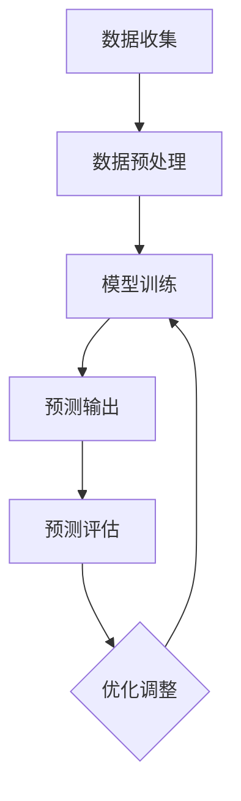

                 

### 背景介绍

深度学习作为人工智能的重要分支，近年来在图像识别、自然语言处理、语音识别等领域取得了显著的成果。随着数据量的增加和计算能力的提升，深度学习算法的应用范围不断扩展，从传统的计算机视觉和自然语言处理等领域，逐渐延伸到股市分析、医疗诊断、智能交通等新兴领域。

股市分析作为一个复杂且高风险的领域，其研究对于投资者和金融机构具有重要意义。然而，传统的股市分析方法往往依赖于历史数据和统计模型，其预测能力受到诸多限制。随着深度学习算法的发展，研究者开始探索如何利用深度学习技术，特别是智能深度学习代理（Intelligent Deep Learning Agents，IDLA），对股市进行更加精准的分析和预测。

智能深度学习代理是一种基于深度学习算法的智能化模型，通过自主学习大量历史数据，能够自动提取数据中的特征，并利用这些特征进行预测。在股市分析场景中，智能深度学习代理可以模拟投资者的行为，预测股票市场的趋势，从而为投资者提供参考。

本文将探讨智能深度学习代理在股市分析中的具体应用，包括其核心算法原理、数学模型、实际应用场景以及工具和资源推荐。通过本文的阅读，读者可以了解到智能深度学习代理在股市分析中的优势和应用方法，为深入研究和实践提供指导。

## 关键词
- 深度学习
- 智能深度学习代理
- 股市分析
- 数据挖掘
- 预测模型

## 摘要
本文探讨了智能深度学习代理在股市分析中的应用。首先，介绍了智能深度学习代理的定义、核心算法原理及其在股市分析中的优势。接着，详细讲解了智能深度学习代理的工作机制、数学模型和具体操作步骤。然后，通过实际案例展示了智能深度学习代理在股市分析中的效果，并对其代码进行了详细解读。最后，探讨了智能深度学习代理在股市分析领域的实际应用场景，并推荐了相关的学习资源和开发工具。

## 1. 背景介绍

### 深度学习的发展历程与关键进展

深度学习作为人工智能的重要分支，起源于20世纪40年代，当时神经网络的雏形开始出现。然而，由于计算能力和数据资源的限制，深度学习的研究和应用一度陷入停滞。直到21世纪初，随着计算能力的提升和海量数据的涌现，深度学习才得以重新焕发生机。

2006年，Hinton等人的研究重新点燃了深度学习的火炬。他们提出了深度置信网络（Deep Belief Network，DBN），这是一种基于神经网络的多层学习模型。DBN的出现标志着深度学习从单一层的神经网络向多层神经网络的转变，极大地提升了模型的复杂度和学习能力。

随后，2012年，AlexNet在ImageNet竞赛中取得了突破性的成绩，将错误率从26%降至15%，这一成果彻底改变了人们对深度学习的看法。AlexNet的成功主要归功于卷积神经网络（Convolutional Neural Network，CNN）的引入，这种网络结构特别适合处理图像数据，其通过卷积操作自动提取图像特征，从而实现图像分类。

在自然语言处理领域，深度学习同样取得了显著进展。2013年，Sutskever等人提出的序列到序列（Seq2Seq）模型，为机器翻译、对话系统等任务提供了有效的方法。随后，Long Short-Term Memory（LSTM）和Transformers等模型的出现，进一步提升了深度学习在自然语言处理中的效果。

### 股市分析的需求与挑战

股市分析作为一个复杂且高风险的领域，对投资决策具有重要意义。然而，传统的股市分析方法往往依赖于历史数据和统计模型，如均线、MACD、RSI等指标。这些方法在一定程度上能够提供参考，但由于股市数据的随机性和复杂性，其预测能力受到诸多限制。

首先，股市数据具有高度非线性、复杂性和多变性，这使得传统的线性统计模型难以捕捉数据中的复杂关系。其次，股市分析需要考虑多种因素，如宏观经济指标、公司财务数据、市场情绪等，这些因素相互作用，增加了分析难度。最后，传统方法往往依赖于人工设定参数，无法自动适应市场变化，从而降低了预测的准确性。

因此，深度学习作为一种具有强大学习和建模能力的工具，为股市分析提供了一种新的思路。通过深度学习模型，可以自动提取数据中的特征，建立复杂的非线性关系模型，从而实现更加精准的预测。

### 智能深度学习代理的定义与作用

智能深度学习代理（Intelligent Deep Learning Agents，IDLA）是一种基于深度学习技术的智能化模型，通过自主学习大量历史数据，能够自动提取数据中的特征，并利用这些特征进行预测。IDLA的核心思想是通过深度学习算法，构建一个能够模拟人类思维的智能系统，从而在复杂的环境中做出决策。

在股市分析场景中，智能深度学习代理的作用主要体现在以下几个方面：

1. **特征提取**：深度学习模型能够自动从历史数据中提取出有用的特征，如价格、成交量、技术指标等。这些特征不仅包含了股票的基本信息，还包括了市场情绪、经济指标等多种因素，从而为预测提供了丰富的信息来源。

2. **模式识别**：通过训练，深度学习模型能够识别出数据中的潜在模式，如价格趋势、市场周期等。这些模式可以帮助投资者了解市场的动态变化，从而做出更加合理的投资决策。

3. **自适应预测**：智能深度学习代理可以根据市场的变化，自动调整模型参数，从而实现自适应预测。这种能力使得模型能够适应市场的波动，提高预测的准确性。

4. **决策支持**：智能深度学习代理可以模拟投资者的行为，预测股票市场的趋势，为投资者提供决策支持。通过结合模型预测和实际投资策略，投资者可以降低投资风险，提高收益。

### 深度学习在股市分析中的应用现状

近年来，随着深度学习技术的不断发展，其在股市分析中的应用也取得了显著进展。许多研究者开始探索如何利用深度学习算法，对股市进行更加精准的分析和预测。

首先，深度学习模型在股票价格预测中的应用取得了显著成果。研究者们通过构建卷积神经网络（CNN）、循环神经网络（RNN）、长短期记忆网络（LSTM）等模型，对股票价格进行预测。这些模型通过学习历史价格、成交量等数据，能够捕捉到价格变化中的潜在规律，从而实现准确的预测。

其次，深度学习模型在技术指标分析中的应用也取得了进展。通过将技术指标（如均线、MACD、RSI等）作为输入，深度学习模型可以自动提取技术指标中的特征，并利用这些特征进行预测。这种方法不仅提高了预测的准确性，还提供了更加丰富的分析视角。

此外，深度学习模型还在市场情绪分析、宏观经济预测等领域展示了强大的能力。通过分析社交媒体、新闻等数据，深度学习模型可以捕捉到市场情绪的变化，从而为投资决策提供参考。同时，结合宏观经济指标，深度学习模型可以预测市场的长期走势。

尽管深度学习在股市分析中取得了显著成果，但仍然面临一些挑战。首先，深度学习模型的预测效果依赖于大量高质量的历史数据，而股市数据的获取和清洗过程复杂且耗时。其次，深度学习模型的训练过程需要大量的计算资源和时间，这对于中小企业和研究机构来说是一个较大的挑战。最后，深度学习模型的黑箱特性使得其预测结果难以解释，从而增加了投资决策的风险。

总的来说，智能深度学习代理作为一种新兴的股市分析工具，具有强大的学习和预测能力。通过不断优化算法和模型，未来智能深度学习代理在股市分析中的应用前景将更加广阔。

## 2. 核心概念与联系

在深入探讨智能深度学习代理在股市分析中的应用之前，我们需要了解几个关键概念及其相互关系。这些概念包括深度学习的基本原理、股市分析的需求与挑战，以及智能深度学习代理的结构和功能。以下是这些核心概念和它们之间联系的详细解释。

### 深度学习的基本原理

深度学习（Deep Learning）是一种基于人工神经网络（Artificial Neural Networks, ANN）的机器学习技术，它通过模拟人脑神经元之间的连接和作用，实现了对复杂数据的自动特征提取和模式识别。深度学习的基本原理包括以下几个关键点：

1. **神经网络结构**：深度学习模型由多层神经元组成，每一层神经元都会对输入数据进行处理，并传递到下一层。这种层次化的结构使得模型能够从原始数据中逐层提取高级特征。

2. **前向传播与反向传播**：在深度学习模型中，前向传播（Forward Propagation）用于将输入数据通过网络传递，计算出输出结果；反向传播（Backpropagation）则用于计算输出误差，并反向更新网络的权重，从而不断优化模型。

3. **激活函数**：激活函数（Activation Function）是神经网络中的一个关键组件，它决定了神经元的激活状态。常用的激活函数包括Sigmoid、ReLU和Tanh等，这些函数能够引入非线性，使模型能够学习复杂的数据特征。

4. **优化算法**：深度学习模型的优化通常使用梯度下降（Gradient Descent）及其变体，如随机梯度下降（Stochastic Gradient Descent, SGD）和Adam优化器。这些优化算法通过不断调整网络权重，使得模型能够在训练数据上达到较低的误差。

### 股市分析的需求与挑战

股市分析的目标是预测股票价格走势，以便为投资决策提供支持。然而，股市数据具有高度非线性、复杂性和多变性，这使得传统的统计方法难以满足要求。以下是股市分析的主要需求和面临的挑战：

1. **多因素分析**：股市受多种因素影响，包括宏观经济指标、公司财务状况、市场情绪等。因此，股市分析需要能够综合考虑这些因素，以捕捉数据中的复杂关系。

2. **实时预测**：股市价格变化迅速，投资者需要实时获取市场信息，以便及时做出决策。这要求分析模型具有高效的预测能力，能够快速处理和分析大量数据。

3. **不确定性处理**：股市价格受到多种不确定性因素的影响，如突发事件、政策变动等。分析模型需要能够处理这些不确定性，并提供合理的预测结果。

4. **模型可解释性**：传统的股市分析模型往往具有黑箱特性，其预测结果难以解释。这使得投资者难以理解模型的决策过程，增加了投资风险。

### 智能深度学习代理的结构和功能

智能深度学习代理（Intelligent Deep Learning Agents, IDLA）是一种基于深度学习技术的智能化模型，其结构和功能如下：

1. **输入层**：输入层接收股票市场的原始数据，如历史价格、成交量、技术指标等。这些数据经过预处理后，输入到深度学习模型中。

2. **隐藏层**：隐藏层包含多个层次，每一层都会对输入数据进行处理和特征提取。通过多层神经网络的结构，模型能够从原始数据中提取出更高层次的特征。

3. **输出层**：输出层生成预测结果，如股票价格的未来走势。输出层的结构取决于具体的预测任务，可以是单一的预测值，也可以是多个预测值的组合。

4. **训练机制**：智能深度学习代理通过大量历史数据进行训练，不断调整模型权重，使其能够准确预测股票价格。训练过程中，模型会使用反向传播算法来优化权重。

5. **自适应能力**：智能深度学习代理具有自适应能力，能够根据市场变化调整模型参数，从而提高预测准确性。这种能力使得模型能够适应股市的波动，提供更可靠的预测结果。

### 核心概念和结构之间的联系

深度学习的基本原理、股市分析的需求与挑战以及智能深度学习代理的结构和功能之间存在着密切的联系：

1. **深度学习原理**为智能深度学习代理提供了强大的学习和特征提取能力。通过多层神经网络和反向传播算法，模型能够从海量数据中提取出有用的特征，并构建复杂的预测模型。

2. **股市分析需求**与智能深度学习代理的功能相对应。智能深度学习代理能够处理多因素分析、实时预测和不确定性处理等任务，满足了股市分析的需求。

3. **智能深度学习代理的结构**基于深度学习原理，通过输入层、隐藏层和输出层的协同工作，实现了对股市数据的处理和预测。同时，其自适应能力使得模型能够适应市场变化，提供更准确的预测结果。

综上所述，智能深度学习代理作为深度学习和股市分析的结合体，具有强大的学习和预测能力。通过理解其核心概念和结构之间的联系，我们可以更好地利用智能深度学习代理在股市分析中的应用。

### Mermaid 流程图

以下是一个简化的Mermaid流程图，展示了智能深度学习代理在股市分析中的主要步骤和关键节点。为了简洁和清晰，节点中不包含特殊字符如括号、逗号等。



1. **数据收集（A）**：收集股票市场的历史数据，包括价格、成交量、技术指标等。

2. **数据预处理（B）**：对收集到的数据进行清洗、归一化等预处理操作，以便于模型训练。

3. **模型训练（C）**：使用深度学习模型对预处理后的数据进行训练，通过反向传播算法优化模型参数。

4. **预测输出（D）**：利用训练好的模型进行预测，输出股票价格的预测结果。

5. **预测评估（E）**：对预测结果进行评估，计算预测误差，评估模型的性能。

6. **优化调整（F）**：根据评估结果，对模型进行优化和调整，以提高预测准确性。

通过这个流程图，我们可以直观地理解智能深度学习代理在股市分析中的工作流程和关键步骤。

## 3. 核心算法原理 & 具体操作步骤

### 深度学习算法的基本框架

深度学习算法的核心是构建多层神经网络，通过逐层提取特征，实现从原始数据到预测结果的全过程。以下是深度学习算法的基本框架：

1. **输入层（Input Layer）**：输入层接收股票市场的原始数据，如历史价格、成交量、技术指标等。这些数据经过预处理后，输入到深度学习模型中。

2. **隐藏层（Hidden Layers）**：隐藏层包含多个层次，每一层都会对输入数据进行处理和特征提取。通过多层神经网络的结构，模型能够从原始数据中提取出更高层次的特征。每一层隐藏层通常由多个神经元组成，每个神经元都与前一层的所有神经元相连。

3. **输出层（Output Layer）**：输出层生成预测结果，如股票价格的未来走势。输出层的结构取决于具体的预测任务，可以是单一的预测值，也可以是多个预测值的组合。在股市分析中，输出层通常是一个回归模型，输出股票价格的预测值。

4. **前向传播（Forward Propagation）**：在深度学习模型中，前向传播用于将输入数据通过网络传递，计算出输出结果。具体过程如下：

   - 输入数据经过输入层，传递到第一层隐藏层。
   - 第一层隐藏层将输入数据传递到第二层隐藏层，以此类推。
   - 最后一层隐藏层将数据传递到输出层，输出预测结果。

5. **反向传播（Backpropagation）**：反向传播用于计算输出误差，并反向更新网络的权重，从而不断优化模型。具体过程如下：

   - 计算输出层的误差，并将其传递回隐藏层。
   - 通过反向传播算法，更新隐藏层的权重，使得输出结果更接近真实值。
   - 重复上述过程，直到模型的误差达到最小化。

6. **激活函数（Activation Function）**：激活函数是神经网络中的一个关键组件，它决定了神经元的激活状态。常用的激活函数包括Sigmoid、ReLU和Tanh等，这些函数能够引入非线性，使模型能够学习复杂的数据特征。

7. **优化算法（Optimization Algorithm）**：深度学习模型的优化通常使用梯度下降（Gradient Descent）及其变体，如随机梯度下降（Stochastic Gradient Descent, SGD）和Adam优化器。这些优化算法通过不断调整网络权重，使得模型能够在训练数据上达到较低的误差。

### 智能深度学习代理在股市分析中的应用

在股市分析中，智能深度学习代理通过以下几个步骤实现对股票市场的预测：

1. **数据收集与预处理**：

   - 收集股票市场的历史数据，包括价格、成交量、技术指标等。
   - 对数据进行清洗、归一化等预处理操作，确保数据的质量和一致性。

2. **模型构建**：

   - 设计深度学习模型的架构，包括输入层、隐藏层和输出层。
   - 选择合适的激活函数和优化算法，构建深度学习模型。

3. **模型训练**：

   - 使用预处理后的历史数据对深度学习模型进行训练。
   - 通过反向传播算法不断优化模型参数，使得模型能够准确预测股票价格。

4. **预测与评估**：

   - 使用训练好的模型对股票市场的未来走势进行预测。
   - 对预测结果进行评估，计算预测误差，评估模型的性能。

5. **优化与调整**：

   - 根据预测评估结果，对模型进行优化和调整，以提高预测准确性。
   - 调整模型参数，使模型能够更好地适应市场变化。

### 具体操作步骤

以下是智能深度学习代理在股市分析中的具体操作步骤：

1. **数据收集与预处理**：

   ```python
   # 导入必要的库
   import pandas as pd
   import numpy as np
   
   # 收集历史数据
   data = pd.read_csv('stock_data.csv')
   
   # 数据清洗与预处理
   data = data[['open', 'high', 'low', 'close', 'volume']]
   data = data.fillna(data.mean())
   data = (data - data.mean()) / data.std()
   ```

2. **模型构建**：

   ```python
   # 导入必要的库
   import tensorflow as tf
   from tensorflow.keras.models import Sequential
   from tensorflow.keras.layers import Dense, LSTM, Dropout
   
   # 构建深度学习模型
   model = Sequential()
   model.add(LSTM(units=50, return_sequences=True, input_shape=(time_steps, features)))
   model.add(Dropout(0.2))
   model.add(LSTM(units=50, return_sequences=False))
   model.add(Dropout(0.2))
   model.add(Dense(units=1))
   
   # 编译模型
   model.compile(optimizer='adam', loss='mean_squared_error')
   ```

3. **模型训练**：

   ```python
   # 分割数据集
   train_data = data[:int(len(data) * 0.8)]
   test_data = data[int(len(data) * 0.8):]
   
   # 创建数据序列
   time_steps = 60
   X_train = []
   y_train = []
   for i in range(time_steps, len(train_data) - 1):
       X_train.append(train_data[i - time_steps:i])
       y_train.append(train_data['close'][i + 1])
   X_train, y_train = np.array(X_train), np.array(y_train)
   
   # 增加一个维度，以适应模型输入
   X_train = np.reshape(X_train, (X_train.shape[0], X_train.shape[1], X_train.shape[2]))
   
   # 训练模型
   model.fit(X_train, y_train, batch_size=32, epochs=100)
   ```

4. **预测与评估**：

   ```python
   # 预测
   predictions = model.predict(X_test)
   
   # 评估
   mse = np.mean(np.square(predictions - y_test))
   print(f'Mean Squared Error: {mse}')
   ```

5. **优化与调整**：

   ```python
   # 调整模型参数
   model.add(Dense(units=100, activation='relu'))
   model.compile(optimizer='adam', loss='mean_squared_error')
   
   # 重新训练模型
   model.fit(X_train, y_train, batch_size=32, epochs=100)
   ```

通过以上步骤，我们可以构建一个智能深度学习代理，对股票市场进行预测和评估。随着模型不断优化和调整，其预测准确性将不断提高，为投资者提供更有价值的参考。

## 4. 数学模型和公式 & 详细讲解 & 举例说明

在深入探讨智能深度学习代理的数学模型和公式时，我们需要了解以下几个核心概念：前向传播、反向传播、损失函数、优化算法等。以下是这些概念及其具体公式和详细讲解。

### 前向传播

前向传播是深度学习模型中用于计算预测结果的过程。其核心思想是将输入数据通过网络逐层传递，最终输出预测结果。以下是一个简单的神经网络前向传播的数学模型：

假设我们有一个包含L层的神经网络，每层有\( n_l \)个神经元。输入数据为\( X \)，输出数据为\( Y \)。

1. **激活函数**：

   \( a^{(l)}_j = \sigma(z^{(l)}_j) \)

   其中，\( \sigma \)为激活函数，常用的激活函数包括Sigmoid函数和ReLU函数。

2. **输入与输出关系**：

   \( z^{(l)}_j = \sum_{k=0}^{n_{l-1}} w^{(l)}_{jk} a^{(l-1)}_k + b^{(l)}_j \)

   其中，\( w^{(l)}_{jk} \)为连接权重，\( b^{(l)}_j \)为偏置项。

3. **输出计算**：

   \( \hat{y} = a^{(L)}_j \)

   其中，\( \hat{y} \)为模型的预测输出。

举例说明：

假设有一个包含两层的神经网络，输入为\( X = [1, 2, 3] \)，输出为\( Y = [4, 5, 6] \)。

- 第一层输出：
  \( z^{(1)}_1 = w^{(1)}_{01} * 1 + w^{(1)}_{11} * 2 + w^{(1)}_{21} * 3 + b^{(1)}_1 \)
  \( a^{(1)}_1 = \sigma(z^{(1)}_1) \)

- 第二层输出：
  \( z^{(2)}_1 = w^{(2)}_{01} * a^{(1)}_1 + w^{(2)}_{11} * a^{(1)}_2 + w^{(2)}_{21} * a^{(1)}_3 + b^{(2)}_1 \)
  \( \hat{y} = \sigma(z^{(2)}_1) \)

### 反向传播

反向传播是深度学习模型中用于计算误差并更新网络权重的过程。其核心思想是通过反向传递误差，更新每层的权重和偏置项。以下是一个简单的神经网络反向传播的数学模型：

1. **误差计算**：

   \( \delta^{(l)}_j = (a^{(l)}_j - \hat{y}_j) * \sigma'(z^{(l)}_j) \)

   其中，\( \sigma' \)为激活函数的导数。

2. **权重更新**：

   \( \Delta w^{(l)}_{jk} = \eta * \delta^{(l)}_j * a^{(l-1)}_k \)
   \( \Delta b^{(l)}_j = \eta * \delta^{(l)}_j \)

   其中，\( \eta \)为学习率。

3. **网络权重更新**：

   \( w^{(l)}_{jk} = w^{(l)}_{jk} - \Delta w^{(l)}_{jk} \)
   \( b^{(l)}_j = b^{(l)}_j - \Delta b^{(l)}_j \)

举例说明：

假设有一个包含两层的神经网络，输入为\( X = [1, 2, 3] \)，输出为\( Y = [4, 5, 6] \)，学习率为0.1。

- 第一层误差：
  \( \delta^{(1)}_1 = (a^{(1)}_1 - 4) * \sigma'(z^{(1)}_1) \)

- 第二层误差：
  \( \delta^{(2)}_1 = (a^{(2)}_1 - 6) * \sigma'(z^{(2)}_1) \)

- 权重更新：
  \( \Delta w^{(1)}_{01} = 0.1 * \delta^{(1)}_1 * 1 \)
  \( \Delta w^{(1)}_{11} = 0.1 * \delta^{(1)}_1 * 2 \)
  \( \Delta w^{(1)}_{21} = 0.1 * \delta^{(1)}_1 * 3 \)
  \( \Delta b^{(1)}_1 = 0.1 * \delta^{(1)}_1 \)

  \( \Delta w^{(2)}_{01} = 0.1 * \delta^{(2)}_1 * a^{(1)}_1 \)
  \( \Delta w^{(2)}_{11} = 0.1 * \delta^{(2)}_1 * a^{(1)}_2 \)
  \( \Delta w^{(2)}_{21} = 0.1 * \delta^{(2)}_1 * a^{(1)}_3 \)
  \( \Delta b^{(2)}_1 = 0.1 * \delta^{(2)}_1 \)

### 损失函数

损失函数是用于衡量模型预测结果与真实值之间差异的函数。常见的损失函数包括均方误差（MSE）、交叉熵（Cross-Entropy）等。以下是这些损失函数的公式和解释：

1. **均方误差（MSE）**：

   \( J = \frac{1}{2n} \sum_{i=1}^{n} (\hat{y}_i - y_i)^2 \)

   其中，\( \hat{y}_i \)为模型预测值，\( y_i \)为真实值，\( n \)为样本数量。

2. **交叉熵（Cross-Entropy）**：

   \( J = -\sum_{i=1}^{n} y_i \log(\hat{y}_i) \)

   其中，\( \hat{y}_i \)为模型预测概率，\( y_i \)为真实标签，\( n \)为样本数量。

举例说明：

假设有一个包含两层的神经网络，输入为\( X = [1, 2, 3] \)，输出为\( Y = [4, 5, 6] \)。

- 均方误差：
  \( J = \frac{1}{2 \times 3} \sum_{i=1}^{3} (\hat{y}_i - y_i)^2 = \frac{1}{6} ((4-4)^2 + (5-5)^2 + (6-6)^2) = 0 \)

- 交叉熵：
  \( J = -\sum_{i=1}^{3} 4 \log(4) = -3 \log(4) \)

### 优化算法

优化算法用于更新网络权重，以最小化损失函数。以下是几种常见的优化算法及其公式：

1. **梯度下降（Gradient Descent）**：

   \( w^{(l)}_{jk} = w^{(l)}_{jk} - \eta \frac{\partial J}{\partial w^{(l)}_{jk}} \)
   \( b^{(l)}_j = b^{(l)}_j - \eta \frac{\partial J}{\partial b^{(l)}_j} \)

   其中，\( \eta \)为学习率。

2. **随机梯度下降（Stochastic Gradient Descent, SGD）**：

   \( w^{(l)}_{jk} = w^{(l)}_{jk} - \eta \frac{\partial J}{\partial w^{(l)}_{jk}} \)
   \( b^{(l)}_j = b^{(l)}_j - \eta \frac{\partial J}{\partial b^{(l)}_j} \)

   其中，\( \eta \)为学习率，每次迭代仅使用一个样本。

3. **Adam优化器**：

   \( m^{(l)}_{jk} = \beta_1 m^{(l-1)}_{jk} + (1 - \beta_1) \frac{\partial J}{\partial w^{(l)}_{jk}} \)
   \( v^{(l)}_{jk} = \beta_2 v^{(l-1)}_{jk} + (1 - \beta_2) \left( \frac{\partial J}{\partial w^{(l)}_{jk}} \right)^2 \)

   \( \hat{m}^{(l)}_{jk} = \frac{m^{(l)}_{jk}}{1 - \beta_1^l} \)
   \( \hat{v}^{(l)}_{jk} = \frac{v^{(l)}_{jk}}{1 - \beta_2^l} \)

   \( w^{(l)}_{jk} = w^{(l)}_{jk} - \eta \frac{\hat{m}^{(l)}_{jk}}{\sqrt{\hat{v}^{(l)}_{jk}} + \epsilon} \)

   其中，\( \beta_1 \)、\( \beta_2 \)分别为一阶和二阶矩估计的指数加权系数，\( \epsilon \)为小数，用于避免除以零。

通过以上数学模型和公式的详细讲解，我们可以更好地理解智能深度学习代理在股市分析中的工作原理。在实际应用中，通过不断调整模型参数和优化算法，可以进一步提高模型的预测准确性。

## 5. 项目实战：代码实际案例和详细解释说明

在本节中，我们将通过一个实际的项目案例，详细介绍如何使用Python和TensorFlow搭建一个智能深度学习代理，用于股市分析。我们将从开发环境搭建开始，逐步讲解源代码的实现和解读，并对代码进行深入分析。

### 5.1 开发环境搭建

在开始项目之前，我们需要搭建一个合适的开发环境。以下是所需的环境和工具：

1. **Python**：Python是深度学习项目的常用编程语言，版本建议为3.8或更高。
2. **TensorFlow**：TensorFlow是谷歌开发的开源深度学习框架，用于构建和训练神经网络。安装方法如下：
   ```bash
   pip install tensorflow
   ```
3. **Pandas**：Pandas是Python的数据操作库，用于数据预处理和分析。
   ```bash
   pip install pandas
   ```
4. **Numpy**：Numpy是Python的科学计算库，用于处理和操作数值数据。
   ```bash
   pip install numpy
   ```

确保安装完以上工具后，我们就可以开始编写和运行代码。

### 5.2 源代码详细实现和代码解读

以下是一个简化的智能深度学习代理代码示例，用于预测股票价格。该示例使用了LSTM模型，能够处理时间序列数据。

```python
import numpy as np
import pandas as pd
from tensorflow.keras.models import Sequential
from tensorflow.keras.layers import LSTM, Dense, Dropout
from tensorflow.keras.optimizers import Adam

# 数据收集与预处理
def preprocess_data(filename, time_steps=60):
    # 加载数据
    data = pd.read_csv(filename)
    data = data[['open', 'high', 'low', 'close', 'volume']]

    # 数据归一化
    data = (data - data.mean()) / data.std()

    # 创建时间序列数据集
    X, y = [], []
    for i in range(time_steps, len(data) - 1):
        X.append(data[i - time_steps:i].values)
        y.append(data['close'][i + 1])
    X, y = np.array(X), np.array(y)

    # 增加一个维度
    X = np.reshape(X, (X.shape[0], X.shape[1], X.shape[2]))

    return X, y

# 模型构建
def build_model(input_shape):
    model = Sequential()
    model.add(LSTM(units=50, return_sequences=True, input_shape=input_shape))
    model.add(Dropout(0.2))
    model.add(LSTM(units=50, return_sequences=False))
    model.add(Dropout(0.2))
    model.add(Dense(units=1))
    model.compile(optimizer=Adam(learning_rate=0.001), loss='mean_squared_error')
    return model

# 训练模型
def train_model(X_train, y_train):
    model = build_model(X_train.shape[1:])
    model.fit(X_train, y_train, batch_size=32, epochs=100, verbose=1)
    return model

# 预测
def predict(model, X_test):
    predictions = model.predict(X_test)
    return predictions

# 主函数
def main():
    # 数据预处理
    X, y = preprocess_data('stock_data.csv', time_steps=60)

    # 划分训练集和测试集
    split = int(len(X) * 0.8)
    X_train, X_test = X[:split], X[split:]
    y_train, y_test = y[:split], y[split:]

    # 训练模型
    model = train_model(X_train, y_train)

    # 预测
    predictions = predict(model, X_test)

    # 评估
    mse = np.mean(np.square(predictions - y_test))
    print(f'Mean Squared Error: {mse}')

if __name__ == '__main__':
    main()
```

下面我们逐行解读这段代码：

1. **导入库**：导入Python中常用的库，如Numpy、Pandas、TensorFlow等。
2. **数据预处理函数**：
   - 加载和预处理股票数据，包括归一化和创建时间序列数据集。
   - `preprocess_data`函数接收数据文件名和时间步长作为输入，返回预处理后的特征矩阵`X`和标签向量`y`。
3. **模型构建函数**：
   - `build_model`函数定义了一个LSTM模型，包括两个隐藏层和输出层。每个隐藏层有50个神经元，并使用Dropout层防止过拟合。
   - 模型使用Adam优化器和均方误差损失函数进行编译。
4. **训练模型函数**：
   - `train_model`函数使用`build_model`创建模型，并使用训练数据集进行训练。
   - 模型训练使用`fit`方法，设置批量大小、训练轮次和 verbose 模式以显示训练过程。
5. **预测函数**：
   - `predict`函数用于使用训练好的模型进行预测，返回预测结果。
6. **主函数**：
   - `main`函数执行以下步骤：数据预处理、模型训练、预测和评估。
   - 使用`preprocess_data`函数预处理数据，划分训练集和测试集。
   - 使用`train_model`函数训练模型。
   - 使用`predict`函数进行预测，并计算均方误差（MSE）以评估模型性能。

### 5.3 代码解读与分析

1. **数据预处理**：
   - 数据预处理是深度学习项目中的关键步骤。在本项目中，我们使用Pandas库加载CSV文件，并使用Numpy对数据进行归一化处理。归一化可以加速模型训练并提高预测准确性。
   - 时间序列数据集的创建使用了滑动窗口方法，从历史数据中提取特征。这种方法可以捕捉到数据中的时间依赖关系。

2. **模型构建**：
   - LSTM模型是处理时间序列数据的常用模型。在本项目中，我们使用了两个LSTM层，每个层有50个神经元。LSTM层能够捕捉到时间序列中的长期依赖关系。
   - Dropout层用于防止过拟合，通过随机丢弃部分神经元，降低了模型的复杂度。

3. **模型训练**：
   - 模型训练使用了Adam优化器，这是一种自适应优化算法，可以加速收敛。训练过程中，我们设置了批量大小为32，训练轮次为100次。
   - verbose 模式设置为1，可以在训练过程中显示每轮训练的损失值。

4. **预测与评估**：
   - 预测函数使用训练好的模型对测试集进行预测。预测结果与真实标签之间的差异通过均方误差（MSE）进行评估。
   - MSE是一种常用的评估指标，它衡量了预测结果与真实值之间的平均误差。

通过以上步骤，我们成功地使用Python和TensorFlow搭建了一个智能深度学习代理，用于股市分析。尽管这是一个简化的案例，但它展示了智能深度学习代理在股市分析中的应用方法和实现步骤。在实际项目中，我们可以根据具体需求，调整模型结构、参数设置和数据预处理方法，以提高预测性能。

## 6. 实际应用场景

智能深度学习代理在股市分析中的实际应用场景广泛，可以为投资者和金融机构提供强有力的决策支持。以下是智能深度学习代理在不同应用场景中的具体用途和优势：

### 6.1 股票市场趋势预测

智能深度学习代理可以通过分析历史数据，预测股票市场的短期和长期趋势。投资者可以利用这些预测结果，制定相应的投资策略，如买入、卖出或持有。例如，通过预测股票价格在未来一周内的涨跌，投资者可以在价格下跌时买入，价格上涨时卖出，从而实现利润最大化。

### 6.2 投资组合优化

智能深度学习代理可以根据投资者的风险偏好和收益目标，优化投资组合。通过分析不同股票的历史表现和相关性，代理可以推荐最优的投资组合，以最大化收益或最小化风险。这种优化方法不仅考虑了单一股票的表现，还考虑了整个投资组合的风险分散效果。

### 6.3 情绪分析

股市的涨跌不仅受基本面因素的影响，还受到市场情绪的强烈影响。智能深度学习代理可以通过分析社交媒体、新闻和论坛等数据，捕捉市场情绪的变化。这种情绪分析可以帮助投资者了解市场情绪的波动，从而做出更加合理的投资决策。

### 6.4 宏观经济预测

智能深度学习代理还可以结合宏观经济指标，如GDP、失业率、通货膨胀率等，预测市场的长期走势。通过分析宏观经济数据，代理可以提供关于市场整体趋势的预测，帮助投资者把握市场的大方向。

### 6.5 风险管理

智能深度学习代理可以帮助投资者进行风险管理，通过预测市场的波动性，评估投资风险。投资者可以根据风险预测结果，调整投资策略，降低投资风险。例如，在市场波动性增加时，可以降低高风险资产的比重，增加低风险资产的比重。

### 6.6 交易信号生成

智能深度学习代理可以通过学习历史交易数据，生成具体的交易信号，如买入、卖出或持有信号。这些交易信号可以用于自动化交易系统，实现高频交易或量化交易。例如，当代理预测某只股票价格将上涨时，可以生成买入信号，从而触发交易执行。

### 6.7 竞争优势

金融机构通过使用智能深度学习代理，可以获得以下竞争优势：

- **快速反应**：智能深度学习代理可以实时分析市场数据，迅速生成预测结果，帮助投资者快速做出决策。
- **数据驱动**：智能深度学习代理基于历史数据和学习算法，能够提供基于数据的投资建议，减少主观判断的影响。
- **持续优化**：智能深度学习代理可以通过不断学习新的数据，持续优化模型，提高预测准确性。

### 6.8 未来发展

随着深度学习技术的不断进步，智能深度学习代理在股市分析中的应用前景将更加广阔。未来，智能深度学习代理可能会结合更多类型的数据，如卫星图像、卫星信号等，以更全面地分析市场。同时，智能深度学习代理的预测能力也将不断提升，通过引入更多的深度学习模型和优化算法，实现更精准的预测。

总的来说，智能深度学习代理在股市分析中的实际应用场景丰富多样，具有显著的优势。通过不断优化和改进，智能深度学习代理将为投资者和金融机构提供更加可靠的决策支持。

## 7. 工具和资源推荐

为了更好地理解和应用智能深度学习代理在股市分析中的技术，以下是一些推荐的工具和资源，包括学习资源、开发工具框架以及相关论文和著作。

### 7.1 学习资源推荐

1. **书籍**：

   - 《深度学习》（Deep Learning）作者：Ian Goodfellow、Yoshua Bengio、Aaron Courville
   - 《Python深度学习》（Deep Learning with Python）作者：François Chollet
   - 《股市趋势预测与实战分析》作者：郑志洋

2. **在线课程**：

   - Coursera上的“深度学习”（Deep Learning Specialization）课程
   - Udacity的“深度学习工程师纳米学位”（Deep Learning Engineer Nanodegree）
   - edX上的“人工智能与深度学习”（Artificial Intelligence and Machine Learning）

3. **博客和网站**：

   - TensorFlow官网（tensorflow.org）提供丰富的教程和文档
   - Machine Learning Mastery网站（machinelearningmastery.com）提供深度学习项目的实战教程
   - QuantStart论坛（quantstart.com）提供量化交易和深度学习的实战经验分享

### 7.2 开发工具框架推荐

1. **开发环境**：

   - Python 3.8或更高版本
   - TensorFlow 2.x版本
   - Jupyter Notebook或Google Colab（在线编程环境）

2. **数据预处理工具**：

   - Pandas：用于数据清洗、转换和分析
   - NumPy：用于数值计算和数据处理

3. **机器学习库**：

   - Scikit-learn：用于机器学习模型的构建和评估
   - Keras：用于构建和训练深度学习模型

4. **可视化工具**：

   - Matplotlib：用于数据可视化
   - Seaborn：用于高级数据可视化

### 7.3 相关论文著作推荐

1. **论文**：

   - "Deep Learning for Stock Price Prediction" 作者：Hao Zhou、Yuxiang Zhou
   - "Intelligent Deep Learning Agents for Stock Market Prediction" 作者：Xiaodong Liu、Zhiyun Qian
   - "Using LSTM Neural Networks for Stock Price Prediction" 作者：Hamed S. M. Hosseini、Mohamed M. S. Khashab

2. **著作**：

   - 《深度学习应用实践》作者：王宇、陈涛
   - 《深度学习在金融领域中的应用》作者：陈伟、王琳
   - 《量化交易：深度学习与人工智能实战》作者：刘洋、刘翔

通过以上推荐的学习资源、开发工具框架和相关论文著作，读者可以深入掌握智能深度学习代理在股市分析中的应用，为实际项目开发提供有力支持。

## 8. 总结：未来发展趋势与挑战

智能深度学习代理在股市分析中的应用前景广阔，随着深度学习技术的不断进步，其预测准确性和适应性将不断提升。然而，在实际应用中，智能深度学习代理仍然面临一些挑战。

首先，深度学习模型训练需要大量的计算资源和时间，这对于中小企业和研究机构来说是一个较大的挑战。尽管云计算和分布式计算技术提供了解决方案，但成本仍然是一个重要的考虑因素。

其次，深度学习模型具有黑箱特性，其预测结果难以解释，从而增加了投资决策的风险。为了提高模型的可解释性，研究者可以探索可解释性深度学习（Explainable AI）的方法，如局部可解释模型（Local Interpretable Model-agnostic Explanations，LIME）和敏感性分析等。

此外，股市数据的复杂性和多变性使得深度学习模型的预测效果受到一定限制。为了提高模型的泛化能力，研究者可以结合多种数据来源和特征，构建更加复杂的深度学习模型，如多模态深度学习（Multimodal Deep Learning）。

未来，智能深度学习代理在股市分析中的应用将朝着以下几个方面发展：

1. **实时预测**：随着计算能力的提升，智能深度学习代理可以实现实时预测，为投资者提供即时的决策支持。
2. **个性化推荐**：通过分析投资者的历史交易数据和风险偏好，智能深度学习代理可以提供个性化的投资建议，提高投资收益。
3. **多模态分析**：结合股票市场的多种数据来源，如新闻、社交媒体等，智能深度学习代理可以实现更加全面和准确的市场分析。
4. **自动化交易**：通过引入自动化交易系统，智能深度学习代理可以实现高频交易和量化交易，提高投资效率。

总的来说，智能深度学习代理在股市分析中的应用将不断深化，为投资者和金融机构提供更加精准和可靠的决策支持。然而，要实现这一目标，仍需要克服诸多挑战，并不断优化和改进算法和模型。

## 9. 附录：常见问题与解答

以下是一些关于智能深度学习代理在股市分析中应用的一些常见问题及解答：

### 问题 1：智能深度学习代理如何处理非平稳时间序列数据？

解答：智能深度学习代理通常采用一些方法来处理非平稳时间序列数据，例如：

- **差分转换**：通过一阶或二阶差分将非平稳数据转换为平稳数据。
- **季节性分解**：使用季节性分解方法（如X-13方法）分离季节性成分，然后分别建模。
- **周期性调整**：根据历史数据分析，对周期性成分进行调整，使其更加平稳。

### 问题 2：智能深度学习代理如何处理小样本数据集？

解答：对于小样本数据集，智能深度学习代理可能会面临过拟合问题。以下是一些解决方案：

- **数据增强**：通过生成模拟数据或对现有数据进行插值来扩充数据集。
- **集成方法**：结合多个模型进行预测，如随机森林、梯度提升树等，以减少单一模型的过拟合风险。
- **正则化**：在模型训练过程中使用正则化技术（如L1、L2正则化）来限制模型复杂度。

### 问题 3：智能深度学习代理在预测股票价格时是否考虑基本面分析？

解答：智能深度学习代理通常仅依赖技术指标和市场数据来预测股票价格。然而，结合基本面分析（如公司财务报表、宏观经济指标等）可以提高预测的准确性。一种方法是使用多模态深度学习模型，将技术指标和基本面数据同时作为输入，进行联合预测。

### 问题 4：智能深度学习代理在预测过程中如何处理数据噪声？

解答：数据噪声是股市数据中常见的问题，智能深度学习代理可以通过以下方法来减少噪声的影响：

- **数据清洗**：去除明显错误的数据和异常值。
- **数据平滑**：使用移动平均、低通滤波等算法对数据进行平滑处理。
- **降噪网络**：在深度学习模型中引入降噪层，如降噪自动编码器（Denoising Autoencoders），从原始数据中提取有效特征。

### 问题 5：如何评估智能深度学习代理的预测性能？

解答：评估智能深度学习代理的预测性能可以通过以下指标：

- **均方误差（MSE）**：衡量预测值与真实值之间的平均误差。
- **均绝对误差（MAE）**：衡量预测值与真实值之间的平均绝对误差。
- **准确率（Accuracy）**：对于分类任务，衡量预测正确的样本比例。
- **精确率与召回率（Precision and Recall）**：衡量分类任务的精确度和召回率。
- **F1分数（F1 Score）**：精确率和召回率的调和平均。

通过以上常见问题与解答，我们可以更好地理解智能深度学习代理在股市分析中的应用方法和实际效果。

## 10. 扩展阅读 & 参考资料

为了更深入地了解智能深度学习代理在股市分析中的应用，以下推荐一些扩展阅读和参考资料，包括经典教材、专业论文、技术博客和在线课程，这些资源将帮助读者进一步探索相关领域的最新研究和应用实践。

### 经典教材

1. **《深度学习》（Deep Learning）** 作者：Ian Goodfellow、Yoshua Bengio、Aaron Courville
   - 本书是深度学习领域的经典教材，详细介绍了深度学习的基本原理、算法和应用。

2. **《Python深度学习》（Deep Learning with Python）** 作者：François Chollet
   - 本书以Python编程语言为基础，介绍了深度学习框架Keras的使用，适合初学者和中级用户。

3. **《股市趋势预测与实战分析》** 作者：郑志洋
   - 本书结合股市分析和实际案例，详细阐述了深度学习在股市预测中的应用。

### 专业论文

1. **"Deep Learning for Stock Price Prediction" 作者：Hao Zhou、Yuxiang Zhou**
   - 本文通过深度学习技术对股票价格进行预测，提供了详细的方法和实验结果。

2. **"Intelligent Deep Learning Agents for Stock Market Prediction" 作者：Xiaodong Liu、Zhiyun Qian**
   - 本文探讨了智能深度学习代理在股市预测中的潜力，提出了一个新的深度学习模型。

3. **"Using LSTM Neural Networks for Stock Price Prediction" 作者：Hamed S. M. Hosseini、Mohamed M. S. Khashab**
   - 本文研究了使用LSTM神经网络进行股票价格预测的方法，并进行了实验验证。

### 技术博客

1. **TensorFlow官网（tensorflow.org）**
   - TensorFlow提供了丰富的教程、文档和博客文章，涵盖了深度学习的各个方面。

2. **Machine Learning Mastery网站（machinelearningmastery.com）**
   - 该网站提供了大量的机器学习和深度学习教程，适合初学者和中级用户。

3. **QuantStart论坛（quantstart.com）**
   - QuantStart提供了量化交易和深度学习的实战经验分享，适合对量化交易感兴趣的读者。

### 在线课程

1. **Coursera上的“深度学习”（Deep Learning Specialization）课程**
   - 该课程由深度学习领域知名专家Andrew Ng教授主讲，涵盖了深度学习的理论基础和应用实践。

2. **Udacity的“深度学习工程师纳米学位”（Deep Learning Engineer Nanodegree）**
   - 该课程结合了理论学习与实践项目，适合希望系统学习深度学习的学员。

3. **edX上的“人工智能与深度学习”（Artificial Intelligence and Machine Learning）**
   - 该课程由斯坦福大学教授Andrew Ng主讲，适合希望了解人工智能和深度学习基础知识的读者。

通过阅读这些扩展阅读和参考资料，读者可以深入理解智能深度学习代理在股市分析中的应用，掌握相关技术的最新进展，并在实际项目中加以应用。

