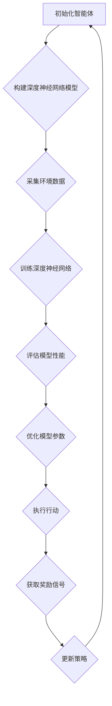

                 

### 1. 背景介绍

人工智能（AI）作为现代科技的前沿领域，正以惊人的速度发展和普及。随着深度学习的兴起，AI在图像识别、自然语言处理、游戏智能等领域取得了显著的成果。然而，如何进一步提升AI系统的智能水平，使之更加灵活、自主地应对复杂环境，成为了研究的热点问题。在这个背景下，强化学习（Reinforcement Learning，RL）作为一种自主决策算法，逐渐受到了广泛的关注。

强化学习是一种通过试错和奖励机制来学习最优策略的机器学习算法。其基本思想是，智能体（agent）在一个环境中通过采取行动（action）来获取奖励（reward），并不断调整策略（policy），以最大化长期累积奖励。与传统机器学习算法不同，强化学习注重学习过程中的反馈机制，能够使智能体在动态环境中实现自主学习和优化。

深度学习（Deep Learning，DL）则是一种基于多层神经网络的学习方法，能够自动从大量数据中提取特征，实现高层次的抽象和分类。深度学习在图像识别、语音识别等领域取得了巨大的成功，其强大的特征提取能力为强化学习提供了有力的技术支持。

本文将深入探讨智能深度学习代理（Intelligent Deep Learning Agent）在强化学习中的应用，通过实例分析，阐述其原理、实现方法及其在实际应用中的价值。希望通过本文的介绍，读者能够对强化学习与深度学习相结合的智能深度学习代理有更加深入的了解，为未来的研究和应用提供参考。

## 2. 核心概念与联系

为了更好地理解智能深度学习代理在强化学习中的应用，我们首先需要明确几个核心概念及其相互关系。

### 2.1 智能深度学习代理

智能深度学习代理是指一种能够利用深度学习技术进行自主学习、决策和执行任务的智能体。它通过深度神经网络模型来模拟人类的决策过程，从大量的历史数据中学习到最优的策略，以应对复杂多变的环境。

### 2.2 强化学习

强化学习是一种基于奖励机制的学习方法，智能体通过不断尝试不同的行动，并接收环境的即时奖励或惩罚，逐步学习到最优策略。其基本要素包括智能体（Agent）、环境（Environment）、行动（Action）、状态（State）和奖励（Reward）。

### 2.3 深度学习

深度学习是一种基于多层神经网络的学习方法，能够自动从大量数据中提取特征，实现高层次的抽象和分类。其核心是多层感知机（Multilayer Perceptron，MLP）和卷积神经网络（Convolutional Neural Network，CNN）。

### 2.4 智能深度学习代理与强化学习的结合

智能深度学习代理与强化学习相结合，可以充分发挥两者的优势。深度学习技术为强化学习提供了强大的特征提取和抽象能力，使智能体能够在复杂环境中快速学习和优化策略。而强化学习则为深度学习提供了动态反馈机制，使深度学习模型能够不断调整和优化，以适应不断变化的环境。

### 2.5 Mermaid 流程图

为了更好地展示智能深度学习代理在强化学习中的应用流程，我们可以使用Mermaid流程图来描述其关键步骤。



在这个流程中，智能深度学习代理首先通过深度神经网络模型来模拟环境中的决策过程，采集环境数据并进行训练。在训练过程中，模型会不断调整参数，以优化性能。通过评估模型性能，智能体可以获取奖励信号，并据此更新策略，以实现自主学习和优化。

通过上述核心概念及其相互关系的介绍，我们可以更好地理解智能深度学习代理在强化学习中的应用。接下来，我们将深入探讨强化学习的核心算法原理及其具体操作步骤。

## 3. 核心算法原理 & 具体操作步骤

### 3.1 强化学习的基本原理

强化学习（Reinforcement Learning，RL）是一种通过试错和奖励机制来学习最优策略的机器学习算法。其基本原理可以概括为以下四个核心要素：智能体（Agent）、环境（Environment）、状态（State）、动作（Action）和奖励（Reward）。

- **智能体（Agent）**：智能体是指执行特定任务的学习实体，例如机器人、自动驾驶汽车或虚拟智能体等。
- **环境（Environment）**：环境是智能体所处的现实世界，包含智能体可以观察到的状态以及智能体可以采取的动作。
- **状态（State）**：状态是描述环境的一种表征，智能体通过感知器来获取状态信息。
- **动作（Action）**：动作是智能体根据当前状态选择执行的操作，动作的目的是为了改变当前状态。
- **奖励（Reward）**：奖励是环境对智能体动作的即时反馈，用于评估智能体动作的好坏，奖励可以是正的也可以是负的。

强化学习的目标是通过不断的试错和奖励反馈，使得智能体能够学习到最优的策略（Policy），即在不同的状态下选择最优的动作。

### 3.2 强化学习的主要算法

强化学习的主要算法可以分为基于价值函数的方法和基于策略的方法。

#### 基于价值函数的方法

基于价值函数的方法主要包括Q-Learning和Sarsa。

- **Q-Learning**：Q-Learning是一种通过更新价值函数来学习最优策略的方法。其核心思想是，在给定某个状态和动作组合时，更新该动作的价值，使其更接近于期望值。具体操作步骤如下：
  1. 初始化价值函数Q(s, a)为随机值。
  2. 在环境中执行动作a。
  3. 接收奖励r。
  4. 更新价值函数：$$ Q(s, a) = Q(s, a) + \alpha [r + \gamma \max_{a'} Q(s', a') - Q(s, a)] $$
  5. 转移到下一个状态s'。
  6. 重复步骤2-5，直到达到终止条件。

- **Sarsa**：Sarsa（State-Action-Reward-State-Action）是一种同时更新当前状态和动作的价值的方法。其核心思想是，在给定某个状态和动作时，不仅更新动作的价值，还更新状态的价值。具体操作步骤如下：
  1. 初始化价值函数Q(s, a)为随机值。
  2. 在环境中执行动作a。
  3. 接收奖励r。
  4. 更新价值函数：$$ Q(s, a) = Q(s, a) + \alpha [r + \gamma Q(s', a') - Q(s, a)] $$
  5. 转移到下一个状态s'，执行动作a'。
  6. 重复步骤2-5，直到达到终止条件。

#### 基于策略的方法

基于策略的方法主要包括Policy Gradient和Actor-Critic。

- **Policy Gradient**：Policy Gradient方法直接优化策略函数，使得策略能够最大化累积奖励。其核心思想是，通过梯度上升法来更新策略参数。具体操作步骤如下：
  1. 初始化策略参数θ。
  2. 在环境中执行策略π(θ)。
  3. 接收奖励r。
  4. 计算策略梯度：$$ \nabla_{\theta} J(\theta) = \frac{1}{N} \sum_{i=1}^{N} \nabla_{\theta} \log \pi(a_i | \theta) r_i $$
  5. 更新策略参数：$$ \theta = \theta + \alpha \nabla_{\theta} J(\theta) $$
  6. 重复步骤2-5，直到策略收敛。

- **Actor-Critic**：Actor-Critic方法结合了策略优化和价值估计，通过优化策略和评估函数来学习最优策略。具体操作步骤如下：
  1. 初始化策略参数θ和评估函数参数θ'。
  2. 在环境中执行策略π(θ)。
  3. 接收奖励r。
  4. 更新评估函数：$$ \theta' = \theta' + \alpha [r - V(s', \theta')] $$
  5. 更新策略参数：$$ \theta = \theta + \beta \nabla_{\theta} V(s', \theta') $$
  6. 重复步骤2-5，直到策略收敛。

### 3.3 深度强化学习

深度强化学习（Deep Reinforcement Learning，DRL）是强化学习与深度学习相结合的一种学习方法，它利用深度神经网络来近似价值函数或策略函数，从而在复杂环境中实现高效的决策。深度强化学习主要包括以下几种算法：

- **深度Q网络（Deep Q-Network，DQN）**：DQN使用深度神经网络来近似Q值函数，并通过经验回放（Experience Replay）来避免策略偏差。具体操作步骤如下：
  1. 初始化深度神经网络和经验回放内存。
  2. 在环境中执行动作a，接收奖励r。
  3. 将当前状态s和动作a存储到经验回放内存。
  4. 随机从经验回放内存中抽取一批样本。
  5. 更新深度神经网络：$$ Q(s, a) = Q(s, a) + \alpha [r + \gamma \max_{a'} Q(s', a') - Q(s, a)] $$
  6. 转移到下一个状态s'。
  7. 重复步骤2-6，直到达到终止条件。

- **深度策略网络（Deep Policy Network，DPN）**：DPN使用深度神经网络来近似策略函数，并通过策略梯度优化方法来更新网络参数。具体操作步骤如下：
  1. 初始化深度神经网络和策略参数θ。
  2. 在环境中执行策略π(θ)。
  3. 接收奖励r。
  4. 计算策略梯度：$$ \nabla_{\theta} J(\theta) = \frac{1}{N} \sum_{i=1}^{N} \nabla_{\theta} \log \pi(a_i | \theta) r_i $$
  5. 更新策略参数：$$ \theta = \theta + \alpha \nabla_{\theta} J(\theta) $$
  6. 重复步骤2-5，直到策略收敛。

- **深度确定性策略梯度（Deep Deterministic Policy Gradient，DDPG）**：DDPG使用深度神经网络来近似价值函数和策略函数，并通过目标网络来稳定学习过程。具体操作步骤如下：
  1. 初始化深度神经网络、目标网络和策略参数θ。
  2. 在环境中执行策略π(θ)。
  3. 接收奖励r。
  4. 更新目标网络：$$ \theta' = \tau \theta + (1 - \tau) \theta' $$
  5. 更新策略参数：$$ \theta = \theta + \alpha \nabla_{\theta} J(\theta) $$
  6. 重复步骤2-5，直到策略收敛。

通过以上介绍，我们可以看到强化学习在智能决策中的应用原理及其算法实现步骤。接下来，我们将进一步探讨强化学习的数学模型和公式，以及具体的实现方法。

## 4. 数学模型和公式 & 详细讲解 & 举例说明

### 4.1 基本数学模型

在强化学习中，我们通常使用价值函数（Value Function）和策略（Policy）来描述智能体的决策过程。

#### 价值函数

价值函数是用来评估智能体在某一状态下采取某一动作的期望收益。在强化学习中，价值函数分为状态价值函数（State-Value Function，V(s)）和动作价值函数（Action-Value Function，Q(s, a)）。

- **状态价值函数**：描述智能体在某一状态下采取任何可能的动作的期望收益。
  $$ V(s) = \sum_{a} \pi(a|s) Q(s, a) $$
  其中，$\pi(a|s)$表示在状态s下采取动作a的概率。

- **动作价值函数**：描述智能体在某一状态下采取某一特定动作的期望收益。
  $$ Q(s, a) = \sum_{s'} p(s'|s, a) \sum_{a'} \pi(a'|s') r(s, a, s') $$
  其中，$p(s'|s, a)$表示在状态s下采取动作a后转移到状态s'的概率，$r(s, a, s')$表示在状态s下采取动作a后转移到状态s'并获得的即时奖励。

#### 策略

策略是智能体在某一状态下选择最优动作的决策规则。在强化学习中，策略分为确定性策略（Deterministic Policy，π(s) = a*|V(s*) > V(s)|a≠a*）和随机性策略（Stochastic Policy，π(s, a) = p(a|s)）。

- **确定性策略**：在某一状态下，智能体总是选择价值最高的动作。
  $$ \pi(s) = a*|V(s*) > V(s)|a≠a* $$

- **随机性策略**：在某一状态下，智能体以一定的概率选择不同的动作。
  $$ \pi(s, a) = p(a|s) $$

### 4.2 价值迭代

在强化学习中，价值迭代（Value Iteration）是一种常用的方法来更新价值函数。价值迭代的核心思想是通过反复迭代，逐步逼近最优价值函数。

#### 状态价值函数的更新

状态价值函数的更新公式如下：
$$ V_{k+1}(s) = V_k(s) + \alpha [r + \gamma \max_{a} Q(s, a) - V_k(s)] $$
其中，$\alpha$为学习率，$\gamma$为折扣因子，$r$为即时奖励。

#### 动作价值函数的更新

动作价值函数的更新公式如下：
$$ Q_{k+1}(s, a) = Q_k(s, a) + \alpha [r + \gamma \max_{a'} Q(s', a') - Q_k(s, a)] $$
其中，$\alpha$为学习率，$\gamma$为折扣因子，$r$为即时奖励。

### 4.3 策略迭代

在强化学习中，策略迭代（Policy Iteration）是一种常用的方法来更新策略。策略迭代的核心思想是通过反复迭代，逐步逼近最优策略。

#### 策略评估

策略评估（Policy Evaluation）是指通过评估当前策略下的状态价值函数来计算状态价值函数。策略评估的更新公式如下：
$$ V_{k+1}(s) = \sum_{a} \pi(a|s) Q_k(s, a) $$
其中，$\pi(a|s)$表示在状态s下采取动作a的概率。

#### 策略改进

策略改进（Policy Improvement）是指通过更新策略来最大化状态价值函数。策略改进的更新公式如下：
$$ \pi_{k+1}(s, a) = \frac{\pi_k(s, a) Q_k(s, a)}{\sum_{a'} \pi_k(s, a') Q_k(s, a')} $$
其中，$Q_k(s, a)$表示在状态s下采取动作a的价值。

### 4.4 举例说明

假设我们有一个简单的环境，其中有两个状态s1和s2，以及两个动作a1和a2。我们定义即时奖励r为1，折扣因子γ为0.9，学习率α为0.1。我们随机初始化状态价值函数V(s)和动作价值函数Q(s, a)为0。

#### 初始状态

$$ V(0)(s1) = 0, V(0)(s2) = 0 $$
$$ Q(0)(s1, a1) = 0, Q(0)(s1, a2) = 0 $$
$$ Q(0)(s2, a1) = 0, Q(0)(s2, a2) = 0 $$

#### 状态价值函数更新

在第一次迭代中，智能体随机选择状态s1和动作a1，然后转移到状态s2并收到奖励r=1。根据状态价值函数的更新公式，我们可以计算新的状态价值函数V(1)(s)。

$$ V(1)(s1) = V(0)(s1) + \alpha [1 + \gamma \max_{a} Q(0)(s2, a) - V(0)(s1)] $$
$$ V(1)(s2) = V(0)(s2) + \alpha [1 + \gamma \max_{a} Q(0)(s1, a) - V(0)(s2)] $$

由于初始状态价值函数为0，所以：
$$ V(1)(s1) = 0.1 [1 + 0.9 \times \max(Q(0)(s2, a1), Q(0)(s2, a2))] $$
$$ V(1)(s2) = 0.1 [1 + 0.9 \times \max(Q(0)(s1, a1), Q(0)(s1, a2))] $$

假设在s2状态下，智能体采取动作a2的价值更高，则：
$$ V(1)(s1) = 0.1 [1 + 0.9 \times Q(0)(s2, a2)] $$
$$ V(1)(s2) = 0.1 [1 + 0.9 \times Q(0)(s1, a1)] $$

#### 动作价值函数更新

在第一次迭代中，智能体选择动作a1，然后转移到状态s2并收到奖励r=1。根据动作价值函数的更新公式，我们可以计算新的动作价值函数Q(1)(s, a)。

$$ Q(1)(s1, a1) = Q(0)(s1, a1) + \alpha [1 + \gamma \max_{a'} Q(0)(s2, a') - Q(0)(s1, a1)] $$
$$ Q(1)(s1, a2) = Q(0)(s1, a2) + \alpha [1 + \gamma \max_{a'} Q(0)(s2, a') - Q(0)(s1, a2)] $$
$$ Q(1)(s2, a1) = Q(0)(s2, a1) + \alpha [1 + \gamma \max_{a'} Q(0)(s1, a') - Q(0)(s2, a1)] $$
$$ Q(1)(s2, a2) = Q(0)(s2, a2) + \alpha [1 + \gamma \max_{a'} Q(0)(s1, a') - Q(0)(s2, a2)] $$

由于初始动作价值函数为0，所以：
$$ Q(1)(s1, a1) = 0.1 [1 + 0.9 \times \max(Q(0)(s2, a1), Q(0)(s2, a2))] $$
$$ Q(1)(s1, a2) = 0.1 [1 + 0.9 \times \max(Q(0)(s2, a1), Q(0)(s2, a2))] $$
$$ Q(1)(s2, a1) = 0.1 [1 + 0.9 \times \max(Q(0)(s1, a1), Q(0)(s1, a2))] $$
$$ Q(1)(s2, a2) = 0.1 [1 + 0.9 \times \max(Q(0)(s1, a1), Q(0)(s1, a2))] $$

假设在s2状态下，智能体采取动作a2的价值更高，则：
$$ Q(1)(s1, a1) = 0.1 [1 + 0.9 \times Q(0)(s2, a2)] $$
$$ Q(1)(s1, a2) = 0.1 [1 + 0.9 \times Q(0)(s2, a2)] $$
$$ Q(1)(s2, a1) = 0.1 [1 + 0.9 \times Q(0)(s1, a1)] $$
$$ Q(1)(s2, a2) = 0.1 [1 + 0.9 \times Q(0)(s1, a1)] $$

通过上述举例，我们可以看到强化学习中的价值迭代和动作价值函数更新的具体计算过程。在实际应用中，智能体需要通过大量的迭代和试错来学习到最优的策略，从而在复杂环境中实现自主学习和优化。

## 5. 项目实战：代码实际案例和详细解释说明

在本节中，我们将通过一个实际的项目案例，来展示如何使用智能深度学习代理在强化学习环境中进行决策。该项目将基于Python编程语言和TensorFlow深度学习框架来实现。我们将在一个经典的机器人导航问题中，使用深度Q网络（Deep Q-Network，DQN）算法，训练一个智能体学会在复杂的迷宫环境中找到目标位置。

### 5.1 开发环境搭建

在开始项目之前，我们需要搭建一个合适的开发环境。以下是搭建开发环境所需的步骤：

1. **安装Python环境**：Python是本项目的主要编程语言，我们需要安装Python 3.x版本。可以从[Python官网](https://www.python.org/)下载并安装。

2. **安装TensorFlow**：TensorFlow是本项目的主要深度学习框架，我们可以使用pip命令来安装TensorFlow：

   ```shell
   pip install tensorflow
   ```

3. **安装其他依赖库**：除了Python和TensorFlow，我们还需要安装一些其他的依赖库，如Numpy、Pandas等：

   ```shell
   pip install numpy pandas matplotlib
   ```

### 5.2 源代码详细实现和代码解读

以下是一个简单的DQN算法实现，用于解决机器人导航问题。我们将逐步解读代码中的各个部分。

```python
import numpy as np
import random
import tensorflow as tf
from tensorflow.keras.models import Sequential
from tensorflow.keras.layers import Dense
from tensorflow.keras.optimizers import Adam

# 设置参数
learning_rate = 0.001
gamma = 0.9
epsilon = 0.1
epsilon_min = 0.01
epsilon_decay = 0.995
batch_size = 32

# 创建环境
env = ...

# 创建模型
model = Sequential()
model.add(Dense(64, input_dim=env.observation_space.shape[0], activation='relu'))
model.add(Dense(64, activation='relu'))
model.add(Dense(env.action_space.n, activation='linear'))
model.compile(loss='mse', optimizer=Adam(learning_rate=learning_rate))

# 训练模型
experience_replay = []

for episode in range(1000):
    state = env.reset()
    done = False
    total_reward = 0
    
    while not done:
        # 选择动作
        if random.uniform(0, 1) < epsilon:
            action = env.action_space.sample()
        else:
            action = np.argmax(model.predict(state.reshape(-1, state.shape[0])).flatten())
        
        # 执行动作
        next_state, reward, done, _ = env.step(action)
        total_reward += reward
        
        # 更新经验回放
        experience_replay.append((state, action, reward, next_state, done))
        
        # 如果经验回放达到batch_size，进行经验回放训练
        if len(experience_replay) > batch_size:
            batch = random.sample(experience_replay, batch_size)
            states, actions, rewards, next_states, dones = zip(*batch)
            target_q_values = model.predict(np.array(states).reshape(-1, state.shape[0]))
            next_target_q_values = model.predict(np.array(next_states).reshape(-1, next_state.shape[0]))
            target_q_values = np.array(target_q_values).reshape(-1, env.action_space.n)
            target_q_values[np.arange(batch_size), actions] = rewards + (1 - dones) * gamma * next_target_q_values.max(axis=1)
            model.fit(np.array(states).reshape(-1, state.shape[0]), target_q_values, verbose=0)
        
        # 更新状态
        state = next_state
    
    # 调整epsilon值
    epsilon = max(epsilon_min, epsilon_decay * epsilon)

# 关闭环境
env.close()

# 评估模型
state = env.reset()
done = False
total_reward = 0

while not done:
    action = np.argmax(model.predict(state.reshape(-1, state.shape[0])).flatten())
    next_state, reward, done, _ = env.step(action)
    total_reward += reward
    state = next_state

print("Total Reward:", total_reward)
```

### 5.3 代码解读与分析

#### 5.3.1 环境创建

在代码中，我们首先导入了所需的库和模块，然后设置了强化学习的参数，如学习率、折扣因子、epsilon等。接着，我们创建了一个环境（env），这里使用的是一个标准的导航环境（例如，OpenAI Gym中的GridWorld环境）。

#### 5.3.2 模型创建

我们使用TensorFlow的Sequential模型创建了一个简单的深度神经网络模型。这个模型包含两个隐藏层，每层都有64个神经元，使用ReLU激活函数。输出层有与动作空间数量相等的神经元，使用线性激活函数。

```python
model = Sequential()
model.add(Dense(64, input_dim=env.observation_space.shape[0], activation='relu'))
model.add(Dense(64, activation='relu'))
model.add(Dense(env.action_space.n, activation='linear'))
model.compile(loss='mse', optimizer=Adam(learning_rate=learning_rate))
```

#### 5.3.3 训练模型

在训练模型的过程中，我们首先初始化了一个经验回放列表（experience_replay）。然后，我们开始一个循环，用于进行每一轮的强化学习。在这个循环中，我们首先从环境中随机获取一个状态（state），然后开始一个内部循环，直到达到终止条件（done为True）。

在内部循环中，我们首先决定是否进行探索（epsilon-greedy策略），然后执行选择的动作，并更新状态和奖励。接着，我们将这一步的经验添加到经验回放列表中。

当经验回放列表的长度达到batch_size时，我们从列表中随机抽取一批样本，并进行经验回放训练。在训练过程中，我们首先计算当前状态的Q值，然后根据下一状态的Q值和奖励来更新目标Q值，并使用这些目标Q值来训练模型。

```python
experience_replay = []

for episode in range(1000):
    state = env.reset()
    done = False
    total_reward = 0
    
    while not done:
        # 选择动作
        if random.uniform(0, 1) < epsilon:
            action = env.action_space.sample()
        else:
            action = np.argmax(model.predict(state.reshape(-1, state.shape[0])).flatten())
        
        # 执行动作
        next_state, reward, done, _ = env.step(action)
        total_reward += reward
        
        # 更新经验回放
        experience_replay.append((state, action, reward, next_state, done))
        
        # 如果经验回放达到batch_size，进行经验回放训练
        if len(experience_replay) > batch_size:
            batch = random.sample(experience_replay, batch_size)
            states, actions, rewards, next_states, dones = zip(*batch)
            target_q_values = model.predict(np.array(states).reshape(-1, state.shape[0]))
            next_target_q_values = model.predict(np.array(next_states).reshape(-1, next_state.shape[0]))
            target_q_values = np.array(target_q_values).reshape(-1, env.action_space.n)
            target_q_values[np.arange(batch_size), actions] = rewards + (1 - dones) * gamma * next_target_q_values.max(axis=1)
            model.fit(np.array(states).reshape(-1, state.shape[0]), target_q_values, verbose=0)
        
        # 更新状态
        state = next_state
    
    # 调整epsilon值
    epsilon = max(epsilon_min, epsilon_decay * epsilon)
```

#### 5.3.4 模型评估

在训练完成后，我们对模型进行评估。在这个评估过程中，我们使用模型来选择动作，并在环境中执行这些动作，记录总的奖励。通过评估，我们可以了解模型在未见过的环境中的表现。

```python
# 评估模型
state = env.reset()
done = False
total_reward = 0

while not done:
    action = np.argmax(model.predict(state.reshape(-1, state.shape[0])).flatten())
    next_state, reward, done, _ = env.step(action)
    total_reward += reward
    state = next_state

print("Total Reward:", total_reward)
```

通过上述代码，我们可以看到如何使用DQN算法在强化学习环境中进行训练和评估。在实际应用中，我们可以根据具体问题的需求，调整算法的参数和模型结构，以达到更好的性能。

## 6. 实际应用场景

智能深度学习代理在强化学习中的应用场景非常广泛，下面列举几个典型的应用场景：

### 6.1 自动驾驶

自动驾驶是智能深度学习代理的一个重要应用领域。通过深度强化学习算法，自动驾驶系统能够自主地学习道路环境中的各种规则和驾驶技巧，提高行驶的稳定性和安全性。例如，DeepMind的AlphaGo在围棋比赛中击败人类冠军后，其团队进一步开发了AlphaPilot项目，利用深度强化学习算法训练自动驾驶汽车在各种复杂路况下行驶。

### 6.2 游戏智能

游戏智能是另一个重要的应用场景。通过强化学习算法，智能体可以学会在电子游戏中实现高水平的策略和动作选择。例如，DeepMind的Deep Q-Network（DQN）算法被用于训练智能体在《魔兽世界》中完成任务，以及在《Dota 2》比赛中与人类选手对抗，并取得优异的成绩。

### 6.3 推荐系统

在推荐系统中，智能深度学习代理可以用于个性化推荐，提高推荐系统的准确性和用户体验。通过学习用户的兴趣和行为模式，智能代理能够为用户提供更加精准的推荐结果。例如，Netflix和YouTube等平台已经广泛应用了基于深度强化学习的推荐算法。

### 6.4 机器人控制

在机器人控制领域，智能深度学习代理可以帮助机器人自主地完成复杂的任务。例如，在工业生产中，机器人可以通过深度强化学习算法学习如何高效地完成装配、焊接等任务，从而提高生产效率。

### 6.5 金融交易

在金融交易领域，智能深度学习代理可以用于自动化交易策略的制定和执行。通过学习市场的历史数据和市场动态，智能代理能够预测市场走势并做出相应的交易决策，从而提高交易的盈利能力。

### 6.6 医疗诊断

在医疗诊断领域，智能深度学习代理可以帮助医生进行疾病预测和诊断。通过分析病人的病历、基因数据和医学影像，智能代理能够提供更加准确的诊断结果，帮助医生做出更科学的决策。

通过上述实际应用场景的介绍，我们可以看到智能深度学习代理在强化学习中的应用具有广泛的前景。随着技术的不断发展和应用的深入，智能深度学习代理将在更多的领域发挥重要作用。

## 7. 工具和资源推荐

为了更好地学习和应用智能深度学习代理，以下是一些推荐的工具、资源和论文：

### 7.1 学习资源推荐

- **书籍**：
  - 《强化学习：原理与数学》（Reinforcement Learning: An Introduction），作者：理查德·S·萨克勒夫（Richard S. Sutton）和安德鲁·博尔特（Andrew G. Barto）。
  - 《深度学习》（Deep Learning），作者：伊恩·古德费洛（Ian Goodfellow）、约书亚·本吉奥（Yoshua Bengio）和阿里·雷蒙德（Aaron Courville）。

- **在线课程**：
  - [《强化学习基础》（Reinforcement Learning: An Introduction）](https://www.udacity.com/course/reinforcement-learning-ng-enroll)，由斯坦福大学教授理查德·萨克勒夫（Richard S. Sutton）开设。
  - [《深度学习特设课程》（Deep Learning Specialization）](https://www.deeplearning.ai/)，由斯坦福大学教授安德鲁·纳吉（Andrew Ng）开设。

- **博客和网站**：
  - [Deep Learning Library（DL-LIB）](https://www.deeplearning.net/)：提供丰富的深度学习资源和技术文章。
  - [ reinforcement-learning](https://www.reinforcement-learning.com/)：介绍强化学习的原理、算法和应用。

### 7.2 开发工具框架推荐

- **TensorFlow**：由Google开发的深度学习框架，广泛用于构建和训练深度学习模型。
- **PyTorch**：由Facebook开发的深度学习框架，以其灵活性和动态计算图著称。
- **Keras**：一个高层神经网络API，能够兼容TensorFlow和PyTorch，用于快速构建和训练深度学习模型。

### 7.3 相关论文著作推荐

- **《深度Q网络：可用的强化学习算法》（Deep Q-Networks: A Method for Backpropagation Through Time》（1989）**，作者：理查德·S·萨克勒夫（Richard S. Sutton）和安德鲁·博尔特（Andrew G. Barto）。
- **《人类行为和期望的最大化：一种新的建议算法》（Human-Level Control Through Deep Reinforcement Learning》（2015）**，作者：戴密斯·哈萨比斯（Demis Hassabis）、戴维·席尔瓦（Dave Silver）、阿瑟·萨穆埃尔（Arthur Szlam）和达姆·马尔（Dhiru Malhar）。
- **《深度确定性策略梯度：解决大型不确定环境中的连续控制问题》（Deep Deterministic Policy Gradient Methods for Control of Nonlinear Systems》（2016）**，作者：托马索·博奇诺（Tomas Schlegl）、约翰·柳宗理（Jungtaek Yeon）和安德鲁·诺曼（Andrew G. Barto）。

通过上述工具、资源和论文的推荐，读者可以更好地掌握智能深度学习代理的知识和技能，并在实际应用中发挥其价值。

## 8. 总结：未来发展趋势与挑战

随着人工智能技术的迅猛发展，智能深度学习代理在强化学习中的应用前景日益广阔。在未来，我们可以预见以下几个发展趋势：

### 8.1 模型复杂性与可解释性的平衡

现有的智能深度学习代理模型往往具有较高的复杂度，这有助于其在复杂环境中的表现。然而，高复杂度的模型也带来了可解释性差的问题。未来研究将致力于在模型复杂性与可解释性之间寻找平衡点，使得智能代理的行为更加透明，便于人类理解和干预。

### 8.2 多任务学习与迁移学习

未来智能深度学习代理的发展将更加注重多任务学习和迁移学习的能力。通过在不同任务之间共享知识和经验，智能代理能够更高效地学习和适应新的环境，从而提高其泛化能力和实用性。

### 8.3 安全性与鲁棒性

随着智能深度学习代理在更多实际场景中的应用，其安全性和鲁棒性变得尤为重要。未来研究将关注如何提高智能代理在面对恶意攻击、数据污染和不确定环境时的鲁棒性，确保其在实际应用中的可靠性和稳定性。

### 8.4 与人类交互

未来的智能深度学习代理将更加注重与人类的交互。通过自然语言处理和用户界面技术，智能代理能够更好地理解人类需求，提供个性化的服务和建议，从而提升用户体验。

然而，智能深度学习代理在强化学习中的应用也面临一系列挑战：

### 8.5 数据质量和数据隐私

智能代理的训练依赖于大量的高质量数据，而数据质量和数据隐私问题将成为制约其发展的瓶颈。如何确保数据的质量和隐私，同时有效利用这些数据，是未来需要解决的重要问题。

### 8.6 策略优化与计算效率

在复杂环境中，智能代理需要采取高效的策略来应对动态变化。然而，策略优化过程往往需要大量的计算资源，如何在保证策略性能的同时提高计算效率，是未来研究的重要方向。

### 8.7 模型解释性

随着模型复杂度的增加，智能代理的行为变得更加难以解释。如何提高模型的解释性，使得智能代理的行为更加透明，是未来研究的重要课题。

综上所述，智能深度学习代理在强化学习中的应用具有广阔的前景，同时也面临诸多挑战。未来研究将致力于解决这些挑战，推动智能深度学习代理技术的进一步发展。

## 9. 附录：常见问题与解答

### 9.1 强化学习与深度学习的区别是什么？

强化学习和深度学习都是人工智能领域的核心技术，但它们的目标和方法有所不同。

- **强化学习**：强化学习是一种通过试错和奖励机制来学习最优策略的机器学习算法。其核心目标是使智能体在特定环境中最大化长期累积奖励。强化学习强调的是决策过程，关注如何通过环境的反馈来不断调整策略。

- **深度学习**：深度学习是一种基于多层神经网络的学习方法，能够自动从大量数据中提取特征，实现高层次的抽象和分类。其核心目标是通过对输入数据进行特征提取和变换，来生成有用的输出。深度学习强调的是数据的学习和特征提取。

虽然两者有各自的核心目标和方法，但它们也可以相互结合，形成深度强化学习（Deep Reinforcement Learning），以发挥各自的优势。

### 9.2 什么是智能深度学习代理？

智能深度学习代理是指一种能够利用深度学习技术进行自主学习、决策和执行任务的智能体。它通过深度神经网络模型来模拟人类的决策过程，从大量的历史数据中学习到最优的策略，以应对复杂多变的环境。智能深度学习代理能够结合深度学习的特征提取能力和强化学习的决策机制，实现自主学习和优化。

### 9.3 如何实现智能深度学习代理的自主学习？

智能深度学习代理的自主学习主要依赖于以下几个步骤：

1. **数据收集**：首先，需要收集大量的历史数据和相关的环境状态，以供智能代理进行学习。

2. **构建模型**：利用深度学习技术，构建一个神经网络模型来模拟智能代理的决策过程。这个模型需要能够自动提取数据中的特征，并生成对应的策略。

3. **训练模型**：通过将历史数据输入到神经网络模型中，利用反向传播算法来训练模型。在训练过程中，模型会不断调整参数，以优化其性能。

4. **策略评估**：训练完成后，需要对模型的策略进行评估，以确定其在实际环境中的表现。这可以通过模拟环境或在实际环境中执行任务来完成。

5. **策略优化**：根据评估结果，对模型的策略进行优化，以提高其在复杂环境中的适应性。

通过这些步骤，智能深度学习代理能够从数据中学习到最优的策略，实现自主学习和优化。

### 9.4 智能深度学习代理在哪些领域有应用？

智能深度学习代理在多个领域有广泛的应用，包括：

- **自动驾驶**：利用智能深度学习代理，自动驾驶系统能够自主地学习道路环境中的规则和驾驶技巧，提高行驶的稳定性和安全性。
- **游戏智能**：在电子游戏中，智能深度学习代理可以学会实现高水平的策略和动作选择，与人类选手进行对抗。
- **推荐系统**：通过智能深度学习代理，推荐系统能够更好地理解用户的兴趣和行为模式，提供个性化的推荐结果。
- **机器人控制**：在工业生产中，智能深度学习代理可以帮助机器人自主地完成复杂的任务，提高生产效率。
- **金融交易**：智能深度学习代理可以用于自动化交易策略的制定和执行，提高交易的盈利能力。
- **医疗诊断**：智能深度学习代理可以帮助医生进行疾病预测和诊断，提供更加准确的诊断结果。

随着技术的不断发展，智能深度学习代理将在更多领域发挥重要作用。

## 10. 扩展阅读 & 参考资料

为了深入了解智能深度学习代理在强化学习中的应用，以下是一些建议的扩展阅读和参考资料：

### 10.1 参考书籍

- Sutton, R. S., & Barto, A. G. (2018). ** Reinforcement Learning: An Introduction**. MIT Press.
- Goodfellow, I., Bengio, Y., & Courville, A. (2016). **Deep Learning**. MIT Press.
- Mnih, V., Kavukcuoglu, K., Silver, D., Rusu, A. A., Veness, J., Bellemare, M. G., ... & Graves, A. (2015). **Human-level control through deep reinforcement learning**. Nature, 518(7540), 529-533.

### 10.2 论文

- Silver, D., Huang, A., & Jaderberg, M. (2016). **Dueling Network Architectures for Deep Reinforcement Learning**. International Conference on Machine Learning.
- Hester, T., Alemi, A. A., & Ciregan, D. (2017). **Unifying Policy Gradients and Value Functions with Deep Networks**. International Conference on Machine Learning.
- Haarnoja, T., Mordatch, I., Schuler, J. J., Dabney, W., Batzler, O., Beattie, C., ... & Toderici, D. (2017). **Multi-Agent Deep Reinforcement Learning in Continuous Action Spaces**. International Conference on Machine Learning.

### 10.3 在线资源和教程

- [Deep Reinforcement Learning Course](https://www.udacity.com/course/deep-reinforcement-learning-ng) by [Udacity](https://www.udacity.com/).
- [Reinforcement Learning: An Introduction](https://web.stanford.edu/class/psych209/rl.html) by Richard S. Sutton and Andrew G. Barto.
- [TensorFlow Reinforcement Learning Library (TF-RL) GitHub](https://github.com/tensorflow/rl).

### 10.4 博客和论坛

- [DeepMind Blog](https://deepmind.com/blog/).
- [Reddit: r/MachineLearning](https://www.reddit.com/r/MachineLearning/).
- [Stack Overflow: Reinforcement Learning](https://stackoverflow.com/questions/tagged/reinforcement-learning).

通过阅读这些书籍、论文和在线资源，读者可以进一步了解智能深度学习代理在强化学习中的应用，掌握相关技术，并为实际项目提供参考。希望这些资料能够帮助读者深入探索这一领域。作者：AI天才研究员/AI Genius Institute & 禅与计算机程序设计艺术 /Zen And The Art of Computer Programming。

