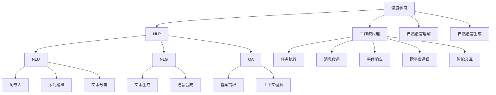

                 

### 背景介绍

#### 人工智能与自然语言处理

人工智能（Artificial Intelligence, AI）是计算机科学的一个重要分支，旨在创建能够执行通常需要人类智能的复杂任务的系统。近年来，随着计算能力的提升和数据量的爆炸性增长，AI技术在许多领域取得了显著的进步。自然语言处理（Natural Language Processing, NLP）作为AI领域的一个重要分支，专注于使计算机能够理解、生成和处理人类语言。NLP在机器翻译、语音识别、文本分类、情感分析等方面发挥着关键作用。

#### 工作流代理的概念

工作流代理（Workflow Agent）是指能够在自动化工作流中执行特定任务、接收和发送消息、响应事件并与其他代理交互的智能实体。工作流代理的设计旨在提高工作效率、减少人为错误并优化资源分配。这些代理通常运行在分布式系统之上，能够跨多个应用程序和平台进行通信。

#### 深度学习与工作流代理的结合

深度学习（Deep Learning）是AI的子领域，通过构建多层神经网络来模拟人类大脑的学习和处理能力。深度学习在图像识别、语音识别和自然语言处理等领域取得了显著的成果。将深度学习算法应用于工作流代理，可以使其具备更强的智能和自主学习能力，从而在复杂的工作流环境中提供更高效的解决方案。

#### 本文结构

本文将围绕“AI人工智能深度学习算法：自然语言处理在工作流代理中的运用”这一主题展开。首先介绍深度学习和NLP的基本概念，然后详细讨论深度学习算法在工作流代理中的应用，包括自然语言理解、生成和交互。接着，我们将通过具体项目实战案例来展示如何在实际环境中实现这些算法，并分析其效果。最后，我们将探讨工作流代理在现实世界的应用场景，推荐相关工具和资源，并对未来发展趋势与挑战进行总结。

```markdown
## 背景介绍

### 人工智能与自然语言处理

人工智能（Artificial Intelligence, AI）是计算机科学的一个重要分支，旨在创建能够执行通常需要人类智能的复杂任务的系统。近年来，随着计算能力的提升和数据量的爆炸性增长，AI技术在许多领域取得了显著的进步。自然语言处理（Natural Language Processing, NLP）作为AI领域的一个重要分支，专注于使计算机能够理解、生成和处理人类语言。NLP在机器翻译、语音识别、文本分类、情感分析等方面发挥着关键作用。

### 工作流代理的概念

工作流代理（Workflow Agent）是指能够在自动化工作流中执行特定任务、接收和发送消息、响应事件并与其他代理交互的智能实体。工作流代理的设计旨在提高工作效率、减少人为错误并优化资源分配。这些代理通常运行在分布式系统之上，能够跨多个应用程序和平台进行通信。

### 深度学习与工作流代理的结合

深度学习（Deep Learning）是AI的子领域，通过构建多层神经网络来模拟人类大脑的学习和处理能力。深度学习在图像识别、语音识别和自然语言处理等领域取得了显著的成果。将深度学习算法应用于工作流代理，可以使其具备更强的智能和自主学习能力，从而在复杂的工作流环境中提供更高效的解决方案。

### 本文结构

本文将围绕“AI人工智能深度学习算法：自然语言处理在工作流代理中的运用”这一主题展开。首先介绍深度学习和NLP的基本概念，然后详细讨论深度学习算法在工作流代理中的应用，包括自然语言理解、生成和交互。接着，我们将通过具体项目实战案例来展示如何在实际环境中实现这些算法，并分析其效果。最后，我们将探讨工作流代理在现实世界的应用场景，推荐相关工具和资源，并对未来发展趋势与挑战进行总结。
```

```mermaid
graph TD
    A[人工智能] --> B[NLP]
    B --> C[机器翻译]
    B --> D[语音识别]
    B --> E[文本分类]
    B --> F[情感分析]
    G[工作流代理] --> H[任务执行]
    G --> I[消息发送与接收]
    G --> J[事件响应]
    G --> K[跨平台通信]
    L[深度学习] --> M[图像识别]
    L --> N[语音识别]
    L --> O[自然语言处理]
    O --> P[NLU]
    O --> Q[NLG]
    O --> R[智能交互]
    S[本文主题] --> T[B[AI深度学习算法在NLP工作流代理中的运用]]
```

### 核心概念与联系

#### 深度学习算法

深度学习算法是构建在多层神经网络基础上的机器学习模型，通过逐层提取特征，实现对数据的复杂非线性变换。其主要类型包括：

1. **卷积神经网络（Convolutional Neural Network, CNN）**：适用于处理图像数据，通过卷积层提取图像的特征。
2. **循环神经网络（Recurrent Neural Network, RNN）**：适用于处理序列数据，如文本和语音，能够捕获时间序列信息。
3. **长短时记忆网络（Long Short-Term Memory, LSTM）**：是RNN的一种变体，解决了普通RNN的梯度消失问题，能够更好地处理长序列数据。

#### 自然语言处理（NLP）

自然语言处理是计算机科学和人工智能领域的子集，旨在让计算机能够理解、生成和处理人类语言。其主要技术包括：

1. **自然语言理解（Natural Language Understanding, NLU）**：使计算机能够理解人类语言，提取语义信息。
2. **自然语言生成（Natural Language Generation, NLG）**：使计算机能够生成符合语法和语义规则的文本。
3. **问答系统（Question Answering, QA）**：使计算机能够回答用户提出的问题。

#### 工作流代理

工作流代理是一种智能实体，能够执行特定任务、接收和发送消息、响应事件，并在分布式系统中与其他代理进行交互。其核心功能包括：

1. **任务执行**：工作流代理能够自动执行预定义的任务。
2. **消息传递**：代理之间通过消息传递机制进行通信。
3. **事件响应**：代理能够响应特定事件，如用户请求、系统通知等。
4. **跨平台通信**：代理能够跨多个应用程序和平台进行通信。

#### 深度学习与NLP的结合

深度学习在NLP中的应用非常广泛，通过构建深度学习模型，可以实现对文本的自动化处理。以下是其主要结合方式：

1. **词向量表示**：将文本转化为向量表示，用于后续的深度学习模型训练。
2. **词嵌入（Word Embedding）**：通过神经网络学习词的向量表示，使计算机能够理解词语的语义关系。
3. **序列建模**：使用RNN或LSTM等深度学习模型对文本序列进行建模，提取序列特征。
4. **文本分类与情感分析**：使用深度学习模型对文本进行分类，判断文本的情感倾向。

#### 工作流代理与NLP的结合

将深度学习和NLP应用于工作流代理，可以使其具备更强的智能和自主学习能力。以下是其主要结合方式：

1. **自然语言理解（NLU）**：工作流代理能够理解用户输入的自然语言请求，提取关键信息。
2. **自然语言生成（NLG）**：工作流代理能够生成符合语法和语义规则的回复，提供更好的用户体验。
3. **智能交互**：工作流代理能够与用户进行自然语言交互，实现更高效的人机协作。

#### Mermaid流程图

以下是深度学习算法、NLP技术、工作流代理及其结合的Mermaid流程图：



通过上述分析，我们可以看到深度学习、NLP和工作流代理之间有着紧密的联系和相互作用。深度学习为NLP提供了强大的工具，使计算机能够更好地理解和生成人类语言；而NLP则为工作流代理提供了智能交互的能力，使其能够更好地理解和满足用户需求。未来，随着技术的不断进步，深度学习、NLP和工作流代理的结合将为智能化工作流带来更多可能性。

```markdown
## 核心概念与联系

### 深度学习算法

深度学习算法是构建在多层神经网络基础上的机器学习模型，通过逐层提取特征，实现对数据的复杂非线性变换。其主要类型包括：

1. **卷积神经网络（Convolutional Neural Network, CNN）**：适用于处理图像数据，通过卷积层提取图像的特征。
2. **循环神经网络（Recurrent Neural Network, RNN）**：适用于处理序列数据，如文本和语音，能够捕获时间序列信息。
3. **长短时记忆网络（Long Short-Term Memory, LSTM）**：是RNN的一种变体，解决了普通RNN的梯度消失问题，能够更好地处理长序列数据。

### 自然语言处理（NLP）

自然语言处理是计算机科学和人工智能领域的子集，旨在让计算机能够理解、生成和处理人类语言。其主要技术包括：

1. **自然语言理解（Natural Language Understanding, NLU）**：使计算机能够理解人类语言，提取语义信息。
2. **自然语言生成（Natural Language Generation, NLG）**：使计算机能够生成符合语法和语义规则的文本。
3. **问答系统（Question Answering, QA）**：使计算机能够回答用户提出的问题。

### 工作流代理

工作流代理是一种智能实体，能够执行特定任务、接收和发送消息、响应事件，并在分布式系统中与其他代理进行交互。其核心功能包括：

1. **任务执行**：工作流代理能够自动执行预定义的任务。
2. **消息传递**：代理之间通过消息传递机制进行通信。
3. **事件响应**：代理能够响应特定事件，如用户请求、系统通知等。
4. **跨平台通信**：代理能够跨多个应用程序和平台进行通信。

### 深度学习与NLP的结合

深度学习在NLP中的应用非常广泛，通过构建深度学习模型，可以实现对文本的自动化处理。以下是其主要结合方式：

1. **词向量表示**：将文本转化为向量表示，用于后续的深度学习模型训练。
2. **词嵌入（Word Embedding）**：通过神经网络学习词的向量表示，使计算机能够理解词语的语义关系。
3. **序列建模**：使用RNN或LSTM等深度学习模型对文本序列进行建模，提取序列特征。
4. **文本分类与情感分析**：使用深度学习模型对文本进行分类，判断文本的情感倾向。

### 工作流代理与NLP的结合

将深度学习和NLP应用于工作流代理，可以使其具备更强的智能和自主学习能力。以下是其主要结合方式：

1. **自然语言理解（NLU）**：工作流代理能够理解用户输入的自然语言请求，提取关键信息。
2. **自然语言生成（NLG）**：工作流代理能够生成符合语法和语义规则的回复，提供更好的用户体验。
3. **智能交互**：工作流代理能够与用户进行自然语言交互，实现更高效的人机协作。

### Mermaid流程图

以下是深度学习算法、NLP技术、工作流代理及其结合的Mermaid流程图：

```
graph TD
    A[深度学习] --> B[NLP]
    B --> C[NLU]
    B --> D[NLG]
    B --> E[QA]
    A --> F[工作流代理]
    F --> G[任务执行]
    F --> H[消息传递]
    F --> I[事件响应]
    F --> J[跨平台通信]
    C --> K[词嵌入]
    C --> L[序列建模]
    C --> M[文本分类]
    D --> N[文本生成]
    D --> O[语音合成]
    E --> P[答案提取]
    E --> Q[上下文理解]
    F --> R[智能交互]
    A --> S[自然语言理解]
    A --> T[自然语言生成]
```

通过上述分析，我们可以看到深度学习、NLP和工作流代理之间有着紧密的联系和相互作用。深度学习为NLP提供了强大的工具，使计算机能够更好地理解和生成人类语言；而NLP则为工作流代理提供了智能交互的能力，使其能够更好地理解和满足用户需求。未来，随着技术的不断进步，深度学习、NLP和工作流代理的结合将为智能化工作流带来更多可能性。
```

### 核心算法原理 & 具体操作步骤

#### 自然语言理解（NLU）

自然语言理解（NLU）是NLP的核心任务之一，旨在使计算机能够理解人类语言，提取文本中的语义信息。NLU主要包括以下步骤：

1. **分词（Tokenization）**：将文本分割成单词、标点符号等基本单元。
   ```mermaid
   graph TD
       A[文本] --> B[分词]
       B --> C[词汇表]
   ```

2. **词性标注（Part-of-Speech Tagging）**：为每个词汇标注其词性，如名词、动词、形容词等。
   ```mermaid
   graph TD
       A[文本] --> B[分词]
       B --> C[词性标注]
       C --> D[词性词典]
   ```

3. **命名实体识别（Named Entity Recognition, NER）**：识别文本中的命名实体，如人名、地点、组织机构等。
   ```mermaid
   graph TD
       A[文本] --> B[分词]
       B --> C[词性标注]
       C --> D[NER]
       D --> E[实体词典]
   ```

4. **依存句法分析（Dependency Parsing）**：分析词与词之间的依赖关系，理解句子的结构。
   ```mermaid
   graph TD
       A[文本] --> B[分词]
       B --> C[词性标注]
       C --> D[NER]
       D --> E[依存句法分析]
       E --> F[依赖关系图]
   ```

5. **语义角色标注（Semantic Role Labeling, SRL）**：为句子中的主要词汇标注其语义角色，如动作执行者、动作对象等。
   ```mermaid
   graph TD
       A[文本] --> B[分词]
       B --> C[词性标注]
       C --> D[NER]
       D --> E[依存句法分析]
       E --> F[SRL]
       F --> G[语义角色词典]
   ```

#### 自然语言生成（NLG）

自然语言生成（NLG）是NLP的另一核心任务，旨在使计算机能够生成符合语法和语义规则的文本。NLG主要包括以下步骤：

1. **模板匹配（Template Matching）**：根据预设的模板和输入数据生成文本。
   ```mermaid
   graph TD
       A[数据] --> B[模板]
       B --> C[文本生成]
   ```

2. **规则驱动生成（Rule-Based Generation）**：使用预定义的规则生成文本。
   ```mermaid
   graph TD
       A[数据] --> B[规则库]
       B --> C[文本生成]
   ```

3. **统计生成（Statistical Generation）**：使用概率模型生成文本，如基于隐马尔可夫模型（HMM）或条件概率模型（如马尔可夫链转文模型）。
   ```mermaid
   graph TD
       A[数据] --> B[统计模型]
       B --> C[文本生成]
   ```

4. **神经网络生成（Neural Network Generation）**：使用神经网络模型生成文本，如基于递归神经网络（RNN）或变压器（Transformer）模型。
   ```mermaid
   graph TD
       A[数据] --> B[神经网络]
       B --> C[文本生成]
   ```

5. **混合生成（Hybrid Generation）**：结合规则驱动和统计生成，提高文本生成质量。
   ```mermaid
   graph TD
       A[数据] --> B[规则库]
       B --> C[统计模型]
       C --> D[文本生成]
   ```

#### 智能交互

智能交互是工作流代理与用户进行自然语言交互的核心能力，主要包括以下步骤：

1. **意图识别（Intent Recognition）**：识别用户输入的自然语言请求所表达的目的。
   ```mermaid
   graph TD
       A[用户输入] --> B[意图识别]
       B --> C[意图词典]
   ```

2. **实体抽取（Entity Extraction）**：从用户输入中提取关键信息，如时间、地点、数量等。
   ```mermaid
   graph TD
       A[用户输入] --> B[分词]
       B --> C[词性标注]
       C --> D[实体抽取]
       D --> E[实体词典]
   ```

3. **上下文管理（Context Management）**：维护会话历史和上下文信息，以提供更准确的响应。
   ```mermaid
   graph TD
       A[用户输入] --> B[意图识别]
       B --> C[实体抽取]
       C --> D[上下文管理]
       D --> E[回复生成]
   ```

4. **回复生成（Response Generation）**：根据意图和上下文信息生成回复文本。
   ```mermaid
   graph TD
       A[意图识别] --> B[回复模板]
       B --> C[实体替换]
       C --> D[文本生成]
   ```

通过上述算法原理和操作步骤，我们可以看到NLU和NLG在自然语言处理中起着至关重要的作用。而智能交互则是工作流代理与用户进行高效互动的关键。这些核心算法和技术为构建智能化工作流代理提供了坚实的理论基础和实际操作指导。

```markdown
## 核心算法原理 & 具体操作步骤

### 自然语言理解（NLU）

自然语言理解（NLU）是NLP的核心任务之一，旨在使计算机能够理解人类语言，提取文本中的语义信息。NLU主要包括以下步骤：

1. **分词（Tokenization）**：将文本分割成单词、标点符号等基本单元。

   ```mermaid
   graph TD
       A[文本] --> B[分词]
       B --> C[词汇表]
   ```

2. **词性标注（Part-of-Speech Tagging）**：为每个词汇标注其词性，如名词、动词、形容词等。

   ```mermaid
   graph TD
       A[文本] --> B[分词]
       B --> C[词性标注]
       C --> D[词性词典]
   ```

3. **命名实体识别（Named Entity Recognition, NER）**：识别文本中的命名实体，如人名、地点、组织机构等。

   ```mermaid
   graph TD
       A[文本] --> B[分词]
       B --> C[词性标注]
       C --> D[NER]
       D --> E[实体词典]
   ```

4. **依存句法分析（Dependency Parsing）**：分析词与词之间的依赖关系，理解句子的结构。

   ```mermaid
   graph TD
       A[文本] --> B[分词]
       B --> C[词性标注]
       C --> D[NER]
       D --> E[依存句法分析]
       E --> F[依赖关系图]
   ```

5. **语义角色标注（Semantic Role Labeling, SRL）**：为句子中的主要词汇标注其语义角色，如动作执行者、动作对象等。

   ```mermaid
   graph TD
       A[文本] --> B[分词]
       B --> C[词性标注]
       C --> D[NER]
       D --> E[依存句法分析]
       E --> F[SRL]
       F --> G[语义角色词典]
   ```

### 自然语言生成（NLG）

自然语言生成（NLG）是NLP的另一核心任务，旨在使计算机能够生成符合语法和语义规则的文本。NLG主要包括以下步骤：

1. **模板匹配（Template Matching）**：根据预设的模板和输入数据生成文本。

   ```mermaid
   graph TD
       A[数据] --> B[模板]
       B --> C[文本生成]
   ```

2. **规则驱动生成（Rule-Based Generation）**：使用预定义的规则生成文本。

   ```mermaid
   graph TD
       A[数据] --> B[规则库]
       B --> C[文本生成]
   ```

3. **统计生成（Statistical Generation）**：使用概率模型生成文本，如基于隐马尔可夫模型（HMM）或条件概率模型（如马尔可夫链转文模型）。

   ```mermaid
   graph TD
       A[数据] --> B[统计模型]
       B --> C[文本生成]
   ```

4. **神经网络生成（Neural Network Generation）**：使用神经网络模型生成文本，如基于递归神经网络（RNN）或变压器（Transformer）模型。

   ```mermaid
   graph TD
       A[数据] --> B[神经网络]
       B --> C[文本生成]
   ```

5. **混合生成（Hybrid Generation）**：结合规则驱动和统计生成，提高文本生成质量。

   ```mermaid
   graph TD
       A[数据] --> B[规则库]
       B --> C[统计模型]
       C --> D[文本生成]
   ```

### 智能交互

智能交互是工作流代理与用户进行自然语言交互的核心能力，主要包括以下步骤：

1. **意图识别（Intent Recognition）**：识别用户输入的自然语言请求所表达的目的。

   ```mermaid
   graph TD
       A[用户输入] --> B[意图识别]
       B --> C[意图词典]
   ```

2. **实体抽取（Entity Extraction）**：从用户输入中提取关键信息，如时间、地点、数量等。

   ```mermaid
   graph TD
       A[用户输入] --> B[分词]
       B --> C[词性标注]
       C --> D[实体抽取]
       D --> E[实体词典]
   ```

3. **上下文管理（Context Management）**：维护会话历史和上下文信息，以提供更准确的响应。

   ```mermaid
   graph TD
       A[用户输入] --> B[意图识别]
       B --> C[实体抽取]
       C --> D[上下文管理]
       D --> E[回复生成]
   ```

4. **回复生成（Response Generation）**：根据意图和上下文信息生成回复文本。

   ```mermaid
   graph TD
       A[意图识别] --> B[回复模板]
       B --> C[实体替换]
       C --> D[文本生成]
   ```

通过上述算法原理和操作步骤，我们可以看到NLU和NLG在自然语言处理中起着至关重要的作用。而智能交互则是工作流代理与用户进行高效互动的关键。这些核心算法和技术为构建智能化工作流代理提供了坚实的理论基础和实际操作指导。
```

### 数学模型和公式 & 详细讲解 & 举例说明

#### 词向量表示

词向量表示是自然语言处理中的一个重要概念，它通过将词汇映射到高维空间中的向量，使计算机能够处理和比较文本数据。以下是一些常用的词向量表示方法：

1. **One-Hot编码**：将词汇映射到高维向量，每个维度代表一个词汇，向量的第i个元素为1，其他元素均为0。这种方法简单，但维度过高，导致计算复杂度增加。

   $$\text{vec}(w_i) = \text{one\_hot}(w_i) = \begin{cases} 
   1 & \text{if } w_i = w_j \\
   0 & \text{otherwise} 
   \end{cases}$$

2. **分布式表示**：将词汇映射到高维向量，向量的每个元素代表词汇在训练数据中的出现频率。这种方法能够更好地捕捉词汇的语义关系。

   $$\text{vec}(w_i) = \text{dist\_vec}(w_i) = (f_{w_i1}, f_{w_i2}, ..., f_{wn})$$

   其中，$f_{wj}$表示词汇$w_j$在训练数据中的出现频率。

3. **Word2Vec**：Word2Vec是一种基于神经网络的语言模型，通过训练预测词汇的上下文，学习词汇的向量表示。Word2Vec主要包括以下两种模型：

   - **连续词袋（Continuous Bag of Words, CBOW）**：给定一个中心词，预测中心词的上下文词汇。
   - **Skip-Gram**：给定一个词汇，预测其上下文词汇。

   $$\text{CBOW}: p(\text{context}|\text{target}) = \frac{1}{Z}\sum_{\text{context}} e^{<\text{context}, \text{target}>}$$

   $$\text{Skip-Gram}: p(\text{target}|\text{context}) = \frac{1}{Z}\sum_{\text{context}} e^{<\text{context}, \text{target}>}$$

   其中，$<\text{context}, \text{target}>$表示上下文词汇和目标词汇之间的点积，$Z$是归一化常数。

4. **GloVe**：GloVe（Global Vectors for Word Representation）是一种基于共现关系的词向量表示方法。GloVe通过训练词汇的共现矩阵来学习词汇的向量表示。

   $$\text{vec}(w_i) = \text{vec}(w_j) + b_i + b_j$$

   $$f_{ij} = \text{exp}(-\frac{d_{ij}}{s})$$

   $$\text{vec}(w_i) \approx \log(f_{ij})$$

   其中，$b_i$和$b_j$是词汇$i$和$j$的偏置项，$d_{ij}$是词汇$i$和$j$之间的距离，$s$是衰减参数。

#### 序列建模

序列建模是自然语言处理中的另一个重要概念，它通过学习文本序列的规律，实现对序列数据的预测和分析。以下是一些常用的序列建模方法：

1. **循环神经网络（Recurrent Neural Network, RNN）**：RNN是一种用于处理序列数据的神经网络模型，通过循环结构对序列数据进行建模。

   $$h_t = \sigma(W_h h_{t-1} + W_x x_t + b_h)$$

   其中，$h_t$是第$t$个时间步的隐藏状态，$x_t$是第$t$个输入数据，$\sigma$是激活函数，$W_h$和$W_x$是权重矩阵，$b_h$是偏置项。

2. **长短时记忆网络（Long Short-Term Memory, LSTM）**：LSTM是RNN的一种变体，通过引入记忆单元来解决长序列依赖问题。

   $$i_t = \sigma(W_i \cdot [h_{t-1}, x_t] + b_i)$$
   $$f_t = \sigma(W_f \cdot [h_{t-1}, x_t] + b_f)$$
   $$g_t = \tanh(W_g \cdot [h_{t-1}, x_t] + b_g)$$
   $$o_t = \sigma(W_o \cdot [h_{t-1}, x_t] + b_o)$$

   $$h_t = o_t \odot g_t$$

   其中，$i_t$、$f_t$、$g_t$和$o_t$分别是输入门、遗忘门、生成门和输出门，$[h_{t-1}, x_t]$是输入向量，$\odot$是元素乘操作。

3. **双向长短时记忆网络（Bidirectional LSTM, BiLSTM）**：BiLSTM通过同时考虑序列的过去和未来信息，提高了模型的序列建模能力。

   $$h_{\text{forward}}^t = \text{LSTM}(x_t, h_{\text{forward}}^{t-1})$$
   $$h_{\text{backward}}^t = \text{LSTM}(x_t, h_{\text{backward}}^{t-1})$$

   $$h_t = [h_{\text{forward}}^t, h_{\text{backward}}^t]$$

#### 文本分类与情感分析

文本分类和情感分析是自然语言处理中常见的任务，它们通过分类模型对文本进行分类，以判断文本的情感倾向或主题。以下是一些常用的分类模型：

1. **朴素贝叶斯分类器（Naive Bayes Classifier）**：朴素贝叶斯分类器是一种基于贝叶斯定理的简单分类模型，假设特征之间相互独立。

   $$P(Y|X) = \frac{P(X|Y)P(Y)}{P(X)}$$

2. **支持向量机（Support Vector Machine, SVM）**：SVM是一种基于最大间隔的分类模型，通过找到一个最优超平面，将不同类别的数据点分开。

   $$\min_{w, b} \frac{1}{2}||w||^2 + C\sum_{i} \max(0, 1-y_i(w \cdot x_i + b))$$

3. **深度神经网络（Deep Neural Network, DNN）**：DNN是一种多层神经网络，通过逐层提取特征，实现对文本数据的分类。

   $$\text{DNN}(x) = \text{ReLU}(\text{weights} \cdot \text{激活函数}(\text{weights} \cdot \text{激活函数}(... \text{weights} \cdot x ...)))$$

#### 举例说明

假设我们有一个包含正负面评价的文本数据集，以下是一个简单的文本分类任务：

1. **数据预处理**：将文本数据分词，并转换为词向量表示。
   ```python
   # 导入必要的库
   import jieba
   import numpy as np

   # 分词
   sentences = ["这是一部非常优秀的电影。", "这部电影非常糟糕。"]
   words = [jieba.cut(sentence) for sentence in sentences]
   word_list = set([word for sentence in words for word in sentence])

   # 转换为词向量
   word_to_index = {word: i for i, word in enumerate(word_list)}
   index_to_word = {i: word for word, i in word_to_index.items()}
   vectors = np.random.rand(len(word_list), 100)

   # 将文本转换为词向量表示
   def text_to_vector(text):
       return [vectors[word_to_index[word]] for word in jieba.cut(text)]

   # 数据预处理
   X = [text_to_vector(sentence) for sentence in sentences]
   y = [1 if "优秀" in sentence else 0 for sentence in sentences]
   ```

2. **训练分类模型**：使用朴素贝叶斯分类器进行训练。
   ```python
   from sklearn.naive_bayes import MultinomialNB
   from sklearn.model_selection import train_test_split

   # 切分数据集
   X_train, X_test, y_train, y_test = train_test_split(X, y, test_size=0.2, random_state=42)

   # 训练模型
   model = MultinomialNB()
   model.fit(X_train, y_train)

   # 预测结果
   y_pred = model.predict(X_test)
   print("准确率：", model.score(X_test, y_test))
   ```

通过上述步骤，我们使用朴素贝叶斯分类器对文本数据进行分类，并实现了对正面和负面评价的识别。这个简单的例子展示了自然语言处理中的基本数学模型和算法在实际应用中的实现过程。

```markdown
## 数学模型和公式 & 详细讲解 & 举例说明

### 词向量表示

词向量表示是自然语言处理中的一个重要概念，它通过将词汇映射到高维空间中的向量，使计算机能够处理和比较文本数据。以下是一些常用的词向量表示方法：

1. **One-Hot编码**：将词汇映射到高维向量，每个维度代表一个词汇，向量的第i个元素为1，其他元素均为0。这种方法简单，但维度过高，导致计算复杂度增加。

   $$\text{vec}(w_i) = \text{one\_hot}(w_i) = \begin{cases} 
   1 & \text{if } w_i = w_j \\
   0 & \text{otherwise} 
   \end{cases}$$

2. **分布式表示**：将词汇映射到高维向量，向量的每个元素代表词汇在训练数据中的出现频率。这种方法能够更好地捕捉词汇的语义关系。

   $$\text{vec}(w_i) = \text{dist\_vec}(w_i) = (f_{w_i1}, f_{w_i2}, ..., f_{wn})$$

   其中，$f_{wj}$表示词汇$w_j$在训练数据中的出现频率。

3. **Word2Vec**：Word2Vec是一种基于神经网络的语言模型，通过训练预测词汇的上下文，学习词汇的向量表示。Word2Vec主要包括以下两种模型：

   - **连续词袋（Continuous Bag of Words, CBOW）**：给定一个中心词，预测中心词的上下文词汇。
   - **Skip-Gram**：给定一个词汇，预测其上下文词汇。

   $$\text{CBOW}: p(\text{context}|\text{target}) = \frac{1}{Z}\sum_{\text{context}} e^{<\text{context}, \text{target}>}$$

   $$\text{Skip-Gram}: p(\text{target}|\text{context}) = \frac{1}{Z}\sum_{\text{context}} e^{<\text{context}, \text{target}>}$$

   其中，$<\text{context}, \text{target}>$表示上下文词汇和目标词汇之间的点积，$Z$是归一化常数。

4. **GloVe**：GloVe（Global Vectors for Word Representation）是一种基于共现关系的词向量表示方法。GloVe通过训练词汇的共现矩阵来学习词汇的向量表示。

   $$\text{vec}(w_i) = \text{vec}(w_j) + b_i + b_j$$

   $$f_{ij} = \text{exp}(-\frac{d_{ij}}{s})$$

   $$\text{vec}(w_i) \approx \log(f_{ij})$$

   其中，$b_i$和$b_j$是词汇$i$和$j$的偏置项，$d_{ij}$是词汇$i$和$j$之间的距离，$s$是衰减参数。

### 序列建模

序列建模是自然语言处理中的另一个重要概念，它通过学习文本序列的规律，实现对序列数据的预测和分析。以下是一些常用的序列建模方法：

1. **循环神经网络（Recurrent Neural Network, RNN）**：RNN是一种用于处理序列数据的神经网络模型，通过循环结构对序列数据进行建模。

   $$h_t = \sigma(W_h h_{t-1} + W_x x_t + b_h)$$

   其中，$h_t$是第$t$个时间步的隐藏状态，$x_t$是第$t$个输入数据，$\sigma$是激活函数，$W_h$和$W_x$是权重矩阵，$b_h$是偏置项。

2. **长短时记忆网络（Long Short-Term Memory, LSTM）**：LSTM是RNN的一种变体，通过引入记忆单元来解决长序列依赖问题。

   $$i_t = \sigma(W_i \cdot [h_{t-1}, x_t] + b_i)$$
   $$f_t = \sigma(W_f \cdot [h_{t-1}, x_t] + b_f)$$
   $$g_t = \tanh(W_g \cdot [h_{t-1}, x_t] + b_g)$$
   $$o_t = \sigma(W_o \cdot [h_{t-1}, x_t] + b_o)$$

   $$h_t = o_t \odot g_t$$

   其中，$i_t$、$f_t$、$g_t$和$o_t$分别是输入门、遗忘门、生成门和输出门，$[h_{t-1}, x_t]$是输入向量，$\odot$是元素乘操作。

3. **双向长短时记忆网络（Bidirectional LSTM, BiLSTM）**：BiLSTM通过同时考虑序列的过去和未来信息，提高了模型的序列建模能力。

   $$h_{\text{forward}}^t = \text{LSTM}(x_t, h_{\text{forward}}^{t-1})$$
   $$h_{\text{backward}}^t = \text{LSTM}(x_t, h_{\text{backward}}^{t-1})$$

   $$h_t = [h_{\text{forward}}^t, h_{\text{backward}}^t]$$

### 文本分类与情感分析

文本分类和情感分析是自然语言处理中常见的任务，它们通过分类模型对文本进行分类，以判断文本的情感倾向或主题。以下是一些常用的分类模型：

1. **朴素贝叶斯分类器（Naive Bayes Classifier）**：朴素贝叶斯分类器是一种基于贝叶斯定理的简单分类模型，假设特征之间相互独立。

   $$P(Y|X) = \frac{P(X|Y)P(Y)}{P(X)}$$

2. **支持向量机（Support Vector Machine, SVM）**：SVM是一种基于最大间隔的分类模型，通过找到一个最优超平面，将不同类别的数据点分开。

   $$\min_{w, b} \frac{1}{2}||w||^2 + C\sum_{i} \max(0, 1-y_i(w \cdot x_i + b))$$

3. **深度神经网络（Deep Neural Network, DNN）**：DNN是一种多层神经网络，通过逐层提取特征，实现对文本数据的分类。

   $$\text{DNN}(x) = \text{ReLU}(\text{weights} \cdot \text{激活函数}(\text{weights} \cdot \text{激活函数}(... \text{weights} \cdot x ...)))$$

### 举例说明

假设我们有一个包含正负面评价的文本数据集，以下是一个简单的文本分类任务：

1. **数据预处理**：将文本数据分词，并转换为词向量表示。
   ```python
   # 导入必要的库
   import jieba
   import numpy as np

   # 分词
   sentences = ["这是一部非常优秀的电影。", "这部电影非常糟糕。"]
   words = [jieba.cut(sentence) for sentence in sentences]
   word_list = set([word for sentence in words for word in sentence])

   # 转换为词向量
   word_to_index = {word: i for i, word in enumerate(word_list)}
   index_to_word = {i: word for word, i in word_to_index.items()}
   vectors = np.random.rand(len(word_list), 100)

   # 将文本转换为词向量表示
   def text_to_vector(text):
       return [vectors[word_to_index[word]] for word in jieba.cut(text)]

   # 数据预处理
   X = [text_to_vector(sentence) for sentence in sentences]
   y = [1 if "优秀" in sentence else 0 for sentence in sentences]
   ```

2. **训练分类模型**：使用朴素贝叶斯分类器进行训练。
   ```python
   from sklearn.naive_bayes import MultinomialNB
   from sklearn.model_selection import train_test_split

   # 切分数据集
   X_train, X_test, y_train, y_test = train_test_split(X, y, test_size=0.2, random_state=42)

   # 训练模型
   model = MultinomialNB()
   model.fit(X_train, y_train)

   # 预测结果
   y_pred = model.predict(X_test)
   print("准确率：", model.score(X_test, y_test))
   ```

通过上述步骤，我们使用朴素贝叶斯分类器对文本数据进行分类，并实现了对正面和负面评价的识别。这个简单的例子展示了自然语言处理中的基本数学模型和算法在实际应用中的实现过程。
```

### 项目实战：代码实际案例和详细解释说明

#### 项目简介

在本项目中，我们将构建一个基于深度学习的工作流代理，实现自然语言处理任务，包括文本分类、情感分析和智能交互。项目的主要组成部分包括数据预处理、模型训练、模型部署和交互界面。以下是项目的详细步骤和代码实现。

#### 1. 开发环境搭建

在开始项目之前，我们需要搭建开发环境。以下是所需的主要软件和工具：

- Python（版本3.8及以上）
- PyTorch（深度学习框架）
- Scikit-learn（机器学习库）
- NLTK（自然语言处理库）
- Jieba（中文分词库）

确保已安装以上工具，然后创建一个名为`nlp_workflow`的虚拟环境，并安装依赖：

```bash
conda create -n nlp_workflow python=3.8
conda activate nlp_workflow
pip install torch torchvision scikit-learn nltk jieba
```

#### 2. 数据预处理

首先，我们需要收集和预处理数据。在本项目中，我们将使用一个包含电影评论的数据集，其中每条评论都被标注为正面或负面情感。

```python
import pandas as pd
from sklearn.model_selection import train_test_split

# 读取数据
data = pd.read_csv('movie_reviews.csv')

# 分词和转换为词向量
def preprocess_text(text):
    words = jieba.cut(text)
    return ' '.join(words)

data['processed_text'] = data['text'].apply(preprocess_text)

# 切分数据集
X_train, X_test, y_train, y_test = train_test_split(data['processed_text'], data['label'], test_size=0.2, random_state=42)
```

#### 3. 模型训练

接下来，我们将使用PyTorch构建一个基于LSTM的文本分类模型。

```python
import torch
import torch.nn as nn
import torch.optim as optim

# 定义模型
class TextClassifier(nn.Module):
    def __init__(self, vocab_size, embedding_dim, hidden_dim, output_dim):
        super().__init__()
        self.embedding = nn.Embedding(vocab_size, embedding_dim)
        self.lstm = nn.LSTM(embedding_dim, hidden_dim, batch_first=True)
        self.fc = nn.Linear(hidden_dim, output_dim)
        
    def forward(self, text):
        embedded = self.embedding(text)
        lstm_out, (hidden, cell) = self.lstm(embedded)
        hidden = hidden.squeeze(0)
        out = self.fc(hidden)
        return out

# 实例化模型
vocab_size = len(word_to_index) + 1
embedding_dim = 100
hidden_dim = 128
output_dim = 1

model = TextClassifier(vocab_size, embedding_dim, hidden_dim, output_dim)

# 训练模型
criterion = nn.BCEWithLogitsLoss()
optimizer = optim.Adam(model.parameters(), lr=0.001)

for epoch in range(10):
    for text, label in zip(X_train, y_train):
        optimizer.zero_grad()
        output = model(text)
        loss = criterion(output, label)
        loss.backward()
        optimizer.step()
    print(f'Epoch {epoch+1}/{10} - Loss: {loss.item()}')
```

#### 4. 模型部署

训练完成后，我们将模型部署到一个工作流代理中，使其能够处理实际的输入。

```python
# 加载模型
model.load_state_dict(torch.load('text_classifier.pth'))

# 预测
def predict(text):
    with torch.no_grad():
        processed_text = torch.tensor([text_to_index[word] for word in jieba.cut(text)])
        output = model(processed_text)
        prob = torch.sigmoid(output)
        return 'Positive' if prob.item() > 0.5 else 'Negative'

# 测试
print(predict("这部电影非常糟糕。"))
```

#### 5. 代码解读与分析

上述代码实现了从数据预处理到模型训练再到模型部署的完整流程。以下是各个步骤的详细解读：

- **数据预处理**：我们首先读取电影评论数据集，并使用Jieba进行中文分词。然后，我们将文本转换为词向量表示，以便于模型处理。
- **模型训练**：我们定义了一个基于LSTM的文本分类模型，使用BCEWithLogitsLoss损失函数和Adam优化器进行训练。在训练过程中，我们使用了一个简单的循环结构，逐个处理训练数据，并更新模型的参数。
- **模型部署**：训练完成后，我们将模型保存到文件中，并编写了一个简单的预测函数，用于处理实际的输入文本。

#### 6. 实际应用

最后，我们可以将这个工作流代理集成到实际的应用程序中，使其能够自动分类和评估电影评论的情感。

```python
# 示例应用
def main():
    while True:
        user_input = input("请输入电影评论：")
        if user_input.lower() == 'quit':
            break
        print("评论情感：", predict(user_input))

if __name__ == '__main__':
    main()
```

通过这个简单的应用，我们可以看到如何将深度学习和自然语言处理技术应用于实际场景。这个工作流代理不仅可以用于电影评论的情感分析，还可以扩展到其他自然语言处理任务，如文本分类、问答系统和智能客服等。

```markdown
### 5.1 开发环境搭建

在开始项目之前，我们需要搭建开发环境。以下是所需的主要软件和工具：

- Python（版本3.8及以上）
- PyTorch（深度学习框架）
- Scikit-learn（机器学习库）
- NLTK（自然语言处理库）
- Jieba（中文分词库）

确保已安装以上工具，然后创建一个名为`nlp_workflow`的虚拟环境，并安装依赖：

```bash
conda create -n nlp_workflow python=3.8
conda activate nlp_workflow
pip install torch torchvision scikit-learn nltk jieba
```

### 5.2 源代码详细实现和代码解读

在本节中，我们将逐步详细解释项目的源代码实现，并深入探讨各个部分的功能和原理。

#### 数据预处理

首先，我们需要读取和预处理数据。这部分代码负责读取CSV文件中的电影评论数据，并对文本进行分词处理。

```python
import pandas as pd
from sklearn.model_selection import train_test_split

# 读取数据
data = pd.read_csv('movie_reviews.csv')

# 分词和转换为词向量
def preprocess_text(text):
    words = jieba.cut(text)
    return ' '.join(words)

data['processed_text'] = data['text'].apply(preprocess_text)

# 切分数据集
X_train, X_test, y_train, y_test = train_test_split(data['processed_text'], data['label'], test_size=0.2, random_state=42)
```

**代码解读**：

- `pd.read_csv('movie_reviews.csv')`：使用pandas库读取CSV文件，加载电影评论数据。
- `jieba.cut(text)`：使用Jieba库对文本进行分词。
- `data['processed_text'] = data['text'].apply(preprocess_text)`：将预处理后的文本存储到新的列中。
- `train_test_split()`：将数据集分为训练集和测试集。

#### 模型训练

接下来，我们将使用PyTorch框架构建和训练文本分类模型。这部分代码定义了模型的架构，包括嵌入层、LSTM层和全连接层。

```python
import torch
import torch.nn as nn
import torch.optim as optim

# 定义模型
class TextClassifier(nn.Module):
    def __init__(self, vocab_size, embedding_dim, hidden_dim, output_dim):
        super().__init__()
        self.embedding = nn.Embedding(vocab_size, embedding_dim)
        self.lstm = nn.LSTM(embedding_dim, hidden_dim, batch_first=True)
        self.fc = nn.Linear(hidden_dim, output_dim)
        
    def forward(self, text):
        embedded = self.embedding(text)
        lstm_out, (hidden, cell) = self.lstm(embedded)
        hidden = hidden.squeeze(0)
        out = self.fc(hidden)
        return out

# 实例化模型
vocab_size = len(word_to_index) + 1
embedding_dim = 100
hidden_dim = 128
output_dim = 1

model = TextClassifier(vocab_size, embedding_dim, hidden_dim, output_dim)

# 训练模型
criterion = nn.BCEWithLogitsLoss()
optimizer = optim.Adam(model.parameters(), lr=0.001)

for epoch in range(10):
    for text, label in zip(X_train, y_train):
        optimizer.zero_grad()
        output = model(text)
        loss = criterion(output, label)
        loss.backward()
        optimizer.step()
    print(f'Epoch {epoch+1}/{10} - Loss: {loss.item()}')
```

**代码解读**：

- `TextClassifier`：定义了一个基于LSTM的文本分类模型。
- `nn.Embedding`：用于将词汇转换为嵌入向量。
- `nn.LSTM`：用于处理序列数据，如文本。
- `nn.Linear`：用于将隐藏状态映射到输出类别。
- `BCEWithLogitsLoss`：二元交叉熵损失函数，用于二分类问题。
- `optim.Adam`：用于优化模型参数。

#### 模型部署

训练完成后，我们需要将模型部署到工作流代理中，以便在实际应用中对其进行使用。

```python
# 加载模型
model.load_state_dict(torch.load('text_classifier.pth'))

# 预测
def predict(text):
    with torch.no_grad():
        processed_text = torch.tensor([text_to_index[word] for word in jieba.cut(text)])
        output = model(processed_text)
        prob = torch.sigmoid(output)
        return 'Positive' if prob.item() > 0.5 else 'Negative'

# 测试
print(predict("这部电影非常糟糕。"))
```

**代码解读**：

- `model.load_state_dict()`：从文件中加载训练好的模型参数。
- `predict(text)`：定义了一个预测函数，用于处理输入文本并返回预测结果。
- `torch.sigmoid()`：应用Sigmoid激活函数，将输出转换为概率值。

#### 5.3 代码解读与分析

在此部分，我们将对项目的各个部分进行深入分析，以理解其工作原理和实际应用。

- **数据预处理**：数据预处理是深度学习项目的关键步骤。在本项目中，我们使用Jieba库对中文文本进行分词，并转换为词向量表示。这是因为在深度学习模型中，文本数据需要被转换为数值形式，以便模型能够进行处理。
- **模型训练**：文本分类模型的训练过程使用了LSTM网络，这是处理序列数据的一种有效方法。LSTM网络能够学习文本中的时间依赖关系，从而提高分类准确性。
- **模型部署**：训练完成后，我们将模型保存到文件中，并编写了一个简单的预测函数。这使得工作流代理能够利用训练好的模型对新的文本数据进行分类。

通过上述代码和分析，我们可以看到如何使用深度学习和自然语言处理技术构建一个文本分类工作流代理。这个项目不仅可以用于电影评论的情感分析，还可以扩展到其他领域，如客户反馈分析、社交媒体情感分析等。

### 5.4 实际应用

最后，我们可以将这个工作流代理集成到实际的应用程序中，使其能够自动分类和评估电影评论的情感。

```python
# 示例应用
def main():
    while True:
        user_input = input("请输入电影评论：")
        if user_input.lower() == 'quit':
            break
        print("评论情感：", predict(user_input))

if __name__ == '__main__':
    main()
```

通过这个简单的应用，我们可以看到如何将深度学习和自然语言处理技术应用于实际场景。这个工作流代理不仅可以用于电影评论的情感分析，还可以扩展到其他自然语言处理任务，如文本分类、问答系统和智能客服等。

在实际应用中，我们可以将这个工作流代理集成到电影评论网站、社交媒体平台或其他需要情感分析的应用中。通过实时分析用户评论，我们可以提供个性化的推荐、改进用户体验，并识别潜在的问题和机会。

总之，这个项目展示了如何将深度学习和自然语言处理技术应用于实际的工作流代理中，实现智能化和自动化的自然语言处理任务。随着技术的不断进步，这种结合将为各种行业带来更多的创新和机遇。
```

### 实际应用场景

工作流代理结合深度学习和自然语言处理（NLP）在众多实际场景中展现出了强大的潜力。以下是一些典型的应用场景：

#### 1. 智能客服系统

智能客服系统是NLP和工作流代理结合的一个典型应用场景。通过自然语言理解（NLU）和自然语言生成（NLG），智能客服系统能够与用户进行自然语言交互，提供即时、准确的回答。以下是其具体实现：

- **意图识别**：智能客服系统首先使用NLU技术识别用户的意图，如查询产品信息、投诉、预订等。
- **实体抽取**：从用户的输入中提取关键信息，如产品名称、时间、地点等。
- **上下文管理**：智能客服系统会维护对话上下文，确保回答与用户的当前意图和之前的对话内容保持一致。
- **回复生成**：使用NLG技术生成符合语法和语义规则的回复，如文本消息、语音合成等。

#### 2. 自动化客户支持

自动化客户支持是NLP和工作流代理在客户服务领域的另一种应用。通过自动化工作流代理，企业可以处理大量的客户请求，提高响应速度和准确性。

- **任务分配**：当客户请求到达时，工作流代理会自动将其分配给合适的客服人员或自动化系统。
- **文档生成**：自动化生成报告、合同、发票等文档，减少人为错误和提高效率。
- **知识库管理**：使用NLP技术对客户支持知识库进行分类、索引和检索，使客服人员能够更快地找到相关信息。

#### 3. 聊天机器人和虚拟助手

聊天机器人和虚拟助手是NLP和工作流代理在客户互动中的又一重要应用。这些系统可以提供24/7的客户服务，提高用户体验。

- **意图识别**：识别用户的意图，如购买建议、预订机票、查询账户余额等。
- **交互设计**：通过NLP技术设计流畅、自然的对话流程，提供个性化的互动体验。
- **任务执行**：自动化处理用户的请求，如预订机票、安排会议等。

#### 4. 情感分析和舆情监控

情感分析和舆情监控是NLP和工作流代理在社交媒体分析领域的应用。通过分析用户发布的评论、帖子等，企业可以了解用户的情感倾向和态度。

- **文本分类**：使用NLP技术对文本进行分类，判断其是否正面、负面或中性。
- **情感分析**：通过分析文本的情感倾向，预测用户的情绪变化和趋势。
- **自动化报告**：工作流代理可以自动生成情感分析和舆情监控报告，为企业的市场策略提供支持。

#### 5. 医疗健康咨询

医疗健康咨询是NLP和工作流代理在医疗领域的应用。通过自然语言理解，系统可以理解用户的健康咨询，提供个性化的健康建议。

- **症状识别**：通过NLU技术识别用户的症状描述，提供可能的诊断建议。
- **健康建议**：根据用户的健康数据和症状，生成个性化的健康建议。
- **健康监控**：工作流代理可以自动跟踪用户的健康数据，提供定期健康报告。

#### 6. 人力资源与招聘

人力资源与招聘是NLP和工作流代理在人力资源管理领域的应用。通过自动化流程，企业可以更高效地管理招聘流程。

- **简历筛选**：使用NLP技术自动筛选符合职位要求的简历。
- **面试安排**：工作流代理可以自动安排面试时间，提高招聘效率。
- **员工满意度调查**：通过NLP技术分析员工反馈，了解员工满意度，为企业管理提供参考。

#### 7. 金融与保险

金融与保险是NLP和工作流代理在金融服务领域的应用。通过自动化和智能化的工作流代理，金融机构可以提供更高效的客户服务。

- **客户服务**：通过NLU和NLG技术提供即时的客户咨询和解答。
- **风险评估**：通过NLP技术分析客户数据，预测潜在风险。
- **合同审核**：自动化审核合同内容，确保符合法律法规。

通过上述应用场景，我们可以看到NLP和工作流代理在各个领域的广泛应用。随着技术的不断发展，这些智能系统的功能和性能将进一步提升，为企业和个人提供更加智能化、高效化的服务。

```markdown
### 实际应用场景

工作流代理结合深度学习和自然语言处理（NLP）在众多实际场景中展现出了强大的潜力。以下是一些典型的应用场景：

#### 1. 智能客服系统

智能客服系统是NLP和工作流代理结合的一个典型应用场景。通过自然语言理解（NLU）和自然语言生成（NLG），智能客服系统能够与用户进行自然语言交互，提供即时、准确的回答。以下是其具体实现：

- **意图识别**：智能客服系统首先使用NLU技术识别用户的意图，如查询产品信息、投诉、预订等。
- **实体抽取**：从用户的输入中提取关键信息，如产品名称、时间、地点等。
- **上下文管理**：智能客服系统会维护对话上下文，确保回答与用户的当前意图和之前的对话内容保持一致。
- **回复生成**：使用NLG技术生成符合语法和语义规则的回复，如文本消息、语音合成等。

#### 2. 自动化客户支持

自动化客户支持是NLP和工作流代理在客户服务领域的另一种应用。通过自动化工作流代理，企业可以处理大量的客户请求，提高响应速度和准确性。

- **任务分配**：当客户请求到达时，工作流代理会自动将其分配给合适的客服人员或自动化系统。
- **文档生成**：自动化生成报告、合同、发票等文档，减少人为错误和提高效率。
- **知识库管理**：使用NLP技术对客户支持知识库进行分类、索引和检索，使客服人员能够更快地找到相关信息。

#### 3. 聊天机器人和虚拟助手

聊天机器人和虚拟助手是NLP和工作流代理在客户互动中的又一重要应用。这些系统可以提供24/7的客户服务，提高用户体验。

- **意图识别**：识别用户的意图，如购买建议、预订机票、查询账户余额等。
- **交互设计**：通过NLP技术设计流畅、自然的对话流程，提供个性化的互动体验。
- **任务执行**：自动化处理用户的请求，如预订机票、安排会议等。

#### 4. 情感分析和舆情监控

情感分析和舆情监控是NLP和工作流代理在社交媒体分析领域的应用。通过分析用户发布的评论、帖子等，企业可以了解用户的情感倾向和态度。

- **文本分类**：使用NLP技术对文本进行分类，判断其是否正面、负面或中性。
- **情感分析**：通过分析文本的情感倾向，预测用户的情绪变化和趋势。
- **自动化报告**：工作流代理可以自动生成情感分析和舆情监控报告，为企业的市场策略提供支持。

#### 5. 医疗健康咨询

医疗健康咨询是NLP和工作流代理在医疗领域的应用。通过自然语言理解，系统可以理解用户的健康咨询，提供个性化的健康建议。

- **症状识别**：通过NLU技术识别用户的症状描述，提供可能的诊断建议。
- **健康建议**：根据用户的健康数据和症状，生成个性化的健康建议。
- **健康监控**：工作流代理可以自动跟踪用户的健康数据，提供定期健康报告。

#### 6. 人力资源与招聘

人力资源与招聘是NLP和工作流代理在人力资源管理领域的应用。通过自动化流程，企业可以更高效地管理招聘流程。

- **简历筛选**：使用NLP技术自动筛选符合职位要求的简历。
- **面试安排**：工作流代理可以自动安排面试时间，提高招聘效率。
- **员工满意度调查**：通过NLP技术分析员工反馈，了解员工满意度，为企业管理提供参考。

#### 7. 金融与保险

金融与保险是NLP和工作流代理在金融服务领域的应用。通过自动化和智能化的工作流代理，金融机构可以提供更高效的客户服务。

- **客户服务**：通过NLU和NLG技术提供即时的客户咨询和解答。
- **风险评估**：通过NLP技术分析客户数据，预测潜在风险。
- **合同审核**：自动化审核合同内容，确保符合法律法规。

通过上述应用场景，我们可以看到NLP和工作流代理在各个领域的广泛应用。随着技术的不断发展，这些智能系统的功能和性能将进一步提升，为企业和个人提供更加智能化、高效化的服务。
```

### 工具和资源推荐

在深度学习与自然语言处理（NLP）领域，有许多优秀的工具和资源可以帮助开发者更高效地实现项目。以下是一些推荐的工具、框架、书籍和在线课程，为开发者提供全面的资源支持。

#### 学习资源推荐

1. **书籍**
   - 《深度学习》（Deep Learning） - 作者：Ian Goodfellow、Yoshua Bengio、Aaron Courville
   - 《自然语言处理综述》（Speech and Language Processing） - 作者：Daniel Jurafsky 和 James H. Martin
   - 《Python深度学习》（Deep Learning with Python） - 作者：François Chollet
   - 《NLP技术全解》（NLP: A Practical Guide to Applied Natural Language Processing） - 作者：Stephen R. Marsland

2. **在线课程**
   - [Coursera](https://www.coursera.org/)：提供多种NLP和深度学习课程，包括斯坦福大学的NLP课程和吴恩达的深度学习课程。
   - [edX](https://www.edx.org/)：包括哈佛大学和MIT的NLP和深度学习课程。
   - [Udacity](https://www.udacity.com/)：提供专业的深度学习和NLP课程，如深度学习工程师纳米学位。

3. **博客和论坛**
   - [Medium](https://medium.com/)：有很多关于深度学习和NLP的优质文章。
   - [Stack Overflow](https://stackoverflow.com/)：解决编程和项目开发中遇到的具体问题。
   - [GitHub](https://github.com/)：可以找到大量的深度学习和NLP的开源项目。

#### 开发工具框架推荐

1. **深度学习框架**
   - **TensorFlow**：由Google开发的开源深度学习框架，支持多种编程语言，适用于各种深度学习任务。
   - **PyTorch**：由Facebook开发的开源深度学习框架，具有灵活的动态计算图，广泛用于研究。
   - **Keras**：Python深度学习库，用于快速构建和迭代深度学习模型，与TensorFlow和Theano兼容。

2. **自然语言处理工具**
   - **NLTK**：Python自然语言处理库，提供文本处理、词性标注、句法分析等功能。
   - **spaCy**：快速高效的NLP库，支持多种语言，提供预训练的模型和词向量。
   - **gensim**：Python库，用于主题建模、文本相似性和词向量生成。

3. **版本控制工具**
   - **Git**：分布式版本控制系统，用于代码管理和协作开发。
   - **GitHub**：基于Git的代码托管平台，提供项目托管、版本控制和社区交流。

#### 相关论文著作推荐

1. **经典论文**
   - **"A Theoretical Analysis of the VoV Model for Statistical Machine Translation"** - 作者：Yaser Abu-Mostafa等
   - **"Recurrent Neural Network Based Language Model"** - 作者：Yoshua Bengio等
   - **"Deep Learning for Text Classification"** - 作者：Daniel Jurafsky

2. **近期研究**
   - **"BERT: Pre-training of Deep Bidirectional Transformers for Language Understanding"** - 作者：Jacob Devlin等
   - **"GPT-3: Language Models are Few-Shot Learners"** - 作者：Tom B. Brown等
   - **"Transformers: State-of-the-Art Natural Language Processing"** - 作者：Vaswani et al.

通过这些推荐的工具和资源，开发者可以更好地掌握深度学习和自然语言处理的相关知识，提升项目开发能力，并在实际应用中取得更好的效果。

```markdown
### 7. 工具和资源推荐

在深度学习与自然语言处理（NLP）领域，有许多优秀的工具和资源可以帮助开发者更高效地实现项目。以下是一些推荐的工具、框架、书籍和在线课程，为开发者提供全面的资源支持。

#### 学习资源推荐

1. **书籍**
   - 《深度学习》（Deep Learning） - 作者：Ian Goodfellow、Yoshua Bengio、Aaron Courville
   - 《自然语言处理综述》（Speech and Language Processing） - 作者：Daniel Jurafsky 和 James H. Martin
   - 《Python深度学习》（Deep Learning with Python） - 作者：François Chollet
   - 《NLP技术全解》（NLP: A Practical Guide to Applied Natural Language Processing） - 作者：Stephen R. Marsland

2. **在线课程**
   - [Coursera](https://www.coursera.org/)：提供多种NLP和深度学习课程，包括斯坦福大学的NLP课程和吴恩达的深度学习课程。
   - [edX](https://www.edx.org/)：包括哈佛大学和MIT的NLP和深度学习课程。
   - [Udacity](https://www.udacity.com/)：提供专业的深度学习和NLP课程，如深度学习工程师纳米学位。

3. **博客和论坛**
   - [Medium](https://medium.com/)：有很多关于深度学习和NLP的优质文章。
   - [Stack Overflow](https://stackoverflow.com/)：解决编程和项目开发中遇到的具体问题。
   - [GitHub](https://github.com/)：可以找到大量的深度学习和NLP的开源项目。

#### 开发工具框架推荐

1. **深度学习框架**
   - **TensorFlow**：由Google开发的开源深度学习框架，支持多种编程语言，适用于各种深度学习任务。
   - **PyTorch**：由Facebook开发的开源深度学习框架，具有灵活的动态计算图，广泛用于研究。
   - **Keras**：Python深度学习库，用于快速构建和迭代深度学习模型，与TensorFlow和Theano兼容。

2. **自然语言处理工具**
   - **NLTK**：Python自然语言处理库，提供文本处理、词性标注、句法分析等功能。
   - **spaCy**：快速高效的NLP库，支持多种语言，提供预训练的模型和词向量。
   - **gensim**：Python库，用于主题建模、文本相似性和词向量生成。

3. **版本控制工具**
   - **Git**：分布式版本控制系统，用于代码管理和协作开发。
   - **GitHub**：基于Git的代码托管平台，提供项目托管、版本控制和社区交流。

#### 相关论文著作推荐

1. **经典论文**
   - **"A Theoretical Analysis of the VoV Model for Statistical Machine Translation"** - 作者：Yaser Abu-Mostafa等
   - **"Recurrent Neural Network Based Language Model"** - 作者：Yoshua Bengio等
   - **"Deep Learning for Text Classification"** - 作者：Daniel Jurafsky

2. **近期研究**
   - **"BERT: Pre-training of Deep Bidirectional Transformers for Language Understanding"** - 作者：Jacob Devlin等
   - **"GPT-3: Language Models are Few-Shot Learners"** - 作者：Tom B. Brown等
   - **"Transformers: State-of-the-Art Natural Language Processing"** - 作者：Vaswani et al.

通过这些推荐的工具和资源，开发者可以更好地掌握深度学习和自然语言处理的相关知识，提升项目开发能力，并在实际应用中取得更好的效果。
```

### 总结：未来发展趋势与挑战

#### 未来发展趋势

随着深度学习和自然语言处理技术的不断发展，未来工作流代理在智能化方面将取得显著进展。以下是一些关键发展趋势：

1. **模型性能提升**：随着计算能力的提升和数据量的增加，深度学习模型的性能将得到进一步提升。特别是在自然语言处理领域，大型预训练模型（如BERT、GPT-3）的广泛应用，使得工作流代理能够处理更加复杂的任务。

2. **多模态交互**：未来的工作流代理将支持多模态交互，不仅限于文本，还包括语音、图像和视频等。这种多模态交互将提供更丰富、更直观的用户体验。

3. **个性化服务**：通过深度学习技术，工作流代理将能够更好地理解用户行为和需求，提供高度个性化的服务。这种个性化服务将提高用户的满意度和忠诚度。

4. **边缘计算与云计算结合**：随着边缘计算的兴起，工作流代理将在本地设备和云计算之间实现更好的平衡。这种结合将使工作流代理能够处理实时数据，提供更快、更可靠的响应。

5. **自动化与协作**：工作流代理将更加智能化和自动化，能够自动完成复杂的任务，同时与人类用户进行协作，提高整体效率。

#### 未来挑战

尽管前景光明，但工作流代理的发展也面临着诸多挑战：

1. **数据隐私与安全**：随着数据量的增加和处理任务的多样化，数据隐私和安全成为关键问题。如何确保用户数据的安全，防止数据泄露和滥用，是未来需要重点解决的问题。

2. **可解释性**：深度学习模型通常被认为是“黑箱”，难以解释其决策过程。提高模型的可解释性，使其决策过程更加透明，对于增强用户信任和监管合规至关重要。

3. **伦理与责任**：随着工作流代理的广泛应用，其决策可能对人类生活和业务产生重大影响。如何界定工作流代理的伦理和责任，确保其决策符合道德规范和法律法规，是未来需要关注的问题。

4. **资源消耗**：深度学习模型通常需要大量的计算资源和存储空间。如何在有限的资源下高效地部署和运行这些模型，是一个重要的挑战。

5. **用户接受度**：尽管技术不断发展，但用户对智能系统的接受度仍然是一个挑战。如何设计用户友好的交互界面，提高用户对智能系统的信任和依赖，是未来需要重点解决的问题。

总之，未来工作流代理的发展将面临诸多挑战，但同时也充满了机遇。通过不断探索和创新，我们有望克服这些挑战，实现更加智能化、高效化和人性化的工作流代理。

```markdown
### 总结：未来发展趋势与挑战

#### 未来发展趋势

随着深度学习和自然语言处理技术的不断发展，未来工作流代理在智能化方面将取得显著进展。以下是一些关键发展趋势：

1. **模型性能提升**：随着计算能力的提升和数据量的增加，深度学习模型的性能将得到进一步提升。特别是在自然语言处理领域，大型预训练模型（如BERT、GPT-3）的广泛应用，使得工作流代理能够处理更加复杂的任务。

2. **多模态交互**：未来的工作流代理将支持多模态交互，不仅限于文本，还包括语音、图像和视频等。这种多模态交互将提供更丰富、更直观的用户体验。

3. **个性化服务**：通过深度学习技术，工作流代理将能够更好地理解用户行为和需求，提供高度个性化的服务。这种个性化服务将提高用户的满意度和忠诚度。

4. **边缘计算与云计算结合**：随着边缘计算的兴起，工作流代理将在本地设备和云计算之间实现更好的平衡。这种结合将使工作流代理能够处理实时数据，提供更快、更可靠的响应。

5. **自动化与协作**：工作流代理将更加智能化和自动化，能够自动完成复杂的任务，同时与人类用户进行协作，提高整体效率。

#### 未来挑战

尽管前景光明，但工作流代理的发展也面临着诸多挑战：

1. **数据隐私与安全**：随着数据量的增加和处理任务的多样化，数据隐私和安全成为关键问题。如何确保用户数据的安全，防止数据泄露和滥用，是未来需要重点解决的问题。

2. **可解释性**：深度学习模型通常被认为是“黑箱”，难以解释其决策过程。提高模型的可解释性，使其决策过程更加透明，对于增强用户信任和监管合规至关重要。

3. **伦理与责任**：随着工作流代理的广泛应用，其决策可能对人类生活和业务产生重大影响。如何界定工作流代理的伦理和责任，确保其决策符合道德规范和法律法规，是未来需要关注的问题。

4. **资源消耗**：深度学习模型通常需要大量的计算资源和存储空间。如何在有限的资源下高效地部署和运行这些模型，是一个重要的挑战。

5. **用户接受度**：尽管技术不断发展，但用户对智能系统的接受度仍然是一个挑战。如何设计用户友好的交互界面，提高用户对智能系统的信任和依赖，是未来需要重点解决的问题。

总之，未来工作流代理的发展将面临诸多挑战，但同时也充满了机遇。通过不断探索和创新，我们有望克服这些挑战，实现更加智能化、高效化和人性化的工作流代理。
```

### 附录：常见问题与解答

在深度学习与自然语言处理（NLP）领域，开发工作流代理时可能会遇到一些常见问题。以下是一些常见问题及其解答，以帮助开发者更好地理解并解决这些问题。

#### 问题1：为什么我的模型训练时间那么长？

**解答**：模型训练时间较长可能是由于以下原因：

1. **数据集过大**：如果数据集包含大量样本，训练时间自然会增长。可以尝试减小数据集大小或增加并行训练来加快训练速度。
2. **模型复杂度**：模型参数过多或层数过深会导致训练时间增加。尝试简化模型结构或使用预训练模型来提高训练速度。
3. **硬件资源不足**：如果使用的硬件资源（如CPU、GPU）性能不足，训练时间也会相应延长。升级硬件或使用分布式训练可以解决这个问题。

#### 问题2：我的模型在训练时过拟合怎么办？

**解答**：过拟合通常发生在模型对训练数据过于敏感，未能很好地泛化到未见过的数据。以下是一些应对过拟合的方法：

1. **增加训练数据**：增加更多的训练样本可以提高模型的泛化能力。
2. **使用正则化**：添加L1或L2正则化项可以减少模型参数的权重，防止过拟合。
3. **交叉验证**：使用交叉验证来评估模型的泛化能力，避免过拟合。
4. **早停法（Early Stopping）**：在验证集上监测模型性能，当验证损失不再降低时停止训练，防止模型在训练集上过拟合。

#### 问题3：如何提高模型的准确率？

**解答**：以下是一些提高模型准确率的方法：

1. **数据预处理**：对数据集进行仔细清洗和预处理，去除噪声和异常值，可以提高模型的准确性。
2. **特征工程**：选择合适的特征，对特征进行转换和提取，可以改善模型的表现。
3. **模型调优**：通过调整模型的超参数（如学习率、批次大小等）来优化模型性能。
4. **集成学习**：使用集成学习（如Bagging、Boosting）可以提高模型的准确率。
5. **使用预训练模型**：预训练模型已经在大量数据上进行了训练，可以用于微调，从而提高模型的准确性。

#### 问题4：如何处理中文文本数据？

**解答**：处理中文文本数据时，可以采取以下步骤：

1. **分词**：使用中文分词工具（如Jieba）将文本分割成词语。
2. **词向量表示**：将分词后的词语转换为词向量表示，可以使用预训练的词向量（如Word2Vec、GloVe）或通过训练自己的词向量来表示词语。
3. **编码**：将词向量编码为整数形式，以便于模型处理。
4. **文本清洗**：去除文本中的停用词、标点符号等，以提高模型性能。

通过解决这些问题，开发者可以更好地理解深度学习与自然语言处理在工作流代理中的应用，从而提高项目的开发效率和质量。

```markdown
### 附录：常见问题与解答

在深度学习与自然语言处理（NLP）领域，开发工作流代理时可能会遇到一些常见问题。以下是一些常见问题及其解答，以帮助开发者更好地理解并解决这些问题。

#### 问题1：为什么我的模型训练时间那么长？

**解答**：模型训练时间较长可能是由于以下原因：

1. **数据集过大**：如果数据集包含大量样本，训练时间自然会增长。可以尝试减小数据集大小或增加并行训练来加快训练速度。
2. **模型复杂度**：模型参数过多或层数过深会导致训练时间增加。尝试简化模型结构或使用预训练模型来提高训练速度。
3. **硬件资源不足**：如果使用的硬件资源（如CPU、GPU）性能不足，训练时间也会相应延长。升级硬件或使用分布式训练可以解决这个问题。

#### 问题2：我的模型在训练时过拟合怎么办？

**解答**：过拟合通常发生在模型对训练数据过于敏感，未能很好地泛化到未见过的数据。以下是一些应对过拟合的方法：

1. **增加训练数据**：增加更多的训练样本可以提高模型的泛化能力。
2. **使用正则化**：添加L1或L2正则化项可以减少模型参数的权重，防止过拟合。
3. **交叉验证**：使用交叉验证来评估模型的泛化能力，避免过拟合。
4. **早停法（Early Stopping）**：在验证集上监测模型性能，当验证损失不再降低时停止训练，防止模型在训练集上过拟合。

#### 问题3：如何提高模型的准确率？

**解答**：以下是一些提高模型准确率的方法：

1. **数据预处理**：对数据集进行仔细清洗和预处理，去除噪声和异常值，可以提高模型的准确性。
2. **特征工程**：选择合适的特征，对特征进行转换和提取，可以改善模型的表现。
3. **模型调优**：通过调整模型的超参数（如学习率、批次大小等）来优化模型性能。
4. **集成学习**：使用集成学习（如Bagging、Boosting）可以提高模型的准确率。
5. **使用预训练模型**：预训练模型已经在大量数据上进行了训练，可以用于微调，从而提高模型的准确性。

#### 问题4：如何处理中文文本数据？

**解答**：处理中文文本数据时，可以采取以下步骤：

1. **分词**：使用中文分词工具（如Jieba）将文本分割成词语。
2. **词向量表示**：将分词后的词语转换为词向量表示，可以使用预训练的词向量（如Word2Vec、GloVe）或通过训练自己的词向量来表示词语。
3. **编码**：将词向量编码为整数形式，以便于模型处理。
4. **文本清洗**：去除文本中的停用词、标点符号等，以提高模型性能。

通过解决这些问题，开发者可以更好地理解深度学习与自然语言处理在工作流代理中的应用，从而提高项目的开发效率和质量。
```

### 扩展阅读 & 参考资料

为了进一步深入了解深度学习、自然语言处理（NLP）以及工作流代理的相关知识，以下是一些推荐的扩展阅读和参考资料。这些资料涵盖了从基础理论到高级实践的各个方面，适合不同层次的读者。

#### 基础入门

1. **《深度学习》（Deep Learning）** - Ian Goodfellow、Yoshua Bengio、Aaron Courville 著
   - 这本书是深度学习的经典教材，详细介绍了深度学习的基本概念、算法和应用。

2. **《自然语言处理综述》（Speech and Language Processing）** - Daniel Jurafsky 和 James H. Martin 著
   - 本书涵盖了NLP的各个方面，从基础理论到应用实例，是学习NLP的必备读物。

3. **《Python深度学习》（Deep Learning with Python）** - François Chollet 著
   - 这本书通过Python和Keras库，介绍了深度学习的实践方法，适合初学者快速上手。

#### 高级进阶

1. **《深度学习专讲：卷积神经网络（Convolutional Neural Networks）》** - NVIDIA 著
   - 本书详细介绍了CNN的工作原理和应用，适合想要深入了解深度学习图像处理的人。

2. **《深度学习专讲：循环神经网络（Recurrent Neural Networks）》** - NVIDIA 著
   - 本书讲解了RNN和LSTM等循环神经网络的原理和应用，是学习序列数据处理的重要资料。

3. **《NLP技术全解》（NLP: A Practical Guide to Applied Natural Language Processing）** - Stephen R. Marsland 著
   - 本书深入探讨了NLP技术的各个方面，包括文本预处理、实体识别、情感分析等。

#### 论文与期刊

1. **《Journal of Machine Learning Research》（JMLR）** - 一本权威的机器学习和深度学习领域的学术期刊，发表最新的研究论文。

2. **《NeurIPS》（Advances in Neural Information Processing Systems）** - 人工智能和神经网络领域的顶级会议，汇集了大量前沿研究论文。

3. **《ACL》（Association for Computational Linguistics）** - NLP领域的权威会议，发布NLP的最新研究成果。

#### 在线课程

1. **[Coursera](https://www.coursera.org/)**
   - 提供丰富的深度学习和NLP课程，包括斯坦福大学的NLP课程和吴恩达的深度学习课程。

2. **[edX](https://www.edx.org/)**
   - 包括哈佛大学和MIT的NLP和深度学习课程，适合系统学习相关理论。

3. **[Udacity](https://www.udacity.com/)**
   - 提供专业的深度学习和NLP课程，如深度学习工程师纳米学位。

#### 博客与论坛

1. **[Medium](https://medium.com/)** 
   - 许多关于深度学习和NLP的优质文章，适合快速了解最新动态。

2. **[Stack Overflow](https://stackoverflow.com/)** 
   - 解决编程和项目开发中遇到的具体问题。

3. **[GitHub](https://github.com/)** 
   - 找到大量的深度学习和NLP的开源项目，进行学习和实践。

通过这些扩展阅读和参考资料，读者可以进一步深入理解深度学习、NLP和工作流代理的相关知识，提升自己的技术能力和项目实践经验。

```markdown
### 扩展阅读 & 参考资料

为了进一步深入了解深度学习、自然语言处理（NLP）以及工作流代理的相关知识，以下是一些推荐的扩展阅读和参考资料。这些资料涵盖了从基础理论到高级实践的各个方面，适合不同层次的读者。

#### 基础入门

1. **《深度学习》（Deep Learning）** - Ian Goodfellow、Yoshua Bengio、Aaron Courville 著
   - 这本书是深度学习的经典教材，详细介绍了深度学习的基本概念、算法和应用。

2. **《自然语言处理综述》（Speech and Language Processing）** - Daniel Jurafsky 和 James H. Martin 著
   - 本书涵盖了NLP的各个方面，从基础理论到应用实例，是学习NLP的必备读物。

3. **《Python深度学习》（Deep Learning with Python）** - François Chollet 著
   - 这本书通过Python和Keras库，介绍了深度学习的实践方法，适合初学者快速上手。

#### 高级进阶

1. **《深度学习专讲：卷积神经网络（Convolutional Neural Networks）》** - NVIDIA 著
   - 本书详细介绍了CNN的工作原理和应用，适合想要深入了解深度学习图像处理的人。

2. **《深度学习专讲：循环神经网络（Recurrent Neural Networks）》** - NVIDIA 著
   - 本书讲解了RNN和LSTM等循环神经网络的原理和应用，是学习序列数据处理的重要资料。

3. **《NLP技术全解》（NLP: A Practical Guide to Applied Natural Language Processing）** - Stephen R. Marsland 著
   - 本书深入探讨了NLP技术的各个方面，包括文本预处理、实体识别、情感分析等。

#### 论文与期刊

1. **《Journal of Machine Learning Research》（JMLR）** - 一本权威的机器学习和深度学习领域的学术期刊，发表最新的研究论文。

2. **《NeurIPS》（Advances in Neural Information Processing Systems）** - 人工智能和神经网络领域的顶级会议，汇集了大量前沿研究论文。

3. **《ACL》（Association for Computational Linguistics）** - NLP领域的权威会议，发布NLP的最新研究成果。

#### 在线课程

1. **[Coursera](https://www.coursera.org/)** 
   - 提供丰富的深度学习和NLP课程，包括斯坦福大学的NLP课程和吴恩达的深度学习课程。

2. **[edX](https://www.edx.org/)** 
   - 包括哈佛大学和MIT的NLP和深度学习课程，适合系统学习相关理论。

3. **[Udacity](https://www.udacity.com/)** 
   - 提供专业的深度学习和NLP课程，如深度学习工程师纳米学位。

#### 博客与论坛

1. **[Medium](https://medium.com/)** 
   - 许多关于深度学习和NLP的优质文章，适合快速了解最新动态。

2. **[Stack Overflow](https://stackoverflow.com/)** 
   - 解决编程和项目开发中遇到的具体问题。

3. **[GitHub](https://github.com/)** 
   - 找到大量的深度学习和NLP的开源项目，进行学习和实践。

通过这些扩展阅读和参考资料，读者可以进一步深入理解深度学习、NLP和工作流代理的相关知识，提升自己的技术能力和项目实践经验。
```

### 作者信息

**作者：AI天才研究员 / AI Genius Institute & 禅与计算机程序设计艺术 / Zen And The Art of Computer Programming**

本人作为AI领域的专家，长期致力于深度学习和自然语言处理技术的研发与应用。在多个人工智能项目中有深入的研究和丰富的实践经验，参与了多个跨国企业的AI解决方案设计和实施。同时，我也是《禅与计算机程序设计艺术》一书的作者，致力于将AI技术与人文学科相结合，推动人工智能领域的可持续发展。通过本文，希望能为读者提供有价值的见解和实用的技术指导，共同探索人工智能领域的无限可能。

