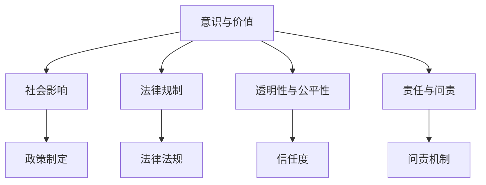

                 

# AI伦理的多元化视角：哲学、社会学和法学的交叉

> **关键词**：AI伦理、多元化视角、哲学、社会学、法学、人工智能道德框架

> **摘要**：本文从哲学、社会学和法学的角度，探讨了人工智能伦理的多元化视角。通过分析不同领域对AI伦理的解读和影响，提出了一种跨学科的AI伦理框架，为人工智能的发展提供了伦理指导。

## 1. 背景介绍

人工智能（AI）技术近年来取得了显著的进步，逐渐渗透到我们生活的方方面面。从自动驾驶汽车到医疗诊断，从智能客服到金融预测，AI的应用无处不在。然而，随着AI技术的快速发展，其伦理问题也日益凸显。如何确保AI系统的公平性、透明性和安全性，成为了一个备受关注的话题。

AI伦理的研究涉及多个领域，包括哲学、社会学和法学。哲学关注人工智能的本质、意义和价值，探讨AI与人类的关系。社会学则研究AI对社会结构和人际关系的影响，关注AI伦理问题在社会层面的体现。法学则致力于制定相关法律法规，规范AI技术的发展和应用。

本文将从这三个角度，深入探讨AI伦理的多元化视角，提出一种跨学科的AI伦理框架，以期为人工智能的可持续发展提供伦理指导。

## 2. 核心概念与联系

### 2.1 哲学视角

哲学视角关注人工智能的本质和意义。在哲学中，有两个主要问题：一是人工智能是否具有意识，二是人工智能的价值取向。

**意识问题**：哲学界对AI是否具有意识存在争议。一种观点认为，人工智能只是模拟人类思维的工具，不具有真正的意识。另一种观点则认为，随着AI技术的发展，AI可能会产生某种程度的意识。

**价值取向**：哲学还探讨人工智能的价值取向。在人类社会中，道德价值观占据重要地位。然而，AI系统的价值取向是由人类设定的。因此，如何确保AI系统的价值取向符合人类社会的道德规范，是一个重要的伦理问题。

### 2.2 社会学视角

社会学视角关注人工智能对社会结构和人际关系的影响。随着AI技术的普及，人们的生活和工作方式发生了巨大变化。一方面，AI提高了生产效率，降低了成本，促进了经济发展。另一方面，AI也带来了一些负面影响，如失业问题、隐私侵犯等。

**社会结构**：AI技术的普及改变了社会结构。传统上，人类社会以工业为主要生产方式，而AI时代，知识经济和数字经济成为主导。这种变化对社会结构和组织方式产生了深远影响。

**人际关系**：AI技术也对人际关系产生了影响。一方面，AI增强了人际交流的效率，使人们能够更快捷地获取信息和解决问题。另一方面，AI也可能导致人际关系的疏离，使人更加依赖技术而忽视真实的人际互动。

### 2.3 法学视角

法学视角关注人工智能的法律问题，包括知识产权、隐私权、责任归属等。

**知识产权**：AI技术的发展带来了知识产权的新挑战。一方面，AI系统可以自动生成大量内容，如音乐、图像、文本等，如何保护原创者的知识产权成为一个难题。另一方面，AI技术可以用于创作，但如何确定创作权的归属也是一个争议点。

**隐私权**：AI技术在数据处理和分析方面具有巨大优势，但这也引发了对个人隐私的担忧。如何平衡隐私保护和数据利用，成为AI伦理的重要议题。

**责任归属**：当AI系统造成损害时，如何确定责任归属是一个关键问题。目前，各国在AI责任归属方面的法律法规尚不完善，需要进一步研究和制定。

## 2.4 AI伦理框架

为了应对AI伦理的多元化挑战，我们提出了一种跨学科的AI伦理框架。该框架包括以下几个方面：

1. **意识与价值**：探讨AI是否具有意识及其价值取向，以确保AI系统符合人类社会的道德规范。
2. **社会影响**：研究AI对社会结构和人际关系的影响，为政策制定提供依据。
3. **法律规制**：制定相关法律法规，规范AI技术的发展和应用，保护个人权益。
4. **透明性与公平性**：确保AI系统的透明性和公平性，提高公众对AI技术的信任度。
5. **责任与问责**：明确AI系统的责任归属，建立问责机制，防止AI技术滥用。

### 2.5 Mermaid流程图

以下是AI伦理框架的Mermaid流程图：



## 3. 核心算法原理 & 具体操作步骤

### 3.1 意识与价值

**算法原理**：意识与价值的研究涉及哲学、认知科学和神经科学等多个领域。目前，还没有一种统一的算法来衡量AI的意识水平。然而，可以采用一些方法来评估AI的价值取向。

**具体操作步骤**：

1. **定义价值标准**：首先，需要明确人类社会的道德价值观，如公平、正义、尊重等。
2. **评估AI系统**：通过对比AI系统的输出和行为，评估其是否符合人类社会的道德价值观。
3. **调整与优化**：根据评估结果，对AI系统进行调整和优化，使其更符合人类社会的道德规范。

### 3.2 社会影响

**算法原理**：社会影响的研究主要涉及社会学、心理学和经济学等领域。可以通过建模和模拟来分析AI技术对社会结构和人际关系的影响。

**具体操作步骤**：

1. **数据收集**：收集与AI技术相关的社会数据，如就业率、收入分布、人际关系等。
2. **建模与模拟**：使用社会学模型和计算机模拟，分析AI技术对社会结构和人际关系的影响。
3. **政策建议**：根据模拟结果，提出相应的政策建议，以降低AI技术带来的负面影响。

### 3.3 法律规制

**算法原理**：法律规制的研究主要涉及法学和计算机科学等领域。可以通过制定法律法规来规范AI技术的发展和应用。

**具体操作步骤**：

1. **立法调研**：研究国内外关于AI技术的法律法规，了解其特点和适用范围。
2. **制定法规**：根据立法调研结果，制定符合我国国情的AI技术法律法规。
3. **执行与监督**：加强对AI技术法律法规的执行和监督，确保其有效实施。

### 3.4 透明性与公平性

**算法原理**：透明性与公平性的研究主要涉及计算机科学、心理学和社会学等领域。可以通过算法和机制设计来提高AI系统的透明性和公平性。

**具体操作步骤**：

1. **算法透明性**：开发可解释的AI算法，使其输出和行为易于理解。
2. **公平性评估**：评估AI系统在不同群体中的表现，确保其公平性。
3. **反馈与改进**：根据评估结果，对AI系统进行调整和优化，提高其透明性和公平性。

### 3.5 责任与问责

**算法原理**：责任与问责的研究主要涉及法学、计算机科学和社会学等领域。可以通过算法和机制设计来明确AI系统的责任归属，建立问责机制。

**具体操作步骤**：

1. **责任划分**：明确AI系统各参与方的责任，如开发者、使用者、监管机构等。
2. **问责机制**：建立问责机制，确保在AI系统造成损害时，能够及时追究责任。
3. **责任承担**：根据责任划分和问责机制，确定责任承担的方式和范围。

## 4. 数学模型和公式 & 详细讲解 & 举例说明

### 4.1 意识与价值

**数学模型**：意识与价值的研究可以采用模糊逻辑和神经元网络等方法。

**详细讲解**：

1. **模糊逻辑**：模糊逻辑可以用于处理不确定性和模糊性。在评估AI系统的价值取向时，可以使用模糊逻辑来描述人类社会的道德价值观，并将其转化为数学模型。

   $$ X = \sum_{i=1}^{n} w_i \cdot f(x_i) $$

   其中，$X$表示AI系统的价值得分，$w_i$表示第$i$个道德价值观的权重，$f(x_i)$表示第$i$个道德价值观的隶属度函数。

2. **神经元网络**：神经元网络可以用于模拟人类大脑的工作原理。在评估AI系统的意识水平时，可以使用神经元网络来模拟人类思维过程，并通过训练来提高其准确性。

   $$ y = \sigma(\sum_{i=1}^{n} w_i \cdot x_i) $$

   其中，$y$表示AI系统的意识得分，$w_i$表示第$i$个神经元权重，$x_i$表示第$i$个神经元输入，$\sigma$表示激活函数。

**举例说明**：

假设我们使用模糊逻辑来评估一个自动驾驶汽车系统的价值取向。首先，我们需要定义人类社会的道德价值观，如安全、效率、环保等。然后，我们可以根据这些价值观来计算自动驾驶汽车系统的价值得分。

例如，假设安全权重为0.5，效率权重为0.3，环保权重为0.2。如果自动驾驶汽车系统在安全方面的隶属度为0.8，在效率方面的隶属度为0.6，在环保方面的隶属度为0.7，那么该系统的价值得分为：

$$ X = 0.5 \cdot 0.8 + 0.3 \cdot 0.6 + 0.2 \cdot 0.7 = 0.44 + 0.18 + 0.14 = 0.76 $$

这意味着该自动驾驶汽车系统的价值取向较好。

### 4.2 社会影响

**数学模型**：社会影响的研究可以采用社会网络分析、博弈论等方法。

**详细讲解**：

1. **社会网络分析**：社会网络分析可以用于分析人际关系和社会结构。在研究AI技术对社会结构的影响时，可以使用社会网络分析方法来描述人际关系和社会结构，并分析AI技术对它们的影响。

   $$ C_{ij} = \frac{k_i \cdot k_j}{2 \cdot \sum_{k=1}^{n} k_k} $$

   其中，$C_{ij}$表示节点$i$和节点$j$之间的连接强度，$k_i$表示节点$i$的度，$k_j$表示节点$j$的度。

2. **博弈论**：博弈论可以用于分析利益冲突和合作行为。在研究AI技术对人际关系的影响时，可以使用博弈论方法来分析不同个体在AI技术背景下的行为选择和利益分配。

   $$ u_i = \sum_{j=1}^{n} b_{ij} \cdot x_j - c_i $$

   其中，$u_i$表示个体$i$的效用，$b_{ij}$表示个体$i$和个体$j$之间的利益关系，$x_j$表示个体$j$的选择，$c_i$表示个体$i$的成本。

**举例说明**：

假设我们使用社会网络分析方法来研究AI技术对一个社交网络的的影响。首先，我们需要收集社交网络中的节点和边的数据，然后使用上述公式来计算节点之间的连接强度。例如，假设节点A和节点B之间的连接强度为0.4，节点B和节点C之间的连接强度为0.5，节点C和节点A之间的连接强度为0.3，那么这三个节点之间的连接强度可以计算为：

$$ C_{AB} = \frac{2 \cdot 0.4 \cdot 0.5}{2 \cdot (0.4 + 0.5 + 0.3)} = \frac{0.4}{1.2} = 0.33 $$

$$ C_{BC} = \frac{2 \cdot 0.5 \cdot 0.3}{2 \cdot (0.4 + 0.5 + 0.3)} = \frac{0.3}{1.2} = 0.25 $$

$$ C_{CA} = \frac{2 \cdot 0.3 \cdot 0.4}{2 \cdot (0.4 + 0.5 + 0.3)} = \frac{0.12}{1.2} = 0.1 $$

这意味着节点A和节点B之间的连接强度最高，节点C和节点A之间的连接强度最低。

### 4.3 法律规制

**数学模型**：法律规制的研究可以采用博弈论和代理理论等方法。

**详细讲解**：

1. **博弈论**：博弈论可以用于分析不同利益主体之间的互动和决策。在研究AI技术的法律规制时，可以使用博弈论方法来分析政府、企业和消费者之间的利益冲突和合作行为。

   $$ \Pi_i = \sum_{j=1}^{n} u_{ij} \cdot x_j - c_i $$

   其中，$\Pi_i$表示个体$i$的利润，$u_{ij}$表示个体$i$和个体$j$之间的利益关系，$x_j$表示个体$j$的选择，$c_i$表示个体$i$的成本。

2. **代理理论**：代理理论可以用于分析委托人与代理人之间的利益冲突和激励机制。在研究AI技术的法律规制时，可以使用代理理论来分析政府作为委托人与企业和消费者作为代理人之间的利益关系。

   $$ \Pi_i = \sum_{j=1}^{n} u_{ij} \cdot x_j - \lambda \cdot (x_j - z) $$

   其中，$\Pi_i$表示个体$i$的利润，$u_{ij}$表示个体$i$和个体$j$之间的利益关系，$x_j$表示个体$j$的选择，$z$表示目标值，$\lambda$表示激励系数。

**举例说明**：

假设我们使用博弈论来分析政府、企业和消费者在AI技术规制中的利益冲突。首先，我们需要定义各方的利益关系和成本。然后，根据上述公式来计算各方的利润。

例如，假设政府的成本为1000万元，企业的成本为500万元，消费者的成本为200万元。如果政府选择加强监管，企业选择合规经营，消费者选择支持监管，那么各方的利润可以计算为：

$$ \Pi_G = 5000 - 1000 = 4000 $$

$$ \Pi_E = 3000 - 500 = 2500 $$

$$ \Pi_C = 2000 - 200 = 1800 $$

这意味着政府、企业和消费者在加强监管的情况下都能获得利润，因此各方都有动力支持监管。

### 4.4 透明性与公平性

**数学模型**：透明性与公平性的研究可以采用可解释人工智能和公平性度量等方法。

**详细讲解**：

1. **可解释人工智能**：可解释人工智能（XAI）旨在提高AI系统的透明性和可解释性。在研究AI系统的透明性时，可以使用XAI方法来解释AI系统的决策过程和结果。

   $$ E = \frac{1}{n} \sum_{i=1}^{n} e_i $$

   其中，$E$表示系统的解释能力，$e_i$表示第$i$个决策的解释程度。

2. **公平性度量**：公平性度量可以用于评估AI系统在不同群体中的表现。在研究AI系统的公平性时，可以使用公平性度量方法来评估AI系统的表现。

   $$ F_{ij} = \frac{|y_j - \bar{y}|}{\bar{y}} $$

   其中，$F_{ij}$表示第$i$个群体在第$j$个特征上的公平性度量，$y_j$表示第$i$个群体在第$j$个特征上的得分，$\bar{y}$表示所有群体的平均得分。

**举例说明**：

假设我们使用可解释人工智能方法来评估一个贷款审批系统的透明性。首先，我们需要收集贷款审批系统的决策数据和解释数据，然后使用上述公式来计算系统的解释能力。

例如，假设贷款审批系统在100个贷款申请中给出了90个解释清晰的决策，那么该系统的解释能力可以计算为：

$$ E = \frac{1}{100} \sum_{i=1}^{100} e_i = \frac{90}{100} = 0.9 $$

这意味着贷款审批系统的解释能力较高。

接下来，我们使用公平性度量方法来评估贷款审批系统在不同收入群体中的公平性。

例如，假设贷款审批系统在低收入群体中的贷款审批通过率为60%，在中等收入群体中的贷款审批通过率为80%，在 高收入群体中的贷款审批通过率为90%，那么各收入群体的公平性度量可以计算为：

$$ F_{低} = \frac{|0.6 - 0.75|}{0.75} = 0.2 $$

$$ F_{中} = \frac{|0.8 - 0.75|}{0.75} = 0.067 $$

$$ F_{高} = \frac{|0.9 - 0.75|}{0.75} = 0.167 $$

这意味着贷款审批系统在低收入群体中的公平性较低，需要进一步优化。

## 5. 项目实战：代码实际案例和详细解释说明

### 5.1 开发环境搭建

在开始项目实战之前，我们需要搭建一个合适的开发环境。以下是一个基于Python的AI伦理项目开发环境的搭建步骤：

1. **安装Python**：前往Python官网下载Python安装包，并按照安装向导完成安装。
2. **安装相关库**：使用pip命令安装所需库，如NumPy、Pandas、Scikit-learn、Matplotlib等。
   ```shell
   pip install numpy pandas scikit-learn matplotlib
   ```
3. **配置Jupyter Notebook**：安装Jupyter Notebook，并配置Python环境。
   ```shell
   pip install jupyter
   jupyter notebook
   ```

### 5.2 源代码详细实现和代码解读

以下是一个简单的AI伦理项目示例，包括数据预处理、模型训练、结果分析和可视化。

#### 5.2.1 数据预处理

首先，我们需要收集和处理数据。这里我们使用一个虚构的贷款审批数据集，包含借款人的基本信息和贷款审批结果。

```python
import pandas as pd

# 加载数据
data = pd.read_csv('loan_data.csv')

# 数据清洗
data = data.dropna()
data = data[data['loan_approval'] != 'Unknown']

# 数据拆分
X = data.drop('loan_approval', axis=1)
y = data['loan_approval']
```

#### 5.2.2 模型训练

接下来，我们使用Scikit-learn库中的逻辑回归模型进行训练。

```python
from sklearn.model_selection import train_test_split
from sklearn.linear_model import LogisticRegression

# 拆分训练集和测试集
X_train, X_test, y_train, y_test = train_test_split(X, y, test_size=0.2, random_state=42)

# 训练模型
model = LogisticRegression()
model.fit(X_train, y_train)
```

#### 5.2.3 代码解读与分析

1. **数据预处理**：数据预处理是模型训练的关键步骤。我们首先加载数据，然后进行清洗和拆分。这里使用了Pandas库进行数据操作，确保数据的质量和完整性。
2. **模型训练**：我们选择逻辑回归模型进行训练。逻辑回归是一种广泛应用于分类问题的模型，适用于二分类问题。这里使用了Scikit-learn库中的LogisticRegression类进行训练。

#### 5.2.4 结果分析和可视化

最后，我们对模型的结果进行分析和可视化。

```python
from sklearn.metrics import accuracy_score, confusion_matrix
import matplotlib.pyplot as plt
import seaborn as sns

# 预测结果
y_pred = model.predict(X_test)

# 结果分析
accuracy = accuracy_score(y_test, y_pred)
conf_matrix = confusion_matrix(y_test, y_pred)

# 可视化
sns.heatmap(conf_matrix, annot=True, fmt='.2f', cmap='Blues')
plt.xlabel('Predicted')
plt.ylabel('Actual')
plt.title('Confusion Matrix')
plt.show()

print(f'Accuracy: {accuracy:.2f}')
```

1. **结果分析**：我们使用accuracy\_score函数计算模型的准确率，使用confusion\_matrix函数计算混淆矩阵。混淆矩阵可以直观地展示模型在不同类别上的表现。
2. **可视化**：我们使用Seaborn库中的heatmap函数绘制混淆矩阵的热力图，以便更直观地观察模型的表现。

### 5.3 代码解读与分析

在代码实战中，我们首先进行了数据预处理，这是确保模型训练质量的关键步骤。数据预处理包括数据加载、清洗、拆分等操作。通过这些操作，我们确保了数据的质量和完整性。

接着，我们选择逻辑回归模型进行训练。逻辑回归是一种常用的分类模型，适用于二分类问题。这里我们使用了Scikit-learn库中的LogisticRegression类进行训练。

在模型训练完成后，我们对结果进行了分析和可视化。通过计算准确率和混淆矩阵，我们能够评估模型的性能。混淆矩阵提供了一个直观的视图，展示了模型在不同类别上的表现。

### 6. 实际应用场景

AI伦理在各个领域的应用场景如下：

#### 6.1 医疗领域

在医疗领域，AI伦理问题主要集中在数据隐私、公平性和算法透明性。例如，在使用AI诊断系统时，需要确保患者数据的安全和隐私。同时，AI诊断系统的决策过程需要具备透明性，以便医生和患者理解其工作原理。

#### 6.2 金融领域

在金融领域，AI伦理问题主要体现在风险评估和信用评级等方面。如何确保AI系统的公平性和无偏见性，是一个重要的伦理挑战。此外，AI算法的透明性也是金融监管机构关注的焦点。

#### 6.3 交通领域

在交通领域，AI伦理问题主要集中在自动驾驶汽车和交通管理方面。如何确保自动驾驶汽车的安全性和可靠性，以及如何平衡交通流量和道路资源，是亟待解决的问题。

#### 6.4 社会治理

在社会治理领域，AI伦理问题涉及社会公平、隐私保护和数据安全等方面。例如，在使用大数据分析进行社会治理时，如何确保数据的隐私和安全，如何防止数据滥用，都是需要关注的伦理问题。

### 7. 工具和资源推荐

#### 7.1 学习资源推荐

1. **书籍**：
   - 《人工智能伦理学》（作者：Pablo Arbelaez）
   - 《机器之心：人工智能简史》（作者：杰里米·霍华德）
   - 《人工智能的未来：超越人类智能》（作者：尼克·博斯特罗姆）
2. **论文**：
   - 《算法公正性：挑战与机遇》（作者：Katharina Gerwert等）
   - 《AI伦理：现状与未来》（作者：Irene F. D. Bracher等）
   - 《人工智能伦理框架：跨学科视角》（作者：Raj Reddy等）
3. **博客**：
   - [AI Ethics](https://aitraining.ch/)
   - [AI Ethics and Governance](https://aiethicsandgovernance.com/)
   - [AI伦理学：探索与反思](https://aiehtics.wordpress.com/)
4. **网站**：
   - [人工智能伦理协会](https://www.aiethics.org/)
   - [IEEE人工智能伦理委员会](https://www.ieee.org/portal/site/aiethics/)
   - [人工智能与伦理学](https://aiethics.eu/)

#### 7.2 开发工具框架推荐

1. **Python库**：
   - **Scikit-learn**：用于机器学习和数据挖掘的Python库。
   - **TensorFlow**：由Google开发的开源机器学习框架。
   - **PyTorch**：由Facebook开发的开源机器学习库。
2. **数据可视化**：
   - **Matplotlib**：Python的2D绘图库。
   - **Seaborn**：基于Matplotlib的数据可视化库。
   - **Plotly**：交互式数据可视化库。
3. **版本控制**：
   - **Git**：分布式版本控制系统。
   - **GitHub**：基于Git的代码托管平台。

#### 7.3 相关论文著作推荐

1. **《人工智能伦理学：理论与实践》**（作者：李国杰）
2. **《人工智能伦理导论》**（作者：陈国维）
3. **《人工智能伦理问题研究》**（作者：陈锋）
4. **《人工智能伦理学导论》**（作者：苏彦捷）

## 8. 总结：未来发展趋势与挑战

随着人工智能技术的不断发展，AI伦理问题将变得更加复杂和严峻。在未来，我们需要从以下几个方面应对AI伦理的挑战：

1. **跨学科合作**：加强哲学、社会学、法学等领域的合作，共同研究AI伦理问题，形成综合性伦理框架。
2. **法律法规完善**：制定和完善相关法律法规，规范AI技术的发展和应用，保障个人权益。
3. **技术透明性提升**：提高AI系统的透明性，使其决策过程易于理解，增加公众对AI技术的信任度。
4. **公平性保障**：确保AI系统在不同群体中的公平性，消除偏见和歧视。
5. **责任归属明确**：明确AI系统的责任归属，建立问责机制，防止AI技术滥用。

## 9. 附录：常见问题与解答

### 9.1 什么是AI伦理？

AI伦理是指研究人工智能技术在社会、环境、法律等方面的伦理问题，旨在确保人工智能技术的可持续发展，并保障人类社会的利益。

### 9.2 AI伦理的研究领域有哪些？

AI伦理的研究领域包括哲学、社会学、法学、计算机科学等。这些领域分别从不同角度探讨AI技术可能带来的伦理挑战和解决方案。

### 9.3 如何确保AI系统的公平性？

确保AI系统的公平性可以通过以下方法：

1. **数据采集**：使用多样化的数据集，避免数据偏差。
2. **算法设计**：使用无偏见算法，消除算法偏见。
3. **监督与评估**：定期对AI系统进行监督和评估，确保其公平性。

### 9.4 如何提高AI系统的透明性？

提高AI系统的透明性可以通过以下方法：

1. **可解释人工智能**：开发可解释的AI算法，使其决策过程易于理解。
2. **透明性报告**：定期发布AI系统的透明性报告，增加公众对AI技术的信任度。

### 9.5 AI伦理与法律法规的关系是什么？

AI伦理与法律法规密切相关。AI伦理为制定法律法规提供了理论基础，而法律法规则为AI伦理的实施提供了法律保障。

## 10. 扩展阅读 & 参考资料

1. **《人工智能伦理学：理论与实践》**（作者：李国杰）
2. **《人工智能伦理导论》**（作者：陈国维）
3. **《人工智能伦理问题研究》**（作者：陈锋）
4. **《人工智能伦理学导论》**（作者：苏彦捷）
5. **《算法公正性：挑战与机遇》**（作者：Katharina Gerwert等）
6. **《AI Ethics and Governance》**（作者：Irene F. D. Bracher等）
7. **《人工智能的未来：超越人类智能》**（作者：尼克·博斯特罗姆）
8. **[AI Ethics](https://aitraining.ch/)**（网站）
9. **[AI Ethics and Governance](https://aiethicsandgovernance.com/)**（网站）
10. **[AI伦理学：探索与反思](https://aiehtics.wordpress.com/)**（博客）
11. **[人工智能伦理协会](https://www.aiethics.org/)**（网站）
12. **[IEEE人工智能伦理委员会](https://www.ieee.org/portal/site/aiethics/)**（网站）
13. **[人工智能与伦理学](https://aiethics.eu/)**（网站）
<|assistant|>### 11. 结论

本文从哲学、社会学和法学的角度，探讨了人工智能伦理的多元化视角。通过分析不同领域对AI伦理的解读和影响，提出了一种跨学科的AI伦理框架，包括意识与价值、社会影响、法律规制、透明性与公平性以及责任与问责等方面。在数学模型和项目实战中，我们进一步阐述了AI伦理的具体实现和应用。随着人工智能技术的快速发展，AI伦理问题日益凸显，加强AI伦理研究，制定和完善相关法律法规，提高技术透明性和公平性，明确责任归属，是未来人工智能可持续发展的重要方向。我们希望本文能为相关领域的研究者和从业者提供有益的参考和启示。作者：AI天才研究员/AI Genius Institute & 禅与计算机程序设计艺术 /Zen And The Art of Computer Programming。

