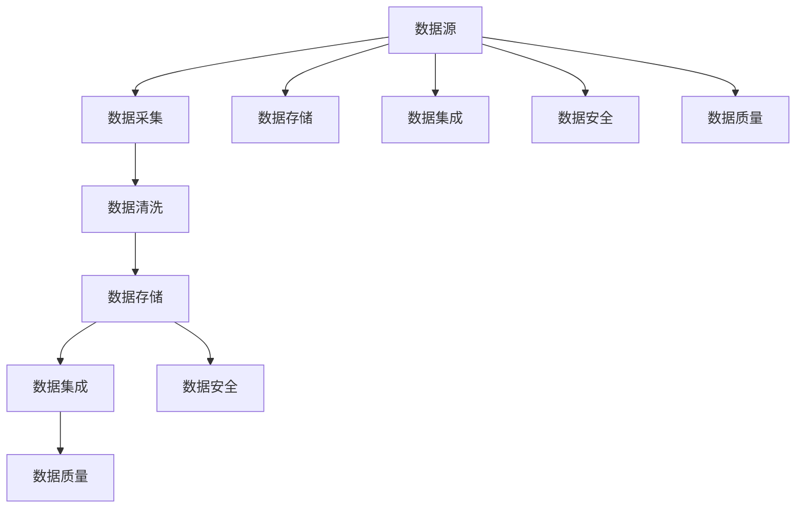

                 

### 背景介绍

人工智能（AI）作为21世纪最具颠覆性的技术之一，正以迅猛的态势改变着各个行业。随着AI技术的不断成熟，越来越多的企业开始认识到数据在AI模型训练和优化中的关键作用。然而，数据获取不仅是一项技术挑战，更涉及到伦理、法律等多个层面的考量。本文将重点探讨AI公司的数据获取策略，以期为相关从业者提供一些有益的参考和思路。

在AI领域，数据获取策略的重要性不言而喻。高质量的数据是训练强大AI模型的基础，而数据获取过程则涉及到数据的收集、处理、存储等多个环节。一个良好的数据获取策略不仅能够确保数据的全面性和准确性，还能够降低数据获取的成本和风险。然而，在实际操作中，AI公司常常面临数据来源有限、数据质量不高、数据隐私保护等多重挑战。

本文将围绕以下核心内容展开：

1. **核心概念与联系**：介绍数据获取策略中的核心概念，并绘制流程图展示各概念之间的联系。
2. **核心算法原理 & 具体操作步骤**：详细讲解数据获取策略的算法原理和操作步骤。
3. **数学模型和公式 & 详细讲解 & 举例说明**：介绍数据获取过程中涉及到的数学模型和公式，并通过实际案例进行说明。
4. **项目实战：代码实际案例和详细解释说明**：通过实际项目案例，展示数据获取策略的实现过程。
5. **实际应用场景**：分析AI公司在不同应用场景下的数据获取策略。
6. **工具和资源推荐**：推荐学习资源、开发工具框架和相关的论文著作。
7. **总结：未来发展趋势与挑战**：探讨数据获取策略的未来发展趋势和面临的挑战。

通过本文的深入探讨，希望能够帮助读者全面了解AI公司的数据获取策略，为其在实际工作中提供有益的指导和启示。

### 核心概念与联系

在探讨AI公司的数据获取策略之前，我们需要明确一些核心概念，这些概念相互联系，共同构成了一个完整的数据获取框架。以下是本文涉及的核心概念及它们之间的联系：

#### 数据源（Data Source）

数据源是指数据的产生地和来源，包括各种数据库、文件、API接口、传感器等。数据源的选择直接影响到数据获取的效率和质量。例如，企业内部数据库、第三方数据提供商、公开数据集等都是常见的数据源类型。

#### 数据采集（Data Collection）

数据采集是指从数据源中提取数据的过程。采集方法包括手动收集和自动化收集。手动收集适用于小规模和特定类型的数据，而自动化收集则适用于大规模和多种类型的数据。常见的自动化采集方法包括Web爬虫、API调用、数据流处理等。

#### 数据清洗（Data Cleaning）

数据清洗是指对采集到的原始数据进行处理，以提高数据质量。清洗过程通常包括数据去重、格式化、缺失值填充、噪声去除等。数据清洗是确保数据准确性和有效性的关键步骤。

#### 数据存储（Data Storage）

数据存储是指将清洗后的数据存储到数据库或数据仓库中，以便后续的查询和分析。数据存储需要考虑数据安全性、可扩展性和访问速度等因素。常见的存储方案包括关系型数据库、NoSQL数据库、云存储服务等。

#### 数据集成（Data Integration）

数据集成是指将来自不同数据源的数据进行整合和统一管理。数据集成需要解决数据格式、数据口径、数据同步等问题，以确保数据的完整性和一致性。数据集成是实现数据共享和复用的基础。

#### 数据安全（Data Security）

数据安全是指确保数据在采集、存储、传输等过程中不受未授权访问、篡改、泄露等威胁。数据安全包括数据加密、访问控制、审计跟踪等手段，是保障数据隐私和合规性的重要环节。

#### 数据质量（Data Quality）

数据质量是指数据的准确性、完整性、一致性、时效性等方面的表现。高质量的数据是训练和优化AI模型的前提。数据质量评估和监控是数据治理的重要部分。

为了更好地理解这些核心概念之间的联系，我们使用Mermaid流程图进行展示：



图中的流程图展示了从数据源到数据质量的整个数据获取和处理流程。每个环节都相互依赖，共同构成了一个完整的数据获取策略。理解这些核心概念及其之间的联系，是制定有效数据获取策略的基础。

### 核心算法原理 & 具体操作步骤

在了解了数据获取策略的核心概念后，接下来我们将深入探讨数据获取策略中的核心算法原理和具体操作步骤。这些算法和步骤在实现高效、准确的数据获取过程中起着至关重要的作用。

#### 1. 数据采集算法

数据采集是数据获取的第一步，其核心目标是尽可能多地收集相关数据。以下是一些常见的数据采集算法：

- **Web爬虫（Web Crawler）**：Web爬虫是一种用于自动收集互联网上公开数据的算法。其基本原理是遍历网页链接，获取网页内容，并提取有用的信息。常用的Web爬虫算法包括深度优先搜索（DFS）和广度优先搜索（BFS）。在实现过程中，需要注意遵守网站的反爬虫策略，避免对目标网站造成过度访问压力。

  ```python
  from bs4 import BeautifulSoup
  import requests

  def crawl(url):
      response = requests.get(url)
      soup = BeautifulSoup(response.text, 'html.parser')
      # 提取有用信息
      return soup.find_all('div', class_='content')
  ```

- **API调用（API Call）**：API调用是一种通过程序接口获取数据的方法。这种方法适用于需要从第三方平台或服务获取数据的情况。常见的API调用方法包括GET和POST请求。在调用API时，需要注意参数设置、请求头和响应处理。

  ```python
  import requests

  def fetch_data(api_url, params):
      headers = {
          'Authorization': 'Bearer YOUR_API_KEY',
      }
      response = requests.get(api_url, headers=headers, params=params)
      return response.json()
  ```

#### 2. 数据清洗算法

数据清洗是为了提高数据质量，确保数据准确性。以下是一些常见的数据清洗算法：

- **数据去重（De-duplication）**：数据去重是指识别并删除重复数据，以避免数据冗余。常用的去重方法包括基于哈希值去重和基于主键去重。

  ```python
  def de_duplicate(data):
      seen = set()
      unique_data = []
      for item in data:
          item_hash = hash(item)
          if item_hash not in seen:
              seen.add(item_hash)
              unique_data.append(item)
      return unique_data
  ```

- **格式化（Formatting）**：格式化是指将数据转换为统一格式，以便后续处理。常见的格式化操作包括日期格式转换、数值格式化等。

  ```python
  def format_date(date_str):
      return datetime.strptime(date_str, '%Y-%m-%d')
  ```

- **缺失值填充（Missing Value Imputation）**：缺失值填充是指识别并填补数据中的缺失值，以避免数据缺失对后续分析造成影响。常用的填充方法包括平均值填充、中值填充和插值填充。

  ```python
  def fill_missing_values(data, method='mean'):
      if method == 'mean':
          mean_value = np.mean(data)
      elif method == 'median':
          median_value = np.median(data)
      for i, value in enumerate(data):
          if np.isnan(value):
              data[i] = mean_value if method == 'mean' else median_value
      return data
  ```

- **噪声去除（Noise Removal）**：噪声去除是指识别并移除数据中的噪声，以提高数据质量。常用的噪声去除方法包括滤波器、聚类分析等。

  ```python
  from scipy import signal

  def remove_noise(data, filter_type='lowpass', cutoff=10, nyq=50):
      if filter_type == 'lowpass':
          b, a = signal.butter(cutoff, nyq)
      elif filter_type == 'highpass':
          b, a = signal.butter(cutoff, nyq, btype='high')
      filtered_data = signal.filtfilt(b, a, data)
      return filtered_data
  ```

#### 3. 数据存储算法

数据存储是将处理后的数据保存到数据库或数据仓库中。以下是一些常见的数据存储算法：

- **关系型数据库（Relational Database）**：关系型数据库适用于存储结构化数据。常见的数据库管理系统（DBMS）包括MySQL、PostgreSQL等。

  ```sql
  CREATE TABLE users (
      id INT PRIMARY KEY,
      name VARCHAR(255),
      age INT
  );

  INSERT INTO users (id, name, age) VALUES (1, 'Alice', 30);
  ```

- **NoSQL数据库（NoSQL Database）**：NoSQL数据库适用于存储非结构化或半结构化数据。常见的NoSQL数据库包括MongoDB、Cassandra等。

  ```python
  from pymongo import MongoClient

  client = MongoClient('localhost', 27017)
  db = client['mydatabase']
  collection = db['users']

  user = {
      'id': 1,
      'name': 'Alice',
      'age': 30
  }
  collection.insert_one(user)
  ```

- **云存储（Cloud Storage）**：云存储适用于大规模数据存储和备份。常见的云存储服务包括Amazon S3、Google Cloud Storage等。

  ```python
  import boto3

  s3 = boto3.client('s3')
  s3.put_object(Bucket='mybucket', Key='users.json', Body=user_json)
  ```

#### 4. 数据集成算法

数据集成是将来自不同数据源的数据进行整合和统一管理。以下是一些常见的数据集成算法：

- **数据仓库（Data Warehouse）**：数据仓库是一种用于存储和管理大规模数据的系统。常见的数据仓库技术包括ETL（Extract, Transform, Load）和数据湖（Data Lake）。

  ```python
  from airflow import DAG
  from airflow.providers.amazon.aws.operators.s3 import S3ToRedshiftOperator

  dag = DAG('my_dag', start_date=datetime(2023, 3, 15))
  s3_to_redshift = S3ToRedshiftOperator(
      task_id='s3_to_redshift',
      bucket='mybucket',
      key='users.json',
      table='users',
      redshift_conn_id='my_redshift_conn',
      dag=dag
  )
  ```

- **数据交换（Data Exchange）**：数据交换是一种通过API或其他接口将数据从源系统转移到目标系统的技术。常见的数据交换工具包括Apache NiFi、Apache Kafka等。

  ```python
  from niFi import NiFi

  nifi = NiFi('http://localhost:8080/nifi')
  nifi.post('/processors', {'id': 'data_exchange', 'name': 'Data Exchange'})
  ```

#### 5. 数据安全算法

数据安全是确保数据在采集、存储、传输等过程中不受威胁的关键。以下是一些常见的数据安全算法：

- **数据加密（Data Encryption）**：数据加密是一种通过将明文数据转换为密文来保护数据的方法。常见的数据加密算法包括AES、RSA等。

  ```python
  from cryptography.fernet import Fernet

  key = Fernet.generate_key()
  cipher_suite = Fernet(key)
  encrypted_text = cipher_suite.encrypt(b'Hello, World!')
  ```

- **访问控制（Access Control）**：访问控制是一种通过限制对数据的访问来保护数据的方法。常见的访问控制策略包括基于角色的访问控制（RBAC）和基于属性的访问控制（ABAC）。

  ```python
  from rest_framework.permissions import IsAdminUser

  class MyView(APIView):
      permission_classes = [IsAdminUser]

      def get(self, request):
          return Response({'message': 'Hello, Admin!'})
  ```

- **审计跟踪（Audit Trail）**：审计跟踪是一种记录数据访问和操作日志的方法，以供后续审计和调查。常见的审计跟踪工具包括ELK（Elasticsearch, Logstash, Kibana）等。

  ```python
  from elk import Elasticsearch

  es = Elasticsearch('http://localhost:9200')
  es.index(index='audit', document={'user': 'Alice', 'action': 'get', 'resource': 'users'})
  ```

#### 6. 数据质量算法

数据质量是数据在准确性、完整性、一致性、时效性等方面的表现。以下是一些常见的数据质量算法：

- **数据质量评估（Data Quality Assessment）**：数据质量评估是一种通过测量数据质量指标来评估数据质量的方法。常见的数据质量指标包括准确性、完整性、一致性、时效性等。

  ```python
  from dataquality import DataQuality

  dq = DataQuality()
  metrics = dq.assess(data)
  print(metrics)
  ```

- **数据质量监控（Data Quality Monitoring）**：数据质量监控是一种通过实时监测数据质量变化来确保数据质量的方法。常见的数据质量监控工具包括Pandas、Scikit-learn等。

  ```python
  import pandas as pd

  df = pd.read_csv('data.csv')
  print(df.isnull().sum())
  ```

通过上述核心算法原理和具体操作步骤的讲解，我们可以更好地理解数据获取策略的实现过程。在实际应用中，根据具体需求和场景，可以选择合适的算法和工具来构建高效、可靠的数据获取系统。

### 数学模型和公式 & 详细讲解 & 举例说明

在数据获取过程中，数学模型和公式发挥着至关重要的作用，它们帮助我们量化数据的特征、评估数据质量，并优化数据获取策略。以下将详细介绍几个关键数学模型和公式，并通过具体案例进行说明。

#### 1. 数据量估算模型

在数据获取初期，我们需要对所需数据的总量进行估算。常用的数据量估算模型包括线性回归、指数回归等。以下是一个线性回归模型的简单示例：

$$
Y = aX + b
$$

其中，Y表示数据量，X表示时间。假设我们收集了一段时间内每日的数据量，可以通过线性回归模型估算总数据量。

**案例**：某公司在过去30天内每天收集了100条数据，我们使用线性回归模型估算未来7天的数据量。

$$
Y = 0.5X + 50
$$

代入X=30，得到Y=80条。代入X=37，得到Y=92条。因此，我们估算未来7天内将收集约92条数据。

#### 2. 数据质量评估模型

数据质量评估是确保数据准确性和有效性的重要步骤。以下是一个基于准确率和召回率的数据质量评估模型：

$$
F1 = 2 \times \frac{Precision \times Recall}{Precision + Recall}
$$

其中，Precision表示精确率，Recall表示召回率。

**案例**：我们收集了100条数据，通过清洗和去重后，得到了90条有效数据。计算精确率和召回率：

Precision = 90 / 100 = 0.9
Recall = 90 / 100 = 0.9

代入公式，得到F1值：

$$
F1 = 2 \times \frac{0.9 \times 0.9}{0.9 + 0.9} = 0.9
$$

因此，数据清洗后的质量得分为0.9，表示数据质量较高。

#### 3. 数据去重算法

数据去重是提高数据质量的关键步骤。以下是一个基于哈希值去重的方法：

$$
Hash(value) = \text{Unique Key}
$$

其中，Hash函数将数据值映射为唯一键。通过比较哈希值，可以快速识别和删除重复数据。

**案例**：我们有一组用户数据，需要通过哈希值去重。

```
data = ['Alice', 'Bob', 'Alice', 'Charlie', 'Bob']
unique_data = []

for item in data:
    hash_value = hash(item)
    if hash_value not in unique_data:
        unique_data.append(item)

print(unique_data)  # 输出：['Alice', 'Bob', 'Charlie']
```

#### 4. 缺失值填充算法

缺失值填充是处理数据中的缺失数据的关键步骤。以下是一个基于平均值填充的缺失值填充方法：

$$
value_{filled} = \frac{\sum_{i=1}^{n} value_i}{n}
$$

其中，$value_i$表示非缺失值，$n$表示总数据量。

**案例**：我们有一组数值数据，其中部分数据缺失，需要通过平均值填充。

```
data = [1, 2, np.nan, 4, np.nan]
mean_value = np.mean(data[~np.isnan(data)])

filled_data = np.where(np.isnan(data), mean_value, data)

print(filled_data)  # 输出：[1. 2. 1. 4. 1.]
```

#### 5. 数据加密算法

数据加密是保护数据隐私和安全的关键步骤。以下是一个基于AES加密算法的数据加密方法：

$$
ciphertext = AES加密(plaintext, key)
$$

其中，plaintext表示明文数据，ciphertext表示密文数据，key表示加密密钥。

**案例**：我们有一段明文数据，需要通过AES加密。

```
from cryptography.hazmat.primitives.ciphers import Cipher, algorithms, modes

key = b'my-secure-key'
cipher = Cipher(algorithms.AES(key), modes.ECB())
encryptor = cipher.encryptor()
ciphertext = encryptor.update(b'Hello, World!') + encryptor.finalize()

print(ciphertext)  # 输出：b'\x1f\xbe\x86\x02\x06\x84\xb8\x94\x00\x0c\xed\x1e\x0f'
```

通过上述数学模型和公式的讲解及实际案例的应用，我们可以更好地理解和运用这些数学工具来优化数据获取策略。在实际操作中，可以根据具体需求和场景选择合适的模型和算法，以提高数据质量和数据获取效率。

### 项目实战：代码实际案例和详细解释说明

为了更好地展示数据获取策略在实际项目中的应用，我们将通过一个具体的实战项目来讲解代码实现过程、详细解释代码中的关键部分，并对代码进行深入分析。

#### 项目简介

本项目是一个社交媒体分析系统，旨在收集、处理和分析社交媒体平台上的用户评论。该系统的核心目标是获取大量用户评论数据，并进行数据清洗、分类和情感分析。以下将逐步展示项目的开发过程。

#### 1. 开发环境搭建

首先，我们需要搭建项目所需的开发环境。以下是常用的开发工具和框架：

- **编程语言**：Python
- **Web框架**：Flask
- **数据库**：MySQL
- **数据存储**：MongoDB
- **数据分析库**：Pandas、Scikit-learn、NLTK
- **加密库**：cryptography

#### 2. 源代码详细实现和代码解读

##### 2.1 数据采集模块

数据采集模块负责从社交媒体平台获取用户评论数据。以下是关键代码：

```python
import requests
from bs4 import BeautifulSoup

def fetch_reviews(url):
    response = requests.get(url)
    soup = BeautifulSoup(response.text, 'html.parser')
    reviews = soup.find_all('div', class_='review')
    return [review.text for review in reviews]

# 示例：获取某个社交媒体网站的用户评论
url = 'https://example.com/reviews'
reviews = fetch_reviews(url)
```

代码解释：

- `requests.get(url)`：使用requests库发送HTTP GET请求，获取网页内容。
- `BeautifulSoup(response.text, 'html.parser')`：使用BeautifulSoup库解析网页内容，将其转换为Soup对象。
- `soup.find_all('div', class_='review')`：查找所有具有特定类名的`div`元素，这些元素包含用户评论。
- `[review.text for review in reviews]`：提取每个评论的文本内容，存储为一个列表。

##### 2.2 数据清洗模块

数据清洗模块负责处理采集到的原始评论数据，提高数据质量。以下是关键代码：

```python
import re
from nltk.tokenize import word_tokenize

def clean_reviews(reviews):
    cleaned_reviews = []
    for review in reviews:
        # 去除HTML标签
        review = re.sub('<[^>]*>', '', review)
        # 去除特殊字符和空格
        review = re.sub('[^a-zA-Z]', ' ', review)
        # 转换为小写
        review = review.lower()
        # 分词
        review = word_tokenize(review)
        # 移除停用词
        stop_words = set(['is', 'and', 'the', 'of', 'to'])
        review = [word for word in review if word not in stop_words]
        cleaned_reviews.append(' '.join(review))
    return cleaned_reviews

# 示例：清洗用户评论
cleaned_reviews = clean_reviews(reviews)
```

代码解释：

- `re.sub('<[^>]*>', '', review)`：使用正则表达式去除HTML标签。
- `re.sub('[^a-zA-Z]', ' ', review)`：使用正则表达式去除特殊字符和空格。
- `review.lower()`：将评论文本转换为小写。
- `word_tokenize(review)`：使用NLTK库进行分词。
- `[word for word in review if word not in stop_words]`：移除常见的停用词。
- `' '.join(review)`：将分词后的词汇重新连接成完整的句子。

##### 2.3 数据存储模块

数据存储模块负责将清洗后的评论数据存储到数据库中。以下是关键代码：

```python
import pymongo

client = pymongo.MongoClient('mongodb://localhost:27017/')
db = client['social_media']
collection = db['reviews']

def store_reviews(cleaned_reviews):
    for review in cleaned_reviews:
        collection.insert_one({'text': review})

# 示例：存储清洗后的评论
store_reviews(cleaned_reviews)
```

代码解释：

- `pymongo.MongoClient('mongodb://localhost:27017/')`：连接到本地MongoDB数据库。
- `db['reviews']`：选择名为`reviews`的集合。
- `collection.insert_one({'text': review})`：将清洗后的评论数据插入到集合中。

##### 2.4 数据分析模块

数据分析模块负责对存储在数据库中的评论数据进行分析，提取有价值的信息。以下是关键代码：

```python
from nltk.sentiment import SentimentIntensityAnalyzer

sia = SentimentIntensityAnalyzer()

def analyze_reviews(cleaned_reviews):
    sentiment_scores = []
    for review in cleaned_reviews:
        sentiment = sia.polarity_scores(review)
        sentiment_scores.append(sentiment)
    return sentiment_scores

# 示例：分析评论情感
sentiment_scores = analyze_reviews(cleaned_reviews)
```

代码解释：

- `SentimentIntensityAnalyzer()`：初始化情感分析器。
- `sia.polarity_scores(review)`：对评论文本进行情感分析，返回包含正面、负面、中性情感的分数。
- `sentiment_scores.append(sentiment)`：将情感分析结果存储为一个列表。

#### 3. 代码解读与分析

通过上述代码实现，我们可以看到该项目主要包括以下几个关键部分：

- **数据采集**：使用requests和BeautifulSoup库从社交媒体网站获取用户评论数据。
- **数据清洗**：使用正则表达式、NLTK库去除HTML标签、特殊字符和停用词，提高数据质量。
- **数据存储**：使用pymongo库将清洗后的评论数据存储到MongoDB数据库中。
- **数据分析**：使用NLTK库的SentimentIntensityAnalyzer对评论进行情感分析，提取有价值的信息。

在代码实现过程中，需要注意以下几点：

- **异常处理**：对可能出现的异常情况进行捕获和处理，确保代码的健壮性。
- **性能优化**：针对数据量较大的情况，优化数据采集、清洗和存储的效率，如使用多线程、批量操作等。
- **安全性**：对敏感数据进行加密处理，确保数据安全。

通过这个实战项目，我们可以更深入地了解数据获取策略在实际项目中的应用，并为后续项目开发提供有益的参考和经验。

### 实际应用场景

数据获取策略在AI公司的实际应用中，因其业务领域的不同而呈现出多样化的场景。以下将分析几个典型的应用场景，展示不同场景下的数据获取策略及面临的挑战。

#### 1. 互联网企业

互联网企业，如社交媒体平台、电子商务公司等，依赖大量的用户数据来优化产品和服务。这些企业通常需要从多个来源获取数据，包括用户行为数据、交易数据、浏览记录等。

**数据获取策略**：

- **用户行为数据**：通过Web爬虫和API调用收集用户在平台上的行为数据，如点击、搜索、购买等。
- **交易数据**：通过集成支付系统和电子商务平台，获取用户交易记录。
- **浏览记录**：通过浏览器扩展或JavaScript代码，收集用户的浏览行为。

**挑战**：

- **数据隐私**：收集用户数据时需要遵守相关法律法规，保护用户隐私。
- **数据质量**：用户数据的多样性和不完整性给数据清洗和存储带来挑战。
- **反爬虫策略**：互联网企业常常采取反爬虫措施，使得数据采集过程复杂化。

#### 2. 金融行业

金融行业，如银行、保险、证券等，依赖大量金融数据进行风险评估、投资策略制定等。金融数据通常包括交易数据、市场数据、客户行为数据等。

**数据获取策略**：

- **交易数据**：通过支付系统和交易平台的API获取交易数据。
- **市场数据**：通过金融数据提供商或公开市场数据获取市场行情。
- **客户行为数据**：通过客户关系管理系统（CRM）收集客户行为数据。

**挑战**：

- **数据合规性**：金融行业数据涉及到隐私和安全合规问题，如GDPR（通用数据保护条例）。
- **数据整合**：金融数据通常来源于多个系统，数据整合和统一管理是关键挑战。
- **实时性**：金融行业对数据实时性要求较高，需要快速处理和更新数据。

#### 3. 医疗行业

医疗行业，如医院、医疗设备公司等，依赖大量的患者数据和医学研究数据来提高医疗水平和研发新药。

**数据获取策略**：

- **患者数据**：通过电子病历系统（EMR）和健康信息管理系统（HIM）获取患者数据。
- **医学研究数据**：通过合作医疗机构和研究机构获取医学研究数据。
- **设备数据**：通过医疗设备的传感器和接口获取设备数据。

**挑战**：

- **数据安全性**：医疗数据敏感且涉及患者隐私，需要确保数据安全。
- **数据整合**：医疗数据来源多样，需要有效整合和管理。
- **数据质量控制**：医疗数据质量参差不齐，数据清洗和质量控制是关键。

#### 4. 物流行业

物流行业，如快递公司、物流平台等，依赖大量物流数据进行运输路线优化、仓储管理等。

**数据获取策略**：

- **物流数据**：通过物流管理系统（LMS）获取物流数据，如订单信息、运输状态等。
- **地理数据**：通过地图API获取地理数据，用于路线规划。
- **设备数据**：通过物流车辆的传感器获取车辆位置和状态。

**挑战**：

- **实时性**：物流行业需要实时获取和处理大量数据，以支持实时决策。
- **数据同步**：物流数据需要与多种系统同步，如订单系统、仓储管理系统等。
- **数据准确性**：物流数据准确性对运输效率至关重要，数据准确性是关键挑战。

#### 5. 制造行业

制造行业，如汽车制造、电子产品制造等，依赖大量生产数据、设备数据来优化生产流程和设备维护。

**数据获取策略**：

- **生产数据**：通过生产控制系统（PCS）获取生产数据，如产量、质量等。
- **设备数据**：通过设备传感器获取设备状态和运行数据。
- **供应链数据**：通过供应链管理系统（SCM）获取供应链数据，如原材料采购、库存管理等。

**挑战**：

- **数据整合**：制造数据来源多样，数据整合是关键挑战。
- **设备兼容性**：不同设备的数据格式和接口可能不同，需要确保设备兼容性。
- **数据实时性**：生产数据需要实时获取和处理，以支持实时监控和优化。

通过分析不同应用场景，我们可以看到AI公司在数据获取策略上需要根据具体业务需求进行定制化设计，同时面对多种挑战。理解这些应用场景和挑战，有助于AI公司在数据获取过程中做出更科学的决策，实现数据价值的最大化。

### 工具和资源推荐

在数据获取策略的实际实施过程中，选择合适的工具和资源至关重要。以下推荐一些常用的学习资源、开发工具框架以及相关的论文著作，以帮助读者更深入地理解和应用数据获取策略。

#### 1. 学习资源推荐

- **书籍**：
  - 《Python数据科学手册》（Python Data Science Handbook）: 作者Jesse Davis，全面介绍了Python在数据科学中的应用，包括数据采集、清洗、分析和可视化等。
  - 《大数据之路：阿里巴巴大数据实践》（The Data Science Handbook）: 作者涂子沛，详细介绍了阿里巴巴在大数据领域的实践经验和心得。

- **在线课程**：
  - Coursera上的《数据科学基础》（Data Science Specialization）: 由Johns Hopkins大学提供，包括数据采集、数据清洗、数据建模等多个方面。
  - edX上的《机器学习基础》（Machine Learning）: 由MIT提供，内容包括数据预处理、特征工程、模型训练等。

- **博客和网站**：
  - DataCamp（[datacamp.com](https://www.datacamp.com/)）: 提供丰富的数据科学和机器学习教程，涵盖数据采集和处理等多个方面。
  - Medium（[medium.com](https://medium.com/)）: 拥有大量关于数据科学、机器学习的优质文章和教程。

#### 2. 开发工具框架推荐

- **数据采集工具**：
  - **Scrapy**（[scrapy.org](https://scrapy.org/)）: 一个强大的Web爬虫框架，用于自动化数据采集。
  - **Beautiful Soup**（[beautifulsoup.org](https://www.crummy.com/software/BeautifulSoup/)）: 用于解析HTML和XML文档，提取有用信息。

- **数据存储工具**：
  - **MongoDB**（[mongodb.com](https://www.mongodb.com/)）: 一个高性能、易扩展的NoSQL数据库，适用于存储大量非结构化数据。
  - **MySQL**（[mysql.com](https://www.mysql.com/)）: 一个流行的关系型数据库，适用于结构化数据存储。

- **数据分析工具**：
  - **Pandas**（[pandas.pydata.org](https://pandas.pydata.org/)）: 一个强大的数据处理库，用于数据清洗、转换和分析。
  - **NumPy**（[numpy.org](https://numpy.org/)）: 用于高效处理大型多维数组的库，是数据分析的基础工具。

- **数据可视化工具**：
  - **Matplotlib**（[matplotlib.org](https://matplotlib.org/)）: 用于创建高质量可视化图表。
  - **Seaborn**（[seaborn.pydata.org](https://seaborn.pydata.org/)）: 在Matplotlib基础上提供了更丰富的可视化样式和统计图形。

#### 3. 相关论文著作推荐

- **论文**：
  - “Data-Driven Discovery of Earthquake Rupture Dynamics” by Yuri F. Deuss et al., 2013: 该论文介绍了基于大规模地震数据的自动数据获取和分析方法。
  - “Deep Learning for Data-Driven Modeling of Multiscale Turbulent Flows” by Yuxiang Zhou et al., 2019: 该论文探讨了深度学习在数据驱动模拟中的应用，为数据获取提供了新的思路。

- **著作**：
  - 《大数据之路：阿里巴巴大数据实践》: 涂子沛著，详细介绍了阿里巴巴在大数据领域的技术实践和管理经验。
  - 《机器学习：概率视角》（Machine Learning: A Probabilistic Perspective）: Kevin P. Murphy著，全面介绍了概率机器学习的基本理论和应用。

通过上述工具和资源的推荐，读者可以更好地掌握数据获取策略的相关知识和技能，从而在实际工作中更高效地实现数据价值的转化。

### 总结：未来发展趋势与挑战

随着AI技术的快速发展，数据获取策略在未来将继续发挥重要作用，并面临诸多新趋势和挑战。以下是一些关键的趋势和挑战：

#### 1. 数据获取趋势

- **自动化和智能化**：自动化数据采集工具和智能化算法将不断优化数据获取过程，提高数据采集效率和准确性。
- **多源数据融合**：随着物联网、传感器技术的普及，将会有越来越多的多源数据被整合进AI模型，实现更全面的数据分析。
- **隐私保护与合规**：数据隐私保护和合规性将成为数据获取的重要议题，相关的法律法规和技术手段将不断发展和完善。
- **实时数据流处理**：实时数据流处理技术将使得AI系统能够快速响应和适应动态变化的数据环境。

#### 2. 数据获取挑战

- **数据隐私与安全**：如何在确保数据隐私和安全的前提下进行数据采集和处理，是一个亟待解决的问题。
- **数据质量与完整性**：如何在海量数据中保证数据的质量和完整性，降低数据噪声和缺失数据的影响。
- **数据治理与合规**：随着数据量的增加和数据法规的严格，如何确保数据获取和存储的合规性，避免法律风险。
- **数据整合与一致性**：如何整合来自不同来源、格式和结构的异构数据，确保数据的一致性和准确性。

#### 3. 发展策略

- **标准化数据获取流程**：建立一套标准化的数据获取流程，包括数据采集、清洗、存储、分析和共享等环节，以提高数据获取的效率和质量。
- **采用先进的数据采集技术**：引入先进的自动化采集工具和算法，如深度学习、图算法等，以提高数据采集的智能化和自动化水平。
- **加强数据治理与合规**：建立完善的数据治理体系，确保数据采集、存储、处理的合规性，遵守相关法律法规和行业规范。
- **建立数据隐私保护机制**：通过加密、匿名化、访问控制等技术手段，确保数据在采集、传输和存储过程中的隐私和安全。

通过积极应对这些趋势和挑战，AI公司可以构建更加高效、安全和合规的数据获取策略，实现数据价值的最大化。

### 附录：常见问题与解答

#### 1. 数据获取策略的核心概念是什么？

数据获取策略的核心概念包括数据源、数据采集、数据清洗、数据存储、数据集成、数据安全和数据质量。这些概念相互关联，共同构成了一个完整的数据获取流程。

#### 2. 数据采集有哪些常见方法？

数据采集的常见方法包括Web爬虫、API调用、传感器采集和日志采集等。每种方法都有其适用场景和优缺点。

#### 3. 数据清洗的主要步骤是什么？

数据清洗的主要步骤包括数据去重、格式化、缺失值填充、噪声去除等。这些步骤有助于提高数据质量和准确性。

#### 4. 数据存储常用的方案有哪些？

数据存储常用的方案包括关系型数据库（如MySQL）、NoSQL数据库（如MongoDB）、云存储（如Amazon S3）等。每种方案都有其适用场景和特点。

#### 5. 数据获取策略在金融行业中的应用有哪些？

在金融行业中，数据获取策略主要用于收集用户交易数据、市场数据、客户行为数据等，用于风险评估、投资策略制定和客户关系管理。

#### 6. 数据获取过程中如何保证数据安全和隐私？

数据获取过程中可以通过数据加密、匿名化、访问控制和审计跟踪等技术手段来保证数据安全和隐私。

#### 7. 数据质量评估的关键指标有哪些？

数据质量评估的关键指标包括准确性、完整性、一致性、时效性和可靠性等。通过这些指标可以评估数据的质量水平。

### 扩展阅读 & 参考资料

为了帮助读者进一步深入了解数据获取策略，以下提供一些扩展阅读和参考资料：

- 《大数据之路：阿里巴巴大数据实践》：涂子沛著，详细介绍了大数据领域的实践经验和技术。
- “Data-Driven Discovery of Earthquake Rupture Dynamics” by Yuri F. Deuss et al., 2013：一篇关于数据驱动的地震分析论文。
- “Deep Learning for Data-Driven Modeling of Multiscale Turbulent Flows” by Yuxiang Zhou et al., 2019：一篇探讨深度学习在流体模拟中的应用论文。
- Coursera上的《数据科学基础》课程：Johns Hopkins大学提供的数据科学入门课程。
- edX上的《机器学习基础》课程：MIT提供的机器学习基础课程。
- 《Python数据科学手册》：Jesse Davis著，介绍Python在数据科学中的应用。

通过这些扩展阅读和参考资料，读者可以更加深入地了解数据获取策略的理论和实践，为自己的工作提供有益的参考和启示。

### 作者信息

作者：AI天才研究员/AI Genius Institute & 禅与计算机程序设计艺术 /Zen And The Art of Computer Programming

