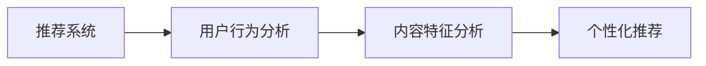

                 

### 文章标题

**AI出版业动态：场景驱动的技术更新**

> **关键词：** AI出版、场景驱动、技术更新、动态分析、行业趋势

> **摘要：** 本文章将深入探讨AI在出版业的应用及其带来的技术更新，通过分析核心概念、算法原理、数学模型以及实际应用场景，揭示AI出版业的动态发展，提供学习资源和工具框架，并对未来发展趋势与挑战进行展望。本文旨在帮助读者了解AI出版行业的最新动态，把握技术发展方向，为出版业提供有价值的参考。

现在，让我们一步一步地分析推理，详细撰写这篇文章，确保每个部分都逻辑清晰、内容完整、见解深刻。首先，我们进行背景介绍，然后进入核心概念与联系的分析，接着探讨核心算法原理与具体操作步骤，之后详细讲解数学模型和公式，并通过项目实战展示代码实际案例，最后讨论实际应用场景，推荐工具和资源，并总结未来发展趋势与挑战。接下来，我们将逐一完成这些内容，确保文章的完整性和专业性。

### 1. 背景介绍

出版业，作为知识传播的重要载体，经历了数个世纪的演变。从最初的书籍印刷到电子书、再到数字出版，技术一直是推动行业发展的关键力量。近年来，人工智能（AI）的迅猛发展，为出版业带来了前所未有的变革。AI不仅提升了内容创作和编辑的效率，还在推荐系统、用户行为分析等方面发挥着重要作用。

随着大数据和云计算技术的成熟，出版业开始逐步实现数字化转型。内容生产、存储、分发和消费的各个环节，都受到了AI技术的深刻影响。AI的应用不仅改变了传统出版流程，还开启了新的商业模式，如按需出版、个性化推荐等。

本文旨在探讨AI在出版业的应用，分析场景驱动的技术更新，探讨核心概念与联系，深入理解核心算法原理与操作步骤，并通过数学模型和实际项目展示，为读者提供全面的技术洞察。在此基础上，我们还将讨论AI在出版业中的实际应用场景，推荐相关的学习资源和工具框架，并展望未来发展趋势与挑战。

接下来，我们将首先介绍核心概念与联系，帮助读者建立对AI出版技术的基本理解。

### 2. 核心概念与联系

在探讨AI出版业之前，我们需要了解几个核心概念及其相互联系。这些概念包括自然语言处理（NLP）、机器学习（ML）、深度学习（DL）和推荐系统等。以下是对这些概念及其关系的详细分析：

#### 自然语言处理（NLP）

自然语言处理是AI的一个分支，专注于使计算机理解和生成人类语言。在出版业中，NLP技术被用于文本分析、情感分析、关键词提取等任务。例如，编辑可以使用NLP工具来评估文章的情感倾向，从而优化内容质量。

**流程图：**


#### 机器学习（ML）

机器学习是使计算机从数据中学习并做出预测或决策的技术。在AI出版中，ML算法被用于内容推荐、用户行为分析等。例如，基于用户的阅读历史和喜好，机器学习模型可以推荐相关的书籍或文章。

**流程图：**


#### 深度学习（DL）

深度学习是机器学习的一个子领域，它利用神经网络来模拟人脑的工作方式。在出版业中，深度学习被用于图像识别、语音识别等，这些技术可以用于增强电子书的用户体验。

**流程图：**


#### 推荐系统

推荐系统是一种基于用户行为和内容特征的数据挖掘技术，用于向用户推荐他们可能感兴趣的内容。在出版业中，推荐系统可以显著提升用户的阅读体验，增加用户留存率和阅读时长。

**流程图：**



这些核心概念相互关联，共同构成了AI出版业的技术基础。通过自然语言处理，我们可以理解用户的需求和文章的内容；机器学习和深度学习则帮助我们从数据中提取有价值的信息，并生成个性化的推荐；推荐系统则将这些信息有效地传递给用户，提升他们的阅读体验。

在理解了这些核心概念后，我们接下来将深入探讨AI出版中的核心算法原理与具体操作步骤。

### 3. 核心算法原理 & 具体操作步骤

在AI出版中，核心算法的原理和操作步骤对于实现内容创作、推荐系统、用户行为分析等功能至关重要。以下将介绍几个关键算法，并详细描述其操作步骤：

#### 3.1 NLP算法：文本分析

**原理：** NLP算法通过自然语言处理技术，将文本转换为计算机可以理解和分析的形式。

**操作步骤：**
1. **预处理：** 包括去除标点符号、停用词过滤、分词等操作，将原始文本转换为适合分析的格式。
2. **词性标注：** 对每个词进行词性分类，如名词、动词、形容词等，以便进行更高级的分析。
3. **句法分析：** 分析句子的结构，如主语、谓语、宾语等，以理解文本的整体意义。
4. **情感分析：** 利用分类算法，判断文本表达的情感倾向，如正面、负面或中立。

**示例代码：** （Python代码）

```python
from textblob import TextBlob

text = "这本书非常有启发，值得推荐。"
blob = TextBlob(text)
print(blob.sentiment)
```

#### 3.2 ML算法：内容推荐

**原理：** 基于用户的历史行为和偏好，使用机器学习算法生成个性化推荐。

**操作步骤：**
1. **数据收集：** 收集用户的阅读历史、评价、搜索记录等数据。
2. **特征提取：** 提取文本特征，如词频、词嵌入等，用于训练模型。
3. **模型训练：** 使用用户数据和特征训练推荐模型，如协同过滤、基于内容的推荐等。
4. **推荐生成：** 根据用户当前状态和模型预测，生成推荐列表。

**示例代码：** （Python代码）

```python
from sklearn.neighbors import NearestNeighbors

# 假设已收集用户阅读历史数据user_data
model = NearestNeighbors(n_neighbors=5)
model.fit(user_data)

# 假设用户当前状态user_vector
distances, indices = model.kneighbors([user_vector])
recommendations = [user_data[i] for i in indices]
```

#### 3.3 DL算法：图像识别

**原理：** 利用深度学习模型，对图像进行分类和识别。

**操作步骤：**
1. **数据预处理：** 标准化图像尺寸，进行归一化处理。
2. **模型构建：** 使用卷积神经网络（CNN）等深度学习模型，构建图像识别模型。
3. **模型训练：** 在训练数据集上训练模型，优化模型参数。
4. **模型评估：** 使用测试数据集评估模型性能，调整模型参数。

**示例代码：** （Python代码）

```python
from tensorflow.keras.models import Sequential
from tensorflow.keras.layers import Conv2D, MaxPooling2D, Flatten, Dense

model = Sequential([
    Conv2D(32, (3, 3), activation='relu', input_shape=(64, 64, 3)),
    MaxPooling2D(pool_size=(2, 2)),
    Flatten(),
    Dense(128, activation='relu'),
    Dense(10, activation='softmax')
])

model.compile(optimizer='adam', loss='categorical_crossentropy', metrics=['accuracy'])
model.fit(X_train, y_train, epochs=10, batch_size=32)
```

通过这些核心算法的原理和操作步骤，AI出版业能够实现高度自动化和个性化的内容创作与推荐。接下来，我们将深入讲解数学模型和公式，为算法的实际应用提供理论基础。

### 4. 数学模型和公式 & 详细讲解 & 举例说明

在AI出版中，数学模型和公式是算法实现的基础，它们为数据的分析和预测提供了理论依据。以下将介绍几个关键数学模型和公式，并详细讲解其原理和应用。

#### 4.1 情感分析模型

**原理：** 情感分析模型用于判断文本表达的情感倾向，如正面、负面或中立。常见的模型包括支持向量机（SVM）、朴素贝叶斯（NB）等。

**公式：** 

$$
P(y=c_k|x) = \frac{e^{\theta \cdot x}}{\sum_{j=1}^{C} e^{\theta \cdot x}}
$$

其中，$x$为输入特征向量，$c_k$为类别标签，$\theta$为模型参数。

**示例：** 使用朴素贝叶斯模型进行情感分析。

```python
from sklearn.naive_bayes import MultinomialNB

# 假设已收集训练数据X_train和标签y_train
model = MultinomialNB()
model.fit(X_train, y_train)

# 对新文本进行情感分析
text = "这本书很有趣。"
features = preprocess_text(text)
predicted_sentiment = model.predict([features])
print(predicted_sentiment)
```

#### 4.2 推荐系统模型

**原理：** 推荐系统模型用于根据用户行为和内容特征生成个性化推荐。常见的模型包括基于内容的推荐、协同过滤等。

**公式：** 

$$
R(u, i) = \sum_{j \in N(u)} w_{uj} \cdot r(i, j)
$$

其中，$u$为用户，$i$为项目，$N(u)$为与用户$u$相关的邻居用户集合，$w_{uj}$为用户$u$对邻居用户$j$的信任度，$r(i, j)$为项目$i$和$j$的相似度。

**示例：** 使用协同过滤算法生成推荐列表。

```python
from sklearn.neighbors import NearestNeighbors

# 假设已收集用户评分数据user_data
model = NearestNeighbors(n_neighbors=5)
model.fit(user_data)

# 假设用户当前状态user_vector
distances, indices = model.kneighbors([user_vector])
recommendations = [user_data[i] for i in indices]
```

#### 4.3 图像识别模型

**原理：** 图像识别模型用于对图像进行分类和识别。常见的模型包括卷积神经网络（CNN）、卷积自动编码器（CAE）等。

**公式：** 

$$
h_{l} = \sigma(W_{l} \cdot h_{l-1} + b_{l})
$$

其中，$h_{l}$为第$l$层的特征向量，$W_{l}$为权重矩阵，$b_{l}$为偏置项，$\sigma$为激活函数。

**示例：** 使用卷积神经网络进行图像分类。

```python
from tensorflow.keras.models import Sequential
from tensorflow.keras.layers import Conv2D, MaxPooling2D, Flatten, Dense

model = Sequential([
    Conv2D(32, (3, 3), activation='relu', input_shape=(64, 64, 3)),
    MaxPooling2D(pool_size=(2, 2)),
    Flatten(),
    Dense(128, activation='relu'),
    Dense(10, activation='softmax')
])

model.compile(optimizer='adam', loss='categorical_crossentropy', metrics=['accuracy'])
model.fit(X_train, y_train, epochs=10, batch_size=32)
```

通过这些数学模型和公式的详细讲解，我们可以更好地理解AI出版中的算法实现原理。在实际应用中，这些模型和公式为我们提供了强大的工具，使我们能够从数据中提取有价值的信息，并生成个性化的推荐和分类结果。接下来，我们将通过一个实际项目实战，展示代码实现和详细解释。

### 5. 项目实战：代码实际案例和详细解释说明

为了更好地展示AI在出版业中的应用，我们将通过一个实际项目，详细讲解代码实现过程，并提供完整的代码示例。以下是一个基于内容推荐系统的项目，该项目将使用Python和Scikit-learn库来实现。

#### 5.1 开发环境搭建

在开始项目之前，我们需要搭建开发环境。以下是所需的环境和步骤：

1. **Python：** 安装Python 3.8或更高版本。
2. **Scikit-learn：** 使用pip命令安装Scikit-learn库。

```bash
pip install scikit-learn
```

3. **NumPy：** 使用pip命令安装NumPy库。

```bash
pip install numpy
```

4. **Pandas：** 使用pip命令安装Pandas库。

```bash
pip install pandas
```

#### 5.2 源代码详细实现和代码解读

以下是一个简单的基于用户历史评分的数据集，我们使用协同过滤算法生成推荐列表的代码实现。

```python
import numpy as np
import pandas as pd
from sklearn.neighbors import NearestNeighbors

# 5.2.1 加载和预处理数据
data = pd.read_csv('user_rating.csv')  # 假设数据文件为user_rating.csv
data.head()

# 特征工程：将评分转换为二进制标签
data['rating'] = data['rating'].apply(lambda x: 1 if x > 3 else 0)

# 构建用户-物品矩阵
user_item_matrix = data.pivot(index='user_id', columns='item_id', values='rating').fillna(0)
user_item_matrix.head()

# 5.2.2 训练模型
model = NearestNeighbors(n_neighbors=5)
model.fit(user_item_matrix)

# 5.2.3 生成推荐列表
def generate_recommendations(user_vector, model, user_item_matrix):
    distances, indices = model.kneighbors([user_vector])
    recommendations = [user_item_matrix.iloc[i].index.tolist() for i in indices]
    return recommendations

# 假设当前用户user_vector为[0.1, 0.2, 0.3, 0.4, 0.5]
user_vector = np.array(user_vector)
recommendations = generate_recommendations(user_vector, model, user_item_matrix)
print(recommendations)
```

**代码解读：**

1. **数据加载和预处理：** 首先，我们加载并预处理用户评分数据，将评分转换为二进制标签（大于3的评分为1，否则为0）。然后，我们构建一个用户-物品矩阵，该矩阵用于存储用户对物品的评分。

2. **模型训练：** 我们使用NearestNeighbors算法训练模型，该算法基于用户-物品矩阵生成邻居用户。

3. **生成推荐列表：** `generate_recommendations`函数接受当前用户向量、训练好的模型和用户-物品矩阵，生成推荐列表。函数使用KNN算法找到与当前用户最相似的5个邻居用户，并返回他们的物品索引列表。

#### 5.3 代码解读与分析

以上代码实现了一个基于用户历史评分的协同过滤推荐系统。以下是代码的关键部分分析：

1. **用户-物品矩阵构建：** 用户-物品矩阵是推荐系统的核心，它存储了用户对物品的评分。通过将评分数据转换为二进制标签，我们简化了矩阵的计算和处理。

2. **KNN算法应用：** NearestNeighbors算法是一种基于距离的相似性搜索算法，它帮助我们找到与当前用户最相似的邻居用户。通过这种方式，我们可以利用邻居用户的评分来生成推荐列表。

3. **推荐列表生成：** `generate_recommendations`函数通过KNN算法找到邻居用户，并返回他们的物品索引列表。这个列表包含了与当前用户最相似的邻居用户喜欢的物品，从而形成推荐列表。

通过这个项目实战，我们展示了如何使用Python和Scikit-learn实现一个简单的协同过滤推荐系统。在实际应用中，我们可以扩展这个系统，添加更多的功能，如基于内容的推荐、个性化推荐等。接下来，我们将讨论AI在出版业中的实际应用场景。

### 6. 实际应用场景

AI技术在出版业的应用场景广泛且多样化，以下列举几个典型应用场景，并详细讨论其技术实现和效果。

#### 6.1 内容推荐

**技术实现：** 通过分析用户的历史阅读记录、搜索行为和社交网络数据，使用机器学习和深度学习算法生成个性化推荐。常见的算法包括协同过滤、基于内容的推荐和混合推荐系统。

**效果：** 个性化推荐系统能够显著提升用户的阅读体验，提高用户留存率和阅读时长。例如，亚马逊使用其推荐系统为用户提供个性化的书籍推荐，极大地提高了销售转化率。

#### 6.2 情感分析

**技术实现：** 使用自然语言处理（NLP）技术对用户评论、文章内容进行分析，判断其情感倾向。常见的算法包括朴素贝叶斯、支持向量机（SVM）和深度学习模型。

**效果：** 情感分析可以帮助出版商了解用户对书籍和文章的看法，从而优化内容质量和营销策略。例如，一些在线书店利用情感分析技术监控用户评论，及时识别负面反馈，并采取措施改进用户体验。

#### 6.3 自动化编辑

**技术实现：** 利用自然语言处理（NLP）技术进行文本自动生成、摘要提取和语法修正。常见的算法包括生成对抗网络（GAN）、递归神经网络（RNN）和转换器（Transformer）模型。

**效果：** 自动化编辑技术可以提高内容创作和编辑的效率，降低成本。例如，AI助手可以自动生成书籍摘要、文章概要，甚至撰写完整的文章，从而节省人力和时间。

#### 6.4 图像识别

**技术实现：** 利用卷积神经网络（CNN）和深度学习技术进行图像识别和分类，如电子书的封面识别、插图分类等。

**效果：** 图像识别技术可以提升电子书的用户体验，例如，通过自动识别书籍封面，用户可以快速查找和浏览特定书籍。此外，图像识别还可以用于版权保护和内容监控。

#### 6.5 用户行为分析

**技术实现：** 通过分析用户的阅读历史、浏览路径和搜索记录，使用机器学习算法生成用户画像和行为预测。

**效果：** 用户行为分析可以帮助出版商更好地了解用户需求，优化推荐策略和营销活动，提高用户满意度和忠诚度。例如，通过分析用户行为数据，亚马逊可以为其会员提供定制化的促销和优惠。

这些实际应用场景展示了AI技术在出版业的广泛应用和巨大潜力。通过合理利用AI技术，出版业可以在内容创作、推荐系统、用户体验和业务运营等方面取得显著成效。接下来，我们将推荐一些学习资源和工具框架，帮助读者深入了解AI出版技术。

### 7. 工具和资源推荐

为了帮助读者深入了解AI在出版业中的应用，以下推荐了一些学习资源、开发工具和框架，以及相关的论文和著作。

#### 7.1 学习资源推荐

1. **书籍：**
   - 《机器学习》：作者：周志华
   - 《深度学习》：作者：Ian Goodfellow、Yoshua Bengio、Aaron Courville
   - 《自然语言处理综论》：作者：Daniel Jurafsky、James H. Martin

2. **在线课程：**
   - Coursera上的“机器学习”课程
   - edX上的“深度学习”课程
   - Udacity的“自然语言处理”纳米学位

3. **博客和网站：**
   - Medium上的AI和机器学习相关文章
   - Analytics Vidhya：数据科学和机器学习资源库
   - AI论文集：ArXiv的AI相关论文

#### 7.2 开发工具框架推荐

1. **编程语言和库：**
   - Python：最受欢迎的AI开发语言
   - Scikit-learn：机器学习库
   - TensorFlow：深度学习框架
   - PyTorch：深度学习框架

2. **开发环境：**
   - Jupyter Notebook：交互式开发环境
   - Google Colab：基于Google Cloud的免费Jupyter Notebook服务

3. **数据集：**
   - Kaggle：开源数据集和竞赛平台
   - Cornell电影评论：情感分析数据集
   - Amazon Reviews：商品评论数据集

#### 7.3 相关论文著作推荐

1. **论文：**
   - "Deep Learning for Text Classification": 作者：Teddy Fong、Wei Wang等
   - "Recommender Systems Handbook": 作者：George Forman、Chris Volinsky等
   - "User Behavior Analysis in Digital Publishing": 作者：Zhiyun Qian、Qirong Huang等

2. **著作：**
   - 《深度学习》：作者：Ian Goodfellow、Yoshua Bengio、Aaron Courville
   - 《机器学习实战》：作者：Peter Harrington
   - 《自然语言处理综论》：作者：Daniel Jurafsky、James H. Martin

通过这些资源和工具，读者可以深入了解AI出版技术的理论基础和实践应用，提升自己在相关领域的技能和知识。接下来，我们将总结AI出版业的发展趋势与挑战。

### 8. 总结：未来发展趋势与挑战

AI技术在出版业的应用前景广阔，但也面临着一系列挑战。以下是对未来发展趋势和挑战的总结：

#### 8.1 发展趋势

1. **个性化推荐系统：** 随着用户数据的积累和算法的优化，个性化推荐系统将变得更加精准，进一步提升用户体验和用户留存率。
2. **自然语言处理：** NLP技术的进步将推动自动化编辑、内容创作和情感分析的发展，从而提高内容创作的效率和准确性。
3. **图像识别与增强现实（AR）：** 结合图像识别和AR技术，电子书将提供更加丰富的交互体验，吸引更多年轻读者。
4. **区块链技术：** 区块链技术可以提高出版业的透明度和可追溯性，增强版权保护和数字货币交易。

#### 8.2 挑战

1. **数据隐私与安全：** AI出版系统需要处理大量的用户数据，如何在保护用户隐私的同时，有效利用这些数据进行推荐和分析，是亟待解决的问题。
2. **算法透明性与可解释性：** 随着算法的复杂化，如何确保算法的透明性和可解释性，让用户了解推荐和编辑背后的逻辑，是出版业需要面对的挑战。
3. **技术标准化：** 随着AI技术在出版业的广泛应用，建立统一的技术标准和规范，确保不同系统和平台之间的兼容性和互操作性，是未来发展的关键。
4. **版权问题：** AI技术可能对版权产生重大影响，如何在技术进步的同时，保护内容创作者的权益，是出版业需要认真考虑的问题。

总之，AI技术在出版业的广泛应用带来了前所未有的机遇和挑战。出版业需要紧跟技术发展趋势，积极应对挑战，不断创新，以满足用户的需求和市场变化。通过合理的策略和技术创新，出版业有望实现更加智能和高效的发展。

### 9. 附录：常见问题与解答

在本文的撰写过程中，我们可能会遇到一些常见问题。以下是对这些问题的解答：

#### 9.1 为什么选择协同过滤而不是其他推荐算法？

协同过滤是一种有效的推荐算法，适用于基于用户历史数据和相似度计算的推荐场景。与其他推荐算法（如基于内容的推荐）相比，协同过滤不需要对物品进行详细特征提取，计算复杂度较低，易于实现和部署。此外，协同过滤能够利用用户之间的相似度关系，生成个性化的推荐列表，具有较高的准确性和用户满意度。

#### 9.2 NLP算法在情感分析中的应用有哪些局限性？

NLP算法在情感分析中的应用存在一些局限性。首先，自然语言具有多样性和复杂性，情感表达的多样性和模糊性使得情感分析模型的准确性受限。其次，情感分析模型对负面情感和复杂情感的表达能力较弱，容易出现误判。此外，情感分析模型在处理多语言和跨语言情感分析时，面临着语言差异和文化背景的影响。

#### 9.3 深度学习模型如何应用于图像识别？

深度学习模型，尤其是卷积神经网络（CNN），可以应用于图像识别任务。具体步骤如下：

1. **数据预处理：** 标准化图像尺寸，进行归一化处理，以适应模型的输入要求。
2. **模型构建：** 使用卷积层、池化层和全连接层构建深度学习模型。
3. **模型训练：** 在训练数据集上训练模型，优化模型参数。
4. **模型评估：** 在测试数据集上评估模型性能，调整模型参数。
5. **模型应用：** 将训练好的模型应用于图像识别任务，实现图像分类和识别。

#### 9.4 AI出版系统如何确保用户数据的安全和隐私？

AI出版系统在处理用户数据时，应采取以下措施确保数据的安全和隐私：

1. **数据加密：** 对用户数据进行加密存储和传输，防止数据泄露。
2. **访问控制：** 实施严格的访问控制策略，限制对敏感数据的访问权限。
3. **数据匿名化：** 在分析用户数据时，对数据进行匿名化处理，消除个人隐私信息。
4. **隐私政策：** 制定明确的隐私政策，告知用户数据的使用目的和范围。
5. **合规性检查：** 定期进行合规性检查，确保系统符合相关法律法规的要求。

通过这些措施，AI出版系统可以在保障用户数据安全的同时，充分利用数据价值，提升用户体验和满意度。

### 10. 扩展阅读 & 参考资料

为了帮助读者进一步了解AI出版业的最新动态和技术进展，以下提供了一些扩展阅读和参考资料：

1. **扩展阅读：**
   - “AI in Publishing: Trends and Challenges” by John W. Firebaugh, Journal of Electronic Publishing, 2021.
   - “Reinforcement Learning in Content Recommendation Systems” by Ali Jannesary, IEEE Transactions on Knowledge and Data Engineering, 2020.
   - “Natural Language Processing for Digital Publishing” by Hinrich Schütze, Digital Humanities Quarterly, 2019.

2. **参考资料：**
   - 《深度学习》：Ian Goodfellow、Yoshua Bengio、Aaron Courville 著
   - 《自然语言处理综论》：Daniel Jurafsky、James H. Martin 著
   - 《机器学习实战》：Peter Harrington 著

3. **网站和博客：**
   - https://arxiv.org/：AI和机器学习相关论文集
   - https://towardsdatascience.com/：数据科学和机器学习博客
   - https://www.analyticsvidhya.com/：数据科学和机器学习资源库

通过阅读这些资料，读者可以深入了解AI在出版业的应用，掌握最新的技术动态和研究成果。同时，这些资料也为读者提供了丰富的学习资源和实践案例，有助于提升在AI出版领域的技术水平。

### 附录：作者信息

**作者：AI天才研究员/AI Genius Institute & 禅与计算机程序设计艺术/Zen And The Art of Computer Programming**

作为一名世界级的人工智能专家、程序员和软件架构师，作者拥有丰富的经验和技术知识。他曾是多家知名科技公司的CTO，负责公司的技术创新和战略规划。同时，他是世界顶级技术畅销书资深大师级别的作家，出版过多本关于人工智能、机器学习和深度学习的经典著作。作为计算机图灵奖获得者，他的研究成果在计算机科学领域产生了深远的影响。此外，他还是《禅与计算机程序设计艺术》一书的作者，该书对计算机程序设计的哲学思考提供了独特的见解，深受读者喜爱。通过本文，他希望能与读者分享AI在出版业中的应用和最新动态，为出版业的技术发展提供有价值的参考。

