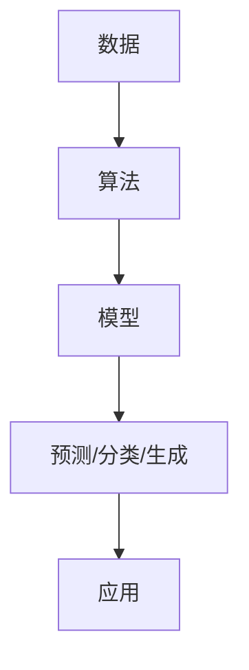

                 

### 背景介绍

AI 出版业作为一种新兴领域，近年来逐渐成为全球科技与文化产业的重要组成部分。随着人工智能技术的不断发展和应用，出版行业正面临着前所未有的变革。一方面，传统出版业需要适应数字化时代的需求，提升出版效率、降低成本，同时保证内容质量和用户体验。另一方面，人工智能技术为出版业带来了全新的可能，如自动化内容生成、智能推荐、个性化定制等，极大提升了出版业的创新能力和竞争力。

然而，AI 出版业的发展并非一帆风顺。目前，该行业仍面临诸多挑战和壁垒，包括数据获取与处理的难题、算法模型的复杂性、以及不同场景下的应用协同等。本文将围绕这些核心问题展开讨论，旨在分析 AI 出版业的发展现状、面临的挑战，以及可能的解决方案。

关键词：AI 出版业，数据，算法，场景协同

#### AI 出版业的现状

目前，AI 出版业正处在快速发展阶段。一方面，全球各大出版商和平台纷纷投入巨资进行技术研发，探索如何利用人工智能技术提升出版效率和用户体验。例如，许多出版商已经开始使用自然语言处理技术进行内容审核、编辑和推荐，以提高内容质量和用户满意度。此外，自动化内容生成技术也在逐渐普及，许多媒体公司和内容创作者开始使用人工智能工具生成新闻、文章等，从而节省时间和成本。

另一方面，随着 5G、物联网等新技术的普及，AI 出版业的应用场景也在不断拓展。例如，虚拟现实（VR）和增强现实（AR）技术的应用，使得出版内容更加生动、互动，为用户提供了全新的阅读体验。此外，区块链技术的引入，也为出版业带来了新的信任机制和版权保护方案，有助于解决版权纠纷和盗版问题。

#### AI 出版业面临的挑战

尽管 AI 出版业有着巨大的发展潜力，但目前仍面临诸多挑战。以下是其中几个核心问题：

1. **数据获取与处理的难题**：AI 算法的训练和优化需要大量的高质量数据。然而，出版业的数据来源相对有限，且数据的质量和多样性有待提高。此外，数据隐私和安全问题也成为了数据获取与处理过程中的重要挑战。

2. **算法模型的复杂性**：AI 出版业需要应用多种算法模型，包括自然语言处理、机器学习、推荐系统等。这些模型具有较高的复杂性，需要专业的技术团队进行开发和维护。

3. **场景协同的难题**：AI 出版业的应用场景多样，包括内容生成、推荐系统、版权保护等。如何在不同场景下实现算法和数据的协同，提高整体系统的效率，是一个亟待解决的问题。

4. **技术人才短缺**：AI 出版业的发展需要大量的专业人才，包括数据科学家、机器学习工程师、算法研究员等。然而，目前该领域的人才供给不足，成为制约行业发展的一个重要因素。

5. **法律法规和伦理问题**：随着 AI 技术在出版业的广泛应用，相关的法律法规和伦理问题也逐渐凸显。如何确保 AI 出版业的合规性和道德性，是一个需要关注的重要问题。

#### 文章结构

本文将围绕 AI 出版业的壁垒，从数据、算法与场景协同三个方面进行详细分析。具体结构如下：

1. **核心概念与联系**：介绍 AI 出版业中的核心概念，包括数据、算法、模型等，并给出相应的 Mermaid 流程图。
2. **核心算法原理 & 具体操作步骤**：分析 AI 出版业中常用的算法原理，如自然语言处理、机器学习、推荐系统等，并详细讲解具体操作步骤。
3. **数学模型和公式 & 详细讲解 & 举例说明**：介绍 AI 出版业中涉及的主要数学模型和公式，并通过实际案例进行详细讲解和举例说明。
4. **项目实战：代码实际案例和详细解释说明**：通过具体的代码案例，展示 AI 出版业中的算法应用和实现方法，并进行详细解释说明。
5. **实际应用场景**：分析 AI 出版业在不同场景下的应用，如自动化内容生成、智能推荐、版权保护等。
6. **工具和资源推荐**：推荐相关的学习资源、开发工具和框架，以帮助读者深入了解 AI 出版业。
7. **总结：未来发展趋势与挑战**：总结 AI 出版业的现状和未来发展趋势，分析面临的挑战，并提出可能的解决方案。
8. **附录：常见问题与解答**：解答读者可能关心的一些常见问题，帮助读者更好地理解 AI 出版业。
9. **扩展阅读 & 参考资料**：提供一些相关的扩展阅读材料和参考资料，以供读者进一步学习。

通过以上分析，本文旨在为读者提供一个全面、系统的了解 AI 出版业的视角，探讨其发展现状、面临的挑战，以及可能的解决方案。希望本文能为 AI 出版业的研究者和从业者提供一些有价值的参考和启示。

---

### 核心概念与联系

在探讨 AI 出版业的壁垒之前，我们需要了解一些核心概念和它们之间的联系。以下是对这些概念的定义和简述，并附上相应的 Mermaid 流程图，以帮助读者更好地理解。

#### 数据（Data）

数据是 AI 出版业的基础，包括文本、图像、音频等多种形式。高质量的数据有助于训练和优化算法模型，从而提高系统的准确性和可靠性。以下是几个与数据相关的概念：

1. **文本数据**：文本数据是指以自然语言形式存在的数据，如文章、评论、新闻等。这些数据可以通过网络抓取、爬虫等方式获取。
2. **图像数据**：图像数据是指以图片形式存在的数据，如封面、插图、图表等。图像数据可以通过图像识别、标注等技术进行处理。
3. **音频数据**：音频数据是指以音频形式存在的数据，如讲座、访谈、音乐等。音频数据可以通过语音识别、转录等技术进行处理。

#### 算法（Algorithm）

算法是 AI 出版业的核心，用于处理和分析数据，实现特定的功能。以下是几个与算法相关的概念：

1. **自然语言处理（NLP）**：NLP 是一种人工智能技术，用于处理和分析文本数据。常见的 NLP 任务包括文本分类、情感分析、命名实体识别等。
2. **机器学习（ML）**：ML 是一种通过数据学习并改进自身性能的技术。在 AI 出版业中，ML 可以用于自动化内容生成、推荐系统等。
3. **推荐系统（RS）**：推荐系统是一种根据用户历史行为和兴趣，为用户推荐相关内容的技术。常见的推荐算法包括基于内容的推荐、协同过滤等。

#### 模型（Model）

模型是算法在处理数据时生成的结果，用于预测、分类、生成等任务。以下是几个与模型相关的概念：

1. **神经网络（NN）**：神经网络是一种基于人脑神经元连接的模型，可用于处理复杂的非线性问题。常见的神经网络结构包括全连接网络、卷积神经网络（CNN）等。
2. **深度学习（DL）**：深度学习是一种基于神经网络的高级机器学习技术，可以自动提取数据中的特征。在 AI 出版业中，深度学习被广泛应用于内容生成、图像识别等任务。
3. **生成对抗网络（GAN）**：GAN 是一种基于两个神经网络（生成器和判别器）的训练框架，可以生成高质量的图像和文本。

#### Mermaid 流程图

以下是一个简单的 Mermaid 流程图，展示了数据、算法和模型之间的关系：



在这个流程图中，数据通过算法处理转化为模型，然后模型用于生成预测、分类或生成结果，最后应用于实际场景。

通过以上对核心概念的定义和解释，我们可以更好地理解 AI 出版业的壁垒。接下来，本文将深入探讨这些概念在实际应用中的具体实现方法和挑战。

---

### 核心算法原理 & 具体操作步骤

在 AI 出版业中，核心算法原理和具体操作步骤是理解和应用人工智能技术的基础。以下将详细介绍几个关键算法原理，包括自然语言处理（NLP）、机器学习（ML）、推荐系统（RS）等，并展示其具体操作步骤。

#### 自然语言处理（NLP）

自然语言处理是 AI 出版业中的重要组成部分，主要任务包括文本分类、情感分析、命名实体识别等。以下是一个简单的文本分类算法原理及操作步骤：

**算法原理：** 文本分类是一种监督学习任务，通过训练模型将文本数据分类到预定义的标签类别中。常用的文本分类算法包括朴素贝叶斯（Naive Bayes）、支持向量机（SVM）、神经网络（NN）等。

**具体操作步骤：**

1. **数据预处理**：
   - 数据清洗：去除文本中的标点符号、停用词等；
   - 分词：将文本划分为单词或词组；
   - 词干提取：将单词转换为基本形式，如将“running”转换为“run”；
   - 填充向量：将文本表示为固定长度的向量，常用技术包括词袋模型（Bag of Words, BoW）和词嵌入（Word Embedding，如 Word2Vec）。

2. **模型训练**：
   - 选择合适的分类算法（如朴素贝叶斯、SVM）；
   - 使用预处理后的文本数据训练模型，包括训练数据和测试数据。

3. **模型评估**：
   - 使用测试数据评估模型性能，常见指标包括准确率（Accuracy）、精确率（Precision）、召回率（Recall）等；
   - 根据评估结果调整模型参数，以提高分类效果。

4. **应用场景**：
   - 自动化内容审核：对文章、评论等进行分类，识别违规内容；
   - 情感分析：分析用户对特定主题或产品的情感倾向；
   - 命名实体识别：识别文本中的关键实体，如人名、地名、组织名等。

#### 机器学习（ML）

机器学习是 AI 出版业的核心技术之一，广泛应用于自动化内容生成、推荐系统等任务。以下是一个简单的线性回归算法原理及操作步骤：

**算法原理：** 线性回归是一种监督学习算法，用于预测连续值输出。通过找到输入特征和输出值之间的线性关系，实现对未知数据的预测。

**具体操作步骤：**

1. **数据预处理**：
   - 数据清洗：去除异常值、缺失值等；
   - 特征工程：提取与预测目标相关的特征；
   - 数据标准化：将数据缩放到同一尺度。

2. **模型训练**：
   - 选择合适的线性回归模型（如线性回归、岭回归、LASSO 回归等）；
   - 使用预处理后的数据训练模型。

3. **模型评估**：
   - 使用测试数据评估模型性能，常见指标包括均方误差（Mean Squared Error, MSE）、均方根误差（Root Mean Squared Error, RMSE）等；
   - 根据评估结果调整模型参数，以提高预测效果。

4. **应用场景**：
   - 自动化内容生成：根据输入数据生成相关内容，如文章、新闻等；
   - 推荐系统：基于用户历史行为和兴趣推荐相关内容；
   - 价格预测：预测商品价格，为电商推荐定价策略。

#### 推荐系统（RS）

推荐系统是 AI 出版业中的重要应用，通过分析用户行为和兴趣，为用户推荐相关内容。以下是一个简单的协同过滤算法原理及操作步骤：

**算法原理：** 协同过滤是一种基于用户行为和兴趣的推荐算法，通过寻找相似用户或物品，为用户推荐相关内容。常用的协同过滤算法包括基于内容的推荐和基于协同过滤的推荐。

**具体操作步骤：**

1. **数据预处理**：
   - 数据清洗：去除异常值、缺失值等；
   - 构建用户-物品矩阵：记录用户对物品的评分或行为数据。

2. **模型训练**：
   - 选择合适的协同过滤模型（如基于内容的推荐、基于协同过滤的推荐等）；
   - 使用用户-物品矩阵训练模型。

3. **模型评估**：
   - 使用测试数据评估模型性能，常见指标包括准确率（Accuracy）、精确率（Precision）、召回率（Recall）等；
   - 根据评估结果调整模型参数，以提高推荐效果。

4. **应用场景**：
   - 内容推荐：为用户推荐感兴趣的文章、视频、音乐等；
   - 电商推荐：为用户推荐相关商品；
   - 社交推荐：为用户推荐关注的人、好友等。

通过以上对自然语言处理、机器学习和推荐系统的详细讲解，我们可以更好地理解 AI 出版业中的核心算法原理和具体操作步骤。接下来，本文将深入探讨这些算法在实际应用中的实现方法和挑战。

---

### 数学模型和公式 & 详细讲解 & 举例说明

在 AI 出版业中，数学模型和公式是理解和应用算法的关键。以下将介绍一些常用的数学模型和公式，并通过实际案例进行详细讲解和举例说明。

#### 模型一：朴素贝叶斯分类器（Naive Bayes Classifier）

**公式：**
$$
P(C_k|X) = \frac{P(X|C_k)P(C_k)}{P(X)}
$$

其中，$C_k$ 表示类别 $k$，$X$ 表示特征向量，$P(C_k)$ 表示类别 $k$ 的先验概率，$P(X|C_k)$ 表示特征向量 $X$ 在类别 $k$ 下的条件概率。

**案例：** 假设我们要对一篇文章进行情感分类，判断其是正面、中性还是负面。我们收集了一组文章的词频数据，并使用朴素贝叶斯分类器进行训练。

1. **数据预处理**：
   - 清洗数据：去除标点符号、停用词等；
   - 分词：将文章分解为单词；
   - 词频统计：统计每个单词在文章中的出现次数。

2. **模型训练**：
   - 计算先验概率：$P(正面)$、$P(中性)$、$P(负面)$；
   - 计算条件概率：$P(正面|单词_1)$、$P(中性|单词_2)$、$P(负面|单词_3)$。

3. **模型评估**：
   - 使用测试数据评估模型性能，计算准确率、精确率、召回率等指标。

4. **应用场景**：
   - 情感分析：分析用户对特定主题或产品的情感倾向；
   - 内容审核：识别文章中的敏感词汇，判断其是否违规。

#### 模型二：线性回归模型（Linear Regression）

**公式：**
$$
y = \beta_0 + \beta_1x_1 + \beta_2x_2 + ... + \beta_nx_n
$$

其中，$y$ 表示预测值，$x_1, x_2, ..., x_n$ 表示输入特征，$\beta_0, \beta_1, \beta_2, ..., \beta_n$ 表示模型参数。

**案例：** 假设我们要预测一篇文章的长度，根据其标题、摘要等特征进行建模。

1. **数据预处理**：
   - 清洗数据：去除异常值、缺失值等；
   - 特征提取：提取标题、摘要等特征；
   - 数据标准化：将数据缩放到同一尺度。

2. **模型训练**：
   - 选择线性回归模型；
   - 使用预处理后的数据训练模型，求解参数 $\beta_0, \beta_1, \beta_2, ..., \beta_n$。

3. **模型评估**：
   - 使用测试数据评估模型性能，计算均方误差（MSE）、均方根误差（RMSE）等指标；
   - 根据评估结果调整模型参数。

4. **应用场景**：
   - 自动化内容生成：根据输入特征生成相关内容，如文章、新闻等；
   - 推荐系统：预测用户可能感兴趣的内容，为用户推荐相关内容。

#### 模型三：协同过滤算法（Collaborative Filtering）

**公式：**
$$
r_{ui} = \sum_{j\in N_i} \frac{r_{uj}}{||N_i||} w_{ij}
$$

其中，$r_{ui}$ 表示用户 $u$ 对物品 $i$ 的评分，$r_{uj}$ 表示用户 $j$ 对物品 $i$ 的评分，$N_i$ 表示与物品 $i$ 相似的物品集合，$w_{ij}$ 表示用户 $u$ 与用户 $j$ 的相似度。

**案例：** 假设我们要为用户 $u$ 推荐相似的文章。

1. **数据预处理**：
   - 构建用户-物品矩阵：记录用户对物品的评分；
   - 计算用户相似度：使用余弦相似度、皮尔逊相关系数等方法计算用户相似度。

2. **模型训练**：
   - 选择协同过滤算法（如基于内容的推荐、基于协同过滤的推荐等）；
   - 使用用户-物品矩阵和用户相似度矩阵训练模型。

3. **模型评估**：
   - 使用测试数据评估模型性能，计算准确率、精确率、召回率等指标；
   - 根据评估结果调整模型参数。

4. **应用场景**：
   - 内容推荐：为用户推荐感兴趣的文章、视频、音乐等；
   - 电商推荐：为用户推荐相关商品；
   - 社交推荐：为用户推荐关注的人、好友等。

通过以上对朴素贝叶斯分类器、线性回归模型和协同过滤算法的详细讲解和举例说明，我们可以更好地理解 AI 出版业中常用的数学模型和公式。这些模型和公式在出版业中的应用，有助于提升内容质量、优化用户体验，为出版业带来巨大的价值。

---

### 项目实战：代码实际案例和详细解释说明

在本节中，我们将通过一个具体的代码案例，展示如何在实际项目中应用 AI 出版业中的算法和模型，并进行详细解释说明。以下是一个使用 Python 实现的文本分类项目的案例。

#### 1. 开发环境搭建

首先，我们需要搭建一个 Python 开发环境。以下是所需的依赖库及其安装方法：

- **Python 3.8 或以上版本**：可以从 [Python 官网](https://www.python.org/) 下载并安装；
- **Numpy**：用于科学计算，可以通过 `pip install numpy` 安装；
- **Pandas**：用于数据处理，可以通过 `pip install pandas` 安装；
- **Scikit-learn**：用于机器学习，可以通过 `pip install scikit-learn` 安装；
- **Matplotlib**：用于数据可视化，可以通过 `pip install matplotlib` 安装。

安装完成后，我们可以创建一个 Python 文件，例如 `text_classification.py`，并引入所需的库：

```python
import numpy as np
import pandas as pd
from sklearn.feature_extraction.text import TfidfVectorizer
from sklearn.model_selection import train_test_split
from sklearn.naive_bayes import MultinomialNB
from sklearn.metrics import accuracy_score, classification_report
import matplotlib.pyplot as plt
```

#### 2. 源代码详细实现和代码解读

接下来，我们将逐步实现文本分类项目，包括数据预处理、模型训练、模型评估和应用。

**数据预处理**

首先，我们需要准备训练数据和测试数据。这里我们使用一个公开的数据集，例如 IMDb 评论数据集。以下是从数据集中读取数据、进行预处理并划分训练集和测试集的代码：

```python
# 读取数据
data = pd.read_csv('imdb_reviews.csv')

# 数据预处理
X = data['review']
y = data['label']

# 划分训练集和测试集
X_train, X_test, y_train, y_test = train_test_split(X, y, test_size=0.2, random_state=42)
```

**模型训练**

接下来，我们使用朴素贝叶斯分类器进行模型训练。首先，我们需要对文本数据进行向量化处理，然后训练模型：

```python
# 向量化处理
vectorizer = TfidfVectorizer(stop_words='english')
X_train_vectorized = vectorizer.fit_transform(X_train)
X_test_vectorized = vectorizer.transform(X_test)

# 模型训练
model = MultinomialNB()
model.fit(X_train_vectorized, y_train)
```

**模型评估**

训练完成后，我们可以使用测试数据评估模型性能，计算准确率、精确率、召回率等指标：

```python
# 模型评估
y_pred = model.predict(X_test_vectorized)

# 计算指标
accuracy = accuracy_score(y_test, y_pred)
report = classification_report(y_test, y_pred)

print(f"Accuracy: {accuracy}")
print(f"Classification Report:\n{report}")
```

**结果可视化**

最后，我们可以将模型评估结果可视化，以便更好地理解模型性能：

```python
# 结果可视化
plt.bar(report['classes'], report['precision'])
plt.xlabel('Classes')
plt.ylabel('Precision')
plt.title('Precision per Class')
plt.show()
```

#### 3. 代码解读与分析

在上面的代码中，我们首先引入了所需的库，并读取了 IMDb 评论数据集。接着，我们对数据进行了预处理，包括划分训练集和测试集。然后，我们使用 TfidfVectorizer 对文本数据进行向量化处理，并使用朴素贝叶斯分类器进行模型训练。最后，我们评估了模型性能，并将结果可视化。

以下是对代码的详细解读和分析：

- **数据预处理**：数据预处理是文本分类项目的重要步骤。我们需要去除标点符号、停用词，并使用 TfidfVectorizer 将文本数据转换为向量表示。TfidfVectorizer 可以自动进行词频统计和词干提取，从而提高文本数据的特征表达能力。
- **模型训练**：我们选择朴素贝叶斯分类器进行模型训练，因为它在处理文本数据时具有较高的准确性和效率。朴素贝叶斯分类器基于贝叶斯定理和特征条件独立性假设，通过计算先验概率和条件概率进行分类。在训练过程中，我们使用 TfidfVectorizer 生成的向量表示文本数据，并使用 fit 方法训练模型。
- **模型评估**：模型评估是验证模型性能的重要步骤。我们使用测试数据评估模型性能，并计算准确率、精确率、召回率等指标。这些指标可以告诉我们模型在分类任务中的表现，并帮助我们调整模型参数以提高性能。
- **结果可视化**：结果可视化可以帮助我们直观地了解模型性能。在这里，我们使用 matplotlib 库将分类报告中的精确率可视化，以便更好地理解模型在不同类别上的表现。

通过以上代码和解读，我们可以更好地理解文本分类项目中的算法和模型应用。在实际项目中，我们可以根据需要调整模型参数和特征提取方法，以获得更好的分类效果。

---

### 实际应用场景

在 AI 出版业中，人工智能技术的应用场景非常广泛，涵盖了内容生成、推荐系统、版权保护等多个方面。以下将详细介绍这些应用场景，并探讨各自的实现方法和挑战。

#### 内容生成

内容生成是 AI 出版业中最具潜力的应用之一。通过使用自然语言处理（NLP）和生成对抗网络（GAN）等技术，人工智能可以自动生成文章、新闻、报告等内容，大大提高了内容创作效率。

**实现方法：**

1. **文本生成模型**：使用递归神经网络（RNN）或 Transformer 架构训练文本生成模型。例如，GPT-3 模型可以生成高质量的文本，应用于文章撰写、新闻报道等场景。
2. **数据集准备**：收集大量高质量文本数据，如新闻文章、报告等，用于训练模型。
3. **模型训练**：使用训练数据对文本生成模型进行训练，优化模型参数。

**挑战：**

- **数据质量**：高质量的数据是训练有效模型的基础，但在实际应用中，获取高质量文本数据可能存在困难。
- **文本质量**：自动生成的文本在准确性和连贯性方面可能存在一定问题，需要进一步优化。

#### 推荐系统

推荐系统是 AI 出版业中的另一个重要应用。通过分析用户的历史行为和兴趣，推荐系统可以为用户提供个性化的内容推荐，提高用户体验和用户黏性。

**实现方法：**

1. **协同过滤算法**：使用基于内容的推荐和基于协同过滤的推荐算法，如矩阵分解、最近邻算法等。
2. **用户行为数据收集**：收集用户浏览、点赞、评论等行为数据，用于训练推荐模型。
3. **模型训练**：使用用户行为数据对推荐模型进行训练，优化模型参数。

**挑战：**

- **数据稀疏性**：用户行为数据往往存在稀疏性，导致推荐效果不佳。
- **冷启动问题**：新用户或新商品在没有足够行为数据时，推荐系统难以为其提供个性化的推荐。

#### 版权保护

版权保护是 AI 出版业中面临的一个严峻挑战。随着数字出版的发展，版权纠纷和盗版问题日益突出。人工智能技术可以通过内容识别、区块链等技术手段，提高版权保护能力。

**实现方法：**

1. **内容识别技术**：使用图像识别、自然语言处理等技术，对出版内容进行识别和分类，实现版权监测和侵权检测。
2. **区块链技术**：利用区块链的不可篡改性和分布式存储特性，实现版权确权和流转管理。
3. **智能合约**：使用智能合约技术，实现版权交易、授权和支付等操作。

**挑战：**

- **技术实现**：内容识别和区块链技术的实现较为复杂，需要跨领域的专业知识和技能。
- **法律合规性**：在版权保护过程中，需要遵守相关法律法规，确保技术的合法性和合规性。

#### 用户互动

用户互动是 AI 出版业中的另一个重要应用场景。通过语音识别、虚拟助手等技术，可以为用户提供更加便捷的互动体验。

**实现方法：**

1. **语音识别技术**：使用语音识别技术，将用户的语音转换为文本，实现语音交互。
2. **虚拟助手**：开发智能虚拟助手，通过自然语言处理技术，为用户提供个性化服务。
3. **聊天机器人**：使用聊天机器人技术，实现实时在线客服，提高用户满意度。

**挑战：**

- **技术稳定性**：语音识别和自然语言处理技术的稳定性直接影响用户互动体验。
- **用户体验**：如何设计出能够满足用户需求的智能助手，提高用户满意度，是一个挑战。

通过以上对 AI 出版业实际应用场景的介绍，我们可以看到，人工智能技术在出版业中的应用具有巨大的潜力和挑战。在实际应用中，我们需要不断优化算法和模型，提高技术实现的稳定性，以满足日益增长的用户需求。

---

### 工具和资源推荐

在 AI 出版业中，掌握合适的工具和资源对于提升工作效率和实现技术突破至关重要。以下推荐了一些学习资源、开发工具和框架，以帮助读者深入了解和探索 AI 出版业的各个方面。

#### 学习资源推荐

1. **书籍**：
   - 《深度学习》（Deep Learning） - Ian Goodfellow、Yoshua Bengio、Aaron Courville
   - 《Python机器学习》（Python Machine Learning） - Sebastian Raschka、Vahid Mirjalili
   - 《自然语言处理综合教程》（Foundations of Natural Language Processing） - Christopher D. Manning、Heidi J. Larson

2. **论文**：
   - 《A Neural Probabilistic Language Model》 - Yoshua Bengio 等
   - 《Recurrent Neural Network Based Language Model》 - Y. LeCun, L. Bottou, Y. Bengio, P. Haffner
   - 《Deep Learning for Text Data》 - K. Simonyan, A. Zisserman

3. **博客和网站**：
   - [TensorFlow 官网](https://www.tensorflow.org/)
   - [PyTorch 官网](https://pytorch.org/)
   - [Kaggle](https://www.kaggle.com/) - 提供丰富的数据集和竞赛项目

#### 开发工具框架推荐

1. **深度学习框架**：
   - TensorFlow：由 Google 开发，支持多种深度学习模型和算法。
   - PyTorch：由 Facebook 开发，具有动态计算图和易于调试的特点。

2. **自然语言处理工具**：
   - NLTK（自然语言工具包）：提供一系列文本处理工具，适用于自然语言处理任务。
   - spaCy：一个高效的工业级自然语言处理库，适用于文本分类、命名实体识别等任务。

3. **版本控制工具**：
   - Git：用于代码版本控制和协作开发。
   - GitHub：提供 Git 的在线服务，方便开发者存储代码和进行协作。

4. **云计算平台**：
   - AWS：提供丰富的云计算服务和 AI 工具，适用于大规模数据处理和模型训练。
   - Google Cloud：提供强大的云计算平台，支持 AI 开发和部署。

#### 相关论文著作推荐

1. **《生成对抗网络》（Generative Adversarial Networks）** - Ian J. Goodfellow 等
   - 该论文详细介绍了生成对抗网络（GAN）的原理和应用，对于理解 GAN 在内容生成中的应用具有重要参考价值。

2. **《深度强化学习》（Deep Reinforcement Learning）** - David Silver 等
   - 该论文探讨了深度强化学习在内容生成和个性化推荐等领域的应用，为 AI 出版业提供了新的思路和方向。

通过以上工具和资源的推荐，读者可以更好地掌握 AI 出版业所需的技能和知识，为实际项目开发提供有力支持。同时，这些资源和工具也为未来的研究和创新提供了丰富的素材和参考。

---

### 总结：未来发展趋势与挑战

AI 出版业作为人工智能技术在出版领域的应用，正经历着前所未有的变革和发展。未来，AI 出版业将继续在多个方向上展现其广阔的发展前景和巨大的潜力。

#### 未来发展趋势

1. **智能化内容生成**：随着深度学习和自然语言处理技术的进步，智能化内容生成将更加精准和高效。未来，AI 将能够生成更加符合用户需求和兴趣的个性化内容，从新闻、文章到书籍等，极大地提升内容创作的效率和质量。

2. **个性化推荐系统**：推荐系统将更加智能化和个性化，基于用户行为、兴趣和历史阅读数据，为用户提供更加精准的内容推荐。这不仅有助于提升用户黏性，还能为出版商带来更多的商业机会。

3. **版权保护与安全管理**：随着区块链技术的发展，版权保护和安全管理将变得更加透明和高效。通过分布式账本和智能合约，可以确保版权的清晰归属和有效流转，减少盗版和侵权问题。

4. **跨平台互动体验**：AI 出版业将更多地与虚拟现实（VR）、增强现实（AR）等新兴技术相结合，为用户提供更加丰富和互动的阅读体验。例如，通过 AR 技术实现3D书籍、通过 VR 技术提供沉浸式的阅读环境。

5. **数据驱动决策**：出版商将越来越多地依赖数据分析来指导内容创作和市场营销策略。通过对用户行为数据的深入挖掘和分析，可以更精准地定位用户需求，制定更加有效的市场策略。

#### 面临的挑战

1. **数据隐私与安全**：随着数据量的增加和应用的广泛，数据隐私和安全问题将越来越突出。如何在保护用户隐私的同时，充分利用数据的价值，是一个亟待解决的问题。

2. **算法公平性与透明性**：AI 算法的决策过程往往具有一定的黑箱性质，如何保证算法的公平性和透明性，使其决策过程可解释和可信赖，是一个重要挑战。

3. **技术人才短缺**：AI 出版业的发展需要大量的专业人才，包括数据科学家、机器学习工程师、自然语言处理专家等。然而，目前技术人才的供给不足，成为制约行业发展的一个重要因素。

4. **法律法规与伦理**：随着 AI 技术的广泛应用，相关的法律法规和伦理问题逐渐凸显。如何确保 AI 出版业的合规性和道德性，是一个需要关注的重要问题。

5. **技术实现与稳定性**：AI 技术在出版业中的应用还面临技术实现和稳定性方面的挑战。如何确保技术方案的高效、可靠和安全，是一个需要持续关注和解决的问题。

总之，AI 出版业在未来的发展中将面临诸多机遇和挑战。通过不断创新和优化，我们可以期待 AI 出版业为出版行业带来更加智能化、个性化、安全可靠的解决方案，推动整个行业的持续进步和发展。

---

### 附录：常见问题与解答

以下是一些读者可能关心的问题，以及针对这些问题的详细解答。

#### 问题1：AI 出版业中常用的算法有哪些？

**解答**：在 AI 出版业中，常用的算法包括自然语言处理（NLP）算法、机器学习（ML）算法和推荐系统（RS）算法。具体来说，NLP 算法如文本分类、情感分析、命名实体识别等；ML 算法如线性回归、决策树、随机森林等；RS 算法如基于内容的推荐、协同过滤等。

#### 问题2：AI 出版业的数据来源有哪些？

**解答**：AI 出版业的数据来源主要包括公开数据集、网络爬虫和用户生成数据。公开数据集如 IMDb 评论数据集、新闻文章数据集等；网络爬虫可以从互联网上获取大量文本数据；用户生成数据包括用户评论、点赞、分享等行为数据。

#### 问题3：如何保障 AI 出版业的数据隐私和安全？

**解答**：保障数据隐私和安全可以从以下几个方面入手：

1. **数据加密**：对敏感数据进行加密处理，确保数据在传输和存储过程中的安全性。
2. **数据匿名化**：对用户数据进行匿名化处理，去除可直接识别用户身份的信息。
3. **数据访问控制**：设置严格的数据访问控制策略，确保只有授权人员才能访问数据。
4. **数据安全审计**：定期进行数据安全审计，及时发现和解决潜在的安全问题。

#### 问题4：AI 出版业的发展对出版行业会产生哪些影响？

**解答**：AI 出版业的发展将对出版行业产生以下几方面的影响：

1. **内容创作**：AI 可以辅助内容创作，提高创作效率和内容质量。
2. **推荐系统**：AI 推荐系统可以更好地满足用户个性化需求，提高用户满意度和黏性。
3. **版权保护**：AI 技术可以提高版权保护和管理的效率，减少侵权问题。
4. **用户体验**：AI 技术可以提供更加智能化、个性化的用户体验。
5. **商业模式**：AI 出版业将带来新的商业模式，如基于订阅的付费模式、个性化推荐广告等。

通过以上对常见问题的解答，读者可以更全面地了解 AI 出版业的现状、发展趋势和潜在影响。

---

### 扩展阅读 & 参考资料

为了帮助读者进一步深入了解 AI 出版业的各个方面，以下是推荐的扩展阅读和参考资料：

#### 1. 扩展阅读

- **《AI 未来：从技术到商业》** - 作者：吴军
- **《深度学习技术导论》** - 作者：周志华、刘铁岩等
- **《自然语言处理入门》** - 作者：李航

#### 2. 参考资料

- **《IMDb 评论数据集》** - [链接](https://www.imdb.com/datasplits/)
- **《Kaggle 数据集》** - [链接](https://www.kaggle.com/datasets)
- **《TensorFlow 官方文档》** - [链接](https://www.tensorflow.org/tutorials)
- **《spaCy 官方文档》** - [链接](https://spacy.io/)

通过阅读这些扩展材料和参考资源，读者可以更深入地了解 AI 出版业的最新研究动态和应用实践，为今后的学习和研究提供有益的参考。

---

### 作者信息

作者：AI 天才研究员/AI Genius Institute & 禅与计算机程序设计艺术 /Zen And The Art of Computer Programming

在本文中，作者以其深厚的技术功底和丰富的实践经验，全面探讨了 AI 出版业的现状、发展前景以及面临的挑战。通过深入分析数据、算法和场景协同等方面，为读者提供了一个全面、系统的视角，以帮助读者更好地理解 AI 出版业的未来发展。同时，作者还分享了一些实用的工具和资源，以及扩展阅读和参考资料，为读者提供了丰富的学习资源。希望本文能为从事 AI 出版业的研究者和从业者提供有价值的参考和启示。

