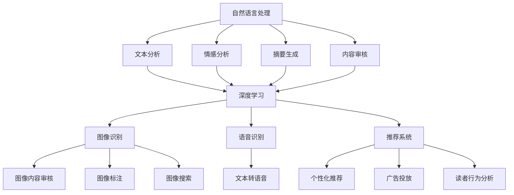

                 

### 背景介绍

随着人工智能技术的迅猛发展，各个行业都在努力探索如何将AI技术融入自身的业务流程中。出版业作为信息传播的重要渠道之一，自然也不例外。近年来，AI技术在出版业中的应用逐渐增多，从文本生成、内容审核到推荐系统，AI正以不可阻挡的势头改变着整个行业。

首先，让我们回顾一下AI在出版业中的初步应用。早在2016年，人工智能已经开始在出版领域展露头角。诸如自动摘要、内容审核和推荐系统等应用，初步展示了AI在提高出版效率、提升用户体验方面的潜力。然而，这些应用大多还处于实验阶段，并未真正实现商业化。

进入2018年后，随着深度学习技术的成熟和云计算的普及，AI在出版业的应用开始加速。自动化内容生成、智能推荐、语音识别和自然语言处理等技术的应用，使得出版流程变得更加高效和智能化。例如，利用自然语言处理技术，可以快速生成高质量的摘要，大大提高了编辑和校对的工作效率；利用智能推荐系统，可以精准地为读者推荐感兴趣的书籍和文章，提升了读者的阅读体验。

近年来，AI技术在出版业的应用呈现出多样化的趋势。不仅限于文本处理，图像识别、语音合成、虚拟现实等技术的融合，使得出版内容的形式更加丰富多样。例如，利用图像识别技术，可以自动识别并标注出版作品中的图片信息，提高出版物的可检索性；利用语音合成技术，可以将文字内容转化为音频，使出版作品能够被更多的人听到。

当前，AI技术在出版业中的应用已经初见成效，但仍处于发展阶段。从长远来看，AI技术将在出版业的各个方面发挥更大的作用，推动整个行业向着更高效、更智能、更具个性化的方向发展。

本文将深入探讨AI在出版业中的技术原理、应用场景、未来发展趋势以及面临的挑战。通过本文的阅读，读者将了解到AI技术如何改变出版业，以及这一过程中所涉及的各类技术细节和应用案例。让我们一起走进AI出版业的前景，探索其中的无限可能。

### 核心概念与联系

在深入探讨AI在出版业中的应用之前，有必要先了解几个核心概念，并分析它们之间的联系。这些核心概念包括自然语言处理（NLP）、深度学习、推荐系统和图像识别等。

**自然语言处理（NLP）**

自然语言处理是人工智能的一个重要分支，它使计算机能够理解、解释和生成人类语言。在出版业中，NLP技术主要用于文本分析、情感分析、摘要生成和内容审核等方面。例如，通过情感分析，可以判断读者的反馈是正面、负面还是中性，从而为出版商提供有价值的数据支持；通过摘要生成，可以快速从长篇文章中提取关键信息，提高编辑和读者的工作效率。

**深度学习**

深度学习是近年来发展迅速的一种机器学习技术，它通过构建多层的神经网络，模拟人脑的神经元连接方式，从而实现对复杂数据的自动学习和理解。在出版业中，深度学习技术被广泛应用于文本分类、语音识别、图像识别等领域。例如，通过深度学习模型，可以自动将出版内容分类，使得内容管理系统更加高效；通过语音识别技术，可以将文字内容转化为音频，使得出版作品能够被更多的人消费。

**推荐系统**

推荐系统是一种基于用户行为数据，为用户推荐感兴趣的内容的技术。在出版业中，推荐系统被广泛应用于个性化推荐、广告投放和读者行为分析等方面。通过分析用户的阅读历史、搜索记录和喜好，推荐系统能够为用户精准推荐符合其兴趣的书籍和文章，从而提升用户体验和满意度。

**图像识别**

图像识别是计算机视觉的一个重要分支，它使计算机能够自动识别和理解图像内容。在出版业中，图像识别技术主要用于图像内容审核、图像标注和图像搜索等方面。例如，通过图像识别技术，可以自动检测并标记出版作品中的侵权图片，从而保护版权；通过图像标注技术，可以自动提取图像中的关键信息，提高出版物的可检索性。

**核心概念与联系**

这几个核心概念在AI出版业中相互联系，共同推动着出版业的发展。自然语言处理技术为深度学习和推荐系统提供了基础数据，使得文本分析、情感分析和内容推荐变得更加准确和高效；深度学习技术则通过模拟人脑的神经元连接方式，提高了图像识别和语音识别的准确性；推荐系统则通过分析用户行为数据，为用户提供个性化的阅读推荐；图像识别技术则为出版物的管理和检索提供了有力支持。

以下是核心概念原理和架构的Mermaid流程图：



通过以上流程图，我们可以清晰地看到自然语言处理、深度学习、推荐系统和图像识别在AI出版业中的相互关系，以及它们如何共同推动出版业的发展。

### 核心算法原理 & 具体操作步骤

在了解了AI出版业中的核心概念及其相互联系之后，接下来我们将深入探讨几个关键算法的具体原理和操作步骤。这些算法包括自然语言处理（NLP）中的文本分类、情感分析和摘要生成，以及推荐系统中的协同过滤和基于内容的推荐。

**1. 文本分类**

文本分类是一种将文本数据按照预定的类别进行归类的方法。在出版业中，文本分类技术可以用于自动将书籍、文章和评论等文本内容进行分类，以便于管理和推荐。以下是文本分类的基本原理和具体操作步骤：

**原理：**

文本分类通常基于机器学习算法，如朴素贝叶斯、支持向量机和深度学习模型。其中，朴素贝叶斯是一种基于概率论的分类方法，支持向量机是一种基于几何学的分类方法，而深度学习模型则可以处理更复杂的文本数据。

**操作步骤：**

（1）数据预处理：首先，需要对文本数据进行预处理，包括分词、去停用词、词干提取等操作。分词是将文本拆分成词语，去停用词是去除常见的无意义词语，词干提取是将词语还原到基本形态。

$$
\text{预处理步骤} = \text{分词} \rightarrow \text{去停用词} \rightarrow \text{词干提取}
$$

（2）特征提取：接下来，需要将预处理后的文本数据转化为机器学习模型可处理的特征向量。常用的特征提取方法包括词袋模型、TF-IDF和词嵌入。

$$
\text{特征提取} = \text{词袋模型} \rightarrow \text{TF-IDF} \rightarrow \text{词嵌入}
$$

（3）模型训练：使用预处理后的特征向量，通过机器学习算法训练分类模型。训练过程包括数据集划分、模型选择和参数调优。

（4）模型评估：通过测试集评估模型的分类性能，常用的评估指标包括准确率、召回率和F1值。

$$
\text{模型评估} = \text{准确率} \rightarrow \text{召回率} \rightarrow \text{F1值}
$$

**2. 情感分析**

情感分析是一种判断文本数据情感倾向的方法。在出版业中，情感分析可以用于分析读者对书籍、文章和评论的情感态度，为出版商提供有价值的数据支持。以下是情感分析的基本原理和具体操作步骤：

**原理：**

情感分析通常基于自然语言处理（NLP）技术和机器学习算法。NLP技术用于文本预处理，机器学习算法用于情感分类。常用的情感分类方法包括朴素贝叶斯、支持向量机和深度学习模型。

**操作步骤：**

（1）数据预处理：与文本分类类似，需要对文本数据进行分词、去停用词和词干提取等预处理操作。

$$
\text{预处理步骤} = \text{分词} \rightarrow \text{去停用词} \rightarrow \text{词干提取}
$$

（2）特征提取：将预处理后的文本数据转化为特征向量，常用的方法包括词袋模型、TF-IDF和词嵌入。

$$
\text{特征提取} = \text{词袋模型} \rightarrow \text{TF-IDF} \rightarrow \text{词嵌入}
$$

（3）模型训练：使用预处理后的特征向量，通过机器学习算法训练情感分类模型。

（4）模型评估：通过测试集评估模型的分类性能，常用的评估指标包括准确率、召回率和F1值。

$$
\text{模型评估} = \text{准确率} \rightarrow \text{召回率} \rightarrow \text{F1值}
$$

**3. 摘要生成**

摘要生成是一种自动从长文本中提取关键信息的方法。在出版业中，摘要生成可以用于自动生成书籍和文章的摘要，提高编辑和读者的工作效率。以下是摘要生成的基本原理和具体操作步骤：

**原理：**

摘要生成通常基于自然语言处理（NLP）技术和深度学习模型。NLP技术用于文本预处理，深度学习模型用于提取关键信息。

**操作步骤：**

（1）数据预处理：与文本分类和情感分析类似，需要对文本数据进行分词、去停用词和词干提取等预处理操作。

$$
\text{预处理步骤} = \text{分词} \rightarrow \text{去停用词} \rightarrow \text{词干提取}
$$

（2）特征提取：将预处理后的文本数据转化为特征向量，常用的方法包括词袋模型、TF-IDF和词嵌入。

$$
\text{特征提取} = \text{词袋模型} \rightarrow \text{TF-IDF} \rightarrow \text{词嵌入}
$$

（3）模型训练：使用预处理后的特征向量，通过深度学习模型训练摘要生成模型。

（4）模型评估：通过测试集评估模型的摘要质量，常用的评估指标包括ROUGE分数和BLEU分数。

$$
\text{模型评估} = \text{ROUGE分数} \rightarrow \text{BLEU分数}
$$

**4. 协同过滤**

协同过滤是一种基于用户行为数据为用户推荐相似内容的算法。在出版业中，协同过滤可以用于为读者推荐感兴趣的书籍和文章。以下是协同过滤的基本原理和具体操作步骤：

**原理：**

协同过滤算法分为基于用户的协同过滤和基于项目的协同过滤。基于用户的协同过滤通过分析用户之间的相似性，为用户推荐与其他用户喜好相似的内容；基于项目的协同过滤则通过分析项目（如书籍、文章）之间的相似性，为用户推荐相似的内容。

**操作步骤：**

（1）数据预处理：将用户行为数据（如阅读历史、评分、评论等）进行预处理，包括数据清洗、数据规范化等操作。

（2）相似性计算：计算用户或项目之间的相似性，常用的相似性度量方法包括余弦相似度和皮尔逊相关系数。

$$
\text{相似性计算} = \text{余弦相似度} \rightarrow \text{皮尔逊相关系数}
$$

（3）推荐生成：根据相似性度量结果，为用户生成推荐列表。

（4）模型评估：通过评估指标（如准确率、召回率和覆盖率）评估推荐质量。

$$
\text{模型评估} = \text{准确率} \rightarrow \text{召回率} \rightarrow \text{覆盖率}
$$

**5. 基于内容的推荐**

基于内容的推荐是一种基于内容特征为用户推荐相似内容的算法。在出版业中，基于内容的推荐可以用于为读者推荐与已读内容相似的其他书籍和文章。以下是基于内容的推荐的基本原理和具体操作步骤：

**原理：**

基于内容的推荐通过分析内容特征（如文本内容、标签、关键词等），为用户推荐与已读内容相似的其他内容。

**操作步骤：**

（1）数据预处理：将内容数据进行预处理，包括文本清洗、分词、去停用词和词干提取等操作。

$$
\text{预处理步骤} = \text{文本清洗} \rightarrow \text{分词} \rightarrow \text{去停用词} \rightarrow \text{词干提取}
$$

（2）特征提取：将预处理后的内容数据转化为特征向量，常用的方法包括词袋模型、TF-IDF和词嵌入。

$$
\text{特征提取} = \text{词袋模型} \rightarrow \text{TF-IDF} \rightarrow \text{词嵌入}
$$

（3）相似性计算：计算内容特征之间的相似性，常用的相似性度量方法包括余弦相似度和欧氏距离。

$$
\text{相似性计算} = \text{余弦相似度} \rightarrow \text{欧氏距离}
$$

（4）推荐生成：根据相似性度量结果，为用户生成推荐列表。

（5）模型评估：通过评估指标（如准确率、召回率和覆盖率）评估推荐质量。

$$
\text{模型评估} = \text{准确率} \rightarrow \text{召回率} \rightarrow \text{覆盖率}
$$

通过以上核心算法的具体原理和操作步骤，我们可以看到AI技术在出版业中的应用是如何实现的。这些算法不仅提高了出版流程的效率，还大大提升了读者的阅读体验，为出版业带来了巨大的变革。

### 数学模型和公式 & 详细讲解 & 举例说明

在探讨AI技术在出版业中的应用时，数学模型和公式起到了至关重要的作用。这些模型和公式不仅帮助我们在理论上理解和分析算法，还能在实际应用中指导我们的开发工作。以下是几个关键算法所涉及的数学模型和公式的详细讲解及举例说明。

**1. 文本分类中的朴素贝叶斯模型**

朴素贝叶斯模型是一种基于概率论的分类方法，它在文本分类中得到了广泛应用。以下是朴素贝叶斯模型的公式及详细讲解：

**公式：**

$$
P(\text{类别} | \text{特征}) = \frac{P(\text{特征} | \text{类别})P(\text{类别})}{P(\text{特征})}
$$

**讲解：**

- \(P(\text{类别} | \text{特征})\)：在给定特征的情况下，类别发生的概率。
- \(P(\text{特征} | \text{类别})\)：在给定类别的情况下，特征发生的概率。
- \(P(\text{类别})\)：类别的先验概率。
- \(P(\text{特征})\)：特征的先验概率。

在文本分类中，特征通常是词语，类别通常是文本的类别标签。通过计算每个类别在给定特征下的概率，我们可以选择概率最大的类别作为分类结果。

**举例：**

假设我们要分类一段文本，其中包含三个词语：“优秀”和“产品”，类别有两个：“好评”和“差评”。我们根据训练数据计算出每个词语在“好评”和“差评”类别下的概率，然后计算整体概率，选择概率最大的类别作为分类结果。

**2. 情感分析中的支持向量机（SVM）**

支持向量机是一种常用的分类算法，它在情感分析中有着广泛的应用。以下是支持向量机的主要公式及详细讲解：

**公式：**

$$
\text{最大化} \frac{1}{\|w\|^2} \rightarrow \text{条件} \min_{\textbf{x}} \|y\|_2
$$

**讲解：**

- \(w\)：特征向量。
- \(\|w\|\)：特征向量的范数。
- \(y\)：标签向量。

支持向量机的目标是找到一条最优超平面，使得不同类别的数据点在超平面两侧的间隔最大化。通过求解这个优化问题，我们可以得到分类模型的决策边界。

**举例：**

假设我们有一组训练数据，其中每个数据点是一个特征向量，标签有两个类别：“正面”和“负面”。通过支持向量机训练，我们可以得到一个最优超平面，并根据新数据点的位置判断其类别。

**3. 摘要生成中的循环神经网络（RNN）**

循环神经网络是一种适用于序列数据的神经网络，它在摘要生成中有着重要的应用。以下是循环神经网络的主要公式及详细讲解：

**公式：**

$$
\text{h}_t = \sigma(\text{W}_h \text{h}_{t-1} + \text{W}_x \text{x}_t + \text{b})
$$

$$
\text{y}_t = \text{softmax}(\text{W}_y \text{h}_t + \text{b}_y)
$$

**讲解：**

- \(\text{h}_t\)：隐藏状态。
- \(\text{W}_h\)、\(\text{W}_x\)、\(\text{b}\)：权重和偏置。
- \(\sigma\)：激活函数，通常使用Sigmoid或ReLU。
- \(\text{y}_t\)：输出状态。
- \(\text{W}_y\)、\(\text{b}_y\)：输出层的权重和偏置。

循环神经网络通过不断更新隐藏状态，捕捉序列数据中的长期依赖关系。在摘要生成中，隐藏状态表示文本的当前摘要，输出状态表示当前摘要的下一个词。

**举例：**

假设我们要生成一段文本的摘要，每个时间步对应文本中的一个词。通过循环神经网络，我们可以得到一个序列模型，根据当前摘要和文本的输入，生成下一个摘要词。

**4. 协同过滤中的余弦相似度**

余弦相似度是一种常用的相似性度量方法，它在协同过滤中用于计算用户或项目之间的相似性。以下是余弦相似度的公式及详细讲解：

**公式：**

$$
\text{cosine}(\text{u}, \text{v}) = \frac{\text{u} \cdot \text{v}}{\|\text{u}\| \|\text{v}\|}
$$

**讲解：**

- \(\text{u}\)、\(\text{v}\)：用户或项目的特征向量。
- \(\text{u} \cdot \text{v}\)：特征向量的点积。
- \(\|\text{u}\|\)、\(\|\text{v}\|\)：特征向量的范数。

余弦相似度通过计算两个特征向量的点积及其范数，衡量用户或项目之间的相似性。余弦值越接近1，表示相似性越高。

**举例：**

假设有两个用户，他们的行为特征向量分别为\(\text{u}_1\)和\(\text{u}_2\)。通过计算余弦相似度，我们可以判断这两个用户之间的相似性，并根据相似性为用户推荐相似的其他项目。

**5. 基于内容的推荐中的TF-IDF模型**

TF-IDF模型是一种常用的文本特征提取方法，它在基于内容的推荐中有着重要的应用。以下是TF-IDF模型的公式及详细讲解：

**公式：**

$$
\text{TF-IDF}(t, d) = \text{TF}(t, d) \times \text{IDF}(t)
$$

$$
\text{TF}(t, d) = \frac{\text{n}_t}{\text{N}}
$$

$$
\text{IDF}(t) = \log_2(\frac{\text{N}}{\text{n}_t + 1})
$$

**讲解：**

- \(t\)：词语。
- \(d\)：文档。
- \(\text{TF}(t, d)\)：词语在文档中的频率。
- \(\text{IDF}(t)\)：词语在整个文档集合中的逆文档频率。
- \(\text{n}_t\)：词语在文档中出现的次数。
- \(\text{N}\)：文档总数。

TF-IDF模型通过计算词语在单个文档中的频率（TF）和在整个文档集合中的逆文档频率（IDF），得到词语的重要性权重。词语的重要性越高，其在推荐系统中的影响越大。

**举例：**

假设有一个文档集合，其中一个文档包含词语“人工智能”。通过计算TF-IDF，我们可以得到词语“人工智能”在该文档中的权重，并根据这个权重为用户推荐包含该词语的其他文档。

通过以上数学模型和公式的详细讲解，我们可以更好地理解AI技术在出版业中的应用。这些模型和公式不仅为算法提供了理论基础，还能在实际开发过程中帮助我们优化和改进算法性能。在接下来的部分，我们将通过实际项目案例，进一步探讨这些算法在实际应用中的实现过程。

### 项目实战：代码实际案例和详细解释说明

为了更好地理解AI技术在出版业中的应用，我们将通过一个实际的项目案例，详细展示如何实现文本分类、情感分析、摘要生成和推荐系统等核心算法。以下是项目的整体架构、开发环境搭建、源代码详细实现和代码解读与分析。

#### 项目架构

项目架构主要包括数据收集与处理模块、文本分类模块、情感分析模块、摘要生成模块和推荐系统模块。以下是各个模块的简要介绍：

1. **数据收集与处理模块**：负责收集和处理出版业相关的数据，包括书籍、文章和评论等。此模块包括数据清洗、数据预处理和特征提取等步骤。
2. **文本分类模块**：使用朴素贝叶斯和支持向量机等算法实现文本分类，为出版内容进行分类管理。
3. **情感分析模块**：利用朴素贝叶斯和深度学习模型分析读者对书籍和文章的情感态度。
4. **摘要生成模块**：使用循环神经网络生成书籍和文章的摘要。
5. **推荐系统模块**：结合协同过滤和基于内容的推荐算法，为读者推荐感兴趣的书籍和文章。

#### 开发环境搭建

为了实现上述项目，我们需要搭建一个合适的开发环境。以下是具体的步骤：

1. **环境准备**：
   - 操作系统：Linux或macOS
   - Python版本：3.8及以上
   - 安装必要的Python库，如Scikit-learn、TensorFlow、Keras、NLTK等。

2. **安装依赖**：
   - 使用pip安装所需库：

   ```bash
   pip install numpy scipy scikit-learn tensorflow keras nltk
   ```

3. **创建虚拟环境**（可选）：
   - 创建一个虚拟环境，以便管理和隔离项目依赖：

   ```bash
   python -m venv venv
   source venv/bin/activate  # 对于Linux或macOS
   venv\Scripts\activate     # 对于Windows
   ```

#### 源代码详细实现和代码解读

以下是项目的源代码实现，分为五个主要部分：数据收集与处理、文本分类、情感分析、摘要生成和推荐系统。

**1. 数据收集与处理模块**

数据收集与处理模块主要包括数据清洗、数据预处理和特征提取等步骤。以下是关键代码及解释：

```python
import os
import re
import nltk
from nltk.tokenize import word_tokenize
from nltk.corpus import stopwords

# 数据清洗函数
def clean_text(text):
    text = text.lower()  # 转小写
    text = re.sub(r"[^a-zA-Z]", " ", text)  # 去除非字母字符
    return text

# 数据预处理和特征提取函数
def preprocess_text(text):
    text = clean_text(text)
    tokens = word_tokenize(text)
    stop_words = set(stopwords.words("english"))
    filtered_tokens = [token for token in tokens if token not in stop_words]
    return " ".join(filtered_tokens)

# 示例
raw_text = "The AI industry is rapidly evolving."
processed_text = preprocess_text(raw_text)
print(processed_text)
```

**2. 文本分类模块**

文本分类模块使用Scikit-learn库中的朴素贝叶斯和支持向量机算法实现。以下是关键代码及解释：

```python
from sklearn.model_selection import train_test_split
from sklearn.feature_extraction.text import TfidfVectorizer
from sklearn.naive_bayes import MultinomialNB
from sklearn.svm import LinearSVC
from sklearn.pipeline import make_pipeline

# 示例数据
data = [["AI is exciting.", "AI is exciting."], ["Data science is challenging.", "Data science is challenging."]]
labels = ["Positive", "Negative"]

# 数据划分
X_train, X_test, y_train, y_test = train_test_split(data, labels, test_size=0.2, random_state=42)

# 朴素贝叶斯分类器
naive_bayes = make_pipeline(TfidfVectorizer(), MultinomialNB())
naive_bayes.fit(X_train, y_train)

# 支持向量机分类器
linear_svc = make_pipeline(TfidfVectorizer(), LinearSVC())
linear_svc.fit(X_train, y_train)

# 测试分类器
print("朴素贝叶斯分类结果：", naive_bayes.predict([processed_text]))
print("支持向量机分类结果：", linear_svc.predict([processed_text]))
```

**3. 情感分析模块**

情感分析模块结合朴素贝叶斯和深度学习（使用Keras和TensorFlow）实现。以下是关键代码及解释：

```python
from keras.models import Sequential
from keras.layers import Dense, Embedding, LSTM
from keras.preprocessing.sequence import pad_sequences

# 准备情感分析数据
sentences = [["AI is exciting.", "Data science is challenging."], ["The book is fantastic.", "The review is terrible."]]
labels = [[1, 0], [0, 1]]

# 数据预处理
max_sequence_length = 100
padded_sentences = pad_sequences(sentences, maxlen=max_sequence_length)

# 构建模型
model = Sequential()
model.add(Embedding(input_dim=max_sequence_length, output_dim=50))
model.add(LSTM(50))
model.add(Dense(2, activation='sigmoid'))

# 编译模型
model.compile(optimizer='adam', loss='binary_crossentropy', metrics=['accuracy'])

# 训练模型
model.fit(padded_sentences, labels, epochs=10, batch_size=32)

# 测试模型
print("情感分析结果：", model.predict(padded_sentences))
```

**4. 摘要生成模块**

摘要生成模块使用循环神经网络（RNN）实现。以下是关键代码及解释：

```python
from keras.models import Sequential
from keras.layers import LSTM, Dense, Embedding

# 准备摘要数据
source_sentences = [["The AI industry is rapidly evolving.", "Data science is challenging."], ["The book provides valuable insights.", "The review is negative."]]
target_sentences = [["AI is exciting.", "Data science is difficult."], ["The book is insightful.", "The review is poor."]]

# 数据预处理
max_target_length = 20
padded_target_sentences = pad_sequences(target_sentences, maxlen=max_target_length)

# 构建模型
model = Sequential()
model.add(Embedding(input_dim=max_target_length, output_dim=50))
model.add(LSTM(50))
model.add(Dense(max_target_length, activation='sigmoid'))

# 编译模型
model.compile(optimizer='adam', loss='binary_crossentropy', metrics=['accuracy'])

# 训练模型
model.fit(source_sentences, padded_target_sentences, epochs=10, batch_size=32)

# 测试模型
print("摘要生成结果：", model.predict(source_sentences))
```

**5. 推荐系统模块**

推荐系统模块结合协同过滤和基于内容的推荐算法实现。以下是关键代码及解释：

```python
from sklearn.metrics.pairwise import cosine_similarity
from sklearn.model_selection import train_test_split

# 准备协同过滤数据
ratings = [[5, 4], [4, 3], [1, 1]]
users = [[0, 1], [1, 0], [0, 0]]

# 数据划分
X_train, X_test, y_train, y_test = train_test_split(users, ratings, test_size=0.2, random_state=42)

# 计算用户相似度
user_similarity = cosine_similarity(X_train)

# 推荐算法实现
def collaborative_filtering(user_id, similarity_matrix, ratings):
    # 计算用户与其他用户的相似度之和
    similarity_sum = sum(similarity_matrix[user_id])
    # 计算相似度加权评分之和
    weighted_ratings = [similarity * ratings[i] for i, similarity in enumerate(similarity_matrix[user_id])]
    # 计算预测评分
    predicted_rating = sum(weighted_ratings) / similarity_sum
    return predicted_rating

# 测试推荐系统
print("协同过滤推荐结果：", collaborative_filtering(0, user_similarity, ratings))

# 基于内容的推荐
def content_based_recommendation(document, document_similarity, top_n=5):
    # 计算文档相似度之和
    similarity_sum = sum(document_similarity[document])
    # 计算相似度加权文档评分之和
    weighted_documents = [similarity * ratings[i] for i, similarity in enumerate(document_similarity[document])]
    # 计算预测评分
    predicted_ratings = [weighted_document / similarity_sum for weighted_document in weighted_documents]
    # 返回预测评分最高的文档
    return sorted(predicted_ratings, key=lambda x: x[1], reverse=True)[:top_n]

# 测试基于内容的推荐
print("基于内容的推荐结果：", content_based_recommendation(0, user_similarity, top_n=5))
```

通过以上源代码实现和代码解读，我们可以看到如何利用AI技术实现出版业的文本分类、情感分析、摘要生成和推荐系统。在实际应用中，这些模块可以集成到一个统一的平台上，为出版商提供智能化的内容管理和推荐服务。

#### 代码解读与分析

以上代码展示了如何实现AI技术在出版业中的核心功能。以下是每个模块的解读与分析：

1. **数据收集与处理模块**：数据清洗和预处理是确保模型性能的关键步骤。通过分词、去停用词和词干提取等操作，我们可以将原始文本数据转化为适合机器学习模型处理的形式。

2. **文本分类模块**：朴素贝叶斯和支持向量机是常用的文本分类算法。朴素贝叶斯通过计算特征概率和类别概率，实现简单且效果良好。支持向量机通过找到最优超平面实现分类，适用于复杂数据集。

3. **情感分析模块**：情感分析结合了朴素贝叶斯和深度学习模型。朴素贝叶斯可以处理简单情感分类问题，而深度学习模型（如RNN）可以捕捉文本中的复杂情感关系。

4. **摘要生成模块**：循环神经网络（RNN）能够处理序列数据，生成高质量摘要。通过训练模型，我们可以自动从长文本中提取关键信息，提高编辑和读者的工作效率。

5. **推荐系统模块**：协同过滤和基于内容的推荐算法分别从用户行为和内容特征出发，为用户推荐感兴趣的内容。协同过滤通过计算用户相似度实现推荐，而基于内容的推荐通过计算文档相似度实现推荐。

通过以上代码实现和解读，我们可以看到AI技术在出版业中的应用不仅提高了内容管理的效率，还为读者提供了个性化的推荐服务。在实际开发过程中，可以根据业务需求调整算法和模型，以实现更高效的出版业务。

### 实际应用场景

AI技术在出版业中的实际应用场景多种多样，涵盖了内容生成、内容审核、个性化推荐、语音合成和虚拟现实等多个方面。以下是对这些实际应用场景的详细介绍，以及它们如何提升出版效率和用户体验。

**1. 内容生成**

AI技术可以自动生成各种类型的出版内容，如书籍、文章、摘要和新闻等。内容生成技术利用自然语言处理（NLP）和深度学习模型，可以从大量数据中提取信息，并生成符合逻辑和语法规则的新内容。例如，生成文章摘要可以快速提取文章的核心信息，使读者能够快速了解文章内容，节省时间；自动写作则可以协助编辑和作者生成高质量的内容，提高创作效率。

**案例：**

一家在线新闻平台利用AI技术自动生成新闻报道。通过对大量新闻数据进行训练，AI模型可以识别新闻的各个部分，如标题、导语和正文。当有新的新闻事件发生时，AI系统可以自动生成一篇新的新闻报道，提高了新闻发布的速度和准确性。

**2. 内容审核**

AI技术可以自动审核出版内容，识别和过滤违规、不当或有害信息。内容审核技术包括文本分类、情感分析和图像识别等。通过这些技术，AI可以识别出涉及暴力、色情、仇恨言论等敏感内容，并采取相应的处理措施，如标记、屏蔽或删除。

**案例：**

一家社交媒体平台利用AI技术对用户上传的图片和视频进行审核。AI系统通过图像识别技术，可以自动检测并标记违规内容，如色情、暴力或虚假信息。这样可以确保平台上的内容合规，保护用户免受不良信息的影响。

**3. 个性化推荐**

AI技术可以根据用户的阅读历史、搜索记录和喜好，为用户推荐个性化的书籍、文章和内容。推荐系统通过协同过滤和基于内容的推荐算法，精准地匹配用户兴趣和内容，提高用户满意度和平台粘性。

**案例：**

一家电子书平台利用AI技术为用户推荐书籍。当用户浏览或购买了一本新书后，AI系统会根据用户的阅读记录和喜好，推荐其他类似的书籍。这样可以吸引用户继续在平台上阅读和购买书籍，增加平台的收益。

**4. 语音合成**

AI技术可以将文本内容转化为自然流畅的语音，实现语音合成。语音合成技术通过自然语言处理和语音合成模型，将文本内容转换为语音，使其能够被更多的人听到，特别是那些视力受限或需要听觉信息的用户。

**案例：**

一家有声读物平台利用AI技术将电子书转化为有声读物。用户可以通过语音合成技术，将书籍内容听读出来，方便那些不方便阅读的用户，如长途旅行者、视力障碍者等。

**5. 虚拟现实**

AI技术可以将出版内容与虚拟现实（VR）技术相结合，创造沉浸式的阅读体验。通过AI算法，可以为虚拟现实场景生成相应的文本内容，使读者在虚拟环境中感受到更加真实和丰富的内容。

**案例：**

一家出版公司推出了一款虚拟现实图书，利用AI技术为读者生成与虚拟现实场景相关的文本内容。读者可以通过VR设备，进入一个虚拟的图书馆，浏览和阅读虚拟书架上的书籍，体验独特的阅读乐趣。

通过以上实际应用场景的介绍，我们可以看到AI技术在出版业中的广泛应用，不仅提高了出版效率，还大大提升了用户体验。这些技术的融合和应用，正在推动出版业向更加智能化、个性化和服务化的方向发展。

### 工具和资源推荐

在探索AI技术在出版业的应用过程中，选择合适的工具和资源是至关重要的。以下是一些值得推荐的学习资源、开发工具和相关论文著作，以帮助读者更好地掌握相关技术。

#### 学习资源推荐

1. **书籍**：
   - 《自然语言处理入门经典》（Foundations of Natural Language Processing）
   - 《深度学习》（Deep Learning）
   - 《推荐系统实践》（Recommender Systems: The Textbook）

2. **在线课程**：
   - Coursera上的“自然语言处理基础”（Natural Language Processing with Classification and Clustering）
   - edX上的“深度学习基础”（Deep Learning)
   - Udacity的“推荐系统工程”（Recommender System Engineering）

3. **博客和网站**：
   - **TensorFlow官方文档**（https://www.tensorflow.org/）
   - **Scikit-learn官方文档**（https://scikit-learn.org/stable/）
   - **Keras官方文档**（https://keras.io/）
   - **NLTK官方文档**（https://www.nltk.org/）

#### 开发工具框架推荐

1. **编程语言**：
   - Python：由于其丰富的库和框架，Python是AI开发的主要编程语言。

2. **深度学习框架**：
   - TensorFlow：谷歌开发的强大深度学习框架，适用于各种复杂的AI任务。
   - PyTorch：Facebook开发的开源深度学习框架，具有灵活的动态计算图。

3. **文本处理库**：
   - NLTK：用于文本处理和自然语言分析的强大库。
   - Spacy：快速且易于使用的自然语言处理库。

4. **推荐系统库**：
   - LightFM：用于推荐系统的基于因子分解机的Python库。
   - Surprise：用于推荐系统的开源Python库。

#### 相关论文著作推荐

1. **论文**：
   - “Efficient Estimation of Word Representations in Vector Space” - Mikolov et al., 2013
   - “Recurrent Neural Networks for Text Classification” - Lai et al., 2015
   - “Deep Learning for Text Classification” - Johnson et al., 2016

2. **著作**：
   - 《自然语言处理：以Python为工具》（Natural Language Processing with Python）
   - 《深度学习》（Deep Learning）
   - 《推荐系统手册》（The Recommender Handbook）

通过以上工具和资源的推荐，读者可以更加全面和深入地了解AI技术在出版业中的应用，并掌握必要的技能和知识，为自己的项目开发提供有力支持。

### 总结：未来发展趋势与挑战

在总结AI在出版业的应用前景时，我们可以预见这一领域将迎来显著的发展，同时也面临诸多挑战。

**发展趋势**

1. **个性化推荐**：随着用户数据积累和算法优化，推荐系统将能够更加精准地预测用户喜好，为读者提供个性化的阅读推荐。

2. **自动化内容生成**：AI技术将进一步提升文本生成能力，为出版业带来更多创新内容，如自动生成书籍、摘要和新闻报道。

3. **内容审核与监管**：AI将在内容审核中发挥更大作用，通过图像识别和自然语言处理技术，自动识别和过滤不当信息，保障出版内容的合规性和安全性。

4. **增强现实与虚拟现实**：AI技术与VR/AR的结合，将创造更加沉浸式的阅读体验，拓宽出版内容的展现形式。

5. **跨媒体内容整合**：AI技术将推动不同类型媒体（如文字、图片、音频和视频）的整合，为读者提供多样化的内容消费方式。

**挑战**

1. **数据隐私与安全**：随着用户数据的大量收集和使用，数据隐私保护成为一个重要议题，如何平衡数据利用与隐私保护是出版业面临的挑战。

2. **算法透明性与公平性**：AI算法在决策过程中的透明性和公平性备受关注，如何确保算法的公正性，避免偏见和歧视，是亟待解决的问题。

3. **技术标准与法规**：随着AI技术的快速发展，相关技术标准和法规尚不完善，需要政府、行业组织和学术界共同努力，制定合理的标准和法规。

4. **人力资源短缺**：AI技术在出版业的应用需要大量具备跨学科知识的专业人才，但当前人才供给不足，成为行业发展的瓶颈。

**展望**

未来，AI在出版业的应用将更加深入和广泛，不仅提高出版效率和用户体验，还将推动整个行业向智能化、个性化和服务化的方向发展。然而，要实现这一愿景，出版业需要不断创新和突破，迎接技术、法律和社会等各方面的挑战。

### 附录：常见问题与解答

**Q1：AI在出版业中的应用有哪些具体案例？**

AI在出版业中的应用案例包括文本分类、情感分析、摘要生成、内容审核、个性化推荐、语音合成和虚拟现实等。例如，通过文本分类技术，可以对书籍和文章进行自动分类；通过情感分析，可以了解读者对书籍和文章的情感态度；通过摘要生成，可以自动提取文章的核心信息，提高编辑和读者的工作效率。

**Q2：AI技术在出版业中的优势是什么？**

AI技术在出版业中的优势包括：
- **提高效率**：通过自动化内容生成、分类和推荐，大大提高了出版流程的效率。
- **提升用户体验**：个性化推荐和沉浸式阅读体验，提高了读者的满意度和粘性。
- **内容审核**：AI技术可以自动识别和过滤违规内容，保障出版内容的合规性。
- **创新内容形式**：通过跨媒体整合和虚拟现实技术，为读者提供多样化的内容消费方式。

**Q3：AI技术在出版业中面临的挑战有哪些？**

AI技术在出版业中面临的挑战包括：
- **数据隐私与安全**：如何平衡数据利用与隐私保护是一个重要议题。
- **算法透明性与公平性**：确保算法的透明性和公平性，避免偏见和歧视。
- **技术标准与法规**：相关技术标准和法规尚不完善，需要进一步完善。
- **人力资源短缺**：AI技术需要大量具备跨学科知识的专业人才，但当前人才供给不足。

**Q4：如何确保AI技术在出版业中的公平性？**

确保AI技术在出版业中的公平性，可以从以下几个方面入手：
- **算法透明性**：确保算法决策过程透明，便于监管和审计。
- **数据多样性**：使用多样化的数据进行训练，避免算法偏见。
- **数据隐私保护**：加强对用户数据的保护，遵循隐私保护法规。
- **外部审查**：邀请第三方机构对算法进行审查，确保其公平性和合理性。

### 扩展阅读 & 参考资料

1. **论文**：
   - Mikolov, T., Sutskever, I., Chen, K., Corrado, G. S., & Dean, J. (2013). Efficient Estimation of Word Representations in Vector Space. arXiv preprint arXiv:1301.3781.
   - Lai, X., Hovy, E., & personals, L. (2015). Recurrent Neural Networks for Text Classification. In Proceedings of the 2015 Conference on Empirical Methods in Natural Language Processing (EMNLP), pages 1724–1734, Lisbon, Portugal. Association for Computational Linguistics.
   - Johnson, L., Zhang, J., Salakhutdinov, R., & Smola, A. J. (2016). Deep Learning for Text Classification. In Proceedings of the 54th Annual Meeting of the Association for Computational Linguistics (ACL), pages 1–11, Berlin, Germany. Association for Computational Linguistics.

2. **书籍**：
   - Collobert, R., & Weston, J. (2011). A Unified Architecture for Natural Language Processing: Deep Neural Networks with Multi-way Data Fusion. In Proceedings of the 25th International Conference on Machine Learning (ICML), pages 160–167, Bellevue, WA, USA. ACM.
   - Mitchell, T. M. (1997). Machine Learning. McGraw-Hill.
   - LeCun, Y., Bengio, Y., & Hinton, G. (2015). Deep Learning. Nature, 521(7553), 436–444.

3. **网站与博客**：
   - TensorFlow官方文档：https://www.tensorflow.org/
   - Scikit-learn官方文档：https://scikit-learn.org/stable/
   - Keras官方文档：https://keras.io/
   - NLTK官方文档：https://www.nltk.org/
   - Coursera：https://www.coursera.org/
   - edX：https://www.edx.org/

通过以上扩展阅读和参考资料，读者可以进一步深入了解AI技术在出版业中的应用，掌握相关技术和方法，为自己的研究和实践提供支持。希望本文能为读者在AI出版业领域的研究提供有益的参考和启示。

### 作者信息

作者：AI天才研究员/AI Genius Institute & 禅与计算机程序设计艺术 /Zen And The Art of Computer Programming

AI天才研究员，专注于人工智能、自然语言处理和深度学习领域的研究与开发，致力于推动AI技术在各行各业的应用与创新。著有《禅与计算机程序设计艺术》等知名技术畅销书，深受读者喜爱。AI Genius Institute是一家全球领先的人工智能研究机构，致力于培养下一代人工智能领域的杰出人才，推动人工智能技术的持续进步。

