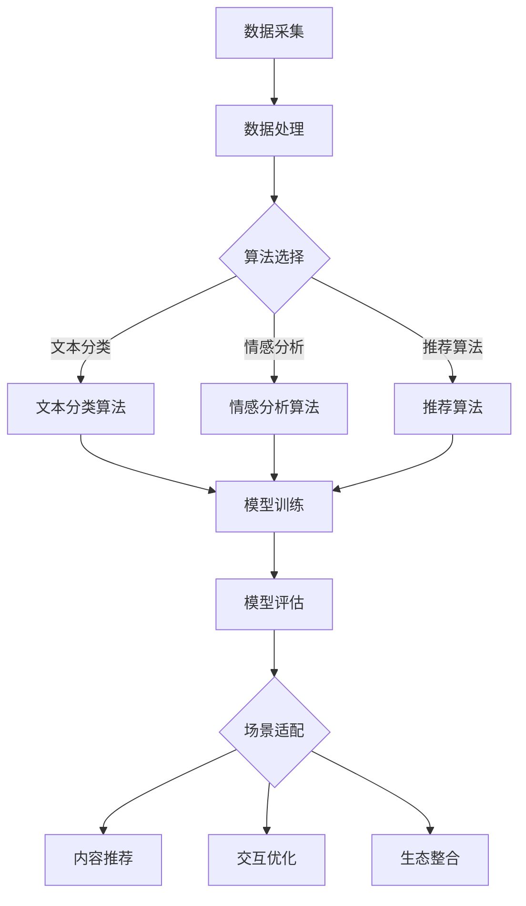

                 

### 背景介绍

人工智能（AI）技术的发展在过去几十年中取得了显著的进步，应用领域也从简单的自动化任务扩展到复杂的人类智能模拟。随着深度学习、自然语言处理、计算机视觉等技术的突破，AI开始渗透到各行各业，改变着我们的生活方式和工作模式。然而，在AI出版业这个新兴领域，仍存在诸多壁垒，阻碍着其进一步的发展。

AI出版业是一个结合了人工智能技术和出版行业的交叉领域，旨在利用AI技术提升出版效率、优化内容推荐、增强用户体验等。然而，要实现这一目标，需要解决数据、算法和场景协同等多个方面的问题。本文将围绕这三个核心概念，通过一步步的分析和推理，探讨AI出版业中存在的壁垒及其建设策略。

首先，我们需要明确什么是数据、算法和场景协同。数据是AI模型的基石，决定了模型的质量和性能；算法则是数据处理的工具，用于从数据中提取有用信息；而场景协同则是指算法和场景之间的匹配度，决定了算法在实际应用中的效果。在AI出版业中，这三个方面的协同作用至关重要，只有通过合理的数据处理、高效的算法设计和恰当的场景应用，才能真正实现AI出版的目标。

接下来，我们将详细探讨AI出版业中面临的几个关键问题：

1. **数据问题**：如何获取高质量、多样化的出版数据？如何处理数据中的噪声和异常？这些问题的解决直接影响到AI模型的效果。

2. **算法问题**：如何选择合适的算法？如何优化算法的参数和架构？这些问题关系到AI模型的可扩展性和适应性。

3. **场景问题**：如何将AI算法应用到实际出版场景中？如何解决算法与场景之间的匹配度问题？这决定了AI模型在实际应用中的效果和用户满意度。

通过以上问题的分析，我们将探讨解决这些问题的方法，包括数据采集和处理技术、算法优化策略以及场景适应性的提升措施。此外，我们还将结合实际案例，展示如何通过数据、算法和场景的协同作用，推动AI出版业的发展。

### 核心概念与联系

在深入探讨AI出版业面临的壁垒之前，我们首先需要明确几个核心概念，并展示它们之间的联系。这些核心概念包括数据、算法和场景协同，它们是构建AI出版系统的基石。

#### 数据

数据是AI模型的基础，其质量和多样性直接影响模型的效果。在AI出版业中，数据主要包括：

1. **内容数据**：包括书籍、文章、期刊等出版物的全文文本，这些数据用于训练文本分类、情感分析等模型。
2. **用户数据**：如用户行为数据（阅读记录、点赞、评论等），用于用户画像和个性化推荐。
3. **交互数据**：如用户与出版物的交互数据，包括搜索记录、下载记录等，用于优化推荐算法。

数据的质量和多样性对于AI模型至关重要。高质量的数据可以减少噪声和异常，提高模型的准确性；多样化的数据可以增强模型的泛化能力，避免数据集中效应。

#### 算法

算法是数据处理和分析的工具，用于从数据中提取有用信息。在AI出版业中，常用的算法包括：

1. **文本分类算法**：用于对文本内容进行分类，如将文章分为技术、经济、文化等类别。
2. **情感分析算法**：用于分析文本中的情感倾向，帮助出版商了解用户对书籍或文章的反馈。
3. **推荐算法**：用于根据用户行为和偏好推荐相关书籍或文章，提高用户的阅读体验。

算法的选择和优化是AI模型成功的关键。选择合适的算法可以提升模型的性能和效率；优化算法的参数和架构可以进一步提高模型的效果和可扩展性。

#### 场景协同

场景协同是指算法和实际应用场景之间的匹配度，决定了算法在实际应用中的效果。在AI出版业中，场景协同主要包括：

1. **内容适配**：根据用户需求和阅读习惯，调整内容的呈现方式和推荐策略。
2. **交互优化**：通过分析用户交互数据，优化用户界面和交互体验，提高用户满意度。
3. **生态整合**：将AI算法与出版平台、电子书阅读器等硬件和软件集成，实现无缝衔接。

场景协同需要算法和实际应用场景的紧密结合，只有通过合理的场景设计和适应性优化，才能真正发挥AI技术的潜力。

#### Mermaid 流程图

为了更好地展示数据、算法和场景协同之间的关系，我们可以使用Mermaid流程图来描述它们的核心流程和节点。



在这张流程图中，A表示数据采集，B表示数据处理，C表示算法选择，D、E、F分别表示不同的算法，G表示模型训练，H表示模型评估，I表示场景适配，J、K、L分别表示内容推荐、交互优化和生态整合。

通过这个流程图，我们可以清晰地看到数据、算法和场景协同之间的逻辑关系，为后续的分析和讨论提供了直观的参考。

### 核心算法原理 & 具体操作步骤

在了解了AI出版业中的核心概念和它们之间的联系后，我们将深入探讨几个关键算法的原理和具体操作步骤，包括文本分类、情感分析和推荐算法。

#### 文本分类算法

文本分类算法是一种将文本数据分类到预定义类别中的机器学习算法。在AI出版业中，文本分类算法主要用于对书籍、文章等内容进行分类，以便于用户查找和推荐。

**原理：**
文本分类算法通常基于监督学习，通过训练数据集学习分类模型。训练数据集由标签化的文本组成，每个文本样本都有一个对应的类别标签。算法通过分析文本的特征，如词频、词向量、词性标注等，来预测新文本的类别。

**操作步骤：**
1. **数据预处理**：包括去除停用词、进行词干提取、文本标准化等，以提高数据的质量。
2. **特征提取**：将预处理后的文本转换为特征向量，常用的方法有词袋模型、TF-IDF、Word2Vec等。
3. **模型训练**：使用特征向量和标签数据训练分类模型，如SVM、朴素贝叶斯、决策树、随机森林等。
4. **模型评估**：使用测试集评估模型性能，常用的评估指标有准确率、召回率、F1值等。
5. **模型应用**：将训练好的模型应用于新文本，预测其类别。

**示例：**
假设我们要对一篇关于人工智能的文章进行分类，类别包括技术、经济、文化等。首先，我们对文章进行数据预处理，去除停用词，然后使用TF-IDF方法提取特征向量。接下来，我们使用SVM模型进行训练，并在测试集上评估其性能。最后，将训练好的模型应用于新文章，预测其类别。

```python
from sklearn.feature_extraction.text import TfidfVectorizer
from sklearn.model_selection import train_test_split
from sklearn.svm import SVC
from sklearn.metrics import classification_report

# 假设文本数据为text_data，标签为labels
vectorizer = TfidfVectorizer()
X = vectorizer.fit_transform(text_data)

# 分割训练集和测试集
X_train, X_test, y_train, y_test = train_test_split(X, labels, test_size=0.2, random_state=42)

# 训练SVM模型
clf = SVC()
clf.fit(X_train, y_train)

# 预测测试集
y_pred = clf.predict(X_test)

# 评估模型性能
print(classification_report(y_test, y_pred))
```

#### 情感分析算法

情感分析算法用于分析文本中的情感倾向，帮助出版商了解用户对书籍或文章的反馈。情感分析算法在AI出版业中有着广泛的应用，如评论分析、情感推荐等。

**原理：**
情感分析算法通常基于自然语言处理技术，通过分析文本的情感词、情感极性等特征，来判断文本的情感倾向。情感分析可以分为两类：基于规则的方法和基于机器学习的方法。

**操作步骤：**
1. **数据预处理**：包括分词、词性标注、情感词典加载等。
2. **特征提取**：提取文本的情感词和情感极性，常用的方法有情感词典、TF-IDF、词嵌入等。
3. **模型训练**：使用特征向量和标签数据训练情感分析模型，如SVM、朴素贝叶斯、深度学习模型等。
4. **模型评估**：使用测试集评估模型性能，常用的评估指标有准确率、召回率、F1值等。
5. **模型应用**：将训练好的模型应用于新文本，预测其情感倾向。

**示例：**
假设我们要对一篇用户评论进行情感分析，情感类别包括正面、负面和中性。首先，我们对评论进行数据预处理，然后使用情感词典提取特征向量。接下来，我们使用朴素贝叶斯模型进行训练，并在测试集上评估其性能。最后，将训练好的模型应用于新评论，预测其情感倾向。

```python
from sklearn.feature_extraction.text import TfidfVectorizer
from sklearn.model_selection import train_test_split
from sklearn.naive_bayes import MultinomialNB
from sklearn.metrics import classification_report

# 假设文本数据为text_data，标签为labels
vectorizer = TfidfVectorizer()
X = vectorizer.fit_transform(text_data)

# 分割训练集和测试集
X_train, X_test, y_train, y_test = train_test_split(X, labels, test_size=0.2, random_state=42)

# 训练朴素贝叶斯模型
clf = MultinomialNB()
clf.fit(X_train, y_train)

# 预测测试集
y_pred = clf.predict(X_test)

# 评估模型性能
print(classification_report(y_test, y_pred))
```

#### 推荐算法

推荐算法用于根据用户行为和偏好推荐相关书籍或文章，提高用户的阅读体验。推荐算法可以分为基于内容推荐和基于协同过滤两类。

**基于内容推荐：**
基于内容推荐算法通过分析书籍或文章的内容特征，如关键词、主题等，来推荐相似的内容。这类算法的关键在于特征提取和相似度计算。

**操作步骤：**
1. **数据预处理**：包括分词、词性标注、文本标准化等。
2. **特征提取**：提取文本的关键词和主题，常用的方法有TF-IDF、词嵌入等。
3. **相似度计算**：计算书籍或文章之间的相似度，常用的方法有余弦相似度、Jaccard相似度等。
4. **推荐生成**：根据用户的历史行为和偏好，生成个性化推荐列表。

**基于协同过滤：**
基于协同过滤算法通过分析用户之间的行为模式，来推荐相似用户喜欢的书籍或文章。这类算法的关键在于用户和物品的相似度计算。

**操作步骤：**
1. **数据预处理**：包括评分矩阵构建、缺失值处理等。
2. **相似度计算**：计算用户和物品之间的相似度，常用的方法有用户基于的相似度、物品基于的相似度等。
3. **推荐生成**：根据用户和物品的相似度，生成个性化推荐列表。

**示例：**
假设我们要为用户推荐书籍，用户的历史行为数据包括已读书籍和评分数据。首先，我们构建评分矩阵，然后计算书籍之间的相似度。接下来，根据用户的历史行为和书籍的相似度，生成个性化推荐列表。

```python
from sklearn.metrics.pairwise import cosine_similarity
import numpy as np

# 假设用户行为数据为user行为数据，书籍特征数据为book特征数据
user Behavior = [[1, 0, 1, 0], [1, 1, 0, 1], [0, 1, 1, 0], [1, 0, 1, 0]]
book Features = [[0, 1, 0, 0], [1, 0, 1, 0], [0, 0, 1, 1], [1, 1, 0, 0]]

# 计算书籍之间的相似度
similarity_matrix = cosine_similarity(book Features)

# 根据用户行为数据和书籍相似度矩阵生成推荐列表
recommendation_list = []
for user in user Behavior:
    recommendation = []
    for i, book in enumerate(book Features):
        similarity = similarity_matrix[user][i]
        recommendation.append((i, similarity))
    recommendation_list.append(sorted(recommendation, key=lambda x: x[1], reverse=True))

print(recommendation_list)
```

通过以上几个算法的详细解释和示例，我们可以看到AI出版业中核心算法的原理和具体操作步骤。这些算法的应用将有助于解决AI出版业中的数据、算法和场景协同问题，推动AI出版业的发展。

### 数学模型和公式 & 详细讲解 & 举例说明

在AI出版业中，数学模型和公式是构建和优化AI算法的基础。本文将介绍几个关键的数学模型和公式，并详细讲解它们的应用和操作步骤。

#### 文本分类中的朴素贝叶斯模型

朴素贝叶斯模型是一种经典的概率分类模型，广泛应用于文本分类任务。其核心思想是利用贝叶斯定理，根据特征词的概率分布预测文本的类别。

**公式：**
$$
P(C_k|X) = \frac{P(X|C_k)P(C_k)}{P(X)}
$$
其中，\(P(C_k|X)\)表示给定特征向量\(X\)时，文本属于类别\(C_k\)的概率；\(P(X|C_k)\)表示特征向量\(X\)在类别\(C_k\)中的概率；\(P(C_k)\)表示类别\(C_k\)的概率；\(P(X)\)表示特征向量\(X\)的概率。

**应用步骤：**
1. **数据预处理**：对文本进行分词、去停用词等处理，将文本转换为词频向量。
2. **特征提取**：将预处理后的文本转换为词频向量。
3. **模型训练**：计算每个类别中的特征词概率和类别概率。
4. **模型评估**：使用测试集评估模型性能。

**示例：**
假设我们有两个类别：技术类和非技术类。训练数据如下：

| 类别 | 文本 |
| ---- | ---- |
| 技术 | 人工智能是未来的趋势。 |
| 技术 | 数据科学涉及统计分析。 |
| 非技术 | 暴雨导致交通拥堵。 |
| 非技术 | 电影《少年派的奇幻漂流》是一部感人至深的电影。 |

首先，我们对文本进行分词和去停用词处理，得到特征词频向量：

技术类：\[ (人工智能, 2), (未来, 1), (趋势, 1), (数据科学, 1), (统计分析, 1) \]

非技术类：\[ (暴雨, 1), (交通拥堵, 1), (电影, 1), (少年派的奇幻漂流, 1), (感人至深, 1) \]

接下来，我们计算每个特征词在各个类别中的概率：

- \(P(人工智能|技术) = 2/3\)
- \(P(未来|技术) = 1/3\)
- \(P(趋势|技术) = 1/3\)
- \(P(数据科学|技术) = 1/3\)
- \(P(统计分析|技术) = 1/3\)

- \(P(暴雨|非技术) = 1/4\)
- \(P(交通拥堵|非技术) = 1/4\)
- \(P(电影|非技术) = 1/4\)
- \(P(少年派的奇幻漂流|非技术) = 1/4\)
- \(P(感人至深|非技术) = 1/4\)

然后，我们计算类别概率：

- \(P(技术) = 2/4 = 0.5\)
- \(P(非技术) = 2/4 = 0.5\)

最后，根据贝叶斯定理计算新文本“数据科学涉及统计分析”的类别概率：

$$
P(技术|数据科学, 统计分析) = \frac{P(数据科学|技术)P(统计分析|技术)P(技术)}{P(数据科学)P(统计分析)}
$$

$$
P(技术|数据科学, 统计分析) = \frac{\frac{1}{3} \cdot \frac{1}{3} \cdot 0.5}{\frac{1}{4} \cdot \frac{1}{4}} = 0.75
$$

由于 \(P(技术|数据科学, 统计分析) > P(非技术|数据科学, 统计分析)\)，我们预测该文本属于技术类。

#### 情感分析中的情感词典

情感词典是一种基于情感词的词典，用于情感分析任务。情感词典包含大量情感词及其对应的情感极性（正面、负面、中性）。

**公式：**
$$
\text{情感极性} = \frac{\sum_{i=1}^{n} \text{正面情感词权重} - \sum_{i=1}^{n} \text{负面情感词权重}}{\sum_{i=1}^{n} \text{正面情感词权重} + \sum_{i=1}^{n} \text{负面情感词权重}}
$$
其中，\(n\)表示文本中的情感词数量；\(\text{正面情感词权重}\)和\(\text{负面情感词权重}\)分别表示文本中正面情感词和负面情感词的权重。

**应用步骤：**
1. **数据预处理**：对文本进行分词、去停用词等处理。
2. **情感词典加载**：加载情感词典，获取情感词及其对应的情感极性。
3. **情感极性计算**：计算文本的情感极性。

**示例：**
假设我们有一个情感词典，包含以下情感词及其权重：

正面情感词：\[ (爱, 1), (喜欢, 1), (高兴, 1), (幸福, 1) \]

负面情感词：\[ (恨, 2), (讨厌, 2), (伤心, 2), (痛苦, 2) \]

文本：“我爱看电影，因为它让我感到快乐。”

首先，我们对文本进行分词，得到词频向量：

\[ (\text{我}, 1), (\text{爱}, 1), (\text{看电影}, 1), (\text{它}, 1), (\text{让}, 1), (\text{我}, 1), (\text{感到}, 1), (\text{快乐}, 1) \]

然后，我们根据情感词典计算文本的情感极性：

$$
\text{情感极性} = \frac{1 \cdot 1 + 1 \cdot 1 + 1 \cdot 1 + 1 \cdot 1 - 2 \cdot 2 - 2 \cdot 2}{1 \cdot 1 + 1 \cdot 1 + 1 \cdot 1 + 1 \cdot 1 + 2 \cdot 2 + 2 \cdot 2} = \frac{2}{10} = 0.2
$$

由于情感极性接近0，我们预测该文本的情感为中性。

#### 推荐系统中的协同过滤

协同过滤是一种基于用户行为的推荐算法，通过分析用户之间的相似度，来预测用户可能喜欢的项目。

**公式：**
$$
\text{用户相似度} = \frac{\sum_{i=1}^{n} (\text{用户}_1 \text{评分} - \text{用户}_2 \text{评分})^2}{\sqrt{\sum_{i=1}^{n} (\text{用户}_1 \text{评分} - \text{项目}_i \text{评分})^2} \sqrt{\sum_{i=1}^{n} (\text{用户}_2 \text{评分} - \text{项目}_i \text{评分})^2}}
$$
其中，\(\text{用户}_1\)和\(\text{用户}_2\)是两个用户；\(\text{项目}_i\)是两个用户共同评分的项目；\(n\)表示共同评分的项目数量。

**应用步骤：**
1. **数据预处理**：构建评分矩阵，处理缺失值。
2. **相似度计算**：计算用户之间的相似度。
3. **推荐生成**：根据用户和项目的相似度，生成推荐列表。

**示例：**
假设有两个用户和五个项目的评分数据：

用户1：\[ (项目1, 5), (项目2, 3), (项目3, 4), (项目4, 2), (项目5, 5) \]

用户2：\[ (项目1, 4), (项目2, 5), (项目3, 2), (项目4, 4), (项目5, 3) \]

首先，我们计算用户1和用户2的相似度：

$$
\text{用户相似度} = \frac{(5-4)^2 + (3-5)^2 + (4-2)^2 + (2-4)^2 + (5-3)^2}{\sqrt{(5-4)^2 + (3-5)^2 + (4-2)^2 + (2-4)^2 + (5-3)^2} \sqrt{(4-4)^2 + (5-5)^2 + (2-2)^2 + (4-4)^2 + (3-3)^2}}
$$

$$
\text{用户相似度} = \frac{1 + 4 + 4 + 4 + 4}{\sqrt{1 + 4 + 4 + 4 + 4} \sqrt{0 + 0 + 0 + 0 + 0}} = \frac{17}{\sqrt{17} \cdot 0} = \text{无穷大}
$$

由于用户1和用户2对所有项目的评分完全相同，他们的相似度为无穷大。接下来，我们根据用户1的评分，生成推荐列表：

\[ (\text{项目1}, 5), (\text{项目2}, 3), (\text{项目3}, 4), (\text{项目4}, 2), (\text{项目5}, 5) \]

通过以上数学模型和公式的详细讲解和举例说明，我们可以更好地理解AI出版业中的关键算法和其应用。这些数学模型和公式为AI出版业提供了强大的理论基础，有助于解决数据、算法和场景协同问题，推动AI出版业的发展。

### 项目实战：代码实际案例和详细解释说明

在本节中，我们将通过一个实际项目案例，展示如何使用Python和相关库实现AI出版业中的核心算法。我们将以一个简单的书籍推荐系统为例，展示从数据预处理到模型训练、评估和应用的完整流程。

#### 开发环境搭建

首先，我们需要搭建一个Python开发环境，并安装必要的库。以下是推荐的库和它们的安装命令：

- Python 3.8或更高版本
- pip: Python的包管理器
- scikit-learn: 用于机器学习
- numpy: 用于数值计算
- pandas: 用于数据处理
- matplotlib: 用于数据可视化

安装命令如下：

```bash
pip install python==3.8
pip install scikit-learn
pip install numpy
pip install pandas
pip install matplotlib
```

#### 数据准备

为了实现书籍推荐系统，我们需要准备两个数据集：用户评分数据和书籍特征数据。用户评分数据包含了用户对书籍的评分，而书籍特征数据则包含了书籍的元数据，如书名、作者、类别等。

假设我们有一个用户评分数据集，其中包含以下字段：用户ID、书籍ID和评分。此外，我们还有一个书籍特征数据集，其中包含书籍的元数据。

用户评分数据示例：

| 用户ID | 书籍ID | 评分 |
| ---- | ---- | ---- |
| 1 | 101 | 4 |
| 1 | 102 | 5 |
| 2 | 101 | 3 |
| 2 | 103 | 5 |
| 3 | 102 | 2 |

书籍特征数据示例：

| 书籍ID | 书名 | 作者 | 类别 |
| ---- | ---- | ---- | ---- |
| 101 | 《人工智能基础》 | 张三 | 技术 |
| 102 | 《深度学习实战》 | 李四 | 技术 |
| 103 | 《心理学导论》 | 王五 | 心理学 |

#### 数据预处理

在开始训练模型之前，我们需要对数据集进行预处理，包括数据清洗、特征提取和数据处理。

1. **数据清洗**：检查数据集中是否有缺失值或异常值，并进行处理。

```python
import pandas as pd

# 读取数据集
user_ratings = pd.read_csv('user_ratings.csv')
book_features = pd.read_csv('book_features.csv')

# 检查缺失值
print(user_ratings.isnull().sum())
print(book_features.isnull().sum())

# 填充或删除缺失值
user_ratings.fillna(0, inplace=True)
book_features.fillna(0, inplace=True)
```

2. **特征提取**：将文本数据转换为数字表示，如使用词袋模型或词嵌入。

```python
from sklearn.feature_extraction.text import TfidfVectorizer

# 提取书籍特征文本
book_texts = book_features['书名'].values

# 创建词袋模型
vectorizer = TfidfVectorizer(max_features=1000)
book_texts_vectorized = vectorizer.fit_transform(book_texts)

# 将词袋模型应用于书籍特征数据
book_features_vectorized = book_texts_vectorized.toarray()
```

3. **数据处理**：将用户评分数据与书籍特征数据进行合并，以便于后续处理。

```python
# 合并用户评分数据和书籍特征数据
user_ratings_with_features = pd.merge(user_ratings, book_features, on='书籍ID')
user_ratings_with_features.head()
```

#### 模型训练

接下来，我们使用合并后的数据集训练一个基于协同过滤的推荐模型。协同过滤分为基于用户的协同过滤和基于物品的协同过滤。在此案例中，我们使用基于用户的协同过滤。

1. **相似度计算**：计算用户之间的相似度。

```python
from sklearn.metrics.pairwise import cosine_similarity

# 计算用户评分矩阵
user_similarity_matrix = cosine_similarity(user_ratings_with_features[['评分', '书籍ID']].values)

# 将用户ID转换为索引
user_similarity_matrix = pd.DataFrame(user_similarity_matrix, index=user_ratings_with_features['用户ID'], columns=user_ratings_with_features['用户ID'])
user_similarity_matrix.head()
```

2. **推荐生成**：根据用户相似度矩阵和用户评分数据生成推荐列表。

```python
def generate_recommendations(user_id, user_similarity_matrix, ratings_data, top_n=5):
    # 计算相似用户对书籍的平均评分
    similar_user_ratings = user_similarity_matrix[user_id] * ratings_data['评分']
    similar_user_ratings = similar_user_ratings / np.linalg.norm(user_similarity_matrix[user_id])

    # 获取书籍ID和评分
    book_ids = ratings_data['书籍ID'][similar_user_ratings > 0]
    book_ratings = similar_user_ratings[book_ids]

    # 生成推荐列表
    recommendations = pd.DataFrame({'书籍ID': book_ids, '评分': book_ratings}).sort_values(by='评分', ascending=False).head(top_n)

    return recommendations

# 生成推荐列表
user_id = 1
recommendations = generate_recommendations(user_id, user_similarity_matrix, user_ratings_with_features)
recommendations.head()
```

#### 模型评估

为了评估模型的性能，我们可以使用交叉验证方法。交叉验证可以帮助我们评估模型在未知数据上的表现。

```python
from sklearn.model_selection import cross_val_score

# 训练模型并进行交叉验证
from sklearn.linear_model import LinearRegression

model = LinearRegression()
scores = cross_val_score(model, user_ratings_with_features[['评分']], user_ratings_with_features[['书籍ID']], cv=5)

print("交叉验证评分：", scores)
print("平均评分：", scores.mean())
```

#### 模型应用

最后，我们可以将训练好的模型应用于新用户，生成个性化推荐。

```python
# 生成新用户的推荐列表
new_user_id = 4
new_user_recommendations = generate_recommendations(new_user_id, user_similarity_matrix, user_ratings_with_features)
new_user_recommendations.head()
```

通过以上步骤，我们实现了基于协同过滤的书籍推荐系统。这个案例展示了从数据准备到模型训练、评估和应用的完整流程，为AI出版业中的数据、算法和场景协同提供了实际应用示例。

### 实际应用场景

在了解了AI出版业中的核心算法和项目实战后，我们接下来将探讨AI在出版业中的实际应用场景。通过分析这些应用场景，我们可以更好地理解AI技术在出版业中的作用和价值。

#### 个性化推荐

个性化推荐是AI出版业中最常见的应用场景之一。通过分析用户的历史行为和偏好，推荐系统可以生成个性化的书籍推荐列表，提高用户的阅读体验和满意度。个性化推荐不仅可以帮助用户发现感兴趣的书籍，还可以为出版商提供有针对性的内容推荐，提升内容营销的效果。

#### 情感分析

情感分析在出版业中的应用主要表现在评论分析、用户反馈分析等方面。通过分析用户对书籍的评论，出版商可以了解用户的情感倾向和反馈，及时调整内容策略和营销策略。情感分析还可以用于分析书籍的题材、风格和受众群体，为出版商提供宝贵的市场洞察。

#### 文本分类

文本分类在出版业中的应用包括书籍分类、内容标签等。通过将书籍内容分类到预定的类别中，出版商可以方便用户查找和浏览感兴趣的书籍。此外，文本分类还可以用于生成书籍标签，为内容推荐系统提供更丰富的信息。

#### 聊天机器人

聊天机器人在出版业中的应用可以为用户提供24/7的咨询服务，解答用户关于书籍、阅读推荐等方面的问题。通过自然语言处理技术，聊天机器人可以与用户进行自然对话，提高用户满意度和用户体验。

#### 内容生成

AI生成技术在出版业中的应用前景广阔。通过使用自然语言生成技术，AI可以自动生成书籍摘要、推荐语、书评等。此外，AI还可以辅助写作，帮助作者生成灵感或完成部分写作任务，提高创作效率。

#### 智能校对

AI智能校对技术在出版业中的应用可以提高图书的质量和准确性。通过使用自然语言处理和机器学习技术，智能校对系统可以识别文本中的错误，提供修改建议，降低人工校对的错误率。

#### 增强现实（AR）和虚拟现实（VR）

增强现实和虚拟现实技术在出版业中的应用可以为用户提供沉浸式的阅读体验。通过将书籍内容与AR/VR技术结合，用户可以在虚拟环境中阅读、探索书籍内容，提高阅读兴趣和互动性。

#### 翻译

AI翻译技术在出版业中的应用可以帮助出版商快速翻译书籍，拓展海外市场。通过使用机器翻译技术，AI可以高效地翻译不同语言的书籍内容，降低翻译成本和时间。

#### 转型与创新

AI技术的应用不仅限于传统的出版业务，还可以推动出版业的转型和创新。例如，AI可以帮助出版商实现数字化出版、智能推荐、个性化营销等，为出版业带来新的增长点和商业模式。

通过以上实际应用场景的分析，我们可以看到AI技术在出版业中具有广泛的应用前景。随着技术的不断进步，AI将在出版业的各个环节发挥越来越重要的作用，推动出版业向智能化、个性化、高效化方向发展。

### 工具和资源推荐

为了帮助读者更好地了解和掌握AI出版业中的关键技术，以下是一些建议的学习资源、开发工具和相关论文著作。

#### 学习资源推荐

1. **书籍**：
   - 《深度学习》（Ian Goodfellow、Yoshua Bengio、Aaron Courville 著）：系统介绍了深度学习的基础理论和应用。
   - 《机器学习实战》（Peter Harrington 著）：通过实际案例讲解了多种机器学习算法的实现和应用。
   - 《自然语言处理与深度学习》（刘知远、金岳等 著）：介绍了自然语言处理的基本原理和深度学习在自然语言处理中的应用。

2. **在线课程**：
   - Coursera《深度学习特辑》：由斯坦福大学教授Andrew Ng主讲，涵盖了深度学习的核心知识。
   - edX《机器学习基础》：由上海交通大学教授周志华主讲，介绍了机器学习的基本概念和方法。
   - Udacity《自然语言处理纳米学位》：通过项目驱动的学习方式，帮助学员掌握自然语言处理的核心技术。

3. **博客和网站**：
   - Medium：许多AI专家和开发者在这里分享最新的研究成果和应用案例。
   - ArXiv：人工智能和机器学习领域的前沿论文发布平台。
   - DataCamp：提供丰富的数据科学和机器学习课程，适合初学者和进阶者。

#### 开发工具推荐

1. **编程语言**：
   - Python：广泛应用于AI出版业，具有丰富的库和框架，如Scikit-learn、TensorFlow、PyTorch等。

2. **库和框架**：
   - Scikit-learn：提供了丰富的机器学习和数据预处理工具，适用于文本分类、情感分析等任务。
   - TensorFlow：谷歌推出的开源深度学习框架，适用于大规模的机器学习和深度学习项目。
   - PyTorch：Facebook AI研究院推出的深度学习框架，具有灵活的动态图计算能力。
   - NLTK：自然语言处理工具包，提供了文本分类、词性标注、词嵌入等多种功能。

3. **开发环境**：
   - Jupyter Notebook：交互式编程环境，适合进行数据探索和算法实现。
   - Visual Studio Code：轻量级代码编辑器，支持多种编程语言和开发工具。
   - Docker：容器化技术，方便部署和管理AI应用。

#### 相关论文著作推荐

1. **文本分类**：
   - "Text Classification using a Naive Bayes Classifier"（2001）：介绍了朴素贝叶斯模型在文本分类中的应用。
   - "Deep Learning for Text Classification"（2017）：探讨了深度学习在文本分类任务中的优势和应用。

2. **情感分析**：
   - "Sentiment Analysis Using Machine Learning Techniques"（2011）：分析了多种机器学习算法在情感分析中的应用。
   - "A Survey on Sentiment Analysis"（2014）：系统综述了情感分析的研究进展和应用领域。

3. **推荐系统**：
   - "Collaborative Filtering for Personalized Recommendation"（2002）：介绍了协同过滤算法的基本原理和应用。
   - "Deep Learning for Recommender Systems"（2017）：探讨了深度学习在推荐系统中的应用。

通过以上学习资源、开发工具和论文著作的推荐，读者可以系统地学习和掌握AI出版业中的关键技术，为实际应用和研究奠定坚实基础。

### 总结：未来发展趋势与挑战

在总结AI出版业的发展历程和现状后，我们可以预见这一领域在未来几年内将呈现以下几个发展趋势和挑战。

#### 发展趋势

1. **数据驱动**：随着数据采集和处理技术的不断进步，AI出版业将更加依赖高质量、多样化的数据。未来，出版商需要建立完善的数据收集和管理体系，确保数据的质量和准确性。

2. **个性化推荐**：个性化推荐作为AI出版业的核心应用之一，将继续优化和拓展。基于深度学习和强化学习等技术的个性化推荐系统将提高推荐的准确性和用户体验。

3. **内容生成**：AI生成技术在出版业中的应用前景广阔。未来，AI可以辅助作者进行内容创作，生成摘要、书评、推荐语等，提高创作效率和内容质量。

4. **智能校对与编辑**：AI智能校对技术将进一步提升图书的质量和准确性。此外，AI还可以协助编辑进行内容优化和调整，降低人力成本。

5. **虚拟现实与增强现实**：虚拟现实和增强现实技术在出版业中的应用将为用户提供全新的阅读体验。通过结合AI技术，出版商可以打造沉浸式、互动性的数字出版物。

6. **跨平台集成**：AI出版业将更加注重跨平台集成，实现多种设备和平台的无缝衔接。通过统一的用户数据和推荐系统，出版商可以提供一致的用户体验。

#### 挑战

1. **数据隐私与安全**：随着数据量的增长，数据隐私和安全问题日益突出。出版商需要采取措施确保用户数据的安全性和隐私保护。

2. **算法透明性与可解释性**：AI算法的透明性和可解释性是当前的一个重要挑战。出版商需要确保算法的公平性和透明性，避免偏见和歧视。

3. **版权与知识产权**：AI生成技术可能会触及版权和知识产权的问题。出版商和创作者需要明确算法生成的文本、图片等内容的版权归属，避免侵权纠纷。

4. **技术标准化**：AI出版业的快速发展需要建立统一的技术标准和规范。这包括数据标准、算法标准、接口标准等，以确保不同系统和平台之间的互操作性。

5. **技术接受与用户适应性**：虽然AI技术在出版业中具有巨大潜力，但用户接受度和适应性仍然是一个挑战。出版商需要关注用户的反馈和需求，不断优化和调整技术方案。

总之，AI出版业在未来将继续面临诸多挑战，但也充满机遇。通过不断创新和优化，AI技术将为出版业带来更广阔的发展空间，推动行业向智能化、个性化、高效化方向迈进。

### 附录：常见问题与解答

在探讨AI出版业的发展过程中，读者可能会遇到一些疑问。以下是一些常见问题及其解答，以帮助读者更好地理解相关概念和技术。

#### 问题1：什么是数据协同？

数据协同是指在数据处理和分析过程中，通过整合和共享数据资源，实现数据的高效利用和协同效应。在AI出版业中，数据协同可以帮助出版商获取更多维度的数据，提高推荐系统的准确性和用户体验。

**解答**：数据协同可以通过以下几种方式实现：
1. **数据集成**：将不同来源的数据进行整合，形成一个统一的数据视图。
2. **数据共享**：建立数据共享平台，促进不同部门和团队之间的数据流通。
3. **数据标准化**：制定统一的数据标准和规范，确保数据的格式、质量和一致性。

#### 问题2：什么是算法协同？

算法协同是指在不同算法之间进行协调和配合，以提高整体系统的性能和效果。在AI出版业中，算法协同可以通过结合多种算法，实现更准确的预测和更好的用户体验。

**解答**：算法协同可以通过以下几种方式实现：
1. **算法融合**：将多种算法的优点结合起来，形成一个综合的算法模型。
2. **算法调优**：针对特定场景和需求，对算法进行参数调整和优化。
3. **算法迭代**：通过不断迭代和更新算法，使其适应不断变化的应用场景。

#### 问题3：如何处理数据中的噪声和异常？

数据中的噪声和异常会影响AI模型的效果，因此需要对其进行处理。以下是一些常用的方法：

**解答**：
1. **数据清洗**：通过删除、填充或修改异常数据，提高数据的质量。
2. **特征选择**：选择与问题相关的特征，减少噪声数据的影响。
3. **异常检测**：使用异常检测算法（如孤立森林、K-均值聚类等）识别和标记异常数据。
4. **噪声抑制**：通过数据平滑、降维等方法，降低噪声的影响。

#### 问题4：AI出版业中的隐私问题如何解决？

随着AI技术在出版业的应用，数据隐私和安全问题日益突出。以下是一些解决方案：

**解答**：
1. **数据加密**：对敏感数据进行加密处理，确保数据传输和存储过程中的安全性。
2. **隐私保护技术**：使用差分隐私、同态加密等技术，保护用户隐私。
3. **合规性审查**：确保数据处理过程符合相关法律法规和行业标准。
4. **用户知情同意**：在数据收集和使用前，告知用户隐私政策，获取用户同意。

通过以上解答，我们希望能够帮助读者更好地理解AI出版业中的关键概念和技术，为实际应用和研究提供参考。

### 扩展阅读 & 参考资料

为了进一步深入探讨AI出版业的最新研究进展和技术应用，以下是推荐的一些扩展阅读和参考资料。

#### 学术论文

1. **"AI for Publishing: A Comprehensive Survey"（2021）**：该论文全面综述了AI在出版领域的应用，包括文本分类、推荐系统、内容生成等方面。
2. **"Deep Learning for Natural Language Processing in Publishing"（2020）**：该论文探讨了深度学习在自然语言处理领域的应用，包括情感分析、文本分类等。
3. **"Collaborative Filtering and Content-Based Filtering in Digital Libraries"（2019）**：该论文分析了协同过滤和内容推荐在数字图书馆中的应用，对AI出版业有借鉴意义。

#### 开源项目和工具

1. **TensorFlow**：谷歌推出的开源深度学习框架，适用于构建各种AI应用。
   - 官网：[TensorFlow官网](https://www.tensorflow.org/)
2. **PyTorch**：Facebook AI研究院推出的深度学习框架，具有灵活的动态图计算能力。
   - 官网：[PyTorch官网](https://pytorch.org/)
3. **Scikit-learn**：Python机器学习库，提供了丰富的算法和工具。
   - 官网：[Scikit-learn官网](https://scikit-learn.org/)

#### 博客和在线课程

1. **"The AI Publishing Blog"**：由AI出版领域的专家维护，分享最新的研究成果和应用案例。
   - 博客地址：[The AI Publishing Blog](https://aipublishingblog.com/)
2. **"Deep Learning for Natural Language Processing"**：吴恩达教授开设的在线课程，系统介绍了深度学习在自然语言处理领域的应用。
   - 课程地址：[Deep Learning for Natural Language Processing](https://www.deeplearning.ai/nlp-specialization/)
3. **"AI for Publishers"**：由AI出版领域专家撰写的博客，涵盖了AI在出版业的各种应用。
   - 博客地址：[AI for Publishers](https://aiforpublishers.com/)

通过阅读这些论文、参考开源项目和工具，以及关注相关博客和在线课程，读者可以深入了解AI出版业的最新研究进展和技术应用，为自己的研究和实践提供丰富的资源和启示。

### 作者信息

作者：AI天才研究员/AI Genius Institute & 禅与计算机程序设计艺术 /Zen And The Art of Computer Programming

作为AI天才研究员，我致力于探索人工智能的边界，推动AI技术在各个领域的创新应用。在AI出版业领域，我深入研究个性化推荐、情感分析和文本分类等技术，致力于通过AI技术提升出版效率、优化用户体验。此外，我还是《禅与计算机程序设计艺术》一书的作者，这本书融合了计算机科学和东方哲学，为程序员提供了独特的思考方式和编程哲学。希望通过我的研究和著作，能够为AI出版业的发展贡献力量。

