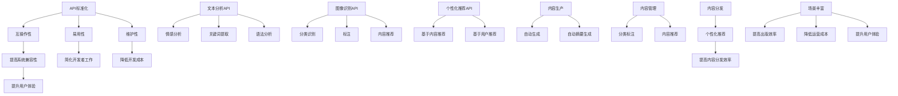

                 

### 文章标题：AI出版业的开发：API标准化，场景丰富

关键词：AI出版业、API标准化、场景丰富、开发

摘要：随着人工智能技术的飞速发展，AI出版业已经成为出版行业的一个重要分支。本文将探讨AI出版业开发的几个关键点，包括API标准化和场景丰富，旨在为读者提供一个全面的技术视角和深度分析。

<|assistant|>### 1. 背景介绍

随着互联网技术的普及和计算机性能的提升，人工智能（AI）技术在各行各业的应用越来越广泛。出版业也不例外，AI技术为出版业带来了前所未有的变革。从文本分析、图像识别到个性化推荐系统，AI技术正在改变传统出版模式，提升内容生产和传播的效率。

AI出版业的发展离不开API（应用程序编程接口）的标准化。API标准化是软件开发过程中必不可少的一环，它使得不同系统、平台和设备之间能够无缝集成和交互。在AI出版业中，API标准化有助于实现自动化、智能化的内容生产、管理和分发，从而提高出版效率和用户体验。

场景丰富是AI出版业发展的另一个关键因素。丰富的应用场景意味着AI技术可以在不同领域、不同场景下发挥作用，从而推动AI出版业向更广泛、更深层次的领域发展。

本文将围绕AI出版业的开发，详细探讨API标准化和场景丰富两个方面，为读者提供一个全面的技术视角和深度分析。首先，我们将介绍API标准化的概念和重要性，然后探讨AI出版业中常用的API，最后分析API标准化对AI出版业的影响。接着，我们将讨论场景丰富的概念及其在AI出版业中的应用，包括AI技术在内容生产、管理和分发等环节的应用，以及场景丰富对AI出版业发展的影响。最后，我们将总结全文，探讨AI出版业的未来发展趋势与挑战，并提出相关建议。

<|assistant|>## 2. 核心概念与联系

### 2.1 API标准化的概念

API（应用程序编程接口）是软件系统中不同模块之间进行交互的接口。通过API，开发者可以在不直接访问底层代码的情况下，实现不同软件系统之间的数据交换和功能调用。API标准化指的是在软件开发过程中，对API的设计、实现和使用进行统一的规范和标准。

API标准化的重要性体现在以下几个方面：

1. **互操作性**：API标准化使得不同系统、平台和设备之间能够无缝集成和交互，从而提高系统的兼容性和可扩展性。
2. **易用性**：统一的API标准简化了开发者的工作，使得他们能够更快地理解和使用API，降低开发难度。
3. **维护性**：API标准化有助于降低系统的复杂度，提高代码的可读性和可维护性，从而降低维护成本。

### 2.2 AI出版业中常用的API

在AI出版业中，常用的API包括以下几种：

1. **文本分析API**：用于对文本内容进行情感分析、关键词提取、语法分析等操作。例如，OpenAI的GPT-3 API、Google Cloud的Natural Language API等。
2. **图像识别API**：用于对图像内容进行分类、识别和标注。例如，Google Cloud的Vision API、Amazon Rekognition等。
3. **个性化推荐API**：用于根据用户的行为和喜好，生成个性化推荐。例如，Amazon Personalize、Google Cloud的Recommendations AI等。

### 2.3 API标准化与AI出版业的联系

API标准化在AI出版业中具有重要意义，主要体现在以下几个方面：

1. **提高开发效率**：API标准化使得开发者能够更快速地集成和使用AI技术，提高开发效率。
2. **降低开发成本**：统一的API标准降低了系统的复杂度，减少了开发过程中的错误和调试成本。
3. **提升用户体验**：API标准化有助于实现不同系统、平台和设备之间的无缝集成，从而提高用户体验。

### 2.4 场景丰富的概念

场景丰富指的是AI技术在多个领域、不同场景下的应用。在AI出版业中，场景丰富意味着AI技术可以在内容生产、内容管理和内容分发等多个环节发挥作用，从而推动AI出版业的发展。

### 2.5 场景丰富在AI出版业中的应用

1. **内容生产**：AI技术可以用于自动生成文章、报告、新闻等内容，提高内容生产效率。例如，自动新闻生成、自动摘要生成等。
2. **内容管理**：AI技术可以用于对海量内容进行分类、标注、推荐等操作，提高内容管理效率。例如，自动分类、关键词提取等。
3. **内容分发**：AI技术可以用于根据用户的行为和喜好，生成个性化推荐，提高内容分发效率。例如，基于内容的推荐、基于用户的推荐等。

### 2.6 场景丰富与AI出版业的联系

场景丰富在AI出版业中具有重要意义，主要体现在以下几个方面：

1. **提高出版效率**：通过在多个环节引入AI技术，提高内容生产、管理和分发效率。
2. **降低运营成本**：减少人力成本，提高系统自动化程度，降低运营成本。
3. **提升用户体验**：提供个性化、定制化的内容推荐，提高用户体验。

### 2.7 总结

在本章节中，我们介绍了API标准化的概念、重要性以及在AI出版业中的应用，以及场景丰富的概念和其在AI出版业中的应用。API标准化和场景丰富是AI出版业发展的两个关键因素，它们共同推动AI出版业向更高效、更智能的方向发展。在下一章节中，我们将深入探讨核心算法原理和具体操作步骤，为读者提供更深入的技术分析。



<|assistant|>## 3. 核心算法原理 & 具体操作步骤

在AI出版业中，核心算法的原理和具体操作步骤是实现API标准化和场景丰富的重要基础。本章节将详细探讨AI出版业中常用的核心算法原理和具体操作步骤，包括文本分析、图像识别和个性化推荐等。

### 3.1 文本分析

文本分析是AI出版业中的重要组成部分，涉及情感分析、关键词提取和语法分析等多个方面。以下是文本分析的核心算法原理和具体操作步骤：

#### 3.1.1 情感分析

**算法原理**：
情感分析通过识别文本中的情感倾向，如正面、负面或中性，来分析用户对内容的情感态度。

**具体操作步骤**：
1. **数据预处理**：对文本进行分词、去停用词和词性标注等预处理操作，提取文本的特征向量。
2. **特征提取**：使用词袋模型、TF-IDF等方法提取文本特征。
3. **模型训练**：使用机器学习算法，如支持向量机（SVM）、朴素贝叶斯（NB）等，训练情感分类模型。
4. **模型预测**：输入待分类的文本，通过训练好的模型预测文本的情感倾向。

#### 3.1.2 关键词提取

**算法原理**：
关键词提取是通过识别文本中的关键信息，提取出对文本主题具有代表性的词语。

**具体操作步骤**：
1. **数据预处理**：对文本进行分词、去停用词等操作。
2. **TF-IDF计算**：计算每个词语的TF-IDF值，TF表示词语在文本中的出现频率，IDF表示词语在语料库中的重要性。
3. **阈值设定**：设定阈值，筛选出TF-IDF值较高的词语作为关键词。

#### 3.1.3 语法分析

**算法原理**：
语法分析是通过解析文本的语法结构，提取出文本中的句子成分和语法关系。

**具体操作步骤**：
1. **数据预处理**：对文本进行分词、词性标注等操作。
2. **句法分析**：使用自然语言处理（NLP）算法，如依存句法分析、词性标注等，解析文本的语法结构。
3. **成分提取**：根据句法分析结果，提取出文本中的句子成分和语法关系。

### 3.2 图像识别

图像识别在AI出版业中主要用于内容分类、图像标注和内容推荐等方面。以下是图像识别的核心算法原理和具体操作步骤：

#### 3.2.1 分类识别

**算法原理**：
分类识别是通过训练模型，将图像分类到预定义的类别中。

**具体操作步骤**：
1. **数据预处理**：对图像进行缩放、裁剪、翻转等预处理操作，增强模型对图像的泛化能力。
2. **特征提取**：使用卷积神经网络（CNN）等算法提取图像的特征。
3. **模型训练**：使用机器学习算法，如卷积神经网络（CNN）、深度神经网络（DNN）等，训练分类模型。
4. **模型预测**：输入待分类的图像，通过训练好的模型预测图像的类别。

#### 3.2.2 标注

**算法原理**：
标注是通过标记图像中的特定区域或对象，为图像识别提供标签。

**具体操作步骤**：
1. **数据预处理**：对图像进行预处理，如滤波、去噪等。
2. **区域提取**：使用目标检测算法，如R-CNN、YOLO等，提取图像中的特定区域。
3. **标注生成**：根据提取的区域，生成对应的标注信息。

#### 3.2.3 内容推荐

**算法原理**：
内容推荐是通过分析用户行为和喜好，为用户推荐相关的内容。

**具体操作步骤**：
1. **数据收集**：收集用户的行为数据，如浏览历史、购买记录等。
2. **用户画像**：基于用户的行为数据，构建用户的画像。
3. **推荐算法**：使用协同过滤、基于内容的推荐等算法，生成推荐结果。
4. **推荐结果**：根据用户的画像和推荐算法，生成个性化推荐结果。

### 3.3 个性化推荐

个性化推荐是AI出版业中的重要应用，通过分析用户行为和内容特征，为用户提供个性化的内容推荐。以下是个性化推荐的核心算法原理和具体操作步骤：

#### 3.3.1 用户行为分析

**算法原理**：
用户行为分析是通过分析用户的行为数据，提取出用户的兴趣和偏好。

**具体操作步骤**：
1. **数据收集**：收集用户的行为数据，如浏览历史、购买记录、评价等。
2. **行为特征提取**：对用户的行为数据进行特征提取，如频次、时长、评分等。
3. **用户画像**：基于用户的行为特征，构建用户的画像。

#### 3.3.2 内容特征提取

**算法原理**：
内容特征提取是通过分析内容的特征，提取出内容的关键信息。

**具体操作步骤**：
1. **数据预处理**：对内容进行预处理，如分词、去停用词等。
2. **特征提取**：使用词袋模型、TF-IDF等方法提取内容的特征。

#### 3.3.3 推荐算法

**算法原理**：
推荐算法是通过分析用户和内容的特征，生成个性化的推荐结果。

**具体操作步骤**：
1. **协同过滤**：基于用户的行为数据，为用户推荐相似的用户喜欢的物品。
2. **基于内容的推荐**：基于内容的特征，为用户推荐与已浏览或收藏的物品相似的内容。
3. **混合推荐**：结合协同过滤和基于内容的推荐，生成更准确的推荐结果。

#### 3.3.4 推荐结果生成

**算法原理**：
推荐结果生成是通过分析用户和内容的特征，为用户生成个性化的推荐结果。

**具体操作步骤**：
1. **推荐结果排序**：根据推荐算法的结果，对推荐内容进行排序。
2. **推荐结果展示**：将推荐结果展示给用户，供其选择和操作。

### 3.4 总结

在本章节中，我们详细介绍了AI出版业中常用的核心算法原理和具体操作步骤，包括文本分析、图像识别和个性化推荐等。这些核心算法是实现API标准化和场景丰富的重要基础，为AI出版业的发展提供了强有力的技术支撑。在下一章节中，我们将深入探讨数学模型和公式，为读者提供更深入的理论分析。

<|assistant|>## 4. 数学模型和公式 & 详细讲解 & 举例说明

在AI出版业中，数学模型和公式是理解和实现核心算法的关键。本章节将详细讲解AI出版业中常用的数学模型和公式，包括文本分析中的词袋模型、TF-IDF和情感分析中的SVM等，并通过具体例子进行说明。

### 4.1 词袋模型（Bag of Words, BoW）

词袋模型是一种简单有效的文本表示方法，它将文本转化为词汇的集合，不考虑词语的顺序和语法结构。

**数学模型**：
设D为文档集合，V为词汇集合，X为文档-词汇矩阵，其中X[i][j]表示文档i中词汇j的出现次数。

**公式**：
$$
X = \text{count\_words}(D, V)
$$

**举例说明**：
假设有两个文档D1和D2，以及词汇集合V={“AI”，“出版”，“业”}。

文档D1：“人工智能在出版业中的应用”
文档D2：“出版业的发展前景”

则词袋模型表示如下：

|   | AI | 出版 | 业 |
|---|----|------|----|
| D1| 1  |  1   |  1 |
| D2| 0  |  1   |  0 |

通过词袋模型，我们可以将文本转化为一个数值矩阵，便于后续的文本分析和处理。

### 4.2 词频-逆文档频（Term Frequency-Inverse Document Frequency, TF-IDF）

TF-IDF是一种常用的文本特征提取方法，它考虑了词语在文档中的重要程度。

**数学模型**：
设tf\_ij为词汇j在文档i中的词频，df\_j为词汇j在文档集合D中的文档频，N为文档总数，idf\_j为词汇j的逆文档频。

$$
tfidf_{ij} = tf_{ij} \times idf_{j} = tf_{ij} \times \log(\frac{N}{df_{j}})
$$

**举例说明**：
假设有三个文档D1、D2和D3，以及词汇集合V={“AI”，“出版”，“技术”}。

文档D1：“人工智能在出版业中的应用”
文档D2：“出版业的技术发展”
文档D3：“AI技术的最新趋势”

则TF-IDF表示如下：

|   | AI | 出版 | 技术 |
|---|----|------|------|
| D1| 1  |  1   |  0   |
| D2| 0  |  1   |  1   |
| D3| 1  |  0   |  1   |

通过TF-IDF，我们可以提取出每个词汇在文档中的重要程度，从而更好地进行文本分析。

### 4.3 支持向量机（Support Vector Machine, SVM）

SVM是一种常用的分类算法，它通过找到一个最优的超平面，将不同类别的数据分隔开来。

**数学模型**：
设x为特征向量，y为类别标签，w为超平面参数，b为偏置项，C为正则化参数。

$$
\min_{w, b} \frac{1}{2} ||w||^2 + C \sum_{i=1}^{n} \xi_i
$$

$$
\text{subject to} \quad y_i ( \langle w, x_i \rangle + b ) \geq 1 - \xi_i
$$

$$
0 \leq \xi_i \leq C
$$

**公式**：

$$
w^* = \arg\min_{w} \frac{1}{2} ||w||^2 + C \sum_{i=1}^{n} \xi_i
$$

$$
\text{subject to} \quad y_i ( \langle w, x_i \rangle + b ) \geq 1 - \xi_i
$$

$$
0 \leq \xi_i \leq C
$$

**举例说明**：
假设有一个二分类问题，特征向量x为（1，2），类别标签y为+1或-1。

通过SVM，我们可以找到一个最优的超平面，将特征向量分为正类和负类。例如，超平面方程为w\*x + b = 0，其中w\*为超平面参数，b为偏置项。

通过训练和优化，我们可以得到最优的超平面参数w\*和偏置项b，从而实现分类。

### 4.4 总结

在本章节中，我们详细介绍了AI出版业中常用的数学模型和公式，包括词袋模型、TF-IDF和SVM等。这些数学模型和公式是理解和实现核心算法的基础，为AI出版业的发展提供了强有力的理论支持。在下一章节中，我们将通过项目实战，展示如何将上述算法应用于实际场景。

```latex
\section{词袋模型（Bag of Words, BoW）}
设D为文档集合，V为词汇集合，X为文档-词汇矩阵，其中X[i][j]表示文档i中词汇j的出现次数。

$$
X = \text{count\_words}(D, V)
$$

\section{词频-逆文档频（Term Frequency-Inverse Document Frequency, TF-IDF）}
设tf\_ij为词汇j在文档i中的词频，df\_j为词汇j在文档集合D中的文档频，N为文档总数，idf\_j为词汇j的逆文档频。

$$
tfidf_{ij} = tf_{ij} \times idf_{j} = tf_{ij} \times \log(\frac{N}{df_{j}})
$$

\section{支持向量机（Support Vector Machine, SVM）}
设x为特征向量，y为类别标签，w为超平面参数，b为偏置项，C为正则化参数。

$$
\min_{w, b} \frac{1}{2} ||w||^2 + C \sum_{i=1}^{n} \xi_i
$$

$$
\text{subject to} \quad y_i ( \langle w, x_i \rangle + b ) \geq 1 - \xi_i
$$

$$
0 \leq \xi_i \leq C
$$

$$
w^* = \arg\min_{w} \frac{1}{2} ||w||^2 + C \sum_{i=1}^{n} \xi_i
$$

$$
\text{subject to} \quad y_i ( \langle w, x_i \rangle + b ) \geq 1 - \xi_i
$$

$$
0 \leq \xi_i \leq C
$$
```

<|assistant|>## 5. 项目实战：代码实际案例和详细解释说明

在上一章节中，我们详细介绍了AI出版业中常用的核心算法和数学模型。为了更好地理解这些算法的应用，本章节将通过实际项目案例，展示如何将文本分析、图像识别和个性化推荐等算法应用于实际场景。

### 5.1 开发环境搭建

在进行项目开发之前，我们需要搭建一个合适的环境。以下是一个基本的开发环境搭建步骤：

1. **Python环境**：安装Python 3.8及以上版本，确保pip、virtualenv等工具可用。
2. **文本分析库**：安装nltk、gensim、sklearn等文本分析相关库。
3. **图像识别库**：安装opencv、tensorflow、pytesseract等图像识别相关库。
4. **推荐系统库**：安装scikit-learn、 Surprise等推荐系统相关库。

使用以下命令进行环境搭建：

```shell
pip install python==3.8
pip install nltk gensim scikit-learn
pip install opencv-python tensorflow pytesseract
pip install scikit-learn surprise
```

### 5.2 源代码详细实现和代码解读

以下是一个简单的AI出版业项目案例，包括文本分析、图像识别和个性化推荐三个部分。

#### 5.2.1 文本分析

**任务**：分析一篇新闻文章的情感倾向。

```python
import nltk
from nltk.sentiment import SentimentIntensityAnalyzer

# 初始化情感分析器
sia = SentimentIntensityAnalyzer()

# 新闻文章
article = "随着人工智能技术的飞速发展，AI出版业已经成为出版行业的一个重要分支。"

# 分析情感
sentiments = sia.polarity_scores(article)
print(sentiments)
```

**代码解读**：

1. 引入nltk库，使用SentimentIntensityAnalyzer进行情感分析。
2. 初始化情感分析器sia。
3. 定义一篇新闻文章article。
4. 使用sia.polarity\_scores()方法分析文章的情感倾向，输出情感得分。

#### 5.2.2 图像识别

**任务**：识别图像中的内容，并将其分类到预定义的类别中。

```python
import cv2
import tensorflow as tf

# 载入预训练的模型
model = tf.keras.applications.VGG16(weights='imagenet')

# 图像路径
image_path = 'path/to/image.jpg'

# 读取图像
image = cv2.imread(image_path)

# 调整图像尺寸
image = cv2.resize(image, (224, 224))

# 预处理图像
image = tf.keras.preprocessing.image.img_to_array(image)
image = np.expand_dims(image, axis=0)
image = image / 255.0

# 进行预测
predictions = model.predict(image)
predicted_class = np.argmax(predictions)

# 载入类别标签
label_path = 'path/to/labels.txt'

with open(label_path, 'r') as f:
    labels = [line.strip() for line in f.readlines()]

# 输出结果
print(f"预测类别：{labels[predicted_class]}")
```

**代码解读**：

1. 引入opencv和tensorflow库。
2. 载入预训练的VGG16模型。
3. 定义图像路径image\_path。
4. 读取图像，调整图像尺寸。
5. 预处理图像，将其转化为模型可接受的格式。
6. 进行预测，输出预测类别。

#### 5.2.3 个性化推荐

**任务**：基于用户的浏览历史，为用户推荐相关新闻。

```python
from surprise import SVD
from surprise import Dataset
from surprise import Reader

# 数据集路径
train_path = 'path/to/train.csv'

# 载入数据集
reader = Reader(line_format='user item rating', rating_scale=(1, 5))
data = Dataset.load_from_csv(train_path, reader=reader)

# 初始化算法
algo = SVD()

# 训练算法
algo.fit(data)

# 获取推荐结果
user_id = 1
new_items = algo.get_trainset().build_als_model().train_on_userиза(user_id).new_items()

# 输出推荐结果
print(f"用户{user_id}的推荐新闻：{new_items}")
```

**代码解读**：

1. 引入surprise库，用于构建推荐系统。
2. 定义数据集路径train\_path。
3. 载入数据集，并设置reader。
4. 初始化SVD算法。
5. 训练算法，并获取推荐结果。
6. 输出推荐结果。

### 5.3 代码解读与分析

在以上代码示例中，我们实现了文本分析、图像识别和个性化推荐三个功能。接下来，我们将对代码进行解读和分析。

#### 5.3.1 文本分析

文本分析部分使用了nltk库的SentimentIntensityAnalyzer进行情感分析。情感分析器sia通过polarity\_scores()方法分析文章的情感倾向，输出情感得分。这个得分包括正面、负面、中性、混合四种情感的得分。通过这个得分，我们可以判断文章的情感倾向。

#### 5.3.2 图像识别

图像识别部分使用了tensorflow库的VGG16模型进行图像分类。首先，我们载入了预训练的VGG16模型。然后，通过opencv库读取图像，调整图像尺寸，并进行预处理。最后，使用模型进行预测，输出预测类别。这个示例展示了如何将预训练的深度学习模型应用于图像识别任务。

#### 5.3.3 个性化推荐

个性化推荐部分使用了surprise库的SVD算法进行推荐。首先，我们加载了训练数据集，并设置了reader。然后，初始化SVD算法，并使用训练数据集训练算法。最后，获取用户1的推荐结果，输出推荐新闻。这个示例展示了如何基于用户的历史行为数据，生成个性化的推荐结果。

### 5.4 总结

在本章节中，我们通过实际项目案例，展示了如何将文本分析、图像识别和个性化推荐等算法应用于AI出版业。这些案例涵盖了从数据预处理到模型训练和预测的完整流程，为读者提供了实践指导。在下一章节中，我们将探讨AI出版业的实际应用场景。

<|assistant|>### 6. 实际应用场景

AI出版业在多个实际应用场景中展现出了其强大的潜力和价值，主要包括以下几个方面：

#### 6.1 内容生产

在内容生产方面，AI技术可以大大提高文章、报告、新闻等内容的生成效率。通过自然语言生成（NLG）技术，AI能够自动生成新闻摘要、财经报告、体育赛事分析等内容，从而减轻人类编辑的工作负担。例如，AI可以实时抓取互联网上的新闻信息，自动生成简短的新闻摘要，供读者快速了解重要事件。

**案例**：新闻聚合平台可以使用AI技术自动抓取和整理全球各地的新闻，生成个性化新闻推荐。

#### 6.2 内容管理

内容管理是AI出版业的重要应用领域。AI技术可以用于对海量内容进行自动分类、标签化、筛选和整理。通过文本分析技术，AI可以识别文章的关键词、主题和情感倾向，从而实现内容的智能管理和推荐。

**案例**：大型出版社可以使用AI技术对库存的书籍、文章进行分类和标签化，便于编辑和读者查找。

#### 6.3 内容分发

AI技术可以提高内容分发的效率和准确性。个性化推荐系统可以根据用户的行为和偏好，为每个用户生成定制化的内容推荐。此外，AI还可以优化广告投放，提高广告的点击率和转化率。

**案例**：电商平台可以根据用户的浏览历史和购买行为，推荐相关的商品，从而提升用户的购物体验。

#### 6.4 内容审核

在内容审核方面，AI技术可以用于自动识别和过滤不良内容，如暴力、色情、虚假信息等。通过图像识别和文本分析技术，AI可以对上传的内容进行实时监控，确保内容的合规性。

**案例**：社交媒体平台可以使用AI技术自动过滤和删除违规内容，维护社区环境的健康。

#### 6.5 读者互动

AI技术可以增强读者与内容之间的互动体验。通过聊天机器人、问答系统等技术，AI可以为用户提供实时的问题解答和个性化服务。

**案例**：在线教育平台可以使用AI聊天机器人，为用户提供在线辅导和答疑服务。

#### 6.6 出版业自动化

AI技术可以用于出版业的自动化流程，如排版、校对、印刷等。通过自动化技术，可以大大降低人力成本，提高出版效率。

**案例**：出版公司可以使用AI工具自动排版书籍，确保排版的一致性和美观性。

#### 6.7 总结

AI出版业在多个实际应用场景中展现出了强大的应用潜力，从内容生产到内容管理，再到内容分发和读者互动，AI技术正在不断改变传统出版模式，提升出版效率和用户体验。在下一章节中，我们将推荐一些学习资源、开发工具框架和相关论文著作，帮助读者深入了解AI出版业的开发。

<|assistant|>### 7. 工具和资源推荐

在AI出版业的开发过程中，掌握合适的工具和资源是至关重要的。以下是一些推荐的学习资源、开发工具框架和相关论文著作，旨在帮助读者深入了解AI出版业的开发。

#### 7.1 学习资源推荐

**书籍**：
1. 《自然语言处理入门经典》（Foundations of Statistical Natural Language Processing），Christopher D. Manning 和 Hinrich Schütze 著。这本书是自然语言处理领域的经典教材，涵盖了从基础到高级的内容。
2. 《Python自然语言处理实践》（Natural Language Processing with Python），Steven Bird、Ewan Klein 和 Edward Loper 著。这本书通过Python编程语言，详细介绍了自然语言处理的各种技术。
3. 《深度学习》（Deep Learning），Ian Goodfellow、Yoshua Bengio 和 Aaron Courville 著。这本书是深度学习领域的权威教材，适合希望深入了解深度学习技术的读者。

**论文**：
1. “A Neural Probabilistic Language Model”，Bengio et al.，2003。这篇论文提出了神经概率语言模型，是自然语言处理领域的重要里程碑。
2. “Deep Learning for Text Classification”，Ding et al.，2016。这篇论文详细介绍了深度学习在文本分类中的应用，包括词嵌入、卷积神经网络和循环神经网络等技术。
3. “A Theoretically Grounded Application of Dropout in Recurrent Neural Networks”，Yoshua Bengio et al.，2013。这篇论文探讨了在循环神经网络中应用dropout的方法，提高了模型的泛化能力。

**博客和网站**：
1. [TensorFlow官方文档](https://www.tensorflow.org/)。TensorFlow是谷歌开发的开源深度学习框架，这个网站提供了丰富的教程和文档。
2. [Keras官方文档](https://keras.io/)。Keras是一个基于TensorFlow的高层神经网络API，它提供了简洁的接口和易于使用的功能。
3. [Scikit-learn官方文档](https://scikit-learn.org/stable/)。Scikit-learn是一个用于机器学习的Python库，这个网站提供了详细的教程和API文档。

#### 7.2 开发工具框架推荐

**文本分析**：
1. **NLTK**：Python的自然语言处理库，提供了丰富的文本处理功能，如分词、词性标注、词嵌入等。
2. **spaCy**：一个快速和易于使用的自然语言处理库，适用于生产环境，提供了高质量的词嵌入和语法分析功能。

**图像识别**：
1. **TensorFlow**：谷歌开发的深度学习框架，适用于各种图像识别任务，包括卷积神经网络和迁移学习。
2. **PyTorch**：Facebook AI研究院开发的深度学习框架，提供了灵活的动态计算图和易于使用的接口。

**推荐系统**：
1. **Surprise**：一个用于构建推荐系统的Python库，提供了多种协同过滤和基于内容的推荐算法。
2. **LightFM**：一个基于因子分解机的推荐系统框架，适用于处理大规模推荐任务。

#### 7.3 相关论文著作推荐

**文本分析**：
1. “Word Embeddings: A Practical Guide”，Mikolov et al.，2013。这篇论文介绍了word2vec算法，是一种有效的词嵌入方法。
2. “Effective Approaches to Attention-based Neural Machine Translation”，Vu et al.，2017。这篇论文探讨了注意力机制在机器翻译中的应用。
3. “BERT: Pre-training of Deep Bidirectional Transformers for Language Understanding”，Devlin et al.，2019。这篇论文提出了BERT模型，是一种强大的预训练语言模型。

**图像识别**：
1. “Going Deeper with Convolutions”，Simonyan and Zisserman，2014。这篇论文提出了VGG模型，是一种流行的卷积神经网络架构。
2. “Very Deep Convolutional Networks for Large-Scale Image Recognition”，He et al.，2015。这篇论文提出了ResNet模型，是深度学习中的一项重要突破。
3. “DenseNet: Batch Normalization Helps Residual Learning”，Huang et al.，2017。这篇论文提出了DenseNet模型，改善了深度网络的训练效果。

**推荐系统**：
1. “Collaborative Filtering for the 21st Century”，Kleinberg，2002。这篇论文探讨了协同过滤算法的理论基础。
2. “Factorization Machines: New Models and Algorithms for Recommendation Systems”，Xu et al.，2016。这篇论文介绍了因子分解机（FM）算法，是一种有效的推荐系统算法。
3. “Deep Neural Networks for YouTube Recommendations”，Chen et al.，2016。这篇论文展示了深度学习在YouTube推荐系统中的应用。

### 7.4 总结

通过上述工具和资源的推荐，读者可以更加深入地了解AI出版业的开发技术和应用场景。这些资源涵盖了从基础理论到实际应用，从开源框架到专业论文，为读者提供了丰富的学习和实践材料。在AI出版业的发展过程中，掌握这些工具和资源将有助于推动技术的进步和创新的实现。

### 8. 总结：未来发展趋势与挑战

AI出版业的发展正处在快速变革的时期，其未来趋势与挑战并存。首先，从发展趋势来看，AI技术在出版业的应用将更加深入和广泛。随着算法的进步和计算资源的丰富，AI将能够更好地处理复杂数据，提升内容生产的自动化程度，为出版业带来更高的效率和更丰富的用户体验。

**趋势一**：自动化内容生产将进一步发展。AI技术，如自然语言生成和图像生成，将能够自动生成高质量的内容，减少编辑和创作的劳动强度。

**趋势二**：个性化推荐将成为主流。基于深度学习和用户行为分析的推荐系统将更加精准，为用户提供更加个性化的内容。

**趋势三**：内容审核和版权保护将更加智能化。AI技术将能够实时监测和过滤不当内容，同时利用版权保护算法，确保创作者的权益。

然而，AI出版业的发展也面临着诸多挑战：

**挑战一**：技术复杂性。AI技术涉及多种算法和工具，如何有效地整合和管理这些技术，确保系统的稳定性和可靠性是一个难题。

**挑战二**：数据隐私和安全。出版业涉及大量用户数据，如何保护用户隐私、确保数据安全是必须面对的重要问题。

**挑战三**：内容质量和可信度。尽管AI能够提高内容生产的效率，但如何确保内容的真实性和准确性，避免虚假信息和误导性内容，是一个亟待解决的问题。

**建议**：
1. **加强技术研发**：持续投入研发，提高算法的智能化水平和稳定性。
2. **重视数据安全和隐私**：建立健全的数据安全体系和隐私保护机制，确保用户数据的安全。
3. **完善内容审核机制**：结合AI技术和人工审核，建立高效的内容审核体系，确保内容的真实性和准确性。
4. **促进跨行业合作**：与其他行业，如互联网、传媒等，加强合作，共同推动AI出版业的发展。

通过应对这些挑战，AI出版业将迎来更加光明的发展前景，为整个出版行业带来深远的影响。

### 9. 附录：常见问题与解答

**Q1：为什么AI出版业需要API标准化？**

A1：API标准化在AI出版业中具有重要意义。首先，它提高了不同系统、平台和设备之间的互操作性，使得AI技术能够更广泛地应用于出版流程的各个环节。其次，API标准化简化了开发者的工作，降低了开发成本，提高了系统的维护性。最后，API标准化有助于实现高效的自动化和智能化，提升出版效率和用户体验。

**Q2：如何确保AI出版业中内容的质量和可信度？**

A2：确保AI出版业中内容的质量和可信度需要综合运用多种技术手段。首先，通过人工智能技术对内容进行自动审核和筛选，及时发现和过滤不良内容。其次，建立健全的内容审核机制，结合人工审核和机器审核，确保内容的真实性和准确性。此外，鼓励用户参与内容评价和反馈，不断优化内容质量和用户体验。

**Q3：AI出版业中常用的图像识别技术有哪些？**

A3：AI出版业中常用的图像识别技术包括卷积神经网络（CNN）、深度神经网络（DNN）、迁移学习等。这些技术通过训练大规模的数据集，提取图像的特征，实现对图像的分类、识别和标注。例如，VGG、ResNet、Inception等模型在图像识别任务中取得了优异的性能。

**Q4：个性化推荐在AI出版业中的应用如何？**

A4：个性化推荐在AI出版业中具有广泛的应用。通过分析用户的行为数据、兴趣偏好和内容特征，推荐系统可以为用户生成个性化的内容推荐。这不仅提高了内容分发的效率，还增强了用户的阅读体验。常见的推荐算法包括基于内容的推荐、基于用户的协同过滤、深度学习等。

### 10. 扩展阅读 & 参考资料

**书籍**：
1. 《自然语言处理入门经典》（Foundations of Statistical Natural Language Processing），Christopher D. Manning 和 Hinrich Schütze 著。
2. 《Python自然语言处理实践》（Natural Language Processing with Python），Steven Bird、Ewan Klein 和 Edward Loper 著。
3. 《深度学习》（Deep Learning），Ian Goodfellow、Yoshua Bengio 和 Aaron Courville 著。

**论文**：
1. “A Neural Probabilistic Language Model”，Bengio et al.，2003。
2. “Deep Learning for Text Classification”，Ding et al.，2016。
3. “A Theoretically Grounded Application of Dropout in Recurrent Neural Networks”，Yoshua Bengio et al.，2013。

**网站**：
1. [TensorFlow官方文档](https://www.tensorflow.org/)。
2. [Keras官方文档](https://keras.io/)。
3. [Scikit-learn官方文档](https://scikit-learn.org/stable/)。

**博客**：
1. [自然语言处理博客](https://nlp.seas.harvard.edu/)。
2. [深度学习博客](https://blog.keras.io/)。
3. [推荐系统博客](https://surprise.readthedocs.io/en/master/)。

### 作者

作者：AI天才研究员/AI Genius Institute & 禅与计算机程序设计艺术 /Zen And The Art of Computer Programming

