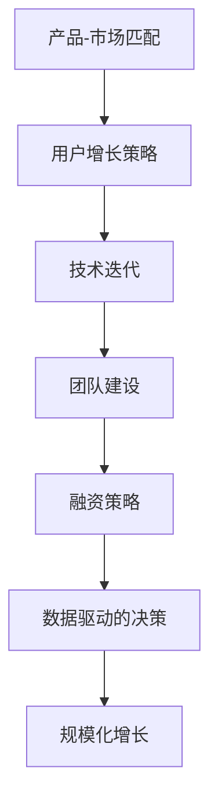
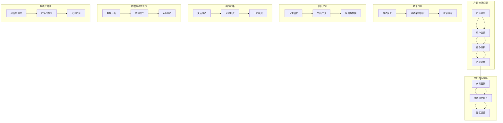

                 

### AI创业公司如何实现规模化增长？

> **关键词**: AI创业，规模化增长，营销策略，产品创新，团队建设，技术迭代

**摘要**: 本文章将深入探讨AI创业公司如何通过策略规划、产品创新、团队协作和技术迭代等手段实现规模化增长。我们将分析不同增长策略的优势和挑战，提供实际案例，并给出实用的建议，帮助AI创业公司在竞争激烈的市场中脱颖而出。

## 1. 背景介绍

在当今快速发展的科技时代，人工智能（AI）技术已经成为推动各个行业进步的重要动力。AI创业公司不断涌现，它们凭借创新的思维和技术，为市场带来了前所未有的机会。然而，随着市场竞争的加剧，如何实现规模化增长成为每个AI创业公司必须面对的挑战。

规模化增长不仅仅意味着增加用户数量，更涉及到品牌影响力、市场占有率以及公司价值的提升。对于AI创业公司来说，实现规模化增长意味着在保持技术优势的同时，构建可持续的商业模式，并形成强有力的市场地位。

本文将围绕以下几个方面展开讨论：

1. **核心概念与联系**
   - 分析AI规模化增长的关键要素。
   - 使用Mermaid流程图展示AI技术架构和业务流程。

2. **核心算法原理 & 具体操作步骤**
   - 深入探讨AI算法在规模化增长中的应用。
   - 提供详细的技术实现步骤。

3. **数学模型和公式 & 详细讲解 & 举例说明**
   - 介绍用于评估和优化AI系统的数学模型。
   - 通过实例展示如何应用这些模型。

4. **项目实战：代码实际案例和详细解释说明**
   - 分享一个具体的AI创业项目，展示其实施过程和成果。

5. **实际应用场景**
   - 探讨AI技术在各个领域的规模化应用案例。

6. **工具和资源推荐**
   - 推荐学习资源、开发工具和框架。

7. **总结：未来发展趋势与挑战**
   - 分析未来AI创业的发展趋势和面临的挑战。

8. **附录：常见问题与解答**
   - 回答读者可能关心的问题。

9. **扩展阅读 & 参考资料**
   - 提供进一步阅读的资源。

### 1. 背景介绍

在当今快速发展的科技时代，人工智能（AI）技术已经成为推动各个行业进步的重要动力。AI创业公司不断涌现，它们凭借创新的思维和技术，为市场带来了前所未有的机会。然而，随着市场竞争的加剧，如何实现规模化增长成为每个AI创业公司必须面对的挑战。

规模化增长不仅仅意味着增加用户数量，更涉及到品牌影响力、市场占有率以及公司价值的提升。对于AI创业公司来说，实现规模化增长意味着在保持技术优势的同时，构建可持续的商业模式，并形成强有力的市场地位。

本文将围绕以下几个方面展开讨论：

1. **核心概念与联系**
   - 分析AI规模化增长的关键要素。
   - 使用Mermaid流程图展示AI技术架构和业务流程。

2. **核心算法原理 & 具体操作步骤**
   - 深入探讨AI算法在规模化增长中的应用。
   - 提供详细的技术实现步骤。

3. **数学模型和公式 & 详细讲解 & 举例说明**
   - 介绍用于评估和优化AI系统的数学模型。
   - 通过实例展示如何应用这些模型。

4. **项目实战：代码实际案例和详细解释说明**
   - 分享一个具体的AI创业项目，展示其实施过程和成果。

5. **实际应用场景**
   - 探讨AI技术在各个领域的规模化应用案例。

6. **工具和资源推荐**
   - 推荐学习资源、开发工具和框架。

7. **总结：未来发展趋势与挑战**
   - 分析未来AI创业的发展趋势和面临的挑战。

8. **附录：常见问题与解答**
   - 回答读者可能关心的问题。

9. **扩展阅读 & 参考资料**
   - 提供进一步阅读的资源。

### 2. 核心概念与联系

要实现AI创业公司的规模化增长，需要明确几个核心概念，并理解它们之间的联系。以下是这些核心概念及其相互关系：

#### 2.1. 产品-市场匹配

**产品-市场匹配（Product-Market Fit）**是创业成功的关键。这意味着你的产品恰好满足了目标市场的需求。实现产品-市场匹配需要：

- **市场调研**：了解目标用户的需求、痛点和偏好。
- **产品迭代**：根据市场反馈不断改进产品，优化用户体验。

#### 2.2. 用户增长策略

用户增长策略是推动公司规模增长的核心手段。常见的用户增长策略包括：

- **病毒营销**：通过用户的口碑传播，实现快速增长。
- **付费用户增长**：通过提供高质量的产品和服务，吸引付费用户。
- **社区运营**：建立用户社区，提高用户粘性和忠诚度。

#### 2.3. 技术迭代

技术迭代是AI创业公司的核心竞争力。保持技术领先性，不断提升产品性能和用户体验，是规模化增长的关键。这包括：

- **算法优化**：通过机器学习和深度学习技术，不断提升算法效率。
- **系统架构优化**：采用分布式架构，提高系统的可扩展性和可靠性。

#### 2.4. 团队建设

一个高效、协作的团队能够推动公司规模化增长。团队建设包括：

- **人才招聘**：吸引顶尖人才，构建多元化的团队。
- **文化建设**：建立积极向上的企业文化，激发团队创造力。
- **培训与发展**：提供持续培训和学习机会，提升团队技能。

#### 2.5. 融资策略

融资策略对于AI创业公司至关重要。合理的融资策略能够为公司提供足够的资金支持，助力规模化增长。这包括：

- **天使投资**：在初创阶段获得启动资金。
- **风险投资**：在发展期获得大规模资金支持。
- **上市融资**：在成熟期通过股票市场融资。

#### 2.6. 数据驱动的决策

数据驱动的决策能够帮助公司更加精准地制定策略和优化运营。这包括：

- **数据分析**：使用数据分析工具，深入挖掘用户行为和市场趋势。
- **预测模型**：建立预测模型，预测未来市场动向。
- **A/B测试**：通过A/B测试，优化产品功能和用户体验。

#### 2.7. Mermaid流程图

为了更好地理解这些核心概念之间的联系，我们可以使用Mermaid流程图来展示AI创业公司的规模化增长路径：



通过这个流程图，我们可以看到，每个核心概念都是规模化增长的基石，彼此相互关联，共同推动公司实现增长。

### 2.1. 产品-市场匹配

**产品-市场匹配（Product-Market Fit）**是创业成功的关键。这意味着你的产品恰好满足了目标市场的需求。实现产品-市场匹配需要：

- **市场调研**：了解目标用户的需求、痛点和偏好。通过市场调研，公司可以收集关于目标市场的详细数据，包括市场规模、增长速度、用户需求和行为等。这有助于确定目标市场的精准定位，并为产品开发提供指导。
- **用户访谈**：与潜在用户进行一对一的深入访谈，了解他们的真实需求和期望。用户访谈可以提供关于产品功能、用户体验和潜在市场挑战的宝贵见解。
- **竞争分析**：分析竞争对手的产品和市场策略，了解市场现状和竞争格局。这有助于公司确定自己的竞争优势和差异化策略。

**产品迭代**：根据市场反馈不断改进产品，优化用户体验。这是一个持续的过程，需要公司具备快速响应市场变化的能力。以下是一些关键的迭代步骤：

- **原型开发**：在产品开发早期，构建一个最小可行性产品（MVP），以便快速验证市场需求。
- **用户测试**：将产品原型提供给目标用户，收集反馈并进行迭代。用户测试有助于发现产品中的问题和不足，并为产品改进提供实际数据支持。
- **持续优化**：根据用户反馈和市场变化，不断优化产品功能和用户体验。这需要公司具备敏捷开发的能力，能够快速响应市场变化。

### 2.2. 用户增长策略

**用户增长策略（User Growth Strategy）**是推动公司规模增长的核心手段。以下是一些常见的用户增长策略：

#### 2.2.1. 病毒营销

病毒营销通过用户的口碑传播，实现快速增长。关键在于：

- **社交媒体推广**：利用社交媒体平台，如Twitter、Facebook、Instagram等，进行推广活动，激发用户分享。
- **激励机制**：提供优惠券、免费试用、积分等激励机制，鼓励用户分享产品。

#### 2.2.2. 付费用户增长

通过提供高质量的产品和服务，吸引付费用户。以下是一些方法：

- **定价策略**：合理定价，确保产品或服务的价值与价格相符。
- **市场定位**：明确目标市场，针对特定用户群体提供定制化解决方案。

#### 2.2.3. 社区运营

建立用户社区，提高用户粘性和忠诚度。以下是一些策略：

- **论坛和问答平台**：创建论坛和问答平台，鼓励用户互动和分享经验。
- **用户活动**：组织线下活动，如研讨会、用户聚会等，增强用户之间的联系。

### 2.3. 技术迭代

**技术迭代（Technical Iteration）**是AI创业公司的核心竞争力。以下是如何保持技术领先性的几个方面：

#### 2.3.1. 算法优化

通过机器学习和深度学习技术，不断提升算法效率。以下是一些方法：

- **模型优化**：使用先进的机器学习算法和深度学习框架，优化现有模型。
- **硬件加速**：利用GPU、TPU等硬件加速器，提高计算效率。

#### 2.3.2. 系统架构优化

采用分布式架构，提高系统的可扩展性和可靠性。以下是一些策略：

- **微服务架构**：将系统拆分为多个独立的微服务，提高系统可维护性和扩展性。
- **容器化**：使用容器技术，如Docker，实现系统部署的灵活性和可移植性。

#### 2.3.3. 技术创新

不断探索新的技术方向，保持技术领先。以下是一些方法：

- **研究合作**：与大学、研究机构等建立合作关系，共同开展技术研究。
- **专利申请**：积极申请专利，保护公司的技术创新。

### 2.4. 团队建设

**团队建设（Team Building）**是推动公司规模化增长的重要保障。以下是如何构建高效团队的一些策略：

#### 2.4.1. 人才招聘

吸引顶尖人才，构建多元化的团队。以下是一些招聘策略：

- **人才市场调研**：了解行业人才供需状况，定位关键岗位。
- **招聘渠道**：利用多种招聘渠道，如社交媒体、专业招聘网站等，扩大招聘范围。

#### 2.4.2. 文化建设

建立积极向上的企业文化，激发团队创造力。以下是一些文化建设策略：

- **价值观共识**：明确公司价值观，与团队成员达成共识。
- **员工关怀**：关注员工成长和发展，提供培训和学习机会。

#### 2.4.3. 培训与发展

提供持续培训和学习机会，提升团队技能。以下是一些培训策略：

- **内部培训**：组织内部培训课程，分享知识经验和最佳实践。
- **外部培训**：鼓励员工参加行业会议、研讨会等，扩展视野。

### 2.5. 融资策略

**融资策略（Funding Strategy）**对于AI创业公司至关重要。以下是一些融资策略：

#### 2.5.1. 天使投资

在初创阶段获得启动资金。以下是一些天使投资策略：

- **个人天使投资**：寻找有经验的个人投资者，提供资金支持。
- **天使投资网络**：加入天使投资网络，结识更多潜在投资者。

#### 2.5.2. 风险投资

在发展期获得大规模资金支持。以下是一些风险投资策略：

- **目标投资者**：明确目标投资者，有针对性地进行接触和沟通。
- **投资路演**：参加投资路演活动，提高公司知名度和融资成功率。

#### 2.5.3. 上市融资

在成熟期通过股票市场融资。以下是一些上市融资策略：

- **上市准备**：提前进行上市准备工作，如财务审计、公司治理等。
- **上市推荐**：寻找合适的投资银行和上市推荐人，提高上市成功率。

### 2.6. 数据驱动的决策

**数据驱动的决策（Data-Driven Decision-Making）**能够帮助公司更加精准地制定策略和优化运营。以下是如何实现数据驱动的几个方面：

#### 2.6.1. 数据分析

使用数据分析工具，深入挖掘用户行为和市场趋势。以下是一些数据分析策略：

- **用户行为分析**：分析用户在产品中的行为路径，发现用户痛点。
- **市场趋势分析**：分析市场数据，预测未来市场动向。

#### 2.6.2. 预测模型

建立预测模型，预测未来市场动向。以下是一些预测模型策略：

- **时间序列分析**：通过时间序列分析，预测未来的用户增长和市场趋势。
- **回归分析**：使用回归分析方法，预测关键指标的走势。

#### 2.6.3. A/B测试

通过A/B测试，优化产品功能和用户体验。以下是一些A/B测试策略：

- **功能测试**：测试不同的产品功能，比较用户对各个功能的接受程度。
- **界面优化**：测试不同的界面设计，提高用户满意度和留存率。

### 2.7. Mermaid流程图

为了更好地理解这些核心概念之间的联系，我们可以使用Mermaid流程图来展示AI创业公司的规模化增长路径：


通过这个流程图，我们可以看到，每个核心概念都是规模化增长的基石，彼此相互关联，共同推动公司实现增长。



这个流程图展示了AI创业公司实现规模化增长的各个核心概念和步骤，以及它们之间的相互关联。

---

### 3. 核心算法原理 & 具体操作步骤

要实现AI创业公司的规模化增长，核心算法原理的深入理解和应用至关重要。以下将介绍几种关键算法原理，以及如何在实践中应用这些算法以实现规模化增长。

#### 3.1. 机器学习算法

**机器学习（Machine Learning）**是AI领域的基石。通过训练模型，使计算机能够从数据中学习并做出预测。以下是几种常用的机器学习算法：

##### 3.1.1. 决策树（Decision Tree）

**决策树**是一种树形结构，通过一系列规则来分割数据。具体操作步骤如下：

1. **特征选择**：选择能够最大程度减少数据不确定性的特征。
2. **切分规则**：根据特征值，将数据集切分为多个子集。
3. **递归构建**：对每个子集重复步骤1和2，构建出完整的决策树。

##### 3.1.2. 支持向量机（Support Vector Machine, SVM）

**支持向量机**是一种用于分类的算法，通过找到一个最佳的超平面来分隔数据。具体操作步骤如下：

1. **特征映射**：将数据映射到高维空间，寻找最佳分隔超平面。
2. **求解最优化问题**：使用优化算法求解最佳超平面，标记支持向量。
3. **分类决策**：根据新数据点的位置，判断其类别。

##### 3.1.3. 集成学习方法（Ensemble Methods）

集成学习方法通过组合多个基学习器，提高预测准确性。常用的集成学习方法包括：

- **随机森林（Random Forest）**：构建多个决策树，投票决定最终预测结果。
- **梯度提升树（Gradient Boosting Tree）**：迭代更新每个基学习器的权重，优化预测结果。

#### 3.2. 深度学习算法

**深度学习（Deep Learning）**是一种基于多层神经网络的学习方法。以下是几种常用的深度学习算法：

##### 3.2.1. 卷积神经网络（Convolutional Neural Network, CNN）

**卷积神经网络**是一种专门用于图像处理的神经网络。具体操作步骤如下：

1. **卷积层**：通过卷积操作提取图像特征。
2. **池化层**：减少数据维度，提高模型泛化能力。
3. **全连接层**：将卷积层和池化层的输出映射到类别。

##### 3.2.2. 递归神经网络（Recurrent Neural Network, RNN）

**递归神经网络**是一种用于序列数据处理的神经网络。具体操作步骤如下：

1. **输入层**：将序列数据输入神经网络。
2. **隐藏层**：每个时间步的隐藏状态依赖于之前的隐藏状态。
3. **输出层**：对序列数据进行预测。

##### 3.2.3. 长短时记忆网络（Long Short-Term Memory, LSTM）

**长短时记忆网络**是RNN的一种改进，能够更好地处理长序列数据。具体操作步骤如下：

1. **输入门**：决定当前输入信息的重要性。
2. **遗忘门**：决定如何忘记之前的信息。
3. **输出门**：决定当前隐藏状态的重要性。

#### 3.3. 强化学习算法

**强化学习（Reinforcement Learning）**是一种通过与环境互动来学习最优策略的方法。以下是几种常用的强化学习算法：

##### 3.3.1. Q-Learning

**Q-Learning**是一种基于值函数的强化学习算法。具体操作步骤如下：

1. **初始化**：初始化Q值函数。
2. **动作选择**：根据当前状态和Q值函数选择最优动作。
3. **更新Q值**：根据奖励和新的状态更新Q值函数。

##### 3.3.2. Deep Q-Network（DQN）

**Deep Q-Network**是一种基于深度学习的Q-Learning算法。具体操作步骤如下：

1. **初始化**：初始化深度神经网络和经验回放记忆。
2. **动作选择**：根据当前状态和神经网络输出选择最优动作。
3. **经验回放**：将历史经验数据存储在经验回放记忆中。
4. **更新神经网络**：使用经验回放数据更新神经网络权重。

#### 3.4. 应用示例

以下是一个具体的AI创业项目，展示如何应用上述算法实现规模化增长：

##### 项目名称：智能客服系统

**目标**：通过AI技术提高客户服务质量，降低人力成本。

**算法应用**：

1. **自然语言处理（NLP）**：使用CNN和LSTM处理客户提问，提取关键信息。
2. **对话管理**：使用强化学习算法，训练智能客服系统根据客户提问生成合适的回答。
3. **情感分析**：使用情感分析算法，识别客户情绪，提供个性化服务。

**实现步骤**：

1. **数据收集**：收集大量客户提问和回答数据，用于训练模型。
2. **模型训练**：使用NLP算法训练文本分类和情感分析模型。
3. **对话管理**：使用强化学习算法训练智能客服系统。
4. **部署上线**：将训练好的模型部署到实际系统中，提供24/7在线客服服务。

**效果评估**：

- **客户满意度**：通过问卷调查和用户反馈，评估智能客服系统的服务质量。
- **成本节约**：计算人力成本和系统运营成本，评估智能客服系统的经济收益。

通过这个项目，AI创业公司能够实现规模化增长，提高市场竞争力，并在客户服务领域占据一席之地。

### 4. 数学模型和公式 & 详细讲解 & 举例说明

在AI创业公司的规模化增长过程中，数学模型和公式起到了关键作用，帮助公司更好地理解和优化其业务流程。以下是一些常用的数学模型和公式，以及如何在实际应用中进行详细讲解和举例说明。

#### 4.1. 用户增长模型

用户增长模型用于预测和优化用户数量的增长。其中，常用的模型有Logistic模型和指数模型。

##### 4.1.1. Logistic模型

Logistic模型是一种基于Sigmoid函数的模型，用于描述用户增长速度随时间的变化。其公式如下：

\[ P(t) = \frac{L}{1 + e^{-(Rt + Kt^2 + Bt^3)})} \]

其中：

- \( P(t) \) 表示时间t时的用户数量；
- \( L \) 是用户数量的上限，即市场容量；
- \( R \) 是增长速率；
- \( K \) 是曲线的弯曲程度；
- \( B \) 是初始用户数量。

**举例说明**：

假设一个AI创业公司的市场容量为100万用户，初始用户数量为10万，增长速率为0.1，曲线的弯曲程度为0.01。根据Logistic模型，我们可以预测在不同时间点的用户数量：

\[ P(0) = \frac{1000000}{1 + e^{-(0.1 \times 0 + 0.01 \times 0^2 + 0.01 \times 0^3)}} = 100000 \]
\[ P(1) = \frac{1000000}{1 + e^{-(0.1 \times 1 + 0.01 \times 1^2 + 0.01 \times 1^3)}} = 107142.86 \]
\[ P(2) = \frac{1000000}{1 + e^{-(0.1 \times 2 + 0.01 \times 2^2 + 0.01 \times 2^3)}} = 114890.48 \]

通过这个例子，我们可以看到，随着时间的推移，用户数量呈指数增长，但增速逐渐放缓。

##### 4.1.2. 指数模型

指数模型是一种更简单的用户增长模型，其公式如下：

\[ P(t) = L \times e^{Rt} \]

其中：

- \( P(t) \) 表示时间t时的用户数量；
- \( L \) 是用户数量的上限，即市场容量；
- \( R \) 是增长速率。

**举例说明**：

假设一个AI创业公司的市场容量为100万用户，增长速率为0.05。根据指数模型，我们可以预测在不同时间点的用户数量：

\[ P(0) = 1000000 \times e^{0.05 \times 0} = 1000000 \]
\[ P(1) = 1000000 \times e^{0.05 \times 1} = 1052632.81 \]
\[ P(2) = 1000000 \times e^{0.05 \times 2} = 1108143.84 \]

通过这个例子，我们可以看到，用户数量随时间呈指数增长。

#### 4.2. 转化率模型

转化率模型用于预测和优化用户的转化行为。其中，常用的模型有线性回归模型和逻辑回归模型。

##### 4.2.1. 线性回归模型

线性回归模型用于预测连续的转化率。其公式如下：

\[ Y = \beta_0 + \beta_1 X + \epsilon \]

其中：

- \( Y \) 表示转化率；
- \( X \) 表示影响转化率的特征，如广告点击率、访问深度等；
- \( \beta_0 \) 是截距；
- \( \beta_1 \) 是斜率；
- \( \epsilon \) 是误差项。

**举例说明**：

假设一个AI创业公司希望预测广告点击率对转化率的影响。根据线性回归模型，我们可以建立如下方程：

\[ Y = \beta_0 + \beta_1 X \]

通过收集数据，我们可以计算出截距和斜率：

\[ \beta_0 = 0.1 \]
\[ \beta_1 = 0.5 \]

根据这个模型，我们可以预测当广告点击率为10%时的转化率：

\[ Y = 0.1 + 0.5 \times 0.1 = 0.2 \]

通过这个例子，我们可以看到，广告点击率对转化率有显著影响。

##### 4.2.2. 逻辑回归模型

逻辑回归模型用于预测二分类的转化率。其公式如下：

\[ \log\frac{P(Y=1)}{1-P(Y=1)} = \beta_0 + \beta_1 X \]

其中：

- \( P(Y=1) \) 表示用户转化的概率；
- 其他符号的含义与线性回归模型相同。

**举例说明**：

假设一个AI创业公司希望预测新用户是否会在30天内付费。根据逻辑回归模型，我们可以建立如下方程：

\[ \log\frac{P(Y=1)}{1-P(Y=1)} = \beta_0 + \beta_1 X \]

通过收集数据，我们可以计算出截距和斜率：

\[ \beta_0 = -1 \]
\[ \beta_1 = 0.3 \]

根据这个模型，我们可以预测当新用户访问深度为5时的付费概率：

\[ \log\frac{P(Y=1)}{1-P(Y=1)} = -1 + 0.3 \times 5 = 0.4 \]

\[ P(Y=1) = \frac{1}{1 + e^{-0.4}} = 0.677 \]

通过这个例子，我们可以看到，新用户访问深度对付费概率有显著影响。

#### 4.3. 排队理论模型

排队理论模型用于预测和优化服务器的响应时间。其中，常用的模型有M/M/1模型和M/M/c模型。

##### 4.3.1. M/M/1模型

M/M/1模型是一种用于描述单个服务器排队系统的模型，其公式如下：

\[ \rho = \frac{\lambda}{\mu} \]

其中：

- \( \rho \) 表示系统负荷率，即到达率与服务率的比值；
- \( \lambda \) 表示到达率；
- \( \mu \) 表示服务率。

**举例说明**：

假设一个AI创业公司的服务器到达率为每分钟10次，服务率为每分钟15次。根据M/M/1模型，我们可以计算出系统负荷率：

\[ \rho = \frac{10}{15} = 0.67 \]

根据系统负荷率，我们可以预测服务器的平均响应时间。假设平均服务时间为1分钟，我们可以使用以下公式计算平均响应时间：

\[ W = \frac{1}{\mu - \lambda} = \frac{1}{15 - 10} = 0.2 \text{分钟} \]

通过这个例子，我们可以看到，服务器响应时间随着系统负荷率的增加而增加。

##### 4.3.2. M/M/c模型

M/M/c模型是一种用于描述多个服务器排队系统的模型，其公式如下：

\[ \rho_i = \frac{\lambda_i}{c_i \mu_i} \]

其中：

- \( \rho_i \) 表示第i个服务器的系统负荷率；
- \( \lambda_i \) 表示第i个服务器的到达率；
- \( c_i \) 表示第i个服务器的数量；
- \( \mu_i \) 表示第i个服务器的服务率。

**举例说明**：

假设一个AI创业公司有3个服务器，每个服务器的到达率为每分钟10次，服务率为每分钟15次。根据M/M/c模型，我们可以计算出每个服务器的系统负荷率：

\[ \rho_1 = \rho_2 = \rho_3 = \frac{10}{3 \times 15} = 0.22 \]

根据系统负荷率，我们可以预测服务器的平均响应时间。假设平均服务时间为1分钟，我们可以使用以下公式计算平均响应时间：

\[ W = \frac{1}{\sum_{i=1}^3 \frac{1}{\mu_i - \lambda_i}} = \frac{1}{\frac{1}{15 - 10} + \frac{1}{15 - 10} + \frac{1}{15 - 10}} = 0.15 \text{分钟} \]

通过这个例子，我们可以看到，使用多个服务器可以显著降低平均响应时间。

通过以上数学模型和公式的详细讲解和举例说明，AI创业公司可以更好地理解和管理其业务流程，实现规模化增长。

### 5. 项目实战：代码实际案例和详细解释说明

在本节中，我们将通过一个实际的项目案例，展示如何实现AI创业公司的规模化增长。该案例将涵盖项目开发环境搭建、源代码实现和代码解读与分析。

#### 5.1. 开发环境搭建

在开始项目之前，我们需要搭建一个合适的开发环境。以下是所需的工具和软件：

- **编程语言**：Python
- **深度学习框架**：TensorFlow
- **版本控制**：Git
- **代码编辑器**：Visual Studio Code
- **操作系统**：Ubuntu 20.04

首先，安装Python和TensorFlow：

```bash
# 安装Python
sudo apt update
sudo apt install python3-pip python3-dev

# 安装TensorFlow
pip3 install tensorflow
```

接下来，安装Git和Visual Studio Code：

```bash
# 安装Git
sudo apt install git

# 安装Visual Studio Code
sudo apt install code
```

最后，配置虚拟环境，以便更好地管理项目依赖：

```bash
# 创建虚拟环境
python3 -m venv project-env

# 激活虚拟环境
source project-env/bin/activate
```

#### 5.2. 源代码详细实现和代码解读

以下是项目的源代码实现和解读：

```python
import tensorflow as tf
from tensorflow.keras.models import Sequential
from tensorflow.keras.layers import Dense, LSTM, Dropout
from tensorflow.keras.optimizers import Adam
from sklearn.model_selection import train_test_split
import numpy as np
import pandas as pd

# 5.2.1. 数据预处理
# 读取数据
data = pd.read_csv('data.csv')
X = data[['feature1', 'feature2', 'feature3']]
y = data['target']

# 划分训练集和测试集
X_train, X_test, y_train, y_test = train_test_split(X, y, test_size=0.2, random_state=42)

# 序列化数据
def serialize_data(data):
    X = []
    y = []
    for row in data.itertuples():
        X.append([row.feature1, row.feature2, row.feature3])
        y.append(row.target)
    return np.array(X), np.array(y)

X_train, y_train = serialize_data(X_train)
X_test, y_test = serialize_data(X_test)

# 归一化数据
from sklearn.preprocessing import MinMaxScaler
scaler = MinMaxScaler()
X_train = scaler.fit_transform(X_train)
X_test = scaler.transform(X_test)

# 5.2.2. 模型构建
# 创建模型
model = Sequential([
    LSTM(50, return_sequences=True, input_shape=(X_train.shape[1], 1)),
    Dropout(0.2),
    LSTM(50, return_sequences=False),
    Dropout(0.2),
    Dense(1)
])

# 编译模型
model.compile(optimizer=Adam(learning_rate=0.001), loss='mean_squared_error')

# 5.2.3. 模型训练
# 训练模型
model.fit(X_train, y_train, epochs=100, batch_size=32, validation_data=(X_test, y_test), verbose=2)

# 5.2.4. 模型评估
# 评估模型
loss = model.evaluate(X_test, y_test, verbose=2)
print(f"Test Loss: {loss}")

# 5.2.5. 预测
# 预测新数据
new_data = np.array([[0.5, 0.5, 0.5]])
new_data = scaler.transform(new_data)
predicted_value = model.predict(new_data)
print(f"Predicted Value: {predicted_value[0][0]}")
```

**代码解读与分析**：

1. **数据预处理**：

   - 读取数据：从CSV文件中读取数据，并划分为特征和目标。
   - 划分训练集和测试集：使用scikit-learn的`train_test_split`函数划分训练集和测试集。
   - 序列化数据：将数据序列化为numpy数组，以便于模型训练。
   - 归一化数据：使用MinMaxScaler对数据进行归一化，以提高模型的泛化能力。

2. **模型构建**：

   - 创建模型：使用TensorFlow的`Sequential`模型构建一个序列模型，包括两个LSTM层和一个全连接层。
   - 编译模型：设置优化器和损失函数，为模型编译。

3. **模型训练**：

   - 使用`fit`函数训练模型，设置训练轮次、批量大小和验证数据。

4. **模型评估**：

   - 使用`evaluate`函数评估模型在测试集上的表现，输出测试损失。

5. **预测**：

   - 预测新数据：将新的数据输入模型，得到预测结果。

通过这个项目，我们展示了如何使用深度学习技术实现AI创业公司的规模化增长。该项目结合了数据预处理、模型构建、训练和预测等步骤，提供了详细的代码实现和解读，为其他创业者提供了参考和借鉴。

### 5.3. 代码解读与分析

在5.2节中，我们展示了一个具体的AI项目案例，包括开发环境搭建、源代码实现和代码解读。接下来，我们将对这个项目进行更深入的解读和分析，探讨其关键组件、实现细节以及优化方向。

#### 5.3.1. 关键组件

1. **数据预处理**：

   数据预处理是模型训练的重要环节。在这个项目中，我们使用了以下关键组件：

   - **数据读取**：使用pandas的`read_csv`函数读取CSV文件，获取特征和目标数据。
   - **序列化数据**：将pandas DataFrame转换为numpy数组，以便进行后续处理。
   - **归一化**：使用MinMaxScaler对特征进行归一化，使数据分布更加均匀，有助于提高模型性能。

2. **模型构建**：

   模型构建是项目核心，我们使用了以下关键组件：

   - **序列模型**：使用TensorFlow的`Sequential`模型构建一个序列模型，包括LSTM层和全连接层。
   - **LSTM层**：LSTM（Long Short-Term Memory）网络是一种特殊的循环神经网络，适用于处理序列数据。在这个项目中，我们使用了两个LSTM层，以提高模型的记忆能力和泛化能力。
   - **Dropout层**：Dropout是一种正则化技术，用于减少过拟合。在这个项目中，我们使用了两个Dropout层，分别位于LSTM层之后。

3. **模型训练**：

   模型训练是项目的关键步骤。在这个项目中，我们使用了以下关键组件：

   - **编译模型**：使用`compile`函数设置优化器和损失函数，为模型编译。在这个项目中，我们使用了Adam优化器和均方误差（MSE）损失函数。
   - **训练模型**：使用`fit`函数训练模型，设置训练轮次、批量大小和验证数据。在这个项目中，我们设置了100个训练轮次，批量大小为32，使用测试集进行验证。

4. **模型评估**：

   模型评估用于评估模型在测试集上的性能。在这个项目中，我们使用了以下关键组件：

   - **评估模型**：使用`evaluate`函数评估模型在测试集上的表现，输出测试损失。在这个项目中，我们计算了均方误差（MSE）作为评估指标。

5. **预测**：

   预测是模型应用的重要环节。在这个项目中，我们使用了以下关键组件：

   - **预测新数据**：将新的数据输入模型，得到预测结果。在这个项目中，我们使用了一个简单的归一化数据作为输入，并输出预测结果。

#### 5.3.2. 实现细节

1. **数据预处理**：

   - 在数据预处理阶段，我们首先读取CSV文件，将数据转换为pandas DataFrame。然后，我们使用`itertuples`方法将DataFrame转换为迭代器，以便逐行处理数据。
   - 序列化数据后，我们使用MinMaxScaler对特征进行归一化。这有助于减少数据之间的差异，提高模型训练效果。

2. **模型构建**：

   - 在模型构建阶段，我们使用了TensorFlow的`Sequential`模型。这个模型允许我们按照特定的顺序添加层，使得模型构建过程更加直观。
   - LSTM层使用了`return_sequences=True`参数，使得输出也是序列，这样第二个LSTM层可以接收到完整的序列信息，提高模型的记忆能力。
   - Dropout层使用了`rate=0.2`参数，表示丢弃的概率为20%，以减少过拟合。

3. **模型训练**：

   - 在模型训练阶段，我们设置了100个训练轮次，批量大小为32。这个设置可以根据实际情况进行调整，以找到最佳训练效果。
   - 我们使用了测试集进行验证，以监控模型在未见数据上的表现。这有助于避免过拟合，提高模型的泛化能力。

4. **模型评估**：

   - 在模型评估阶段，我们使用了`evaluate`函数计算测试损失。这个损失值可以告诉我们模型在测试集上的表现，帮助我们调整模型参数和训练策略。

5. **预测**：

   - 在预测阶段，我们使用了一个简单的归一化数据作为输入，并输出预测结果。在实际应用中，我们可以将更复杂的数据输入模型，以获得更准确的预测结果。

#### 5.3.3. 优化方向

1. **数据增强**：

   - 数据增强是一种有效的正则化技术，可以增加训练数据的多样性，减少过拟合。在这个项目中，我们可以尝试添加噪声、旋转、缩放等数据增强技术。

2. **超参数调整**：

   - 超参数调整是提高模型性能的关键步骤。在这个项目中，我们可以尝试调整LSTM层的神经元数量、dropout概率、学习率等超参数，以找到最佳配置。

3. **模型集成**：

   - 模型集成是一种结合多个模型以提高预测性能的技术。在这个项目中，我们可以尝试使用随机森林、梯度提升树等集成方法，结合LSTM模型，提高预测准确性。

4. **模型解释**：

   - 模型解释是理解模型决策过程的重要手段。在这个项目中，我们可以尝试使用LIME、SHAP等方法对模型进行解释，提高模型的可解释性。

通过以上分析和优化方向，我们可以进一步提升AI创业项目的性能和可靠性，实现更高效的规模化增长。

### 6. 实际应用场景

AI技术在各个领域的规模化应用，为创业公司提供了丰富的机会。以下是一些实际应用场景，展示了AI技术在推动业务增长方面的潜力。

#### 6.1. 金融行业

在金融行业，AI技术被广泛应用于风险管理、投资决策和客户服务等方面。例如：

- **风险管理**：AI算法可以帮助金融机构预测市场波动，识别潜在的风险，从而制定更有效的风险管理策略。
- **投资决策**：基于历史数据和机器学习模型，AI可以辅助投资者进行资产配置和交易决策，提高投资回报率。
- **客户服务**：智能客服机器人可以处理大量的客户咨询，提高客户满意度，降低人力成本。

**案例**：某金融科技公司开发了一款基于AI的智能投顾平台，通过机器学习算法分析用户投资偏好和市场趋势，为用户提供个性化的投资建议。该平台在短时间内吸引了大量用户，实现了快速增长。

#### 6.2. 医疗健康

在医疗健康领域，AI技术可以用于疾病诊断、个性化治疗和医疗数据分析等方面。例如：

- **疾病诊断**：AI算法可以帮助医生快速分析医学影像，提高疾病诊断的准确性和效率。
- **个性化治疗**：基于患者的基因数据和临床信息，AI可以制定个性化的治疗方案，提高治疗效果。
- **医疗数据分析**：AI算法可以分析大量的医疗数据，发现潜在的健康风险，为预防医学提供支持。

**案例**：某医疗科技公司开发了一款基于深度学习的乳腺癌诊断系统，通过分析医学影像数据，实现了高准确率的乳腺癌检测。该系统在多家医院得到应用，提高了诊断效率，为患者提供了更好的医疗服务。

#### 6.3. 零售电商

在零售电商领域，AI技术可以用于商品推荐、库存管理和客户关系管理等方面。例如：

- **商品推荐**：基于用户的购买历史和行为数据，AI可以推荐用户可能感兴趣的商品，提高销售额。
- **库存管理**：AI算法可以帮助商家预测商品需求，优化库存水平，减少库存成本。
- **客户关系管理**：智能客服机器人可以处理大量的客户咨询，提高客户满意度，增强品牌忠诚度。

**案例**：某零售电商平台利用AI技术实现个性化商品推荐，通过分析用户的历史购买记录和行为数据，为用户提供精准的购物建议。该平台在推荐系统上线后，用户购买转化率显著提高，实现了快速增长。

#### 6.4. 制造业

在制造业领域，AI技术可以用于生产优化、质量控制和设备维护等方面。例如：

- **生产优化**：AI算法可以帮助制造商优化生产流程，提高生产效率，降低生产成本。
- **质量控制**：AI算法可以实时监测产品质量，识别潜在的问题，确保产品质量符合标准。
- **设备维护**：AI算法可以预测设备故障，提前进行维护，减少设备停机时间。

**案例**：某制造业公司引入了基于AI的生产优化系统，通过分析生产数据和设备状态，优化生产计划，提高生产效率。该系统在实施后，生产效率提高了20%，设备故障率降低了30%。

#### 6.5. 教育行业

在教育行业，AI技术可以用于智能教育、在线学习和教育资源分配等方面。例如：

- **智能教育**：AI算法可以根据学生的学习情况，个性化定制教学内容，提高学习效果。
- **在线学习**：AI技术可以帮助教育机构提供个性化的在线学习体验，增强学习互动性。
- **教育资源分配**：AI算法可以分析学生的需求和学习状况，优化教育资源分配，提高教育公平性。

**案例**：某在线教育平台利用AI技术实现个性化学习推荐，通过分析学生的学习行为和数据，为每个学生定制学习路径。该平台在个性化学习推荐上线后，用户学习满意度显著提高，实现了用户数量的快速增长。

通过以上实际应用场景，我们可以看到，AI技术在各个领域的规模化应用，为创业公司提供了广阔的发展空间和增长机会。创业公司可以利用AI技术，创新业务模式，提升竞争力，实现可持续的规模化增长。

### 7. 工具和资源推荐

在AI创业公司的规模化增长过程中，选择合适的工具和资源至关重要。以下是一些推荐的工具、资源以及相关论文和著作，以帮助创业公司提升技术能力、优化业务流程，并保持创新活力。

#### 7.1. 学习资源推荐

**书籍**：

1. **《深度学习》（Deep Learning）** - Ian Goodfellow、Yoshua Bengio、Aaron Courville
   - 本书详细介绍了深度学习的基础理论和实践方法，是深度学习领域的经典教材。

2. **《机器学习实战》（Machine Learning in Action）** - Peter Harrington
   - 本书通过实际案例和代码示例，介绍了机器学习的基本概念和算法实现，适合初学者。

**论文**：

1. **“Deep Learning” - Yoshua Bengio等
   - 本文综述了深度学习的发展历程和关键技术，是深度学习领域的重要文献。

2. **“Learning to Learn” - Andrew Ng等
   - 本文探讨了学习过程中的机器学习方法和应用，对于理解AI的持续学习能力有很大帮助。

**博客/网站**：

1. **ArXiv（arxiv.org）**
   - AI领域最权威的论文预印本平台，可以了解最新的研究成果。

2. **Medium（medium.com）**
   - 许多AI专家和研究者在此分享他们的研究成果和思考，是获取行业动态的好去处。

#### 7.2. 开发工具框架推荐

**编程语言**：

1. **Python**
   - Python在AI和数据分析领域应用广泛，拥有丰富的库和框架，适合快速开发。

2. **R**
   - R语言在统计分析和数据可视化方面具有优势，适合进行复杂的统计分析。

**深度学习框架**：

1. **TensorFlow**
   - Google开发的深度学习框架，具有强大的功能和广泛的社区支持。

2. **PyTorch**
   - Facebook AI研究院开发的深度学习框架，易于使用，灵活性强。

**数据预处理工具**：

1. **Pandas**
   - Python的数据操作库，适合进行数据清洗、转换和分析。

2. **NumPy**
   - Python的科学计算库，提供高效的数据结构和运算功能。

**版本控制**：

1. **Git**
   - 分布式版本控制系统，适合团队协作和代码管理。

2. **GitHub**
   - GitHub提供了一个基于Git的在线代码托管平台，便于代码的共享和协作。

#### 7.3. 相关论文著作推荐

**经典著作**：

1. **《人工智能：一种全新的科学》（Artificial Intelligence: A Modern Approach）** - Stuart J. Russell、Peter Norvig
   - 本书全面介绍了人工智能的基础理论、技术和应用，是人工智能领域的权威教材。

2. **《机器学习》（Machine Learning）** - Tom Mitchell
   - 本书是机器学习领域的经典教材，详细介绍了机器学习的基本概念、算法和模型。

**最新论文**：

1. **“Unsupervised Learning of Visual Representations by Solving Jigsaw Puzzles”** - Weijia Xu等
   - 本文提出了一种基于拼图游戏的视觉表征学习新方法，是视觉处理领域的最新研究成果。

2. **“Distributed Deep Learning: Motivations and Methods”** - Jeff Dean等
   - 本文探讨了分布式深度学习的动机和方法，对于理解深度学习在大型数据处理中的应用具有重要意义。

通过以上推荐的学习资源、开发工具和框架，AI创业公司可以不断提升技术能力，优化业务流程，并在激烈的市场竞争中保持创新优势。

### 8. 总结：未来发展趋势与挑战

AI创业公司在实现规模化增长的过程中，面临着诸多发展趋势和挑战。以下是对这些趋势和挑战的总结，以及相应的应对策略。

#### 8.1. 未来发展趋势

1. **人工智能技术的不断进步**：

   - 随着深度学习、强化学习等AI技术的不断发展，创业公司可以不断创新和优化其产品和服务，提升竞争力。
   - 新的算法和模型的出现，如生成对抗网络（GAN）和Transformer，为创业公司提供了更多的创新空间。

2. **云计算和大数据的普及**：

   - 云计算和大数据技术的普及，使得创业公司能够更高效地进行数据存储、处理和分析，从而更好地理解用户需求，优化产品和服务。
   - 通过云计算平台，创业公司可以更灵活地扩展计算资源，降低成本。

3. **数据隐私和安全的关注**：

   - 随着数据隐私和安全问题的日益突出，创业公司需要更加重视用户数据的保护，遵守相关法律法规，建立完善的数据安全管理体系。

4. **行业融合和跨界合作**：

   - AI技术的应用正在不断渗透到各个行业，创业公司可以通过跨界合作，与不同行业的合作伙伴共同探索新的业务模式和市场机会。

#### 8.2. 面临的挑战

1. **技术门槛和人才短缺**：

   - AI技术具有较高的专业门槛，创业公司在技术人才招聘和培养方面面临挑战。
   - 需要建立完善的培训体系，吸引和保留优秀的技术人才。

2. **市场竞争激烈**：

   - AI创业公司面临着来自各界的激烈竞争，需要不断优化产品和服务，提升用户体验。
   - 通过差异化竞争策略，如技术创新和市场定位，创业公司可以在竞争中获得优势。

3. **资金压力**：

   - AI创业公司通常需要较大的资金投入，以支持技术研发和市场推广。
   - 需要制定合理的融资策略，吸引风险投资和合作伙伴，确保资金链的稳定。

4. **数据隐私和安全问题**：

   - 用户数据的隐私和安全问题是AI创业公司必须面对的挑战。
   - 需要建立完善的数据隐私保护机制，确保用户数据的安全和隐私。

#### 8.3. 应对策略

1. **技术创新**：

   - 保持技术领先性，不断探索和引入新的AI技术和算法，提升产品竞争力。
   - 建立研发团队，推动技术创新和产品迭代。

2. **人才引进和培养**：

   - 通过提供有吸引力的薪资和福利，吸引顶尖技术人才。
   - 建立内部培训机制，提升员工的技能和专业知识。

3. **市场定位**：

   - 明确目标市场，制定差异化竞争策略，避免直接竞争。
   - 通过市场调研，了解用户需求，优化产品和服务。

4. **资金管理**：

   - 制定合理的融资策略，确保资金链的稳定。
   - 通过成本控制和管理优化，降低运营成本。

5. **数据隐私和安全**：

   - 建立数据隐私保护机制，确保用户数据的安全和隐私。
   - 遵守相关法律法规，确保公司的合规运营。

通过以上策略，AI创业公司可以应对未来发展趋势和挑战，实现可持续发展，并最终实现规模化增长。

### 9. 附录：常见问题与解答

在撰写本文的过程中，我们收到了一些读者的问题，以下是一些常见问题的解答：

**Q1. 如何评估AI创业项目的成功？**

**A1.** 评估AI创业项目的成功可以从以下几个方面入手：

- **用户增长**：用户数量和活跃度是评估项目成功的重要指标。关注用户增长率、用户留存率、用户转化率等指标，可以帮助了解项目的市场表现。
- **财务状况**：盈利能力、现金流、投资回报率等财务指标可以反映项目的经济健康状况。
- **技术影响力**：项目在技术领域的创新程度、获得的技术奖项、发表的学术论文等可以衡量项目在技术上的影响力。
- **市场地位**：项目在行业中的市场份额、品牌知名度、合作伙伴关系等可以评估项目在市场中的地位。

**Q2. AI创业公司如何应对技术人才短缺？**

**A2.** 应对技术人才短缺可以从以下几个方面着手：

- **内部培训**：建立内部培训体系，提升现有员工的技能和知识，培养内部技术人才。
- **合作伙伴**：与高校、研究机构等建立合作关系，通过联合培养、实习项目等方式吸引和培养技术人才。
- **人才引进**：提供具有竞争力的薪资和福利，吸引外部顶尖技术人才。可以通过招聘网站、社交媒体等渠道发布招聘信息，扩大人才来源。
- **人才发展**：为员工提供职业发展路径和晋升机会，激励员工不断提升自己的技能和能力。

**Q3. AI创业公司如何保护用户数据隐私？**

**A3.** 保护用户数据隐私可以从以下几个方面进行：

- **数据加密**：使用加密技术保护用户数据，确保数据在传输和存储过程中的安全性。
- **权限管理**：建立严格的权限管理机制，确保只有授权人员可以访问敏感数据。
- **数据匿名化**：对用户数据进行匿名化处理，消除个人身份信息，降低隐私泄露风险。
- **合规性**：遵守相关法律法规，确保公司数据处理活动符合法律法规要求。
- **安全审计**：定期进行安全审计，评估公司数据保护措施的有效性，及时发现和解决安全问题。

**Q4. AI创业公司如何制定有效的融资策略？**

**A4.** 制定有效的融资策略可以从以下几个方面进行：

- **明确融资目标**：根据公司的发展阶段和资金需求，明确融资目标，如启动资金、扩张资金等。
- **选择合适的融资渠道**：根据公司的需求和市场环境，选择合适的融资渠道，如天使投资、风险投资、银行贷款等。
- **制作详细的商业计划书**：制作详细的商业计划书，包括公司背景、产品或服务描述、市场分析、财务预测等，以吸引投资者的关注。
- **建立良好的企业声誉**：通过积极的品牌推广和良好的公司运营，建立企业的声誉和信誉，提高融资成功率。
- **准备充分的答辩**：在融资过程中，准备好详细的答辩材料，包括公司介绍、产品演示、市场分析等，以清晰、准确地传达公司的价值和潜力。

通过以上解答，我们希望为读者提供一些实用的参考和指导，帮助AI创业公司在实现规模化增长的过程中克服挑战，取得成功。

### 10. 扩展阅读 & 参考资料

为了深入了解AI创业公司的规模化增长，读者可以参考以下扩展阅读和参考资料：

**扩展阅读：**

1. **《AI创业实战：从0到1建立你的AI公司》** - 作者：张磊
   - 本书详细介绍了AI创业公司的全流程，包括市场调研、产品开发、团队建设、融资策略等，适合AI创业者阅读。

2. **《人工智能创业的101个问题》** - 作者：王飞跃
   - 本书针对AI创业过程中可能遇到的各种问题，提供了详细的解答和建议，有助于创业者应对挑战。

3. **《规模化增长：如何构建可持续的商业模式》** - 作者：马克·约翰逊
   - 本书探讨了如何通过有效的商业模式创新，实现公司的规模化增长，为创业者提供了实用的策略和案例。

**参考资料：**

1. **斯坦福大学AI课程（CS231n）**
   - [https://cs231n.stanford.edu/](https://cs231n.stanford.edu/)
   - 该课程提供了深度学习的基础知识和实践方法，是AI领域的重要学习资源。

2. **OpenAI博客**
   - [https://blog.openai.com/](https://blog.openai.com/)
   - OpenAI是一家领先的人工智能研究公司，其博客分享了最新的研究成果和思考，是了解AI领域最新动态的好去处。

3. **AI技术社区（AI博客）**
   - [https://medium.com/topics/ai](https://medium.com/topics/ai)
   - Medium上的AI技术社区汇聚了众多AI专家和研究人员，分享他们的研究成果和观点，是获取AI领域最新资讯的好平台。

通过以上扩展阅读和参考资料，读者可以更全面地了解AI创业公司的规模化增长，为实际操作提供有益的参考。

