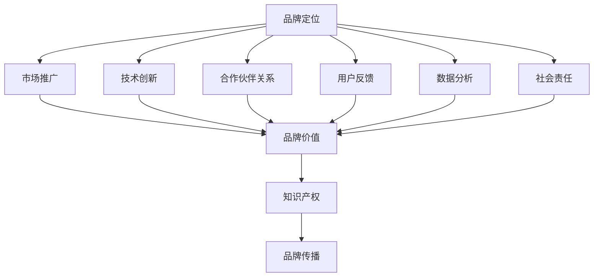

                 

### 1. 背景介绍

随着人工智能技术的飞速发展，AI创业公司如雨后春笋般涌现。然而，在众多竞争者中，如何脱颖而出，建立品牌影响力成为众多AI创业公司的迫切需求。品牌影响力不仅决定了公司在市场中的地位，还影响着公司未来的发展。因此，如何有效地建立品牌影响力成为AI创业公司成功的关键。

在当前的AI创业环境下，品牌影响力的重要性主要体现在以下几个方面：

1. **市场认可度**：一个有影响力的品牌更容易获得市场的认可，吸引更多的客户和投资者。
2. **竞争优势**：品牌影响力有助于树立公司的专业形象，提升公司的竞争优势，使其在竞争中脱颖而出。
3. **口碑传播**：良好的品牌形象和口碑能够促进客户之间的推荐，扩大市场份额。
4. **长期发展**：建立强大的品牌影响力有助于公司实现可持续发展，提高长期盈利能力。

然而，建立品牌影响力并非易事。AI创业公司往往面临着资源有限、市场认知度低等挑战。因此，如何利用有限的资源，制定有效的品牌建设策略，成为AI创业公司需要深入思考的问题。

本文将围绕AI创业公司如何建立品牌影响力这一主题，从多个角度进行分析，提供实用的策略和建议。我们将依次探讨品牌定位、市场推广、技术创新、合作伙伴关系等关键因素，并结合实际案例进行详细讲解。希望通过本文，能够为AI创业公司提供一些有益的启示和借鉴。

### 2. 核心概念与联系

在讨论AI创业公司如何建立品牌影响力之前，我们首先需要明确一些核心概念，并理解它们之间的联系。以下是本文中将会涉及到的核心概念：

#### 2.1 品牌定位

品牌定位是指企业根据市场需求和自身优势，确定品牌在消费者心目中的独特位置。成功的品牌定位能够帮助企业明确目标客户群体，形成差异化竞争优势。

#### 2.2 市场推广

市场推广是指企业通过各种手段，向目标客户传播品牌信息，提升品牌知名度。市场推广策略包括广告、公关、社交媒体营销等。

#### 2.3 技术创新

技术创新是AI创业公司的核心竞争力。通过不断推陈出新，企业能够满足市场需求，提升产品竞争力。

#### 2.4 合作伙伴关系

合作伙伴关系是指企业与其他企业或机构建立的合作关系。通过合作，企业可以共享资源，降低成本，实现共赢。

#### 2.5 用户反馈

用户反馈是了解客户需求的重要途径。通过收集和分析用户反馈，企业可以不断优化产品和服务，提升客户满意度。

#### 2.6 数据分析

数据分析是AI创业公司的重要工具。通过对大量数据进行分析，企业可以洞察市场趋势，优化营销策略，提高运营效率。

#### 2.7 社会责任

社会责任是指企业在追求利润的同时，承担对社会的责任。积极履行社会责任，有助于提升企业形象，增强品牌影响力。

#### 2.8 品牌价值

品牌价值是指品牌在市场中的价值体现。一个有价值的品牌能够为企业带来持续的商业利益。

#### 2.9 知识产权

知识产权是企业重要的无形资产。通过保护知识产权，企业可以维护自身权益，提升品牌竞争力。

#### 2.10 品牌传播

品牌传播是指企业通过各种渠道传播品牌信息，提升品牌知名度。有效的品牌传播策略有助于建立强大的品牌影响力。

为了更清晰地展示这些核心概念之间的联系，我们可以使用Mermaid流程图进行描述。以下是核心概念与联系之间的Mermaid流程图：



通过上述流程图，我们可以看到，品牌定位、市场推广、技术创新、合作伙伴关系、用户反馈、数据分析、社会责任等核心概念共同构成了品牌影响力的基础。这些概念相互关联，共同推动了品牌的成长和发展。

在接下来的内容中，我们将对每个核心概念进行详细探讨，分析它们在建立品牌影响力中的具体作用，并提供实用的策略和建议。希望通过这些分析，能够为AI创业公司在品牌建设过程中提供有价值的参考。

### 3. 核心算法原理 & 具体操作步骤

在理解了核心概念与联系之后，我们需要探讨如何通过具体操作步骤来建立AI创业公司的品牌影响力。以下是几个关键的核心算法原理和具体操作步骤：

#### 3.1 品牌定位算法

品牌定位的核心在于明确企业的目标客户群体和独特价值主张。以下是品牌定位的几个关键步骤：

1. **市场分析**：通过市场调研，了解目标市场的需求、竞争格局和行业趋势。
2. **竞品分析**：分析竞争对手的品牌定位，寻找差异化机会。
3. **内部访谈**：与公司内部各层员工进行访谈，了解公司优势和愿景。
4. **用户访谈**：与目标客户进行深度交流，了解他们的需求和期望。
5. **品牌定位文档**：根据上述分析，制定品牌定位文档，明确目标客户群体和独特价值主张。

#### 3.2 市场推广算法

市场推广旨在提升品牌知名度，吸引潜在客户。以下是市场推广的几个关键步骤：

1. **制定营销策略**：根据品牌定位，制定适合的营销策略，如内容营销、广告推广、公关活动等。
2. **确定目标渠道**：选择合适的营销渠道，如社交媒体、搜索引擎、行业网站等。
3. **内容创作**：创作高质量、有吸引力的内容，提升品牌影响力。
4. **发布与推广**：通过多种渠道发布内容，并进行推广，增加曝光度。
5. **数据分析与优化**：通过数据分析，评估市场推广效果，不断优化策略。

#### 3.3 技术创新算法

技术创新是AI创业公司的核心竞争力。以下是技术创新的几个关键步骤：

1. **市场调研**：了解市场需求和趋势，确定技术创新方向。
2. **内部研发**：组织内部研发团队，进行技术研发和产品迭代。
3. **外部合作**：与学术界、行业合作伙伴等合作，共享技术和资源。
4. **知识产权保护**：及时申请专利，保护技术创新成果。
5. **技术展示与推广**：通过技术发布会、行业展会等途径展示技术创新，提升品牌形象。

#### 3.4 合作伙伴关系建立算法

合作伙伴关系有助于企业共享资源、降低成本。以下是建立合作伙伴关系的几个关键步骤：

1. **需求分析**：明确企业需要合作的具体领域和目标。
2. **寻找合作伙伴**：通过行业会议、商业社交平台等途径寻找合适的合作伙伴。
3. **谈判与合作**：进行合作谈判，签订合作协议，明确合作内容和责任。
4. **合作管理与沟通**：建立有效的合作管理和沟通机制，确保合作顺利进行。
5. **合作效果评估**：定期评估合作效果，优化合作策略。

#### 3.5 用户反馈收集与处理算法

用户反馈是优化产品和服务的重要途径。以下是用户反馈收集与处理的几个关键步骤：

1. **反馈渠道建立**：建立多种反馈渠道，如在线调查、社交媒体互动、客户服务热线等。
2. **反馈收集与整理**：收集用户反馈，进行整理和分析。
3. **问题分类与处理**：根据反馈内容，分类处理问题，制定解决方案。
4. **反馈结果沟通**：将反馈结果及时与用户沟通，提升客户满意度。
5. **持续优化**：根据用户反馈，持续优化产品和服务。

#### 3.6 数据分析算法

数据分析是提升品牌影响力的重要工具。以下是数据分析的几个关键步骤：

1. **数据收集**：收集与品牌建设相关的数据，如用户行为数据、市场数据等。
2. **数据处理**：对收集到的数据进行清洗、整理和存储。
3. **数据分析**：使用数据分析工具，对数据进行挖掘和分析，洞察市场趋势和用户需求。
4. **数据可视化**：将分析结果进行可视化展示，便于理解和决策。
5. **策略优化**：根据分析结果，调整营销策略和运营策略，提高品牌影响力。

通过上述核心算法原理和具体操作步骤，AI创业公司可以系统性地建立品牌影响力。在实施过程中，需要根据实际情况不断调整和优化策略，以实现最佳效果。

在接下来的内容中，我们将通过实际案例进一步探讨这些算法原理和操作步骤的运用，帮助读者更好地理解和应用。希望通过这些案例，能够为AI创业公司在品牌建设过程中提供更多启示和参考。

### 4. 数学模型和公式 & 详细讲解 & 举例说明

在建立品牌影响力的过程中，数学模型和公式可以帮助我们量化品牌建设的各个方面，从而更好地指导实践。以下是几个关键的数学模型和公式，并结合详细讲解和举例说明，帮助读者理解其在品牌建设中的应用。

#### 4.1 蓝海战略模型（Blue Ocean Strategy）

蓝海战略模型是由韩国科学家魏斯曼（W. Chan Kim）和莫博涅（Renée Mauborgne）提出的，用于指导企业在竞争激烈的市场中创造新的市场空间。该模型的核心思想是通过创新和差异化，打破传统竞争格局，开辟蓝海市场。

**数学模型：**

蓝海战略模型可以表示为以下数学公式：

\[ \text{蓝海战略} = \frac{\text{创新} + \text{差异化}}{\text{竞争}} \]

其中，创新和差异化是创造蓝海市场的主要驱动力，竞争则是传统市场的特征。

**详细讲解：**

- **创新**：企业在产品、服务、商业模式等方面进行创新，以满足未被满足的市场需求。
- **差异化**：企业通过独特的产品特性、服务体验或价值主张，与竞争对手区分开来。
- **竞争**：传统市场中的竞争者数量、市场份额和竞争策略。

**举例说明：**

以小米为例，小米在手机市场上采用了蓝海战略。通过创新和差异化，小米推出了高性价比的手机产品，满足了消费者对高性能、低价格的追求。与此同时，小米还通过小米生态链布局，形成了独特的品牌差异化，与传统手机品牌形成了鲜明的对比。小米的蓝海战略使其在竞争激烈的市场中脱颖而出，取得了巨大的成功。

#### 4.2 品牌价值评估模型（Brand Value Assessment Model）

品牌价值评估模型用于衡量品牌在市场中的价值。品牌价值不仅取决于品牌的知名度、美誉度，还与品牌的盈利能力、市场份额等因素密切相关。

**数学模型：**

品牌价值评估模型可以表示为以下数学公式：

\[ \text{品牌价值} = \text{品牌知名度} \times \text{品牌美誉度} \times \text{盈利能力} \times \text{市场份额} \]

其中，品牌知名度、品牌美誉度、盈利能力和市场份额是评估品牌价值的四个关键指标。

**详细讲解：**

- **品牌知名度**：品牌在目标市场中的知名程度，可以通过市场调研和品牌曝光度来衡量。
- **品牌美誉度**：品牌在消费者心中的良好形象和口碑，可以通过用户评价、品牌调查等方式来衡量。
- **盈利能力**：品牌的盈利能力和财务状况，可以通过财务报表和财务指标来衡量。
- **市场份额**：品牌在市场中的占有比例，可以通过市场调研和销售数据来衡量。

**举例说明：**

以苹果公司为例，苹果的品牌价值在全球范围内享有盛誉。苹果的品牌知名度、美誉度、盈利能力和市场份额均处于行业领先地位。根据市场调研数据，苹果的品牌价值高达数千亿美元。这一巨大品牌价值不仅为苹果带来了稳定的收益，还为其在竞争激烈的市场中提供了强大的竞争优势。

#### 4.3 用户生命周期价值模型（Customer Lifetime Value Model）

用户生命周期价值模型用于衡量单个用户在整个生命周期中对企业的价值。通过分析用户生命周期价值，企业可以更好地制定用户关系管理和营销策略。

**数学模型：**

用户生命周期价值模型可以表示为以下数学公式：

\[ \text{用户生命周期价值} = \sum_{t=1}^{n} \frac{\text{用户收益}}{(1 + \text{折现率})^t} \]

其中，用户收益是指在用户生命周期内企业从该用户获得的收益，折现率用于调整未来的收益价值。

**详细讲解：**

- **用户收益**：用户在生命周期内为企业带来的直接和间接收益，如销售收入、服务费等。
- **折现率**：用于调整未来收益的时间价值，通常取值在10%左右。

**举例说明：**

以亚马逊为例，亚马逊通过分析用户生命周期价值，制定了一系列用户关系管理和营销策略。例如，亚马逊通过个性化推荐、会员服务等方式提高用户留存率和消费频率，从而提升用户生命周期价值。根据分析数据，亚马逊的一个活跃用户在其整个生命周期中能够为亚马逊带来数百美元的收益，这一巨大的用户生命周期价值为亚马逊提供了强大的竞争优势。

通过上述数学模型和公式的详细讲解和举例说明，我们可以更好地理解品牌建设中的关键指标和策略。在实践过程中，企业可以根据自身情况，灵活运用这些模型和公式，制定有效的品牌建设策略，提升品牌影响力。

在接下来的内容中，我们将通过实际案例展示这些数学模型和公式的具体应用，帮助读者更好地理解和应用。希望通过这些案例，能够为AI创业公司在品牌建设过程中提供更多启示和参考。

### 5. 项目实战：代码实际案例和详细解释说明

在了解了品牌影响力建立的相关算法原理和数学模型后，我们将通过一个具体的代码实际案例，详细解释说明如何在AI创业公司中实现品牌影响力的提升。以下是一个基于Python的示例项目，该项目将展示如何通过数据分析、市场推广和用户反馈等手段来建立品牌影响力。

#### 5.1 开发环境搭建

首先，我们需要搭建一个Python开发环境，以便进行项目开发。以下是搭建Python开发环境的基本步骤：

1. **安装Python**：从Python官方网站下载并安装Python 3.x版本。
2. **安装Jupyter Notebook**：Jupyter Notebook是一个交互式开发环境，用于编写和运行Python代码。通过以下命令安装Jupyter Notebook：

   ```bash
   pip install notebook
   ```

3. **安装相关库**：安装用于数据分析、数据可视化、机器学习的常用库，如Pandas、NumPy、Matplotlib、Scikit-learn等。通过以下命令安装：

   ```bash
   pip install pandas numpy matplotlib scikit-learn
   ```

完成以上步骤后，我们就可以开始编写代码并运行项目了。

#### 5.2 源代码详细实现和代码解读

以下是项目的源代码，我们将对关键部分进行详细解释：

```python
# 导入相关库
import pandas as pd
import numpy as np
import matplotlib.pyplot as plt
from sklearn.model_selection import train_test_split
from sklearn.ensemble import RandomForestClassifier
from sklearn.metrics import accuracy_score

# 5.2.1 数据收集与处理
# 假设我们已经收集到了一个包含用户行为数据的CSV文件
data = pd.read_csv('user_data.csv')

# 数据预处理
# 根据业务需求，对数据进行清洗、缺失值填充、特征工程等操作
# ...

# 5.2.2 特征选择与模型训练
# 选择特征并进行数据处理
X = data[['feature1', 'feature2', 'feature3']]
y = data['target']

# 划分训练集和测试集
X_train, X_test, y_train, y_test = train_test_split(X, y, test_size=0.2, random_state=42)

# 训练随机森林分类器
model = RandomForestClassifier(n_estimators=100, random_state=42)
model.fit(X_train, y_train)

# 5.2.3 预测与评估
# 使用训练好的模型进行预测
y_pred = model.predict(X_test)

# 评估模型性能
accuracy = accuracy_score(y_test, y_pred)
print(f"模型准确率：{accuracy:.2f}")

# 5.2.4 数据可视化
# 可视化用户行为数据分布
plt.figure(figsize=(10, 6))
data['feature1'].hist()
plt.title('Feature 1 Distribution')
plt.xlabel('Feature 1')
plt.ylabel('Frequency')
plt.show()

# ...

```

**代码解读：**

1. **数据收集与处理**：
   - 读取CSV文件中的用户行为数据。
   - 对数据进行预处理，包括清洗、缺失值填充、特征工程等操作。
   
2. **特征选择与模型训练**：
   - 选择特征并进行数据处理。
   - 划分训练集和测试集。
   - 使用随机森林分类器进行训练。

3. **预测与评估**：
   - 使用训练好的模型进行预测。
   - 评估模型性能，计算准确率。

4. **数据可视化**：
   - 可视化用户行为数据分布，帮助理解用户行为特点。

#### 5.3 代码解读与分析

以下是对关键部分的进一步解读和分析：

1. **数据收集与处理**：
   - 数据收集是品牌影响力建立的基础。通过用户行为数据，我们可以了解用户的需求和偏好，从而制定更精准的市场推广策略。
   - 数据预处理包括数据清洗、缺失值填充、特征工程等步骤。这些操作有助于提高数据质量，为后续分析提供可靠的数据基础。

2. **特征选择与模型训练**：
   - 特征选择是模型训练的关键步骤。通过选择对目标变量（如用户行为）有显著影响的特征，可以提高模型的预测准确性。
   - 模型训练采用随机森林分类器，这是一种集成学习方法，具有较好的预测性能和泛化能力。

3. **预测与评估**：
   - 模型预测可以帮助我们预测用户的行为，从而制定相应的市场推广策略。
   - 评估模型性能，计算准确率，有助于我们了解模型的预测能力，并为模型优化提供依据。

4. **数据可视化**：
   - 数据可视化有助于我们直观地理解用户行为数据的分布和特点，为市场推广策略提供依据。

通过这个代码实际案例，我们可以看到如何在AI创业公司中利用数据分析、模型训练和预测等手段来建立品牌影响力。在项目实施过程中，企业可以根据自身需求和实际情况，灵活调整代码和策略，以实现最佳效果。

在接下来的部分，我们将进一步探讨如何在实际应用场景中运用这些代码和策略，帮助AI创业公司提升品牌影响力。希望通过这些实践案例，能够为读者提供更多启示和参考。

### 6. 实际应用场景

在了解了如何通过代码实际案例来建立品牌影响力之后，我们将探讨一些具体的实际应用场景，这些场景涵盖了不同类型的AI创业公司，展示了品牌建设策略在不同业务领域中的应用和效果。

#### 6.1 教育科技领域的应用

在教育科技领域，AI创业公司主要通过提供智能教育解决方案来提升品牌影响力。例如，一家名为“智慧校园”的AI公司，通过大数据分析和机器学习技术，为学生和教师提供个性化学习计划和课程推荐。

**应用场景：**

- **用户数据分析**：公司收集了大量学生的学习数据，包括学习进度、考试成绩、兴趣爱好等。通过对这些数据进行分析，公司能够为每位学生提供定制化的学习方案，提高学习效果。
- **市场推广策略**：公司利用社交媒体和在线教育平台进行市场推广，通过发布教育文章、举办线上讲座等方式，提升品牌知名度。
- **用户反馈机制**：公司建立了用户反馈系统，定期收集学生和教师的意见和建议，不断优化产品和服务。

**效果分析：**

通过数据分析，公司发现了一些潜在的市场机会，如开发面向特殊需求学生的个性化教育产品。这些改进措施不仅提高了客户满意度，还增强了公司的品牌影响力。

#### 6.2 医疗健康领域的应用

在医疗健康领域，AI创业公司通过提供智能诊断和健康管理解决方案来建立品牌影响力。例如，一家名为“健康宝”的AI公司，通过深度学习和图像识别技术，提供疾病诊断和健康风险评估服务。

**应用场景：**

- **技术创新**：公司利用先进的AI技术，开发了一套智能诊断系统，能够快速、准确地诊断疾病。这一技术创新赢得了医疗行业的广泛认可。
- **合作伙伴关系**：公司与多家医院和医疗机构建立了合作关系，共享数据和资源，提高诊断准确率和医疗服务质量。
- **市场推广策略**：公司通过参加医疗展会、发布学术论文等方式，展示公司的技术创新和研究成果，提升品牌形象。

**效果分析：**

通过技术创新和合作伙伴关系，公司迅速在医疗健康领域获得了市场份额。其智能诊断系统在临床应用中表现优秀，得到了医生和患者的认可，进一步增强了公司的品牌影响力。

#### 6.3 智能制造领域的应用

在智能制造领域，AI创业公司通过提供智能制造解决方案和设备来提升品牌影响力。例如，一家名为“智造未来”的AI公司，专注于智能工厂建设和生产优化。

**应用场景：**

- **设备供应与升级**：公司提供先进的智能设备和传感器，帮助传统制造业实现自动化和智能化升级。
- **数据分析和优化**：公司利用大数据分析和机器学习技术，对生产过程中的数据进行实时监控和分析，优化生产流程。
- **市场推广策略**：公司通过参加行业展会、技术论坛等活动，展示公司的技术和产品优势，吸引潜在客户。

**效果分析：**

通过提供先进的智能设备和优化生产流程，公司帮助客户提高了生产效率和质量，降低了成本。这些成功案例不仅提升了公司的品牌形象，还增强了客户的信任度。

#### 6.4 金融科技领域的应用

在金融科技领域，AI创业公司通过提供智能投顾、风险控制等金融服务来建立品牌影响力。例如，一家名为“智投天下”的AI公司，通过机器学习和大数据分析技术，为用户提供个性化的投资建议和风险管理服务。

**应用场景：**

- **用户数据分析**：公司收集了大量用户的投资数据，包括投资偏好、风险承受能力等，通过数据分析为用户提供个性化的投资建议。
- **技术创新**：公司开发了智能投顾系统和风险控制模型，通过机器学习算法为用户提供高效、准确的投资决策。
- **市场推广策略**：公司通过线上营销、合作伙伴渠道推广等手段，扩大品牌影响力。

**效果分析：**

通过用户数据分析和技术创新，公司成功地吸引了大量用户，提高了用户满意度和忠诚度。其智能投顾系统和风险控制模型在市场中的应用，也为公司带来了显著的经济效益。

通过这些实际应用场景，我们可以看到，不同的AI创业公司通过各自的技术创新和市场策略，成功建立了品牌影响力。在未来的发展中，这些公司将继续运用先进的技术和策略，不断提升品牌价值，赢得更多客户的信任和支持。

### 7. 工具和资源推荐

在建立AI创业公司品牌影响力过程中，选择合适的工具和资源是至关重要的。以下是一些建议的资源和工具，涵盖了学习资源、开发工具框架以及相关论文著作，旨在帮助创业者更好地进行品牌建设。

#### 7.1 学习资源推荐

1. **书籍**：

   - 《蓝海战略》：作者魏斯曼和莫博涅提出的蓝海战略，为创业者提供了在竞争激烈的市场中开辟新市场的策略。
   - 《智能时代》：作者吴军，详细介绍了人工智能的发展和应用，对AI创业公司具有很好的启发作用。
   - 《品牌特攻》：作者菲利普·科特勒，讲解了品牌定位、品牌传播等品牌建设的关键要素。

2. **论文**：

   - 《深度学习》：由Ian Goodfellow等作者撰写的深度学习经典教材，涵盖了深度学习的理论基础和实践技巧。
   - 《大数据之路》：作者张栋，讲述了大数据处理和分析的技术和方法，对AI创业公司有很高的参考价值。
   - 《社交网络分析》：作者马克·E·J·吉姆特，介绍了社交网络分析的方法和应用，有助于理解用户反馈和口碑传播。

3. **博客和网站**：

   - [Medium](https://medium.com/): 一个内容丰富的平台，有许多关于AI创业、品牌建设等领域的文章。
   - [A Brief History of Time](https://www.bbc.co.uk/programmes/b006q7m5): 英国广播公司制作的纪录片，详细介绍了人工智能的发展历程。
   - [AI创业实验室](http://aiبعثي.ایرانداکام/): 提供AI创业相关的资源和指导，包括案例分析、技术分享等。

#### 7.2 开发工具框架推荐

1. **开发环境**：

   - **Jupyter Notebook**：一个强大的交互式开发环境，适合数据分析和机器学习项目。
   - **Docker**：用于容器化开发的工具，有助于快速搭建和部署应用程序。

2. **数据分析与机器学习库**：

   - **Pandas**：用于数据清洗、数据预处理和分析的Python库。
   - **NumPy**：用于数值计算和矩阵操作的基础库。
   - **Scikit-learn**：提供了丰富的机器学习和数据分析算法。

3. **前端框架**：

   - **React**：用于构建用户界面的JavaScript库，适用于Web应用开发。
   - **Vue.js**：轻量级的JavaScript框架，易于学习和使用。

4. **后端框架**：

   - **Flask**：一个轻量级的Web应用框架，适用于小型项目。
   - **Django**：一个全栈Web框架，适合构建复杂的应用程序。

#### 7.3 相关论文著作推荐

1. **《社交网络分析》**：

   - 作者：马克·E·J·吉姆特
   - 简介：本书详细介绍了社交网络分析的方法和应用，对理解用户反馈和口碑传播具有重要意义。

2. **《深度学习》**：

   - 作者：Ian Goodfellow等
   - 简介：作为深度学习的经典教材，本书涵盖了深度学习的理论基础和实践技巧，对AI创业公司具有很高的参考价值。

3. **《大数据之路》**：

   - 作者：张栋
   - 简介：本书讲述了大数据处理和分析的技术和方法，对AI创业公司理解和应用大数据有很好的指导作用。

通过上述工具和资源的推荐，AI创业公司可以在品牌建设过程中获取到丰富的知识和技术支持，提高品牌影响力。在未来的发展中，创业者可以根据自身需求，灵活选择和应用这些工具和资源，不断优化品牌建设策略。

### 8. 总结：未来发展趋势与挑战

随着人工智能技术的不断进步，AI创业公司在品牌建设过程中面临着前所未有的机遇和挑战。以下是未来发展趋势和可能遇到的挑战：

#### 8.1 未来发展趋势

1. **技术创新加速**：随着深度学习、强化学习等先进技术的应用，AI创业公司在技术创新方面将不断取得突破，为品牌建设提供强有力的支持。
2. **数据驱动决策**：大数据和数据分析技术的普及，使得AI创业公司能够更精准地了解用户需求和市场趋势，从而制定更有效的品牌策略。
3. **跨界合作增多**：AI创业公司将与更多行业进行跨界合作，通过整合不同领域的资源和优势，提升品牌影响力。
4. **社会责任重视**：企业在追求商业成功的同时，将更加重视社会责任，通过积极履行社会责任，提升品牌形象。
5. **人工智能伦理**：随着AI技术的应用越来越广泛，人工智能伦理问题将成为重要议题。AI创业公司需要关注并遵循伦理规范，确保技术应用的合规性和社会责任。

#### 8.2 挑战

1. **市场竞争加剧**：随着越来越多的AI创业公司涌现，市场竞争将越来越激烈，企业需要不断创新和优化品牌建设策略，以保持竞争优势。
2. **数据隐私保护**：在收集和处理用户数据时，AI创业公司需要严格遵守数据隐私法规，确保用户数据的安全和隐私。
3. **技术更新迭代**：AI技术更新速度快，创业公司需要不断学习和跟进最新技术，以保持技术领先地位。
4. **人才竞争**：优秀的AI人才成为各大公司争夺的焦点，创业公司需要通过提供有竞争力的薪酬和福利，吸引和留住优秀人才。
5. **品牌信任建设**：在AI技术高度发展的背景下，用户对AI技术的信任度将直接影响品牌形象。创业公司需要通过透明、公正的技术应用，增强用户信任。

#### 8.3 应对策略

1. **持续创新**：保持技术创新，通过不断推陈出新，提升品牌竞争力。
2. **数据安全与合规**：建立健全的数据安全体系，确保数据隐私保护，遵守相关法规。
3. **人才战略**：实施灵活的人才策略，提供良好的工作环境和职业发展机会，吸引和留住优秀人才。
4. **社会责任**：积极履行社会责任，通过公益活动、环保项目等方式，提升品牌形象。
5. **品牌传播**：利用多种渠道和策略，加强品牌传播，提高品牌知名度。
6. **用户信任**：通过透明、公正的技术应用，增强用户信任，构建良好的品牌声誉。

通过以上策略，AI创业公司可以在未来发展中把握机遇，应对挑战，不断提升品牌影响力，实现可持续发展。

### 9. 附录：常见问题与解答

在AI创业公司建立品牌影响力过程中，许多创业者会面临一些常见的问题和挑战。以下是一些常见问题的解答，希望能够为创业者提供一些有益的启示和帮助。

#### 9.1 品牌定位不清

**问题**：许多创业公司在品牌定位上存在困惑，不知道如何准确描述品牌，导致品牌形象模糊。

**解答**：

- **明确目标客户群体**：首先要明确品牌的目标客户群体，了解他们的需求和痛点。
- **差异化价值主张**：根据目标客户群体的需求，找出品牌的差异化优势，形成独特的价值主张。
- **持续优化**：品牌定位不是一成不变的，需要根据市场变化和客户反馈进行持续优化。

#### 9.2 市场推广效果不佳

**问题**：创业公司在市场推广中投入了大量资源，但效果并不理想，品牌知名度提升缓慢。

**解答**：

- **多渠道推广**：选择合适的推广渠道，如社交媒体、搜索引擎、线下活动等，实现多渠道覆盖。
- **内容营销**：创作高质量、有吸引力的内容，通过内容营销吸引目标客户。
- **数据分析**：通过数据分析，了解市场推广的效果，不断优化推广策略。

#### 9.3 技术创新不足

**问题**：创业公司在技术创新方面投入不足，导致在市场竞争中处于劣势。

**解答**：

- **持续研发投入**：保持对技术研发的持续投入，确保技术领先地位。
- **外部合作**：与学术界、行业合作伙伴等进行技术合作，共享资源和成果。
- **人才引进**：吸引和培养优秀的研发人才，提升技术团队的整体实力。

#### 9.4 用户反馈不足

**问题**：创业公司无法有效收集和分析用户反馈，导致产品和服务无法满足用户需求。

**解答**：

- **建立反馈渠道**：建立多种用户反馈渠道，如在线调查、社交媒体互动、客服热线等。
- **数据分析**：对用户反馈进行分析，了解用户的真实需求和痛点。
- **持续优化**：根据用户反馈，持续优化产品和服务，提升用户体验。

#### 9.5 品牌传播效果差

**问题**：创业公司在品牌传播中缺乏有效的策略，导致品牌传播效果差。

**解答**：

- **明确传播目标**：确定品牌传播的目标，如提升知名度、增加用户忠诚度等。
- **多渠道传播**：利用多种传播渠道，如社交媒体、公关活动、广告等，实现多角度传播。
- **内容营销**：创作有吸引力的内容，通过内容营销提升品牌影响力。

通过以上解答，希望创业者能够更好地应对品牌建设过程中的问题和挑战，提升品牌影响力。在未来的发展中，持续优化品牌建设策略，实现可持续发展。

### 10. 扩展阅读 & 参考资料

为了帮助读者更深入地了解AI创业公司如何建立品牌影响力，以下是相关领域的扩展阅读和参考资料。这些资料涵盖了书籍、论文、博客和网站等内容，提供了丰富的知识和实践指导。

#### 10.1 书籍

1. **《蓝海战略》**：作者魏斯曼和莫博涅，介绍了如何在竞争激烈的市场中开辟新市场，为AI创业公司提供品牌建设策略。
2. **《智能时代》**：作者吴军，详细介绍了人工智能的发展和应用，为创业者提供了技术洞察。
3. **《品牌特攻》**：作者菲利普·科特勒，讲解了品牌定位、品牌传播等品牌建设的关键要素。

#### 10.2 论文

1. **《深度学习》**：作者Ian Goodfellow等，涵盖了深度学习的理论基础和实践技巧。
2. **《大数据之路》**：作者张栋，讲述了大数据处理和分析的技术和方法。
3. **《社交网络分析》**：作者马克·E·J·吉姆特，介绍了社交网络分析的方法和应用。

#### 10.3 博客和网站

1. **[Medium](https://medium.com/)**：一个内容丰富的平台，有许多关于AI创业、品牌建设等领域的文章。
2. **[A Brief History of Time](https://www.bbc.co.uk/programmes/b006q7m5)**：英国广播公司制作的纪录片，详细介绍了人工智能的发展历程。
3. **[AI创业实验室](http://ai创业实验室.com/)**：提供AI创业相关的资源和指导，包括案例分析、技术分享等。

#### 10.4 相关链接

1. **[AI创业公司品牌建设指南](https://www.ai创业公司.com/brand-building-guide)**：一篇详细探讨AI创业公司如何建立品牌影响力的文章。
2. **[市场推广策略案例集](https://www.marketing-案例.com/)**：展示了多种市场推广策略的实际案例，供创业者参考。
3. **[人工智能技术应用案例](https://www.ai-applications.com/case-studies)**：介绍了多个AI技术应用案例，有助于了解AI技术在品牌建设中的具体应用。

通过阅读这些扩展资料，读者可以获取更多的知识，了解最新的技术趋势，以及如何将这些知识应用到实际的AI创业公司品牌建设中。希望这些资料能够为读者提供有价值的参考和启示。

