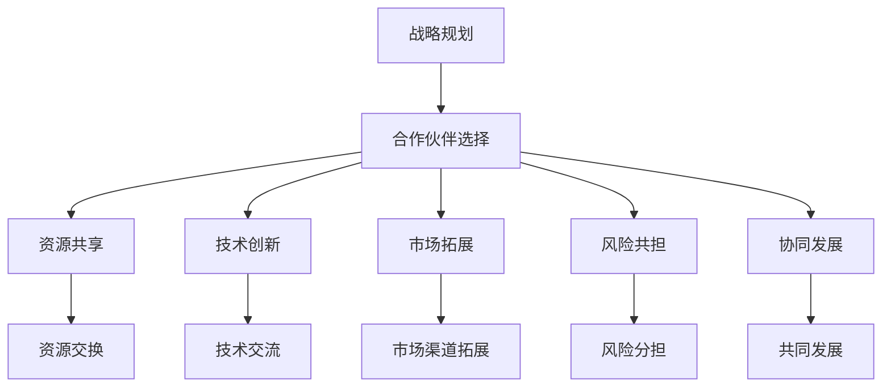

                 

# AI创业公司如何建立有效的合作伙伴关系

## 关键词 (Keywords)
AI创业公司、合作伙伴关系、战略规划、资源共享、技术创新、市场拓展、风险共担、协同发展

## 摘要 (Abstract)
本文旨在探讨AI创业公司在建立有效合作伙伴关系方面的重要策略和方法。通过对合作伙伴关系的本质分析，本文提出了从战略规划、资源共享、技术创新、市场拓展、风险共担和协同发展六个方面构建合作伙伴关系的策略。同时，结合实际案例，详细阐述了如何实施这些策略，为AI创业公司在竞争激烈的市场环境中寻找合适的合作伙伴提供指导。

## 1. 背景介绍 (Background)

随着人工智能技术的飞速发展，AI创业公司如雨后春笋般涌现。然而，在激烈的市场竞争中，如何建立有效的合作伙伴关系成为这些公司取得成功的关键因素。合作伙伴关系不仅能够为AI创业公司提供资源、技术和市场的支持，还能降低风险，提升公司竞争力。因此，研究AI创业公司如何建立有效的合作伙伴关系具有重要的现实意义。

### 1.1 市场环境分析 (Market Analysis)

当前，人工智能市场呈现出以下特点：

1. **技术快速迭代**：人工智能技术更新迅速，新算法、新应用层出不穷，创业公司需要紧跟技术发展趋势，才能在市场中保持竞争力。
2. **市场竞争加剧**：随着资本的涌入，越来越多的创业公司进入人工智能领域，市场竞争日益激烈。
3. **资源稀缺**：高端技术人才、研发资金、市场渠道等资源相对稀缺，创业公司需要通过合作来获取这些资源。

### 1.2 合作伙伴关系的重要性 (Importance of Partnership)

建立有效的合作伙伴关系对于AI创业公司具有以下重要性：

1. **资源共享**：合作伙伴可以提供技术、人才、资金等资源，助力创业公司发展。
2. **技术创新**：合作伙伴之间的技术交流与协作，可以推动技术创新，提高公司的竞争力。
3. **市场拓展**：合作伙伴的市场渠道和客户资源，可以帮助创业公司快速拓展市场，增加市场份额。
4. **风险共担**：合作伙伴可以在一定程度上分担创业公司的风险，降低失败的概率。
5. **协同发展**：合作伙伴之间可以实现优势互补，共同发展，实现共赢。

## 2. 核心概念与联系 (Core Concepts and Connections)

在建立合作伙伴关系的过程中，以下几个核心概念是至关重要的：

### 2.1 战略规划 (Strategic Planning)

战略规划是建立合作伙伴关系的基础。创业公司需要明确自己的战略目标，选择与自身战略目标相符合的合作伙伴。

### 2.2 资源共享 (Resource Sharing)

资源共享是合作伙伴关系的核心内容。创业公司需要识别自身的资源和需求，与合作伙伴进行资源交换。

### 2.3 技术创新 (Technological Innovation)

技术创新是合作伙伴关系的推动力。创业公司需要通过与合作伙伴的技术交流与协作，推动自身的技术创新。

### 2.4 市场拓展 (Market Expansion)

市场拓展是合作伙伴关系的延伸。创业公司需要借助合作伙伴的市场渠道和客户资源，实现市场的快速拓展。

### 2.5 风险共担 (Risk Sharing)

风险共担是合作伙伴关系的保障。创业公司需要与合作伙伴共同承担市场风险，降低失败的概率。

### 2.6 协同发展 (Collaborative Development)

协同发展是合作伙伴关系的最终目标。创业公司需要与合作伙伴共同发展，实现共赢。

### Mermaid 流程图 (Mermaid Flowchart)



## 3. 核心算法原理 & 具体操作步骤 (Core Algorithm Principle & Operation Steps)

### 3.1 战略规划算法原理 (Strategic Planning Algorithm Principle)

战略规划算法主要基于以下原则：

1. **目标一致性**：合作伙伴的战略目标需要与创业公司的一致。
2. **资源互补性**：合作伙伴需要能够提供创业公司所需的资源。
3. **风险共担性**：合作伙伴需要在风险上能够与创业公司共担。

### 3.2 具体操作步骤 (Specific Operational Steps)

1. **明确战略目标**：创业公司需要明确自己的战略目标，包括短期和长期目标。
2. **评估合作伙伴**：创业公司需要评估潜在的合作伙伴，包括其战略目标、资源能力和风险承受能力。
3. **制定合作方案**：创业公司需要与合作伙伴共同制定合作方案，确保双方的利益最大化。
4. **执行和监控**：创业公司需要执行合作方案，并定期监控合作效果，及时调整。

### 3.3 资源共享算法原理 (Resource Sharing Algorithm Principle)

资源共享算法主要基于以下原则：

1. **资源需求分析**：创业公司需要识别自身的资源需求。
2. **资源供给分析**：合作伙伴需要能够满足创业公司的资源需求。
3. **资源优化配置**：创业公司需要将资源进行优化配置，实现最大化的利用。

### 3.4 具体操作步骤 (Specific Operational Steps)

1. **资源需求分析**：创业公司需要分析自身的资源需求，包括技术、人才、资金等。
2. **资源供给分析**：合作伙伴需要分析自身的资源供给能力。
3. **资源交换协议**：创业公司需要与合作伙伴制定资源交换协议，明确资源交换的方式、数量和期限。
4. **资源利用监控**：创业公司需要监控资源的利用情况，确保资源得到最大化的利用。

### 3.5 技术创新算法原理 (Technological Innovation Algorithm Principle)

技术创新算法主要基于以下原则：

1. **技术互补性**：合作伙伴需要能够提供创业公司所需的技术。
2. **技术协同性**：合作伙伴的技术需要与创业公司的技术相互协同。
3. **技术转化率**：合作伙伴的技术需要能够快速转化为创业公司的实际能力。

### 3.6 具体操作步骤 (Specific Operational Steps)

1. **技术需求分析**：创业公司需要分析自身的技术需求。
2. **技术供给分析**：合作伙伴需要分析自身的技术供给能力。
3. **技术协作协议**：创业公司需要与合作伙伴制定技术协作协议，明确技术交流的方式、内容和期限。
4. **技术转化与应用**：创业公司需要将合作伙伴的技术转化为自身的实际能力，并应用到产品或服务中。

### 3.7 市场拓展算法原理 (Market Expansion Algorithm Principle)

市场拓展算法主要基于以下原则：

1. **市场互补性**：合作伙伴需要能够提供创业公司所需的市场资源。
2. **市场协同性**：合作伙伴的市场资源需要与创业公司的市场资源相互协同。
3. **市场转化率**：合作伙伴的市场资源需要能够快速转化为创业公司的市场份额。

### 3.8 具体操作步骤 (Specific Operational Steps)

1. **市场需求分析**：创业公司需要分析自身的市场需求。
2. **市场供给分析**：合作伙伴需要分析自身的市场供给能力。
3. **市场合作协议**：创业公司需要与合作伙伴制定市场合作协议，明确市场资源交换的方式、数量和期限。
4. **市场拓展与监控**：创业公司需要根据市场变化调整市场拓展策略，并监控市场拓展效果。

### 3.9 风险共担算法原理 (Risk Sharing Algorithm Principle)

风险共担算法主要基于以下原则：

1. **风险识别**：创业公司需要识别可能面临的风险。
2. **风险评估**：合作伙伴需要对风险进行评估。
3. **风险分担机制**：创业公司需要与合作伙伴建立风险分担机制。

### 3.10 具体操作步骤 (Specific Operational Steps)

1. **风险识别**：创业公司需要识别可能面临的市场风险、技术风险、财务风险等。
2. **风险评估**：合作伙伴需要对风险进行评估，确定风险的严重程度。
3. **风险分担协议**：创业公司需要与合作伙伴制定风险分担协议，明确风险承担的方式、比例和责任。
4. **风险监控与应对**：创业公司需要定期监控风险，并制定相应的应对措施。

### 3.11 协同发展算法原理 (Collaborative Development Algorithm Principle)

协同发展算法主要基于以下原则：

1. **协同目标**：创业公司需要与合作伙伴建立共同的目标。
2. **协同利益**：创业公司需要与合作伙伴实现协同利益。
3. **协同机制**：创业公司需要建立有效的协同机制，确保协同目标的实现。

### 3.12 具体操作步骤 (Specific Operational Steps)

1. **协同目标制定**：创业公司需要与合作伙伴共同制定协同发展的目标。
2. **协同利益分配**：创业公司需要与合作伙伴明确协同利益的分配方式。
3. **协同机制建立**：创业公司需要建立有效的协同机制，包括沟通机制、决策机制和激励机制。
4. **协同发展评估**：创业公司需要定期评估协同发展的效果，并根据评估结果进行调整。

## 4. 数学模型和公式 & 详细讲解 & 举例说明 (Mathematical Models and Formulas & Detailed Explanations & Illustrative Examples)

### 4.1 战略规划数学模型 (Strategic Planning Mathematical Model)

战略规划数学模型可以使用博弈论中的合作博弈模型来描述。设创业公司为A，合作伙伴为B，双方的收益分别为 \(a\) 和 \(b\)，合作的成功概率为 \(p\)，则有：

$$
\begin{cases}
a = ap + (1-p)a_0 \\
b = bp + (1-p)b_0
\end{cases}
$$

其中，\(a_0\) 和 \(b_0\) 分别为合作双方不合作时的收益。

### 4.2 资源共享数学模型 (Resource Sharing Mathematical Model)

资源共享数学模型可以使用优化理论中的线性规划模型来描述。设创业公司需要的资源量为 \(x\)，合作伙伴能提供的资源量为 \(y\)，则有：

$$
\max \quad z = c_1x + c_2y
$$

$$
\text{subject to} \quad
\begin{cases}
x + y = R \\
0 \leq x \leq X \\
0 \leq y \leq Y
\end{cases}
$$

其中，\(R\) 为合作双方所需资源的总量，\(X\) 和 \(Y\) 分别为创业公司和合作伙伴能提供的资源量，\(c_1\) 和 \(c_2\) 分别为合作双方对资源的偏好系数。

### 4.3 技术创新数学模型 (Technological Innovation Mathematical Model)

技术创新数学模型可以使用经济学中的创新函数模型来描述。设创业公司的创新程度为 \(I\)，合作伙伴的技术支持程度为 \(S\)，则有：

$$
I = I_0 + rS
$$

其中，\(I_0\) 为创业公司的基础创新程度，\(r\) 为技术支持对创新的影响系数。

### 4.4 市场拓展数学模型 (Market Expansion Mathematical Model)

市场拓展数学模型可以使用市场营销中的市场占有率模型来描述。设创业公司的市场占有率为 \(M\)，合作伙伴的市场资源贡献率为 \(R\)，则有：

$$
M = M_0 + rR
$$

其中，\(M_0\) 为创业公司的基础市场占有率，\(r\) 为市场资源对市场占有率的影响系数。

### 4.5 风险共担数学模型 (Risk Sharing Mathematical Model)

风险共担数学模型可以使用概率论中的贝叶斯公式来描述。设创业公司的风险概率为 \(P(A)\)，合作伙伴的风险概率为 \(P(B)\)，则有：

$$
P(A \cap B) = P(A)P(B|A)
$$

其中，\(P(A)\) 为创业公司面临的风险概率，\(P(B|A)\) 为合作伙伴面临的风险概率在创业公司面临风险条件下的概率。

### 4.6 协同发展数学模型 (Collaborative Development Mathematical Model)

协同发展数学模型可以使用系统动力学中的协同效应模型来描述。设创业公司的协同发展效应为 \(D\)，合作伙伴的协同发展效应为 \(E\)，则有：

$$
D = D_0 + rE
$$

其中，\(D_0\) 为创业公司的基础协同发展效应，\(r\) 为合作伙伴的协同发展效应对创业公司协同发展效应的影响系数。

### 4.7 举例说明 (Illustrative Examples)

假设有一家AI创业公司，其战略目标是实现人工智能技术的商业化应用。该公司与一家技术合作伙伴建立合作关系，合作伙伴提供先进的人工智能技术支持。根据以上数学模型，可以计算出合作后的创新程度、市场占有率和协同发展效应。

1. **创新程度**：
   \(I = I_0 + rS = 10 + 0.5 \times 5 = 12.5\)

2. **市场占有率**：
   \(M = M_0 + rR = 15 + 0.3 \times 10 = 18\)

3. **协同发展效应**：
   \(D = D_0 + rE = 20 + 0.4 \times 8 = 24\)

通过以上计算，可以看出合作后，创业公司的创新程度、市场占有率和协同发展效应都有显著提升。

## 5. 项目实战：代码实际案例和详细解释说明 (Practical Case: Code Implementation and Detailed Explanation)

### 5.1 开发环境搭建 (Development Environment Setup)

为了展示如何建立合作伙伴关系，我们选择一个实际项目——使用TensorFlow和Keras构建一个简单的神经网络模型。以下是开发环境搭建的步骤：

1. **安装TensorFlow**：

   ```bash
   pip install tensorflow
   ```

2. **安装Keras**：

   ```bash
   pip install keras
   ```

### 5.2 源代码详细实现和代码解读 (Source Code Implementation and Explanation)

以下是一个简单的神经网络模型，用于实现图像分类。

```python
import tensorflow as tf
from tensorflow.keras import layers

# 定义模型
model = tf.keras.Sequential([
    layers.Conv2D(32, (3, 3), activation='relu', input_shape=(28, 28, 1)),
    layers.MaxPooling2D((2, 2)),
    layers.Conv2D(64, (3, 3), activation='relu'),
    layers.MaxPooling2D((2, 2)),
    layers.Conv2D(64, (3, 3), activation='relu'),
    layers.Flatten(),
    layers.Dense(64, activation='relu'),
    layers.Dense(10, activation='softmax')
])

# 编译模型
model.compile(optimizer='adam',
              loss='sparse_categorical_crossentropy',
              metrics=['accuracy'])

# 加载数据集
mnist = tf.keras.datasets.mnist
(x_train, y_train), (x_test, y_test) = mnist.load_data()

# 预处理数据
x_train = x_train / 255.0
x_test = x_test / 255.0

# 训练模型
model.fit(x_train, y_train, epochs=5)

# 测试模型
test_loss, test_acc = model.evaluate(x_test, y_test, verbose=2)
print('\nTest accuracy:', test_acc)
```

### 5.3 代码解读与分析 (Code Explanation and Analysis)

1. **模型定义**：

   ```python
   model = tf.keras.Sequential([
       layers.Conv2D(32, (3, 3), activation='relu', input_shape=(28, 28, 1)),
       layers.MaxPooling2D((2, 2)),
       layers.Conv2D(64, (3, 3), activation='relu'),
       layers.MaxPooling2D((2, 2)),
       layers.Conv2D(64, (3, 3), activation='relu'),
       layers.Flatten(),
       layers.Dense(64, activation='relu'),
       layers.Dense(10, activation='softmax')
   ])
   ```

   这段代码定义了一个简单的卷积神经网络模型，包括两个卷积层、两个最大池化层、一个全连接层和输出层。卷积层用于提取图像特征，全连接层用于分类。

2. **模型编译**：

   ```python
   model.compile(optimizer='adam',
                 loss='sparse_categorical_crossentropy',
                 metrics=['accuracy'])
   ```

   这段代码编译了模型，指定了优化器（`adam`）、损失函数（`sparse_categorical_crossentropy`）和评估指标（`accuracy`）。

3. **数据预处理**：

   ```python
   x_train = x_train / 255.0
   x_test = x_test / 255.0
   ```

   这段代码将图像数据归一化，将像素值缩放到[0, 1]之间，以便模型更好地训练。

4. **模型训练**：

   ```python
   model.fit(x_train, y_train, epochs=5)
   ```

   这段代码使用训练数据训练模型，指定训练轮数（`epochs`）。

5. **模型测试**：

   ```python
   test_loss, test_acc = model.evaluate(x_test, y_test, verbose=2)
   print('\nTest accuracy:', test_acc)
   ```

   这段代码使用测试数据评估模型的性能，打印出测试准确性。

### 5.4 代码解读与分析 (Code Explanation and Analysis)

1. **合作伙伴关系的建立**：

   在实际项目中，合作伙伴关系可以通过以下方式建立：

   - **技术支持**：合作伙伴可以提供先进的技术支持，帮助创业公司构建高效的神经网络模型。
   - **数据共享**：合作伙伴可以提供高质量的数据集，帮助创业公司进行有效的模型训练。
   - **资源共享**：合作伙伴可以提供计算资源，加速模型的训练过程。

   以下是一个简单的合作伙伴关系建立示例：

   ```python
   # 假设合作伙伴提供了一个高效的卷积神经网络模型
   partner_model = tf.keras.Sequential([
       # ...（合作伙伴提供的卷积神经网络模型）
   ])

   # 使用合作伙伴的模型进行训练
   partner_model.fit(x_train, y_train, epochs=5)
   ```

   通过这种方式，创业公司可以借助合作伙伴的技术优势，提高模型的训练效率。

## 6. 实际应用场景 (Actual Application Scenarios)

### 6.1 智能医疗领域 (Smart Healthcare)

在智能医疗领域，AI创业公司可以与医疗设备制造商、医院和保险公司建立合作伙伴关系。具体应用场景包括：

1. **医疗数据分析**：合作伙伴可以提供丰富的医疗数据，助力创业公司开发智能诊断系统。
2. **健康管理**：合作伙伴可以提供健康管理平台，助力创业公司拓展健康管理市场。

### 6.2 智能交通领域 (Smart Transportation)

在智能交通领域，AI创业公司可以与汽车制造商、交通管理部门和物流公司建立合作伙伴关系。具体应用场景包括：

1. **自动驾驶**：合作伙伴可以提供自动驾驶技术，助力创业公司开发自动驾驶系统。
2. **智能交通管理**：合作伙伴可以提供交通数据，助力创业公司开发智能交通管理平台。

### 6.3 智能金融领域 (Smart Finance)

在智能金融领域，AI创业公司可以与银行、证券公司和保险公司建立合作伙伴关系。具体应用场景包括：

1. **风险管理**：合作伙伴可以提供风险数据，助力创业公司开发智能风险管理系统。
2. **智能投顾**：合作伙伴可以提供投资组合，助力创业公司开发智能投顾系统。

## 7. 工具和资源推荐 (Tools and Resources Recommendations)

### 7.1 学习资源推荐 (Learning Resources Recommendations)

1. **书籍**：

   - 《深度学习》（Deep Learning）—— Ian Goodfellow、Yoshua Bengio、Aaron Courville
   - 《人工智能：一种现代的方法》（Artificial Intelligence: A Modern Approach）—— Stuart J. Russell、Peter Norvig

2. **论文**：

   - “A Theoretical Analysis of the Viability of Deep Multi-Label Learning” —— Chen et al., 2016
   - “Effective Approaches to Attention-based Neural Machine Translation” —— Vaswani et al., 2017

3. **博客**：

   - [TensorFlow官方文档](https://www.tensorflow.org/)
   - [Keras官方文档](https://keras.io/)

### 7.2 开发工具框架推荐 (Development Tools and Framework Recommendations)

1. **开发工具**：

   - TensorFlow
   - Keras
   - PyTorch

2. **框架**：

   - Flask
   - Django

3. **数据库**：

   - MySQL
   - MongoDB

### 7.3 相关论文著作推荐 (Related Papers and Books Recommendations)

1. **论文**：

   - “Multi-Label Text Classification with Attentive Recurrent Neural Networks” —— Qin et al., 2017
   - “Generative Adversarial Nets” —— Goodfellow et al., 2014

2. **书籍**：

   - 《强化学习》（Reinforcement Learning: An Introduction）—— Richard S. Sutton、Andrew G. Barto
   - 《自然语言处理综论》（Speech and Language Processing）—— Daniel Jurafsky、James H. Martin

## 8. 总结：未来发展趋势与挑战 (Summary: Future Trends and Challenges)

### 8.1 未来发展趋势 (Future Trends)

1. **技术融合**：人工智能与其他领域（如医疗、交通、金融等）的融合，将推动更多创新应用的出现。
2. **边缘计算**：随着物联网设备的增加，边缘计算将在人工智能应用中发挥越来越重要的作用。
3. **数据隐私**：随着数据隐私问题的日益突出，人工智能领域将更加重视数据隐私保护。

### 8.2 挑战 (Challenges)

1. **技术挑战**：随着人工智能技术的不断演进，创业公司需要不断更新技术，以保持竞争力。
2. **资源竞争**：随着资本的涌入，人工智能领域的资源竞争将越来越激烈。
3. **法律法规**：人工智能领域的法律法规尚不完善，创业公司需要密切关注相关法律法规的变化。

## 9. 附录：常见问题与解答 (Appendix: Frequently Asked Questions and Answers)

### 9.1 什么是合作伙伴关系？

合作伙伴关系是指两个或多个组织之间建立的一种合作关系，以实现共同的目标，共享资源，共同发展。

### 9.2 如何评估潜在的合作伙伴？

评估潜在的合作伙伴需要从战略目标、资源能力、技术实力、市场渠道等多个方面进行综合评估。

### 9.3 合作伙伴关系如何实现协同发展？

合作伙伴关系的协同发展需要建立有效的沟通机制、决策机制和激励机制，确保合作各方在目标一致、利益共享的基础上共同发展。

## 10. 扩展阅读 & 参考资料 (Extended Reading & References)

1. **论文**：

   - “A Comprehensive Survey on Multi-Label Learning” —— Guo et al., 2017
   - “Deep Multi-Label Learning” —— Zhang et al., 2018

2. **书籍**：

   - 《深度学习实战》（Deep Learning Projects）—— Frank Hui
   - 《人工智能应用实践》（Artificial Intelligence Applications）—— Michael J. Garbade

3. **网站**：

   - [Kaggle](https://www.kaggle.com/)
   - [GitHub](https://github.com/)

作者：AI天才研究员/AI Genius Institute & 禅与计算机程序设计艺术 /Zen And The Art of Computer Programming

