                 

# AI创业公司如何进行商业模式创新?

> 关键词：商业模式创新、AI创业、市场定位、技术驱动、客户需求

> 摘要：本文旨在探讨AI创业公司在商业模式创新方面的策略与路径，通过对市场趋势、技术演进和客户需求的深入分析，结合实际案例，提出一套系统化的商业模式创新框架，以期为AI创业公司提供有价值的参考。

## 1. 背景介绍

近年来，人工智能（AI）技术迅速发展，已渗透到各行各业，从智能制造、智慧医疗到金融服务、自动驾驶，AI的应用场景越来越广泛。然而，随着市场竞争的加剧和技术的快速迭代，AI创业公司面临前所未有的挑战。如何找到一条可持续发展的商业模式，成为许多创业公司亟需解决的问题。

商业模式创新不仅是企业获取竞争优势的关键，更是企业生存与发展的基础。对于AI创业公司而言，商业模式创新尤为重要。一方面，AI技术的高成本、高风险特性使得创业公司需要找到一种既能降低成本、提高效率，又能满足客户需求的有效途径；另一方面，随着市场的不断变化和客户需求的多样化，AI创业公司需要具备快速响应市场变化的能力。

本文将围绕AI创业公司的商业模式创新进行深入探讨，结合市场趋势、技术演进和客户需求，提出一套系统化的商业模式创新框架。通过本文的阅读，读者可以了解到：

1. AI创业公司的商业模式创新的必要性；
2. 商业模式创新的核心要素及重要性；
3. 商业模式创新的具体方法和实践路径；
4. AI创业公司在商业模式创新中面临的主要挑战及应对策略。

## 2. 核心概念与联系

### 商业模式

商业模式是指企业通过产品或服务满足客户需求，从而实现利润最大化的方式。一个成功的商业模式应具备以下特点：

1. 创造价值：为客户提供独特的价值，满足其需求；
2. 成本效益：在创造价值的同时，实现成本效益最大化；
3. 可持续发展：具备长期发展的潜力，能够在市场竞争中保持优势。

### 市场趋势

随着科技的进步和消费者需求的变化，市场趋势也在不断演变。以下是一些影响AI创业公司商业模式创新的关键市场趋势：

1. **数字化转型**：越来越多的企业将数字化转型作为战略重点，AI技术在其中发挥着重要作用；
2. **个性化服务**：消费者对个性化、定制化服务的需求日益增长，AI技术可以提供更加精准的服务；
3. **跨界融合**：不同行业之间的融合趋势愈发明显，AI技术为跨界创新提供了可能；
4. **可持续发展**：随着环境问题的加剧，可持续发展成为企业关注的重要议题。

### 技术演进

技术演进是商业模式创新的重要驱动力。以下是一些与AI创业公司商业模式创新相关的重要技术趋势：

1. **深度学习**：深度学习技术在图像识别、自然语言处理等领域的突破，为AI创业公司提供了丰富的应用场景；
2. **云计算**：云计算的普及使得创业公司可以更加便捷地获取计算资源，降低研发成本；
3. **物联网**：物联网技术的发展，使得设备之间的互联互通成为可能，为AI创业公司提供了新的商业模式；
4. **区块链**：区块链技术的兴起，为AI创业公司提供了新的信任机制和数据安全保障。

### 客户需求

客户需求是商业模式创新的出发点和落脚点。以下是一些与AI创业公司商业模式创新相关的关键客户需求：

1. **效率提升**：消费者和企业对效率提升的需求日益强烈，AI技术可以提供高效的解决方案；
2. **个性化体验**：消费者对个性化、定制化体验的追求，为AI创业公司提供了市场机会；
3. **安全性**：随着数据隐私问题的日益突出，消费者对数据安全的需求越来越高；
4. **可持续发展**：消费者对企业社会责任的关注度不断提升，可持续发展的商业模式将受到更多青睐。

### 商业模式创新

商业模式创新是指通过创造新的价值主张、重构价值链、优化成本结构等方式，实现企业利润增长和市场竞争力的提升。对于AI创业公司而言，商业模式创新是应对市场变化、技术演进和客户需求变化的关键策略。

### 关联图

以下是一个描述AI创业公司商业模式创新核心概念的Mermaid流程图：

```mermaid
graph TB
A[市场需求] --> B[技术趋势]
A --> C[商业模式创新]
B --> C
D[价值主张] --> C
E[成本结构] --> C
F[可持续性] --> C
G[竞争力提升] --> C
H[利润增长] --> C
I[市场定位] --> C
J[客户需求] --> D
K[技术创新] --> B
L[行业趋势] --> B
M[合作伙伴关系] --> C
N[风险投资] --> C
O[运营效率] --> E
P[产品迭代] --> D
Q[数据安全] --> D
R[环境责任] --> F
S[社会责任] --> F
T[用户体验] --> D
U[客户满意度] --> G
V[市场份额] --> G
W[品牌影响力] --> G
X[市场份额] --> G
Y[合作伙伴关系] --> M
Z[供应链管理] --> E
AA[研发投入] --> B
AB[产品迭代] --> D
AC[市场调研] --> I
AD[客户反馈] --> T
AE[数据分析] --> J
AF[市场定位] --> I
AG[商业模式评估] --> C
AH[战略规划] --> C
AI[创新思维] --> C
AJ[商业模式调整] --> C
AK[竞争优势] --> G
AL[业务拓展] --> C
AM[技术升级] --> B
AN[合作拓展] --> M
AO[业务创新] --> C
AP[市场拓展] --> C
AQ[品牌建设] --> W
AR[用户体验优化] --> T
AS[运营优化] --> U
AT[数据分析与洞察] --> J
AU[商业模式优化] --> C
AV[产品创新] --> D
AW[成本控制] --> E
AX[创新思维培养] --> AI
AY[商业模式评估与优化] --> AG
```



### 总结

通过上述核心概念与联系的分析，我们可以看到，市场需求、技术演进和客户需求是驱动AI创业公司商业模式创新的重要因素。商业模式创新不仅是企业应对市场变化的战略，更是企业实现长期发展的重要手段。在接下来的章节中，我们将进一步探讨AI创业公司如何通过商业模式创新实现成功。

## 3. 核心算法原理 & 具体操作步骤

### 3.1 核心算法原理

在商业模式创新中，核心算法原理通常涉及以下几个方面：

1. **数据分析与挖掘**：通过对市场数据、客户需求、技术趋势等多维度数据进行分析和挖掘，发现潜在的商业机会和需求；
2. **用户行为分析**：通过分析用户行为数据，了解用户需求和行为模式，为商业模式创新提供有力支持；
3. **机器学习与预测**：利用机器学习算法，对市场趋势、客户需求进行预测，为商业模式创新提供决策依据；
4. **优化与模拟**：通过算法优化和模拟，评估不同商业模式的效果，选择最优方案。

### 3.2 具体操作步骤

以下是AI创业公司在商业模式创新中可以采用的具体操作步骤：

1. **明确业务目标**：在开始商业模式创新之前，首先要明确企业的业务目标和价值主张，确保商业模式创新的方向与业务目标一致；
2. **数据收集与处理**：收集与商业模式创新相关的市场数据、客户需求数据、技术趋势数据等，并对数据进行清洗、整合和分析；
3. **需求分析与挖掘**：通过对收集到的数据进行分析和挖掘，识别市场机会、客户需求、潜在竞争对手等信息；
4. **算法设计与实现**：根据需求分析与挖掘的结果，设计适合的算法模型，并实现算法的编程和部署；
5. **算法评估与优化**：对算法模型进行评估，分析其在实际应用中的效果，并根据评估结果对算法进行优化；
6. **商业模式设计与验证**：根据算法模型的结果，设计新的商业模式，并进行验证，确保商业模式能够满足市场需求；
7. **商业模式实施与监控**：实施新的商业模式，并持续监控其效果，根据反馈进行调整和优化。

### 3.3 案例分析

以下是一个关于AI创业公司商业模式创新的案例：

**案例：一家提供智能客服解决方案的AI创业公司**

1. **业务目标**：该公司的业务目标是提供智能客服解决方案，帮助企业降低客服成本、提升客服效率；
2. **数据收集与处理**：公司收集了大量的客户咨询数据、客户反馈数据、竞争对手数据等，对数据进行了清洗、整合和分析；
3. **需求分析与挖掘**：通过数据分析，公司发现客户对智能客服的需求主要集中在快速响应、准确解答和个性化服务等方面；
4. **算法设计与实现**：公司设计并实现了基于深度学习的智能客服算法模型，通过训练和优化，使模型能够准确识别客户意图和提供合适的回答；
5. **算法评估与优化**：公司对算法模型进行了多次评估和优化，确保模型在实际应用中能够稳定运行和提供高质量的客服服务；
6. **商业模式设计与验证**：基于算法模型，公司设计了一套智能客服解决方案，包括智能客服机器人、客服专家系统等，并在实际客户中进行了验证；
7. **商业模式实施与监控**：公司实施智能客服解决方案，并与客户保持密切沟通，根据客户反馈进行优化和调整。

通过以上步骤，该公司成功地实现了商业模式创新，为企业提供了高效的智能客服解决方案，获得了客户的认可和市场的广泛好评。

### 3.4 结论

通过核心算法原理和具体操作步骤的介绍，我们可以看到，AI创业公司在商业模式创新中可以采用多种算法和技术手段，通过对数据分析和挖掘，设计并实现适合的商业模式。在实际操作中，公司需要根据业务目标和市场需求，灵活运用算法和技术，不断优化和调整商业模式，以实现商业成功。

## 4. 数学模型和公式 & 详细讲解 & 举例说明

### 4.1 数学模型

在商业模式创新中，常用的数学模型包括回归模型、聚类模型、决策树模型等。以下是一个简化的回归模型，用于预测客户需求：

$$
y = \beta_0 + \beta_1 x_1 + \beta_2 x_2 + ... + \beta_n x_n
$$

其中，$y$ 表示客户需求，$x_1, x_2, ..., x_n$ 表示影响客户需求的因素，$\beta_0, \beta_1, \beta_2, ..., \beta_n$ 表示模型参数。

### 4.2 模型讲解

1. **回归模型**：回归模型是一种常用的统计模型，用于分析变量之间的线性关系。在商业模式创新中，回归模型可以用于预测客户需求、分析市场趋势等。
2. **聚类模型**：聚类模型是一种无监督学习模型，用于将数据分为多个类别。在商业模式创新中，聚类模型可以用于分析客户群体、市场细分等。
3. **决策树模型**：决策树模型是一种分类模型，通过一系列条件判断，将数据分为不同的类别。在商业模式创新中，决策树模型可以用于分析客户行为、预测市场机会等。

### 4.3 模型应用

以下是一个回归模型的应用实例：

**实例：预测客户需求**

假设我们要预测客户对一款智能客服解决方案的需求，影响需求的因素包括客户满意度、客服响应速度和竞争对手情况。

$$
需求 = \beta_0 + \beta_1 \times 满意度 + \beta_2 \times 响应速度 + \beta_3 \times 竞争对手
$$

通过对历史数据的训练和验证，我们得到了以下参数估计：

$$
\beta_0 = 10, \beta_1 = 2, \beta_2 = 3, \beta_3 = -1
$$

根据这些参数，我们可以预测新客户的需求：

$$
需求 = 10 + 2 \times 满意度 + 3 \times 响应速度 - 1 \times 竞争对手
$$

例如，如果一个新客户的满意度为80%，响应速度为5分钟，竞争对手情况为2个，则其需求预测为：

$$
需求 = 10 + 2 \times 80% + 3 \times 5分钟 - 1 \times 2 = 21分钟
$$

### 4.4 模型评估

在商业模式创新中，模型评估非常重要。以下是一些常用的评估指标：

1. **准确率（Accuracy）**：预测正确的样本占总样本的比例。
2. **召回率（Recall）**：在所有实际为正类的样本中，被预测为正类的样本所占比例。
3. **精确率（Precision）**：在所有被预测为正类的样本中，实际为正类的样本所占比例。
4. **F1值（F1 Score）**：精确率和召回率的调和平均值。

例如，对于一个分类问题，如果预测结果如下：

| 实际类别 | 预测类别 |
| --- | --- |
| 正类 | 正类 |
| 正类 | 正类 |
| 正类 | 反类 |
| 反类 | 正类 |
| 反类 | 反类 |

则评估指标如下：

- 准确率：$ \frac{2+1}{5} = 0.8 $
- 召回率：$ \frac{2}{3} = 0.67 $
- 精确率：$ \frac{2}{3} = 0.67 $
- F1值：$ \frac{0.67 + 0.67}{2} = 0.67 $

### 4.5 结论

通过数学模型和公式的详细讲解和举例说明，我们可以看到，数学模型在商业模式创新中发挥着重要作用。创业公司可以利用这些模型，对客户需求、市场趋势等进行预测和分析，从而制定出更加科学的商业模式创新策略。

## 5. 项目实战：代码实际案例和详细解释说明

### 5.1 开发环境搭建

在开始实际案例之前，我们需要搭建一个适合AI创业公司进行商业模式创新的开发环境。以下是一个基本的开发环境搭建步骤：

1. **操作系统**：选择一个适合的操作系统，如Linux或MacOS；
2. **编程语言**：选择一个适合的编程语言，如Python或Java；
3. **开发工具**：安装集成开发环境（IDE），如PyCharm或Eclipse；
4. **库和框架**：安装必要的库和框架，如NumPy、Pandas、Scikit-learn等；
5. **版本控制**：使用版本控制工具，如Git，进行代码管理。

### 5.2 源代码详细实现和代码解读

以下是一个简单的Python代码案例，用于分析客户需求，帮助创业公司进行商业模式创新。

```python
# 导入必要的库
import numpy as np
import pandas as pd
from sklearn.model_selection import train_test_split
from sklearn.linear_model import LinearRegression
from sklearn.metrics import mean_squared_error

# 加载数据
data = pd.read_csv('customer_data.csv')

# 数据预处理
X = data[['satisfaction', 'response_time', 'competitor']]
y = data['demand']

# 数据划分
X_train, X_test, y_train, y_test = train_test_split(X, y, test_size=0.2, random_state=42)

# 模型训练
model = LinearRegression()
model.fit(X_train, y_train)

# 模型预测
y_pred = model.predict(X_test)

# 模型评估
mse = mean_squared_error(y_test, y_pred)
print("MSE:", mse)

# 输出模型参数
print("Model Parameters:")
print(model.coef_)

# 实际案例：预测新客户需求
new_data = np.array([[0.8, 5, 2]])
new_demand = model.predict(new_data)
print("Predicted Demand:", new_demand[0])
```

### 5.3 代码解读与分析

1. **导入库**：首先，我们导入必要的库，包括NumPy、Pandas、Scikit-learn等。
2. **加载数据**：使用Pandas库加载数据，数据包括客户满意度、客服响应速度和竞争对手情况等。
3. **数据预处理**：将数据分为特征矩阵X和目标向量y。
4. **数据划分**：使用train_test_split函数将数据划分为训练集和测试集。
5. **模型训练**：使用LinearRegression类创建线性回归模型，并使用fit方法进行训练。
6. **模型预测**：使用predict方法对测试集进行预测。
7. **模型评估**：计算预测误差，使用mean_squared_error函数计算均方误差（MSE）。
8. **输出模型参数**：输出模型参数，包括特征权重。
9. **实际案例**：使用训练好的模型预测新客户的需求。

### 5.4 结论

通过这个简单的代码案例，我们可以看到如何使用Python进行客户需求分析，从而帮助AI创业公司进行商业模式创新。在实际应用中，创业公司可以根据自身需求，扩展和优化这个代码案例，以适应不同的商业模式创新需求。

## 6. 实际应用场景

### 6.1 智能制造

在智能制造领域，AI创业公司可以通过商业模式创新，提供智能化的生产解决方案。例如，一家AI公司可以开发智能工厂管理系统，利用深度学习和机器学习算法，对生产过程进行实时监控和优化，提高生产效率和质量。商业模式可以包括：

1. **订阅模式**：企业按月或按年订阅智能工厂管理系统，按使用量收费；
2. **服务模式**：企业购买服务包，包括定期维护、升级和技术支持；
3. **收益分享模式**：与企业分享生产效率提升带来的收益，按效益收费。

### 6.2 智慧医疗

在智慧医疗领域，AI创业公司可以开发智能诊断、智能治疗和智能管理解决方案。例如，一家AI公司可以开发智能诊断系统，利用深度学习和图像处理技术，帮助医生快速、准确地诊断疾病。商业模式可以包括：

1. **销售模式**：企业购买智能诊断系统，一次性收费；
2. **租赁模式**：企业租赁智能诊断系统，按月或按年收费；
3. **合作模式**：与企业合作，共同开发和运营智能诊断系统。

### 6.3 智慧城市

在智慧城市领域，AI创业公司可以开发智能交通、智能能源和智能环境解决方案。例如，一家AI公司可以开发智能交通管理系统，利用实时交通数据，优化交通信号和道路规划，减少交通拥堵。商业模式可以包括：

1. **公共部门合作模式**：与政府部门合作，共同开发和运营智慧城市项目；
2. **订阅模式**：企业或居民按月或按年订阅智能服务，按使用量收费；
3. **收益分享模式**：与企业分享智能服务带来的收益，按效益收费。

### 6.4 金融服务

在金融服务领域，AI创业公司可以开发智能投顾、智能风控和智能理财解决方案。例如，一家AI公司可以开发智能投顾系统，利用大数据分析和机器学习算法，为投资者提供个性化的投资建议。商业模式可以包括：

1. **订阅模式**：投资者按月或按年订阅智能投顾服务，按使用量收费；
2. **收益分享模式**：与投资者分享投资收益，按效益收费；
3. **合作模式**：与金融机构合作，共同开发和运营智能金融服务。

### 6.5 可持续发展

在可持续发展领域，AI创业公司可以开发智能农业、智能环保和智能能源解决方案。例如，一家AI公司可以开发智能农业系统，利用物联网技术和大数据分析，优化农业生产过程，提高产量和质量。商业模式可以包括：

1. **公共部门合作模式**：与政府部门合作，共同开发和运营智能农业项目；
2. **订阅模式**：农场主按月或按年订阅智能农业服务，按使用量收费；
3. **收益分享模式**：与农场主分享智能农业带来的收益，按效益收费。

### 总结

通过实际应用场景的分析，我们可以看到，AI创业公司可以在多个领域进行商业模式创新。不同的应用场景需要不同的商业模式，创业公司需要根据自身优势和市场需求，灵活运用不同的商业模式，实现商业成功。

## 7. 工具和资源推荐

### 7.1 学习资源推荐

1. **书籍**：
   - 《深度学习》（Deep Learning） - Goodfellow, Bengio, Courville
   - 《Python机器学习》（Python Machine Learning） - Müller and Guido
   - 《商业模式创新》（Business Model Generation） - Osterwalder and Pigneur
2. **论文**：
   - "Deep Learning for Text Classification" - KDD 2017
   - "Customer Segmentation using Machine Learning Techniques" - IEEE Transactions on Knowledge and Data Engineering
3. **博客**：
   - Medium上的AI和商业模式创新相关博客
   - AI创业公司的官方博客和案例分析
4. **网站**：
   - Coursera、edX等在线课程平台上的AI和商业模式创新相关课程
   - GitHub上的AI创业公司开源项目

### 7.2 开发工具框架推荐

1. **编程语言**：
   - Python：广泛使用的编程语言，适用于数据分析和机器学习；
   - Java：强大的编程语言，适用于复杂系统的开发。
2. **开发环境**：
   - Jupyter Notebook：用于数据分析和机器学习的交互式开发环境；
   - IntelliJ IDEA、Eclipse：流行的集成开发环境（IDE），提供强大的开发工具。
3. **库和框架**：
   - NumPy、Pandas：用于数据处理和数据分析的库；
   - Scikit-learn、TensorFlow、PyTorch：用于机器学习的库和框架；
   - Flask、Django：用于Web开发的框架。

### 7.3 相关论文著作推荐

1. **《人工智能：一种现代方法》（Artificial Intelligence: A Modern Approach）** - Stuart J. Russell and Peter Norvig
2. **《机器学习》（Machine Learning）** - Tom Mitchell
3. **《大数据时代：生活、工作与思维的大变革》** - Viktor Mayer-Schönberger and Kenneth Cukier

### 总结

通过上述学习资源、开发工具框架和相关论文著作的推荐，AI创业公司可以系统地学习商业模式创新和机器学习相关的知识，提升自身的技术实力和创新能力。同时，合理选择和使用这些工具和资源，将有助于公司在商业模式创新中取得成功。

## 8. 总结：未来发展趋势与挑战

### 8.1 未来发展趋势

随着人工智能技术的不断进步，未来AI创业公司的商业模式创新将呈现出以下趋势：

1. **技术创新驱动**：AI技术将成为商业模式创新的驱动力，创业公司需要紧跟技术前沿，不断迭代产品和服务；
2. **跨界融合**：不同行业之间的融合趋势将愈发明显，AI创业公司将需要具备跨领域的创新能力，提供多样化的解决方案；
3. **个性化服务**：随着消费者对个性化服务的需求增长，AI创业公司将通过数据分析和个性化算法，提供更加精准和定制化的服务；
4. **可持续发展**：企业社会责任和环境保护将成为重要议题，AI创业公司将需要关注可持续发展，构建绿色、环保的商业模式。

### 8.2 挑战

尽管AI创业公司面临广阔的市场机遇，但同时也面临诸多挑战：

1. **技术门槛高**：AI技术的复杂性使得创业公司需要投入大量资源进行技术研发，技术门槛高；
2. **数据隐私和安全**：随着数据量的增长，数据隐私和安全问题日益突出，创业公司需要采取有效的数据保护措施；
3. **市场竞争激烈**：随着AI技术的普及，市场竞争将愈发激烈，创业公司需要具备强大的竞争力；
4. **政策法规限制**：政策法规的变化可能对AI创业公司的商业模式产生影响，创业公司需要密切关注政策动态，合规经营。

### 8.3 应对策略

为应对上述挑战，AI创业公司可以采取以下策略：

1. **持续技术创新**：保持对技术的持续投入和关注，不断提升技术实力和创新能力；
2. **数据保护与合规**：加强数据保护和合规意识，建立完善的数据安全管理体系；
3. **差异化竞争**：通过提供独特的价值主张和差异化服务，形成竞争优势；
4. **政策法规研究**：密切关注政策法规变化，合理调整商业模式，确保合规经营。

### 8.4 结论

未来，AI创业公司将在技术创新、跨界融合、个性化服务和可持续发展等方面展开激烈竞争。面对技术门槛、数据隐私、市场竞争和政策法规等多重挑战，创业公司需要不断提升自身能力，灵活应对市场变化，以实现长期发展。

## 9. 附录：常见问题与解答

### 9.1 常见问题

1. **如何确保商业模式创新的成功？**
   - 确保商业模式创新的成功，需要从市场需求、技术能力、团队协作、风险管理等多个方面进行全面考虑。具体措施包括：
     - 深入了解市场需求，确保商业模式能够满足客户需求；
     - 持续提升技术能力，确保产品和服务具有竞争力；
     - 建立高效的团队协作机制，确保项目顺利推进；
     - 制定合理的风险管理策略，降低项目风险。

2. **如何选择合适的商业模式？**
   - 选择合适的商业模式，需要综合考虑企业的资源、能力、市场需求和竞争环境。以下是一些建议：
     - 了解企业自身的优势和劣势，确定核心竞争力和价值主张；
     - 分析市场需求和竞争态势，选择能够满足客户需求的商业模式；
     - 考虑企业的资源情况，选择能够充分利用现有资源、降低成本的商业模式；
     - 借鉴行业内的成功案例，结合自身实际情况进行创新。

3. **如何确保商业模式创新的可持续性？**
   - 确保商业模式创新的可持续性，需要从以下几个方面入手：
     - 关注企业社会责任，确保商业模式符合社会责任要求；
     - 关注行业趋势和政策变化，及时调整商业模式；
     - 加强技术创新，保持产品的核心竞争力；
     - 建立良好的客户关系，确保客户持续需求。

### 9.2 解答

1. **如何确保商业模式创新的成功？**
   - 成功的商业模式创新需要具备以下几个要素：
     - **明确目标**：明确商业模式创新的目标，确保创新方向与企业发展目标一致；
     - **市场需求**：深入了解市场需求，确保商业模式能够满足客户需求；
     - **技术创新**：紧跟技术发展趋势，运用新技术提升产品和服务竞争力；
     - **团队协作**：建立高效的团队协作机制，确保项目顺利推进；
     - **风险管理**：制定合理的风险管理策略，降低项目风险。

2. **如何选择合适的商业模式？**
   - 选择合适的商业模式，需要从以下几个方面进行分析：
     - **资源分析**：评估企业自身的资源状况，包括资金、技术、人才等，选择适合自身能力的商业模式；
     - **市场分析**：研究市场需求和竞争态势，选择具有市场前景的商业模式；
     - **竞品分析**：分析竞争对手的商业模式，发现自身的竞争优势和差异化点；
     - **风险评估**：评估不同商业模式的潜在风险，选择风险可控的商业模式。

3. **如何确保商业模式创新的可持续性？**
   - 确保商业模式创新的可持续性，需要采取以下措施：
     - **持续创新**：关注技术进步和市场变化，持续进行商业模式创新；
     - **社会责任**：关注企业社会责任，确保商业模式符合社会责任要求；
     - **合规经营**：遵循政策法规，确保商业模式合规经营；
     - **客户关系**：建立良好的客户关系，确保客户持续需求。

## 10. 扩展阅读 & 参考资料

### 10.1 扩展阅读

1. **《商业模式创新：理论与实践》** - 张祥建
2. **《人工智能商业应用：案例与实践》** - 张英涛
3. **《智能时代：人工智能与商业模式创新》** - 刘锋

### 10.2 参考资料

1. **《商业模式画布》** - Alex Osterwalder and Yves Pigneur
2. **《深度学习》** - Ian Goodfellow, Yoshua Bengio, Aaron Courville
3. **《机器学习》** - Tom Mitchell
4. **《商业洞察：如何从数据中发现价值》** - V. Kumar and S. Kannan

### 10.3 网络资源

1. **AI创业公司案例研究** - https://aichuangke.com/
2. **商业模式创新课程** - https://www.coursera.org/
3. **AI技术前沿动态** - https://arxiv.org/

### 总结

通过本文的阅读，读者可以了解到AI创业公司如何进行商业模式创新。本文结合市场趋势、技术演进和客户需求，提出了一套系统化的商业模式创新框架，并通过实际案例和详细解释，展示了商业模式创新的实践方法。同时，文章还提供了扩展阅读和参考资料，以帮助读者深入了解商业模式创新和AI技术的相关内容。希望本文对AI创业公司以及关注商业模式创新的读者有所启发和帮助。

### 作者信息

- 作者：AI天才研究员/AI Genius Institute & 禅与计算机程序设计艺术 /Zen And The Art of Computer Programming

