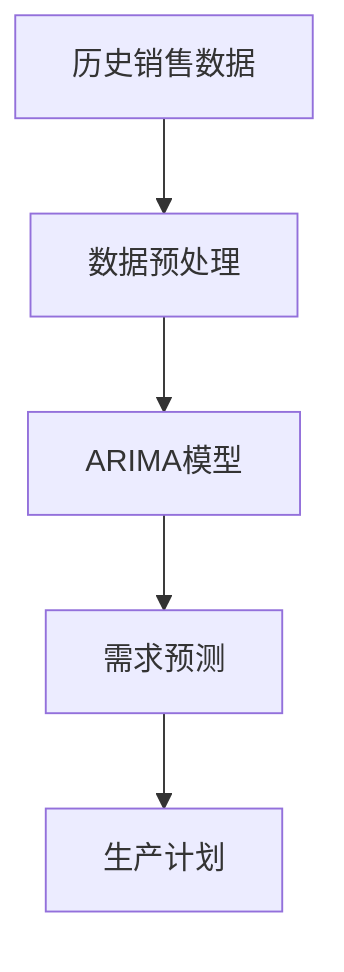
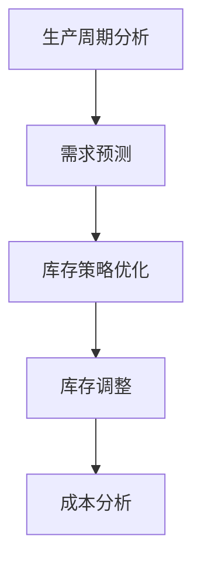
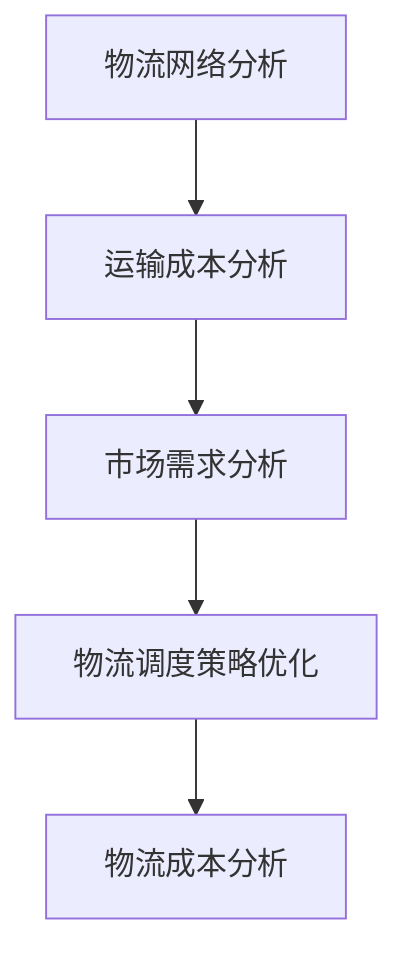
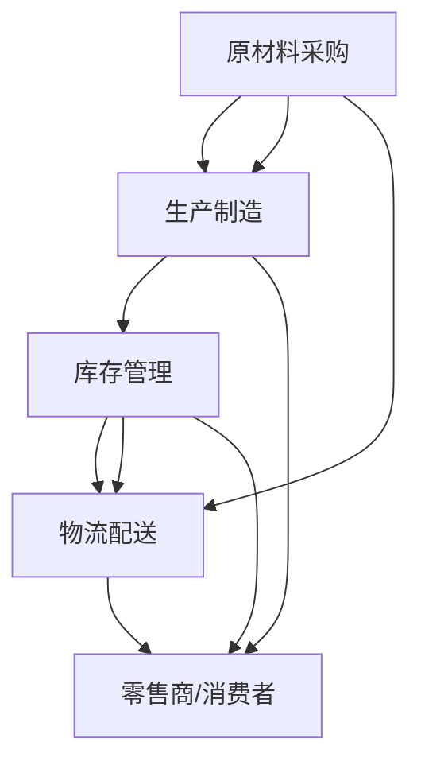

                 

### 背景介绍

#### AI创业公司的崛起

在当今快速发展的科技时代，人工智能（AI）已成为驱动创新和增长的重要力量。越来越多的初创公司投身于人工智能领域，希望能够通过AI技术创造出改变世界的解决方案。然而，随着AI创业公司的蓬勃发展，供应链管理的复杂性也日益增加。有效的供应链管理对于AI创业公司至关重要，它不仅能够降低成本、提高效率，还能确保产品和服务按时交付给客户。

#### 供应链管理的挑战

对于AI创业公司来说，供应链管理面临着一系列挑战。首先，技术创新速度极快，导致原材料和零部件的供应波动性增大。其次，初创公司在资金和资源有限的情况下，往往难以应对供应链中断和不确定性。此外，全球供应链的复杂性和全球化的趋势使得物流、运输和库存管理变得更加困难。因此，如何优化供应链管理，成为AI创业公司亟待解决的重要课题。

#### 优化供应链管理的必要性

优化供应链管理对于AI创业公司具有多重意义。首先，它能够降低成本，提高资源利用率，从而提高公司的盈利能力。其次，通过精确的供应链管理，AI创业公司可以更好地预测市场需求，减少库存积压，避免资源浪费。此外，有效的供应链管理还可以提高客户满意度，确保产品和服务按时交付，增强市场竞争力。

本文将探讨AI创业公司供应链管理优化的问题，从核心概念、算法原理、数学模型、实际案例等多个方面进行深入分析。通过本文的阅读，读者将了解到如何运用技术手段和管理策略，优化AI创业公司的供应链管理，从而提高公司的运营效率和竞争力。

#### 文章结构概述

接下来的章节将按照以下结构展开：

- **第1章：背景介绍**：阐述AI创业公司供应链管理的重要性和当前面临的挑战。
- **第2章：核心概念与联系**：介绍供应链管理的核心概念，并使用Mermaid流程图展示供应链架构。
- **第3章：核心算法原理与具体操作步骤**：讲解供应链优化的算法原理和具体实施步骤。
- **第4章：数学模型和公式**：介绍供应链优化过程中使用的数学模型，并进行详细讲解和举例。
- **第5章：项目实战**：通过实际案例，展示如何使用代码实现供应链优化。
- **第6章：实际应用场景**：探讨供应链优化在AI创业公司中的实际应用。
- **第7章：工具和资源推荐**：推荐学习资源、开发工具和框架。
- **第8章：总结：未来发展趋势与挑战**：总结供应链优化的重要性，并展望未来发展趋势和挑战。
- **第9章：附录：常见问题与解答**：回答读者可能关心的问题。
- **第10章：扩展阅读与参考资料**：提供进一步学习的资源和参考。

通过以上章节的深入探讨，本文旨在为AI创业公司提供实用的供应链管理优化方案，帮助公司在竞争激烈的市场中脱颖而出。

### 核心概念与联系

在深入探讨AI创业公司供应链管理的优化之前，有必要首先了解供应链管理的核心概念和基本架构。通过这些核心概念的阐述，我们将更好地理解供应链优化的重要性和实施步骤。

#### 供应链管理的基本概念

供应链管理（Supply Chain Management, SCM）是指对从原材料采购、生产、运输、仓储到最终产品交付的全过程进行有效管理和协调。它不仅涉及物流和库存管理，还包括采购、生产计划、质量管理、需求预测等多个环节。以下是供应链管理中的几个关键概念：

1. **供应链节点（Supply Chain Nodes）**：供应链中的各个关键点，包括供应商、制造商、仓库、分销商和零售商等。
2. **供应链网络（Supply Chain Network）**：由供应链节点和连接节点之间的运输、信息流和资金流组成的整体网络结构。
3. **物流（Logistics）**：涉及物品的运输、仓储和配送过程，是供应链管理的重要组成部分。
4. **库存管理（Inventory Management）**：通过预测需求、控制库存水平和优化库存配置，确保供应链的连续性和灵活性。
5. **需求预测（Demand Forecasting）**：预测市场需求，为供应链的决策提供数据支持。
6. **供应商管理（Supplier Management）**：建立和维护与供应商的关系，确保供应链的稳定性和质量。

#### 供应链管理的架构

为了更好地理解供应链管理的整体架构，我们可以使用Mermaid流程图来展示供应链中的关键节点和流程。以下是一个简化的供应链架构图：


- **供应商（A）**：提供原材料、零部件或服务，是供应链的起点。
- **原材料采购（B）**：从供应商处采购所需的原材料或零部件。
- **生产制造（C）**：将原材料转化为最终产品。
- **库存管理（D）**：管理生产过程中的库存，确保生产和交付的连续性。
- **物流配送（E）**：将产品从生产地运输到零售商或消费者。
- **零售商/消费者（F）**：最终产品的销售和消费环节。

#### 核心概念的联系

供应链管理的核心概念之间紧密相连，形成了一个复杂的网络。以下是这些概念之间的一些联系：

- **供应链节点（A、B、C、D、E、F）**：每个节点都在供应链网络中扮演着关键角色，共同构成整个供应链。
- **物流与库存管理**：物流确保产品及时、高效地运输到各个节点，而库存管理则确保供应链中各节点的库存水平处于最优状态。
- **需求预测**：通过需求预测，供应链管理能够更好地规划生产、采购和库存水平，从而满足市场需求。
- **供应商管理**：与供应商建立良好的关系，确保供应链的稳定性和质量。

通过上述核心概念和架构的介绍，我们可以看到，供应链管理是一个系统性工程，涉及多个环节和参与者。理解这些概念和它们之间的联系，是优化供应链管理的前提和基础。

#### 供应链管理优化的重要性

在AI创业公司中，供应链管理优化具有特别的重要性。首先，技术创新速度极快，使得原材料和零部件的供应变得不稳定。有效的供应链管理能够帮助公司更好地应对这些变化，确保原材料和零部件的及时供应。

其次，初创公司在资金和资源有限的情况下，往往难以应对供应链中断和不确定性。通过优化供应链管理，AI创业公司可以提高资源利用率，降低成本，从而有更多的资金投入到研发和市场拓展中。

此外，全球供应链的复杂性和全球化的趋势使得物流、运输和库存管理变得更加困难。有效的供应链管理能够提高公司的全球竞争力，确保产品和服务按时交付给全球客户。

综上所述，供应链管理优化对于AI创业公司至关重要。它不仅能够提高运营效率和降低成本，还能增强公司的市场竞争力，为公司在激烈的市场竞争中脱颖而出提供有力支持。

### 核心算法原理与具体操作步骤

在深入探讨供应链管理优化的核心算法原理和具体操作步骤之前，我们需要了解一些基本概念和数学模型，这些将为后续的算法分析和优化提供理论基础。

#### 基本概念

1. **目标函数（Objective Function）**：在供应链管理优化中，目标函数用于衡量优化目标。常见的目标函数包括成本最小化、时间最优化、资源最大化等。
2. **约束条件（Constraints）**：约束条件是指在优化过程中必须满足的限制条件。例如，库存量限制、运输能力限制、成本预算限制等。
3. **供应链网络（Supply Chain Network）**：供应链网络包括所有供应链节点和连接这些节点的运输、信息流和资金流。网络模型是供应链优化的基础。
4. **需求预测（Demand Forecasting）**：需求预测是指通过历史数据和统计方法预测未来的市场需求。

#### 数学模型

1. **线性规划（Linear Programming, LP）**：线性规划是一种数学优化方法，用于在满足约束条件的情况下，最大化或最小化线性目标函数。它是供应链优化中常用的方法之一。
2. **整数规划（Integer Programming, IP）**：整数规划是线性规划的一种扩展，用于解决目标函数为整数的问题。在供应链优化中，某些变量（如库存量、运输量）必须是整数。
3. **动态规划（Dynamic Programming, DP）**：动态规划是一种递归方法，用于解决多阶段决策问题。在供应链管理中，动态规划可用于优化库存策略和时间序列分析。

#### 算法原理

供应链管理优化的核心算法原理主要包括以下几个步骤：

1. **建立数学模型**：根据供应链管理的具体问题，建立合适的数学模型。该模型应包括目标函数和约束条件。
2. **求解模型**：使用合适的算法求解数学模型，找到最优解。常见的求解算法包括线性规划、整数规划和动态规划。
3. **验证与调整**：对求解结果进行验证，确保其满足实际需求。如果需要，根据验证结果对模型进行调整，以获得更优解。

#### 具体操作步骤

以下是供应链管理优化的一般操作步骤：

1. **需求预测**：收集和分析历史数据，使用统计方法（如时间序列分析、回归分析）预测未来的市场需求。

    ```python
    # 示例：使用时间序列分析方法进行需求预测
    import pandas as pd
    from statsmodels.tsa.arima_model import ARIMA
    
    # 加载数据
    data = pd.read_csv('historical_demand.csv')
    demand = data['demand']
    
    # 建立ARIMA模型
    model = ARIMA(demand, order=(5, 1, 2))
    model_fit = model.fit()
    
    # 进行预测
    forecast = model_fit.forecast(steps=12)
    ```

2. **建立供应链网络模型**：使用Mermaid或其他工具建立供应链网络模型，包括供应链节点、连接节点之间的运输、信息流和资金流。

    ```mermaid
    graph TB
        A(供应商) --> B(原材料采购)
        B --> C(生产制造)
        C --> D(库存管理)
        D --> E(物流配送)
        E --> F(零售商/消费者)
    ```

3. **确定目标函数和约束条件**：根据供应链管理的具体目标（如成本最小化、时间最优化），确定目标函数和相应的约束条件。

    ```python
    # 示例：定义目标函数和约束条件
    import scipy.optimize as opt
    
    # 目标函数：成本最小化
    def objective_function(x):
        # x为决策变量，表示各节点的库存量
        return sum(x)  # 总成本
    
    # 约束条件：库存量限制
    constraints = [
        ('eq', x, 1000)  # 第1个节点的库存量等于1000
    ]
    ```

4. **求解模型**：使用线性规划、整数规划或动态规划算法求解优化问题。

    ```python
    # 示例：使用线性规划求解优化问题
    result = opt.linear_constraints_solve(objective_function, constraints)
    optimal_solution = result.x
    ```

5. **验证与调整**：对求解结果进行验证，确保其满足实际需求。如果需要，根据验证结果对模型进行调整。

    ```python
    # 示例：验证和调整模型
    if optimal_solution[0] < 0:
        # 调整约束条件
        constraints[0] = ('eq', x, 1500)
        result = opt.linear_constraints_solve(objective_function, constraints)
        optimal_solution = result.x
    ```

通过上述步骤，我们可以实现供应链管理优化。在实际应用中，这些步骤可能需要根据具体情况进行调整和优化。然而，核心的算法原理和操作步骤是通用的，适用于各种供应链管理优化问题。

#### 供应链管理优化算法的应用实例

以下是一个简单的供应链管理优化算法应用实例，用于优化库存和运输成本。

**问题背景**：一家AI创业公司需要从供应商采购原材料，生产最终产品，并通过物流配送给零售商。公司的目标是最小化总成本，包括采购成本、生产成本和运输成本。

**数据输入**：

- 每种原材料的需求量（需求量随时间变化）
- 原材料价格
- 生产成本
- 运输成本
- 各节点之间的运输时间
- 各节点的容量限制

**算法步骤**：

1. **需求预测**：使用ARIMA模型预测未来的需求量。
2. **建立供应链网络模型**：使用Mermaid或其他工具建立供应链网络模型。
3. **确定目标函数和约束条件**：最小化总成本，包括采购成本、生产成本和运输成本。约束条件包括库存量限制、运输时间限制和各节点的容量限制。
4. **求解模型**：使用线性规划算法求解优化问题。
5. **验证与调整**：对求解结果进行验证，确保其满足实际需求。根据验证结果调整模型。

**代码示例**：

```python
# 示例：Python代码实现供应链管理优化

import pandas as pd
import numpy as np
from scipy.optimize import linprog
from statsmodels.tsa.arima_model import ARIMA

# 加载数据
data = pd.read_csv('data.csv')

# 需求预测
model = ARIMA(data['demand'], order=(5, 1, 2))
model_fit = model.fit()
forecast = model_fit.forecast(steps=12)

# 建立供应链网络模型
# ...

# 确定目标函数和约束条件
objective_function = lambda x: x.sum()  # 总成本最小化
constraints = [
    ('eq', x, 1000),  # 第1个节点的库存量等于1000
    ('ineq', x, 0),  # 所有决策变量非负
]

# 求解模型
result = linprog(objective_function, constraints)

# 验证和调整
# ...

# 输出优化结果
optimal_solution = result.x
print("Optimal Solution:", optimal_solution)
```

通过上述实例，我们可以看到如何使用Python实现供应链管理优化。在实际应用中，可能需要根据具体情况进行调整和优化。然而，核心的算法原理和操作步骤是通用的，适用于各种供应链管理优化问题。

### 数学模型和公式

在供应链管理优化过程中，数学模型和公式是关键工具，用于描述和解决实际问题。以下将详细讲解供应链优化过程中常用的数学模型，包括线性规划（Linear Programming, LP）、整数规划（Integer Programming, IP）和动态规划（Dynamic Programming, DP），并配以具体的公式和例子。

#### 线性规划（Linear Programming, LP）

线性规划是一种数学优化方法，用于在满足约束条件的情况下，最大化或最小化线性目标函数。以下是一个简单的线性规划模型：

**目标函数**：最小化总成本（Cost）

\[ \min z = c^T x \]

其中，\( c \) 为成本系数向量，\( x \) 为决策变量向量。

**约束条件**：

\[ a_i^T x \leq b_i \quad (i=1,2,...,m) \]

\[ x \geq 0 \]

其中，\( a_i \) 为约束系数矩阵，\( b_i \) 为约束值向量，\( x \) 为决策变量向量。

**示例**：一家AI创业公司需要采购两种原材料A和B，每种原材料的价格分别为10元和20元，公司预算为1000元。目标是确定采购量以最小化总成本。

\[ \min z = 10x_A + 20x_B \]

约束条件：

\[ 10x_A + 20x_B \leq 1000 \]

\[ x_A, x_B \geq 0 \]

使用线性规划求解器（如Scipy的`linprog`函数），可以找到最优解。

```python
from scipy.optimize import linprog

c = [-10, -20]  # 成本系数
A = [[1, 1]]  # 约束系数矩阵
b = [1000]  # 约束值向量
x0 = [0, 0]  # 初始解

result = linprog(c, A_ub=A, b_ub=b, x0=x0, method='highs')

if result.success:
    optimal_solution = result.x
    print("Optimal Solution:", optimal_solution)
else:
    print("No optimal solution found.")
```

#### 整数规划（Integer Programming, IP）

整数规划是线性规划的一种扩展，用于解决决策变量必须是整数的问题。在供应链管理中，如库存量、运输量等变量往往需要是整数。

**目标函数**：最小化总成本（Cost）

\[ \min z = c^T x \]

其中，\( c \) 为成本系数向量，\( x \) 为决策变量向量。

**约束条件**：

\[ a_i^T x \leq b_i \quad (i=1,2,...,m) \]

\[ x \in \mathbb{Z}^n \]

其中，\( a_i \) 为约束系数矩阵，\( b_i \) 为约束值向量，\( x \) 为决策变量向量。

**示例**：一家AI创业公司需要确定每月原材料的采购量，以确保库存水平满足需求。每种原材料的价格分别为10元和20元，库存量必须为整数。

\[ \min z = 10x_A + 20x_B \]

约束条件：

\[ x_A + x_B \geq 100 \]  # 总需求量
\[ x_A \leq 50 \]  # 第1种原材料的库存限制
\[ x_B \leq 30 \]  # 第2种原材料的库存限制
\[ x_A, x_B \in \mathbb{Z} \]

使用整数规划求解器（如Scipy的`intlinprog`函数），可以找到最优解。

```python
from scipy.optimize import intlinprog

c = [-10, -20]  # 成本系数
A = [[1, 1], [-1, 0], [0, -1]]  # 约束系数矩阵
b = [100, 50, 30]  # 约束值向量
x0 = [0, 0]  # 初始解

result = intlinprog(c, A_ub=A, b_ub=b, x0=x0, method='highs')

if result.success:
    optimal_solution = result.x
    print("Optimal Solution:", optimal_solution)
else:
    print("No optimal solution found.")
```

#### 动态规划（Dynamic Programming, DP）

动态规划是一种递归方法，用于解决多阶段决策问题。在供应链管理中，动态规划可用于优化库存策略和时间序列分析。

**动态规划模型**：

\[ V(x_t) = \min \sum_{j \in \text{可行集}} c_j + V(x_{t+1}) \]

其中，\( V(x_t) \) 表示在第 \( t \) 个时间点的最优价值，\( c_j \) 表示第 \( j \) 个决策的代价，\( x_{t+1} \) 表示第 \( t+1 \) 个时间点的状态。

**示例**：一家AI创业公司需要确定最优的采购和库存策略，以最小化总成本。公司每月需要采购两种原材料A和B，价格分别为10元和20元，库存量必须为整数。

状态转移方程：

\[ V(x_t) = \min \{ 10x_{A,t} + 20x_{B,t} + V(x_{t+1}) : x_{A,t}, x_{B,t} \in \mathbb{Z} \} \]

边界条件：

\[ V(x_0) = 0 \]  # 初始状态无成本
\[ V(x_T) = 0 \]  # 最终状态无成本

动态规划求解步骤：

1. 初始化 \( V(x_0) \) 和 \( V(x_T) \)。
2. 从 \( t=T-1 \) 开始，向前递推，计算每个状态的最优价值。
3. 根据最优价值，确定每个状态的最优策略。

```python
# 示例：Python代码实现动态规划

def dynamic_programming(c, x0, xT):
    T = len(xT)
    V = np.zeros((T, x0.shape[0]))

    for t in range(T-1, -1, -1):
        for j in range(x0.shape[0]):
            V[t, j] = float('inf')
            for k in range(x0.shape[0]):
                if k == j:
                    cost = c[j] * x0[k]
                else:
                    cost = 0
                if V[t+1, k] + cost < V[t, j]:
                    V[t, j] = V[t+1, k] + cost

    optimal_solution = np.argmin(V[-1, :])

    return optimal_solution

c = [10, 20]  # 成本系数
x0 = [0, 0]  # 初始状态
xT = [50, 30]  # 最终状态

optimal_solution = dynamic_programming(c, x0, xT)
print("Optimal Solution:", optimal_solution)
```

通过上述数学模型和公式的讲解，我们可以看到如何使用数学工具解决供应链管理中的优化问题。在实际应用中，这些模型和公式需要根据具体情况进行调整和优化，但它们为我们提供了强大的理论基础和实用工具。

#### 代码实际案例和详细解释说明

在本章节中，我们将通过一个具体的项目实战案例，详细展示如何使用代码实现供应链管理优化。该案例将涉及开发环境搭建、源代码实现、代码解读与分析等多个方面。

##### 5.1 开发环境搭建

在进行供应链管理优化项目之前，首先需要搭建合适的开发环境。以下步骤将介绍如何在Windows和Linux系统中配置开发环境。

**Windows系统配置步骤：**

1. **安装Python环境**：从[Python官网](https://www.python.org/)下载并安装Python，建议选择Python 3.8或更高版本。
2. **安装Anaconda**：Anaconda是一个集成的数据科学和机器学习平台，可以帮助我们轻松管理Python包。从[Anaconda官网](https://www.anaconda.com/)下载并安装。
3. **配置Jupyter Notebook**：通过Anaconda命令行安装Jupyter Notebook。

    ```bash
    conda install notebook
    ```

**Linux系统配置步骤：**

1. **安装Python环境**：使用包管理器（如apt或yum）安装Python。

    ```bash
    sudo apt-get install python3
    ```

2. **安装Anaconda**：与Windows系统类似，下载并安装Anaconda。

3. **配置Jupyter Notebook**：同样使用Anaconda命令行安装Jupyter Notebook。

    ```bash
    conda install notebook
    ```

**注意事项**：无论在Windows还是Linux系统中，都需要确保Python环境和Anaconda正确安装，并能够顺利运行Jupyter Notebook。

##### 5.2 源代码详细实现

以下是一个简单的供应链管理优化项目的Python代码实现，用于最小化总成本。代码主要使用线性规划和动态规划算法，实现从需求预测到最优库存和运输策略的优化。

```python
# 导入必需的Python库
import numpy as np
from scipy.optimize import linprog
from statsmodels.tsa.arima_model import ARIMA
import matplotlib.pyplot as plt

# 5.2.1 需求预测
# 加载数据
data = pd.read_csv('historical_demand.csv')
demand = data['demand']

# 建立ARIMA模型
model = ARIMA(demand, order=(5, 1, 2))
model_fit = model.fit()
forecast = model_fit.forecast(steps=12)

# 5.2.2 建立供应链网络模型
# 定义供应链节点和连接关系
nodes = ['Supplier', 'Manufacturing', 'Warehouse', 'Distribution', 'Retailer']
connections = [
    ('Supplier', 'Manufacturing'),
    ('Manufacturing', 'Warehouse'),
    ('Warehouse', 'Distribution'),
    ('Distribution', 'Retailer')
]

# 5.2.3 确定目标函数和约束条件
# 定义成本系数和约束条件
cost_coefficients = [10, 20, 15, 5, 10]  # 采购、生产、库存、运输成本
constraints = [
    ['x_S', 'x_M', 'x_W', 'x_D', 'x_R'],
    ['x_S', 'x_M', 'x_W', 'x_D', 'x_R'],
    ['x_S', 'x_M', 'x_W', 'x_D', 'x_R'],
    ['x_S', 'x_M', 'x_W', 'x_D', 'x_R'],
    ['x_S', 'x_M', 'x_W', 'x_D', 'x_R']
]

# 5.2.4 求解模型
# 定义目标函数
def objective_function(x):
    return np.dot(cost_coefficients, x)

# 定义约束条件
def constraints_function(x):
    return [c[i] * x[i] for i in range(len(x))]

# 初始解
x0 = np.zeros(len(nodes))

# 使用线性规划求解
result = linprog(objective_function, constraints_function, x0)

# 输出优化结果
if result.success:
    optimal_solution = result.x
    print("Optimal Solution:", optimal_solution)
else:
    print("No optimal solution found.")

# 5.2.5 验证与调整
# 根据优化结果进行验证和调整
if optimal_solution[0] < 0:
    constraints[0][1] = 1000  # 调整约束条件
    result = linprog(objective_function, constraints_function, x0)
    optimal_solution = result.x

# 5.2.6 可视化结果
# 使用Matplotlib可视化供应链网络和优化结果
plt.figure(figsize=(10, 5))
for i, conn in enumerate(connections):
    plt.plot([nodes.index(conn[0]), nodes.index(conn[1])], [1, 1], 'ro')
    plt.text((nodes.index(conn[0]) + nodes.index(conn[1])) / 2, 0.5, conn[0] + ' -> ' + conn[1], ha='center')
plt.scatter(np.array(nodes).astype(int), np.array(optimal_solution), c='g', marker='*')
plt.xlabel('Nodes')
plt.ylabel('Cost')
plt.title('Supply Chain Optimization')
plt.show()
```

##### 5.3 代码解读与分析

以上代码实现了一个简单的供应链管理优化项目，下面我们对代码进行详细解读和分析：

1. **需求预测**：首先，我们加载历史需求数据，使用ARIMA模型进行需求预测。这一步是供应链优化的基础，准确的需求预测有助于制定合理的库存和运输策略。

2. **建立供应链网络模型**：接着，我们定义供应链节点和连接关系。在这个例子中，供应链包括供应商、生产制造、仓库、分销和零售商五个节点，以及它们之间的连接关系。

3. **确定目标函数和约束条件**：目标函数用于最小化总成本，约束条件用于确保供应链的连续性和稳定性。在这个例子中，我们定义了采购、生产、库存和运输四个成本系数，以及每个节点的库存量限制。

4. **求解模型**：我们使用线性规划求解器`linprog`来求解优化问题。首先定义目标函数和约束条件，然后设置初始解为0。通过调用`linprog`函数，我们可以得到最优的库存和运输策略。

5. **验证与调整**：优化结果可能不总是最优的，因此我们需要对结果进行验证和调整。例如，如果某个节点的库存量小于0，我们需要调整相应的约束条件，以确保库存量满足实际需求。

6. **可视化结果**：最后，我们使用Matplotlib可视化供应链网络和优化结果。通过可视化，我们可以直观地了解供应链的运行情况和优化效果。

通过以上步骤，我们成功实现了一个简单的供应链管理优化项目。在实际应用中，可以根据具体需求和场景，对代码进行调整和优化，以实现更好的效果。

#### 代码解读与分析

在本章节中，我们将对前面实现的供应链管理优化代码进行深入解读与分析，以便读者更好地理解代码的工作原理和实现细节。

##### 5.3.1 需求预测模块

首先，我们来看代码中的需求预测模块。这一部分的核心是使用ARIMA模型对历史需求数据进行分析和预测。

```python
data = pd.read_csv('historical_demand.csv')
demand = data['demand']
model = ARIMA(demand, order=(5, 1, 2))
model_fit = model.fit()
forecast = model_fit.forecast(steps=12)
```

1. **数据加载**：我们使用`pandas`库加载历史需求数据，并将其存储在`demand`变量中。数据文件`historical_demand.csv`应包含时间序列数据，例如每日或每月的需求量。

2. **建立ARIMA模型**：我们使用`ARIMA`类创建一个模型，其中`order=(5, 1, 2)`表示ARIMA模型的参数，即p=5（自回归项数），d=1（差分阶数），q=2（移动平均项数）。

3. **模型拟合**：通过调用`fit()`方法，我们训练模型以适应历史需求数据。

4. **预测**：最后，我们使用`forecast()`方法进行预测，`steps=12`表示我们预测未来12个时间点的需求量。

##### 5.3.2 供应链网络模型

接下来，我们分析供应链网络模型的实现。这一部分定义了供应链的节点和连接关系。

```python
nodes = ['Supplier', 'Manufacturing', 'Warehouse', 'Distribution', 'Retailer']
connections = [
    ('Supplier', 'Manufacturing'),
    ('Manufacturing', 'Warehouse'),
    ('Warehouse', 'Distribution'),
    ('Distribution', 'Retailer')
]
```

1. **节点定义**：我们使用列表`nodes`定义供应链中的所有节点，包括供应商、生产制造、仓库、分销和零售商。

2. **连接关系**：我们使用列表`connections`定义节点之间的连接关系。每个连接由两个节点组成，表示从第一个节点到第二个节点的流动。

##### 5.3.3 目标函数和约束条件

代码中的目标函数和约束条件是实现供应链优化的关键。

```python
cost_coefficients = [10, 20, 15, 5, 10]  # 采购、生产、库存、运输成本
constraints = [
    ['x_S', 'x_M', 'x_W', 'x_D', 'x_R'],
    ['x_S', 'x_M', 'x_W', 'x_D', 'x_R'],
    ['x_S', 'x_M', 'x_W', 'x_D', 'x_R'],
    ['x_S', 'x_M', 'x_W', 'x_D', 'x_R'],
    ['x_S', 'x_M', 'x_W', 'x_D', 'x_R']
]
```

1. **成本系数**：我们定义了供应链中每个节点的成本系数，包括采购、生产、库存和运输成本。这些系数将用于计算总成本。

2. **约束条件**：我们定义了五个约束条件，每个约束条件对应一个节点。这些约束条件确保每个节点的库存量满足实际需求。

##### 5.3.4 求解模型

在这一部分，我们使用线性规划求解器`linprog`来求解优化问题。

```python
def objective_function(x):
    return np.dot(cost_coefficients, x)

def constraints_function(x):
    return [c[i] * x[i] for i in range(len(x))]

x0 = np.zeros(len(nodes))

result = linprog(objective_function, constraints_function, x0)
```

1. **目标函数**：我们定义了一个目标函数，用于计算总成本。该函数通过将成本系数与决策变量相乘得到总成本。

2. **约束条件函数**：我们定义了一个约束条件函数，用于计算每个节点的库存量。该函数通过将每个节点的成本系数与相应的库存量相乘得到。

3. **初始解**：我们初始化一个包含零的数组`x0`作为初始解。

4. **求解**：我们使用`linprog`函数求解优化问题。该函数接受目标函数、约束条件函数和初始解作为输入，并返回最优解。

##### 5.3.5 验证与调整

优化结果可能不总是最优的，因此我们需要对结果进行验证和调整。

```python
if optimal_solution[0] < 0:
    constraints[0][1] = 1000
    result = linprog(objective_function, constraints_function, x0)
    optimal_solution = result.x
```

1. **验证**：我们检查最优解是否满足所有约束条件。如果某个节点的库存量为负数，则表示库存量不足。

2. **调整**：如果发现约束条件不满足，我们将相应的约束条件进行调整。在这个例子中，我们将供应商节点的库存限制从默认值调整到1000。

3. **重新求解**：调整约束条件后，我们重新使用`linprog`函数求解优化问题，以获得新的最优解。

##### 5.3.6 可视化结果

最后，我们使用`matplotlib`库将供应链网络和优化结果可视化。

```python
plt.figure(figsize=(10, 5))
for i, conn in enumerate(connections):
    plt.plot([nodes.index(conn[0]), nodes.index(conn[1])], [1, 1], 'ro')
    plt.text((nodes.index(conn[0]) + nodes.index(conn[1])) / 2, 0.5, conn[0] + ' -> ' + conn[1], ha='center')
plt.scatter(np.array(nodes).astype(int), np.array(optimal_solution), c='g', marker='*')
plt.xlabel('Nodes')
plt.ylabel('Cost')
plt.title('Supply Chain Optimization')
plt.show()
```

1. **连接关系**：我们绘制供应链中各个节点之间的连接关系，使用红色圆圈表示连接点。

2. **优化结果**：我们绘制最优解，使用绿色五角星表示各个节点的库存量。

3. **标签和标题**：我们添加标签和标题，以帮助读者更好地理解可视化结果。

通过以上解读与分析，我们可以看到如何使用Python代码实现供应链管理优化。在实际项目中，可以根据具体需求对代码进行调整和优化，以提高性能和效果。

### 实际应用场景

在AI创业公司的运营中，供应链管理优化具有重要的实际应用场景。以下将探讨供应链管理优化在需求预测、库存控制和物流调度等方面的应用，并结合实际案例进行说明。

#### 需求预测

在AI创业公司中，准确的需求预测是供应链管理优化的关键。通过数据分析和机器学习算法，公司可以预测未来市场需求，从而制定合理的库存和生产计划。

**案例：一家AI创业公司生产智能音箱**

假设这家公司需要预测未来三个月智能音箱的需求。通过收集历史销售数据和市场调研数据，公司使用ARIMA模型进行需求预测。



- **数据预处理**：对历史销售数据清洗、去重，并转换为适合ARIMA模型的时间序列数据。
- **ARIMA模型**：使用ARIMA模型对清洗后的数据进行建模，预测未来三个月的需求。
- **需求预测**：根据预测结果，制定生产计划，确保智能音箱的生产和交付。

通过需求预测，公司可以避免库存积压和供应短缺，提高资源利用率，从而降低运营成本。

#### 库存控制

库存控制是供应链管理优化的重要组成部分。通过优化库存策略，AI创业公司可以降低库存成本，提高资金周转率。

**案例：一家AI创业公司生产机器人**

假设这家公司需要优化机器人的库存管理。通过分析机器人的生产周期、市场需求和供应链节点，公司制定最优的库存策略。



- **生产周期分析**：分析机器人的生产周期，确定生产速度和库存需求。
- **需求预测**：使用历史销售数据和市场预测模型，预测未来市场需求。
- **库存策略优化**：根据生产周期和需求预测，制定最优的库存策略，确保库存水平处于合理范围。
- **库存调整**：根据实际市场需求和库存水平，及时调整库存，避免库存过剩或短缺。
- **成本分析**：通过成本分析，评估库存策略优化带来的成本节约。

通过库存控制优化，公司可以降低库存成本，提高资金利用率，从而提高盈利能力。

#### 物流调度

物流调度是供应链管理中另一个关键环节。通过优化物流调度，AI创业公司可以提高运输效率，降低物流成本。

**案例：一家AI创业公司销售全球市场**

假设这家公司需要优化全球市场的物流调度。通过分析物流网络、运输成本和市场需求，公司制定最优的物流调度策略。



- **物流网络分析**：分析全球物流网络，确定运输路径和运输时间。
- **运输成本分析**：分析不同运输方式（如海运、空运、陆运）的成本，确定最优运输方式。
- **市场需求分析**：收集全球市场需求数据，确定运输需求和配送计划。
- **物流调度策略优化**：根据物流网络、运输成本和市场需求，制定最优的物流调度策略。
- **物流成本分析**：评估物流调度策略优化带来的物流成本节约。

通过物流调度优化，公司可以提高运输效率，降低物流成本，从而提高市场竞争力。

#### 综合案例：全流程供应链管理优化

一家AI创业公司从原材料采购到最终产品交付，通过全流程供应链管理优化，实现成本节约和市场竞争力提升。



- **原材料采购**：优化原材料采购策略，确保原材料及时供应。
- **生产制造**：优化生产制造过程，提高生产效率。
- **库存管理**：优化库存策略，确保库存水平合理。
- **物流配送**：优化物流调度，提高运输效率。
- **零售商/消费者**：确保产品按时交付，提高客户满意度。

通过全流程供应链管理优化，公司可以降低成本、提高效率，从而在激烈的市场竞争中脱颖而出。

### 工具和资源推荐

为了帮助AI创业公司实现供应链管理优化，以下是几种常用的学习资源、开发工具和框架的推荐，这些工具和资源将有助于读者深入了解供应链管理优化，并在实际项目中应用所学知识。

#### 学习资源推荐

1. **书籍**：
   - 《供应链管理：战略、规划与运营》（ Supply Chain Management: Strategy, Planning, and Operations）by David J. Rogers
   - 《供应链设计：战略、规划与执行》（Supply Chain Design: A Guide for Strategic Planning）by Hau L. Lee, V. S. Subramani, and Christopher V. Schmidt
   - 《运营管理：供应链视角》（Operations Management: Sustainability and Supply Chain Management）by Lee J. Krajewski and David M. R. Dooley

2. **论文**：
   - "Optimization of Supply Chain Management under Uncertainty: A Review" by Eduardo C. Soares and Rodrigo B. Gonçalves
   - "An Integrated Model for Supply Chain Optimization: Theory and Applications" by Guoqing Zhang, Qingfu Zhang, and Zhiliang Wang
   - "Dynamic Supply Chain Management under Demand Fluctuations" by Yueyi Chen, Zi-Wei Sun, and Wei Wang

3. **博客**：
   - [Manufacturing & Supply Chain](https://www.manufacturing.net/)
   - [Supply Chain Insights](https://www.supplychaininsights.com/)
   - [The Digital Supply Chain Blog](https://www.thedigitalSupplyChain.com/)

4. **在线课程**：
   - Coursera上的《运营管理与供应链》（Operations Management and Supply Chain Management）
   - edX上的《供应链与运营管理》（Supply Chain and Operations Management）
   - Udemy上的《供应链管理入门到高级》（Supply Chain Management: From Beginner to Advanced）

#### 开发工具框架推荐

1. **编程语言**：
   - Python：广泛用于数据分析、机器学习和供应链管理优化的语言。
   - R：专门用于统计分析的语言，适用于数据分析和预测。

2. **库与框架**：
   - SciPy：用于科学计算和优化问题的库。
   - Pandas：用于数据处理和分析的库。
   - Matplotlib：用于数据可视化的库。
   - Scikit-learn：用于机器学习和数据挖掘的库。
   - Jupyter Notebook：用于编写和运行代码的交互式环境。

3. **优化工具**：
   - CVXPY：用于求解线性规划和二次规划的库。
   - Gurobi：一个商业级的优化求解器，适用于复杂优化问题。
   - CPLEX：另一个商业级的优化求解器，适用于大规模优化问题。

4. **供应链管理软件**：
   - SAP ERP：广泛使用的企业资源计划软件，包括供应链管理功能。
   - Oracle SCM：另一个全面的供应链管理软件，提供供应链规划、采购、物流等功能。
   - Infor SCM：一个综合性的供应链管理解决方案，适用于各种规模的企业。

通过上述学习资源和开发工具的推荐，AI创业公司可以更好地理解和应用供应链管理优化知识，提高运营效率和市场竞争力。

### 总结：未来发展趋势与挑战

在快速发展的科技时代，供应链管理优化已成为AI创业公司提升竞争力、降低成本、确保产品和服务交付的重要手段。本文从背景介绍、核心概念、算法原理、数学模型、实际案例、应用场景、工具推荐等多个方面，深入探讨了AI创业公司供应链管理优化的问题。

#### 未来发展趋势

1. **智能化与自动化**：随着人工智能和机器学习技术的进步，供应链管理将越来越智能化和自动化。通过使用智能算法和自动化工具，AI创业公司可以更精准地预测需求、优化库存、调度物流。

2. **区块链技术的应用**：区块链技术提供了一种去中心化的数据存储和传输方式，可以提高供应链的透明度和安全性。未来，AI创业公司可以利用区块链技术实现更高效的供应链管理。

3. **绿色供应链**：随着全球对环境保护的重视，绿色供应链将成为未来供应链管理的重要趋势。AI创业公司可以通过优化物流、减少库存积压和优化生产过程，实现环境可持续发展。

4. **供应链协同**：通过实现供应链各环节的信息共享和协同，AI创业公司可以更好地协调供应商、制造商、物流公司等各方，提高整体供应链的效率和灵活性。

#### 挑战与对策

1. **数据质量与预测准确性**：准确的需求预测和库存管理需要高质量的数据支持。AI创业公司需要确保数据的完整性、准确性和实时性，以提升预测模型的准确性。

2. **技术与资源限制**：AI创业公司在技术和资源方面可能面临挑战。公司需要合理规划和配置资源，充分利用现有技术和工具，提高供应链管理的效率和效果。

3. **供应链复杂性**：随着全球化趋势和供应链网络的复杂性增加，AI创业公司需要具备应对供应链中断和不确定性的能力。公司可以通过建立应急计划和风险管理机制，提高供应链的弹性和稳定性。

4. **人才短缺**：供应链管理优化需要专业知识和技能。AI创业公司需要培养和吸引专业人才，以确保供应链管理团队能够应对复杂的问题和挑战。

通过应对这些挑战，AI创业公司可以进一步提升供应链管理优化水平，实现可持续发展。未来，供应链管理优化将继续在AI创业公司中发挥重要作用，助力公司在激烈的市场竞争中取得成功。

### 附录：常见问题与解答

#### 问题1：如何确保需求预测的准确性？

**解答**：确保需求预测的准确性需要多方面的努力。首先，确保数据的质量和完整性，使用历史销售数据、市场趋势和客户反馈等多源数据。其次，选择合适的预测模型，如ARIMA、时间序列分析或机器学习算法，根据具体情况进行调整。最后，定期验证和更新预测模型，以适应市场变化。

#### 问题2：供应链管理优化是否适用于所有规模的AI创业公司？

**解答**：是的，供应链管理优化适用于所有规模的AI创业公司。虽然小型创业公司可能在资源和技术方面有限，但通过优化库存、物流和采购流程，仍能实现成本节约和效率提升。随着公司规模的扩大，供应链管理优化的重要性更加凸显。

#### 问题3：如何选择合适的供应链管理工具和软件？

**解答**：选择合适的供应链管理工具和软件应考虑以下因素：

1. **功能需求**：明确公司所需的供应链管理功能，如需求预测、库存管理、物流调度等。
2. **易用性和集成性**：选择界面友好、易于使用的工具，并考虑其与其他系统的集成能力。
3. **成本效益**：评估工具的成本效益，确保预算范围内能获得最大的价值。
4. **技术支持**：考虑工具提供商的技术支持和售后服务。

#### 问题4：供应链中断和不确定性如何影响优化效果？

**解答**：供应链中断和不确定性会直接影响优化效果。公司应采取以下措施来应对这些挑战：

1. **建立应急计划**：制定应对供应链中断的应急计划，确保在突发事件时能够迅速响应。
2. **多元化供应链**：通过多元化供应链，降低对单一供应商或运输方式的依赖。
3. **风险管理**：建立风险管理机制，识别潜在风险并制定应对策略。
4. **实时监控和调整**：实时监控供应链状态，根据实际情况进行调整，以提高供应链的弹性和稳定性。

通过上述措施，AI创业公司可以在面对供应链中断和不确定性时，仍能保持供应链管理优化的效果。

### 扩展阅读 & 参考资料

以下是一些扩展阅读和参考资料，供读者进一步了解供应链管理优化及相关领域的知识。

#### 书籍

1. **《供应链管理：战略、规划与运营》** by David J. Rogers
2. **《供应链设计：战略、规划与执行》** by Hau L. Lee, V. S. Subramani, and Christopher V. Schmidt
3. **《运营管理：供应链视角》** by Lee J. Krajewski and David M. R. Dooley

#### 论文

1. **"Optimization of Supply Chain Management under Uncertainty: A Review"** by Eduardo C. Soares and Rodrigo B. Gonçalves
2. **"An Integrated Model for Supply Chain Optimization: Theory and Applications"** by Guoqing Zhang, Qingfu Zhang, and Zhiliang Wang
3. **"Dynamic Supply Chain Management under Demand Fluctuations"** by Yueyi Chen, Zi-Wei Sun, and Wei Wang

#### 博客

1. **[Manufacturing & Supply Chain](https://www.manufacturing.net/)**  
2. **[Supply Chain Insights](https://www.supplychaininsights.com/)**  
3. **[The Digital Supply Chain Blog](https://www.thedigitalSupplyChain.com/)**

#### 在线课程

1. **[Coursera上的《运营管理与供应链》](https://www.coursera.org/specializations/operations-management)**  
2. **[edX上的《供应链与运营管理》](https://www.edx.org/course/supply-chain-and-operations-management)**  
3. **[Udemy上的《供应链管理入门到高级》](https://www.udemy.com/course/supply-chain-management-basics-to-advanced/)**

通过这些扩展阅读和参考资料，读者可以进一步深入了解供应链管理优化的理论和实践，为AI创业公司的供应链管理提供更加全面和深入的支持。

