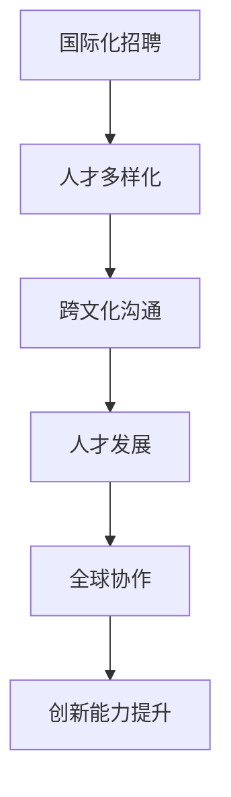

                 

# AI创业公司的国际化人才策略

> **关键词：** 国际化人才策略、AI创业公司、全球市场、人才招聘、团队建设、跨文化沟通。

> **摘要：** 本文旨在探讨AI创业公司在国际化过程中，如何制定和实施有效的人才策略，以吸引、留住和培养高素质的国际人才，从而在全球市场上获得竞争优势。

在当今全球化快速发展的背景下，AI创业公司需要具备国际视野，制定一套切实可行的人才策略，才能在全球市场上立足并取得成功。本文将从背景介绍、核心概念与联系、核心算法原理、数学模型和公式、项目实战、实际应用场景、工具和资源推荐、总结和未来发展趋势等方面进行探讨。

## 1. 背景介绍

AI创业公司面临的市场竞争日益激烈，不仅要面对国内同行业的竞争，还需要在全球范围内与其他国家的AI公司竞争。为了在全球市场上获得竞争优势，AI创业公司需要具备国际化视野，并制定有效的人才策略。

国际化人才策略的核心目标包括：

- **吸引全球顶尖人才**：通过优化招聘流程和提供有吸引力的工作环境，吸引来自世界各地的高素质人才。

- **跨文化团队建设**：建立一个具有多元化文化背景的团队，提高团队的创造力和创新力。

- **全球市场拓展**：通过国际化团队的支持，更好地理解和满足全球客户的需求，拓展国际市场。

- **创新能力的提升**：通过引进国际化的思维和技术，促进公司创新能力的提升。

## 2. 核心概念与联系

为了实现上述目标，AI创业公司需要关注以下几个核心概念：

- **国际化招聘**：通过多渠道、多语言招聘，吸引全球范围内的优秀人才。

- **人才多样化**：建立多元化的团队，包括不同的国籍、文化和背景的人才。

- **跨文化沟通**：提高团队成员之间的跨文化沟通能力，促进团队协作和知识共享。

- **人才发展**：为员工提供培训和发展机会，提高员工的技能和职业素养。

- **全球协作**：利用现代通讯技术和协作工具，实现全球范围内的团队协作。

以下是核心概念与联系的 Mermaid 流程图：



## 3. 核心算法原理 & 具体操作步骤

为了实施国际化人才策略，AI创业公司可以采用以下核心算法原理和具体操作步骤：

### 3.1 国际化招聘

1. **确定招聘需求**：根据公司战略目标和业务需求，确定招聘的国际化和多样性目标。

2. **多渠道招聘**：利用在线招聘平台、社交媒体、招聘会等多渠道发布招聘信息。

3. **多语言招聘**：提供多种语言版本的招聘信息，以吸引全球范围内的候选人。

4. **国际化面试**：采用视频面试、远程面试等方式，方便来自不同国家和地区的候选人参加面试。

### 3.2 人才多样化

1. **制定多元化策略**：明确公司的多元化目标，并在招聘、晋升和培训等方面贯彻。

2. **员工支持计划**：为国际员工提供签证、住房、医疗保险等支持计划。

3. **文化融合活动**：组织文化融合活动，促进团队成员之间的相互了解和交流。

### 3.3 跨文化沟通

1. **跨文化培训**：为员工提供跨文化沟通培训，提高跨文化沟通能力。

2. **跨文化团队建设**：通过团队建设活动，增强团队成员之间的信任和协作。

3. **沟通工具**：利用现代化的沟通工具，如视频会议、即时通讯等，实现高效的跨文化沟通。

### 3.4 人才发展

1. **个性化培训**：为员工提供个性化的培训计划，提高员工的技能和职业素养。

2. **职业发展通道**：建立清晰的职业发展通道，为员工提供职业晋升的机会。

3. **绩效管理**：建立公正、透明的绩效管理体系，激励员工发挥最佳水平。

### 3.5 全球协作

1. **全球协作工具**：利用全球协作工具，实现团队成员之间的实时协作。

2. **全球知识共享**：建立全球知识共享平台，促进知识的传播和共享。

3. **全球项目协作**：通过全球项目协作，提高团队的执行力和创新能力。

## 4. 数学模型和公式 & 详细讲解 & 举例说明

在国际人才策略的实施过程中，数学模型和公式可以帮助AI创业公司进行科学的人才管理和评估。以下是一个简单的数学模型和公式示例：

### 4.1 人才吸引力模型

$$
\text{人才吸引力} = f(\text{薪酬福利}, \text{职业发展机会}, \text{工作环境}, \text{公司文化})
$$

其中，$f$ 表示人才吸引力的函数，$\text{薪酬福利}$、$\text{职业发展机会}$、$\text{工作环境}$、$\text{公司文化}$ 是影响人才吸引力的因素。

### 4.2 人才留存率模型

$$
\text{人才留存率} = \frac{\text{留任员工数}}{\text{总员工数}} \times 100\%
$$

其中，$\text{留任员工数}$ 是在特定时间内留任的员工人数，$\text{总员工数}$ 是公司在同一时间内的总员工人数。

### 4.3 人才发展成本模型

$$
\text{人才发展成本} = \text{培训费用} + \text{员工福利费用} + \text{其他发展成本}
$$

其中，$\text{培训费用}$ 是公司为员工提供的培训费用，$\text{员工福利费用}$ 是公司为员工提供的各种福利费用，$\text{其他发展成本}$ 包括员工晋升、项目协作等费用。

### 4.4 人才流失成本模型

$$
\text{人才流失成本} = \text{招聘费用} + \text{培训费用} + \text{离职成本} + \text{新员工适应成本}
$$

其中，$\text{招聘费用}$ 是公司为招聘新员工所支付的费用，$\text{培训费用}$ 是公司为新员工提供的培训费用，$\text{离职成本}$ 是公司因员工离职所承担的成本，$\text{新员工适应成本}$ 是公司为新员工提供的适应培训费用。

### 4.5 举例说明

假设某AI创业公司有100名员工，其中50名留任，50名离职。公司每年为员工提供平均每人1000美元的培训费用，员工平均离职成本为2000美元。公司希望提高人才留存率，降低人才流失成本。

根据人才留存率模型，人才留存率为：

$$
\text{人才留存率} = \frac{50}{100} \times 100\% = 50\%
$$

为了提高人才留存率，公司可以采取以下措施：

- **提高薪酬福利**：通过提高薪酬和福利，提高员工的工作满意度，从而降低离职率。

- **提供职业发展机会**：为员工提供更多的职业发展机会，包括晋升、培训、项目参与等，提高员工的职业满意度。

- **优化工作环境**：提供良好的工作环境，包括舒适的工作场所、现代化的办公设施、良好的工作氛围等，提高员工的工作满意度。

- **加强公司文化建设**：通过组织团队建设活动、企业文化建设等，增强员工的归属感和认同感。

通过上述措施，公司有望提高人才留存率，降低人才流失成本。

## 5. 项目实战：代码实际案例和详细解释说明

### 5.1 开发环境搭建

为了更好地实施国际化人才策略，某AI创业公司决定开发一个基于人工智能的招聘系统。以下是一个简单的开发环境搭建过程：

1. **硬件环境**：选择一台高性能的服务器，配置为8核CPU、16GB内存、1TB SSD硬盘。

2. **操作系统**：安装Linux操作系统，如Ubuntu 18.04。

3. **开发工具**：安装Java开发工具包（JDK）、Python开发环境（PyCharm）、版本控制系统（Git）。

4. **数据库**：选择MySQL数据库，用于存储招聘数据。

5. **中间件**：安装Spring Boot框架，用于快速开发应用。

### 5.2 源代码详细实现和代码解读

以下是一个简单的招聘系统源代码示例：

```java
// 招聘系统主类
public class RecruitmentSystem {

    // 数据库连接对象
    private Connection connection;

    // 构造函数，初始化数据库连接
    public RecruitmentSystem() {
        try {
            connection = DriverManager.getConnection("jdbc:mysql://localhost:3306/recruitment_db", "username", "password");
        } catch (SQLException e) {
            e.printStackTrace();
        }
    }

    // 添加候选人
    public void addCandidate(Candidate candidate) {
        try {
            PreparedStatement statement = connection.prepareStatement("INSERT INTO candidates (name, email, cv) VALUES (?, ?, ?)");
            statement.setString(1, candidate.getName());
            statement.setString(2, candidate.getEmail());
            statement.setString(3, candidate.getCv());
            statement.executeUpdate();
        } catch (SQLException e) {
            e.printStackTrace();
        }
    }

    // 获取所有候选人
    public List<Candidate> getAllCandidates() {
        List<Candidate> candidates = new ArrayList<>();
        try {
            Statement statement = connection.createStatement();
            ResultSet resultSet = statement.executeQuery("SELECT * FROM candidates");
            while (resultSet.next()) {
                candidates.add(new Candidate(resultSet.getString("name"), resultSet.getString("email"), resultSet.getString("cv")));
            }
        } catch (SQLException e) {
            e.printStackTrace();
        }
        return candidates;
    }

    // 主函数
    public static void main(String[] args) {
        RecruitmentSystem recruitmentSystem = new RecruitmentSystem();
        Candidate candidate = new Candidate("John Doe", "john.doe@example.com", "CV");
        recruitmentSystem.addCandidate(candidate);
        List<Candidate> candidates = recruitmentSystem.getAllCandidates();
        for (Candidate c : candidates) {
            System.out.println(c.getName() + ", " + c.getEmail() + ", " + c.getCv());
        }
    }
}

// 候选人类
class Candidate {
    private String name;
    private String email;
    private String cv;

    public Candidate(String name, String email, String cv) {
        this.name = name;
        this.email = email;
        this.cv = cv;
    }

    // 省略getter和setter方法
}
```

### 5.3 代码解读与分析

1. **数据库连接**：招聘系统使用MySQL数据库存储数据。在构造函数中，通过DriverManager获取数据库连接。

2. **添加候选人**：`addCandidate` 方法用于向数据库中添加候选人信息。通过PreparedStatement预编译SQL语句，提高执行效率。

3. **获取所有候选人**：`getAllCandidates` 方法用于从数据库中获取所有候选人信息。通过ResultSet遍历数据库记录，将记录转换为Candidate对象。

4. **主函数**：主函数创建一个招聘系统实例，添加一个候选人，并打印所有候选人信息。

通过上述代码，AI创业公司可以快速搭建一个基础的招聘系统，实现国际化人才的初步筛选和管理。

## 6. 实际应用场景

### 6.1 招聘流程优化

通过国际化人才策略的实施，AI创业公司可以优化招聘流程，提高招聘效率。以下是一个实际应用场景：

1. **多渠道招聘**：公司在全球范围内发布招聘信息，通过社交媒体、在线招聘平台等多渠道吸引候选人。

2. **视频面试**：通过视频面试，远程评估候选人的技术能力和沟通能力。

3. **跨文化评估**：由具有国际化视野的评估团队，对候选人进行跨文化评估，确保团队多元化。

4. **自动化筛选**：利用人工智能技术，对简历进行自动化筛选，提高招聘效率。

### 6.2 国际化团队建设

通过国际化人才策略，AI创业公司可以建立一个具有多元化文化背景的团队。以下是一个实际应用场景：

1. **文化融合活动**：组织文化融合活动，如国际美食节、文化交流会等，促进团队成员之间的相互了解。

2. **跨文化培训**：为团队成员提供跨文化沟通培训，提高跨文化协作能力。

3. **国际化项目协作**：通过全球协作工具，实现团队成员之间的实时协作，提高项目执行力。

### 6.3 全球市场拓展

通过国际化人才策略，AI创业公司可以更好地拓展全球市场。以下是一个实际应用场景：

1. **本地化市场调研**：利用国际化团队的本地化优势，进行市场调研，了解当地客户需求。

2. **国际化产品开发**：根据当地市场特点，开发适应不同地区的产品。

3. **全球销售网络**：通过国际化团队的协助，建立全球销售网络，提高市场覆盖率。

## 7. 工具和资源推荐

### 7.1 学习资源推荐

- **书籍**：
  - 《全球招聘与人才管理》
  - 《国际化团队管理》
  - 《跨文化沟通技巧》
- **论文**：
  - 《国际人才流动：趋势、挑战与对策》
  - 《全球化背景下的企业国际化战略》
  - 《跨文化团队协作：挑战与策略》
- **博客/网站**：
  - 知乎专栏：国际化人才策略
  - Medium：Global Talent Strategy
  - LinkedIn：International Talent Management

### 7.2 开发工具框架推荐

- **招聘工具**：
  - LinkedIn Recruiter
  - Indeed
  - Glassdoor
- **团队协作工具**：
  - Slack
  - Microsoft Teams
  - Zoom
- **数据库**：
  - MySQL
  - MongoDB
  - PostgreSQL
- **开发框架**：
  - Spring Boot
  - React
  - Angular

### 7.3 相关论文著作推荐

- **《全球人才战略：企业如何吸引、留住和培养世界级人才》**
- **《跨文化团队协作：策略与实践》**
- **《国际化企业管理：理论与实践》**
- **《人工智能时代的人才管理》**

## 8. 总结：未来发展趋势与挑战

AI创业公司在国际化过程中，需要不断调整和完善国际化人才策略。未来发展趋势和挑战包括：

- **全球化人才竞争加剧**：随着全球范围内AI创业公司的发展，人才竞争将更加激烈。

- **技术变革与人才需求变化**：随着人工智能技术的快速发展，对人才的需求也将发生变化。

- **跨文化沟通与合作能力提升**：随着国际化团队的扩大，跨文化沟通和协作能力将变得更加重要。

- **人才发展体系完善**：建立完善的人才发展体系，提高员工的技能和职业素养。

- **数据安全和隐私保护**：在国际化过程中，数据安全和隐私保护将成为重要挑战。

## 9. 附录：常见问题与解答

### 9.1 常见问题

- **Q：如何吸引全球顶尖人才？**
  - **A：** 制定有吸引力的薪酬福利政策，提供职业发展机会，优化工作环境，加强公司文化建设。

- **Q：如何提高跨文化沟通能力？**
  - **A：** 开展跨文化培训，组织文化融合活动，利用现代化的沟通工具。

- **Q：如何降低人才流失成本？**
  - **A：** 提高人才留存率，优化招聘流程，加强员工培训和发展。

- **Q：如何拓展全球市场？**
  - **A：** 建立国际化团队，进行本地化市场调研，开发适应不同地区的产品。

### 9.2 解答

- **关于吸引全球顶尖人才**：
  - 制定有吸引力的薪酬福利政策，提供职业发展机会，优化工作环境，加强公司文化建设。

- **关于提高跨文化沟通能力**：
  - 开展跨文化培训，组织文化融合活动，利用现代化的沟通工具。

- **关于降低人才流失成本**：
  - 提高人才留存率，优化招聘流程，加强员工培训和发展。

- **关于拓展全球市场**：
  - 建立国际化团队，进行本地化市场调研，开发适应不同地区的产品。

## 10. 扩展阅读 & 参考资料

- **《全球招聘与人才管理》**
- **《国际化团队管理》**
- **《跨文化沟通技巧》**
- **《国际人才流动：趋势、挑战与对策》**
- **《全球化背景下的企业国际化战略》**
- **《跨文化团队协作：挑战与策略》**
- **《人工智能时代的人才管理》**

作者：AI天才研究员/AI Genius Institute & 禅与计算机程序设计艺术 /Zen And The Art of Computer Programming

