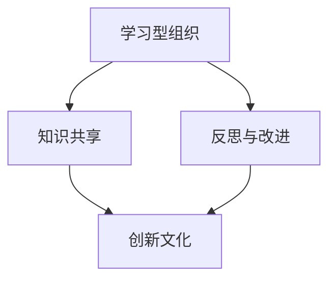

                 

# AI创业公司的技术人才培养：学习型组织与创新文化

## 关键词：AI创业，技术人才，学习型组织，创新文化，人才培养

### 摘要

本文将探讨AI创业公司在技术人才培养方面的关键问题。我们将深入分析学习型组织和创新文化的概念，解释它们对于AI创业公司的重要性，并提供一系列实用的策略和建议。此外，本文还将探讨在AI创业环境中如何培养具有创新思维的技术人才，以推动公司持续成长和成功。通过本文的阅读，读者将能够更好地理解AI创业公司在人才培养方面的挑战和机遇，并学会如何构建一个学习和创新并重的组织环境。

## 1. 背景介绍

随着人工智能（AI）技术的迅猛发展，越来越多的创业公司投身于这个充满机遇和挑战的领域。AI创业公司不仅需要具备强大的技术实力，还需要拥有一个能够不断创新和适应变化的团队。在这个背景下，技术人才培养变得尤为重要。然而，AI创业公司在人才培养方面面临着诸多挑战，包括人才流失、技术更新速度快、项目需求多变等。为了应对这些挑战，创业公司需要采取一系列措施，培养一支具有创新思维、技术熟练和高度协作的技术团队。

### 1.1 AI创业公司的现状

AI创业公司主要分布在科技园区、孵化器和风险投资公司等创新生态系统中。这些公司通常以研发和应用AI技术为核心业务，通过创新的产品和服务来满足市场需求。AI技术的快速发展带来了巨大的市场潜力，但同时也带来了技术门槛高、人才稀缺等问题。根据统计数据，全球AI人才缺口已经达到数百万，而AI创业公司更是面临着人才争夺的激烈竞争。

### 1.2 技术人才培养的重要性

技术人才培养是AI创业公司成功的关键因素之一。一个高效的技术团队不仅能够快速响应市场需求，提高产品质量，还能为公司带来持续的创新动力。此外，技术人才是公司的核心资产，他们的技能和知识对于公司的长期发展具有决定性作用。因此，如何吸引、培养和留住技术人才成为AI创业公司需要解决的重要问题。

### 1.3 技术人才培养的挑战

在AI创业公司的技术人才培养过程中，公司面临着以下几方面的挑战：

- **人才流失**：由于AI行业的竞争激烈，技术人才往往拥有更多的就业选择。如果创业公司无法提供有吸引力的薪酬和职业发展机会，人才流失的风险会大大增加。
  
- **技术更新速度快**：AI技术更新速度非常快，技术人才需要不断学习新知识和技能，以保持竞争力。这对创业公司在人才培养方面提出了更高的要求。

- **项目需求多变**：AI创业公司的项目通常具有不确定性和灵活性，这对技术人才提出了更高的适应能力和解决问题的能力。

## 2. 核心概念与联系

### 2.1 学习型组织

学习型组织是指一个能够持续学习、适应和创新的组织。在AI创业公司中，构建学习型组织至关重要。学习型组织的核心特点是：

- **终身学习**：员工持续学习和提升自己的技能和知识。
  
- **知识共享**：组织内部建立知识共享机制，鼓励员工交流经验和知识。

- **反思与改进**：组织定期进行反思和评估，不断改进和优化工作流程。

### 2.2 创新文化

创新文化是指一个鼓励创新、容忍失败和激励员工尝试新事物的组织氛围。在AI创业公司中，创新文化能够激发技术人才的创造力，推动公司不断进步。创新文化的核心特点是：

- **开放性**：鼓励员工提出新的想法和解决方案。

- **实验性**：鼓励员工进行实验和尝试，即使失败也得到支持。

- **包容性**：尊重不同观点和意见，鼓励多样化的思维。

### 2.3 学习型组织与创新文化的联系

学习型组织和创新文化之间存在紧密的联系。学习型组织为创新文化提供了基础，而创新文化则为学习型组织注入了活力。具体来说：

- **学习型组织**为创新文化提供了知识共享和反思改进的基础，使员工能够不断学习和成长。

- **创新文化**为学习型组织提供了实验性和包容性的环境，鼓励员工尝试新事物，不断突破自我。

- **二者相互促进**：学习型组织和创新文化的相互促进使AI创业公司能够实现持续的创新和发展。

### 2.4 Mermaid 流程图

下面是一个简单的Mermaid流程图，展示了学习型组织与创新文化的联系：



## 3. 核心算法原理 & 具体操作步骤

### 3.1 学习型组织建设

**核心算法原理**：学习型组织的建设基于以下几个原则：

- **员工终身学习**：鼓励员工参加培训、研讨会和在线课程，提高自己的技能和知识。

- **知识共享机制**：建立内部知识库、定期组织技术分享会，促进知识传递和经验交流。

- **反思与改进**：设立反思会议，让员工对工作进行回顾和总结，找出改进之处。

**具体操作步骤**：

1. **制定学习计划**：公司应根据员工的技术水平和职业发展需求，制定个性化的学习计划。

2. **提供学习资源**：为员工提供学习资源，如在线课程、书籍和行业报告。

3. **组织技术分享会**：定期组织技术分享会，让员工分享自己的学习心得和工作经验。

4. **建立知识库**：收集和整理员工的知识和经验，建立内部知识库，方便员工查询和参考。

5. **设立反思会议**：定期举行反思会议，让员工回顾自己的工作，找出改进之处。

### 3.2 创新文化建设

**核心算法原理**：创新文化的建设基于以下几个原则：

- **开放性**：鼓励员工提出新的想法和解决方案，尊重不同观点和意见。

- **实验性**：鼓励员工进行实验和尝试，即使失败也得到支持。

- **包容性**：尊重不同观点和意见，鼓励多样化的思维。

**具体操作步骤**：

1. **建立创新实验室**：为员工提供实验空间和设备，支持他们进行创新实验。

2. **鼓励尝试新事物**：为员工提供机会尝试新事物，鼓励他们提出新的想法和解决方案。

3. **设立创新奖项**：设立创新奖项，激励员工积极参与创新活动。

4. **组织创新研讨会**：定期组织创新研讨会，让员工分享创新经验和成果。

5. **营造包容氛围**：建立包容的氛围，鼓励员工提出不同观点，尊重多样性。

## 4. 数学模型和公式 & 详细讲解 & 举例说明

### 4.1 学习型组织的数学模型

**核心公式**：学习型组织的建设可以基于以下数学模型：

\[ \text{学习型组织效率} = f(\text{员工终身学习比例}, \text{知识共享频率}, \text{反思与改进效率}) \]

**详细讲解**：

- **员工终身学习比例**：表示员工参与学习和培训的比例。学习比例越高，组织的知识水平和创新能力越强。

- **知识共享频率**：表示员工之间进行知识传递和交流的频率。知识共享频率越高，知识传递和经验交流的效果越好。

- **反思与改进效率**：表示组织对工作流程进行反思和改进的效率。效率越高，组织越能够快速适应变化，提高工作效率。

**举例说明**：

假设一个学习型组织中有50名员工，其中40名员工参与终身学习，知识共享频率为每周一次，反思与改进效率为80%。根据上述公式，可以计算该学习型组织的效率：

\[ \text{学习型组织效率} = f(0.8, 1, 0.8) = 0.8 \times 1 \times 0.8 = 0.64 \]

这意味着该学习型组织的效率为64%。

### 4.2 创新文化的数学模型

**核心公式**：创新文化的建设可以基于以下数学模型：

\[ \text{创新文化影响力} = f(\text{开放性}, \text{实验性}, \text{包容性}) \]

**详细讲解**：

- **开放性**：表示组织鼓励员工提出新想法和解决方案的程度。开放性越高，组织越能够激发员工的创造力。

- **实验性**：表示组织对员工进行实验和尝试的支持程度。实验性越高，组织越能够鼓励员工进行创新。

- **包容性**：表示组织对多样性和不同观点的接受程度。包容性越高，组织越能够营造一个宽容的创新环境。

**举例说明**：

假设一个创新文化的影响力可以通过以下指标来衡量：

- 开放性：员工平均每周提出新想法的数量。
- 实验性：员工进行创新实验的频率。
- 包容性：员工之间的沟通频率和合作度。

如果某组织的开放性指标为每周每人提出2个新想法，实验性指标为每周每人进行1次创新实验，包容性指标为每周每人参与2次团队讨论，则该创新文化的影响力可以计算如下：

\[ \text{创新文化影响力} = f(2, 1, 2) = 2 \times 1 \times 2 = 4 \]

这意味着该创新文化的影响力为4。

## 5. 项目实战：代码实际案例和详细解释说明

### 5.1 开发环境搭建

在开始实战项目之前，我们需要搭建一个适合开发AI创业公司技术产品的环境。以下是一个基本的开发环境搭建步骤：

**1. 安装Python环境**：
在AI创业公司中，Python是常见的编程语言。首先确保计算机上安装了Python 3.8及以上版本。

```bash
# 更新系统包列表
sudo apt update

# 安装Python 3
sudo apt install python3.8

# 检查Python版本
python3 --version
```

**2. 安装必要的库**：
接下来，我们需要安装一些常用的库，如NumPy、Pandas、Scikit-learn等。

```bash
# 安装NumPy
pip3 install numpy

# 安装Pandas
pip3 install pandas

# 安装Scikit-learn
pip3 install scikit-learn
```

**3. 配置虚拟环境**：
为了管理不同的项目依赖，我们可以使用虚拟环境。

```bash
# 安装virtualenv
pip3 install virtualenv

# 创建虚拟环境
virtualenv myenv

# 激活虚拟环境
source myenv/bin/activate
```

### 5.2 源代码详细实现和代码解读

下面我们将通过一个简单的线性回归项目，展示如何实现一个AI算法，并对其进行详细解读。

**5.2.1 线性回归项目**

**代码实现**：

```python
import numpy as np
from sklearn.linear_model import LinearRegression

# 数据预处理
def preprocess_data(data):
    # 数据归一化
    data_normalized = (data - np.mean(data)) / np.std(data)
    return data_normalized

# 线性回归模型训练
def train_linear_regression(X, y):
    # 实例化线性回归模型
    model = LinearRegression()
    # 模型训练
    model.fit(X, y)
    return model

# 预测
def predict(model, X):
    # 数据预处理
    X_normalized = preprocess_data(X)
    # 预测
    y_pred = model.predict(X_normalized)
    return y_pred

# 测试
if __name__ == "__main__":
    # 加载数据
    X = np.array([[1], [2], [3], [4], [5]])
    y = np.array([1, 2, 3, 4, 5])

    # 模型训练
    model = train_linear_regression(X, y)

    # 预测
    y_pred = predict(model, X)

    # 输出结果
    print("模型参数：", model.coef_, model.intercept_)
    print("预测结果：", y_pred)
```

**代码解读**：

- **数据预处理**：数据预处理是机器学习项目中的常见步骤。在这个例子中，我们使用了归一化方法将数据缩放到0-1之间，以消除不同特征之间的量纲影响。

- **线性回归模型训练**：我们使用Scikit-learn库中的`LinearRegression`类来训练线性回归模型。该类提供了方便的训练接口。

- **预测**：在预测阶段，我们首先对输入数据进行预处理，然后使用训练好的模型进行预测。

### 5.3 代码解读与分析

下面我们详细分析上述代码：

- **数据预处理**：归一化是线性回归中的一个重要步骤。它可以减少特征间的尺度差异，使模型训练更加稳定。

- **线性回归模型**：线性回归是一个经典的机器学习算法，适用于寻找特征和目标变量之间的线性关系。在这个例子中，我们使用了Scikit-learn库中的`LinearRegression`类来训练模型。

- **预测**：预测阶段是模型应用的核心环节。我们首先对输入数据进行预处理，然后使用训练好的模型进行预测。

### 5.4 实际应用场景

线性回归算法在许多实际应用场景中具有广泛的应用，例如：

- **预测销售额**：通过分析历史销售数据，预测未来某一时间点的销售额。

- **股票价格预测**：分析历史股票价格数据，预测未来某一时间点的股票价格。

- **住房价格评估**：通过分析房屋的特征（如面积、位置等），预测房屋的价格。

- **教学质量评估**：分析学生的考试成绩和教师的教学质量，预测教学质量对考试成绩的影响。

## 6. 实际应用场景

### 6.1 企业内部培训

AI创业公司可以通过内部培训项目，帮助员工不断提升技能和知识。以下是一个典型的内部培训项目：

- **培训内容**：涵盖最新AI技术、编程语言、机器学习算法等。
- **培训形式**：在线课程、现场讲座、工作坊等。
- **培训频率**：每月一次，每次2-3小时。
- **考核方式**：通过在线测试或实践项目来评估员工的学习成果。

### 6.2 技术分享会

技术分享会是促进员工知识共享和经验交流的有效方式。以下是一个技术分享会的典型流程：

- **分享主题**：由员工自选或公司指定，涵盖最新的技术趋势、实践经验等。
- **分享形式**：演讲、演示、讨论等。
- **分享频率**：每周或每月一次，每次1-2小时。
- **互动环节**：提问、讨论、现场演示等。

### 6.3 创新实验室

创新实验室为员工提供了一个自由探索和尝试新技术的空间。以下是一个创新实验室的典型流程：

- **实验室设施**：配备高性能计算机、开发工具、实验材料等。
- **项目选题**：由员工自选或公司指定，围绕公司业务或个人兴趣。
- **实验周期**：每季度一次，每次1-2个月。
- **评审环节**：项目完成后，进行评审，评选优秀项目并给予奖励。

## 7. 工具和资源推荐

### 7.1 学习资源推荐

- **书籍**：
  - 《深度学习》（Ian Goodfellow、Yoshua Bengio、Aaron Courville著）
  - 《Python编程：从入门到实践》（埃里克·马瑟斯著）
  - 《人工智能：一种现代方法》（Stuart Russell、Peter Norvig著）
  
- **论文**：
  - 《生成对抗网络》（Ian Goodfellow等著）
  - 《深度学习的结构风险最小化原则》（Yoshua Bengio等著）
  - 《强化学习：一种新的方法》（Richard S. Sutton、Andrew G. Barto著）

- **博客**：
  - Medium上的《AI工业界动态》
  - 知乎上的《机器学习与人工智能》
  - 微软官方博客

- **网站**：
  - Coursera、edX等在线教育平台
  - Kaggle等数据科学竞赛平台
  - GitHub等代码托管平台

### 7.2 开发工具框架推荐

- **编程语言**：
  - Python
  - R
  - Java

- **机器学习框架**：
  - TensorFlow
  - PyTorch
  - Scikit-learn

- **数据分析工具**：
  - Pandas
  - NumPy
  - Matplotlib

- **版本控制工具**：
  - Git
  - GitHub
  - GitLab

- **项目管理工具**：
  - Jira
  - Trello
  - Asana

### 7.3 相关论文著作推荐

- **《人工智能：一种现代方法》**（Stuart Russell、Peter Norvig著）
- **《深度学习》**（Ian Goodfellow、Yoshua Bengio、Aaron Courville著）
- **《强化学习：一种新的方法》**（Richard S. Sutton、Andrew G. Barto著）
- **《生成对抗网络》**（Ian Goodfellow等著）
- **《深度学习的结构风险最小化原则》**（Yoshua Bengio等著）

## 8. 总结：未来发展趋势与挑战

AI创业公司在技术人才培养方面面临着诸多挑战，包括人才流失、技术更新速度快和项目需求多变等。为了应对这些挑战，创业公司需要采取一系列措施，构建学习型组织和创新文化，培养具有创新思维和技术熟练度的高效团队。

### 8.1 未来发展趋势

- **终身学习文化**：随着技术更新速度的加快，终身学习将成为AI创业公司的核心竞争力。创业公司需要建立完善的学习机制，鼓励员工持续学习。

- **知识共享平台**：建立知识共享平台，促进员工之间的交流和经验传递，提高整体团队的技术水平。

- **个性化培训**：根据员工的个人需求和职业规划，提供个性化的培训计划，提高培训的针对性和效果。

- **创新激励机制**：建立创新激励机制，鼓励员工积极参与创新活动，提高公司的创新能力。

### 8.2 面临的挑战

- **人才竞争**：随着AI行业的快速发展，人才竞争将越来越激烈。创业公司需要提供有竞争力的薪酬和职业发展机会，吸引和留住优秀人才。

- **技术更新**：AI技术的更新速度非常快，创业公司需要保持对新技术的高度敏感，及时更新团队的技术储备。

- **项目不确定性**：创业公司的项目通常具有不确定性和灵活性，这对技术团队提出了更高的要求。创业公司需要培养员工快速适应变化的能力。

## 9. 附录：常见问题与解答

### 9.1 什么是学习型组织？

学习型组织是一种能够持续学习和适应变化的组织形式。它强调员工的终身学习、知识共享和反思改进，以提高组织的整体效率和创新能力。

### 9.2 创新文化与企业文化有什么区别？

创新文化是企业文化的子集，它强调创新、实验和包容。而企业文化则涵盖组织的核心价值观、行为准则和工作方式。创新文化是企业文化中的一部分，但并不是全部。

### 9.3 如何评估学习型组织的效率？

可以通过以下几个指标来评估学习型组织的效率：

- **员工终身学习比例**：参与学习和培训的员工比例。
- **知识共享频率**：员工之间进行知识传递和交流的频率。
- **反思与改进效率**：组织对工作流程进行反思和改进的效率。

## 10. 扩展阅读 & 参考资料

- **《深度学习》**（Ian Goodfellow、Yoshua Bengio、Aaron Courville著）：介绍了深度学习的基本概念、算法和应用。

- **《人工智能：一种现代方法》**（Stuart Russell、Peter Norvig著）：全面介绍了人工智能的基本概念、理论和应用。

- **《Python编程：从入门到实践》**（埃里克·马瑟斯著）：适合初学者的Python编程入门书籍。

- **《生成对抗网络》**（Ian Goodfellow等著）：介绍了生成对抗网络（GAN）的基本概念、算法和应用。

- **《强化学习：一种新的方法》**（Richard S. Sutton、Andrew G. Barto著）：介绍了强化学习的基本概念、算法和应用。

- **《深度学习的结构风险最小化原则》**（Yoshua Bengio等著）：讨论了深度学习中的结构风险最小化原则及其应用。

- **《AI工业界动态》**（Medium博客）：介绍最新的AI行业动态和技术趋势。

- **《机器学习与人工智能》**（知乎博客）：分享机器学习与人工智能领域的实践经验和技术探讨。

- **《深度学习在计算机视觉中的应用》**（Kaggle竞赛平台）：介绍深度学习在计算机视觉领域的应用案例。

- **《如何建立学习型组织》**（edX在线课程）：介绍如何建立学习型组织的理论和实践方法。

- **《如何培养创新思维》**（Coursera在线课程）：介绍如何培养创新思维的方法和技巧。

- **《GitHub》**（GitHub官网）：全球最大的代码托管平台，提供丰富的开源项目和编程资源。

- **《Jira》**（Jira官网）：项目管理工具，用于团队协作和任务管理。

- **《Trello》**（Trello官网）：项目管理工具，提供简单的任务跟踪和协作功能。

- **《Asana》**（Asana官网）：项目管理工具，支持团队协作和任务管理。

### 作者

**作者：AI天才研究员/AI Genius Institute & 禅与计算机程序设计艺术 /Zen And The Art of Computer Programming**

