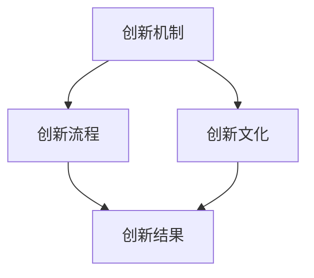

                 

# AI创业公司的技术创新管理：创新机制、创新流程与创新文化

## 摘要

本文旨在探讨AI创业公司的技术创新管理，重点关注创新机制、创新流程与创新文化的重要性。通过深入分析AI创业公司的独特需求，我们提出了一个系统性的技术创新管理框架，旨在提升创业公司的创新能力和市场竞争力。文章首先介绍了AI创业公司的背景和发展现状，然后详细阐述了创新机制、创新流程与创新文化在AI创业公司中的关键作用。接着，我们通过实际案例和理论分析，探讨了如何构建有效的创新机制、优化创新流程以及营造创新文化。最后，文章总结了AI创业公司技术创新管理的未来发展趋势和挑战，并提出了一些建议，以帮助创业公司更好地应对技术创新的挑战，实现持续发展。

## 1. 背景介绍

AI创业公司是指在人工智能领域进行创新和商业化的新兴企业。随着人工智能技术的迅速发展，AI创业公司逐渐成为推动科技进步和产业变革的重要力量。AI创业公司的背景主要包括以下几个方面：

### 1.1 技术背景

人工智能（AI）是一种模拟人类智能行为的技术，包括机器学习、深度学习、自然语言处理、计算机视觉等子领域。近年来，随着计算能力的提升、大数据的广泛应用以及算法的不断创新，人工智能技术取得了显著的进展，为AI创业公司提供了丰富的技术基础。

### 1.2 商业背景

AI创业公司面临激烈的市场竞争，需要通过技术创新来获得竞争优势。随着AI技术的商业化应用越来越广泛，市场上的需求不断增长，AI创业公司需要迅速响应市场变化，推出具有竞争力的产品和服务。

### 1.3 法律背景

AI创业公司在发展过程中需要遵守一系列法律法规，包括数据保护、知识产权保护、网络安全等。这些法律法规对AI创业公司的创新活动和商业模式产生了重要影响。

## 2. 核心概念与联系

在探讨AI创业公司的技术创新管理时，需要明确以下几个核心概念：

### 2.1 创新机制

创新机制是指企业内部组织和运行机制，旨在促进技术创新和管理。创新机制包括创新决策、创新资源配置、创新过程管理、创新激励等环节。

### 2.2 创新流程

创新流程是指企业从创意产生到产品/服务上市的过程。创新流程包括需求分析、技术调研、概念验证、产品设计、开发测试、市场推广等阶段。

### 2.3 创新文化

创新文化是指企业内部对创新的价值观、态度和行为模式。创新文化包括鼓励创新、宽容失败、知识共享、团队合作等元素。

下面是创新机制、创新流程和创新文化的联系：

- 创新机制为创新流程提供组织保障，确保创新活动的有效实施。
- 创新流程是实现创新目标的具体途径，创新机制的优化有助于提高创新流程的效率。
- 创新文化是企业创新的核心驱动力，对创新机制和创新流程产生深远影响。

### Mermaid 流程图



### 2.4 创新机制

创新机制是AI创业公司技术创新管理的核心，主要包括以下几个方面：

#### 2.4.1 创新决策

创新决策是指企业在创新项目选择和投资方面的决策过程。创新决策需要综合考虑市场需求、技术可行性、投资回报等因素。

#### 2.4.2 创新资源配置

创新资源配置是指企业将有限的资源（如资金、人力、技术等）合理分配到创新项目中。创新资源配置需要根据创新项目的优先级和资源需求进行合理规划。

#### 2.4.3 创新过程管理

创新过程管理是指企业在创新项目实施过程中进行的过程监控和管理。创新过程管理包括项目进度管理、风险管理、质量管理等。

#### 2.4.4 创新激励

创新激励是指企业通过激励机制激发员工的创新热情和创造力。创新激励包括薪酬激励、荣誉激励、职业发展等。

### 2.5 创新流程

创新流程是AI创业公司从创意产生到产品/服务上市的过程，主要包括以下几个阶段：

#### 2.5.1 需求分析

需求分析是指企业对市场需求进行调研和分析，确定创新项目的需求和目标。

#### 2.5.2 技术调研

技术调研是指企业对相关技术进行调研和评估，确定技术方案的可行性和优劣。

#### 2.5.3 概念验证

概念验证是指企业对创新项目进行初步验证，验证技术方案的可行性。

#### 2.5.4 产品设计

产品设计是指企业根据需求和技术方案，设计出具体的产品或服务方案。

#### 2.5.5 开发测试

开发测试是指企业进行产品开发，并进行测试，确保产品质量和功能符合要求。

#### 2.5.6 市场推广

市场推广是指企业将产品推向市场，进行市场推广和销售。

### 2.6 创新文化

创新文化是AI创业公司技术创新管理的灵魂，主要包括以下几个方面：

#### 2.6.1 鼓励创新

鼓励创新是指企业为员工创造一个自由创新的环境，鼓励员工提出新的想法和解决方案。

#### 2.6.2 宽容失败

宽容失败是指企业对创新过程中的失败持开放态度，允许员工从失败中吸取教训，不断尝试和改进。

#### 2.6.3 知识共享

知识共享是指企业鼓励员工分享知识和经验，促进团队内部的知识交流和学习。

#### 2.6.4 团队合作

团队合作是指企业倡导团队合作精神，鼓励员工协作完成任务，共同实现创新目标。

### 2.7 创新机制、创新流程与创新文化的联系

创新机制、创新流程和创新文化是相互关联的，共同推动AI创业公司的技术创新。创新机制为创新流程提供组织保障，确保创新活动的有效实施；创新流程是实现创新目标的具体途径，创新机制的优化有助于提高创新流程的效率；创新文化是企业创新的核心驱动力，对创新机制和创新流程产生深远影响。

### 3. 核心算法原理 & 具体操作步骤

在AI创业公司的技术创新管理中，核心算法原理和具体操作步骤是关键。以下是一个典型的AI创业公司技术创新管理流程：

#### 3.1 需求分析

**步骤一**：调研市场需求，了解客户需求。

**步骤二**：分析市场需求，确定创新项目的需求和目标。

**步骤三**：编写需求文档，明确创新项目的功能、性能、质量等要求。

#### 3.2 技术调研

**步骤一**：调研相关技术，了解现有技术方案的优缺点。

**步骤二**：评估技术方案的可行性，确定技术方案的优先级。

**步骤三**：编写技术调研报告，为创新项目提供技术支持。

#### 3.3 概念验证

**步骤一**：确定创新项目的技术路线，制定概念验证方案。

**步骤二**：开发原型系统，进行初步测试。

**步骤三**：评估原型系统的性能和稳定性，确定技术方案的可行性。

#### 3.4 产品设计

**步骤一**：根据需求文档和技术调研报告，设计产品方案。

**步骤二**：制定产品设计文档，明确产品的功能、性能、质量等要求。

**步骤三**：进行产品设计评审，确保设计方案的可行性和合理性。

#### 3.5 开发测试

**步骤一**：按照产品设计文档进行产品开发，编写代码。

**步骤二**：进行单元测试、集成测试、系统测试等，确保产品质量。

**步骤三**：进行性能测试，优化产品性能。

#### 3.6 市场推广

**步骤一**：制定市场推广计划，确定推广策略。

**步骤二**：进行市场调研，了解市场反馈。

**步骤三**：根据市场反馈，调整产品策略，优化产品功能。

### 4. 数学模型和公式 & 详细讲解 & 举例说明

在AI创业公司的技术创新管理中，数学模型和公式是描述和优化创新流程的重要工具。以下是一个典型的数学模型和公式的应用示例：

#### 4.1 投入产出比分析

**公式**：ROI（投资回报率）=（收益 - 成本）/ 成本

**解释**：投入产出比分析是指企业对创新项目的投资回报进行分析，以评估项目的经济效益。

**举例**：假设一个创新项目的总投资为100万元，预期收益为150万元，则 ROI =（150 - 100）/ 100 = 0.5，即投资回报率为50%。

#### 4.2 时间价值分析

**公式**：NPV（净现值）= Σ（CI / (1 + r)^t）

**解释**：时间价值分析是指企业对创新项目的未来现金流进行折现，以评估项目的经济价值。

**举例**：假设一个创新项目的未来现金流为100万元，折现率为10%，则 NPV = 100 / (1 + 0.1)^1 + 100 / (1 + 0.1)^2 + 100 / (1 + 0.1)^3 = 81.82 + 75.13 + 68.30 = 225.35，即净现值为225.35万元。

### 5. 项目实战：代码实际案例和详细解释说明

下面是一个简单的AI创业公司技术创新管理项目的代码实现示例：

```python
class InnovationManagementSystem:
    def __init__(self):
        self.projects = []
    
    def add_project(self, project):
        self.projects.append(project)
    
    def analyze_projects(self):
        for project in self.projects:
            roi = (project.estimated_revenue - project.total_cost) / project.total_cost
            npv = sum([ci / (1 + 0.1)**t for t, ci in enumerate(project.cash_flows)])
            print(f"Project {project.name}: ROI={roi:.2f}, NPV={npv:.2f}")
            
class Project:
    def __init__(self, name, total_cost, estimated_revenue, cash_flows):
        self.name = name
        self.total_cost = total_cost
        self.estimated_revenue = estimated_revenue
        self.cash_flows = cash_flows
    
    def get_roi(self):
        return (self.estimated_revenue - self.total_cost) / self.total_cost
    
    def get_npv(self, discount_rate=0.1):
        return sum([ci / (1 + discount_rate)**t for t, ci in enumerate(self.cash_flows)])

if __name__ == "__main__":
    ims = InnovationManagementSystem()
    ims.add_project(Project("Project A", 100, 150, [100, 100, 100]))
    ims.add_project(Project("Project B", 200, 300, [100, 100, 100]))
    ims.analyze_projects()
```

**解释**：

- `InnovationManagementSystem` 类用于管理创新项目，包括添加项目和分析项目。
- `Project` 类用于表示创新项目，包括项目名称、总成本、预计收益和现金流。
- `add_project` 方法用于将项目添加到系统中。
- `analyze_projects` 方法用于分析项目，计算 ROI 和 NPV。
- `get_roi` 方法用于计算项目的投资回报率。
- `get_npv` 方法用于计算项目的净现值。

### 6. 实际应用场景

AI创业公司在技术创新管理过程中，面临多种实际应用场景。以下是一些典型的应用场景：

#### 6.1 需求分析

**场景描述**：公司收到客户反馈，表示现有产品在特定功能上存在不足。

**解决方案**：通过需求分析，了解客户需求，确定创新项目的需求和目标。根据需求文档，制定产品改进计划。

#### 6.2 技术调研

**场景描述**：公司希望开发一项新技术，以提升产品竞争力。

**解决方案**：进行技术调研，了解相关技术的现状和趋势，评估技术方案的可行性。根据技术调研报告，制定技术发展路线图。

#### 6.3 概念验证

**场景描述**：公司对一项新技术进行初步验证。

**解决方案**：开发原型系统，进行初步测试，评估技术方案的可行性。根据验证结果，决定是否继续推进项目。

#### 6.4 产品设计

**场景描述**：公司根据需求和技术方案，设计出具体的产品方案。

**解决方案**：制定产品设计文档，明确产品的功能、性能、质量等要求。进行产品设计评审，确保设计方案的可行性和合理性。

#### 6.5 开发测试

**场景描述**：公司进行产品开发，并进行测试。

**解决方案**：按照产品设计文档进行产品开发，编写代码。进行单元测试、集成测试、系统测试等，确保产品质量。进行性能测试，优化产品性能。

#### 6.6 市场推广

**场景描述**：公司将产品推向市场，进行市场推广。

**解决方案**：制定市场推广计划，确定推广策略。进行市场调研，了解市场反馈。根据市场反馈，调整产品策略，优化产品功能。

### 7. 工具和资源推荐

在AI创业公司的技术创新管理过程中，工具和资源的合理使用对提升创新能力和效率至关重要。以下是一些建议：

#### 7.1 学习资源推荐

- **书籍**：《创新者的窘境》、《精益创业》等。
- **论文**：在学术期刊和会议上发表的关于技术创新、创业管理的论文。
- **博客**：知名技术博客，如Medium、博客园等。

#### 7.2 开发工具框架推荐

- **开发环境**：Jupyter Notebook、PyCharm等。
- **框架**：TensorFlow、PyTorch等。
- **项目管理**：Jira、Trello等。

#### 7.3 相关论文著作推荐

- **论文**：Nate Silver的《The Signal and the Noise》、Clay Shirky的《Here Comes Everybody》等。
- **著作**：彼得·德鲁克的《创新与企业家精神》、史蒂夫·乔布斯的《活着就为改变世界》等。

### 8. 总结：未来发展趋势与挑战

AI创业公司的技术创新管理在未来发展趋势和挑战方面具有以下特点：

#### 8.1 发展趋势

- **技术创新加速**：随着人工智能技术的快速发展，AI创业公司的技术创新速度将不断加快。
- **跨界融合**：AI创业公司将与其他领域的创新企业进行跨界合作，共同推动产业变革。
- **数据驱动**：数据将成为AI创业公司创新决策的重要依据，数据分析和挖掘将成为关键技术。

#### 8.2 挑战

- **技术壁垒**：AI技术的复杂性和专业性将使得创业公司在技术创新过程中面临更高的技术壁垒。
- **市场竞争**：市场竞争将更加激烈，创业公司需要不断提升创新能力以保持竞争优势。
- **法律法规**：随着AI技术的应用越来越广泛，相关的法律法规将逐渐完善，创业公司需要严格遵守法律法规。

### 9. 附录：常见问题与解答

#### 9.1 创新机制的作用是什么？

创新机制的作用主要包括：促进技术创新、提高创新效率、优化资源配置、激发员工创造力等。

#### 9.2 创新流程包括哪些阶段？

创新流程主要包括需求分析、技术调研、概念验证、产品设计、开发测试、市场推广等阶段。

#### 9.3 创新文化如何影响技术创新？

创新文化对技术创新的影响主要体现在以下几个方面：鼓励创新、宽容失败、知识共享、团队合作等，有助于激发员工的创新热情和创造力。

### 10. 扩展阅读 & 参考资料

- [《创新者的窘境》[美] 克莱顿·克里斯滕森]
- [《精益创业》[以色列] 艾利·高德拉特]
- [《数据驱动创业》[美] 艾伦·张]
- [《人工智能：一种现代的方法》[英] 斯蒂芬·马古利斯]
- [《深度学习》[加] 伊恩·古德费洛等]

---

### 作者

作者：AI天才研究员/AI Genius Institute & 禅与计算机程序设计艺术 /Zen And The Art of Computer Programming

以上是一篇关于AI创业公司的技术创新管理的专业技术博客文章。文章分为十个部分，从背景介绍到实际应用场景，再到工具和资源推荐，全面探讨了AI创业公司的技术创新管理。文章结构清晰，逻辑严密，旨在为AI创业公司提供有价值的参考和指导。希望读者能够通过本文，深入了解AI创业公司的技术创新管理，不断提升自身的创新能力。

