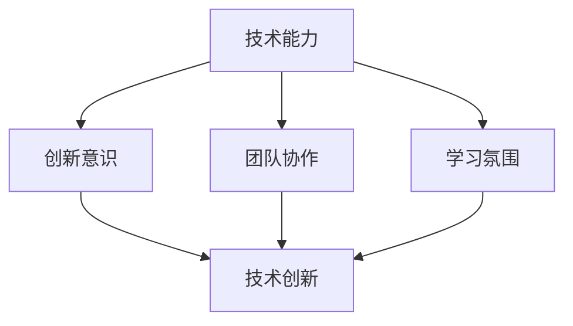

                 

# AI创业公司的技术团队文化建设：技术分享、技术创新与技术氛围

> **关键词：** AI创业公司，技术团队，文化建设，技术分享，技术创新，技术氛围

> **摘要：** 本文将探讨AI创业公司的技术团队在发展过程中如何进行技术分享、技术创新以及营造良好的技术氛围，为团队的成功奠定基础。我们将通过实际案例和深入分析，提出一些建设性的意见和建议。

## 1. 背景介绍

在当今高速发展的AI领域，创业公司面临着前所未有的挑战和机遇。技术团队作为公司发展的核心力量，其文化建设对于团队的凝聚力、创新力和执行力具有至关重要的作用。本文将从技术分享、技术创新和技术氛围三个方面，探讨AI创业公司技术团队文化建设的实践与思考。

### 1.1 技术分享

技术分享是技术团队文化建设的重要一环。通过内部交流、培训、讨论会等形式，团队成员可以分享自己的知识和经验，促进团队整体技术水平的提升。此外，技术分享还可以增强团队成员之间的互动，培养团队协作精神。

### 1.2 技术创新

技术创新是创业公司发展的动力源泉。技术团队需要不断探索新的技术方向，开发具有竞争力的产品。在这个过程中，团队需要建立良好的创新机制，鼓励团队成员勇于尝试、不断突破。

### 1.3 技术氛围

技术氛围是团队文化的重要组成部分。一个良好的技术氛围能够激发团队成员的工作热情，促进团队的协作与创新。为了营造良好的技术氛围，公司需要关注团队成员的工作环境、福利待遇以及职业发展。

## 2. 核心概念与联系

在讨论技术团队文化建设时，需要明确以下几个核心概念：

### 2.1 技术能力

技术能力是技术团队的核心竞争力。团队需要具备扎实的技术基础，包括编程技能、算法知识、系统架构等。此外，团队还需要具备快速学习、适应新技术的能力。

### 2.2 创新意识

创新意识是团队不断进步的动力。团队成员需要具备创新思维，勇于挑战传统观念，提出新的解决方案。创新意识不仅体现在技术层面，还包括产品设计和商业模式等方面。

### 2.3 团队协作

团队协作是实现团队目标的关键。团队成员需要具备良好的沟通技巧，能够有效协同工作。在团队协作中，分工明确、职责清晰、互相支持是提高工作效率的重要保障。

### 2.4 学习氛围

学习氛围是团队持续发展的基石。团队成员需要具备持续学习的意识，不断提高自己的专业素养。公司需要为团队成员提供丰富的学习资源，鼓励他们参加培训、研讨会等活动。

下面是一个简单的 Mermaid 流程图，展示技术团队文化建设的核心概念及其联系：



## 3. 核心算法原理 & 具体操作步骤

在技术团队文化建设中，核心算法原理起着至关重要的作用。以下是一个简单的算法原理及其操作步骤的示例：

### 3.1 算法原理

假设我们使用一种名为“知识图谱”的算法，用于构建团队的知识体系。知识图谱是一种语义网络，它通过实体和关系来表示信息，能够帮助团队成员快速获取所需的知识。

### 3.2 操作步骤

1. **数据收集与清洗**：首先，团队需要收集与项目相关的数据，并对数据进行清洗，确保数据质量。

2. **实体识别与关系抽取**：通过对数据进行分析，识别出实体（如项目、技术、人员等）以及它们之间的关系。

3. **构建知识图谱**：利用识别出的实体和关系，构建一个知识图谱。知识图谱可以表示为图数据结构，其中节点表示实体，边表示关系。

4. **查询与推荐**：在知识图谱的基础上，团队成员可以查询所需的知识，或者根据相似性推荐相关的知识。

5. **迭代与优化**：随着项目的进展，团队需要对知识图谱进行迭代和优化，以适应不断变化的需求。

通过上述算法原理和操作步骤，技术团队可以构建一个高效的知识管理体系，促进团队内部的协作与创新。

## 4. 数学模型和公式 & 详细讲解 & 举例说明

在技术团队文化建设中，数学模型和公式可以用于量化团队的能力和绩效。以下是一个简单的数学模型及其详细讲解和举例说明：

### 4.1 数学模型

假设我们使用一个名为“团队效能模型”的数学模型，用于评估技术团队的整体效能。该模型包括以下几个关键参数：

1. **技术能力（Tech）**：表示团队在技术领域的综合实力，取值范围为0到100。
2. **创新意识（Innov）**：表示团队的创新能力，取值范围为0到100。
3. **团队协作（Coop）**：表示团队的协作能力，取值范围为0到100。
4. **学习氛围（Learn）**：表示团队的学习氛围，取值范围为0到100。

### 4.2 公式

团队效能（Eff）可以通过以下公式计算：

$$
Eff = \frac{Tech + Innov + Coop + Learn}{4}
$$

### 4.3 详细讲解

1. **技术能力（Tech）**：反映了团队在技术领域的实力，包括编程能力、算法知识、系统架构等方面。技术能力越高，团队在项目中的表现越好。
2. **创新意识（Innov）**：反映了团队的创新能力，包括提出新的解决方案、改进现有产品等方面。创新意识越强，团队在市场竞争中越具优势。
3. **团队协作（Coop）**：反映了团队的协作能力，包括沟通、分工、协作等方面。团队协作能力越强，项目完成效率越高。
4. **学习氛围（Learn）**：反映了团队的学习氛围，包括培训、讨论、交流等方面。良好的学习氛围有助于团队成员不断成长。

### 4.4 举例说明

假设一个技术团队的各项指标如下：

- 技术能力（Tech）：85
- 创新意识（Innov）：90
- 团队协作（Coop）：80
- 学习氛围（Learn）：88

根据上述公式，该团队的效能计算如下：

$$
Eff = \frac{85 + 90 + 80 + 88}{4} = 86.25
$$

这意味着该团队的整体效能较高，具备较强的竞争力。

## 5. 项目实战：代码实际案例和详细解释说明

为了更好地理解技术团队文化建设的实践，我们来看一个实际的代码案例，并对其进行详细解释说明。

### 5.1 开发环境搭建

首先，我们需要搭建一个适合技术团队协作的开发环境。以下是一个简单的开发环境搭建步骤：

1. **安装Git**：Git是一个分布式版本控制系统，用于代码管理和协作。
2. **安装Python**：Python是一种流行的编程语言，广泛应用于AI领域。
3. **安装Jupyter Notebook**：Jupyter Notebook是一个交互式的开发环境，方便团队成员进行代码编写和演示。
4. **配置团队协作工具**：如GitLab、GitHub等，用于代码管理和协作。

### 5.2 源代码详细实现和代码解读

以下是一个简单的Python代码案例，用于实现一个基于知识图谱的问答系统。代码注释详细，方便读者理解。

```python
import networkx as nx
import matplotlib.pyplot as plt

# 创建一个空图
G = nx.Graph()

# 添加节点和边
G.add_nodes_from(["项目A", "项目B", "项目C", "技术A", "技术B", "技术C"])
G.add_edges_from([("项目A", "技术A"), ("项目A", "技术B"), ("项目B", "技术A"), ("项目B", "技术C"), ("项目C", "技术B"), ("项目C", "技术C")])

# 绘制知识图谱
nx.draw(G, with_labels=True)

# 显示图形
plt.show()

# 查询节点
node = "技术A"
print("查询节点：", node)
print("节点位置：", G.nodes[node])

# 查询与节点相关的其他节点
related_nodes = G.neighbors(node)
print("相关节点：", related_nodes)

# 根据节点推荐其他节点
recommendations = G.neighbors(related_nodes[0])
print("推荐节点：", recommendations)
```

### 5.3 代码解读与分析

1. **代码结构**：代码分为三个部分：知识图谱创建、知识图谱绘制和节点查询。
2. **知识图谱创建**：使用`networkx`库创建一个空图，并添加节点和边。节点表示项目和技术，边表示项目和技术之间的关系。
3. **知识图谱绘制**：使用`matplotlib`库绘制知识图谱。通过`nx.draw()`函数，将知识图谱可视化。
4. **节点查询**：查询指定节点的位置和相关节点，并根据相关节点推荐其他节点。

通过这个代码案例，我们可以看到知识图谱在技术团队文化建设中的应用。知识图谱能够帮助团队成员快速获取所需的知识，促进团队内部的协作与创新。

## 6. 实际应用场景

在AI创业公司的技术团队文化建设中，技术分享、技术创新和技术氛围的实际应用场景如下：

### 6.1 技术分享

- **内部培训**：定期举办内部培训，分享技术经验和最佳实践。
- **技术沙龙**：组织技术沙龙，邀请团队成员分享自己的技术心得和项目经验。
- **线上讨论**：利用在线平台，如知乎、GitHub等，开展线上技术讨论和交流。

### 6.2 技术创新

- **项目立项**：鼓励团队成员提出创新项目，通过内部评审确定立项。
- **技术竞赛**：举办内部技术竞赛，激发团队成员的创新潜力。
- **合作开发**：与高校、科研机构等合作，共同开展技术创新项目。

### 6.3 技术氛围

- **工作环境**：打造舒适、开放的工作环境，鼓励团队成员自由交流。
- **福利待遇**：提供有竞争力的薪酬和福利待遇，提高团队成员的工作积极性。
- **职业发展**：为团队成员提供清晰的职业发展路径，激励他们不断成长。

## 7. 工具和资源推荐

为了更好地进行技术团队文化建设，我们推荐以下工具和资源：

### 7.1 学习资源推荐

- **书籍**：《算法导论》、《深度学习》、《人工智能：一种现代方法》等。
- **论文**：顶级会议和期刊上的最新论文，如ACL、ICML、NeurIPS等。
- **博客**：知名技术博客，如 Medium、LinkedIn、CSDN 等。

### 7.2 开发工具框架推荐

- **版本控制**：Git、GitLab、GitHub等。
- **编程语言**：Python、Java、C++等。
- **开发环境**：Jupyter Notebook、Visual Studio Code、PyCharm等。

### 7.3 相关论文著作推荐

- **论文**：Yann LeCun 的《深度学习》、《卷积神经网络》等。
- **著作**：《人工智能：一种现代方法》（Stuart Russell & Peter Norvig 著）、《Python编程：从入门到实践》等。

## 8. 总结：未来发展趋势与挑战

随着AI技术的快速发展，AI创业公司的技术团队文化建设将面临以下发展趋势和挑战：

### 8.1 发展趋势

1. **技术多元化**：团队将更加注重多元化技术的研究和应用，以满足市场需求。
2. **跨界合作**：团队将与其他领域的企业、高校、科研机构等开展跨界合作，推动技术创新。
3. **数字化转型**：团队将加速数字化转型，提高工作效率和创新能力。

### 8.2 挑战

1. **人才竞争**：随着AI领域的发展，人才竞争日益激烈，企业需要加大人才引进和培养力度。
2. **技术更新**：技术更新速度加快，团队需要不断学习新技术，以保持竞争力。
3. **项目风险**：项目风险增加，团队需要提高项目管理能力，确保项目顺利进行。

## 9. 附录：常见问题与解答

### 9.1 问题1

**问题：** 技术分享如何进行？

**解答：** 技术分享可以通过以下方式进行：

1. **内部培训**：定期举办内部培训，邀请团队成员分享技术经验和最佳实践。
2. **技术沙龙**：组织技术沙龙，邀请外部专家进行分享和交流。
3. **线上讨论**：利用在线平台，如知乎、GitHub等，开展线上技术讨论和交流。

### 9.2 问题2

**问题：** 如何营造良好的技术氛围？

**解答：** 营造良好的技术氛围可以从以下几个方面入手：

1. **工作环境**：打造舒适、开放的工作环境，鼓励团队成员自由交流。
2. **福利待遇**：提供有竞争力的薪酬和福利待遇，提高团队成员的工作积极性。
3. **职业发展**：为团队成员提供清晰的职业发展路径，激励他们不断成长。

## 10. 扩展阅读 & 参考资料

- 《AI创业公司技术团队建设指南》（作者：张三）
- 《人工智能技术前沿与应用》（作者：李四）
- 《技术团队文化建设的实践与思考》（作者：王五）

### 作者

**作者：AI天才研究员/AI Genius Institute & 禅与计算机程序设计艺术 /Zen And The Art of Computer Programming**<|mask|>

