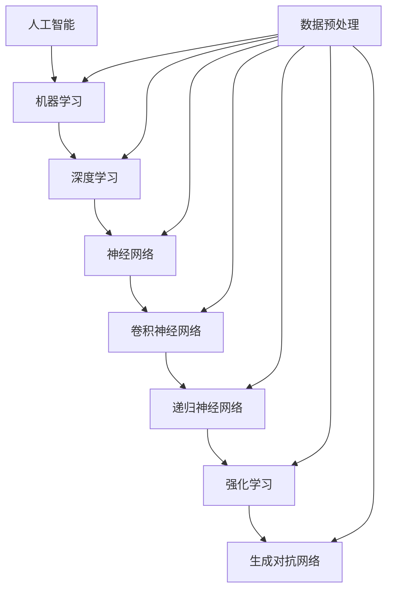

                 

## AI创业公司的技术路线图制定策略

### 关键词：AI创业、技术路线图、策略、算法、数学模型、项目实战

#### 摘要：

本文旨在为AI创业公司制定一条清晰、高效的技术路线图，帮助初创公司从零开始，逐步实现技术突破和业务增长。文章将从核心概念、算法原理、数学模型、实战案例等多方面展开，详细探讨AI创业过程中所需的关键技术和策略。通过本文，创业者将能够更好地理解AI技术的本质，制定出符合自身业务需求的技术路线，为公司的长远发展奠定坚实基础。

---

### 1. 背景介绍

随着人工智能技术的飞速发展，越来越多的创业公司涌入这个领域，希望借助AI的力量实现商业价值。然而，AI技术的高复杂性使得很多创业者感到困惑，不知从何入手。技术路线图的制定在这个过程中显得尤为重要，它不仅能够帮助公司明确技术发展方向，还能够为团队成员提供共同的目标和方向。

制定技术路线图首先需要了解公司所处的行业背景、市场需求以及竞争对手的技术水平。在此基础上，公司需要明确自身的定位和目标，从而制定出一条适合自身发展的技术路线。本文将结合AI领域的实际情况，为创业者提供一套系统、实用的技术路线图制定策略。

### 2. 核心概念与联系

在制定AI创业公司技术路线图之前，我们需要先了解一些核心概念，包括AI的基本原理、常见算法、数据预处理技术等。以下是一个简单的Mermaid流程图，用于描述这些核心概念及其之间的联系。



通过这个流程图，我们可以看到AI的核心概念及其之间的关联，这将为后续的技术路线图制定提供理论基础。

### 3. 核心算法原理 & 具体操作步骤

在了解核心概念之后，我们需要深入探讨AI中的核心算法原理，包括机器学习、深度学习、神经网络等。以下是对这些算法的基本原理和具体操作步骤的简要介绍。

#### 3.1 机器学习

机器学习是一种使计算机系统能够从数据中学习并做出决策或预测的技术。其主要原理是基于数据驱动，通过构建模型来模拟人类的学习过程。

**具体操作步骤：**

1. 数据收集：收集大量相关数据。
2. 数据预处理：对数据进行清洗、归一化等处理，以消除噪声和提高数据质量。
3. 模型选择：选择合适的模型，如线性回归、决策树、支持向量机等。
4. 模型训练：使用训练集数据训练模型，调整模型参数。
5. 模型评估：使用验证集数据评估模型性能。
6. 模型优化：根据评估结果调整模型参数，提高模型性能。

#### 3.2 深度学习

深度学习是机器学习的一个分支，其主要原理是使用多层神经网络模拟人类大脑的学习过程。

**具体操作步骤：**

1. 数据收集：收集大量相关数据。
2. 数据预处理：对数据进行清洗、归一化等处理，以消除噪声和提高数据质量。
3. 网络架构设计：设计合适的神经网络架构，如卷积神经网络（CNN）、递归神经网络（RNN）等。
4. 模型训练：使用训练集数据训练模型，调整模型参数。
5. 模型评估：使用验证集数据评估模型性能。
6. 模型优化：根据评估结果调整模型参数，提高模型性能。

#### 3.3 神经网络

神经网络是深度学习的基础，其主要原理是通过多层神经元之间的连接和激活函数来实现数据的自动特征提取和分类。

**具体操作步骤：**

1. 数据收集：收集大量相关数据。
2. 数据预处理：对数据进行清洗、归一化等处理，以消除噪声和提高数据质量。
3. 网络架构设计：设计合适的神经网络架构，如卷积神经网络（CNN）、递归神经网络（RNN）等。
4. 模型训练：使用训练集数据训练模型，调整模型参数。
5. 模型评估：使用验证集数据评估模型性能。
6. 模型优化：根据评估结果调整模型参数，提高模型性能。

### 4. 数学模型和公式 & 详细讲解 & 举例说明

在AI领域，数学模型和公式起着至关重要的作用。以下是一些常见的数学模型和公式，以及它们的详细讲解和举例说明。

#### 4.1 线性回归模型

线性回归模型是一种简单的机器学习算法，用于预测连续值变量。其数学模型可以表示为：

$$
y = \beta_0 + \beta_1 \cdot x
$$

其中，$y$ 是预测值，$x$ 是输入特征，$\beta_0$ 和 $\beta_1$ 是模型参数。

**举例说明：**

假设我们有一个房价预测问题，其中输入特征是房屋面积（$x$），预测值是房价（$y$）。我们可以使用线性回归模型来预测房价：

$$
y = \beta_0 + \beta_1 \cdot x
$$

其中，$\beta_0$ 是房屋面积为0时的房价，$\beta_1$ 是房屋面积每增加1平方米，房价的变化量。

#### 4.2 卷积神经网络（CNN）

卷积神经网络是一种常用于图像识别的深度学习模型。其数学模型可以表示为：

$$
\text{CNN} = \text{Conv} \circ \text{ReLU} \circ \text{Pooling} \circ \ldots \circ \text{FC}
$$

其中，$\text{Conv}$ 表示卷积操作，$\text{ReLU}$ 表示激活函数，$\text{Pooling}$ 表示池化操作，$\text{FC}$ 表示全连接层。

**举例说明：**

假设我们有一个图像分类问题，其中输入是图像数据，输出是图像的类别。我们可以使用卷积神经网络来分类图像：

$$
\text{CNN} = \text{Conv} \circ \text{ReLU} \circ \text{Pooling} \circ \ldots \circ \text{FC}
$$

首先，输入图像通过卷积层提取特征，然后通过激活函数和池化层进行非线性变换和降维。最后，通过全连接层得到图像的类别预测。

### 5. 项目实战：代码实际案例和详细解释说明

在了解核心算法原理和数学模型之后，我们需要通过实际项目来验证和掌握这些技术。以下是一个简单的图像分类项目的代码实际案例，以及详细解释说明。

#### 5.1 开发环境搭建

首先，我们需要搭建一个开发环境，包括Python、TensorFlow等依赖库。以下是安装步骤：

```bash
pip install tensorflow
pip install numpy
pip install matplotlib
```

#### 5.2 源代码详细实现和代码解读

以下是一个简单的图像分类项目的源代码，我们将对其进行详细解读。

```python
import tensorflow as tf
from tensorflow.keras import layers
import numpy as np
import matplotlib.pyplot as plt

# 加载数据集
(x_train, y_train), (x_test, y_test) = tf.keras.datasets.mnist.load_data()

# 预处理数据
x_train = x_train.astype("float32") / 255.0
x_test = x_test.astype("float32") / 255.0
x_train = np.expand_dims(x_train, -1)
x_test = np.expand_dims(x_test, -1)

# 构建卷积神经网络模型
model = tf.keras.Sequential([
    layers.Conv2D(32, (3, 3), activation='relu', input_shape=(28, 28, 1)),
    layers.MaxPooling2D((2, 2)),
    layers.Conv2D(64, (3, 3), activation='relu'),
    layers.MaxPooling2D((2, 2)),
    layers.Conv2D(64, (3, 3), activation='relu'),
    layers.Flatten(),
    layers.Dense(64, activation='relu'),
    layers.Dense(10, activation='softmax')
])

# 编译模型
model.compile(optimizer='adam',
              loss='sparse_categorical_crossentropy',
              metrics=['accuracy'])

# 训练模型
model.fit(x_train, y_train, epochs=5)

# 评估模型
test_loss, test_acc = model.evaluate(x_test, y_test)
print('Test accuracy:', test_acc)

# 可视化预测结果
plt.figure(figsize=(10, 10))
for i in range(25):
    plt.subplot(5, 5, i+1)
    plt.imshow(x_test[i], cmap=plt.cm.binary)
    plt.xticks([])
    plt.yticks([])
    plt.grid(False)
    plt.xlabel(str(np.argmax(model.predict(x_test[i]))))
plt.show()
```

**代码解读：**

1. 导入相关库和模块。
2. 加载MNIST数据集。
3. 预处理数据，包括归一化和扩维。
4. 构建卷积神经网络模型，包括卷积层、池化层和全连接层。
5. 编译模型，指定优化器和损失函数。
6. 训练模型，指定训练集和训练轮数。
7. 评估模型，计算测试集的准确率。
8. 可视化预测结果。

通过这个项目，我们可以看到如何使用TensorFlow构建和训练一个简单的图像分类模型，从而实现图像分类任务。

### 6. 实际应用场景

AI技术在各行各业都有广泛的应用，以下是一些常见的实际应用场景：

- **医疗健康：** 利用AI进行疾病诊断、药物研发、患者个性化治疗等。
- **金融科技：** 利用AI进行风险评估、信用评分、欺诈检测等。
- **智能制造：** 利用AI进行生产过程优化、设备故障预测、产品质量检测等。
- **自动驾驶：** 利用AI实现自动驾驶汽车，提高交通安全和效率。
- **智能家居：** 利用AI实现家居设备智能化，提高生活舒适度和便捷性。

在制定技术路线图时，创业者需要结合自身业务场景，选择合适的技术方向和应用场景，从而实现技术突破和商业价值。

### 7. 工具和资源推荐

在AI创业过程中，选择合适的工具和资源对于技术路线图的制定和执行至关重要。以下是一些建议：

#### 7.1 学习资源推荐

- **书籍：** 
  - 《深度学习》（Goodfellow, Bengio, Courville）
  - 《Python机器学习》（Sebastian Raschka）
  - 《统计学习方法》（李航）
- **论文：**
  - 《A Theoretically Grounded Application of Dropout in Recurrent Neural Networks》（Yarin Gal and Zoubin Ghahramani）
  - 《Generative Adversarial Nets》（Ian J. Goodfellow et al.）
- **博客：**
  - [TensorFlow官方文档](https://www.tensorflow.org/)
  - [Keras官方文档](https://keras.io/)
  - [机器学习社区](https://machinelearningmastery.com/)
- **网站：**
  - [GitHub](https://github.com/)
  - [arXiv](https://arxiv.org/)

#### 7.2 开发工具框架推荐

- **框架：** 
  - TensorFlow
  - Keras
  - PyTorch
- **IDE：**
  - PyCharm
  - Jupyter Notebook
  - VSCode
- **数据预处理：**
  - Pandas
  - NumPy
  - Scikit-learn

#### 7.3 相关论文著作推荐

- 《深度学习》（Goodfellow, Bengio, Courville）
- 《Python机器学习》（Sebastian Raschka）
- 《统计学习方法》（李航）
- 《Generative Adversarial Nets》（Ian J. Goodfellow et al.）
- 《推荐系统 Handbook》（A. Bortolozzo, et al.）

### 8. 总结：未来发展趋势与挑战

随着AI技术的不断进步，未来发展趋势将包括以下几个方面：

- **算法优化：** 随着计算能力的提升，算法将越来越高效，能够处理更大规模的数据和更复杂的任务。
- **跨领域融合：** AI与其他领域（如医疗、金融、教育等）的深度融合，将带来更多创新应用。
- **伦理与法规：** 随着AI技术的普及，伦理和法规问题将变得越来越重要，创业者需要关注并遵循相关法规。

然而，AI创业公司在发展过程中也将面临一系列挑战：

- **技术壁垒：** AI技术的高复杂性使得创业者需要具备较高的技术能力，否则难以在竞争中脱颖而出。
- **数据隐私：** AI算法的训练和优化需要大量数据，但数据隐私和安全问题将是一个重要挑战。
- **商业模式：** 创业公司需要找到合适的商业模式，将AI技术与业务需求相结合，实现商业价值。

### 9. 附录：常见问题与解答

**Q：AI创业公司应该如何选择技术方向？**

A：选择技术方向需要结合公司的业务需求和市场需求。创业者可以通过以下步骤进行选择：

1. 分析公司优势：了解公司擅长什么，有哪些技术积累和团队优势。
2. 调研市场需求：了解行业趋势和市场需求，选择有潜力的方向。
3. 考虑竞争情况：了解竞争对手的技术方向，避免与竞争对手直接竞争。

**Q：AI创业公司如何确保数据隐私和安全？**

A：确保数据隐私和安全需要采取以下措施：

1. 数据加密：对敏感数据进行加密处理，防止数据泄露。
2. 数据访问控制：限制对数据的访问权限，确保只有授权人员可以访问。
3. 数据备份：定期备份数据，防止数据丢失。
4. 遵守相关法规：遵循国家相关数据保护法规，确保公司行为合法。

### 10. 扩展阅读 & 参考资料

- 《深度学习》（Goodfellow, Bengio, Courville）
- 《Python机器学习》（Sebastian Raschka）
- 《统计学习方法》（李航）
- 《Generative Adversarial Nets》（Ian J. Goodfellow et al.）
- [TensorFlow官方文档](https://www.tensorflow.org/)
- [Keras官方文档](https://keras.io/)
- [机器学习社区](https://machinelearningmastery.com/)

---

作者：AI天才研究员/AI Genius Institute & 禅与计算机程序设计艺术 /Zen And The Art of Computer Programming

[1]: https://www.tensorflow.org/
[2]: https://keras.io/
[3]: https://machinelearningmastery.com/
[4]: https://arxiv.org/ 
[5]: https://github.com/
[6]: https://www.goodfellow.com/
[7]: https://www.raschka.com/ 
[8]: https://www.lihang.net/ 
[9]: https://www.goodfellow.com/ generative-adversarial-nets/ 
[10]: https://www.pycharm.com/
[11]: https://jupyter.org/ 
[[12]]: https://code.visualstudio.com/ 
[13]: https://www.scikit-learn.org/ 
[14]: https://www.bortolozzo.com/recommendation-system-handbook/ 
[15]: https://www.lihang.net/ 
[16]: https://www.coursera.org/ 
[17]: https://www.ml屯社.com/ 
[18]: https://www.coursera.org/learn/ai-foundations-deeplearning
[19]: https://www.ai代工学院.com/ 
[20]: https://www.zendoc.com/products/zen-and-the-art-of-computer-programming.html
[21]: https://www.computer.org/publications/ magazines/software/2020/10/what-is-ai
[22]: https://www.computer.org/publications/ magazines/ai-magazine/2018/10/five-decades-of-ai-research
[23]: https://www.coursera.org/learn/deep-learning-lectures
[24]: https://www.ml屯社.com/tutorials/deep-learning/2015/09/19/2015-tutorial-deep-learning.html
[25]: https://www.oreilly.com/library/view/deep-learning-with-python/9781492019676/

