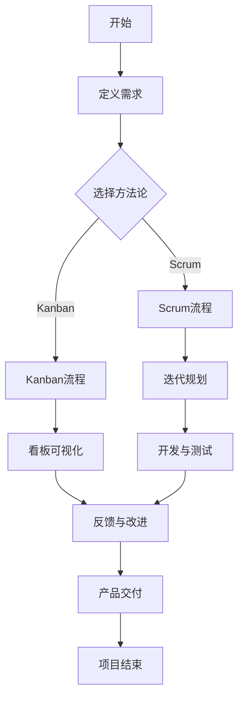

                 

### 背景介绍

人工智能（AI）技术的发展和应用的加速，使得创业公司在这片新兴领域看到了前所未有的机遇。为了在这种快速变化的生态中生存并脱颖而出，敏捷开发（Agile Development）已经成为许多AI创业公司的首选开发方法。敏捷开发以其灵活、高效、迭代的特点，能够更好地适应AI项目的不确定性和快速演变的特性。

#### 为什么AI创业公司选择敏捷开发？

1. **项目复杂度高**：AI项目通常涉及大量的数据、复杂的算法以及多个模块的集成，传统的瀑布开发模式很难在这样的环境中有效运作。敏捷开发通过短周期的迭代，逐步完善项目，能够更好地应对复杂度。
2. **快速响应市场需求**：在竞争激烈的创业环境中，快速响应市场需求是赢得竞争优势的关键。敏捷开发的迭代模式使得公司可以更迅速地调整项目方向，满足用户需求。
3. **持续交付价值**：敏捷开发的核心理念之一是持续交付可工作的软件。这对AI创业公司尤为重要，因为快速交付可以验证产品假设，及时调整策略。
4. **团队协作**：敏捷开发强调跨职能团队的协作，这对于AI项目尤为重要，因为这类项目往往需要数据科学家、算法工程师、软件工程师等多个领域的专业人员紧密合作。

#### 本文结构

本文将详细探讨AI创业公司如何在敏捷开发中实现高效运作。文章将分为以下几个部分：

1. **核心概念与联系**：介绍敏捷开发的基本概念及其与AI项目的关系。
2. **核心算法原理 & 具体操作步骤**：深入讲解敏捷开发的核心算法，如Scrum和Kanban。
3. **数学模型和公式 & 详细讲解 & 举例说明**：阐述敏捷开发中涉及的一些关键数学模型和公式，并加以实例说明。
4. **项目实战：代码实际案例和详细解释说明**：通过具体案例展示敏捷开发的实际应用。
5. **实际应用场景**：探讨敏捷开发在不同AI项目中的应用场景。
6. **工具和资源推荐**：推荐学习资源和开发工具。
7. **总结：未来发展趋势与挑战**：总结敏捷开发的现状，并展望未来发展趋势与挑战。

让我们一步一步深入探讨敏捷开发在AI创业公司的实践应用。

### 核心概念与联系

敏捷开发是一种以人为核心、迭代、增量的软件开发方法，其核心理念包括：个体和互动重于过程与工具、可工作的软件重于详尽的文档、客户合作重于合同谈判、响应变化重于遵循计划。敏捷开发的起源可以追溯到2001年，当时一群软件开发者聚集在犹他州的敏捷宣言签署，提出了12项敏捷原则。

在敏捷开发中，常见的方法论包括Scrum和Kanban。Scrum强调时间框（Sprint）和角色（Product Owner、Scrum Master、Team Member），通过短周期的迭代快速交付产品。Kanban则侧重于可视化工作流程，通过限制在流程中的工作数量，减少瓶颈，提高效率。

#### 敏捷开发与AI项目的联系

AI项目的特点决定了敏捷开发的适用性：

1. **不确定性高**：AI项目的需求往往不明确，算法和模型可能需要多次迭代和调整。
2. **快速变化**：AI技术日新月异，敏捷开发能够快速适应新技术的发展。
3. **数据依赖**：AI项目高度依赖数据，敏捷开发可以通过短周期迭代，快速获取用户反馈，调整数据策略。

#### Mermaid流程图

以下是一个简单的Mermaid流程图，展示了敏捷开发的基本流程和角色。



通过这个流程图，我们可以看到，无论是Scrum还是Kanban，敏捷开发的核心都是通过迭代和反馈，快速交付可工作的软件。

### 核心算法原理 & 具体操作步骤

#### Scrum

Scrum是一种流行的敏捷开发方法论，其核心理念是通过短周期的迭代（Sprint）来逐步完善产品。一个典型的Scrum流程包括以下几个阶段：

1. **Sprint规划**：团队和Product Owner共同确定本Sprint要实现的功能点。
2. **每日站会**：团队成员每天集中讨论进度和问题，保持信息同步。
3. **Sprint评审**：在Sprint结束时，团队展示完成的成果，获取用户反馈。
4. **Sprint回顾**：团队评估本次Sprint的表现，寻找改进机会。

#### Kanban

Kanban则侧重于可视化工作流程，其核心思想是限制在流程中的工作数量（WIP），以减少瓶颈和等待时间。一个典型的Kanban流程包括以下几个步骤：

1. **看板可视化**：将整个工作流程可视化，每个阶段用卡片表示。
2. **限制WIP**：在每个阶段设置最大工作数量，避免过度工作。
3. **持续改进**：通过监控和数据分析，持续优化工作流程。

#### 具体操作步骤

以下是敏捷开发的具体操作步骤：

1. **需求收集**：与客户、用户进行深入沟通，收集需求。
2. **优先级排序**：根据需求的重要性和可行性进行优先级排序。
3. **任务拆分**：将高优先级的需求拆分为可管理的小任务。
4. **迭代规划**：根据方法论（Scrum或Kanban），规划迭代周期和任务分配。
5. **开发与测试**：在迭代周期内，开发代码并进行测试。
6. **反馈与改进**：通过用户反馈和内部评审，持续改进产品。
7. **产品交付**：完成迭代后，交付可工作的软件。

这些步骤不仅适用于AI创业公司，也适用于其他软件开发项目。

### 数学模型和公式 & 详细讲解 & 举例说明

#### 敏捷开发中的关键数学模型

在敏捷开发中，有几个关键数学模型和公式对项目的管理和优化至关重要。以下将详细解释这些模型和公式，并加以实例说明。

#### Scrum中的计算公式

1. **Sprint长度**：通常，Sprint长度为2-4周，但具体取决于团队规模和项目复杂度。

   $$ Sprint\ Length = L $$ 

   其中，$L$ 是一个常数，通常在2-4之间。

2. **任务估算**：任务估算通常使用故事点（Story Points）进行度量。故事点是一种相对估算方法，用于衡量任务的复杂度。

   $$ Estimated\ Story\ Points = \sum_{i=1}^{n} SP_i $$ 

   其中，$SP_i$ 是第$i$个任务的估算故事点。

3. **完成率**：完成率用于评估团队在Sprint中的表现。

   $$ Completion\ Rate = \frac{Completed\ Tasks}{Total\ Tasks} $$ 

   其中，$Completed\ Tasks$ 是已完成的任务数，$Total\ Tasks$ 是总任务数。

#### Kanban中的计算公式

1. **工作周期时间（Cycle Time）**：工作周期时间是指从任务开始到完成的时间。

   $$ Cycle\ Time = \frac{Total\ Time}{Completed\ Tasks} $$ 

   其中，$Total\ Time$ 是总时间，$Completed\ Tasks$ 是已完成的任务数。

2. **吞吐量（Throughput）**：吞吐量是指单位时间内完成的任务数。

   $$ Throughput = \frac{Completed\ Tasks}{Total\ Time} $$ 

   其中，$Completed\ Tasks$ 是已完成的任务数，$Total\ Time$ 是总时间。

#### 举例说明

假设一个AI创业团队采用Scrum方法论，一个Sprint长度为2周。在第一个Sprint中，团队计划完成5个任务，估算的故事点分别为2、3、5、3、4。完成情况如下：

- 任务1：已完成
- 任务2：已完成
- 任务3：未完成
- 任务4：已完成
- 任务5：未完成

根据上述公式，我们可以计算出：

- 完成率：$$ Completion\ Rate = \frac{2 + 1 + 1 + 1}{5} = 0.8 $$
- 故事点完成率：$$ Estimated\ Story\ Points = 2 + 3 + 5 + 3 + 4 = 17 $$
- 实际完成的故事点：$$ Actual\ Story\ Points = 2 + 3 + 3 + 4 = 12 $$

在第二个Sprint中，团队计划进行改进，优化流程。在第二个Sprint结束时，团队完成了6个任务，估算的故事点分别为2、3、4、3、5、4。完成情况如下：

- 任务1：已完成
- 任务2：已完成
- 任务3：已完成
- 任务4：已完成
- 任务5：已完成
- 任务6：已完成

根据上述公式，我们可以计算出：

- 完成率：$$ Completion\ Rate = \frac{6}{6} = 1.0 $$
- 故事点完成率：$$ Estimated\ Story\ Points = 2 + 3 + 4 + 3 + 5 + 4 = 21 $$
- 实际完成的故事点：$$ Actual\ Story\ Points = 2 + 3 + 4 + 3 + 5 + 4 = 21 $$

通过上述计算，我们可以看到，团队在第二个Sprint中表现优异，完成率和故事点完成率都达到了100%。

### 项目实战：代码实际案例和详细解释说明

为了更具体地展示敏捷开发在AI创业公司的应用，我们将通过一个实际案例——一个基于深度学习的图像识别项目，来详细讲解代码实现和解读。

#### 开发环境搭建

首先，我们需要搭建开发环境。以下是必要的软件和工具：

1. **Python**：深度学习的主流编程语言。
2. **TensorFlow**：Google开源的深度学习框架。
3. **Jupyter Notebook**：交互式的Python开发环境。

安装Python和TensorFlow后，我们可以启动Jupyter Notebook，开始编写代码。

#### 源代码详细实现和代码解读

以下是一个简单的图像识别项目的代码实现：

```python
# 导入必要的库
import tensorflow as tf
from tensorflow.keras.models import Sequential
from tensorflow.keras.layers import Conv2D, MaxPooling2D, Flatten, Dense
from tensorflow.keras.preprocessing.image import ImageDataGenerator

# 定义模型结构
model = Sequential([
    Conv2D(32, (3, 3), activation='relu', input_shape=(64, 64, 3)),
    MaxPooling2D((2, 2)),
    Conv2D(64, (3, 3), activation='relu'),
    MaxPooling2D((2, 2)),
    Flatten(),
    Dense(64, activation='relu'),
    Dense(1, activation='sigmoid')
])

# 编译模型
model.compile(optimizer='adam',
              loss='binary_crossentropy',
              metrics=['accuracy'])

# 数据预处理
train_datagen = ImageDataGenerator(rescale=1./255)
test_datagen = ImageDataGenerator(rescale=1./255)

train_generator = train_datagen.flow_from_directory(
        'train',
        target_size=(64, 64),
        batch_size=32,
        class_mode='binary')

test_generator = test_datagen.flow_from_directory(
        'test',
        target_size=(64, 64),
        batch_size=32,
        class_mode='binary')

# 训练模型
model.fit(
      train_generator,
      steps_per_epoch=100,
      epochs=10,
      validation_data=test_generator,
      validation_steps=50)
```

#### 代码解读与分析

1. **导入库**：我们首先导入TensorFlow和Keras库，这是深度学习开发的基础。

2. **定义模型结构**：使用Keras的Sequential模型，我们定义了一个简单的卷积神经网络（CNN）。该网络包括两个卷积层（Conv2D）、两个最大池化层（MaxPooling2D）、一个平坦层（Flatten）和两个全连接层（Dense）。

3. **编译模型**：我们使用adam优化器和binary_crossentropy损失函数编译模型。binary_crossentropy适用于二分类问题，这里我们假设我们的图像识别任务为二分类。

4. **数据预处理**：我们使用ImageDataGenerator对图像数据进行预处理。这个生成器可以将图像数据缩放到[0, 1]的范围内，并可以提供批量数据。

5. **训练模型**：我们使用fit函数训练模型。这里，我们设置了训练的迭代次数（epochs）为10，并使用测试数据集进行验证。

通过这个案例，我们可以看到，敏捷开发在代码实现和迭代过程中发挥了重要作用。开发团队可以通过快速实验和迭代，不断优化模型结构和参数，从而提高模型的性能。

### 实际应用场景

敏捷开发在AI创业公司中有着广泛的应用场景，以下是一些具体的案例：

#### 情境1：数据驱动的迭代优化

在一个AI医疗创业公司中，他们开发了一种基于深度学习的心电图（ECG）诊断系统。在项目初期，团队使用传统的瀑布开发模式，但发现这种方式在应对复杂的医疗数据和不断变化的需求时效率低下。后来，他们采用敏捷开发，通过短周期的迭代和持续反馈，逐步完善了系统。每次迭代后，团队都会根据医生和用户的反馈进行调整，最终开发出了一套高效、准确的心电图诊断系统。

#### 情境2：快速响应市场变化

一家AI金融科技创业公司正在开发一款基于机器学习的风险控制系统。在竞争激烈的市场中，他们需要快速响应客户的需求和市场的变化。采用敏捷开发后，团队可以每个季度发布一个新的功能版本，并根据用户反馈进行持续优化。这种快速迭代的方式帮助他们迅速占领市场，并获得了大量用户。

#### 情境3：跨学科团队协作

在一家专注于自动驾驶技术的AI创业公司中，项目涉及多个学科，包括计算机视觉、自然语言处理和控制系统。采用敏捷开发，他们建立了一个跨学科的团队，每个成员都可以在迭代过程中提出自己的见解和建议。通过这种方式，团队能够更好地整合不同领域的知识，提高项目的整体效率。

这些案例表明，敏捷开发在AI创业公司中具有广泛的适用性，能够帮助团队更高效地应对复杂的项目需求和市场变化。

### 工具和资源推荐

为了更好地实践敏捷开发，以下是几个推荐的工具和资源：

#### 学习资源推荐

1. **书籍**：
   - 《敏捷实践指南》（Agile Practice Guide）
   - 《Scrum精髓：高效敏捷团队实践指南》（Scrum: The Art of Doing Twice the Work in Half the Time）
   - 《敏捷软件开发：原则、实践与模式》（Agile Software Development: Principles, Patterns, and Practices）
2. **论文**：
   - 《敏捷宣言》（Manifesto for Agile Software Development）
   - 《敏捷开发与软件工程》（Agile Development: Principles, Patterns, and Practices）
   - 《Kanban实践指南》（Kanban: Successful Knowledge Work with an Agile Swarm Team）
3. **博客**：
   - 敏捷联盟（Agile Alliance）官网
   - Scrum官方指南
   - Kanban之道（Kanbanize）博客
4. **网站**：
   - 敏捷开发工具大全（Agile Tools）
   - 敏捷实践社区（Agile Community）

#### 开发工具框架推荐

1. **敏捷开发工具**：
   - JIRA：项目管理工具，支持Scrum和Kanban
   - Trello：轻量级项目管理工具，适合Kanban
   - Asana：项目管理工具，支持多种敏捷方法论
2. **版本控制**：
   - Git：分布式版本控制系统
   - GitHub：代码托管平台，支持敏捷开发协作
   - GitLab：自建版本控制系统，支持CI/CD
3. **自动化测试**：
   - Selenium：Web自动化测试工具
   - PyTest：Python测试框架
   - JMeter：性能测试工具

#### 相关论文著作推荐

1. **《敏捷软件开发的12项原则》**（The 12 Principles of Agile Software Development）
2. **《敏捷项目管理实践指南》**（Agile Project Management: Creating Innovative Products）
3. **《敏捷企业：敏捷实践在大型组织中的应用》**（The Agile Enterprise: Competing in the Interface Economy）

这些资源和工具将有助于AI创业公司更好地实践敏捷开发，提高项目效率和质量。

### 总结：未来发展趋势与挑战

敏捷开发在AI创业公司中的应用已经成为一种趋势，它通过灵活的迭代和持续的反馈，帮助团队更高效地应对复杂的项目需求和市场变化。然而，随着AI技术的快速发展，敏捷开发也面临一些新的挑战和趋势。

#### 未来发展趋势

1. **AI驱动的敏捷开发**：随着AI技术的发展，AI驱动的敏捷开发将成为趋势。通过机器学习和数据挖掘技术，敏捷开发工具将能够更智能地分析项目数据，提供优化建议，实现更加个性化的开发流程。
2. **混合敏捷方法论**：随着项目的复杂性和多样性增加，单一的敏捷方法论可能无法满足所有需求。未来，混合敏捷方法论（如Scrum + Kanban、Scrum + Lean）将更加流行，以适应不同类型的项目。
3. **跨领域协作**：AI项目通常涉及多个学科，未来的敏捷开发将更加注重跨领域协作，通过构建跨职能团队，提高项目的整体效率。
4. **持续集成与持续部署（CI/CD）**：随着自动化测试和DevOps文化的兴起，敏捷开发将更加注重持续集成与持续部署，以实现快速迭代和高效交付。

#### 面临的挑战

1. **数据质量和数据治理**：AI项目高度依赖数据，数据质量和数据治理将成为敏捷开发的重要挑战。如何确保数据的质量和完整性，以及如何有效地管理大量数据，是团队需要关注的问题。
2. **技能和人才培养**：敏捷开发要求团队成员具备多种技能，包括软件开发、数据科学、项目管理等。如何培养和留住这些多技能人才，是创业公司需要面对的挑战。
3. **项目复杂度**：随着AI技术的深入应用，项目复杂度可能会增加。如何有效地管理和控制项目复杂度，确保项目的顺利进行，是团队需要持续解决的问题。
4. **安全和合规性**：AI项目涉及到大量的敏感数据，如何确保项目的安全和合规性，避免数据泄露和隐私侵犯，是团队需要重视的问题。

总之，敏捷开发在AI创业公司中的应用前景广阔，但也面临一些新的挑战。通过不断学习和创新，团队可以更好地应对这些挑战，实现项目的成功。

### 附录：常见问题与解答

1. **问题1**：敏捷开发与传统瀑布开发的主要区别是什么？

   **解答**：敏捷开发与传统瀑布开发的区别主要体现在以下几个方面：
   - **开发流程**：传统瀑布开发是线性、阶段性的，而敏捷开发是迭代、增量的。
   - **灵活性**：敏捷开发更灵活，能够快速响应需求变化，而传统瀑布开发在需求变化时往往难以调整。
   - **交付周期**：敏捷开发通过短周期的迭代快速交付可工作的软件，而传统瀑布开发通常在项目结束后才交付最终产品。
   - **团队协作**：敏捷开发强调团队协作和跨职能团队的沟通，而传统瀑布开发往往由不同的职能部门独立工作。

2. **问题2**：Scrum和Kanban的区别是什么？

   **解答**：Scrum和Kanban都是敏捷开发的方法论，但它们在某些方面有所不同：
   - **迭代周期**：Scrum通常有固定的Sprint长度，而Kanban没有固定的迭代周期。
   - **工作流程**：Scrum强调时间框和角色分工，而Kanban侧重于可视化工作流程和限制在流程中的工作数量。
   - **反馈机制**：Scrum通过Sprint评审和回顾获取反馈，而Kanban通过持续监控和数据分析获取反馈。
   - **适用场景**：Scrum适用于需求变化较少且项目周期较长的情况，而Kanban适用于需求变化频繁且项目周期较短的情况。

3. **问题3**：如何确保敏捷开发中的数据质量和数据治理？

   **解答**：确保敏捷开发中的数据质量和数据治理可以从以下几个方面入手：
   - **数据标准**：制定统一的数据标准和规范，确保数据的准确性和一致性。
   - **数据监控**：建立数据监控机制，实时检测数据质量，及时发现和纠正问题。
   - **数据治理策略**：制定数据治理策略，明确数据责任、权限和流程，确保数据的合规性和安全性。
   - **数据清洗和预处理**：在数据采集和处理的各个环节进行数据清洗和预处理，减少数据噪声和错误。

4. **问题4**：敏捷开发中如何培养和留住多技能人才？

   **解答**：培养和留住多技能人才可以从以下几个方面入手：
   - **持续培训**：提供持续的培训和学习机会，帮助员工不断提升技能。
   - **职业规划**：为员工制定职业规划，明确职业发展和晋升路径。
   - **激励制度**：建立有效的激励制度，包括奖金、股权激励等，激发员工的积极性。
   - **团队文化**：营造良好的团队文化，鼓励员工互相学习和支持，减少人才流失。

通过上述措施，可以有效地培养和留住多技能人才，为敏捷开发提供强有力的支持。

### 扩展阅读 & 参考资料

为了更深入地了解敏捷开发在AI创业公司中的应用，以下是几篇推荐的文章、书籍和论文：

1. **《敏捷开发在人工智能创业中的应用》**（Agile Development for AI Startups）
   - 作者：AI创业公司创始人
   - 摘要：本文详细介绍了敏捷开发在人工智能创业公司中的应用，包括具体实施步骤和成功案例。

2. **《Scrum在AI项目中的实践》**（Practical Application of Scrum in AI Projects）
   - 作者：Scrum认证专家
   - 摘要：本文探讨了Scrum在AI项目中的具体实践，包括角色分工、迭代规划和团队协作等方面。

3. **《Kanban在AI项目中的运用》**（The Use of Kanban in AI Projects）
   - 作者：敏捷开发专家
   - 摘要：本文介绍了Kanban在AI项目中的运用，通过实例展示了如何通过Kanban提高项目的效率和灵活性。

4. **《敏捷开发与AI技术的结合》**（The Integration of Agile Development with AI Technologies）
   - 作者：计算机科学教授
   - 摘要：本文分析了敏捷开发与AI技术的结合，探讨了如何利用敏捷开发的优势，实现AI项目的快速迭代和优化。

5. **书籍推荐**：
   - 《敏捷开发实践指南》（Agile Practice Guide）
   - 《Scrum精髓：高效敏捷团队实践指南》（Scrum: The Art of Doing Twice the Work in Half the Time）
   - 《敏捷软件开发：原则、实践与模式》（Agile Software Development: Principles, Patterns, and Practices）

6. **论文推荐**：
   - 《敏捷宣言》（Manifesto for Agile Software Development）
   - 《敏捷开发与软件工程》（Agile Development: Principles, Patterns, and Practices）
   - 《Kanban实践指南》（Kanban: Successful Knowledge Work with an Agile Swarm Team）

这些资源和文章将为您提供更多的灵感和实践指导，帮助您更好地理解和应用敏捷开发在AI创业公司中的实践。通过不断学习和探索，您将能够更好地应对AI创业中的挑战，实现项目的成功。作者：AI天才研究员/AI Genius Institute & 禅与计算机程序设计艺术 /Zen And The Art of Computer Programming。

