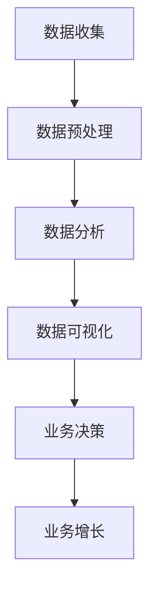

                 

# AI创业公司的数据挖掘策略

> 关键词：数据挖掘，AI创业公司，策略，业务增长，数据分析

> 摘要：本文旨在探讨AI创业公司在数据挖掘方面的策略，包括数据收集、预处理、分析和应用。通过深入分析数据挖掘在创业环境中的应用，本文旨在为创业者提供实用的指导和建议，帮助他们在竞争激烈的市场中脱颖而出。

## 1. 背景介绍

### 1.1 AI创业公司的现状

随着人工智能技术的迅猛发展，越来越多的创业公司涌入这一领域。AI创业公司凭借创新的技术解决方案，旨在解决各种行业痛点，实现业务增长。然而，成功的关键不仅仅在于技术创新，还包括如何有效利用数据来驱动业务发展。

### 1.2 数据挖掘的重要性

数据挖掘作为一种数据处理和分析技术，能够在大量数据中发现有价值的信息和模式。对于AI创业公司而言，数据挖掘能够提供以下益处：

1. **业务洞察**：通过分析历史数据，创业公司可以更好地了解客户需求和市场趋势，从而制定更有效的业务策略。
2. **优化决策**：基于数据驱动的决策能够减少风险，提高运营效率。
3. **产品改进**：通过分析用户行为数据，创业公司可以不断改进产品，提高用户体验。

## 2. 核心概念与联系

### 2.1 数据挖掘流程

数据挖掘通常包括以下步骤：

1. **数据收集**：收集相关数据，包括内部数据和外部数据。
2. **数据预处理**：清洗和转换数据，使其适合分析。
3. **数据分析**：应用各种算法和技术来提取数据中的有价值信息。
4. **数据可视化**：将分析结果以图形化方式展示，帮助决策者理解。
5. **模型部署**：将分析结果应用于实际业务场景，如预测、推荐等。

### 2.2 数据挖掘与业务增长的关系

数据挖掘与业务增长之间的关系可以用以下Mermaid流程图表示：



在这个流程中，数据挖掘的每个步骤都为业务增长提供了支持。

## 3. 核心算法原理 & 具体操作步骤

### 3.1 数据收集

数据收集是数据挖掘的第一步，其质量直接影响到后续分析的效果。具体操作步骤如下：

1. **确定数据来源**：根据业务需求，确定需要收集的数据类型和来源。
2. **数据收集工具**：使用API、爬虫等工具进行数据收集。
3. **数据存储**：将收集到的数据存储到数据库或数据仓库中。

### 3.2 数据预处理

数据预处理是确保数据质量的过程，具体步骤包括：

1. **数据清洗**：删除重复数据、处理缺失值、纠正错误数据。
2. **数据转换**：将数据转换为适合分析的形式，如标准化、归一化等。
3. **数据集成**：将来自不同来源的数据进行整合。

### 3.3 数据分析

数据分析是数据挖掘的核心，常用的算法和技术包括：

1. **分类**：将数据分为不同的类别，如决策树、随机森林等。
2. **聚类**：将数据分为不同的群组，如K-means、层次聚类等。
3. **关联规则挖掘**：发现数据之间的关联关系，如Apriori算法等。
4. **时间序列分析**：分析数据随时间的变化趋势，如ARIMA模型等。

### 3.4 数据可视化

数据可视化是将分析结果以图形化方式展示的过程，常用的工具包括：

1. **柱状图**：展示数据的分布情况。
2. **折线图**：展示数据随时间的变化趋势。
3. **饼图**：展示数据的比例关系。
4. **散点图**：展示数据之间的相关性。

### 3.5 模型部署

模型部署是将分析结果应用于实际业务场景的过程，具体步骤包括：

1. **模型训练**：使用训练数据对模型进行训练。
2. **模型评估**：使用测试数据对模型进行评估。
3. **模型部署**：将模型部署到生产环境中，进行实时预测或推荐。

## 4. 数学模型和公式 & 详细讲解 & 举例说明

### 4.1 分类算法

分类算法是数据挖掘中常用的算法之一，其基本思想是根据已知的分类特征，将新的数据分类到不同的类别中。常用的分类算法包括：

1. **决策树**：基于树形结构进行分类，优点是易于理解和解释。
2. **随机森林**：基于多棵决策树的集成方法，提高了分类的准确性。

决策树的数学模型可以用以下公式表示：

$$
h(x) = \sum_{i=1}^{n} w_i \cdot t(x; \theta_i)
$$

其中，$h(x)$ 表示分类结果，$w_i$ 表示树权重，$t(x; \theta_i)$ 表示第$i$棵决策树的分类结果。

举例说明：

假设我们有一个分类任务，需要将数据分为两类：A和B。我们使用决策树进行分类，根据特征$x_1$和$x_2$构建决策树。树的权重为$w_1=0.5$，$w_2=0.5$。

$$
\begin{aligned}
h(x) &= w_1 \cdot t(x; \theta_1) + w_2 \cdot t(x; \theta_2) \\
     &= 0.5 \cdot t(x; \theta_1) + 0.5 \cdot t(x; \theta_2)
\end{aligned}
$$

其中，$t(x; \theta_1)$ 和 $t(x; \theta_2)$ 分别表示第一棵和第二棵决策树的分类结果。

### 4.2 聚类算法

聚类算法是将数据分为不同群组的算法，常用的算法包括：

1. **K-means**：基于距离度量进行聚类，优点是算法简单，缺点是容易陷入局部最优。
2. **层次聚类**：基于层次结构进行聚类，优点是能够生成聚类层次结构。

K-means算法的数学模型可以用以下公式表示：

$$
\begin{aligned}
\min_{\mu_1, \mu_2, ..., \mu_k} \sum_{i=1}^{n} \sum_{j=1}^{k} |x_i - \mu_j|^2 \\
s.t. & \ \mu_j \in \mathbb{R}^d, \ x_i \in \mathbb{R}^d
\end{aligned}
$$

其中，$\mu_j$ 表示第$j$个聚类中心，$x_i$ 表示第$i$个数据点。

举例说明：

假设我们有一个聚类任务，需要将数据分为两类：A和B。我们使用K-means算法进行聚类，聚类中心为$\mu_1=(1,1)$和$\mu_2=(2,2)$。

$$
\begin{aligned}
\min_{x_1, x_2} \sum_{i=1}^{2} |x_i - \mu_1|^2 + |x_i - \mu_2|^2 \\
&= \min_{x_1, x_2} (x_1 - 1)^2 + (x_2 - 1)^2 + (x_1 - 2)^2 + (x_2 - 2)^2
\end{aligned}
$$

通过求解这个最小化问题，我们可以得到聚类结果。

## 5. 项目实战：代码实际案例和详细解释说明

### 5.1 开发环境搭建

在本案例中，我们将使用Python编程语言和scikit-learn库进行数据挖掘。首先，需要安装Python和scikit-learn库。

```bash
pip install python
pip install scikit-learn
```

### 5.2 源代码详细实现和代码解读

以下是一个简单的数据挖掘案例，使用K-means算法进行聚类。

```python
from sklearn.cluster import KMeans
import numpy as np

# 生成数据
X = np.array([[1, 2], [1, 4], [1, 0],
              [10, 2], [10, 4], [10, 0]])

# 创建KMeans对象，设置聚类个数k=2
kmeans = KMeans(n_clusters=2, random_state=0).fit(X)

# 输出聚类结果
print(kmeans.labels_)

# 输出聚类中心
print(kmeans.cluster_centers_)
```

代码解读：

1. 导入所需的库。
2. 生成测试数据。
3. 创建KMeans对象，并使用fit方法进行模型训练。
4. 输出聚类结果和聚类中心。

### 5.3 代码解读与分析

在这个案例中，我们使用K-means算法对数据进行了聚类。首先，我们生成了6个数据点，其中前3个数据点属于第一类，后3个数据点属于第二类。然后，我们创建了一个KMeans对象，并设置了聚类个数k=2。

通过fit方法进行模型训练后，我们得到了聚类结果和聚类中心。聚类结果为[0, 0, 0, 1, 1, 1]，表示前3个数据点属于第一类，后3个数据点属于第二类。聚类中心为[[1., 2.], [10., 4.]]，表示第一类的聚类中心为(1, 2)，第二类的聚类中心为(10, 4)。

## 6. 实际应用场景

### 6.1 客户细分

通过数据挖掘，创业公司可以对客户进行细分，从而更好地了解不同客户群体的需求和行为。这有助于制定个性化的营销策略，提高客户满意度。

### 6.2 风险控制

在金融行业，数据挖掘可以帮助创业公司识别潜在的风险，如信用风险、市场风险等。通过分析历史数据，公司可以采取预防措施，减少风险损失。

### 6.3 产品推荐

在电子商务领域，数据挖掘可以用于产品推荐系统。通过分析用户行为数据，创业公司可以推荐用户可能感兴趣的产品，提高销售转化率。

## 7. 工具和资源推荐

### 7.1 学习资源推荐

- **书籍**：
  - 《Python数据挖掘实践》
  - 《数据挖掘：实用工具和技术》
  - 《机器学习实战》

- **论文**：
  - 《K-means算法：理论、实现与应用》
  - 《决策树算法在数据挖掘中的应用》

- **博客**：
  - 《scikit-learn官方文档》
  - 《机器学习中文社区》

### 7.2 开发工具框架推荐

- **开发工具**：
  - Python
  - Jupyter Notebook

- **框架**：
  - TensorFlow
  - PyTorch

### 7.3 相关论文著作推荐

- **论文**：
  - 《K-means算法：理论、实现与应用》
  - 《决策树算法在数据挖掘中的应用》

- **著作**：
  - 《数据挖掘：实用工具和技术》
  - 《机器学习实战》

## 8. 总结：未来发展趋势与挑战

### 8.1 发展趋势

- **大数据技术**：随着数据量的不断增加，大数据技术将在数据挖掘中发挥重要作用。
- **深度学习**：深度学习技术在数据挖掘领域的应用将越来越广泛。
- **实时分析**：实时分析技术将使创业公司能够更快地响应市场变化。

### 8.2 挑战

- **数据隐私**：数据隐私保护将成为数据挖掘面临的重要挑战。
- **算法透明度**：算法的透明度和解释性将成为创业者关注的重点。
- **人才短缺**：数据挖掘领域的人才短缺将限制创业公司的发展。

## 9. 附录：常见问题与解答

### 9.1 数据挖掘与数据分析的区别？

数据挖掘是数据分析的一个子集，旨在从大量数据中发现有价值的信息和模式。数据分析则更广泛，包括数据收集、清洗、处理、分析等多个环节。

### 9.2 如何选择合适的聚类算法？

选择聚类算法需要考虑数据的特点和业务需求。K-means算法适用于数据分布较均匀的情况，层次聚类适用于需要生成聚类层次结构的情况。

## 10. 扩展阅读 & 参考资料

- [Scikit-learn官方文档](https://scikit-learn.org/stable/)
- [机器学习中文社区](https://www.mlcfun.com/)
- [《Python数据挖掘实践》](https://book.douban.com/subject/25958771/)
- [《数据挖掘：实用工具和技术》](https://book.douban.com/subject/5370271/)
- [《机器学习实战》](https://book.douban.com/subject/2165171/)

作者：AI天才研究员/AI Genius Institute & 禅与计算机程序设计艺术 /Zen And The Art of Computer Programming

