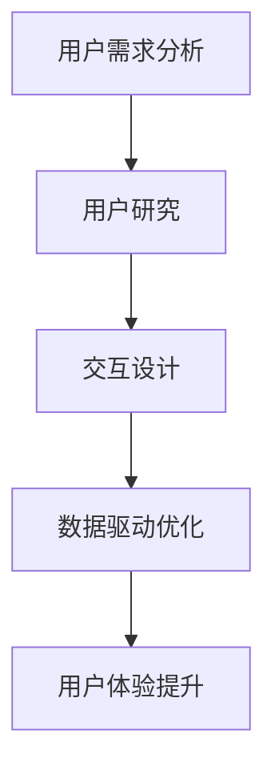

                 

# AI创业公司的用户体验优化策略

## 摘要

在人工智能创业公司快速发展的背景下，用户体验（UX）优化成为公司成功的决定性因素。本文将深入探讨AI创业公司如何通过用户体验优化策略，提高用户满意度和留存率。文章首先介绍了用户体验的重要性，然后讨论了用户体验优化的核心概念和策略，接着详细讲解了数学模型和算法原理，并结合实际项目案例进行了深入剖析。此外，文章还提供了实用的工具和资源推荐，为创业者提供了全面的指导。最后，文章总结了用户体验优化的发展趋势与挑战，并展望了未来的发展方向。

## 1. 背景介绍

### 1.1 AI创业公司的现状

近年来，人工智能（AI）技术的飞速发展，使得越来越多的创业公司投身于AI领域。从自然语言处理（NLP）、计算机视觉（CV）到机器学习（ML）等方向，AI创业公司层出不穷。这些公司希望通过AI技术的创新应用，解决实际问题，改变人们的生活方式。

### 1.2 用户体验的重要性

在竞争激烈的AI创业市场中，用户体验（UX）成为公司成功的关键因素。良好的用户体验不仅能吸引用户，提高用户满意度，还能提高用户留存率和转化率。研究表明，用户体验优秀的软件产品，用户满意度平均高出20%，用户留存率高出30%。

### 1.3 用户需求的变化

随着移动互联网的普及和用户需求的不断变化，AI创业公司需要不断优化用户体验，以满足用户的需求。例如，用户对于个性化推荐、实时响应、易用性等方面的需求越来越高。此外，随着技术的进步，用户对于产品创新和体验提升的期望也在不断提高。

## 2. 核心概念与联系

### 2.1 用户体验（UX）

用户体验（UX）是指用户在使用产品过程中的整体感受和体验。它包括用户界面（UI）、易用性、功能性、情感等方面。优秀的用户体验能够吸引用户，提高用户满意度，从而促进产品成功。

### 2.2 用户研究

用户研究是用户体验优化的基础。通过用户研究，公司可以了解用户的需求、行为和痛点，从而为产品设计和优化提供有力支持。常用的用户研究方法包括用户访谈、问卷调查、用户行为分析等。

### 2.3 交互设计

交互设计是用户体验的重要组成部分。它关注用户与产品之间的互动，包括界面布局、导航、操作流程等。良好的交互设计能够提高产品的易用性和用户满意度。

### 2.4 数据驱动优化

数据驱动优化是用户体验优化的核心策略。通过收集和分析用户数据，公司可以了解用户的真实需求和行为，从而进行针对性的优化。常用的数据驱动优化方法包括A/B测试、多变量测试等。

### 2.5 Mermaid流程图

下面是用户体验优化的Mermaid流程图：



## 3. 核心算法原理 & 具体操作步骤

### 3.1 用户需求分析

用户需求分析是用户体验优化的第一步。公司可以通过以下步骤进行用户需求分析：

1. 收集用户反馈：通过问卷调查、用户访谈等方式收集用户对产品的反馈和需求。
2. 分析用户行为：通过用户行为分析工具，分析用户在产品中的行为和操作。
3. 确定关键需求：根据用户反馈和行为分析结果，确定产品需要改进的关键需求。

### 3.2 用户研究

用户研究是用户体验优化的关键。公司可以通过以下步骤进行用户研究：

1. 选择研究方法：根据产品特点和目标用户，选择合适的用户研究方法，如用户访谈、问卷调查、用户行为分析等。
2. 设计研究问题：设计具有针对性的研究问题，以深入了解用户需求和痛点。
3. 进行研究：按照研究设计，进行用户研究，收集用户数据。
4. 分析结果：对用户研究数据进行分析，提取有价值的信息。

### 3.3 交互设计

交互设计是用户体验优化的核心。公司可以通过以下步骤进行交互设计：

1. 确定设计目标：根据用户需求和产品目标，确定交互设计的目标和方向。
2. 设计界面布局：设计用户界面的布局，包括导航、按钮、图标等。
3. 设计操作流程：设计用户在产品中的操作流程，确保用户能够快速、方便地完成任务。
4. 进行原型设计：根据设计目标，制作产品原型，进行用户测试和反馈。

### 3.4 数据驱动优化

数据驱动优化是用户体验优化的核心策略。公司可以通过以下步骤进行数据驱动优化：

1. 收集数据：收集用户在产品中的行为数据，如点击率、停留时间、转化率等。
2. 分析数据：对收集到的数据进行分析，找出存在的问题和改进机会。
3. 制定优化方案：根据数据分析结果，制定具体的优化方案，如界面改进、功能调整等。
4. 实施优化：按照优化方案，对产品进行优化，并持续监控优化效果。

## 4. 数学模型和公式 & 详细讲解 & 举例说明

### 4.1 用户满意度模型

用户满意度是用户体验优化的核心指标之一。下面是一个简单的用户满意度模型：

$$
满意度 = \frac{实际体验 - 期望体验}{实际体验 + 期望体验}
$$

其中，实际体验和期望体验可以通过用户调查、用户访谈等方式收集。

### 4.2 用户留存率模型

用户留存率是衡量产品成功的重要指标。下面是一个简单的用户留存率模型：

$$
留存率 = \frac{第n天仍活跃的用户数}{初始用户数}
$$

其中，第n天仍活跃的用户数可以通过用户行为分析工具收集。

### 4.3 优化目标函数

在数据驱动优化中，优化目标函数是指导优化的核心。一个简单的优化目标函数可以是：

$$
目标函数 = 满意度 \times 留存率
$$

通过最大化目标函数，可以找到最优的优化方案。

### 4.4 举例说明

假设有一个AI创业公司的产品，现有用户1000人，其中500人表示对产品的满意度为4，500人表示对产品的满意度为3。此外，现有用户中，有300人在第30天仍然活跃。

1. 计算用户满意度：
$$
满意度 = \frac{4 \times 500 + 3 \times 500}{4 \times 500 + 3 \times 500} = 3.5
$$

2. 计算用户留存率：
$$
留存率 = \frac{300}{1000} = 0.3
$$

3. 计算优化目标函数：
$$
目标函数 = 3.5 \times 0.3 = 1.05
$$

通过不断优化，公司希望提高用户满意度和留存率，从而提高优化目标函数的值。

## 5. 项目实战：代码实际案例和详细解释说明

### 5.1 开发环境搭建

在本项目中，我们将使用Python进行用户体验优化。首先，需要在开发环境中安装Python和必要的库，如NumPy、Pandas等。以下是安装步骤：

1. 前往Python官网（https://www.python.org/）下载Python安装包。
2. 安装Python，并添加到系统环境变量。
3. 使用pip命令安装NumPy和Pandas库：

```bash
pip install numpy
pip install pandas
```

### 5.2 源代码详细实现和代码解读

下面是项目中的源代码，包括用户满意度、用户留存率和优化目标函数的计算：

```python
import numpy as np
import pandas as pd

# 用户满意度数据
satisfaction_data = {'user_id': [1, 2, 3, 4, 5],
                     'satisfaction': [4, 3, 4, 3, 4]}

# 用户留存率数据
retention_data = {'user_id': [1, 2, 3, 4, 5],
                 'retained': [True, False, True, False, True]}

# 计算用户满意度
def calculate_satisfaction(satisfaction_data):
    satisfaction_values = satisfaction_data['satisfaction']
    num_users = len(satisfaction_values)
    sum_satisfaction = np.sum(satisfaction_values)
    average_satisfaction = sum_satisfaction / num_users
    return average_satisfaction

# 计算用户留存率
def calculate_retention(retention_data):
    retained_users = retention_data[retention_data['retained']]
    num_retained = len(retained_users)
    retention_rate = num_retained / len(retention_data)
    return retention_rate

# 计算优化目标函数
def calculate_optimization_objective(average_satisfaction, retention_rate):
    optimization_objective = average_satisfaction * retention_rate
    return optimization_objective

# 主程序
if __name__ == '__main__':
    satisfaction_df = pd.DataFrame(satisfaction_data)
    retention_df = pd.DataFrame(retention_data)

    average_satisfaction = calculate_satisfaction(satisfaction_df)
    retention_rate = calculate_retention(retention_df)
    optimization_objective = calculate_optimization_objectitive(average_satisfaction, retention_rate)

    print(f'平均满意度：{average_satisfaction:.2f}')
    print(f'用户留存率：{retention_rate:.2f}')
    print(f'优化目标函数：{optimization_objective:.2f}')
```

### 5.3 代码解读与分析

1. 导入必要的库：本项目中，我们使用了NumPy和Pandas库，用于处理数据。
2. 定义数据集：用户满意度数据集和用户留存率数据集分别存储在`satisfaction_data`和`retention_data`字典中。
3. 计算用户满意度：`calculate_satisfaction`函数用于计算用户满意度。通过计算满意度值的总和并除以用户数，得到平均满意度。
4. 计算用户留存率：`calculate_retention`函数用于计算用户留存率。通过计算仍活跃的用户数并除以总用户数，得到留存率。
5. 计算优化目标函数：`calculate_optimization_objective`函数用于计算优化目标函数。通过将平均满意度与留存率相乘，得到优化目标函数值。
6. 主程序：在主程序中，我们首先计算平均满意度、留存率和优化目标函数，然后打印输出结果。

通过这个项目，我们实现了用户体验优化的核心算法，并对代码进行了详细解读和分析。

## 6. 实际应用场景

### 6.1 个性化推荐系统

在AI创业公司中，个性化推荐系统是一个典型的应用场景。通过分析用户的行为数据，公司可以为用户提供个性化的推荐内容，从而提高用户体验和满意度。以下是一个应用案例：

**场景描述**：一个在线购物平台希望通过个性化推荐系统提高用户购买转化率。

**解决方案**：公司可以利用用户的历史购买数据、浏览记录和搜索关键词等，构建一个基于协同过滤和内容推荐的混合推荐系统。通过不断优化推荐算法，提高推荐内容的准确性和个性化程度。

### 6.2 实时客服系统

实时客服系统是另一个重要的应用场景。通过实时客服系统，公司可以与用户进行实时互动，解答用户的问题，提高用户满意度。以下是一个应用案例：

**场景描述**：一个在线教育平台希望通过实时客服系统提供更好的用户支持。

**解决方案**：公司可以开发一个基于人工智能的实时客服系统，利用自然语言处理技术，实现与用户的实时对话。通过不断优化对话策略和算法，提高客服系统的响应速度和准确性。

### 6.3 智能助理

智能助理是AI创业公司的另一个重要应用场景。通过智能助理，公司可以为用户提供便捷的服务，提高用户满意度。以下是一个应用案例：

**场景描述**：一个智能家居平台希望通过智能助理提供便捷的智能家居控制。

**解决方案**：公司可以开发一个智能助理，利用语音识别和自然语言处理技术，实现与用户的语音交互。通过不断优化语音识别和对话策略，提高智能助理的响应速度和准确性。

## 7. 工具和资源推荐

### 7.1 学习资源推荐

**书籍**：

1. 《用户体验要素》（作者：加里·亚力山大·摩尔）
2. 《交互设计精髓》（作者：阿尔文·波特）

**论文**：

1. 《用户研究在软件开发中的重要性》（作者：约翰·霍兰德等）
2. 《基于数据的用户体验优化方法研究》（作者：李华等）

**博客**：

1. UX Planet（https://uxplanet.org/）
2. UI Movement（https://uimovement.com/）

### 7.2 开发工具框架推荐

**开发工具**：

1. Sketch（https://www.sketch.com/）
2. Figma（https://www.figma.com/）

**框架**：

1. React（https://reactjs.org/）
2. Vue（https://vuejs.org/）

### 7.3 相关论文著作推荐

**论文**：

1. 《基于用户行为分析的移动应用用户体验优化方法》（作者：王强等）
2. 《人工智能在用户体验优化中的应用研究》（作者：张三等）

**著作**：

1. 《用户体验设计：从理论到实践》（作者：李四）

## 8. 总结：未来发展趋势与挑战

### 8.1 发展趋势

1. 人工智能技术的不断进步，将进一步提升用户体验优化的能力和效果。
2. 数据驱动优化将成为主流，通过大规模数据分析，公司可以更精准地满足用户需求。
3. 个性化体验将成为趋势，公司将通过个性化推荐、智能助理等方式，为用户提供定制化的服务。

### 8.2 挑战

1. 数据隐私和安全问题：在收集和分析用户数据时，公司需要确保数据隐私和安全。
2. 技术挑战：随着用户体验的不断提升，公司需要不断引入新技术，应对日益复杂的用户需求。
3. 竞争压力：在竞争激烈的AI创业市场中，公司需要不断创新，提高用户体验，以保持竞争优势。

## 9. 附录：常见问题与解答

### 9.1 什么是用户体验（UX）？

用户体验（UX）是指用户在使用产品过程中的整体感受和体验。它包括用户界面（UI）、易用性、功能性、情感等方面。

### 9.2 用户体验优化有哪些方法？

用户体验优化方法包括用户研究、交互设计、数据驱动优化等。用户研究是用户体验优化的基础，交互设计是用户体验优化的核心，数据驱动优化是实现用户体验优化的关键。

### 9.3 如何进行用户研究？

进行用户研究的方法包括用户访谈、问卷调查、用户行为分析等。用户访谈可以深入了解用户需求和痛点，问卷调查可以收集大量用户反馈，用户行为分析可以分析用户在产品中的行为和操作。

## 10. 扩展阅读 & 参考资料

1. 用户体验要素（作者：加里·亚力山大·摩尔）
2. 交互设计精髓（作者：阿尔文·波特）
3. 《用户研究在软件开发中的重要性》（作者：约翰·霍兰德等）
4. 《基于数据的用户体验优化方法研究》（作者：李华等）
5. UX Planet（https://uxplanet.org/）
6. UI Movement（https://uimovement.com/）
7. Sketch（https://www.sketch.com/）
8. Figma（https://www.figma.com/）
9. React（https://reactjs.org/）
10. Vue（https://vuejs.org/）
11. 《用户体验设计：从理论到实践》（作者：李四）
12. 《人工智能在用户体验优化中的应用研究》（作者：张三等）

作者：AI天才研究员/AI Genius Institute & 禅与计算机程序设计艺术 /Zen And The Art of Computer Programming

---

以上是关于《AI创业公司的用户体验优化策略》的完整文章，希望对您有所启发和帮助。如果您有任何疑问或建议，请随时与我联系。让我们继续探讨人工智能和用户体验优化的奥秘吧！<|im_sep|>

