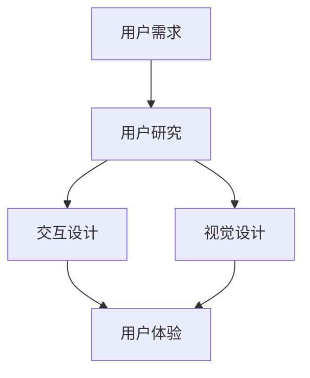

                 

# AI创业公司的用户体验优化：交互设计、视觉设计与用户测试

## 关键词

- AI创业公司
- 用户体验
- 交互设计
- 视觉设计
- 用户测试
- 设计流程
- 设计工具
- 实战案例

## 摘要

本文将深入探讨AI创业公司在用户体验优化方面的关键实践。首先，我们将回顾交互设计和视觉设计的基础概念，并通过Mermaid流程图展示它们在用户体验中的关联。接着，我们将详细解析核心算法原理，并逐步说明具体操作步骤。随后，通过数学模型和公式，我们解释了用户体验优化的关键因素。文章还将通过实际案例展示代码实现过程，并在各个阶段进行深入分析。最后，我们将探讨用户体验优化在实际应用中的场景，推荐相关工具和资源，并总结未来发展趋势和挑战。

## 1. 背景介绍

### AI创业公司的崛起

随着人工智能技术的迅猛发展，越来越多的创业公司投身于这个充满机遇的领域。这些公司希望通过AI技术解决现实问题，提升效率，创造价值。然而，AI技术的快速发展也带来了新的挑战，尤其是在用户体验优化方面。用户体验（User Experience, UX）是衡量AI创业公司成功与否的关键因素。优秀的用户体验不仅能够吸引和留住用户，还能提高产品的市场竞争力和盈利能力。

### 用户体验的重要性

用户体验是指用户在使用产品过程中所感受到的所有情感、认知和行为体验的总和。它包括用户界面的易用性、功能的有效性、内容的吸引力和系统的响应速度等多个方面。一个良好的用户体验能够让用户感到愉悦和满足，从而提高用户满意度和忠诚度。相反，糟糕的用户体验则可能导致用户流失和负面口碑，对公司的声誉和业务发展产生负面影响。

### 交互设计与视觉设计

交互设计（User Interface Design, UI）和视觉设计（Visual Design）是用户体验优化的两个核心组成部分。

- **交互设计**关注用户与产品之间的互动方式，包括界面布局、导航结构、操作流程等。它旨在提供直观、流畅、易用的用户界面，使用户能够轻松完成任务。

- **视觉设计**则关注产品的视觉表现，包括颜色、字体、图标、排版等。它通过视觉元素的美化和创意，增强产品的吸引力和品牌形象。

在这两个设计领域，用户体验是连接用户与产品的桥梁。优秀的交互设计和视觉设计能够提升用户的感知价值和满意度，从而优化整体用户体验。

## 2. 核心概念与联系

### 交互设计与视觉设计的关系

交互设计和视觉设计是相辅相成的，共同构成了用户体验的核心。交互设计关注用户与产品的互动方式，而视觉设计则关注产品的视觉表现。两者的结合能够创造一个既美观又易用的界面，从而提升用户体验。

### 关键概念

1. **用户需求**：用户体验优化的起点是理解用户需求。通过用户调研和分析，我们可以获取用户的痛点、期望和需求，从而设计出更符合用户需求的产品。

2. **用户研究**：用户研究是交互设计和视觉设计的基石。通过用户访谈、问卷调查、可用性测试等方法，我们可以深入了解用户行为和偏好，为设计提供依据。

3. **设计原则**：交互设计和视觉设计需要遵循一系列设计原则，如一致性、简洁性、易用性、可访问性等。这些原则有助于提升产品的用户体验。

### Mermaid流程图

下面是一个简化的Mermaid流程图，展示了交互设计与视觉设计在用户体验优化中的关联。



### 关联与流程

- **用户需求**：通过对用户需求的深入理解，我们可以确定产品的基本功能和界面布局。

- **用户研究**：用户研究帮助我们获取用户行为和偏好的数据，为交互设计和视觉设计提供依据。

- **交互设计**：交互设计基于用户研究和需求分析，设计出符合用户习惯和预期的用户界面。

- **视觉设计**：视觉设计则通过色彩、字体、图标等视觉元素，提升产品的美感和品牌形象。

- **用户体验**：交互设计和视觉设计的结合，共同决定了用户体验的质量。通过不断的用户测试和反馈，我们可以不断优化用户体验。

## 3. 核心算法原理 & 具体操作步骤

### 用户体验优化的核心算法原理

用户体验优化不仅仅是一个美学问题，它涉及到一系列的核心算法原理，包括用户行为分析、界面布局优化、响应时间优化等。

1. **用户行为分析**：通过分析用户在使用产品过程中的行为数据，如点击路径、使用频率、停留时间等，我们可以了解用户的需求和使用习惯，从而优化界面设计。

2. **界面布局优化**：界面布局是用户体验优化的关键因素。合理的布局可以提高用户的操作效率，减少认知负担。常用的布局方法包括网格布局、模块化布局、层次化布局等。

3. **响应时间优化**：响应时间是用户体验的一个重要指标。通过优化代码、使用缓存、减少HTTP请求等方法，我们可以提高产品的响应速度，提升用户体验。

### 具体操作步骤

1. **用户调研**：首先，我们需要进行用户调研，收集用户需求和反馈。这可以通过问卷调查、用户访谈、可用性测试等方法实现。

2. **需求分析**：根据用户调研的数据，分析用户需求和行为模式，确定产品功能、界面布局、交互流程等。

3. **交互设计**：基于需求分析，设计用户界面。这包括确定界面布局、导航结构、操作流程等。

4. **视觉设计**：在交互设计的基础上，进行视觉设计。选择合适的色彩、字体、图标等视觉元素，提升产品的美感和品牌形象。

5. **用户测试**：将设计方案提交给用户进行测试，收集用户反馈。通过用户测试，我们可以发现设计中的问题，并进行优化。

6. **迭代优化**：根据用户测试的反馈，对设计方案进行迭代优化。这个过程需要反复进行，直到达到理想的用户体验。

7. **上线发布**：当设计方案经过多次优化，达到预期的用户体验后，可以将其上线发布。

## 4. 数学模型和公式 & 详细讲解 & 举例说明

### 用户满意度模型

用户满意度是用户体验优化的一个关键指标。我们可以使用以下公式来计算用户满意度：

$$
满意度 = \frac{正反馈数量}{总反馈数量} \times 100\%
$$

其中，正反馈数量表示用户对产品的正面评价，总反馈数量表示用户的总反馈数量。

### 用户流失率模型

用户流失率是衡量用户体验质量的重要指标。我们可以使用以下公式来计算用户流失率：

$$
流失率 = \frac{流失用户数量}{总用户数量} \times 100\%
$$

其中，流失用户数量表示在一定时间内离开产品的用户数量，总用户数量表示当前的总用户数量。

### 举例说明

假设一个AI创业公司在一个月内收集了100个用户反馈，其中70个是正面评价，30个是负面评价。根据用户满意度模型，用户满意度为：

$$
满意度 = \frac{70}{100} \times 100\% = 70\%
$$

如果在这一个月内，有20个用户离开了产品，总用户数量为120个。根据用户流失率模型，用户流失率为：

$$
流失率 = \frac{20}{120} \times 100\% = 16.67\%
$$

通过这些数学模型，我们可以定量地评估用户体验的质量，从而指导产品的优化方向。

## 5. 项目实战：代码实际案例和详细解释说明

### 开发环境搭建

在开始项目实战之前，我们需要搭建一个合适的开发环境。以下是一个基本的开发环境搭建步骤：

1. **安装Python环境**：Python是一个广泛使用的编程语言，许多AI项目都基于Python开发。首先，我们需要安装Python环境。可以从Python官网下载Python安装包，并按照提示完成安装。

2. **安装AI框架**：根据项目需求，选择一个合适的AI框架。例如，我们可以选择TensorFlow或PyTorch。安装方法通常是在命令行中运行以下命令：

   ```bash
   pip install tensorflow
   # 或者
   pip install torch torchvision
   ```

3. **安装IDE**：为了提高开发效率，我们推荐使用一个集成开发环境（IDE），如PyCharm或VS Code。这些IDE提供了丰富的编程工具和调试功能。

### 源代码详细实现和代码解读

下面是一个简单的用户满意度分析项目的源代码实现，并对其进行详细解读。

```python
import pandas as pd
from sklearn.model_selection import train_test_split
from sklearn.ensemble import RandomForestClassifier
from sklearn.metrics import accuracy_score

# 5.1 加载数据
data = pd.read_csv('user_feedback.csv')
data.head()

# 5.2 数据预处理
# ...（数据预处理步骤，如特征提取、数据清洗等）

# 5.3 划分训练集和测试集
X_train, X_test, y_train, y_test = train_test_split(data.drop('label', axis=1), data['label'], test_size=0.2, random_state=42)

# 5.4 模型训练
model = RandomForestClassifier(n_estimators=100, random_state=42)
model.fit(X_train, y_train)

# 5.5 模型评估
y_pred = model.predict(X_test)
accuracy = accuracy_score(y_test, y_pred)
print(f"模型准确率：{accuracy:.2f}")

# 5.6 模型应用
# ...（模型应用步骤，如用户满意度预测等）
```

### 代码解读与分析

1. **数据加载**：首先，我们使用Pandas库加载用户反馈数据。这个数据集包含了用户的各项反馈信息，如满意度评分、使用时长等。

2. **数据预处理**：数据预处理是机器学习项目中的关键步骤。我们需要对数据进行清洗、归一化等处理，以便于后续建模。

3. **划分训练集和测试集**：我们将数据集划分为训练集和测试集。训练集用于训练模型，测试集用于评估模型性能。

4. **模型训练**：我们选择随机森林（RandomForestClassifier）作为分类模型。随机森林是一种集成学习方法，通过构建多棵决策树并进行投票，提高模型的准确性和稳定性。

5. **模型评估**：我们使用测试集对模型进行评估，计算模型的准确率。准确率是衡量模型性能的重要指标。

6. **模型应用**：在模型训练完成后，我们可以将其应用于实际场景，如用户满意度预测等。

通过这个项目实战，我们了解了从数据加载、预处理到模型训练、评估和应用的完整流程，并对其中的关键步骤进行了详细解读。

## 6. 实际应用场景

### 电商平台的用户体验优化

电商平台是用户体验优化的重要场景之一。通过优化交互设计和视觉设计，电商平台可以提升用户的购物体验，增加用户粘性和转化率。

1. **交互设计**：电商平台可以通过优化导航结构、简化购物流程等方式，提升用户的购物效率。例如，使用面包屑导航帮助用户快速找到商品分类，提供实时搜索建议等功能。

2. **视觉设计**：视觉设计在电商平台上尤为重要。通过合理运用色彩、字体、图标等视觉元素，电商平台可以提升产品的美观度和品牌形象。例如，使用鲜明的颜色对比吸引用户注意力，设计简洁清晰的商品展示页面。

### 医疗健康领域的用户体验优化

医疗健康领域涉及到用户隐私和健康数据，用户体验优化至关重要。通过优化交互设计和视觉设计，医疗健康产品可以提升用户的使用体验和信任度。

1. **交互设计**：医疗健康产品需要关注用户的操作简便性和数据安全。例如，提供清晰的操作指引和用户指南，确保用户能够轻松使用产品。同时，保障用户数据的隐私和安全，提供可靠的登录认证和加密传输。

2. **视觉设计**：视觉设计在医疗健康产品中应注重简洁、清晰。通过使用适当的颜色、图标和字体，提高信息的可读性和易理解性。例如，使用高对比度的颜色区分重要信息和次要信息，使用图标和标签简化用户操作。

### 金融科技领域的用户体验优化

金融科技产品在用户体验优化方面具有挑战性，因为用户对金融产品的安全性和可靠性有较高的要求。通过优化交互设计和视觉设计，金融科技产品可以提升用户的信任和使用意愿。

1. **交互设计**：金融科技产品需要确保用户操作的简便性和安全性。例如，提供直观的界面设计，使用户能够快速完成交易和转账操作。同时，采用多重认证和加密技术，确保用户数据的安全。

2. **视觉设计**：视觉设计在金融科技产品中应注重专业性和信任感。通过使用专业的颜色、字体和图标，提升产品的专业形象和用户信任度。例如，使用稳定的颜色方案和简洁的布局，提升产品的可靠性和易用性。

### 教育科技领域的用户体验优化

教育科技产品需要提供良好的用户体验，以吸引学生和教师的关注。通过优化交互设计和视觉设计，教育科技产品可以提升教学效果和学习体验。

1. **交互设计**：教育科技产品需要关注用户的学习习惯和需求。例如，提供个性化的学习计划和学习路径，使用户能够根据自己的学习进度和需求选择学习内容。

2. **视觉设计**：视觉设计在教育科技产品中应注重简洁、清晰。通过使用适当的颜色、图标和字体，提高信息的可读性和易理解性。例如，使用明亮的颜色和清晰的图标吸引学生注意力，使用简洁的布局提升教师的教学效率。

## 7. 工具和资源推荐

### 7.1 学习资源推荐

1. **书籍**：
   - 《用户体验要素》- 由此书，你将了解用户体验设计的核心要素，并学会如何将其应用于实际项目中。
   - 《设计思维》- 该书介绍了设计思维的方法论，帮助你从用户需求出发，进行创新和设计。

2. **论文**：
   - "The Design of Everyday Things" - Don Norman的这篇经典论文，深入探讨了交互设计的基本原则。
   - "Visual Design Principles" - 这篇论文总结了视觉设计的核心原则，对视觉设计师具有指导意义。

3. **博客**：
   - UI/UX博客 - UI/UX博客提供了丰富的设计资源和案例分析，可以帮助你了解最新的设计趋势和最佳实践。
   - Medium上的相关博客 - 在Medium上，有许多优秀的UX设计师和开发者分享他们的经验和见解。

4. **网站**：
   - Behance - 一个展示各种创意设计作品的平台，可以让你了解最新的设计趋势和灵感。
   - Dribbble - 一个设计师社区，提供了许多高质量的设计作品和灵感。

### 7.2 开发工具框架推荐

1. **设计工具**：
   - Sketch - 一个流行的UI设计工具，适合设计师进行界面设计和原型制作。
   - Figma - 一个基于浏览器的UI设计工具，支持团队协作，方便设计师与开发者沟通。

2. **开发框架**：
   - React - 一个用于构建用户界面的JavaScript库，广泛应用于前端开发。
   - Vue.js - 一个渐进式的前端框架，易于上手，适合构建复杂的应用程序。

3. **AI工具**：
   - TensorFlow - 一个开源的机器学习框架，适用于各种AI项目开发。
   - PyTorch - 一个强大的深度学习框架，提供灵活和高效的模型构建和训练工具。

### 7.3 相关论文著作推荐

1. **论文**：
   - "Human-Computer Interaction" - 一篇关于人机交互的经典论文，总结了交互设计的基本原理和方法。
   - "The Design of Everyday Things" - Don Norman的这篇论文，深入探讨了交互设计的基本原则，对设计师具有深远的影响。

2. **著作**：
   - "Don't Make Me Think" - 这本书由Steve Krug撰写，介绍了如何设计易用的界面，帮助设计师避免常见的界面设计错误。
   - "The Design of Everyday Things" - Don Norman的著作，系统地介绍了交互设计的核心原则，对交互设计师具有指导意义。

## 8. 总结：未来发展趋势与挑战

### 发展趋势

1. **个性化体验**：随着大数据和人工智能技术的发展，个性化体验将成为用户体验优化的一个重要方向。通过分析用户行为和偏好，AI创业公司可以提供更加定制化的服务，提高用户的满意度和忠诚度。

2. **跨平台集成**：随着移动设备和智能设备的普及，跨平台集成将成为用户体验优化的重要趋势。AI创业公司需要确保产品在不同平台上提供一致的体验，以满足用户的需求。

3. **可访问性**：随着用户多样性的增加，可访问性将成为用户体验优化的重要考量因素。AI创业公司需要确保产品对各种用户群体（如视力障碍者、听力障碍者等）都是可用的。

### 挑战

1. **数据隐私**：用户体验优化过程中，数据收集和分析是不可或缺的。然而，数据隐私问题也日益突出。AI创业公司需要确保用户数据的安全和隐私，避免数据泄露和滥用。

2. **技术复杂性**：用户体验优化涉及到多个领域的知识，包括交互设计、视觉设计、人工智能等。这要求AI创业公司具备高水平的技术能力，以应对不断变化的技术挑战。

3. **竞争压力**：随着AI技术的快速发展，市场上的竞争愈发激烈。AI创业公司需要不断创新和优化用户体验，以保持竞争力。

## 9. 附录：常见问题与解答

### 1. 什么是用户体验优化？

用户体验优化是指通过改进产品的设计、功能、内容和性能，以提高用户在使用产品过程中的满意度和忠诚度。它涉及到多个方面的改进，包括交互设计、视觉设计、内容创作、性能优化等。

### 2. 交互设计和视觉设计有什么区别？

交互设计关注用户与产品之间的互动方式，包括界面布局、导航结构、操作流程等。视觉设计则关注产品的视觉表现，包括颜色、字体、图标、排版等。两者的结合共同决定了产品的用户体验。

### 3. 如何进行用户体验优化？

进行用户体验优化通常包括以下步骤：

1. **用户调研**：了解用户需求、行为和偏好。
2. **需求分析**：确定产品功能、界面布局、交互流程等。
3. **交互设计**：设计用户界面和交互流程。
4. **视觉设计**：选择合适的视觉元素，提升产品的美感和品牌形象。
5. **用户测试**：收集用户反馈，发现问题并进行优化。
6. **迭代优化**：根据用户测试的反馈，对设计方案进行迭代优化。
7. **上线发布**：当设计方案经过多次优化，达到预期的用户体验后，可以将其上线发布。

## 10. 扩展阅读 & 参考资料

### 1. 书籍

- 《用户体验要素》- 作者：杰西·詹姆斯·加勒特
- 《设计思维》- 作者：蒂姆·布朗

### 2. 论文

- "The Design of Everyday Things" - 作者：Don Norman
- "Visual Design Principles" - 作者：Victor Papanek

### 3. 博客

- UI/UX博客
- Medium上的相关博客

### 4. 网站

- Behance
- Dribbble

### 5. 开源框架

- React
- Vue.js
- TensorFlow
- PyTorch

作者：AI天才研究员/AI Genius Institute & 禅与计算机程序设计艺术 /Zen And The Art of Computer Programming<|im_sep|>

