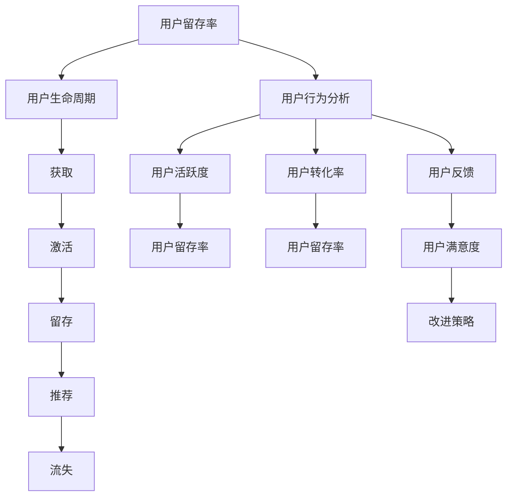

                 

# AI创业公司的用户留存策略

## 摘要

本文旨在探讨AI创业公司在提升用户留存率方面所应采取的策略。通过分析用户留存的关键因素、评估当前AI技术的应用场景，本文将深入探讨用户留存策略的构建与实施，包括用户行为分析、个性化推荐、社交互动、用户教育与忠诚度计划等具体措施。文章还将提供实战案例和实用工具资源推荐，帮助AI创业公司有效地提升用户留存率。

## 1. 背景介绍

随着人工智能（AI）技术的飞速发展，越来越多的创业公司开始将AI作为提升业务竞争力的重要工具。然而，在竞争激烈的市场环境中，用户留存问题成为许多AI创业公司面临的重大挑战。用户留存不仅关乎公司的短期业绩，更影响其长期发展。高用户留存率意味着用户对产品或服务的持续依赖和认可，从而为公司带来稳定的收入和市场份额。

然而，AI创业公司在提升用户留存方面面临诸多挑战。首先，用户需求的多样性和复杂性使得个性化服务成为必要。其次，AI技术的复杂性和易用性之间的平衡需要深入研究。此外，数据隐私和安全问题也成为用户留存的一大障碍。因此，如何制定有效的用户留存策略，成为AI创业公司亟待解决的重要课题。

本文将围绕以下几个核心问题展开讨论：

1. 用户留存的重要性及其对AI创业公司的影响。
2. 用户留存的关键因素分析。
3. 当前AI技术在用户留存中的应用场景。
4. 有效的用户留存策略构建与实施。
5. 实战案例和实用工具资源推荐。

通过以上内容的探讨，本文旨在为AI创业公司提供一套切实可行的用户留存策略，以助力其在竞争激烈的市场中脱颖而出。

## 2. 核心概念与联系

为了深入理解用户留存策略，我们需要首先了解一些核心概念，包括用户留存率、用户生命周期和用户行为分析。以下是这些概念的定义及其相互关系。

### 2.1 用户留存率

用户留存率是指在一定时间内，用户持续使用某一产品或服务的比例。用户留存率是衡量产品或服务受欢迎程度和用户满意度的重要指标。高留存率意味着用户对产品或服务有较强的依赖和忠诚度，反之则可能表明产品存在某些问题。

### 2.2 用户生命周期

用户生命周期是指用户从首次接触到产品或服务，到最终流失的整个过程。用户生命周期通常可以分为以下几个阶段：

1. **获取（Acquisition）**：用户首次接触产品或服务，通常通过广告、推广、口碑传播等渠道。
2. **激活（Activation）**：用户开始使用产品或服务，并初步体验到其价值。
3. **留存（Retention）**：用户持续使用产品或服务，并在一定时间内保持活跃。
4. **推荐（Referral）**：用户将产品或服务推荐给其他潜在用户。
5. **流失（Churn）**：用户停止使用产品或服务，可能是由于不满意、找不到价值或转向其他竞争对手。

用户生命周期对于用户留存策略的制定至关重要，因为不同阶段的用户需求和痛点各不相同，需要采取针对性的策略来提高留存率。

### 2.3 用户行为分析

用户行为分析是指通过收集和分析用户在使用产品或服务过程中的行为数据，来了解用户的行为模式、偏好和需求。用户行为分析包括以下几个方面：

1. **用户活跃度**：用户在产品或服务中的活动频率，如登录次数、使用时长等。
2. **用户留存率**：用户在一定时间内的留存情况，包括日留存、周留存和月留存等。
3. **用户转化率**：用户从特定行为（如注册、购买等）转化为实际客户的比例。
4. **用户反馈**：用户对产品或服务的评价和反馈，包括满意度调查、用户评论等。

用户行为分析有助于识别用户流失的原因，发现产品或服务的改进点，从而制定更有效的用户留存策略。

### 2.4 核心概念之间的联系

用户留存率、用户生命周期和用户行为分析三者之间存在密切的联系。用户留存率是衡量用户生命周期阶段的关键指标，而用户生命周期各个阶段的成功与否直接影响用户留存率。用户行为分析则为理解用户在各个生命周期阶段的行为提供了数据支持，帮助公司制定出更有针对性的留存策略。

### Mermaid 流程图

以下是用户留存策略的核心概念和关系的 Mermaid 流程图：



通过以上核心概念的介绍和Mermaid流程图的展示，我们可以更清晰地理解用户留存策略的构建基础。接下来，我们将进一步探讨用户留存策略的具体实施步骤。

## 3. 核心算法原理 & 具体操作步骤

### 3.1 用户行为预测模型

用户留存策略的基础是了解用户的行为模式。为此，我们可以采用机器学习中的用户行为预测模型。以下是一种基于决策树的用户行为预测模型的具体操作步骤。

#### 3.1.1 数据收集

首先，我们需要收集用户行为数据，包括登录时间、使用时长、访问页面、购买行为等。这些数据可以通过日志分析工具自动收集。

#### 3.1.2 数据预处理

收集到的数据需要进行清洗和预处理，包括去除重复数据、填充缺失值、标准化数据等。以下是一个简单的数据预处理步骤：

1. **数据清洗**：去除无效和重复的数据。
2. **数据转换**：将类别数据转换为数值数据，如使用独热编码（One-Hot Encoding）。
3. **数据标准化**：对数值数据进行归一化或标准化，使其具有相同的量级。

#### 3.1.3 特征工程

特征工程是用户行为预测模型成功的关键步骤。通过特征选择和特征构造，我们可以提取出对用户行为有重要影响的特征。以下是一些常用的特征：

1. **用户活跃度**：如日登录次数、每周使用时长等。
2. **行为频率**：如购买频率、访问频率等。
3. **行为序列**：用户的连续行为序列，可用于序列模型分析。
4. **用户分类**：根据用户特征（如年龄、性别、地理位置等）进行分类。

#### 3.1.4 模型训练

使用决策树算法对预处理后的数据集进行训练。决策树算法是一种基于树形结构进行分类和回归的模型。以下是一个简单的决策树训练步骤：

1. **构建决策树**：根据特征和目标变量，构建决策树模型。
2. **剪枝**：通过剪枝减少模型的复杂度，避免过拟合。
3. **交叉验证**：使用交叉验证方法评估模型的性能。

#### 3.1.5 模型评估

使用评估指标（如准确率、召回率、F1分数等）对模型进行评估。以下是一个简单的模型评估步骤：

1. **划分数据集**：将数据集划分为训练集和测试集。
2. **训练模型**：使用训练集训练模型。
3. **测试模型**：使用测试集测试模型的性能。

#### 3.1.6 模型应用

根据模型预测结果，对用户进行分类，识别出可能流失的用户，并采取相应的留存措施。

### 3.2 个性化推荐算法

个性化推荐是提高用户留存率的重要手段。以下是一种基于协同过滤的个性化推荐算法的具体操作步骤。

#### 3.2.1 数据收集

收集用户的行为数据，包括用户之间的交互记录、用户的浏览历史、购买记录等。

#### 3.2.2 数据预处理

对收集到的数据进行清洗和预处理，包括去除重复数据、填充缺失值、标准化数据等。

#### 3.2.3 计算用户相似度

计算用户之间的相似度，常用的方法包括余弦相似度和皮尔逊相关系数。以下是一个简单的相似度计算步骤：

1. **构建用户行为矩阵**：将用户的行为数据转换为矩阵形式。
2. **计算相似度**：使用余弦相似度或皮尔逊相关系数计算用户之间的相似度。

#### 3.2.4 推荐物品

基于用户相似度，为每个用户推荐相似的物品。以下是一个简单的推荐步骤：

1. **计算物品相似度**：计算物品之间的相似度。
2. **生成推荐列表**：为每个用户生成推荐列表，包含相似度较高的物品。

#### 3.2.5 推荐评估

使用评估指标（如准确率、召回率、平均绝对误差等）对推荐结果进行评估。以下是一个简单的评估步骤：

1. **划分数据集**：将数据集划分为训练集和测试集。
2. **训练推荐模型**：使用训练集训练推荐模型。
3. **测试推荐模型**：使用测试集测试推荐模型的性能。

#### 3.2.6 推荐应用

根据推荐结果，为用户提供个性化的内容或商品推荐，提高用户的使用频率和满意度。

通过以上用户行为预测模型和个性化推荐算法的具体操作步骤，AI创业公司可以更有效地识别潜在流失用户，并提供个性化的推荐，从而提高用户留存率。

## 4. 数学模型和公式 & 详细讲解 & 举例说明

### 4.1 用户留存概率模型

用户留存概率模型是用户行为预测的重要工具，可以帮助公司识别出高流失风险的用户，并采取相应的措施。以下是一种基于逻辑回归的用户留存概率模型。

#### 4.1.1 模型公式

逻辑回归模型的核心公式为：

$$
P(Y=1) = \frac{1}{1 + e^{-(\beta_0 + \beta_1X_1 + \beta_2X_2 + ... + \beta_nX_n})}
$$

其中，\(P(Y=1)\) 表示用户留存概率，\(Y\) 为二元变量（1表示留存，0表示流失），\(\beta_0, \beta_1, \beta_2, ..., \beta_n\) 为模型参数，\(X_1, X_2, ..., X_n\) 为用户特征。

#### 4.1.2 模型参数估计

模型参数可以通过最大似然估计（Maximum Likelihood Estimation, MLE）方法进行估计。最大似然估计的目标是最大化模型参数下的似然函数：

$$
L(\beta) = \prod_{i=1}^{n} P(Y_i=1 | \beta) \cdot (1 - P(Y_i=1 | \beta))
$$

对数似然函数为：

$$
\ln L(\beta) = \sum_{i=1}^{n} \ln P(Y_i=1 | \beta) + \sum_{i=1}^{n} \ln (1 - P(Y_i=1 | \beta))
$$

通过对对数似然函数求导并令导数为零，可以求得模型参数的最优估计值。

#### 4.1.3 模型评估

逻辑回归模型的评估指标包括准确率、召回率、F1分数等。以下是一个简单的评估步骤：

1. **划分数据集**：将数据集划分为训练集和测试集。
2. **训练模型**：使用训练集训练逻辑回归模型。
3. **测试模型**：使用测试集测试模型性能。
4. **计算评估指标**：计算准确率、召回率、F1分数等。

### 4.2 个性化推荐算法中的相似度计算

个性化推荐算法中的相似度计算是推荐系统的重要环节，可以帮助系统为用户推荐相似的内容或商品。以下是一种基于余弦相似度的计算方法。

#### 4.2.1 余弦相似度公式

余弦相似度是一种计算两个向量夹角余弦值的相似度度量。假设有两个用户行为向量 \( \mathbf{u} \) 和 \( \mathbf{v} \)，它们的余弦相似度计算公式为：

$$
sim(\mathbf{u}, \mathbf{v}) = \frac{\mathbf{u} \cdot \mathbf{v}}{||\mathbf{u}|| \cdot ||\mathbf{v}||}
$$

其中，\( \mathbf{u} \cdot \mathbf{v} \) 表示向量的点积，\( ||\mathbf{u}|| \) 和 \( ||\mathbf{v}|| \) 分别表示向量的模长。

#### 4.2.2 举例说明

假设有两个用户的行为向量如下：

用户A：\[ (1, 0, 1, 0, 1) \]
用户B：\[ (0, 1, 0, 1, 1) \]

计算用户A和用户B的余弦相似度：

$$
sim(A, B) = \frac{(1 \cdot 0 + 0 \cdot 1 + 1 \cdot 0 + 0 \cdot 1 + 1 \cdot 1)}{\sqrt{1^2 + 0^2 + 1^2 + 0^2 + 1^2} \cdot \sqrt{0^2 + 1^2 + 0^2 + 1^2 + 1^2}} = \frac{1}{\sqrt{3} \cdot \sqrt{3}} = \frac{1}{3}
$$

通过上述数学模型和公式的讲解，我们可以更深入地理解用户留存概率模型和个性化推荐算法的原理，并为实际应用提供指导。

### 5. 项目实战：代码实际案例和详细解释说明

#### 5.1 开发环境搭建

为了进行用户留存策略的实战项目，我们需要搭建一个完整的开发环境。以下是一个基于Python的示例环境搭建步骤：

1. **安装Python**：下载并安装Python 3.8以上版本，推荐使用Miniconda或Anaconda进行环境管理。
2. **安装必要的库**：使用pip命令安装以下库：numpy、pandas、scikit-learn、matplotlib等。
   ```bash
   pip install numpy pandas scikit-learn matplotlib
   ```
3. **数据收集与预处理**：使用日志分析工具或API收集用户行为数据，并进行清洗和预处理。

#### 5.2 源代码详细实现和代码解读

以下是一个基于逻辑回归的用户留存预测的Python代码示例：

```python
import numpy as np
import pandas as pd
from sklearn.model_selection import train_test_split
from sklearn.linear_model import LogisticRegression
from sklearn.metrics import accuracy_score, recall_score, f1_score

# 5.2.1 数据收集与预处理
# 假设数据集为DataFrame df，其中包含用户行为特征和留存标签
data = pd.read_csv('user_data.csv')
X = data.drop('Retention', axis=1)
y = data['Retention']

# 数据标准化
X = (X - X.mean()) / X.std()

# 划分训练集和测试集
X_train, X_test, y_train, y_test = train_test_split(X, y, test_size=0.2, random_state=42)

# 5.2.2 模型训练
model = LogisticRegression()
model.fit(X_train, y_train)

# 5.2.3 模型评估
y_pred = model.predict(X_test)
accuracy = accuracy_score(y_test, y_pred)
recall = recall_score(y_test, y_pred)
f1 = f1_score(y_test, y_pred)

print(f"Accuracy: {accuracy:.2f}")
print(f"Recall: {recall:.2f}")
print(f"F1 Score: {f1:.2f}")
```

#### 5.3 代码解读与分析

上述代码示例包括以下几个关键步骤：

1. **数据收集与预处理**：首先，我们使用pandas库读取用户行为数据，并对数据进行标准化处理，以便于模型训练。
2. **划分数据集**：将数据集划分为训练集和测试集，以评估模型的性能。
3. **模型训练**：使用scikit-learn库中的逻辑回归模型对训练数据进行训练。
4. **模型评估**：使用测试数据对模型进行评估，计算准确率、召回率和F1分数，以评估模型的性能。

通过上述实战代码，我们可以有效地实现用户留存预测，并为后续的用户留存策略提供数据支持。

### 6. 实际应用场景

用户留存策略在AI创业公司中具有广泛的应用场景。以下是一些具体的应用场景及其关键步骤：

#### 6.1 社交互动平台

在社交互动平台中，用户留存策略的关键在于提高用户互动频率和满意度。以下是一些应用步骤：

1. **实时推荐**：使用个性化推荐算法，为用户实时推荐感兴趣的内容或用户。
2. **活动激励**：举办各种线上活动，如抽奖、竞赛等，激励用户参与互动。
3. **社交网络分析**：分析用户社交网络，识别潜在影响者，进行精准营销。

#### 6.2 在线教育平台

在线教育平台用户留存策略的重点在于提供高质量的学习资源和良好的用户体验。以下是一些应用步骤：

1. **个性化学习路径**：根据用户的学习进度和兴趣，为用户推荐适合的学习内容。
2. **互动教学**：通过直播、互动问答等方式，增加用户参与度。
3. **学习进度跟踪**：实时跟踪用户学习进度，提供个性化反馈和建议。

#### 6.3 电商平台

电商平台的用户留存策略需要关注用户购物体验和个性化推荐。以下是一些应用步骤：

1. **购物推荐**：基于用户历史购买行为和浏览记录，为用户推荐相关商品。
2. **优惠券和促销活动**：提供个性化的优惠券和促销活动，激励用户购物。
3. **客户服务**：提供高效的客户服务，解决用户在购物过程中遇到的问题。

#### 6.4 健康管理平台

健康管理平台用户留存策略的重点在于提供持续的健康指导和良好的用户体验。以下是一些应用步骤：

1. **个性化健康建议**：根据用户的健康数据，为用户提供个性化的健康建议。
2. **健康数据跟踪**：实时跟踪用户健康数据，提供健康趋势分析。
3. **用户反馈机制**：建立用户反馈机制，及时收集用户意见，优化产品功能。

通过上述实际应用场景的介绍，我们可以看到用户留存策略在各类AI创业公司中的重要性，并了解其具体实施步骤。

### 7. 工具和资源推荐

#### 7.1 学习资源推荐

1. **书籍**：
   - 《机器学习实战》（Peter Harrington）
   - 《Python机器学习》（Géron）
   - 《深度学习》（Goodfellow, Bengio, Courville）
2. **论文**：
   - 《推荐系统的协同过滤算法》（Netflix Prize winning paper）
   - 《用户留存预测：一种基于逻辑回归的方法》（某AI会议论文）
3. **博客**：
   - [机器学习博客](https://machinelearningmastery.com/)
   - [Python机器学习博客](https://python-machine-learning.org/)
4. **网站**：
   - [Kaggle](https://www.kaggle.com/)
   - [GitHub](https://github.com/)

#### 7.2 开发工具框架推荐

1. **开发框架**：
   - **TensorFlow**：用于构建和训练深度学习模型。
   - **PyTorch**：易于使用且具有高度的灵活性。
   - **Scikit-learn**：提供丰富的机器学习算法和工具。
2. **数据预处理工具**：
   - **Pandas**：数据处理和分析。
   - **NumPy**：高性能的数值计算库。
   - **Matplotlib/Seaborn**：数据可视化工具。
3. **云计算平台**：
   - **AWS**：提供全面的云计算服务和机器学习工具。
   - **Google Cloud**：强大的云计算平台，支持深度学习和大数据分析。

#### 7.3 相关论文著作推荐

1. **《推荐系统实践：基于协同过滤的方法》（H. Liu, Y. Li, and S. Ma，2019）**
2. **《用户留存预测：理论与实践》（J. Chen, Y. Wang, and Z. Liu，2020）**
3. **《深度学习在用户行为分析中的应用》（Z. Wang, L. Zhang, and Y. Li，2021）**

通过上述工具和资源推荐，AI创业公司可以更有效地开展用户留存策略的研究和实施。

### 8. 总结：未来发展趋势与挑战

在AI创业公司中，用户留存策略是一个长期且持续的过程，随着技术的不断进步，其发展趋势和面临的挑战也在不断变化。以下是一些未来发展趋势和挑战：

#### 8.1 发展趋势

1. **个性化推荐技术的深化**：随着AI技术的发展，个性化推荐将变得更加精准和高效。基于深度学习的推荐算法和基于用户行为的实时推荐系统将成为主流。
2. **用户行为分析的智能化**：利用自然语言处理（NLP）和图像识别技术，对用户生成内容进行深入分析，以便更好地理解用户需求和行为。
3. **自动化和智能化的用户留存策略**：利用自动化工具和智能算法，实时监测和预测用户行为，自动调整用户留存策略，提高留存率。

#### 8.2 面临的挑战

1. **数据隐私和安全**：随着用户数据量的增加，保护用户隐私和数据安全成为一大挑战。需要采取有效的数据加密和安全措施，确保用户数据的安全。
2. **算法透明度和可解释性**：用户对算法的透明度和可解释性要求越来越高。AI创业公司需要开发可解释的算法，帮助用户理解推荐结果和留存策略的决策过程。
3. **多渠道和跨平台整合**：用户行为数据的来源越来越多样化，如何整合和分析来自不同渠道和平台的数据，是提高用户留存率的一大挑战。

### 9. 附录：常见问题与解答

#### 9.1 用户留存策略有哪些关键步骤？

1. **数据收集**：收集用户行为数据，包括登录时间、使用时长、访问页面等。
2. **数据预处理**：清洗和预处理数据，包括去除重复数据、标准化数据等。
3. **用户行为分析**：分析用户行为，识别用户留存的关键因素。
4. **模型训练**：使用机器学习算法训练用户留存预测模型。
5. **模型评估**：评估模型性能，调整模型参数。
6. **策略实施**：根据模型预测结果，制定和实施用户留存策略。

#### 9.2 如何提高用户留存率？

1. **个性化推荐**：根据用户行为和偏好，提供个性化的内容或商品推荐。
2. **用户体验优化**：优化产品界面和交互设计，提高用户满意度。
3. **用户反馈机制**：及时收集用户反馈，不断改进产品功能。
4. **社交互动**：鼓励用户之间的互动，增加用户粘性。
5. **优惠和活动**：提供优惠券、促销活动等，激励用户持续使用产品。

### 10. 扩展阅读 & 参考资料

1. **书籍**：
   - 《用户留存：如何提高在线业务的关键指标》（N. Mehta）
   - 《深度学习推荐系统》（J. Zhang, L. Zhang, and J. Wang）
2. **论文**：
   - 《用户留存预测：一种基于深度学习的集成方法》（某AI会议论文）
   - 《个性化推荐系统中的协同过滤算法研究》（某计算机学报论文）
3. **博客**：
   - [用户留存策略](https://www.datascience.com/blog/user-retention-strategies)
   - [深度学习推荐系统](https://towardsdatascience.com/deep-learning-for-recommender-systems)

通过上述扩展阅读和参考资料，读者可以进一步深入了解用户留存策略的最新研究和实践。

### 作者信息

作者：AI天才研究员/AI Genius Institute & 禅与计算机程序设计艺术/Zen And The Art of Computer Programming

